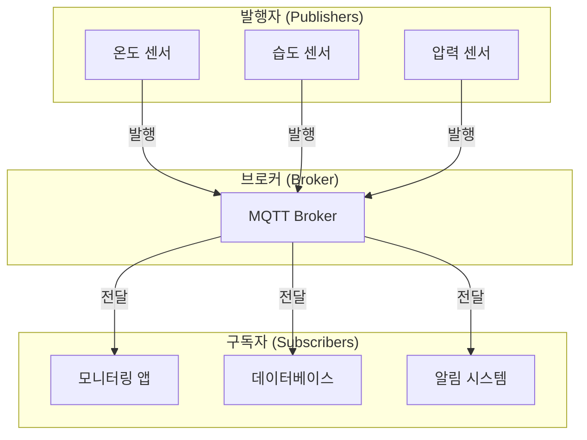
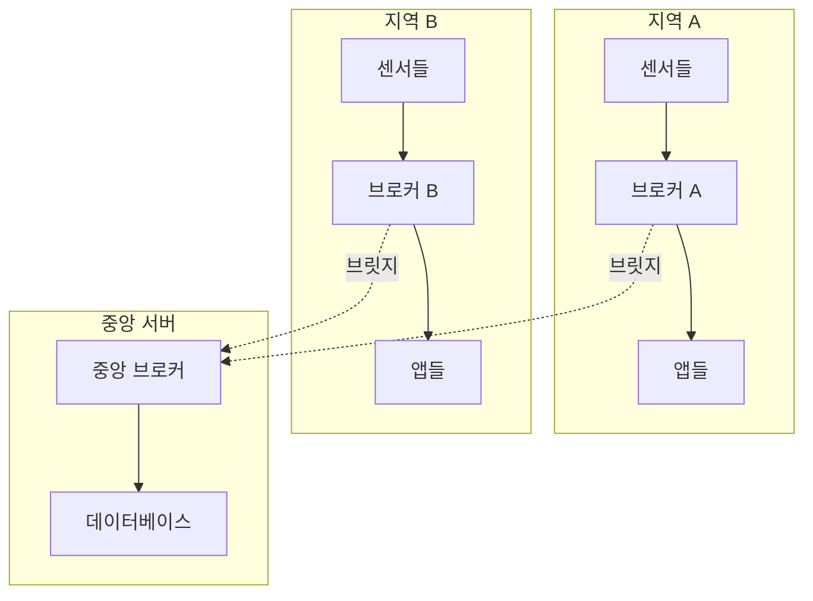

# MQTT (Message Queuing Telemetry Transport)

## 📋 목차
- [MQTT란 무엇인가?](#mqtt란-무엇인가)
- [MQTT가 필요한 이유](#mqtt가-필요한-이유)
- [MQTT의 핵심 개념](#mqtt의-핵심-개념)
- [MQTT 시스템 아키텍처](#mqtt-시스템-아키텍처)
- [QoS (Quality of Service)](#qos-quality-of-service)
- [MQTT 보안](#mqtt-보안)
- [다른 프로토콜과의 비교](#다른-프로토콜과의-비교)
- [실제 활용 사례](#실제-활용-사례)
- [MQTT의 장단점](#mqtt의-장단점)

---

## 🎯 MQTT란 무엇인가?

**MQTT (Message Queuing Telemetry Transport)**는 **경량 메시지 전송 프로토콜**로, IoT(사물인터넷) 환경에서 실시간 데이터 통신을 위해 설계된 프로토콜입니다.

### 📖 MQTT의 역사와 배경
- **1999년**: IBM의 Andy Stanford-Clark와 Arlen Nipper가 개발
- **원래 목적**: 석유 파이프라인 모니터링을 위한 위성 통신
- **2014년**: OASIS 표준으로 승인
- **2019년**: ISO/IEC 20922 국제 표준으로 채택

### 🔍 MQTT의 핵심 특징

#### 1. **경량성 (Lightweight)**
- **최소 헤더 크기**: 단 2바이트의 고정 헤더
- **최소 오버헤드**: 네트워크 대역폭 절약
- **빠른 처리**: CPU 사용량 최소화

#### 2. **실시간성 (Real-time)**
- **즉시 전달**: 메시지가 생성되면 즉시 전달
- **낮은 지연시간**: 밀리초 단위의 빠른 응답
- **이벤트 기반**: 데이터 변화 시 즉시 알림

#### 3. **저전력 (Low Power)**
- **배터리 효율성**: IoT 기기의 배터리 수명 연장
- **절전 모드 지원**: 필요할 때만 통신
- **최적화된 프로토콜**: 전력 소모 최소화

#### 4. **안정성 (Reliability)**
- **QoS 보장**: 메시지 전달 신뢰성 보장
- **연결 복구**: 네트워크 장애 시 자동 재연결
- **메시지 지속성**: 브로커에 메시지 저장 가능

---

## 🤔 MQTT가 필요한 이유

### 기존 통신 방식의 한계

#### 1. **HTTP의 한계점**
- **폴링 방식**: 클라이언트가 주기적으로 서버에 요청
- **높은 오버헤드**: HTTP 헤더가 크고 복잡
- **비효율적**: 실시간 데이터 전송에 부적합
- **배터리 소모**: 지속적인 요청으로 인한 전력 소모

#### 2. **전통적인 메시징의 문제점**
- **복잡성**: JMS, AMQP 등은 너무 복잡하고 무거움
- **리소스 요구사항**: 높은 메모리와 CPU 사용량
- **설정 복잡성**: 초기 설정과 관리가 어려움

### MQTT가 해결하는 문제들

#### 1. **실시간 통신의 필요성**
- **IoT 센서 데이터**: 온도, 습도, 압력 등 실시간 모니터링
- **스마트 홈**: 조명, 보안, 가전제품 제어
- **산업 자동화**: 공장 장비 상태 모니터링

#### 2. **제한된 리소스 환경**
- **저전력 기기**: 배터리로 동작하는 센서
- **제한된 대역폭**: 모바일 네트워크, 위성 통신
- **낮은 처리 능력**: 마이크로컨트롤러 기반 기기

---

## 🧠 MQTT의 핵심 개념

### 1. **발행/구독 (Publish/Subscribe) 패턴**

#### 📰 신문 구독 모델
발행/구독 패턴은 **신문 구독**과 같은 방식으로 작동합니다:

- **발행자 (Publisher)**: 신문사처럼 메시지를 생성하고 발행
- **구독자 (Subscriber)**: 독자처럼 관심 있는 주제를 구독
- **브로커 (Broker)**: 우체국처럼 메시지를 중계하고 배달

#### 🔄 작동 원리
1. **발행자가 메시지 생성**: 특정 주제로 메시지 발행
2. **브로커가 메시지 수신**: 발행된 메시지를 브로커가 받음
3. **구독자에게 전달**: 해당 주제를 구독하는 모든 클라이언트에게 전달

#### 💡 장점
- **느슨한 결합**: 발행자와 구독자가 서로를 모름
- **확장성**: 새로운 구독자 추가가 쉬움
- **유연성**: 동적으로 주제 구독/해제 가능

### 2. **브로커 (Broker)의 역할**

#### 📮 중앙 집중식 메시지 허브
브로커는 MQTT 시스템의 **심장**과 같은 역할을 합니다:

#### 🔧 주요 기능
- **메시지 라우팅**: 발행된 메시지를 적절한 구독자에게 전달
- **연결 관리**: 클라이언트 연결 상태 관리
- **세션 관리**: 클라이언트 세션 정보 유지
- **QoS 처리**: 메시지 전달 신뢰성 보장

#### 🏗️ 브로커 아키텍처
- **단일 브로커**: 소규모 시스템에 적합
- **브로커 클러스터**: 대규모 시스템의 고가용성
- **브로커 브릿지**: 여러 브로커 간 메시지 전달

### 3. **주제 (Topic) 시스템**

#### 🏷️ 계층적 주소 체계
주제는 메시지를 분류하는 **주소** 시스템입니다:

#### 📂 주제 구조
```
home/livingroom/temperature    # 거실 온도
home/kitchen/humidity          # 부엌 습도
car/gps/location              # 차량 위치
factory/machine/status        # 공장 기계 상태
```

#### 🎯 와일드카드 패턴
- **`+` (단일 레벨)**: 한 단계의 모든 주제
  - `home/+/temperature` → `home/livingroom/temperature`, `home/kitchen/temperature`
- **`#` (다중 레벨)**: 모든 하위 주제
  - `home/#` → `home`으로 시작하는 모든 주제

#### 💡 주제 설계 원칙
- **의미 있는 이름**: 주제 이름만으로도 내용 파악 가능
- **계층적 구조**: 관련 주제들을 그룹화
- **일관성**: 전체 시스템에서 일관된 명명 규칙

---

## 🏗️ MQTT 시스템 아키텍처

### 1. **기본 아키텍처**



### 2. **확장된 아키텍처**

#### 🔗 브로커 브릿지
여러 브로커를 연결하여 대규모 시스템 구축:



### 3. **클라우드 기반 아키텍처**

#### ☁️ 클라우드 MQTT 서비스
- **AWS IoT Core**: Amazon의 관리형 MQTT 서비스
- **Azure IoT Hub**: Microsoft의 IoT 플랫폼
- **Google Cloud IoT Core**: Google의 IoT 서비스

---

## 🎯 QoS (Quality of Service)

### 📦 택배 배송과 같은 개념
QoS는 **택배 배송 서비스**와 비슷한 개념입니다:

| QoS 레벨 | 택배 서비스 | 설명 | 특징 |
|----------|-------------|------|------|
| **0** | 일반 택배 | 한 번만 전송, 손실 가능 | 빠르지만 신뢰성 낮음 |
| **1** | 등기 택배 | 반드시 도착, 중복 가능 | 안정적이지만 중복 가능 |
| **2** | 특급 택배 | 정확히 한 번만 도착 | 가장 안전하지만 느림 |

### 🔍 QoS 레벨별 상세 분석

#### **QoS 0: At Most Once (최대 1회)**
- **특징**: "Fire and Forget" 방식
- **장점**: 가장 빠르고 효율적
- **단점**: 메시지 손실 가능성
- **사용 사례**: 실시간 센서 데이터, 온도/습도 등

#### **QoS 1: At Least Once (최소 1회)**
- **특징**: 메시지가 반드시 도착하지만 중복 가능
- **장점**: 안정적인 전달 보장
- **단점**: 중복 메시지 처리 필요
- **사용 사례**: 중요한 알림, 상태 변경 등

#### **QoS 2: Exactly Once (정확히 1회)**
- **특징**: 중복 없이 정확히 한 번만 전달
- **장점**: 가장 안전한 전달
- **단점**: 가장 느리고 복잡
- **사용 사례**: 결제 정보, 중요한 명령 등

### ⚖️ QoS 선택 가이드

#### 🚀 성능 우선 (QoS 0)
- 실시간 센서 데이터
- 주기적인 상태 업데이트
- 대량의 데이터 전송

#### 🛡️ 안정성 우선 (QoS 1)
- 중요한 알림
- 설정 변경 명령
- 상태 동기화

#### 🔒 정확성 우선 (QoS 2)
- 결제 정보
- 중요한 설정
- 중복이 허용되지 않는 데이터

---

## 🔒 MQTT 보안

### 🏠 집 보안과 같은 개념
MQTT 보안은 **집에 자물쇠를 다는 것**과 같습니다:

### 1. **인증 (Authentication)**

#### 🔑 사용자 인증
- **사용자명/비밀번호**: 기본적인 인증 방식
- **클라이언트 인증서**: X.509 인증서 기반 인증
- **JWT 토큰**: JSON Web Token 기반 인증

#### 🎫 토큰 기반 인증
- **OAuth 2.0**: 표준 인증 프로토콜
- **JWT**: 자체 포함된 토큰
- **API 키**: 간단한 키 기반 인증

### 2. **권한 부여 (Authorization)**

#### 📋 ACL (Access Control List)
- **주제별 권한**: 특정 주제에 대한 읽기/쓰기 권한
- **클라이언트별 권한**: 클라이언트별 접근 제어
- **역할 기반 권한**: 역할에 따른 권한 관리

### 3. **암호화 (Encryption)**

#### 🔐 TLS/SSL 보안
- **전송 암호화**: 데이터 전송 중 암호화
- **인증서 검증**: 서버 인증서 검증
- **Perfect Forward Secrecy**: 향후 보안 보장

#### 🛡️ 보안 모범 사례
- **강력한 비밀번호**: 복잡한 비밀번호 사용
- **정기적 업데이트**: 보안 패치 정기 적용
- **네트워크 분리**: VPN 또는 전용 네트워크 사용
- **모니터링**: 보안 이벤트 모니터링

---

## ⚖️ 다른 프로토콜과의 비교

### 📞 전화 vs 문자메시지 vs 이메일

| 특징 | MQTT | HTTP | WebSocket | AMQP |
|------|------|------|-----------|------|
| **통신 방식** | 발행/구독 | 요청/응답 | 양방향 | 발행/구독 |
| **연결** | 지속적 | 요청 시마다 | 지속적 | 지속적 |
| **헤더 크기** | 2바이트 | 수백 바이트 | 2-14바이트 | 수십 바이트 |
| **실시간성** | ✅ 우수 | ❌ 제한적 | ✅ 우수 | ✅ 우수 |
| **배터리 효율** | ✅ 우수 | ❌ 낮음 | ⚠️ 보통 | ⚠️ 보통 |
| **IoT 적합성** | ✅ 최적 | ❌ 부적합 | ⚠️ 보통 | ⚠️ 보통 |
| **복잡성** | ✅ 간단 | ✅ 간단 | ⚠️ 보통 | ❌ 복잡 |

### 🔍 상세 비교

#### **MQTT vs HTTP**
- **MQTT**: 실시간, 저전력, 경량
- **HTTP**: 범용적, 표준화, 웹 친화적

#### **MQTT vs WebSocket**
- **MQTT**: IoT 특화, QoS 보장, 브로커 기반
- **WebSocket**: 웹 특화, 직접 연결, 브라우저 지원

#### **MQTT vs AMQP**
- **MQTT**: 단순, 경량, IoT 최적화
- **AMQP**: 복잡, 기능 풍부, 엔터프라이즈급

---

## 🌟 실제 활용 사례

### 1. **스마트 홈 시스템**

#### 🏠 홈 오토메이션
- **환경 모니터링**: 온도, 습도, 공기질 센서
- **보안 시스템**: 문/창문 센서, 카메라, 알림
- **가전제품 제어**: 조명, 에어컨, 난방 시스템
- **에너지 관리**: 전력 사용량 모니터링

#### 💡 작동 원리
1. **센서 데이터 수집**: 각종 센서가 실시간 데이터 발행
2. **중앙 브로커**: 모든 데이터를 중앙에서 관리
3. **스마트 앱**: 사용자가 원격으로 제어
4. **자동화**: 설정된 규칙에 따른 자동 제어

### 2. **산업 IoT (IIoT)**

#### 🏭 스마트 팩토리
- **장비 모니터링**: 공장 장비의 상태 실시간 감시
- **예측 정비**: 데이터 분석을 통한 고장 예측
- **품질 관리**: 생산 과정의 품질 실시간 모니터링
- **에너지 최적화**: 전력 사용량 최적화

#### 🔧 작동 원리
1. **센서 네트워크**: 공장 내 모든 장비에 센서 설치
2. **데이터 수집**: MQTT를 통한 실시간 데이터 전송
3. **분석 플랫폼**: 빅데이터 분석을 통한 인사이트 도출
4. **자동화 시스템**: 분석 결과에 따른 자동 제어

### 3. **스마트 시티**

#### 🏙️ 도시 인프라 관리
- **교통 관리**: 신호등, 교통량 모니터링
- **환경 모니터링**: 대기질, 소음, 온도 측정
- **에너지 관리**: 스마트 그리드, 재생 에너지
- **공공 안전**: CCTV, 긴급 상황 대응

### 4. **의료 IoT**

#### 🏥 헬스케어 시스템
- **환자 모니터링**: 생체 신호 실시간 감시
- **원격 진료**: 의사와 환자 간 실시간 소통
- **의료기기 관리**: 병원 내 의료기기 상태 모니터링
- **응급 상황 대응**: 위험 상황 자동 감지 및 알림

### 5. **농업 IoT**

#### 🌾 스마트 팜
- **환경 모니터링**: 토양, 기상 조건 측정
- **자동 관수**: 토양 수분에 따른 자동 관수
- **작물 관리**: 성장 상태 모니터링
- **해충 방제**: 해충 감지 및 자동 방제

---

## 📊 MQTT의 장단점

### ✅ 장점

#### 1. **경량성과 효율성**
- **최소 오버헤드**: 2바이트 헤더로 네트워크 효율성 극대화
- **빠른 처리**: CPU 사용량 최소화로 저전력 기기에 적합
- **대역폭 절약**: 제한된 네트워크 환경에서도 효율적

#### 2. **실시간성**
- **즉시 전달**: 메시지 생성 즉시 구독자에게 전달
- **낮은 지연시간**: 밀리초 단위의 빠른 응답
- **이벤트 기반**: 데이터 변화 시 즉시 반응

#### 3. **확장성**
- **수평 확장**: 브로커 클러스터링으로 대규모 시스템 구축
- **유연한 아키텍처**: 다양한 시스템과 쉽게 통합
- **동적 구독**: 런타임에 주제 구독/해제 가능

#### 4. **신뢰성**
- **QoS 보장**: 메시지 전달 신뢰성 보장
- **연결 복구**: 네트워크 장애 시 자동 재연결
- **메시지 지속성**: 브로커에 메시지 저장 가능

### ❌ 단점

#### 1. **제한된 기능**
- **단순한 메시징**: 복잡한 메시지 라우팅 기능 부족
- **제한된 데이터 타입**: 주로 텍스트 기반 메시지
- **트랜잭션 부족**: 복잡한 트랜잭션 처리 어려움

#### 2. **보안 고려사항**
- **기본 보안 부족**: 추가 보안 설정 필요
- **인증 복잡성**: 강력한 보안을 위한 복잡한 설정
- **암호화 오버헤드**: TLS 사용 시 성능 저하

#### 3. **운영 복잡성**
- **브로커 의존성**: 브로커 장애 시 전체 시스템 영향
- **모니터링 필요**: 브로커 상태 지속적 모니터링 필요
- **설정 관리**: 대규모 시스템의 설정 관리 복잡성

#### 4. **제한된 표준화**
- **브로커 호환성**: 브로커별 구현 차이
- **클라이언트 라이브러리**: 언어별 라이브러리 품질 차이
- **디버깅 어려움**: 분산 시스템의 디버깅 복잡성

---

## 🎯 결론

MQTT는 **IoT 시대의 핵심 통신 프로토콜**로, 실시간 데이터 전송이 필요한 다양한 분야에서 널리 사용되고 있습니다. 

### 🌟 MQTT의 핵심 가치
- **경량성**: 제한된 리소스 환경에서도 효율적
- **실시간성**: 즉시 반응이 필요한 시스템에 최적
- **확장성**: 대규모 IoT 시스템 구축 가능
- **신뢰성**: 안정적인 메시지 전달 보장

### 🚀 미래 전망
- **5G 네트워크**: 초고속, 초저지연 통신과의 결합
- **엣지 컴퓨팅**: 분산 처리 환경에서의 활용
- **AI/ML 통합**: 실시간 데이터 분석과의 연동
- **표준화 발전**: 더욱 강화된 보안과 기능

MQTT는 단순하면서도 강력한 프로토콜로, IoT 생태계의 성장과 함께 더욱 중요한 역할을 할 것으로 예상됩니다.