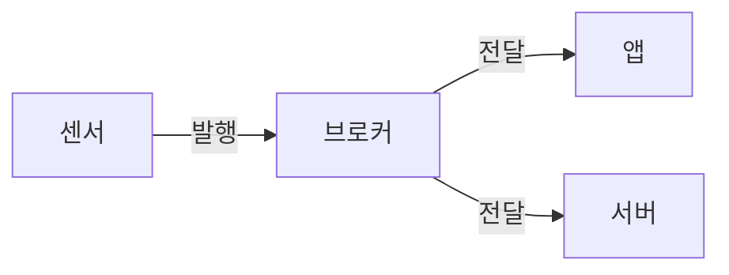

# MQTT (Message Queuing Telemetry Transport)

## 배경
- [MQTT란?](#mqtt란)
- [MQTT가 필요한 이유](#mqtt가-필요한-이유)
- [MQTT의 핵심 개념](#mqtt의-핵심-개념)
- [MQTT 시스템 구성](#mqtt-시스템-구성)
- [MQTT 설치 및 기본 사용법](#mqtt-설치-및-기본-사용법)
- [Node.js에서 MQTT 사용하기](#nodejs에서-mqtt-사용하기)
- [MQTT QoS 이해하기](#mqtt-qos-이해하기)
- [MQTT 보안](#mqtt-보안)
- [MQTT vs HTTP 비교](#mqtt-vs-http-비교)
- [실제 활용 사례](#실제-활용-사례)

---

프로토콜은 컴퓨터들이 서로 통신할 때 사용하는 **규칙과 약속**입니다. 마치 사람들이 대화할 때 문법과 예의를 지키는 것처럼, 컴퓨터들도 정해진 규칙에 따라 데이터를 주고받습니다.

**예시**: HTTP는 웹사이트를 볼 때 사용하는 프로토콜이고, MQTT는 실시간 메시지를 주고받을 때 사용하는 프로토콜입니다.


| 구성 요소 | 역할 | 예시 |
|-----------|------|------|
| **브로커 (Broker)** | 메시지 중개 서버 | 우체국, 중계소 |
| **발행자 (Publisher)** | 메시지를 보내는 클라이언트 | 센서, 앱 |
| **구독자 (Subscriber)** | 메시지를 받는 클라이언트 | 모니터링 앱, 서버 |



---

mosquitto

mosquitto -v
```

### 3. 기본 명령어 사용법

**메시지 발행**
```bash

mosquitto_pub -h localhost -t "home/temperature" -m "25.5"

mosquitto_pub -h localhost -t "home/humidity" -m "60%"
```

**메시지 구독**
```bash

mosquitto_sub -h localhost -t "home/temperature"

mosquitto_sub -h localhost -t "home/+/temperature"
```

---


## 💻 Node.js에서 MQTT 사용하기

### 1. 라이브러리 설치
```bash
npm install mqtt
```

### 2. 기본 연결 및 사용법

**발행자 (Publisher) 예제**
```javascript
const mqtt = require('mqtt');

// 브로커에 연결
const client = mqtt.connect('mqtt://localhost');

// 연결 성공 시
client.on('connect', () => {
  console.log('브로커에 연결되었습니다!');
  
  // 온도 데이터 발행
  client.publish('home/temperature', '25.5°C');
  console.log('온도 데이터를 발행했습니다.');
  
  // 연결 종료
  client.end();
});

// 연결 실패 시
client.on('error', (error) => {
  console.error('연결 오류:', error);
});
```

**구독자 (Subscriber) 예제**
```javascript
const mqtt = require('mqtt');

// 브로커에 연결
const client = mqtt.connect('mqtt://localhost');

// 연결 성공 시
client.on('connect', () => {
  console.log('브로커에 연결되었습니다!');
  
  // 온도 주제 구독
  client.subscribe('home/temperature');
  console.log('온도 주제를 구독했습니다.');
});

// 메시지 수신 시
client.on('message', (topic, message) => {
  console.log(`주제: ${topic}`);
  console.log(`메시지: ${message.toString()}`);
  
  // 온도가 30도 이상이면 경고
  const temperature = parseFloat(message);
  if (temperature > 30) {
    console.log('⚠️ 온도가 너무 높습니다!');
  }
});

// 연결 실패 시
client.on('error', (error) => {
  console.error('연결 오류:', error);
});
```

### 3. 와일드카드 사용법

**와일드카드란?**
와일드카드는 여러 주제를 한 번에 구독할 때 사용하는 **특수 기호**입니다. 파일 시스템의 `*` 기호와 비슷한 개념입니다.

- `+`: 한 단계의 모든 주제 (예: `home/+/temperature`는 `home/livingroom/temperature`, `home/kitchen/temperature` 등을 모두 구독)
- `#`: 모든 하위 주제 (예: `home/#`는 `home`으로 시작하는 모든 주제를 구독)

```javascript
// 모든 방의 온도 구독
// home/livingroom/temperature, home/kitchen/temperature 등 모두 구독
client.subscribe('home/+/temperature');

// home으로 시작하는 모든 주제 구독
// home/temperature, home/humidity, home/livingroom/temperature 등 모두 구독
client.subscribe('home/#');

client.on('message', (topic, message) => {
  console.log(`${topic}: ${message}`);
});
```

---

## 🎯 MQTT QoS 이해하기

**QoS (Quality of Service)**는 메시지 전달의 신뢰성을 보장하는 수준입니다.

QoS는 **택배 배송**과 비슷한 개념입니다. 일반 택배(0), 등기 택배(1), 특급 택배(2)처럼 신뢰성 수준을 선택할 수 있습니다.

### QoS 레벨별 특징

| QoS | 이름 | 설명 | 사용 시기 |
|-----|------|------|-----------|
| **0** | 최선 전송 | 한 번만 전송, 손실 가능 | 빠른 전송이 중요한 경우 |
| **1** | 최소 1회 전송 | 반드시 도착, 중복 가능 | 안정성이 중요한 경우 |
| **2** | 정확히 1회 전송 | 중복 없이 한 번만 도착 | 정확성이 중요한 경우 |

### QoS 설정 예제
```javascript
// 발행 시 QoS 설정
client.publish('home/temperature', '25.5°C', { qos: 1 });

// 구독 시 QoS 설정
client.subscribe('home/temperature', { qos: 2 });

// 연결 시 기본 QoS 설정
const client = mqtt.connect('mqtt://localhost', {
  qos: 1
});
```

---

## 🔒 MQTT 보안

MQTT 보안은 **집에 자물쇠를 다는 것**과 같습니다. 기본적으로는 누구나 들어올 수 있지만, 보안을 설정하면 인증된 사용자만 접근할 수 있습니다.

### 1. 기본 인증
사용자 이름과 비밀번호를 사용한 기본적인 보안 방법입니다.

```javascript
const client = mqtt.connect('mqtt://localhost', {
  username: 'myuser',
  password: 'mypassword'
});
```

### 2. TLS/SSL 보안 연결
데이터를 암호화해서 전송하는 고급 보안 방법입니다. HTTPS와 같은 개념입니다.

```javascript
const client = mqtt.connect('mqtts://broker.example.com', {
  port: 8883,
  username: 'myuser',
  password: 'mypassword',
  rejectUnauthorized: false
});
```

### 3. 보안 설정 파일 (mosquitto.conf)
브로커 서버에서 보안을 설정하는 방법입니다.

```conf

allow_anonymous false
password_file /etc/mosquitto/passwd


**HTTP 방식 (폴링)**
HTTP는 **문자메시지**처럼 매번 새로운 요청을 보내야 합니다.

```javascript
// 매 5초마다 서버에 요청
setInterval(() => {
  fetch('/api/temperature')
    .then(response => response.json())
    .then(data => console.log(data));
}, 5000);
```

**MQTT 방식 (실시간)**
MQTT는 **전화**처럼 한 번 연결하면 실시간으로 대화할 수 있습니다.

```javascript
// 한 번 연결로 실시간 수신
client.subscribe('home/temperature');
client.on('message', (topic, message) => {
  console.log(`실시간 온도: ${message}`);
});
```

---


### 1. 스마트 홈 시스템
집 안의 센서들이 실시간으로 데이터를 보내고, 스마트폰 앱에서 이를 받아서 모니터링하는 시스템입니다.

```javascript
// 온도 센서 (발행자) - 집 안에 설치된 센서
const temperatureSensor = mqtt.connect('mqtt://localhost');

setInterval(() => {
  const temp = Math.random() * 10 + 20; // 20-30도
  temperatureSensor.publish('home/temperature', temp.toString());
}, 5000);

// 스마트폰 앱 (구독자) - 사용자가 들고 다니는 앱
const phoneApp = mqtt.connect('mqtt://localhost');
phoneApp.subscribe('home/#');

phoneApp.on('message', (topic, message) => {
  if (topic === 'home/temperature') {
    updateTemperatureDisplay(message);
  }
});
```

### 2. 실시간 채팅
카카오톡이나 슬랙 같은 실시간 메시징 서비스에서 사용하는 방식입니다.

```javascript
// 채팅 메시지 발행 - 사용자가 메시지를 보낼 때
function sendMessage(room, message) {
  client.publish(`chat/${room}`, JSON.stringify({
    user: '사용자명',
    message: message,
    timestamp: Date.now()
  }));
}

// 채팅 메시지 구독 - 다른 사용자들이 메시지를 받을 때
client.subscribe('chat/lobby');
client.on('message', (topic, message) => {
  const data = JSON.parse(message);
  displayMessage(data.user, data.message);
});
```

### 3. IoT 센서 네트워크
공장이나 농장에서 여러 센서들의 데이터를 한 곳에서 모아서 분석하는 시스템입니다.

```javascript
// 다양한 센서 데이터 수집
const sensors = ['temperature', 'humidity', 'pressure', 'light'];

sensors.forEach(sensor => {
  client.subscribe(`sensor/${sensor}`);
});

client.on('message', (topic, message) => {
  const [category, sensorType] = topic.split('/');
  console.log(`${sensorType} 센서: ${message}`);
  
  // 데이터베이스에 저장
  saveToDatabase(sensorType, message);
});
```


## 🎯 MQTT란?

**MQTT (Message Queuing Telemetry Transport)**는 **가벼운 메시지 전송 프로토콜**입니다.

### 🔍 MQTT의 특징
- **가벼움**: 최소한의 데이터만 사용해서 빠르고 효율적
- **실시간**: 메시지를 즉시 전달
- **저전력**: 배터리 소모가 적어서 IoT 기기에 적합
- **안정성**: 네트워크가 불안정해도 메시지 전달 보장

---

## 🤔 MQTT가 필요한 이유

### 기존 HTTP의 한계
```javascript
// HTTP 방식 - 매번 새로운 연결 필요
fetch('/api/temperature')
  .then(response => response.json())
  .then(data => console.log(data));

// 문제점: 실시간 업데이트가 어려움
// 매번 서버에 요청해야 함
```

### MQTT의 장점
```javascript
// MQTT 방식 - 한 번 연결로 지속적 통신
const client = mqtt.connect('mqtt://localhost');
client.subscribe('home/temperature');

client.on('message', (topic, message) => {
  console.log(`실시간 온도: ${message}`);
});
// 장점: 서버가 자동으로 새로운 데이터를 보내줌
```

---

## 🧠 MQTT의 핵심 개념

### 1. 발행/구독 (Publish/Subscribe) 패턴

**📰 신문 구독과 비슷한 개념**

발행/구독 패턴은 **신문 구독**과 같은 방식입니다. 신문사(발행자)가 신문을 발행하면, 구독자들이 자동으로 받아보는 것처럼, MQTT에서도 메시지를 보내는 쪽과 받는 쪽이 분리되어 있습니다.

```javascript
// 발행자 (Publisher) - 신문사 역할
client.publish('news/technology', '새로운 AI 기술 발표');

// 구독자 (Subscriber) - 독자 역할
client.subscribe('news/technology');
client.on('message', (topic, message) => {
  console.log(`새로운 뉴스: ${message}`);
});
```

### 2. 브로커 (Broker)
**📮 우체국과 같은 역할**

브로커는 **우체국**과 같은 중간 역할을 합니다. 발행자가 메시지를 브로커에 보내면, 브로커가 해당 주제를 구독하는 모든 클라이언트에게 메시지를 전달합니다.

- 발행자가 보낸 메시지를 받아서
- 해당 주제를 구독하는 사람들에게 전달

### 3. 주제 (Topic)
**🏷️ 메시지의 분류 체계**

주제는 메시지를 분류하는 **주소** 같은 개념입니다. 계층 구조로 되어 있어서 관련된 메시지들을 쉽게 그룹화할 수 있습니다.

```javascript
// 주제 구조 예시
'home/livingroom/temperature'  // 거실 온도
'home/kitchen/humidity'        // 부엌 습도
'car/gps/location'             // 차량 위치
'factory/machine/status'       // 공장 기계 상태
```

---

## 🏗️ MQTT 시스템 구성

## ⚙️ MQTT 설치 및 기본 사용법

### 1. Mosquitto 브로커 설치

**macOS (Homebrew 사용)**
```bash
brew install mosquitto
```

**Ubuntu/Debian**
```bash
sudo apt update
sudo apt install mosquitto mosquitto-clients
```

### 2. 브로커 실행
```bash
# SSL/TLS 설정
listener 8883
certfile /etc/mosquitto/certs/server.crt
keyfile /etc/mosquitto/certs/server.key
```

---

## ⚖️ MQTT vs HTTP 비교

MQTT와 HTTP는 각각 다른 용도에 특화된 프로토콜입니다. **전화와 문자메시지**의 차이와 비슷합니다.

| 특징 | MQTT | HTTP |
|------|------|------|
| **통신 방식** | 발행/구독 | 요청/응답 |
| **연결** | 지속적 연결 | 요청 시마다 연결 |
| **데이터 크기** | 작음 (헤더 2바이트) | 큼 (헤더 수백 바이트) |
| **실시간성** | ✅ 우수 | ❌ 제한적 |
| **배터리 효율** | ✅ 우수 | ❌ 낮음 |
| **IoT 적합성** | ✅ 최적 | ❌ 부적합 |

