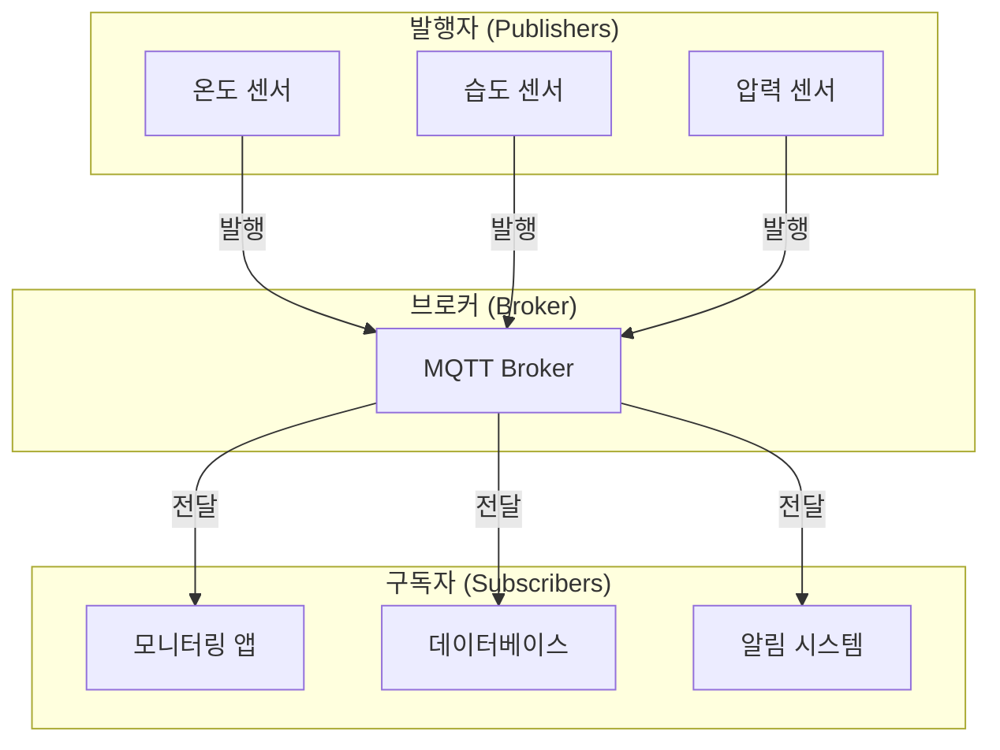
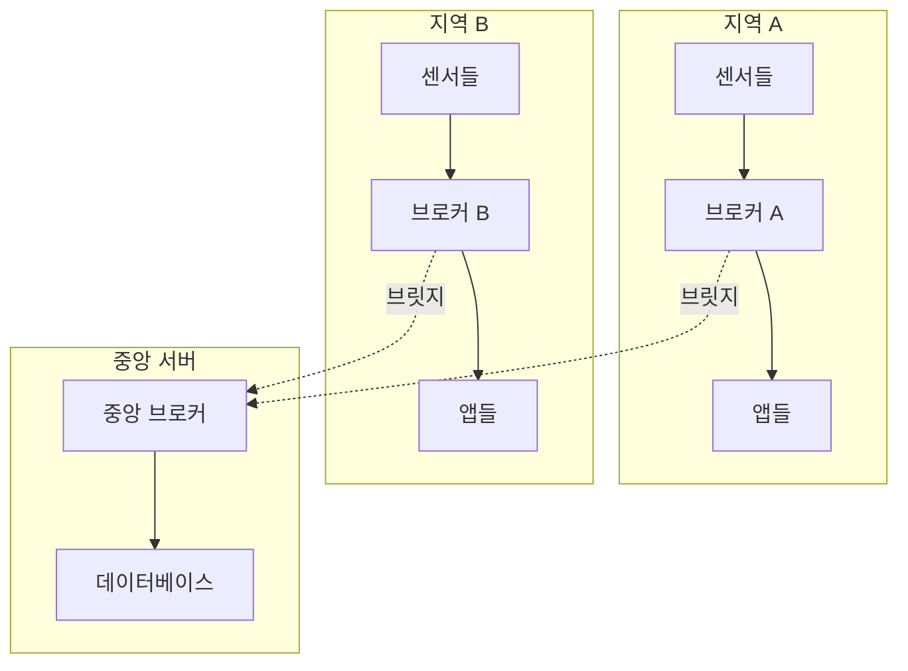

# MQTT (Message Queuing Telemetry Transport)

## 📋 목차
- [MQTT란 무엇인가?](#mqtt란-무엇인가)
- [MQTT가 필요한 이유](#mqtt가-필요한-이유)
- [MQTT의 핵심 개념](#mqtt의-핵심-개념)
- [MQTT 시스템 아키텍처](#mqtt-시스템-아키텍처)
- [QoS (Quality of Service)](#qos-quality-of-service)
- [MQTT 보안](#mqtt-보안)
- [다른 프로토콜과의 비교](#다른-프로토콜과의-비교)
- [MQTT vs Apache Kafka 상세 비교](#mqtt-vs-apache-kafka-상세-비교)
- [실제 활용 사례](#실제-활용-사례)
- [MQTT의 장단점](#mqtt의-장단점)
- [성능 튜닝 및 최적화](#성능-튜닝-및-최적화)
- [문제 해결 및 디버깅](#문제-해결-및-디버깅)
- [추가 학습 자료](#추가-학습-자료)

---

## MQTT란 무엇인가?

**MQTT (Message Queuing Telemetry Transport)**는 **경량 메시지 전송 프로토콜**로, IoT(사물인터넷) 환경에서 실시간 데이터 통신을 위해 설계된 프로토콜입니다.

### 📖 MQTT의 역사와 배경
- **1999년**: IBM의 Andy Stanford-Clark와 Arlen Nipper가 개발
- **원래 목적**: 석유 파이프라인 모니터링을 위한 위성 통신
- **2014년**: OASIS 표준으로 승인 (MQTT 3.1.1)
- **2019년**: ISO/IEC 20922 국제 표준으로 채택
- **2019년**: MQTT 5.0 발표 (향상된 기능과 성능)

### MQTT 버전별 주요 차이점

| 특징 | **MQTT 3.1** | **MQTT 3.1.1** | **MQTT 5.0** |
|------|-------------|---------------|-------------|
| **발표년도** | 2010년 | 2014년 | 2019년 |
| **메시지 속성** | 제한적 | 제한적 | 확장 가능 |
| **세션 만료** | ❌ | ❌ | ✅ |
| **서버 재시작** | ❌ | ❌ | ✅ |
| **사용자 속성** | ❌ | ❌ | ✅ |
| **응답 주제** | ❌ | ❌ | ✅ |
| **공유 구독** | ❌ | ❌ | ✅ |
| **메시지 만료** | ❌ | ❌ | ✅ |

### 🆕 MQTT 5.0의 주요 개선사항

MQTT 5.0은 이전 버전의 한계를 극복하고 현대적인 IoT 환경의 요구사항을 충족하기 위해 많은 새로운 기능을 추가했습니다.

#### 1. **세션 만료 간격 (Session Expiry Interval)**

**문제점 (3.1.1):**
Persistent Session은 클라이언트가 영원히 재연결하지 않아도 브로커에 남아 있어 메모리를 낭비했습니다.

**해결 (5.0):**
세션의 수명을 초 단위로 지정할 수 있습니다.

```javascript
const client = mqtt.connect('mqtt://broker', {
  clientId: 'sensor001',
  clean: false,
  properties: {
    sessionExpiryInterval: 3600  // 1시간 후 세션 만료
  }
});
```

**동작 방식:**
```
연결 → 정상 동작 → 연결 끊김 → 1시간 대기
                                ↓
                    세션 자동 삭제 (메모리 해제)
```

**사용 사례:**
- 임시 기기 (1시간 만료)
- 모바일 앱 (24시간 만료)
- 영구 기기 (0 = 무제한)

#### 2. **요청/응답 패턴 (Request/Response)**

**문제점 (3.1.1):**
요청-응답 패턴을 구현하려면 복잡한 주제 명명 규칙과 상관관계 ID가 필요했습니다.

**해결 (5.0):**
응답 주제(Response Topic)와 상관관계 데이터(Correlation Data)를 표준으로 지원합니다.

```javascript
// 요청 보내기
client.publish('device/command', 'getData', {
  properties: {
    responseTopic: 'app/response/12345',  // 응답받을 주제
    correlationData: Buffer.from('req-001')  // 요청 식별자
  }
});

// 응답 구독
client.subscribe('app/response/12345');

client.on('message', (topic, message, packet) => {
  if (packet.properties.correlationData) {
    const reqId = packet.properties.correlationData.toString();
    console.log(`요청 ${reqId}의 응답:`, message.toString());
  }
});
```

**동작 흐름:**
```
앱 → [요청 + responseTopic + correlationData] → 기기
                                                  ↓
                                             요청 처리
                                                  ↓
앱 ← [응답 + correlationData] ← responseTopic ← 기기
```

#### 3. **메시지 만료 (Message Expiry Interval)**

**문제점 (3.1.1):**
오래된 메시지도 영원히 큐에 남아 시간에 민감한 데이터가 무의미해질 수 있었습니다.

**해결 (5.0):**
메시지에 유효 시간을 설정할 수 있습니다.

```javascript
// 5분 후 만료되는 메시지
client.publish('sensor/alert', '긴급 알림', {
  qos: 1,
  properties: {
    messageExpiryInterval: 300  // 300초 = 5분
  }
});
```

**동작 방식:**
```
T=0: 메시지 발행 (만료 시간: 300초)
T=60: 클라이언트 오프라인 (큐에 저장)
T=240: 클라이언트 재연결 → 메시지 전달 (남은 시간: 60초)
T=350: 만료되어 삭제 (미전달 시)
```

**사용 사례:**
- 실시간 경고 (60초 만료)
- 이벤트 알림 (300초 만료)
- 긴급 명령 (30초 만료)

#### 4. **공유 구독 (Shared Subscriptions)**

**문제점 (3.1.1):**
같은 주제를 구독하는 모든 클라이언트가 같은 메시지를 받아 중복 처리가 발생했습니다.

**해결 (5.0):**
메시지를 여러 구독자에게 분산하여 로드 밸런싱이 가능합니다.

```javascript
// 일반 구독 (모든 클라이언트가 메시지를 받음)
client1.subscribe('sensor/data');
client2.subscribe('sensor/data');
client3.subscribe('sensor/data');
// → 1개 메시지 발행 시, 3개 클라이언트 모두 받음

// 공유 구독 (메시지가 분산됨)
client1.subscribe('$share/workers/sensor/data');
client2.subscribe('$share/workers/sensor/data');
client3.subscribe('$share/workers/sensor/data');
// → 1개 메시지 발행 시, 1개 클라이언트만 받음 (로드 밸런싱)
```

**주제 형식:**
```
$share/{그룹이름}/{실제주제}
```

**분산 방식:**
```
메시지 1 → 브로커 → Worker 1
메시지 2 → 브로커 → Worker 2
메시지 3 → 브로커 → Worker 3
메시지 4 → 브로커 → Worker 1 (라운드 로빈)
```

**사용 사례:**
```javascript
// 작업 큐 패턴
// 여러 워커가 작업을 분산 처리
worker1.subscribe('$share/job-processors/jobs/new');
worker2.subscribe('$share/job-processors/jobs/new');
worker3.subscribe('$share/job-processors/jobs/new');

// 메시지 발행
publisher.publish('jobs/new', JSON.stringify({
  taskId: 123,
  type: 'process-image'
}));
// → 3개 워커 중 1개만 처리
```

**장점:**
- 수평 확장 (워커 추가로 처리량 증가)
- 자동 로드 밸런싱
- 장애 허용 (워커 다운 시 다른 워커가 처리)

#### 5. **사용자 속성 (User Properties)**

**문제점 (3.1.1):**
메타데이터를 페이로드에 포함시켜야 했고, 이는 애플리케이션 로직과 혼재되었습니다.

**해결 (5.0):**
키-값 쌍으로 임의의 메타데이터를 추가할 수 있습니다.

```javascript
client.publish('sensor/temperature', '25.5', {
  properties: {
    userProperties: {
      deviceId: 'sensor-001',
      location: 'building-A',
      firmware: 'v2.1.0',
      timestamp: Date.now().toString()
    }
  }
});

// 수신 측
client.on('message', (topic, message, packet) => {
  const temp = message.toString();
  const props = packet.properties.userProperties;
  
  console.log(`${props.deviceId}의 온도: ${temp}°C`);
  console.log(`위치: ${props.location}`);
});
```

**장점:**
- 페이로드와 메타데이터 분리
- 표준화된 메타데이터 전달
- 라우팅 및 필터링 용이

#### 6. **이유 코드와 이유 문자열 (Reason Code & Reason String)**

**문제점 (3.1.1):**
연결 실패나 구독 거부 시 이유를 파악하기 어려웠습니다.

**해결 (5.0):**
모든 응답 패킷에 상세한 이유 코드와 설명이 포함됩니다.

```javascript
client.on('connect', (connack) => {
  console.log('연결 성공');
  console.log('Reason Code:', connack.reasonCode);
  console.log('Session Present:', connack.sessionPresent);
});

client.on('error', (err) => {
  console.error('오류:', err.message);
  // Reason Codes:
  // 0x00: Success
  // 0x80: Unspecified error
  // 0x81: Malformed Packet
  // 0x82: Protocol Error
  // 0x84: Unsupported Protocol Version
  // 0x85: Client Identifier not valid
  // 0x86: Bad User Name or Password
  // 0x87: Not authorized
  // 0x88: Server unavailable
  // 0x89: Server busy
  // 0x8A: Banned
  // 0x8C: Bad authentication method
});
```

**구독 실패 예시:**
```javascript
client.subscribe('forbidden/topic', (err, granted) => {
  granted.forEach(g => {
    console.log(`주제: ${g.topic}`);
    console.log(`QoS: ${g.qos}`);
    console.log(`Reason Code: ${g.reasonCode}`);
    // 0x00: Success
    // 0x80: Unspecified error
    // 0x87: Not authorized
    // 0x91: Topic Filter invalid
  });
});
```

#### 7. **서버 기능 알림 (Server Capabilities)**

**문제점 (3.1.1):**
클라이언트가 브로커의 제약사항을 알 수 없어 런타임 오류가 발생했습니다.

**해결 (5.0):**
브로커가 CONNACK에서 자신의 기능과 제한을 알려줍니다.

```javascript
client.on('connect', (connack) => {
  const props = connack.properties || {};
  
  console.log('브로커 정보:');
  console.log('- 최대 패킷 크기:', props.maximumPacketSize);
  console.log('- 최대 QoS:', props.maximumQoS);
  console.log('- Retain 지원:', props.retainAvailable);
  console.log('- 공유 구독 지원:', props.sharedSubscriptionAvailable);
  console.log('- 구독 ID 지원:', props.subscriptionIdentifiersAvailable);
  console.log('- 와일드카드 구독 지원:', props.wildcardSubscriptionAvailable);
});
```

**클라이언트는 이 정보로 동작을 조정:**
```javascript
if (connack.properties.maximumQoS < 2) {
  // QoS 2를 사용할 수 없으므로 QoS 1로 대체
  console.log('QoS 2 미지원, QoS 1 사용');
  client.publish('topic', 'message', { qos: 1 });
}
```

#### 8. **플로우 제어 (Flow Control)**

**문제점 (3.1.1):**
브로커나 클라이언트가 과부하 상태여도 메시지가 계속 전송되어 리소스가 고갈될 수 있었습니다.

**해결 (5.0):**
수신 최대값(Receive Maximum)으로 동시에 처리할 수 있는 QoS 1/2 메시지 수를 제한합니다.

```javascript
const client = mqtt.connect('mqtt://broker', {
  properties: {
    receiveMaximum: 10  // 최대 10개의 미확인 메시지만 수신
  }
});
```

**동작 방식:**
```
브로커가 receiveMaximum = 10 설정
  ↓
클라이언트는 최대 10개의 QoS 1/2 메시지만 전송
  ↓
클라이언트가 PUBACK/PUBCOMP를 받으면
  ↓
다음 메시지 전송 (슬라이딩 윈도우)
```

#### 9. **주제 별칭 (Topic Aliases)**

**문제점 (3.1.1):**
긴 주제 이름은 매번 전송되어 대역폭을 낭비했습니다.

**해결 (5.0):**
주제 이름을 짧은 정수로 매핑하여 대역폭을 절약합니다.

```javascript
// 첫 번째 메시지: 주제 이름과 별칭 설정
client.publish('building/floor3/room301/sensor/temperature', '25', {
  properties: {
    topicAlias: 1
  }
});

// 이후 메시지: 별칭만 사용 (주제 이름 생략)
client.publish('', '26', {  // 빈 주제 이름
  properties: {
    topicAlias: 1  // 별칭 1 = 위 긴 주제
  }
});
```

**대역폭 절약:**
```
일반 방식:
  메시지 1: 45바이트 주제 + 2바이트 데이터 = 47바이트
  메시지 2: 45바이트 주제 + 2바이트 데이터 = 47바이트
  총: 94바이트

별칭 사용:
  메시지 1: 45바이트 주제 + 2바이트 별칭 + 2바이트 데이터 = 49바이트
  메시지 2: 2바이트 별칭 + 2바이트 데이터 = 4바이트
  총: 53바이트 (43% 절약!)
```

#### 10. **구독 식별자 (Subscription Identifiers)**

**문제점 (3.1.1):**
여러 주제를 구독할 때 어떤 구독으로 메시지가 왔는지 알기 어려웠습니다.

**해결 (5.0):**
각 구독에 ID를 할당하여 추적할 수 있습니다.

```javascript
// 구독 1: 온도 센서
client.subscribe('sensor/+/temperature', {
  properties: {
    subscriptionIdentifier: 100
  }
});

// 구독 2: 모든 센서
client.subscribe('sensor/#', {
  properties: {
    subscriptionIdentifier: 200
  }
});

// 메시지 수신
client.on('message', (topic, message, packet) => {
  const subIds = packet.properties.subscriptionIdentifier;
  
  if (subIds.includes(100)) {
    console.log('온도 센서 구독으로 수신');
  }
  if (subIds.includes(200)) {
    console.log('전체 센서 구독으로 수신');
  }
});
```

### Keep-Alive 메커니즘

Keep-Alive는 TCP 연결이 살아있는지 확인하는 하트비트 메커니즘입니다.

#### Keep-Alive의 필요성

**문제 상황:**
```
센서 ─────────[정상 연결]────────► 브로커
        (네트워크 케이블 뽑힘!)
센서 X ─────────[끊어짐]────────X► 브로커
```

TCP는 데이터 전송이 없으면 연결이 끊어진 것을 감지하지 못합니다. Keep-Alive는 이를 해결합니다.

#### 동작 원리

**설정:**
```javascript
const client = mqtt.connect('mqtt://broker', {
  keepalive: 60  // 60초마다 핑
});
```

**타임라인:**
```
T=0:   CONNECT (Keep-Alive=60)
T=0:   CONNACK
T=30:  PUBLISH (일반 메시지)
T=60:  (메시지 없음 → PINGREQ 전송)
T=60:  PINGRESP 수신
T=120: PINGREQ 전송
T=120: PINGRESP 수신
T=180: PINGREQ 전송
T=180: (응답 없음!)
T=270: 타임아웃 (60 × 1.5 = 90초) → 연결 끊김 감지
```

#### ⚙ 상세 동작

**클라이언트 측:**
```
마지막 패킷 전송 후 Keep-Alive 시간이 지나면
  ↓
아무 패킷도 보내지 않았다면
  ↓
PINGREQ 패킷 전송
  ↓
Keep-Alive × 1.5 시간 내에 PINGRESP를 받지 못하면
  ↓
연결 끊김으로 간주 → 재연결 시도
```

**브로커 측:**
```
클라이언트로부터 Keep-Alive × 1.5 시간 동안 패킷을 받지 못하면
  ↓
클라이언트 연결 끊김으로 간주
  ↓
Will Message 발행 (설정된 경우)
  ↓
세션 정리 (Clean Session인 경우)
```

#### 최적 Keep-Alive 값

**네트워크 환경별 권장값:**

| 환경 | Keep-Alive | 이유 |
|------|-----------|------|
| **LTE/5G** | 30-60초 | NAT 타임아웃 방지 |
| **Wi-Fi** | 60-120초 | 안정적이므로 긴 간격 가능 |
| **위성** | 300-600초 | 대역폭 절약 |
| **유선** | 120-300초 | 가장 안정적 |

**배터리 기기:**
```javascript
// 절전 모드
const client = mqtt.connect('mqtt://broker', {
  keepalive: 300  // 5분 (배터리 절약)
});
```

**실시간 모니터링:**
```javascript
// 빠른 감지
const client = mqtt.connect('mqtt://broker', {
  keepalive: 15  // 15초 (빠른 장애 감지)
});
```

#### ⚠ 주의사항

**너무 짧은 Keep-Alive:**
- 불필요한 네트워크 트래픽
- 배터리 소모 증가
- 브로커 부하 증가

**너무 긴 Keep-Alive:**
- 장애 감지 지연
- NAT 타임아웃으로 연결 끊김
- Will Message 발행 지연

**최적값 찾기:**
```javascript
// 테스트를 통해 최적값 찾기
const keepaliveValues = [30, 60, 90, 120];

for (const ka of keepaliveValues) {
  const client = mqtt.connect('mqtt://broker', {
    keepalive: ka
  });
  
  // 연결 안정성과 배터리 소모 모니터링
  monitorConnection(client);
}
```

#### Keep-Alive 비활성화

Keep-Alive를 0으로 설정하면 비활성화됩니다:

```javascript
const client = mqtt.connect('mqtt://broker', {
  keepalive: 0  // Keep-Alive 비활성화
});
```

**사용 사례:**
- 지속적으로 데이터를 전송하는 클라이언트
- 다른 하트비트 메커니즘을 사용하는 경우
- 테스트 및 디버깅

**주의:** Keep-Alive를 비활성화하면 네트워크 장애를 감지할 수 없습니다.

### MQTT의 핵심 특징

#### 1. **경량성 (Lightweight)**
- **최소 헤더 크기**: 단 2바이트의 고정 헤더
- **최소 오버헤드**: 네트워크 대역폭 절약
- **빠른 처리**: CPU 사용량 최소화

#### 2. **실시간성 (Real-time)**
- **즉시 전달**: 메시지가 생성되면 즉시 전달
- **낮은 지연시간**: 밀리초 단위의 빠른 응답
- **이벤트 기반**: 데이터 변화 시 즉시 알림

#### 3. **저전력 (Low Power)**
- **배터리 효율성**: IoT 기기의 배터리 수명 연장
- **절전 모드 지원**: 필요할 때만 통신
- **최적화된 프로토콜**: 전력 소모 최소화

#### 4. **안정성 (Reliability)**
- **QoS 보장**: 메시지 전달 신뢰성 보장
- **연결 복구**: 네트워크 장애 시 자동 재연결
- **메시지 지속성**: 브로커에 메시지 저장 가능

---

## 🤔 MQTT가 필요한 이유

### 기존 통신 방식의 한계

#### 1. **HTTP의 한계점**
- **폴링 방식**: 클라이언트가 주기적으로 서버에 요청
- **높은 오버헤드**: HTTP 헤더가 크고 복잡
- **비효율적**: 실시간 데이터 전송에 부적합
- **배터리 소모**: 지속적인 요청으로 인한 전력 소모

#### 2. **전통적인 메시징의 문제점**
- **복잡성**: JMS, AMQP 등은 너무 복잡하고 무거움
- **리소스 요구사항**: 높은 메모리와 CPU 사용량
- **설정 복잡성**: 초기 설정과 관리가 어려움

### MQTT가 해결하는 문제들

#### 1. **실시간 통신의 필요성**
- **IoT 센서 데이터**: 온도, 습도, 압력 등 실시간 모니터링
- **스마트 홈**: 조명, 보안, 가전제품 제어
- **산업 자동화**: 공장 장비 상태 모니터링

#### 2. **제한된 리소스 환경**
- **저전력 기기**: 배터리로 동작하는 센서
- **제한된 대역폭**: 모바일 네트워크, 위성 통신
- **낮은 처리 능력**: 마이크로컨트롤러 기반 기기

---

## MQTT의 핵심 개념

### 1. **발행/구독 (Publish/Subscribe) 패턴**

#### 📰 신문 구독 모델
발행/구독 패턴은 **신문 구독**과 같은 방식으로 작동합니다:

- **발행자 (Publisher)**: 신문사처럼 메시지를 생성하고 발행
- **구독자 (Subscriber)**: 독자처럼 관심 있는 주제를 구독
- **브로커 (Broker)**: 우체국처럼 메시지를 중계하고 배달

#### 작동 원리
1. **발행자가 메시지 생성**: 특정 주제로 메시지 발행
2. **브로커가 메시지 수신**: 발행된 메시지를 브로커가 받음
3. **구독자에게 전달**: 해당 주제를 구독하는 모든 클라이언트에게 전달

#### 발행/구독의 내부 동작

발행/구독 패턴이 실제로 어떻게 동작하는지 더 자세히 살펴보면:

**발행 단계:**
1. 클라이언트가 PUBLISH 패킷을 브로커에 전송
2. 패킷에는 주제(Topic), 메시지 내용(Payload), QoS 레벨, Retain 플래그 등이 포함
3. 브로커는 패킷을 받으면 해당 주제를 구독하는 모든 클라이언트 목록을 확인
4. 각 구독자의 QoS 레벨과 발행자의 QoS 레벨 중 낮은 것을 적용

**구독 단계:**
1. 클라이언트가 SUBSCRIBE 패킷을 브로커에 전송
2. 패킷에는 구독하고자 하는 주제와 원하는 QoS 레벨이 포함
3. 브로커는 해당 클라이언트를 주제의 구독자 목록에 추가
4. 브로커가 SUBACK 패킷으로 구독 승인을 회신
5. 이후부터 해당 주제로 발행되는 모든 메시지를 수신

**메시지 전달 과정:**
1. 브로커는 주제별로 구독자 맵(Map)을 관리
2. 메시지가 발행되면 O(1) 시간 복잡도로 구독자 목록을 찾음
3. 각 구독자에게 메시지를 복사하여 전달 (멀티캐스트 방식)
4. 구독자가 오프라인이면 QoS 레벨에 따라 메시지를 큐에 저장

#### 장점
- **느슨한 결합**: 발행자와 구독자가 서로를 모름
- **확장성**: 새로운 구독자 추가가 쉬움
- **유연성**: 동적으로 주제 구독/해제 가능
- **다대다 통신**: 하나의 메시지를 여러 구독자가 동시에 받을 수 있음
- **비동기 통신**: 발행자는 구독자의 응답을 기다리지 않음

### 2. **브로커 (Broker)의 역할**

#### 📮 중앙 집중식 메시지 허브
브로커는 MQTT 시스템의 **심장**과 같은 역할을 합니다:

#### 주요 기능

**1. 메시지 라우팅:**
브로커는 발행된 메시지를 적절한 구독자에게 전달하는 역할을 합니다.

- **주제 매칭**: 발행된 메시지의 주제와 구독자의 주제 필터를 비교
- **와일드카드 처리**: `+`, `#`를 사용한 복잡한 패턴 매칭
- **멀티캐스트**: 하나의 메시지를 여러 구독자에게 동시에 전달
- **메시지 복사**: 각 구독자에게 메시지의 독립적인 복사본 전달

**내부 동작:**
```
1. PUBLISH 패킷 수신
2. 주제를 파싱하여 구독자 맵(Topic Trie) 조회
3. 매칭되는 모든 구독자 목록 가져오기
4. 각 구독자의 QoS 레벨 확인
5. 각 구독자에게 메시지 큐에 추가
6. 메시지 전송 (QoS 프로토콜 수행)
```

**2. 연결 관리:**
브로커는 수백, 수천 개의 클라이언트 연결을 효율적으로 관리합니다.

- **연결 수락**: CONNECT 패킷 처리 및 인증
- **Keep-Alive 모니터링**: 각 클라이언트의 활동 상태 추적
- **연결 종료 감지**: 비정상 종료 감지 및 처리
- **동시 연결 제한**: 리소스 보호를 위한 연결 수 제한

**연결 상태 관리:**
```
Connected (연결됨)
   ↓
Active (활성) ←→ Idle (유휴)
   ↓              ↓
Keep-Alive     Keep-Alive
타임아웃 체크    타임아웃 체크
   ↓              ↓
Disconnected (연결 끊김)
```

**3. 세션 관리:**
클라이언트의 상태를 유지하고 복원합니다.

- **세션 생성/복원**: Client ID 기반 세션 식별
- **구독 정보 저장**: 클라이언트가 구독한 주제 목록
- **메시지 큐 관리**: 오프라인 메시지 저장
- **세션 만료**: 오래된 세션 정리

**세션 데이터 구조:**
```
Session {
  clientId: "sensor001",
  subscriptions: [
    { topic: "command/+", qos: 1 },
    { topic: "config/#", qos: 2 }
  ],
  pendingMessages: Queue[Message],
  inflight: Map[PacketId, Message],
  connected: true,
  lastActivity: timestamp
}
```

**4. QoS 처리:**
메시지 전달의 신뢰성을 보장합니다.

- **QoS 0**: 즉시 전송, 확인 없음
- **QoS 1**: ACK 받을 때까지 재전송
- **QoS 2**: 4단계 핸드셰이크로 정확히 한 번 전달

**5. 메시지 지속성 (Persistence):**
중요한 데이터를 디스크에 저장합니다.

- **Retained 메시지**: 주제별 마지막 메시지 저장
- **세션 정보**: Persistent Session 데이터 저장
- **QoS 메시지**: 미전달 메시지 저장

**6. 보안 및 인증:**
시스템 보안을 책임집니다.

- **클라이언트 인증**: Username/Password, 인증서 검증
- **권한 부여**: ACL 기반 주제 접근 제어
- **TLS/SSL**: 암호화된 통신 지원

#### 🏗 브로커 아키텍처

**단일 브로커 아키텍처:**
- **장점**: 간단한 설정, 낮은 복잡성
- **단점**: 단일 장애점, 확장성 제한
- **적합한 경우**: 소규모 시스템, 프로토타입

```
┌─────────────────┐
│   클라이언트들   │
└────────┬────────┘
         │
    ┌────▼────┐
    │ 브로커  │
    └─────────┘
```

**브로커 클러스터:**
- **장점**: 고가용성, 부하 분산, 확장성
- **단점**: 복잡한 설정, 세션 동기화 필요
- **적합한 경우**: 대규모 시스템, 엔터프라이즈

```
┌─────────────────┐
│   클라이언트들   │
└───┬─────┬───┬───┘
    │     │   │
┌───▼─┐ ┌─▼──┐┌▼───┐
│브로커1│ │브로커2││브로커3│
└───┬─┘ └─┬──┘└┬───┘
    └─────┴────┘
    클러스터 동기화
```

**브로커 브릿지:**
- **장점**: 지리적 분산, 네트워크 분리
- **단점**: 메시지 지연, 설정 복잡성
- **적합한 경우**: 다중 지역, 계층적 구조

```
┌──────┐      ┌──────┐
│브로커A│◄────►│브로커B│
└──────┘      └──────┘
   ↑             ↑
   │             │
클라이언트A   클라이언트B
```

#### 브로커 성능 고려사항

**처리량 최적화:**
- **연결 풀링**: TCP 연결 재사용
- **메시지 배칭**: 여러 메시지를 한 번에 전송
- **비동기 I/O**: Non-blocking I/O로 높은 동시성

**메모리 관리:**
- **메시지 큐 크기 제한**: 메모리 고갈 방지
- **세션 만료**: 오래된 세션 자동 정리
- **메시지 크기 제한**: 과도한 페이로드 방지

**확장성 전략:**
- **수평 확장**: 클러스터에 브로커 추가
- **샤딩**: 클라이언트를 여러 브로커에 분산
- **로드 밸런싱**: DNS 또는 L4 로드 밸런서 사용

### 3. **주제 (Topic) 시스템**

#### 🏷 계층적 주소 체계
주제는 메시지를 분류하는 **주소** 시스템입니다:

#### 📂 주제 구조
```
home/livingroom/temperature    # 거실 온도
home/kitchen/humidity          # 부엌 습도
car/gps/location              # 차량 위치
factory/machine/status        # 공장 기계 상태
```

#### 와일드카드 패턴
- **`+` (단일 레벨)**: 한 단계의 모든 주제
  - `home/+/temperature` → `home/livingroom/temperature`, `home/kitchen/temperature`
- **`#` (다중 레벨)**: 모든 하위 주제
  - `home/#` → `home`으로 시작하는 모든 주제

#### 와일드카드 동작 원리

**`+` 와일드카드 (Single Level):**
- 정확히 한 레벨만 대체합니다
- `building/+/floor1/room1`은 `building/A/floor1/room1`, `building/B/floor1/room1`과 매칭
- `building/+/+`은 두 레벨을 건너뛰며, `building/A/B`와 매칭되지만 `building/A/B/C`는 매칭되지 않음
- 주제의 시작이나 끝에도 사용 가능: `+/temperature`, `sensor/+`

**`#` 와일드카드 (Multi Level):**
- 해당 레벨부터 모든 하위 레벨을 대체합니다
- 반드시 주제의 마지막에만 위치해야 함
- `home/#`은 `home`, `home/livingroom`, `home/livingroom/temperature` 모두 매칭
- `#` 단독 사용 시 모든 주제를 구독 (시스템 부하 주의)
- `home/#/temperature`와 같은 형태는 불가능 (문법 오류)

**와일드카드 사용 시 주의사항:**
- 발행(Publish) 시에는 와일드카드를 사용할 수 없음 (구독에만 사용)
- 과도한 `#` 사용은 브로커에 부하를 줄 수 있음
- 보안상 클라이언트에게 제한된 와일드카드 권한을 부여하는 것이 좋음

#### 주제 설계 원칙
- **의미 있는 이름**: 주제 이름만으로도 내용 파악 가능
- **계층적 구조**: 관련 주제들을 그룹화
- **일관성**: 전체 시스템에서 일관된 명명 규칙
- **확장성**: 나중에 새로운 레벨을 추가할 수 있도록 설계
- **명확한 범위**: 너무 일반적이거나 너무 구체적이지 않게

#### 주제 명명 규칙 예시

**좋은 예:**
```
sensor/building1/floor3/room301/temperature
sensor/building1/floor3/room301/humidity
device/lighting/livingroom/status
device/lighting/livingroom/brightness
```

**나쁜 예:**
```
temp                    # 너무 일반적
sensor_building1_floor3 # 구분자로 밑줄 사용 (계층 구조 미사용)
Building1/Floor3/Temp   # 대소문자 혼용 (일관성 없음)
```

### 4. **MQTT 패킷 구조**

MQTT는 TCP 위에서 동작하며, 모든 통신은 패킷 단위로 이루어집니다.

#### 📦 기본 패킷 구조

모든 MQTT 패킷은 다음 세 부분으로 구성됩니다:

```
┌─────────────────────────────────┐
│    Fixed Header (고정 헤더)      │  ← 2~5 바이트
├─────────────────────────────────┤
│   Variable Header (가변 헤더)    │  ← 0바이트 이상 (패킷 타입에 따라)
├─────────────────────────────────┤
│     Payload (페이로드)           │  ← 0바이트 이상
└─────────────────────────────────┘
```

#### 고정 헤더 (Fixed Header)

**바이트 1 (제어 패킷):**
```
  7  6  5  4    3  2  1  0
┌──────────┬──────────────┐
│ 패킷 타입  │  플래그      │
└──────────┴──────────────┘
```

**패킷 타입 (Bit 7-4):**
- 1: CONNECT - 클라이언트가 브로커에 연결 요청
- 2: CONNACK - 브로커의 연결 승인
- 3: PUBLISH - 메시지 발행
- 4: PUBACK - QoS 1 발행 확인
- 5: PUBREC - QoS 2 발행 수신 확인
- 6: PUBREL - QoS 2 발행 릴리즈
- 7: PUBCOMP - QoS 2 발행 완료
- 8: SUBSCRIBE - 주제 구독
- 9: SUBACK - 구독 확인
- 10: UNSUBSCRIBE - 구독 해제
- 11: UNSUBACK - 구독 해제 확인
- 12: PINGREQ - Keep-Alive 요청
- 13: PINGRESP - Keep-Alive 응답
- 14: DISCONNECT - 연결 종료

**플래그 (Bit 3-0):**
- DUP: 중복 메시지 플래그 (재전송 시 1)
- QoS: 메시지 품질 수준 (00, 01, 10)
- RETAIN: 메시지 보유 플래그

**바이트 2~ (남은 길이):**
- 가변 헤더와 페이로드의 총 길이
- 1~4 바이트로 인코딩 (가변 길이 인코딩)
- 최대 268,435,455 바이트까지 표현 가능

#### 주요 패킷 타입별 상세 구조

**CONNECT 패킷:**
```
고정 헤더: 0x10
가변 헤더:
  - 프로토콜 이름 (MQTT)
  - 프로토콜 레벨 (3.1.1 = 4, 5.0 = 5)
  - 연결 플래그 (Clean Session, Will, Username, Password)
  - Keep Alive 시간 (초 단위)
페이로드:
  - Client ID
  - Will Topic, Will Message (플래그가 설정된 경우)
  - Username, Password (플래그가 설정된 경우)
```

**PUBLISH 패킷:**
```
고정 헤더: 0x30 + (DUP << 3) + (QoS << 1) + RETAIN
가변 헤더:
  - 주제 이름 (Topic Name)
  - 패킷 식별자 (QoS > 0인 경우에만)
페이로드:
  - 실제 메시지 내용 (바이너리 데이터 가능)
```

**SUBSCRIBE 패킷:**
```
고정 헤더: 0x82
가변 헤더:
  - 패킷 식별자
페이로드:
  - 주제 필터 리스트 (각각 원하는 QoS 레벨 포함)
```

#### 패킷 크기 최적화

MQTT가 경량 프로토콜인 이유를 패킷 크기로 살펴보면:

**최소 PUBLISH 패킷 예시:**
```
고정 헤더: 2바이트
주제 길이: 2바이트
주제: "t" (1바이트)
페이로드: "1" (1바이트)
─────────────────
총 크기: 6바이트
```

**HTTP POST 요청 비교:**
```
POST /topic HTTP/1.1
Host: broker.example.com
Content-Type: text/plain
Content-Length: 1

1
─────────────────
총 크기: 약 100바이트 이상
```

이러한 작은 패킷 크기 덕분에 MQTT는 제한된 대역폭 환경에서도 효율적으로 동작합니다.

### 5. **세션 관리 (Session Management)**

세션은 클라이언트와 브로커 간의 상태 정보를 유지하는 메커니즘입니다.

#### Clean Session vs Persistent Session

**Clean Session (클린 세션) - 플래그 = 1:**

클린 세션은 "깨끗한 상태에서 시작"하는 개념입니다.

- **연결 시**: 브로커가 기존 세션 정보를 모두 삭제
- **연결 중**: 구독 정보와 QoS 1/2 메시지를 메모리에 유지
- **연결 종료 시**: 모든 세션 정보가 즉시 삭제됨
- **사용 사례**: 
  - 실시간 모니터링 (과거 데이터 불필요)
  - 테스트 및 개발
  - 일회성 통신

**동작 흐름:**
```
1. 클라이언트 연결 (Clean Session = 1)
2. 브로커가 새 세션 생성
3. 클라이언트가 주제 구독
4. 메시지 수신
5. 연결 종료
6. 세션 정보 완전히 삭제 ← 중요!
```

**Persistent Session (영속 세션) - 플래그 = 0:**

영속 세션은 "이어서 하기"가 가능한 개념입니다.

- **연결 시**: 브로커가 기존 세션 정보를 복원
- **연결 중**: 모든 상태 정보를 디스크에 지속적으로 저장
- **연결 종료 시**: 세션 정보가 브로커에 보관됨
- **오프라인 중**: QoS 1/2 메시지를 큐에 저장
- **재연결 시**: 저장된 메시지를 모두 전달받음

**브로커가 저장하는 정보:**
- 구독한 주제 목록
- QoS 1, QoS 2로 전송했지만 확인되지 않은 메시지
- QoS 1, QoS 2로 수신했지만 확인되지 않은 메시지
- QoS 1, QoS 2로 수신 대기 중인 메시지

**클라이언트가 저장하는 정보:**
- QoS 1, QoS 2로 전송했지만 확인되지 않은 메시지
- 브로커로부터 받았지만 확인되지 않은 QoS 2 메시지

**동작 흐름:**
```
1. 클라이언트 연결 (Clean Session = 0, Client ID = "sensor001")
2. 주제 구독: "command/sensor001"
3. 메시지 수신 중...
4. 네트워크 장애로 연결 끊김 ← 문제 발생!
5. 브로커는 해당 주제의 메시지를 큐에 저장 ← 중요!
6. 클라이언트 재연결 (같은 Client ID 사용)
7. 브로커가 저장된 메시지를 모두 전달 ← 메시지 손실 없음!
```

**사용 사례:**
- IoT 기기 (간헐적 연결)
- 모바일 앱 (네트워크 전환 빈번)
- 중요한 명령/알림 (손실 불가)
- 구독 정보 유지 필요

#### ⚠ 세션 관리 주의사항

**Client ID의 중요성:**
- Persistent Session은 Client ID로 식별됩니다
- 같은 Client ID로 재연결하면 이전 세션이 복원됩니다
- Client ID가 다르면 완전히 새로운 세션이 생성됩니다

**메모리 관리:**
- Persistent Session은 브로커의 메모리/디스크를 사용합니다
- 오랜 시간 연결하지 않는 클라이언트는 리소스를 낭비합니다
- MQTT 5.0에서는 세션 만료 시간(Session Expiry Interval)을 설정 가능

**브로커 설정 예시 (Mosquitto):**
```conf
# 영속 세션 저장 활성화
persistence true
persistence_location /var/lib/mosquitto/

# 최대 큐 메시지 수
max_queued_messages 1000

# 자동 저장 간격 (초)
autosave_interval 300
```

### 6. **Retained Messages (보유 메시지)**

Retained Message는 주제의 "마지막 알려진 좋은 값"을 저장하는 기능입니다.

#### 💾 보유 메시지의 개념

일반적인 MQTT 메시지는 발행 시점에 구독 중인 클라이언트에게만 전달됩니다. 하지만 Retained Message는 브로커에 저장되어, **나중에 구독하는 클라이언트도** 즉시 받을 수 있습니다.

**비유:**
- 일반 메시지: 실시간 라디오 방송 (놓치면 다시 들을 수 없음)
- Retained 메시지: 팟캐스트 (나중에 들어와도 최신 에피소드를 바로 들을 수 있음)

#### 동작 방식

**Retained 메시지 발행:**
```
발행자 → PUBLISH (Retain=1, Topic="home/temp", Payload="23°C")
          ↓
브로커 → 메시지를 주제에 저장 (이전 Retained 메시지 덮어쓰기)
          ↓
기존 구독자들에게 전달
```

**새로운 구독자:**
```
새 구독자 → SUBSCRIBE ("home/temp")
            ↓
브로커 → 저장된 Retained 메시지 즉시 전달 ("23°C")
```

#### 사용 사례

**상태 정보:**
```javascript
// 조명 상태 발행
client.publish('home/livingroom/light', 'ON', { retain: true });

// 나중에 구독한 클라이언트도 현재 조명 상태를 즉시 알 수 있음
```

**설정 값:**
```javascript
// 온도 설정값 발행
client.publish('device/thermostat/setpoint', '22', { retain: true });

// 재시작 후에도 설정값을 바로 확인 가능
```

**센서 초기값:**
```javascript
// 센서의 마지막 측정값
client.publish('sensor/outdoor/temperature', '15.5', { retain: true });

// 새로운 모니터링 앱이 구독하면 즉시 마지막 값을 받음
```

#### 🗑 Retained 메시지 삭제

Retained 메시지를 삭제하려면 빈 페이로드(empty payload)로 발행:

```javascript
// Retained 메시지 삭제
client.publish('home/temp', '', { retain: true });
// 또는
client.publish('home/temp', null, { retain: true });
```

#### ⚠ 주의사항

**하나의 주제당 하나의 메시지:**
- 각 주제는 최대 1개의 Retained 메시지만 가질 수 있습니다
- 새로운 Retained 메시지는 이전 것을 덮어씁니다

**브로커 재시작:**
- 브로커가 재시작되면 Retained 메시지가 유지되는지는 브로커 설정에 따라 다릅니다
- Mosquitto의 경우 `persistence true` 설정 필요

**보안 고려사항:**
- Retained 메시지는 오랫동안 남아있으므로 민감한 정보 저장 주의
- 오래된 Retained 메시지는 정기적으로 삭제하는 것이 좋음

**적합하지 않은 경우:**
- 빠르게 변하는 데이터 (실시간 센서 스트림)
- 일회성 이벤트 (알림, 경고)
- 시간에 민감한 데이터 (타임스탬프 없이 사용 시)

### 7. **Last Will and Testament (LWT, 유언 메시지)**

Last Will은 클라이언트가 예기치 않게 연결이 끊어졌을 때, 브로커가 자동으로 발행하는 메시지입니다.

#### 💀 유언 메시지의 개념

**비유:**
유언장과 같습니다. "내가 갑자기 사라지면, 이 메시지를 전해주세요"라고 미리 브로커에 등록해둡니다.

#### 동작 방식

**설정 단계 (CONNECT 시):**
```
클라이언트 → CONNECT {
              Will Flag: 1,
              Will Topic: "device/sensor001/status",
              Will Message: "offline",
              Will QoS: 1,
              Will Retain: 1
            }
            ↓
브로커 → 유언 정보를 세션에 저장
```

**정상 종료:**
```
클라이언트 → DISCONNECT 패킷 전송
            ↓
브로커 → 유언 메시지를 발행하지 않음 (정상 종료로 간주)
       → 세션 정보 삭제
```

**비정상 종료:**
```
클라이언트 → 연결 끊김 (네트워크 장애, 기기 고장, 전원 차단 등)
            ↓
브로커 → Keep-Alive 타임아웃 감지
       → 유언 메시지를 자동으로 발행
       → "device/sensor001/status" 주제로 "offline" 메시지 전송
```

#### 실제 사용 예시

**온라인/오프라인 상태 추적:**
```javascript
const mqtt = require('mqtt');

const options = {
  clientId: 'sensor001',
  clean: false,
  will: {
    topic: 'device/sensor001/status',
    payload: 'offline',
    qos: 1,
    retain: true  // 마지막 상태를 유지
  }
};

const client = mqtt.connect('mqtt://broker', options);

client.on('connect', () => {
  // 연결되면 즉시 온라인 상태 발행
  client.publish('device/sensor001/status', 'online', { 
    qos: 1, 
    retain: true 
  });
});
```

**이 패턴의 동작:**
1. 센서 연결 시: "online" 발행 (Retained)
2. 센서 정상 동작 중: 구독자들은 "online" 상태 확인 가능
3. 센서 갑자기 다운: 브로커가 자동으로 "offline" 발행 (Will Message)
4. 나중에 구독한 클라이언트: Retained 메시지로 마지막 상태 확인 가능

**경고 메시지:**
```javascript
const options = {
  will: {
    topic: 'alert/critical',
    payload: JSON.stringify({
      deviceId: 'pump-01',
      message: '펌프가 예기치 않게 중단되었습니다',
      timestamp: Date.now()
    }),
    qos: 2,
    retain: false
  }
};
```

**하트비트 실패 알림:**
```javascript
const options = {
  will: {
    topic: 'monitoring/heartbeat/failed',
    payload: 'gateway-north-01',
    qos: 1,
    retain: true
  }
};
```

#### ⚙ Keep-Alive와의 관계

Last Will은 Keep-Alive 메커니즘과 밀접하게 연관되어 있습니다.

**Keep-Alive 동작:**
```
1. CONNECT 시 Keep-Alive 시간 설정 (예: 60초)
2. 클라이언트는 60초 이내에 패킷을 전송해야 함
3. 전송할 메시지가 없으면 PINGREQ 패킷 전송
4. 브로커는 PINGRESP로 응답
5. 1.5배 시간(90초) 동안 패킷이 없으면:
   → 클라이언트를 연결 끊김으로 간주
   → Will Message 발행
```

#### Best Practices

**상태 관리 패턴:**
```javascript
// 연결 시
client.on('connect', () => {
  client.publish('status', 'online', { retain: true });
});

// 종료 시 (정상)
process.on('SIGINT', () => {
  client.publish('status', 'offline', { retain: true }, () => {
    client.end();  // DISCONNECT 전송
  });
});

// Will 설정 (비정상 종료)
const options = {
  will: {
    topic: 'status',
    payload: 'offline-unexpected',
    retain: true
  }
};
```

**유언 메시지 설계 원칙:**
- **명확한 메시지**: 문제를 명확히 알 수 있는 내용
- **적절한 QoS**: 중요도에 따라 QoS 1 이상 권장
- **Retain 활용**: 상태 정보는 Retain을 함께 사용
- **타임스탬프**: 메시지에 시간 정보 포함 권장

#### 🚫 유언 메시지가 발행되지 않는 경우

1. **정상 종료**: DISCONNECT 패킷을 보내고 종료
2. **Will Flag = 0**: 유언 설정을 하지 않음
3. **새로운 연결**: 같은 Client ID로 새 연결 시 이전 Will은 취소됨

---

## 🏗 MQTT 시스템 아키텍처

### 1. **기본 아키텍처**



### 2. **확장된 아키텍처**

#### 🔗 브로커 브릿지
여러 브로커를 연결하여 대규모 시스템 구축:



### 3. **클라우드 기반 아키텍처**

#### ☁ 클라우드 MQTT 서비스
- **AWS IoT Core**: Amazon의 관리형 MQTT 서비스
- **Azure IoT Hub**: Microsoft의 IoT 플랫폼
- **Google Cloud IoT Core**: Google의 IoT 서비스

### 4. **브로커 선택하기**

#### 🏢 오픈소스 브로커
| 브로커 | 특징 | 장점 | 단점 | 사용 사례 |
|--------|------|------|------|----------|
| **Eclipse Mosquitto** | 경량, 표준 준수 | 간단한 설정, 안정성 | 기능 제한적 | 소규모 프로젝트 |
| **EMQX** | 고성능, 확장성 | 높은 처리량, 클러스터링 | 복잡한 설정 | 대규모 시스템 |
| **HiveMQ** | 엔터프라이즈급 | 강력한 보안, 모니터링 | 상용 라이선스 | 기업 환경 |
| **VerneMQ** | 분산 아키텍처 | 높은 가용성, 확장성 | 높은 학습 곡선 | 클라우드 환경 |

#### ☁ 클라우드 서비스 비교
| 서비스 | 특징 | 장점 | 단점 | 가격 모델 |
|--------|------|------|------|----------|
| **AWS IoT Core** | 완전관리형 | AWS 생태계 통합 | 벤더 락인 | 메시지 수 기반 |
| **Azure IoT Hub** | Microsoft 생태계 | 엔터프라이즈 기능 | 복잡한 설정 | 디바이스 수 기반 |
| **Google Cloud IoT** | AI/ML 통합 | 빅데이터 분석 | 제한적 기능 | 메시지 수 기반 |

---

## QoS (Quality of Service)

### 📦 택배 배송과 같은 개념
QoS는 **택배 배송 서비스**와 비슷한 개념입니다:

| QoS 레벨 | 택배 서비스 | 설명 | 특징 |
|----------|-------------|------|------|
| **0** | 일반 택배 | 한 번만 전송, 손실 가능 | 빠르지만 신뢰성 낮음 |
| **1** | 등기 택배 | 반드시 도착, 중복 가능 | 안정적이지만 중복 가능 |
| **2** | 특급 택배 | 정확히 한 번만 도착 | 가장 안전하지만 느림 |

### QoS 레벨별 상세 분석

#### **QoS 0: At Most Once (최대 1회)**

**개념:**
"Fire and Forget" 방식으로, 발행자가 메시지를 보내면 끝입니다. TCP가 보장하는 수준의 신뢰성만 제공합니다.

**프로토콜 흐름:**
```
발행자                브로커                구독자
  │                    │                    │
  │─── PUBLISH ──────► │                    │
  │                    │─── PUBLISH ──────► │
  │                    │                    │
완료                  완료                  완료
```

**내부 동작:**
1. 발행자가 PUBLISH 패킷을 브로커에 전송
2. TCP가 패킷 전달을 보장 (네트워크 레벨)
3. 브로커가 패킷을 받으면 즉시 구독자에게 전달
4. 구독자가 받으면 끝 (어떤 확인 응답도 없음)
5. 중간에 연결이 끊어지면 메시지 손실

**장점:**
- 가장 빠른 전송 속도
- 최소한의 네트워크 오버헤드
- 브로커의 메모리 사용 최소화
- 대량의 메시지 스트리밍에 적합

**단점:**
- 메시지 손실 가능성
- 재전송 메커니즘 없음
- 전달 보장 없음

**사용 사례:**
- 실시간 센서 데이터 (온도, 습도)
- 주기적으로 업데이트되는 데이터
- 일부 손실이 허용되는 모니터링 데이터
- 높은 처리량이 필요한 경우

#### **QoS 1: At Least Once (최소 1회)**

**개념:**
메시지가 적어도 한 번은 전달되는 것을 보장합니다. 하지만 네트워크 재전송으로 인해 중복 가능합니다.

**프로토콜 흐름:**
```
발행자                브로커                구독자
  │                    │                    │
  │─── PUBLISH ──────► │                    │
  │                    │─── PUBLISH ──────► │
  │                    │                    │
  │                    │◄─── PUBACK ────────│
  │◄─── PUBACK ────────│                    │
완료                  완료                  완료
```

**상세 동작 과정:**

1. **발행자 → 브로커:**
   - 발행자가 PUBLISH 패킷 전송 (패킷 ID 포함)
   - 패킷을 로컬에 저장 (확인 받을 때까지)
   - 타이머 시작

2. **브로커 수신:**
   - PUBLISH 패킷 수신
   - 메시지를 저장 (Persistent Session인 경우)
   - 구독자에게 전달 준비
   - PUBACK 패킷을 발행자에게 전송

3. **브로커 → 구독자:**
   - 각 구독자에게 PUBLISH 패킷 전송
   - 구독자별 패킷 ID 할당
   - 패킷을 메모리에 저장

4. **구독자 응답:**
   - PUBACK 패킷을 브로커에 전송
   - 브로커가 저장된 패킷 삭제

5. **재전송 시나리오:**
   - PUBACK을 받지 못하면 타임아웃 후 재전송
   - DUP 플래그를 1로 설정하여 재전송 표시
   - 구독자는 같은 패킷 ID를 받으면 중복으로 간주 가능

**중복 발생 시나리오:**
```
발행자                브로커                구독자
  │                    │                    │
  │─── PUBLISH(1) ────► │                    │
  │                    │─── PUBLISH(1) ────► │
  │                    │                    │
  │                    │◄─── PUBACK ─── X   │ ← PUBACK 손실
  │                    │                    │
  │                    │─── PUBLISH(1) ────► │ ← 재전송 (중복!)
  │                    │◄─── PUBACK ────────│
```

**장점:**
- 메시지 전달 보장
- 성능과 신뢰성의 균형
- 대부분의 사용 사례에 적합

**단점:**
- 중복 메시지 가능성
- 애플리케이션에서 중복 처리 필요
- QoS 0보다 느림

**중복 처리 방법:**
```javascript
// 메시지 ID를 추적하여 중복 제거
const processedMessages = new Set();

client.on('message', (topic, message) => {
  const data = JSON.parse(message);
  
  // 메시지 ID로 중복 체크
  if (processedMessages.has(data.messageId)) {
    console.log('중복 메시지 무시:', data.messageId);
    return;
  }
  
  processedMessages.add(data.messageId);
  // 메시지 처리...
});
```

**사용 사례:**
- 중요한 알림 및 경고
- 상태 변경 명령
- 설정 업데이트
- 일반적인 IoT 통신

#### **QoS 2: Exactly Once (정확히 1회)**

**개념:**
4단계 핸드셰이크를 통해 메시지가 정확히 한 번만 전달되는 것을 보장합니다. 가장 안전하지만 가장 복잡하고 느립니다.

**프로토콜 흐름 (4단계 핸드셰이크):**
```
발행자                브로커                구독자
  │                    │                    │
1 │─── PUBLISH ──────► │                    │ ← 1단계: 발행
  │                    │─── PUBLISH ──────► │
  │                    │                    │
2 │◄─── PUBREC ────────│                    │ ← 2단계: 수신 확인
  │                    │◄─── PUBREC ────────│
  │                    │                    │
3 │─── PUBREL ───────► │                    │ ← 3단계: 릴리즈
  │                    │─── PUBREL ───────► │
  │                    │                    │
4 │◄─── PUBCOMP ───────│                    │ ← 4단계: 완료
  │                    │◄─── PUBCOMP ───────│
완료                  완료                  완료
```

**각 단계 상세 설명:**

**1단계: PUBLISH (발행)**
- 발행자가 메시지를 브로커에 전송
- 패킷 ID 할당 및 메시지를 디스크에 저장
- 상태: "전송됨, 확인 대기"

**2단계: PUBREC (수신 확인)**
- 브로커가 메시지를 받았음을 확인
- 브로커는 메시지를 안전하게 저장
- 발행자는 메시지 전송 성공을 인지
- 상태: "수신 확인됨, 릴리즈 대기"

**3단계: PUBREL (릴리즈)**
- 발행자가 브로커에게 메시지 처리 요청
- 브로커는 이제 구독자에게 전달 가능
- 발행자는 원본 메시지 삭제 가능
- 상태: "릴리즈됨, 완료 대기"

**4단계: PUBCOMP (완료)**
- 브로커가 최종 완료 확인
- 모든 저장된 패킷 정보 삭제
- 트랜잭션 완료
- 상태: "완료"

**왜 4단계가 필요한가?**

단순히 ACK만으로는 중복을 완전히 방지할 수 없습니다. 예를 들어:

```
시나리오 1: PUBREC 손실
발행자                브로커
  │                    │
  │─── PUBLISH(1) ────► │ ← 브로커 수신, 저장
  │                    │
  │     X ◄── PUBREC ───│ ← PUBREC 손실!
  │                    │
  │─── PUBLISH(1) ────► │ ← 재전송
  │                    │
  │◄─── PUBREC ─────────│ ← 이번엔 성공

문제: 브로커가 메시지를 두 번 받았는가?
해결: 브로커가 패킷 ID를 추적하여 중복 감지
```

**상태 머신:**

발행자의 상태:
```
1. PUBLISH 전송 → "Published"
2. PUBREC 수신 → "Received"
3. PUBREL 전송 → "Released"
4. PUBCOMP 수신 → "Completed" (삭제)
```

브로커의 상태:
```
1. PUBLISH 수신 → 패킷 ID 저장, PUBREC 전송
2. PUBREL 수신 → 구독자에게 전달 시작
3. 모든 구독자가 PUBCOMP 응답 → 발행자에게 PUBCOMP 전송
4. 패킷 ID 삭제
```

**재전송 처리:**

각 단계에서 응답이 없으면 재전송:
```
│─── PUBLISH ──────► │
│   (타임아웃)        │
│─── PUBLISH ──────► │ ← DUP=1 (재전송 표시)
│◄─── PUBREC ────────│
│                    │
│─── PUBREL ───────► │
│   (타임아웃)        │
│─── PUBREL ───────► │ ← 재전송
│◄─── PUBCOMP ───────│
```

**장점:**
- 메시지 중복 완전 방지
- 가장 높은 신뢰성
- 트랜잭션 보장
- 데이터 무결성 보장

**단점:**
- 가장 느린 전송 속도
- 높은 네트워크 오버헤드 (4배의 패킷)
- 브로커와 클라이언트 모두 복잡한 상태 관리
- 더 많은 메모리와 디스크 사용

**성능 영향:**
- QoS 0 대비: 약 4배 느림
- QoS 1 대비: 약 2배 느림
- 처리량: 크게 감소

**사용 사례:**
- 금융 거래 데이터
- 결제 정보
- 중요한 명령 (공장 기계 제어)
- 중복이 절대 허용되지 않는 시스템
- 규정 준수가 필요한 데이터

### ⚖ QoS 레벨 선택하기

#### 성능 우선 (QoS 0)
- 실시간 센서 데이터
- 주기적인 상태 업데이트
- 대량의 데이터 전송

#### 안정성 우선 (QoS 1)
- 중요한 알림
- 설정 변경 명령
- 상태 동기화

#### 🔒 정확성 우선 (QoS 2)
- 결제 정보
- 중요한 설정
- 중복이 허용되지 않는 데이터

### QoS 구현 예시

#### JavaScript (Node.js) 예시
```javascript
const mqtt = require('mqtt');

// QoS 0: Fire and Forget
client.publish('sensor/temperature', '25.5', { qos: 0 });

// QoS 1: At Least Once
client.publish('alarm/fire', 'EMERGENCY', { qos: 1 }, (err) => {
  if (err) {
    console.error('메시지 전송 실패:', err);
  } else {
    console.log('메시지 전송 성공');
  }
});

// QoS 2: Exactly Once
client.publish('payment/transaction', paymentData, { qos: 2 }, (err) => {
  if (err) {
    console.error('결제 정보 전송 실패:', err);
  } else {
    console.log('결제 정보 전송 완료');
  }
});
```

#### Python 예시
```python
import paho.mqtt.client as mqtt

def on_publish(client, userdata, mid):
    print(f"메시지 {mid} 전송 완료")

# QoS 0: 실시간 센서 데이터
client.publish("sensor/humidity", "65%", qos=0)

# QoS 1: 중요한 알림
client.publish("alert/security", "침입 감지", qos=1)

# QoS 2: 중요한 설정
client.publish("config/device", config_data, qos=2)
```

---

## 🔒 MQTT 보안

### 🏠 집 보안과 같은 개념
MQTT 보안은 **집에 자물쇠를 다는 것**과 같습니다:

### 1. **인증 (Authentication)**

#### 🔑 사용자 인증
- **사용자명/비밀번호**: 기본적인 인증 방식
- **클라이언트 인증서**: X.509 인증서 기반 인증
- **JWT 토큰**: JSON Web Token 기반 인증

#### 🎫 토큰 기반 인증
- **OAuth 2.0**: 표준 인증 프로토콜
- **JWT**: 자체 포함된 토큰
- **API 키**: 간단한 키 기반 인증

### 2. **권한 부여 (Authorization)**

#### 📋 ACL (Access Control List)
- **주제별 권한**: 특정 주제에 대한 읽기/쓰기 권한
- **클라이언트별 권한**: 클라이언트별 접근 제어
- **역할 기반 권한**: 역할에 따른 권한 관리

### 3. **암호화 (Encryption)**

#### 🔐 TLS/SSL 보안
- **전송 암호화**: 데이터 전송 중 암호화
- **인증서 검증**: 서버 인증서 검증
- **Perfect Forward Secrecy**: 향후 보안 보장

#### 보안 모범 사례
- **강력한 비밀번호**: 복잡한 비밀번호 사용
- **정기적 업데이트**: 보안 패치 정기 적용
- **네트워크 분리**: VPN 또는 전용 네트워크 사용
- **모니터링**: 보안 이벤트 모니터링

### 🔐 보안 구현 예시

#### TLS/SSL 설정 (Mosquitto)
```bash
# mosquitto.conf
port 8883
cafile /path/to/ca.crt
certfile /path/to/server.crt
keyfile /path/to/server.key
require_certificate true
use_identity_as_username true
```

#### 클라이언트 인증서 설정
```javascript
const fs = require('fs');
const mqtt = require('mqtt');

const options = {
  host: 'mqtt.example.com',
  port: 8883,
  protocol: 'mqtts',
  ca: fs.readFileSync('./ca.crt'),
  cert: fs.readFileSync('./client.crt'),
  key: fs.readFileSync('./client.key'),
  rejectUnauthorized: true
};

const client = mqtt.connect(options);
```

#### ACL (Access Control List) 설정
```bash
# acl 파일 예시
user admin
topic readwrite #

user sensor
topic read sensor/+/data
topic write sensor/+/status

user app
topic read app/+/notification
topic write app/+/command
```

---

## ⚖ 다른 프로토콜과의 비교

### 📞 전화 vs 문자메시지 vs 이메일

| 특징 | MQTT | HTTP | WebSocket | AMQP |
|------|------|------|-----------|------|
| **통신 방식** | 발행/구독 | 요청/응답 | 양방향 | 발행/구독 |
| **연결** | 지속적 | 요청 시마다 | 지속적 | 지속적 |
| **헤더 크기** | 2바이트 | 수백 바이트 | 2-14바이트 | 수십 바이트 |
| **실시간성** | ✅ 우수 | ❌ 제한적 | ✅ 우수 | ✅ 우수 |
| **배터리 효율** | ✅ 우수 | ❌ 낮음 | ⚠️ 보통 | ⚠️ 보통 |
| **IoT 적합성** | ✅ 최적 | ❌ 부적합 | ⚠️ 보통 | ⚠️ 보통 |
| **복잡성** | ✅ 간단 | ✅ 간단 | ⚠️ 보통 | ❌ 복잡 |

### 상세 비교

#### **MQTT vs HTTP**
- **MQTT**: 실시간, 저전력, 경량
- **HTTP**: 범용적, 표준화, 웹 친화적

#### **MQTT vs WebSocket**
- **MQTT**: IoT 특화, QoS 보장, 브로커 기반
- **WebSocket**: 웹 특화, 직접 연결, 브라우저 지원

#### **MQTT vs AMQP**
- **MQTT**: 단순, 경량, IoT 최적화
- **AMQP**: 복잡, 기능 풍부, 엔터프라이즈급

---

## MQTT vs Apache Kafka 상세 비교

### 기본 개념 차이

#### **Apache Kafka**
- **분산 스트리밍 플랫폼**: 대용량 데이터 스트리밍과 실시간 데이터 파이프라인에 특화
- **로그 기반 메시징**: 메시지를 디스크에 저장하여 내구성과 재생성 가능
- **Pull 방식**: 소비자가 필요할 때 메시지를 가져오는 방식

#### **MQTT (Message Queuing Telemetry Transport)**
- **경량 메시지 전송 프로토콜**: IoT 환경에서 실시간 데이터 통신에 특화
- **브로커 기반 메시징**: 브로커가 메시지를 중계하고 배달
- **Push 방식**: 브로커가 구독자에게 메시지를 즉시 전달

### 핵심 차이점 비교표

| 특징 | **Apache Kafka** | **MQTT** |
|------|------------------|----------|
| **설계 목적** | 대용량 데이터 스트리밍 | IoT 기기 간 경량 통신 |
| **메시지 크기** | 대용량 (GB 단위) | 소용량 (KB 단위) |
| **헤더 오버헤드** | 높음 (수십 바이트) | 매우 낮음 (2바이트) |
| **메시지 지속성** | 디스크 저장 (설정 기간) | 메모리 기반 (일시적) |
| **처리량** | 초당 수백만 메시지 | 초당 수만 메시지 |
| **지연시간** | 밀리초~초 단위 | 밀리초 단위 |
| **전력 소모** | 높음 | 매우 낮음 |
| **네트워크 대역폭** | 높은 대역폭 필요 | 낮은 대역폭으로 동작 |
| **확장성** | 수평 확장 (클러스터) | 수직 확장 (브로커) |
| **복잡성** | 높음 (설정/관리) | 낮음 (간단한 설정) |

### 🏗 아키텍처 차이

#### **Kafka 아키텍처**
```
Producer → Topic (Partitioned) → Consumer Group
    ↓
Broker Cluster (Zookeeper)
    ↓
Disk Storage (Log Segments)
```

#### **MQTT 아키텍처**
```
Publisher → Topic → Broker → Subscriber
    ↓
In-Memory Storage
    ↓
QoS Management
```

### 사용 사례별 선택 기준

#### **Kafka를 선택해야 할 때**

1. **대규모 데이터 스트리밍**
   - 실시간 로그 수집 및 분석
   - 이벤트 소싱 시스템
   - 데이터 파이프라인 구축

2. **고성능 요구사항**
   - 초당 수백만 메시지 처리
   - 대용량 데이터 처리
   - 높은 처리량이 필요한 시스템

3. **복잡한 데이터 처리**
   - 스트림 처리 (Kafka Streams)
   - 실시간 분석 (Kafka Connect)
   - 마이크로서비스 간 통신

4. **내구성 요구사항**
   - 메시지 재생성 필요
   - 장기간 데이터 보관
   - 장애 복구 시나리오

#### **MQTT를 선택해야 할 때**

1. **IoT 환경**
   - 스마트 홈 시스템
   - 산업 자동화 (IIoT)
   - 센서 네트워크

2. **제한된 리소스 환경**
   - 배터리로 동작하는 기기
   - 저전력 마이크로컨트롤러
   - 제한된 메모리/CPU

3. **실시간 통신**
   - 즉시 반응이 필요한 시스템
   - 낮은 지연시간 요구
   - 이벤트 기반 알림

4. **간단한 구현**
   - 빠른 프로토타이핑
   - 단순한 메시징 요구사항
   - 낮은 운영 복잡성

### 실제 시나리오 예시

#### **스마트 팩토리 시스템**
```
센서 데이터 수집: MQTT (실시간, 저전력)
    ↓
데이터 집계: Kafka (대용량 처리, 분석)
    ↓
비즈니스 로직: Kafka Streams (실시간 분석)
```

#### **스마트 홈 시스템**
```
IoT 기기들: MQTT (조명, 센서, 가전제품)
    ↓
홈 허브: MQTT Broker
    ↓
클라우드 분석: Kafka (사용 패턴 분석)
```

### ⚖ 성능 특성 비교

#### **처리량 (Throughput)**
- **Kafka**: 초당 수백만 메시지 처리 가능
- **MQTT**: 초당 수만 메시지 처리 (브로커 성능에 따라)

#### **지연시간 (Latency)**
- **Kafka**: 밀리초~초 단위 (디스크 I/O 포함)
- **MQTT**: 밀리초 단위 (메모리 기반)

#### **메모리 사용량**
- **Kafka**: 높음 (디스크 캐싱, 버퍼링)
- **MQTT**: 낮음 (경량 프로토콜)

### 통합 시나리오

#### **하이브리드 아키텍처**
```
IoT 기기 → MQTT Broker → Kafka Connect → Kafka Cluster
```

이런 방식으로 두 기술의 장점을 모두 활용할 수 있습니다:
- **MQTT**: IoT 기기와의 효율적인 통신
- **Kafka**: 대용량 데이터 처리 및 분석

### Kafka vs MQTT 선택하기

#### **Kafka 선택 기준**
- 대규모 데이터 스트리밍이 필요한 경우
- 높은 처리량과 내구성이 요구되는 시스템
- 복잡한 데이터 파이프라인 구축 시
- 마이크로서비스 아키텍처에서 이벤트 기반 통신

#### **MQTT 선택 기준**
- IoT 기기와의 통신이 필요한 경우
- 저전력, 저대역폭 환경에서의 메시징
- 실시간성이 중요하며 간단한 구현이 필요한 경우
- 센서 데이터 수집 및 제어 시스템

#### **하이브리드 접근**
많은 현대 시스템에서는 두 기술을 함께 사용하는 하이브리드 접근이 효과적입니다. MQTT로 IoT 기기와 통신하고, Kafka로 대용량 데이터를 처리하는 방식이 점점 더 일반화되고 있습니다.

---

## 실제 활용 사례

### 1. **스마트 홈 시스템**

#### 🏠 홈 오토메이션
- **환경 모니터링**: 온도, 습도, 공기질 센서
- **보안 시스템**: 문/창문 센서, 카메라, 알림
- **가전제품 제어**: 조명, 에어컨, 난방 시스템
- **에너지 관리**: 전력 사용량 모니터링

#### 작동 원리
1. **센서 데이터 수집**: 각종 센서가 실시간 데이터 발행
2. **중앙 브로커**: 모든 데이터를 중앙에서 관리
3. **스마트 앱**: 사용자가 원격으로 제어
4. **자동화**: 설정된 규칙에 따른 자동 제어

### 2. **산업 IoT (IIoT)**

#### 스마트 팩토리
- **장비 모니터링**: 공장 장비의 상태 실시간 감시
- **예측 정비**: 데이터 분석을 통한 고장 예측
- **품질 관리**: 생산 과정의 품질 실시간 모니터링
- **에너지 최적화**: 전력 사용량 최적화

#### 작동 원리
1. **센서 네트워크**: 공장 내 모든 장비에 센서 설치
2. **데이터 수집**: MQTT를 통한 실시간 데이터 전송
3. **분석 플랫폼**: 빅데이터 분석을 통한 인사이트 도출
4. **자동화 시스템**: 분석 결과에 따른 자동 제어

### 3. **스마트 시티**

#### 🏙 도시 인프라 관리
- **교통 관리**: 신호등, 교통량 모니터링
- **환경 모니터링**: 대기질, 소음, 온도 측정
- **에너지 관리**: 스마트 그리드, 재생 에너지
- **공공 안전**: CCTV, 긴급 상황 대응

### 4. **의료 IoT**

#### 🏥 헬스케어 시스템
- **환자 모니터링**: 생체 신호 실시간 감시
- **원격 진료**: 의사와 환자 간 실시간 소통
- **의료기기 관리**: 병원 내 의료기기 상태 모니터링
- **응급 상황 대응**: 위험 상황 자동 감지 및 알림

### 5. **농업 IoT**

#### 🌾 스마트 팜
- **환경 모니터링**: 토양, 기상 조건 측정
- **자동 관수**: 토양 수분에 따른 자동 관수
- **작물 관리**: 성장 상태 모니터링
- **해충 방제**: 해충 감지 및 자동 방제

---

## MQTT의 장단점

### 장점

#### 1. **경량성과 효율성**
- **최소 오버헤드**: 2바이트 헤더로 네트워크 효율성 극대화
- **빠른 처리**: CPU 사용량 최소화로 저전력 기기에 적합
- **대역폭 절약**: 제한된 네트워크 환경에서도 효율적

#### 2. **실시간성**
- **즉시 전달**: 메시지 생성 즉시 구독자에게 전달
- **낮은 지연시간**: 밀리초 단위의 빠른 응답
- **이벤트 기반**: 데이터 변화 시 즉시 반응

#### 3. **확장성**
- **수평 확장**: 브로커 클러스터링으로 대규모 시스템 구축
- **유연한 아키텍처**: 다양한 시스템과 쉽게 통합
- **동적 구독**: 런타임에 주제 구독/해제 가능

#### 4. **신뢰성**
- **QoS 보장**: 메시지 전달 신뢰성 보장
- **연결 복구**: 네트워크 장애 시 자동 재연결
- **메시지 지속성**: 브로커에 메시지 저장 가능

### 단점

#### 1. **제한된 기능**
- **단순한 메시징**: 복잡한 메시지 라우팅 기능 부족
- **제한된 데이터 타입**: 주로 텍스트 기반 메시지
- **트랜잭션 부족**: 복잡한 트랜잭션 처리 어려움

#### 2. **보안 고려사항**
- **기본 보안 부족**: 추가 보안 설정 필요
- **인증 복잡성**: 강력한 보안을 위한 복잡한 설정
- **암호화 오버헤드**: TLS 사용 시 성능 저하

#### 3. **운영 복잡성**
- **브로커 의존성**: 브로커 장애 시 전체 시스템 영향
- **모니터링 필요**: 브로커 상태 지속적 모니터링 필요
- **설정 관리**: 대규모 시스템의 설정 관리 복잡성

#### 4. **제한된 표준화**
- **브로커 호환성**: 브로커별 구현 차이
- **클라이언트 라이브러리**: 언어별 라이브러리 품질 차이
- **디버깅 어려움**: 분산 시스템의 디버깅 복잡성

---

### MQTT의 핵심 가치
- **경량성**: 제한된 리소스 환경에서도 효율적
- **실시간성**: 즉시 반응이 필요한 시스템에 최적
- **확장성**: 대규모 IoT 시스템 구축 가능
- **신뢰성**: 안정적인 메시지 전달 보장

### 미래 전망
- **5G 네트워크**: 초고속, 초저지연 통신과의 결합
- **엣지 컴퓨팅**: 분산 처리 환경에서의 활용
- **AI/ML 통합**: 실시간 데이터 분석과의 연동
- **표준화 발전**: 더욱 강화된 보안과 기능

MQTT는 단순하면서도 강력한 프로토콜로, IoT 생태계의 성장과 함께 더욱 중요한 역할을 할 것으로 예상됩니다.

---

## 성능 튜닝 및 최적화

### 성능 최적화 방법

#### 1. **브로커 최적화**
```bash
# Mosquitto 성능 튜닝 설정
max_connections 10000
max_inflight_messages 100
max_queued_messages 1000
persistence true
persistence_location /var/lib/mosquitto/
autosave_interval 1800
```

#### 2. **클라이언트 최적화**
```javascript
// 연결 풀링 및 재사용
const client = mqtt.connect('mqtt://broker', {
  keepalive: 60,
  clean: true,
  reconnectPeriod: 1000,
  connectTimeout: 30 * 1000,
  queueQoSZero: false
});

// 배치 메시지 전송
const messageBatch = [];
setInterval(() => {
  if (messageBatch.length > 0) {
    messageBatch.forEach(msg => {
      client.publish(msg.topic, msg.payload, { qos: 0 });
    });
    messageBatch.length = 0;
  }
}, 1000);
```

#### 3. **네트워크 최적화**
- **압축**: 메시지 압축으로 대역폭 절약
- **Keep-Alive**: 적절한 Keep-Alive 간격 설정
- **QoS 선택**: 용도에 맞는 QoS 레벨 선택

### 모니터링 및 메트릭

#### 주요 모니터링 지표
- **연결 수**: 활성 클라이언트 연결 수
- **메시지 처리량**: 초당 메시지 수
- **지연시간**: 메시지 전달 지연시간
- **메모리 사용량**: 브로커 메모리 사용률
- **CPU 사용률**: 브로커 CPU 사용률

#### 모니터링 도구
- **Prometheus + Grafana**: 메트릭 수집 및 시각화
- **MQTT Explorer**: 브로커 상태 모니터링
- **Wireshark**: 네트워크 패킷 분석

---

## 문제 해결 및 디버깅

### 🚨 일반적인 문제와 해결방법

#### 1. **연결 문제**
```bash
# 연결 실패 시 확인사항
- 네트워크 연결 상태
- 브로커 서비스 상태
- 방화벽 설정
- 인증 정보 확인

# 디버깅 명령어
mosquitto_pub -h localhost -t "test" -m "hello" -d
mosquitto_sub -h localhost -t "test" -d
```

#### 2. **메시지 손실**
- **QoS 레벨 확인**: 적절한 QoS 설정
- **브로커 용량**: 메시지 큐 크기 확인
- **네트워크 안정성**: 연결 끊김 모니터링

#### 3. **성능 문제**
- **브로커 리소스**: CPU, 메모리 사용량 확인
- **네트워크 대역폭**: 대역폭 사용량 모니터링
- **메시지 크기**: 메시지 크기 최적화

### 디버깅 도구

#### 로그 분석
```bash
# Mosquitto 로그 확인
tail -f /var/log/mosquitto/mosquitto.log

# 연결 상태 확인
netstat -an | grep 1883
```

#### 성능 테스트
```bash
# 메시지 처리량 테스트
mosquitto_pub -h localhost -t "test" -m "message" -l

# 동시 연결 테스트
for i in {1..100}; do
  mosquitto_sub -h localhost -t "test$i" &
done
```

---

## 📚 추가 학습 자료

### 📖 공식 문서
- [MQTT.org 공식 사이트](https://mqtt.org/)
- [OASIS MQTT 표준](https://docs.oasis-open.org/mqtt/mqtt/v5.0/mqtt-v5.0.html)
- [Eclipse Mosquitto 문서](https://mosquitto.org/documentation/)

### 개발 도구
- **MQTT Explorer**: GUI 기반 MQTT 클라이언트
- **MQTT.fx**: 데스크톱 MQTT 클라이언트
- **MQTT Lens**: Chrome 확장 프로그램

### 📚 추천 도서
- "MQTT Essentials" - Gastón C. Hillar
- "MQTT in Action" - Jeff Mesnil
- "Building IoT Applications with MQTT" - Gastón C. Hillar