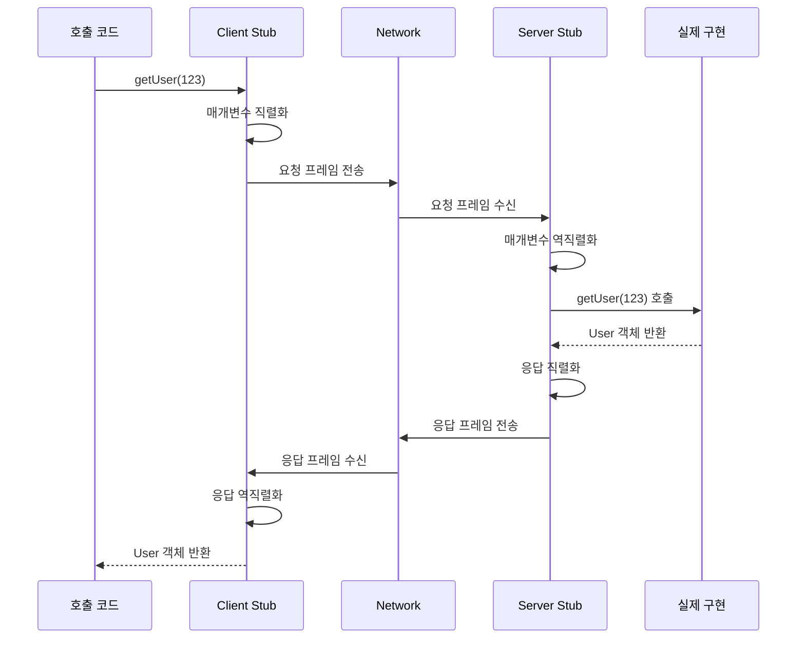

# RPC (Remote Procedure Call)

## 개요

RPC는 다른 프로세스(보통 다른 호스트)의 함수를 호출하는 통신 모델이다. 호출 측 코드만 보면 로컬 함수와 비슷하게 생겼지만, 내부적으로는 매개변수 직렬화 → 네트워크 전송 → 원격 실행 → 응답 역직렬화가 일어난다. 1980년대 Sun RPC, DCE/RPC부터 시작해서 CORBA, SOAP, Thrift, gRPC까지 이어진 흐름이고, 오늘날 사내 마이크로서비스 통신의 상당수가 RPC 모델 위에 올라가 있다.

이 문서는 RPC를 일반론 관점에서 다룬다. 특정 프레임워크(gRPC, Thrift) 사용법은 별도 문서를 참고하고, 여기서는 IDL, 통신 패턴, 에러 처리, 재시도, 데드라인 전파, RPC를 피해야 하는 경우 같은 공통 주제를 중심으로 정리한다.

### REST와의 차이

REST와 RPC는 자주 비교되지만 모델이 다르다. REST는 리소스(`/users/123`)와 HTTP 메서드(GET/POST/PUT/DELETE) 조합으로 상태 변경을 표현하고, 응답은 자원의 표현(representation)이다. RPC는 동작(`getUserById`, `transferMoney`)을 직접 호출한다. 실무에서 차이는 다음에서 두드러진다.

- 의미 모델: REST는 명사 중심, RPC는 동사 중심이다. 결제 취소 같이 리소스로 매핑하기 어색한 동작은 RPC가 자연스럽다.
- 캐싱: REST는 HTTP GET 의미를 그대로 활용해 CDN/프록시 캐시를 끼우기 쉽다. RPC는 직접 캐시 정책을 만들어야 한다.
- 버전 관리: REST는 URL/헤더로 분리하면 되지만, RPC는 IDL 스키마 호환성 규칙을 강제로 따라야 한다.
- 도구: REST는 브라우저에서 바로 호출되고 OpenAPI 생태계가 풍부하다. RPC(특히 바이너리 직렬화 기반)는 클라이언트 라이브러리 자동 생성이 강점이다.

데이터를 자원으로 모델링할 수 있는 외부 공개 API에는 REST가 잘 맞고, 사내 서비스 간 호출 같이 동작 의미가 강한 통신에는 RPC가 잘 맞는다.

## RPC의 동작 흐름



스텁(stub)은 IDL로부터 자동 생성되는 코드다. 사람이 직접 쓸 수 있지만 실무에서는 codegen으로 만든다. 직접 손으로 쓰기 시작하면 클라이언트와 서버가 각자 만든 스키마가 미세하게 어긋나서 디버깅이 늦게 끝나는 일이 생긴다.

## IDL — RPC의 계약서

IDL(Interface Definition Language)은 서비스 시그니처를 언어 중립적으로 기술한다. RPC가 REST보다 강한 형식 보장을 가질 수 있는 이유가 IDL이다.

### 왜 IDL이 필요한가

IDL이 없으면 클라이언트와 서버가 같은 형식을 쓴다는 보장이 없다. JSON처럼 스키마가 느슨하면 다음 같은 문제가 늘 따라온다.

- 서버가 `userId: number`로 보내는데 클라이언트는 `userId: string`으로 받아 비교 로직이 깨진다.
- 신규 필드를 추가했는데 옛 클라이언트가 깨지는지 확인할 방법이 없다.
- 응답 필드명을 `user_name` → `userName`으로 바꾸는 PR이 머지되면서 다운스트림 6개 서비스가 새벽에 죽는다.

IDL을 두면 스키마가 단일 진실 소스(single source of truth)가 되고, 빌드 시점에 클라이언트와 서버 코드가 같은 스키마에서 생성된다. 호환성 규칙(필드 추가만 허용, 번호 재사용 금지 등)을 지키면 점진적 변경이 안전해진다.

### 주요 IDL 비교

| IDL | 직렬화 | 스키마 진화 | 언어 지원 | 주 사용처 |
|-----|--------|-------------|-----------|-----------|
| Protocol Buffers | 바이너리(태그+varint) | 필드 번호 기반, 호환성 좋음 | 풍부함 | gRPC, 사내 서비스 |
| Apache Thrift | 바이너리/Compact/JSON | 필드 ID 기반 | 풍부하지만 일부 정체 | Facebook/Twitter 레거시 |
| Apache Avro | 바이너리(스키마 동봉 또는 ID) | reader/writer 스키마 매칭 | JVM 강함 | Kafka, 데이터 파이프라인 |
| OpenAPI(Swagger) | 보통 JSON(스펙은 메타) | 별도 호환성 규칙 필요 | 풍부함 | REST 문서/클라 생성 |
| Cap'n Proto | 메모리 매핑(직렬화 없음) | 필드 번호 기반 | C++/Rust 강함 | 저지연 시스템 |

Protobuf는 필드를 숫자 태그로 식별한다. 필드 이름을 바꿔도 와이어 호환성이 유지되고, 새 필드는 옛 디코더에서 무시된다. 단, 한 번 쓴 필드 번호를 다른 의미로 재사용하면 디코딩이 조용히 깨진다. 이래서 deprecated 필드는 `reserved`로 명시해서 재사용을 막는다.

Avro는 스키마를 데이터와 함께(또는 ID로 참조해서) 보낸다. Kafka 같이 메시지 단위로 스키마가 다를 수 있는 환경에 잘 맞고, 컬럼 추가/삭제에 대한 reader-writer 호환성 규칙이 명시되어 있다.

OpenAPI는 엄밀히 RPC IDL은 아니지만, REST API의 스키마 명세 + 클라이언트 자동 생성 도구로 IDL과 비슷한 역할을 한다. 외부 공개 API라면 OpenAPI를, 사내 서비스 간이면 Protobuf를 고르는 경우가 많다.

Cap'n Proto는 직렬화/역직렬화 비용 자체를 없애려고 만들어진 형식이다. 메시지를 메모리에 그대로 매핑해서 읽기 때문에, 짧은 RPC 호출에서 마이크로초 단위 지연이 중요한 경우가 아니면 Protobuf와의 차이가 잘 드러나지 않는다.

### 스키마 호환성 — 깨지는 변경과 안전한 변경

Protobuf 기준으로 정리하면 다음과 같다.

```protobuf
message User {
  int64 id = 1;
  string name = 2;
  string email = 3;
  // 새 필드는 새 번호로 추가만 허용
  string phone = 4;
}
```

안전한 변경: 새 필드 추가(선택 필드), 필드 이름 변경(번호 유지), default 값을 가진 필드 제거 후 `reserved` 등록.

깨지는 변경: 필드 번호 재사용, 필드 타입 변경(`int32` → `string`), `required` 도입(proto2), 메시지 이름 변경 후 같은 자리에 다른 메시지 배치.

이 규칙을 사람 검토에만 맡기면 언젠가 사고가 난다. 실무에서는 `buf breaking` 같은 도구를 CI에 넣어 깨지는 변경을 PR에서 자동으로 막는다.

## RPC 통신 패턴 4종

HTTP/1.1만 쓰던 시절의 RPC는 사실상 요청-응답 1쌍(unary)뿐이었다. HTTP/2와 양방향 스트리밍이 보급되면서 4가지 패턴이 표준이 됐다. 패턴 선택은 코드 모양이 아니라 처리량·지연·자원 점유에 영향을 준다.

### Unary — 요청 1개, 응답 1개

가장 흔한 패턴이다. `getUser(id)` → `User`처럼 한 번 묻고 한 번 받는다. 대부분의 비즈니스 로직 호출이 여기 속한다.

```protobuf
rpc GetUser(GetUserRequest) returns (User);
```

연결 점유 시간이 짧고, 로드밸런서·관측 도구의 1차 시민이다. 명확한 시작과 끝이 있어서 재시도 의미도 단순하다. 성격이 다른 호출을 unary 여러 번으로 나누면 latency가 더해지므로(N+1 문제), 호출 묶음이 정해져 있으면 batch API를 별도로 두는 편이 낫다.

### Server Streaming — 요청 1개, 응답 N개

서버가 한 번의 요청에 대해 여러 메시지를 순서대로 흘려보낸다.

```protobuf
rpc ListLogs(ListLogsRequest) returns (stream LogEntry);
```

쓸 만한 경우는 이런 것들이다.

- 결과가 매우 큰 데이터셋(수십만 건)이라 한 번에 직렬화해 보내면 메모리가 터진다.
- 결과가 시간 순으로 점진적으로 생성된다(실시간 로그, 학습 진행률).
- 첫 결과를 빨리 보여주고 싶다(time-to-first-byte 중심).

서버가 도중에 메시지를 보내는 도중 연결이 끊어졌을 때, 어디까지 처리했는지 클라이언트가 알 수 있어야 재개가 가능하다. 보통 응답 메시지에 마지막 처리 토큰(cursor, sequence)을 넣어서 재개 시 그 지점부터 다시 보내게 만든다.

### Client Streaming — 요청 N개, 응답 1개

클라이언트가 여러 메시지를 보낸 후 서버가 한 번의 응답을 준다. 큰 파일 업로드나 일괄 적재가 대표적이다.

```protobuf
rpc UploadMetrics(stream Metric) returns (UploadSummary);
```

클라이언트는 메시지를 보내면서 메모리에 쌓아둘 필요가 없고, 서버는 스트림 종료 시점에 누적된 결과(총 개수, 거부된 항목 등)를 한 번에 돌려준다. 도중에 실패하면 어디까지 받았는지 서버 측에서 일부 응답으로 알려주는 패턴도 가능한데, 그럴 거면 bidirectional이 더 적합하다.

### Bidirectional Streaming — N개 요청, N개 응답

양쪽이 독립적으로 메시지를 주고받는다. 채팅, 실시간 가격 피드, 게임 서버 같이 양방향으로 이벤트가 발생하는 경우에 쓴다.

```protobuf
rpc Chat(stream ChatMessage) returns (stream ChatMessage);
```

상호작용이 자유로운 만큼 백프레셔(backpressure)와 흐름 제어를 직접 다뤄야 한다. 클라이언트가 서버보다 빠르게 보내면 서버 메모리가 쌓이고, 반대로 서버가 빠르면 클라이언트 큐가 폭발한다. gRPC는 HTTP/2의 윈도우 크기를 통해 어느 정도 처리해주지만, 애플리케이션 레벨에서 ACK 메커니즘을 직접 두는 경우가 더 흔하다.

### 패턴 선택 기준

다음 질문 순서로 정한다.

1. 한 번에 결과를 반환할 수 있고 응답이 작은가? → Unary.
2. 결과가 크거나 시간순으로 발생하는가? → Server Streaming.
3. 입력이 크고 누적 결과만 필요한가? → Client Streaming.
4. 양쪽이 비동기로 이벤트를 발생시키는가? → Bidirectional.

스트리밍은 코드 복잡도가 1.5~2배 정도 늘어난다. 작은 응답을 unary로 받을 수 있다면 굳이 스트리밍을 도입하지 않는다.

## RPC 프레임워크 비교

| 프레임워크 | 직렬화 | 전송 | 언어 | 특징 |
|-----------|--------|------|------|------|
| gRPC | Protobuf | HTTP/2 | 다국어 풍부 | 스트리밍 4종, deadline 전파, 사실상 표준 |
| JSON-RPC 2.0 | JSON | HTTP/WebSocket/TCP | 모든 언어 | 스펙이 짧음, 브라우저 호환 |
| Apache Thrift | Binary/Compact/JSON | TCP/HTTP | 다국어 | gRPC 이전 시대 표준, 일부 정체 |
| Cap'n Proto RPC | Cap'n Proto | TCP | C++/Rust 위주 | zero-copy, promise pipelining |
| tRPC | JSON | HTTP | TypeScript 전용 | 스키마 없이 타입 공유, 풀스택 TS에 한정 |

선택 기준은 단순하다.

- 사내 폴리글랏(Polyglot) 환경, 강한 형식 보장과 스트리밍이 필요하다 → gRPC.
- 브라우저에서 직접 부르고 디버깅이 사람 눈으로 가능해야 한다 → JSON-RPC.
- 이미 Thrift 인프라가 있고 굳이 옮길 이유가 없다 → Thrift 유지.
- 마이크로초 지연이 중요한 시스템(고빈도 트레이딩, 게임 서버 일부) → Cap'n Proto.
- 프론트와 백이 모두 TypeScript이고 별도 IDL을 두고 싶지 않다 → tRPC.

성능 트레이드오프는 보통 직렬화 비용보다 네트워크 라운드트립이 훨씬 크다. JSON과 Protobuf의 직렬화 차이는 메시지 1개당 수십 마이크로초 수준이고, 같은 데이터센터 내 RTT가 0.5ms라고 하면 직렬화는 전체의 5% 미만이다. 형식을 결정하는 진짜 기준은 스키마 진화 정책과 도구 생태계지, 미세한 직렬화 속도가 아니다.

## 에러 처리

### 두 종류의 실패를 구분한다

RPC 에러는 크게 둘로 갈라진다. 이 구분이 흐려지면 재시도 로직이 잘못 동작해서 같은 결제가 두 번 발생하는 것 같은 사고가 난다.

- 전송 계층 실패(transport error): 연결 거부, 타임아웃, 5xx, gRPC `UNAVAILABLE`. 서버가 요청을 받지 못했거나 처리 중간에 끊겼다. 멱등 호출이면 재시도해도 안전하다.
- 애플리케이션 실패(business error): 입력 검증 실패, 권한 부족, 잔액 부족, 중복 키. 서버가 요청을 받았고 의도적으로 거부했다. 재시도해도 결과가 같다.

```
HTTP 503 + Retry-After      → 전송 실패, backoff 후 재시도
HTTP 200 + body.error=…     → 애플리케이션 실패, 사용자에게 표시
gRPC UNAVAILABLE            → 전송 실패, 재시도
gRPC FAILED_PRECONDITION    → 애플리케이션 실패, 재시도 금지
gRPC ABORTED                → 충돌, 짧은 backoff 후 재시도 가능
```

### 상태 코드 매핑

JSON-RPC와 REST는 HTTP 상태 코드를 쓰는데, 애플리케이션 실패를 200으로 감쌀지 4xx로 표현할지 팀 컨벤션이 갈린다. 실무 권고는 다음과 같다.

- 전송/인프라 실패: 5xx 또는 gRPC `UNAVAILABLE/DEADLINE_EXCEEDED/INTERNAL`.
- 클라이언트 입력 문제: 4xx 또는 gRPC `INVALID_ARGUMENT/NOT_FOUND/PERMISSION_DENIED`.
- 도메인 비즈니스 실패: 200 + 응답 body의 명시적 에러 코드(예: `error.code = INSUFFICIENT_FUNDS`).

도메인 실패를 4xx로 표현하면 retry middleware가 재시도하지 않아 좋아 보이지만, 모니터링 대시보드가 5xx와 4xx만 구분하는 환경에서는 비즈니스 실패율 알림이 사라진다. body 안에 명시적 에러 코드를 두면 도메인 모니터링이 쉬워진다.

### 부분 실패(partial failure) 처리

배치 RPC에서 100건을 보내고 5건이 실패하는 경우가 흔하다. 두 가지 패턴이 있다.

```protobuf
// 패턴 A: 전체 실패 — 하나라도 실패하면 전부 롤백
message BatchResult {
  bool success = 1;  // false면 어떤 항목도 적용되지 않음
}

// 패턴 B: 항목별 결과 — 성공/실패 개별 보고
message BatchResult {
  repeated ItemResult results = 1;
}
message ItemResult {
  string item_id = 1;
  Status status = 2;  // OK, INVALID_ARGUMENT, ALREADY_EXISTS 등
}
```

패턴 A는 트랜잭션 의미가 명확해서 결제·주문 같은 도메인에 쓴다. 패턴 B는 메트릭 적재처럼 일부 실패가 정상인 도메인에 쓴다. 둘을 섞으면(일부 적용되었고 일부 실패) 클라이언트 재시도 로직이 매우 어려워진다.

## 재시도 전략

### 재시도해도 되는 호출만 재시도한다

멱등(idempotent) 메서드만 자동 재시도한다. 멱등이란 N번 호출해도 1번 호출과 같은 결과를 보장한다는 뜻이다. HTTP에서 GET/PUT/DELETE는 의미상 멱등, POST는 아니다. RPC에서는 메서드 이름만으로는 알 수 없으므로 IDL 주석이나 메타데이터로 명시해야 한다.

```protobuf
// idempotent
rpc GetOrder(GetOrderRequest) returns (Order);

// not idempotent — 재시도 금지
rpc CreateOrder(CreateOrderRequest) returns (Order);

// 멱등 키로 멱등 보장 — 재시도 가능
rpc CreatePayment(CreatePaymentRequest) returns (Payment) {
  // request.idempotency_key 필수
}
```

POST 류 메서드를 재시도하려면 클라이언트가 `idempotency_key`(UUID)를 보내고, 서버가 24시간 정도 키를 저장해서 같은 키로 들어온 요청은 첫 결과를 그대로 돌려주게 한다. Stripe API의 `Idempotency-Key` 헤더가 이 패턴이다.

### Exponential Backoff with Jitter

재시도 간격은 지수적으로 늘리고, 무작위 흔들림(jitter)을 추가한다. 흔들림이 없으면 모든 클라이언트가 동시에 재시도하는 thundering herd가 발생한다.

```python
import random
import time

def retry_with_backoff(call, max_attempts=5):
    base = 0.1   # 100ms
    cap = 30.0   # 30s
    for attempt in range(max_attempts):
        try:
            return call()
        except RetriableError:
            if attempt == max_attempts - 1:
                raise
            # AWS Architecture Blog의 "Full Jitter"
            sleep_time = random.uniform(0, min(cap, base * 2 ** attempt))
            time.sleep(sleep_time)
```

Full jitter는 대기 시간을 `[0, base * 2^attempt]` 사이의 균등 분포에서 뽑는다. 단순 지수(0.1, 0.2, 0.4, 0.8…)에 jitter를 안 붙이면 장애 복구 직후 모든 노드가 같은 시각에 재시도한다.

### Retry Budget — 재시도 폭주 방지

재시도가 다운스트림 부하를 N배로 만든다. 다운스트림이 5% 실패율로 흔들리는 중에 모든 클라이언트가 5회까지 재시도하면 트래픽이 1.25배 정도 더해진다. 평소엔 괜찮지만 50% 실패율로 올라가면 재시도 트래픽이 본 트래픽의 2~3배가 되고, 다운스트림이 영영 회복하지 못한다.

해결책은 retry budget이다. "전체 요청의 10%까지만 재시도 허용" 같은 비율 상한을 둔다. Envoy, Linkerd 같은 서비스 메시가 자체 지원하고, 직접 구현할 때는 슬라이딩 윈도우로 최근 1분간 호출 수와 재시도 수를 추적한다.

```
retry_ratio = retries / requests
if retry_ratio > 0.1:
    skip retry  # 그냥 실패 반환
```

### Circuit Breaker와의 조합

Retry는 일시적 실패용, circuit breaker는 지속적 실패용 도구다. 같이 써야 한다.

- closed: 정상 상태. 호출이 통과하고 retry 적용.
- open: 다운스트림이 죽었다고 판단. 호출 즉시 실패시킴(retry 없이). 대기.
- half-open: 일정 시간 후 한두 개 요청만 통과시켜 회복 여부 확인.

Hystrix 시절에는 50% 실패율 + 20개 요청 임계치가 기본값이었다. Resilience4j, Polly 같은 현대 라이브러리도 비슷한 설정을 제공한다. 핵심은 circuit breaker가 open이면 retry를 시도하지 않는 것이다. 이게 분리되어 있으면 retry가 죽은 서비스를 계속 두드린다.

## 타임아웃과 데드라인 전파

### 타임아웃 vs 데드라인

타임아웃은 "이 호출이 5초 안에 끝나야 한다"는 상대 시간이다. 데드라인은 "이 호출은 14:32:05까지 끝나야 한다"는 절대 시간이다. RPC가 여러 홉을 거치면 데드라인이 더 안전하다.

```
[Client] 14:32:00, deadline 14:32:05
   │
   ▼
[Service A] 처리 1초 → 14:32:01, 남은 deadline 4초
   │
   ▼
[Service B] 처리 2초 → 14:32:03, 남은 deadline 2초
   │
   ▼
[Database] 남은 시간으로 쿼리 실행
```

각 홉이 자기만의 5초 타임아웃을 두면 누적 15초까지 처리되지만 클라이언트는 5초 후에 이미 응답을 포기했다. 그동안 다운스트림은 죽은 요청을 처리하느라 자원을 점유한다(work amplification).

### gRPC의 deadline 전파

gRPC는 metadata로 `grpc-timeout`을 넘기고, 미들웨어가 자동으로 컨텍스트에 데드라인을 설정한다. Go 예시를 보면 다음과 같다.

```go
func (s *server) GetOrder(ctx context.Context, req *pb.GetOrderRequest) (*pb.Order, error) {
    // ctx에 deadline이 이미 박혀있다
    rows, err := s.db.QueryContext(ctx, "SELECT ...", req.OrderId)
    // ↑ DB 드라이버가 ctx의 deadline을 보고 쿼리 타임아웃 설정
    if err != nil {
        return nil, err
    }
    ...
}
```

이게 제대로 동작하려면 모든 다운스트림 호출(다른 RPC, DB, 캐시)에 `ctx`를 일관되게 넘겨야 한다. 어디선가 `context.Background()`로 새 컨텍스트를 만들면 데드라인 전파가 끊긴다. 코드 리뷰에서 이 패턴을 찾는 것만으로도 사고를 여럿 막을 수 있다.

### 타임아웃 값 정하는 기준

타임아웃은 SLO에서 거꾸로 계산한다. 사용자에게 보이는 응답이 1초 이내여야 하면, 다운스트림 호출 5개가 직렬로 일어날 때 각각의 타임아웃은 1초가 아니라 200ms 수준이어야 한다. p99 latency를 측정해서 그것보다 약간 큰 값을 잡는 식이 안전하다. p50 기준으로 잡으면 평소 50% 호출이 타임아웃에 닿는 셈이다.

## RPC를 쓰면 안 되는 경우

RPC는 '로컬 함수처럼 호출한다'는 추상이 매력이지만, 그 추상이 누수될 때 가장 큰 사고가 난다. 다음 상황에서는 RPC가 적합하지 않다.

### 강한 결합이 문제될 때

RPC는 메서드 시그니처 단위로 클라이언트와 서버가 묶인다. 한쪽이 바뀌면 다른 쪽도 같이 배포해야 한다. 사내 모놀리스를 잘게 쪼개서 RPC로 연결했는데, 결국 한 PR이 N개 서비스의 동시 배포를 강제하는 상황이 자주 생긴다. 이런 경우는 RPC 대신 이벤트 기반(Kafka, SNS+SQS) 메시징이 더 잘 맞는다. 발신자는 "주문이 생성되었다"는 사실만 발행하고, 수신자가 자기 속도로 따라잡는다.

### 버전 호환성 관리가 부담될 때

IDL 호환성을 지키는 것은 노력이 필요하다. 한 팀이 만든 서비스를 외부 파트너 50곳이 호출하는 상황에서 Protobuf 필드 번호를 잘못 재사용하는 사고가 한 번 나면 복구가 어렵다. 외부 공개 API라면 OpenAPI + REST가 도구 생태계와 호환성 도구가 더 풍부하다.

### 네트워크 단절 시 동작이 불명확할 때

RPC의 가장 큰 함정은 "호출이 실패했을 때 서버가 처리했는지 안 했는지 모른다"는 점이다. 결제 RPC를 호출했는데 timeout이 났을 때, 서버가 결제를 처리했고 응답만 못 보냈을 수도 있고, 아예 처리하지 못했을 수도 있다. 이걸 무시하고 단순 재시도하면 이중 결제가 된다.

이 문제는 RPC만의 문제는 아니지만, "로컬 함수 호출처럼 보이는" RPC 추상이 함정에 빠지기 쉽게 만든다. 결제·주문처럼 정확성이 중요한 도메인에서는 다음을 추가로 둬야 한다.

- idempotency key로 재시도 안전성 확보.
- 발신자 측 outbox 패턴 + 비동기 메시징으로 at-least-once 보장.
- 양측에서 주기적으로 상태를 reconcile하는 작업.

이 정도까지 하면 결국 본질은 메시지 큐 기반 아키텍처와 비슷해진다. 처음부터 메시징으로 가는 편이 단순한 경우가 많다.

### 호출이 무거울 때

RPC가 마치 로컬 함수처럼 보이기 때문에 개발자가 무심코 N+1 호출을 만든다. 화면 하나에서 RPC 100번이 발생하는 코드를 흔히 보게 되는데, 같은 데이터센터 RTT 0.5ms × 100 = 50ms가 그냥 더해진다. RPC 호출이 비싸다는 사실을 코드에서 잘 보이게 만드는 패턴(batch API, dataloader)을 같이 도입하지 않으면 이 함정에 빠진다.

## 정리

RPC는 동작 호출을 모델로 삼는 통신 방식이다. IDL이 클라이언트-서버 계약을 코드로 만들어주고, 통신 패턴 4종이 단순 요청-응답을 넘는 케이스를 커버한다. 실무의 어려움은 IDL 문법이 아니라 호환성 정책과 에러/재시도/데드라인 같은 운영 측면에 있다. 멱등성 표시 없이 자동 재시도를 켜거나, 데드라인 전파를 빠뜨리거나, retry budget 없이 폭주를 막지 못하면, 평소엔 잘 돌다가 부하가 살짝 오르는 순간 시스템 전체가 같이 무너진다. RPC는 분산 시스템의 강한 추상이지만, 그 추상이 깨지는 지점을 알고 써야 안전하다.
