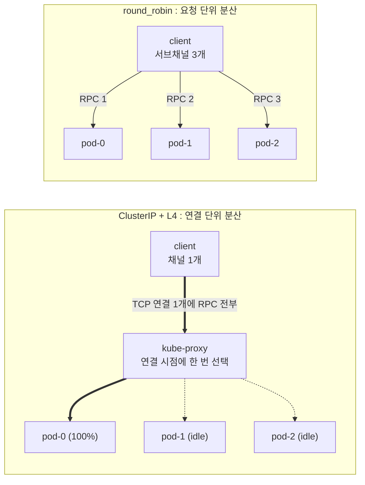
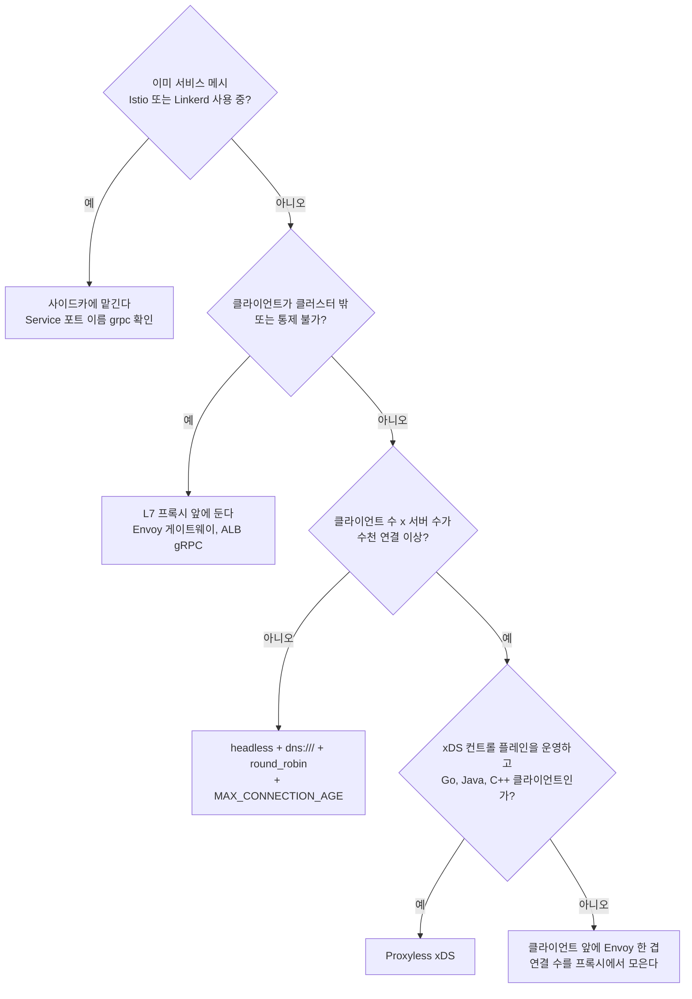
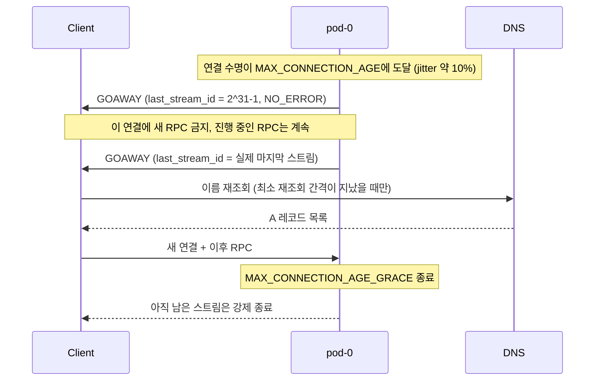

# gRPC 로드밸런싱

[gRPC](gRPC.md)로 서비스를 옮기고 나서 처음 겪는 운영 문제가 대개 이것이다. replicas를 3개로 띄웠는데 Grafana에서 보면 Pod 하나만 CPU가 90%이고 나머지 둘은 놀고 있다. 스케일 아웃을 해도 달라지지 않는다. 배포 때는 갑자기 `UNAVAILABLE`이 튀어나온다. 셋 다 같은 뿌리에서 나온다. gRPC는 [HTTP/2](../../../Application%20Layer/Http/HTTP_2.md) 위에서 커넥션 하나를 오래 붙들고 쓰는데, 로드밸런서는 커넥션이 맺어지는 순간 한 번만 일을 한다.

이 문서에서 직접 돌려본 것은 Node(`@grpc/grpc-js` 1.14.5)와 Go(`grpc-go` v1.84.0) 클라이언트·서버다. Pod는 loopback 주소(`127.0.0.2`~`127.0.0.4`)에 서버 프로세스를 따로 띄워 흉내 냈고, kube-proxy는 TCP 연결 단위로 백엔드를 고르는 작은 L4 프록시로, CoreDNS는 A 레코드를 바꿔 줄 수 있는 UDP DNS 서버로 대신했다. 실제 클러스터에서 돌린 것이 아니므로 수치는 "이런 모양으로 나온다"는 참고로만 보면 된다. Envoy·Istio·xDS 쪽은 실행하지 못했고, 해당 절에 그렇게 적어 두었다.

## 한 Pod만 요청을 받는 증상

### 재현 구성

Kubernetes의 기본 Service(ClusterIP)는 kube-proxy가 iptables나 IPVS 규칙으로 L4 분산을 한다. 클라이언트가 Service IP로 TCP 연결을 맺는 순간 DNAT 대상 Pod가 정해지고, 그 연결의 패킷은 conntrack 때문에 끝까지 같은 Pod로 간다. HTTP/1.1 REST 클라이언트는 연결 풀에 연결이 여러 개 있고 요청마다 아무 연결이나 쓰니 우연히 분산된다. gRPC 채널은 서버 하나에 연결 하나를 맺고 모든 RPC를 그 위의 스트림으로 흘린다.

아래 도식의 왼쪽이 증상이고 오른쪽이 목표다. 왼쪽은 연결이 맺어진 시점에 선택이 끝나고, 오른쪽은 RPC마다 선택이 일어난다.



로컬에서 같은 구조를 만들어 300번 호출한 결과다. L4 프록시 뒤에 서버 3개를 두고 클라이언트 채널 하나로 `Who` RPC를 보냈다.

| 구성 | pod-0 | pod-1 | pod-2 |
|---|---|---|---|
| L4 프록시, 채널 1개 | 300 | 0 | 0 |
| L4 프록시, 채널 3개(연결 3개) | 100 | 100 | 100 |
| DNS가 알려 준 주소 3개, 정책 미지정 | 300 | 0 | 0 |
| DNS가 알려 준 주소 3개, `round_robin` | 100 | 100 | 100 |

세 번째 줄이 의외일 수 있다. 주소를 세 개 알고 있어도 정책을 지정하지 않으면 `pick_first`로 동작해서 첫 번째 주소에 연결하고 끝이다. headless Service로 바꿨는데도 쏠림이 그대로라면 정책부터 본다. Go 클라이언트도 같은 결과(`pick_first` 시 pod-0 한 곳, `round_robin` 시 약 1/3씩)가 나왔다.

채널 3개 실험에는 함정이 하나 있었다. grpc-js는 타깃과 옵션이 같은 채널끼리 하위 연결(subchannel)을 전역 풀에서 공유한다. `new Client(...)`를 세 번 해도 연결은 하나여서 300건이 전부 pod-0으로 갔다. 채널마다 연결을 따로 갖게 하려면 `'grpc.use_local_subchannel_pool': 1`을 줘야 한다. 연결 수를 늘려서 쏠림을 풀어 보려는 시도를 할 때 이 옵션을 모르면 효과가 없어 보인다.

### Pod별 요청 수 확인

"쏠린 것 같다"에서 멈추지 말고 Pod별로 숫자를 봐야 한다. 서버에 [grpc-ecosystem 계열 인터셉터](https://github.com/grpc-ecosystem/go-grpc-middleware)나 OpenTelemetry 인터셉터가 붙어 있으면 `grpc_server_handled_total` 같은 카운터를 Pod 라벨로 나눠서 본다.

```promql
sum by (pod) (rate(grpc_server_handled_total[1m]))
```

메트릭이 없으면 연결 수라도 센다. 쏠림이 있으면 Pod마다 ESTABLISHED 연결 수가 극단적으로 다르다.

```bash
kubectl exec <pod> -- ss -tn state established '( sport = :50051 )' | wc -l
```

정상이면 클라이언트 Pod 수만큼, 혹은 그 배수로 비슷하게 나온다. 한 Pod만 클라이언트 수만큼이고 나머지가 0이면 이 문서의 증상이다. `kubectl top pod`의 CPU만 보고 판단하면 쏠림과 단순 부하 차이를 구분하지 못한다.

### 원인은 커넥션 단위 분산

L4 로드밸런서가 보는 단위는 연결이고 gRPC가 쓰는 단위는 스트림이다. 연결 하나에 스트림이 수천 개 올라가는 구조가 HTTP/2 멀티플렉싱의 장점인데, 연결 단위로만 일하는 장비 입장에서는 그게 곧 "한 번 분배하고 끝"이다. 해결은 두 갈래다. 선택을 RPC 단위로 끌어올리거나(클라이언트 또는 L7 프록시), 연결을 주기적으로 끊어서 선택을 다시 하게 만든다. 실무에서는 둘을 같이 쓴다.

## 해결 방식 세 가지

| 방식 | 선택하는 곳 | 필요한 것 | 비용 |
|---|---|---|---|
| 클라이언트 사이드 LB | gRPC 클라이언트 라이브러리 | headless Service, `dns:///`, `round_robin` | 클라이언트 설정 변경, 연결 수 증가 |
| L7 프록시 | Envoy, Istio·Linkerd 사이드카 | 프록시 배치 또는 메시 도입 | 추가 hop, 프록시 운영 |
| Proxyless xDS | gRPC 클라이언트 라이브러리 | xDS 컨트롤 플레인, 부트스트랩 파일 | 컨트롤 플레인 운영, 언어별 지원 편차 |

### 클라이언트 사이드 로드밸런싱

가장 먼저 시도하는 방식이다. Service를 headless로 만들면 DNS가 Ready 상태인 Pod IP 전체를 A 레코드로 돌려주고, 클라이언트가 그 목록으로 연결을 각각 맺은 뒤 RPC마다 돌아가며 보낸다.

```yaml
apiVersion: v1
kind: Service
metadata:
  name: user-service
spec:
  clusterIP: None
  selector:
    app: user-service
  ports:
    - name: grpc
      port: 50051
```

Node 클라이언트는 `dns:///` 스킴과 service config로 정책을 지정한다. 이 옵션 조합으로 위 표의 `round_robin` 결과를 확인했다(실험에서는 mock DNS 서버를 가리키기 위해 `dns://127.0.0.1:5353/...` 형태의 authority를 썼고, grpc-js가 시스템 resolver 대신 그 서버를 쓰도록 `GRPC_NODE_USE_ALTERNATIVE_RESOLVER=true`를 줬다. 클러스터 안에서는 둘 다 필요 없다).

```js
const grpc = require('@grpc/grpc-js');

const client = new demo.Echo(
  'dns:///user-service.default.svc.cluster.local:50051',
  grpc.credentials.createInsecure(),
  {
    'grpc.service_config': JSON.stringify({
      loadBalancingConfig: [{ round_robin: {} }],
    }),
  },
);
```

Go는 `grpc.NewClient`에 같은 service config JSON을 기본값으로 넘긴다.

```go
conn, err := grpc.NewClient(
    "dns:///user-service.default.svc.cluster.local:50051",
    grpc.WithTransportCredentials(insecure.NewCredentials()),
    grpc.WithDefaultServiceConfig(`{"loadBalancingConfig":[{"round_robin":{}}]}`),
)
```

쓰지 말아야 할 경우가 분명히 있다.

- 클라이언트가 많고 서버도 많은 경우. 클라이언트 Pod 200개가 서버 Pod 100개에 전부 연결을 맺으면 연결이 2만 개다. 서버 쪽 파일 디스크립터와 keepalive 트래픽이 부담이 되기 시작한다. 클라이언트마다 일부 서버만 보게 하는 subsetting이 필요한데 gRPC 기본 정책에는 없다.
- 클라이언트를 통제할 수 없는 경우. 브라우저(gRPC-Web), 파트너사 서버, 언어가 제각각인 팀들은 각자 정책을 올바르게 설정해 주지 않는다. 한 곳이 `pick_first`로 두면 그 클라이언트의 트래픽만 쏠린다.
- 서버 목록이 자주 바뀌는데 재조회 주기를 감당할 수 없는 경우. 뒤의 "스케일 아웃" 절에서 다룬다. 이 방식의 가장 큰 약점이다.

### L7 프록시

프록시가 HTTP/2 프레임을 해석해서 RPC 단위로 업스트림을 고른다. 클라이언트는 프록시 주소 하나만 알면 되고, 기존 클라이언트 코드는 건드리지 않는다. 같은 Pod 안의 사이드카로 두면 [Istio](../../../../../DevOps/Service_Mesh/Istio.md)나 Linkerd이고, 별도 Deployment로 두면 [Envoy](../../../../../DevOps/Load_Balancer/Envoy.md) 게이트웨이다. 클러스터 밖에서 들어오는 트래픽이면 AWS ALB의 gRPC 타깃 그룹도 같은 역할이다.

메시에서는 포트 이름이 중요하다. Istio는 Service 포트 이름이 `grpc`(또는 `grpc-*`)이거나 `appProtocol: grpc`일 때 그 포트를 HTTP/2 gRPC로 보고 RPC 단위 분산을 건다. 이름이 `tcp`이거나 아예 없으면 TCP로 취급해서 L4와 똑같은 쏠림이 메시 안에서 그대로 재현된다. 위 headless Service YAML에 `name: grpc`를 넣은 이유다. 이 부분은 이 환경에서 실행해 보지 못했고 Istio 문서의 프로토콜 선택 규칙을 따른 것이다.

쓰지 말아야 할 경우는 이렇다.

- 메시를 도입하지 않았는데 gRPC 하나 때문에 사이드카 전체를 들이는 경우. 사이드카마다 메모리와 CPU가 들고 배포 절차도 바뀐다. 이 문제만 풀려면 클라이언트 사이드 LB가 훨씬 싸다.
- 프록시 앞단이 다시 L4인 경우. 클라이언트가 NLB나 ClusterIP를 거쳐 Envoy Deployment에 붙으면, Envoy 3개 중 하나로 연결이 쏠린다. 한 단 위에서 같은 문제가 반복되는 것이다. 이때도 프록시 쪽에서 연결 수명을 제한해야 한다.
- 지연에 민감한 내부 호출이 몇 hop씩 쌓이는 경우. 사이드카는 호출마다 클라이언트 쪽과 서버 쪽 프록시 두 번을 거친다.

### Proxyless xDS

사이드카 없이 gRPC 라이브러리가 Envoy와 같은 xDS API로 컨트롤 플레인에서 엔드포인트와 정책을 직접 받는다. Go에서는 `google.golang.org/grpc/xds`를 import하고 타깃을 `xds:///user-service`로 쓰며, 부트스트랩 파일 경로를 `GRPC_XDS_BOOTSTRAP` 환경변수로 준다. 프록시 hop 없이 L7 수준의 분산과 트래픽 정책을 얻는다.

이 방식은 직접 실행해 보지 못했다. 컨트롤 플레인(Istio, Traffic Director 등)이 있어야 하는데 이 작업 환경에는 없다. 그래서 설정 예제를 싣지 않는다. 알려진 제약만 적으면 이렇다.

- 언어별 지원 범위가 다르다. Go·Java·C++ 쪽이 앞서 있고 Node(`@grpc/grpc-js-xds`)는 지원하는 기능이 더 좁다. 쓰려는 기능(가중치 라우팅, 재시도, 서킷 브레이커 등)이 해당 언어에서 구현되어 있는지 먼저 확인해야 한다.
- 컨트롤 플레인이 죽으면 새 엔드포인트 정보를 못 받는다. 이미 받은 설정으로는 계속 동작하지만, 그 상태에서 스케일 아웃하면 이 문서의 "새 Pod가 놀고 있는" 문제와 같은 증상이 나온다.
- 여러 언어가 섞인 환경에서는 언어마다 동작이 달라서 디버깅이 어렵다. 프록시는 한 곳에서 로그를 보면 되는데 라이브러리 방식은 클라이언트마다 따로 봐야 한다.

### 방식 고르기

결정은 대부분 "이미 있는 것"에서 갈린다.



작은 팀이 서비스 몇 개를 쿠버네티스에 올리는 정도라면 맨 아래까지 내려갈 일이 거의 없다. 클라이언트 사이드 LB와 서버의 연결 수명 제한이면 충분하고, 그 조합에서 막히는 지점이 다음 두 절이다.

## MAX_CONNECTION_AGE와 GOAWAY

클라이언트 사이드 LB를 쓰든 L7 프록시를 쓰든 서버에는 연결 수명 제한을 걸어 두는 편이 낫다. 연결이 영원히 안 끊기면 Pod 목록이 바뀐 것을 반영할 계기가 없다. 서버가 `MAX_CONNECTION_AGE`에 도달한 연결에 GOAWAY를 보내면 클라이언트는 그 연결에 새 RPC를 보내지 않고, 다시 이름을 조회해서 새 연결을 맺는다.



도식의 핵심은 GOAWAY가 두 번 나간다는 점과 grace가 끝나면 남은 스트림이 잘린다는 점이다. 첫 GOAWAY의 last_stream_id가 최댓값(2^31-1)이라는 건 "곧 닫을 테니 새 스트림은 열지 마라"는 예고이고, 두 번째가 실제 마지막 스트림 번호를 확정한다. HTTP/2 스펙의 2단계 graceful shutdown이다. 아래는 grpc-js 서버에 연결 수명 2초, grace 3초를 걸고 raw HTTP/2 클라이언트로 GOAWAY를 직접 받아 본 결과다. 동시에 gRPC 클라이언트로 1초·3.5초·8초짜리 RPC를 걸어 두었다.

```text
+1.0s RPC(1000ms) OK done-1000
+2.1s raw http2 GOAWAY errorCode=0 lastStreamID=2147483647
+2.1s raw http2 GOAWAY errorCode=0 lastStreamID=0
+2.1s raw http2 close
+3.5s RPC(3500ms) OK done-3500
+5.2s RPC(8000ms) ERR Connection dropped
```

연결 수명(2초)을 넘긴 3.5초짜리 RPC는 GOAWAY 이후에도 정상 완료됐다. 8초짜리는 수명 2초 + grace 3초가 지난 5.2초에 `Connection dropped`(UNAVAILABLE)로 잘렸다. 수명이 2.1초에 끝난 것은 jitter 때문이다. 서버가 연결마다 수명에 ±10% 무작위 값을 더하는 게 보인다. 클라이언트 Pod가 한꺼번에 뜬 경우 모든 연결이 같은 시각에 끊겨서 재연결이 몰리는 것을 막으려는 장치다.

설정은 이렇다. grace는 서버가 처리하는 RPC 중 가장 긴 것보다 길게 잡는다. 스트리밍 RPC가 몇 분씩 이어지는 서비스에서 grace를 기본값 근처로 두면 GOAWAY 때마다 스트림이 잘린다.

```js
const server = new grpc.Server({
  'grpc.max_connection_age_ms': 5 * 60 * 1000,
  'grpc.max_connection_age_grace_ms': 30 * 1000,
});
```

```go
s := grpc.NewServer(grpc.KeepaliveParams(keepalive.ServerParameters{
    MaxConnectionAge:      5 * time.Minute,
    MaxConnectionAgeGrace: 30 * time.Second,
}))
```

수명을 너무 짧게 잡으면 TLS 핸드셰이크와 DNS 조회가 계속 일어나고, 너무 길게 잡으면 스케일 아웃 반영이 그만큼 늦다. 처음에는 몇 분 단위로 시작해서 재연결 빈도를 메트릭으로 보면서 조정하는 게 낫다.

## 스케일 아웃 후에도 새 Pod가 놀고 있을 때

headless Service와 `round_robin`을 적용하고 분산이 잘 되는 걸 확인한 뒤에도, replicas를 3에서 5로 늘리면 새 Pod 두 개가 한참 동안 요청을 못 받는 경우가 있다. HPA가 Pod를 늘렸는데 부하가 안 내려가는 증상으로 나타난다.

원인은 DNS 캐시 TTL이 아니라 클라이언트가 이름을 다시 조회하는 시점에 있다. gRPC DNS resolver는 레코드의 TTL을 보고 주기적으로 폴링하지 않는다. 연결이 끊기거나 GOAWAY를 받는 것 같은 사건이 생길 때 재조회를 요청하고, 그 재조회도 최소 간격(기본 30초)에 걸러진다. 그래서 세 가지가 겹쳐서 늦어진다.

1. 연결이 안 끊기면 재조회 요청 자체가 일어나지 않는다.
2. 요청이 일어나도 마지막 조회에서 30초가 지나야 실제로 나간다.
3. 나간 조회가 CoreDNS나 노드 로컬 DNS 캐시에 걸리면 그 캐시의 TTL만큼 옛 목록이 돌아온다.

mock DNS로 확인했다. 처음에는 A 레코드 2개를 주다가 4.5초 시점에 3개로 바꾸고, `round_robin` 클라이언트로 20초간 계속 호출했다. 레코드 TTL은 5초로 줬다.

| 서버 설정 | 클라이언트 설정 | 새 Pod(pod-2)가 첫 요청을 받은 시점 |
|---|---|---|
| 수명 제한 없음 | 기본 | 20초 동안 0건 |
| 수명 5초 | 기본(최소 재조회 간격 30초) | 시작 후 30초를 넘긴 구간(36초 집계)에서 균등 분산 |
| 수명 5초 | `grpc.dns_min_time_between_resolutions_ms: 1000` | DNS 변경 후 약 2초 내 |

TTL을 5초로 줬는데도 기본 설정에서는 30초가 걸렸다. TTL을 줄여서는 해결되지 않는다는 뜻이다. Go 클라이언트(`grpc-go` v1.84.0)도 같은 실험에서 30초 집계 구간에 pod-2가 처음 나타났고(2건), 다음 구간부터 3개 Pod가 1/3씩 받았다. 두 구현 모두 30초 전후에 반영되는 셈이다.

grpc-js에서는 최소 재조회 간격을 줄일 수 있다. 서버의 연결 수명과 함께 맞춰야 의미가 있다. 수명이 5분인데 재조회 간격만 1초로 줄이면 연결이 끊기는 5분 뒤에야 반영된다.

```js
const client = new demo.Echo(target, creds, {
  'grpc.service_config': JSON.stringify({ loadBalancingConfig: [{ round_robin: {} }] }),
  'grpc.dns_min_time_between_resolutions_ms': 5000,
});
```

Go에서는 이 간격을 바꾸는 공개 옵션을 확인하지 못했다. 서버 연결 수명을 급한 스케일 아웃 반영 시간에 맞춰 짧게 잡거나, 자동 스케일링이 중요한 서비스는 L7 프록시나 xDS로 가는 쪽이 낫다. 엔드포인트 변경을 푸시로 받는 방식은 이 지연이 없다. 서버 수명을 1~2분으로 낮추는 것도 방법인데, 앞에서 말한 재연결 비용과 맞바꿔야 한다.

## health check와 배포 중 UNAVAILABLE

### grpc.health.v1

gRPC 표준 health 프로토콜(`grpc.health.v1.Health`)은 `Check`(한 번 조회)와 `Watch`(상태 변화 스트림) 두 메서드다. Node에서는 `grpc-health-check` 패키지로 붙인다. 서비스 이름별로 상태를 따로 가질 수 있고 빈 문자열 `""`은 서버 전체를 뜻한다.

```js
const { HealthImplementation } = require('grpc-health-check');

const health = new HealthImplementation({ '': 'NOT_SERVING', 'demo.Echo': 'NOT_SERVING' });
health.addToServer(server);

// 의존성(DB, 캐시) 연결이 끝난 뒤에
health.setStatus('', 'SERVING');
health.setStatus('demo.Echo', 'SERVING');
```

Check와 Watch를 호출하며 상태를 바꿔 봤다.

```text
+0.0s Watch -> NOT_SERVING
+0.0s Check("") -> NOT_SERVING
+0.0s Check("no.Such") -> ERR 5 Health status unknown for service no.Such
+0.5s Watch -> SERVING
+0.7s Check("") -> SERVING
+1.0s SIGTERM 수신 흉내: NOT_SERVING 전환
+1.0s Watch -> NOT_SERVING
+1.3s Check("") -> NOT_SERVING
```

등록하지 않은 서비스 이름을 조회하면 `NOT_SERVING`이 아니라 `NOT_FOUND`(코드 5) 에러가 온다. probe에 서비스 이름을 잘못 적으면 Pod가 영원히 NotReady로 남는다. 서비스 이름은 proto의 `package.Service` 전체 이름과 정확히 같아야 한다. 초기값을 `SERVING`으로 두는 실수도 흔하다. 서버 프로세스가 떴지만 DB 연결이 아직 안 된 상태에서 트래픽이 들어온다.

Kubernetes는 1.24부터 gRPC probe를 직접 지원한다(1.27에서 GA). `grpc_health_probe` 바이너리를 이미지에 넣을 필요가 없다. 이 YAML은 클러스터가 없어 실행하지 못했다.

```yaml
readinessProbe:
  grpc:
    port: 50051
    service: demo.Echo
  periodSeconds: 5
  failureThreshold: 2
```

grpc-js 1.14.5에는 service config의 `healthCheckConfig`를 처리하는 코드가 없다(소스에서 `healthCheck`를 검색해도 나오지 않는다). 클라이언트가 서버의 health 상태를 보고 직접 엔드포인트를 걸러내는 방식은 Node에서 쓸 수 없고, readiness가 Endpoints에서 Pod를 빼 주는 쪽에 의존해야 한다.

### readiness와 종료 순서

headless Service의 DNS는 Ready인 Pod만 돌려준다. 그래서 readiness가 실패하면 "새로 이름을 조회하는 클라이언트"는 그 Pod를 못 본다. 반면 이미 연결을 맺은 클라이언트는 그 연결로 계속 요청을 보낸다. readiness는 이미 열린 gRPC 연결에는 영향이 없다. 롤링 업데이트 중에 종료되는 Pod로 요청이 계속 들어가는 이유가 이것이다.

종료 쪽 순서는 이렇게 맞춘다.

| 단계 | 하는 일 | 이유 |
|---|---|---|
| 1 | preStop에서 몇 초 sleep | Endpoints에서 빠지는 것이 클라이언트 DNS에 닿기까지 시간이 걸린다. SIGTERM과 Endpoints 제거는 동시에 시작되어 경쟁한다 |
| 2 | SIGTERM 수신, health를 `NOT_SERVING`으로 | readiness가 실패해서 Endpoints에서 빠진다 |
| 3 | `tryShutdown()`(Go는 `GracefulStop()`) | GOAWAY를 보내고 진행 중인 RPC가 끝나길 기다린다 |
| 4 | `terminationGracePeriodSeconds` 안에 종료 | 넘으면 SIGKILL이 온다. 가장 긴 RPC보다 길게 |

distroless 이미지에는 `sleep` 바이너리가 없어서 `preStop: exec: command: ["sleep", "5"]`가 실패하는 경우가 있다. 이런 이미지에서는 애플리케이션 안에서 SIGTERM 후 대기하는 방식으로 처리한다.

종료 방식에 따른 차이를 직접 쟀다. Pod 2개(서버를 자식 프로세스로 띄움)에 20개 워커가 `round_robin`으로 요청을 보내는 중 pod-0을 종료했다. 서버 핸들러는 30ms 걸린다.

| 종료 방식 | 재시도 정책 없음 | 재시도 정책 있음 |
|---|---|---|
| SIGKILL | 실패 10건(`14 Connection dropped`) | 실패 0건 |
| SIGTERM + `tryShutdown()` | 실패 0건 | 실패 0건 |

SIGKILL에서 10건이 실패한 것은 죽는 순간 pod-0에서 처리 중이던 요청 수와 같다(워커 20개를 두 Pod가 나눠 가진다). 정상 종료에서는 GOAWAY를 받은 클라이언트가 새 요청을 다른 연결로 보내고, 진행 중인 요청은 마저 끝나서 오류가 없었다. 배포 때 UNAVAILABLE이 나오는 서비스는 대부분 애플리케이션이 SIGTERM을 처리하지 않고 바로 죽는 경우다. 컨테이너 엔트리포인트를 셸 스크립트로 감싸서 SIGTERM이 Node·Go 프로세스까지 전달되지 않는 경우도 같은 결과를 낸다.

한 가지 더 확인한 것이 있다. 서버 쪽 `forceShutdown()`은 진행 중 호출을 UNAVAILABLE이 아니라 `CANCELLED`("Call cancelled")로 끝냈다. 이 코드는 재시도 대상에 넣지 않는 게 보통이어서 재시도로 구제되지 않는다. 종료 로직에서 강제 종료는 마지막 수단으로만 남겨야 한다.

### 재시도 정책

SIGKILL 같은 비정상 종료나 노드 장애에서는 서버가 정리할 틈이 없다. 이 경우를 받아 주는 것이 service config의 재시도 정책이다. 연결이 끊겨서 응답 헤더를 받기 전에 UNAVAILABLE이 된 RPC만 다른 서버로 다시 보낸다.

```json
{
  "loadBalancingConfig": [{ "round_robin": {} }],
  "methodConfig": [{
    "name": [{ "service": "demo.Echo" }],
    "retryPolicy": {
      "maxAttempts": 4,
      "initialBackoff": "0.1s",
      "maxBackoff": "1s",
      "backoffMultiplier": 2,
      "retryableStatusCodes": ["UNAVAILABLE"]
    }
  }]
}
```

Node는 이 JSON을 `grpc.service_config` 옵션에 문자열로, Go는 `grpc.WithDefaultServiceConfig`에 그대로 넣는다. 서버가 처음 두 번을 UNAVAILABLE로 거절하게 만들어 양쪽 모두 확인했다. 재시도가 없으면 서버가 1번 받고 클라이언트는 에러를 받는다. 있으면 서버가 3번 받고 클라이언트는 성공한다. 서버에는 `grpc-previous-rpc-attempts` 헤더가 `1`, `2`로 붙어서 들어온다(첫 시도에는 헤더가 없다). 서버 로그에서 재시도 때문에 늘어난 요청을 구분할 수 있다.

```text
retry=false: ERR 14 draining      (서버 수신 1회)
retry=true : ok                   (서버 수신 3회, 헤더 -, 1, 2)
```

운영에서 주의할 것은 다음과 같다.

- 재시도 대상 코드를 `UNAVAILABLE`로 좁힌다. `DEADLINE_EXCEEDED`를 넣으면 이미 느린 서버에 같은 요청이 겹쳐서 상황이 나빠지고, deadline도 시도마다 새로 주어지지 않고 전체에서 공유된다.
- 비멱등 RPC(결제, 주문 생성)는 UNAVAILABLE이어도 서버가 이미 처리했을 수 있다. 헤더를 받기 전 실패만 재시도하는 규칙이 있어도, 요청이 서버에 도착한 뒤 응답이 오기 전에 끊기면 중복 처리될 수 있다. 서버에서 멱등 키로 막아야 한다.
- 재시도가 증폭하는 장애가 있다. 서버 전체가 느려졌을 때 클라이언트가 최대 4배의 요청을 쏘면 회복을 막는다. service config에는 `retryThrottling`(`maxTokens`, `tokenRatio`) 필드가 있어 실패 비율이 높으면 재시도를 멈추게 할 수 있지만, 이 필드는 이 문서에서 직접 돌려보지 않았다.
- Node와 Go 모두 재시도가 기본으로 켜져 있는 구현이라 service config만 넣으면 동작했다. Node에서 끄려면 `'grpc.enable_retries': 0`이다.

정상 종료에서는 GOAWAY가 오류를 없애고, 비정상 종료에서는 재시도가 한 번 더 받아 준다. 두 방어선이 모두 없으면 배포마다 UNAVAILABLE이 로그에 남는다.

## 관련 문서

- [gRPC](gRPC.md): 프로토콜 기본, 상태 코드, keepalive 설정
- [HTTP/2](../../../Application%20Layer/Http/HTTP_2.md): 멀티플렉싱과 GOAWAY 프레임
- [Istio](../../../../../DevOps/Service_Mesh/Istio.md): 사이드카 기반 L7 분산
- [Envoy](../../../../../DevOps/Load_Balancer/Envoy.md): L7 프록시와 xDS
