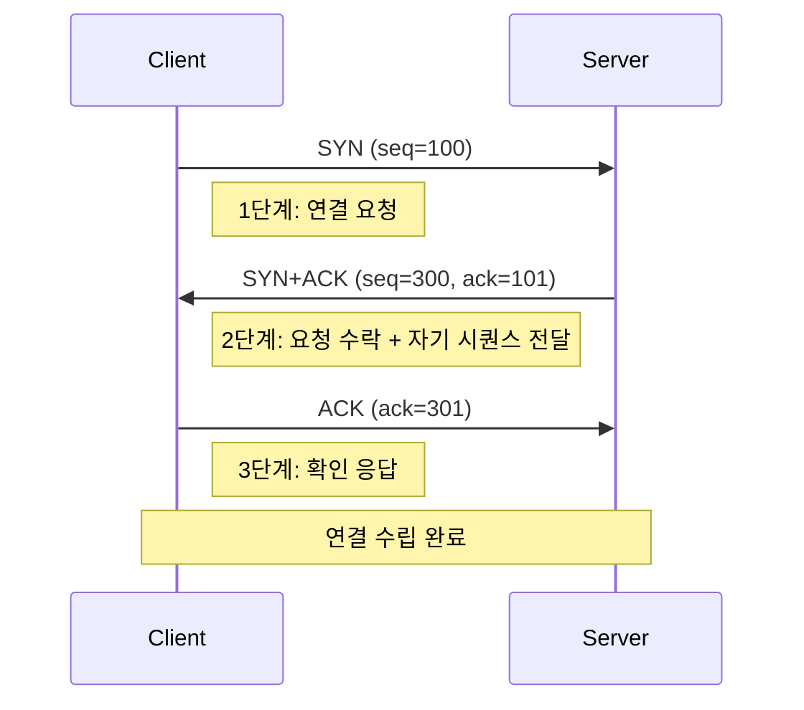
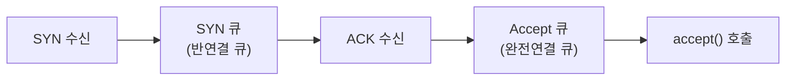
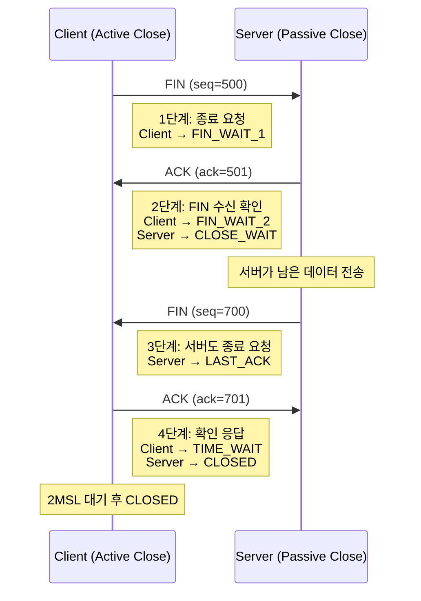
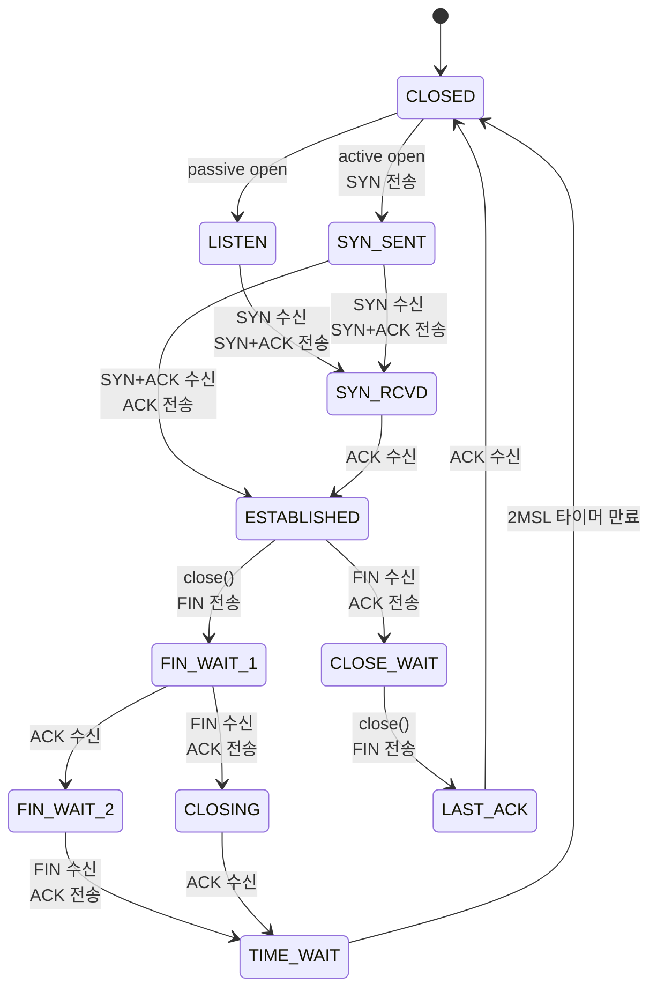
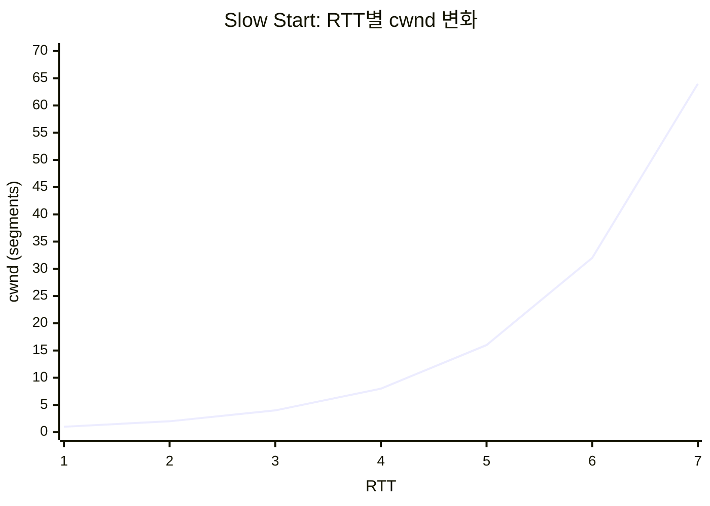
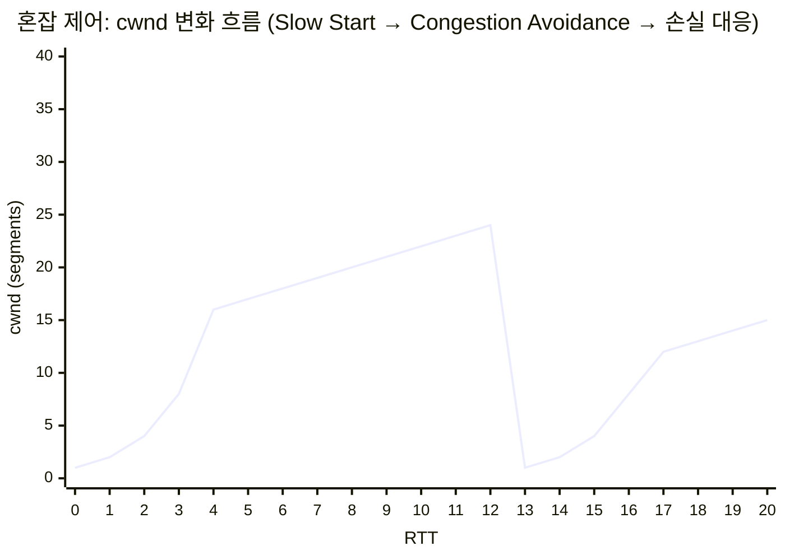
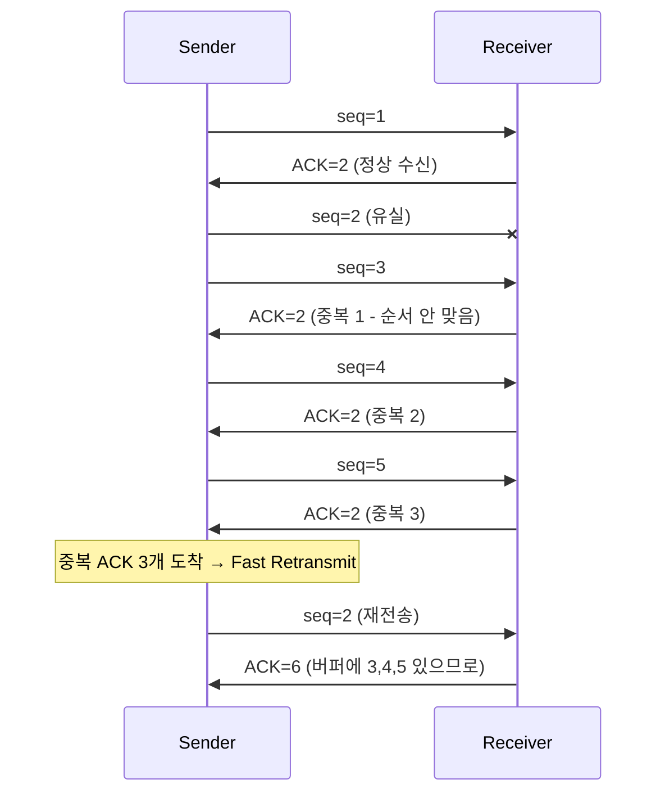
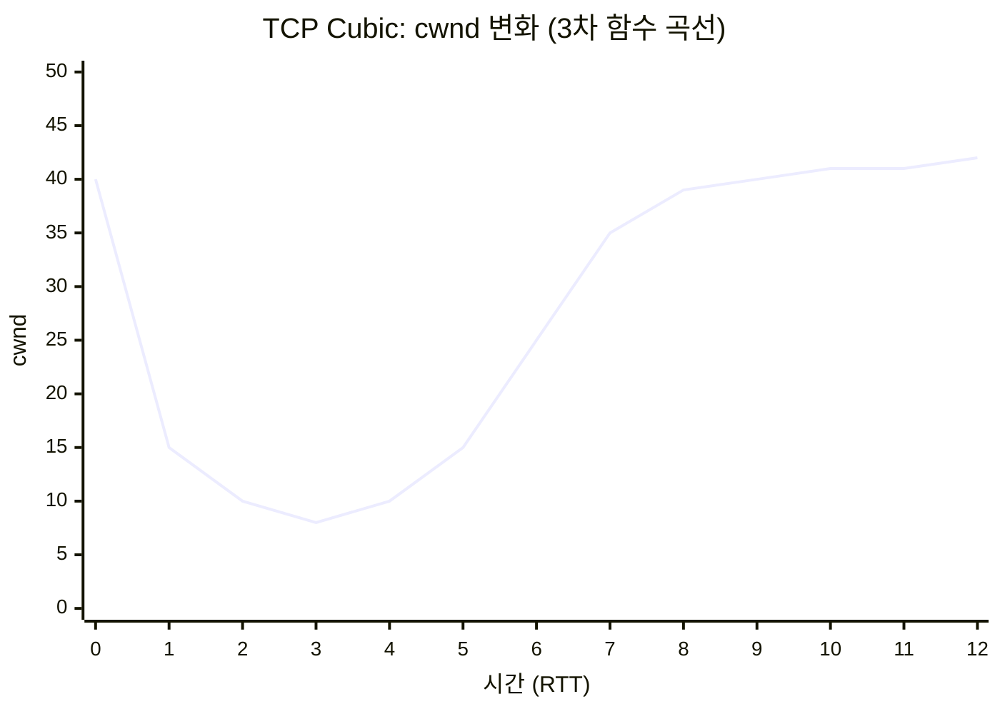
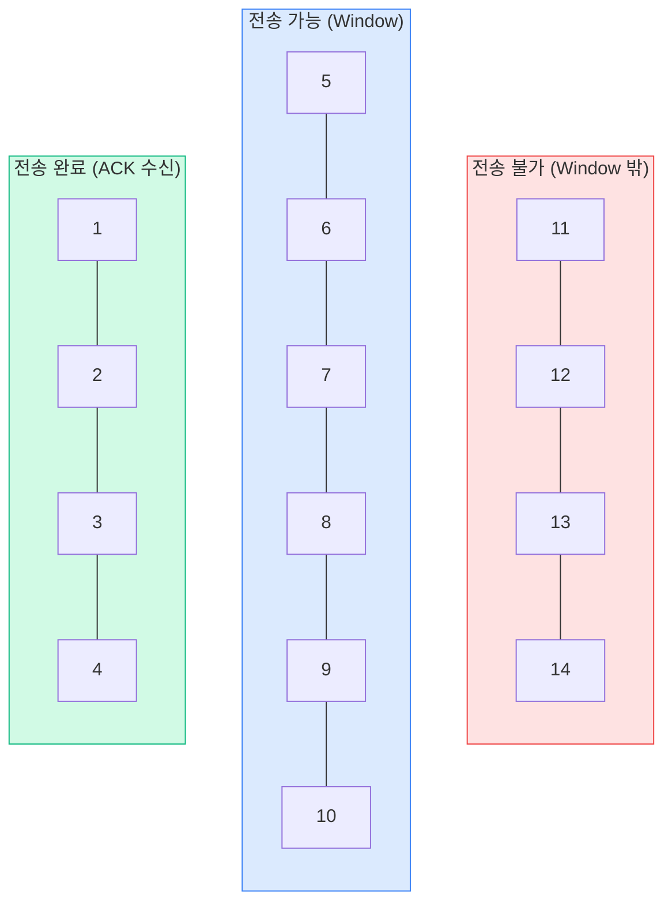
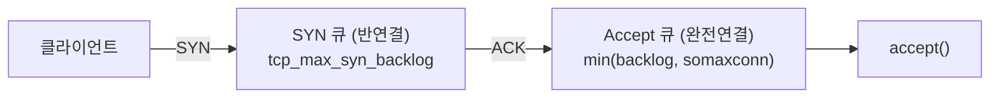

# TCP 프로토콜 동작 메커니즘

## TCP 연결 수립: 3-Way Handshake

TCP는 데이터를 보내기 전에 반드시 연결을 수립한다. 이 과정이 3-Way Handshake다.



각 단계에서 일어나는 일을 구체적으로 보면:

**1단계 - SYN**: 클라이언트가 ISN(Initial Sequence Number)을 생성한다. ISN은 랜덤 값이다. 예전에는 시간 기반으로 증가하는 값을 썼는데, TCP sequence prediction attack 때문에 랜덤으로 바뀌었다.

**2단계 - SYN+ACK**: 서버도 자기 ISN을 생성하고, 클라이언트의 SYN에 대한 ACK를 보낸다. ACK 번호는 클라이언트의 seq + 1이다. SYN 자체가 시퀀스 번호 1개를 소비하기 때문이다.

**3단계 - ACK**: 클라이언트가 서버의 SYN에 대한 ACK를 보낸다. 이 패킷부터 데이터를 실어 보낼 수 있다.

### SYN Backlog와 SYN Flood 공격

서버가 SYN을 받으면 SYN 큐(반연결 큐)에 저장한다. ACK가 돌아와서 연결이 완료되면 Accept 큐(완전연결 큐)로 옮긴다.



SYN Flood 공격은 SYN만 대량으로 보내고 ACK를 보내지 않아 SYN 큐를 가득 채우는 방식이다. 리눅스에서의 대응:

```bash
# SYN 큐 크기 확인
cat /proc/sys/net/ipv4/tcp_max_syn_backlog

# SYN Cookie 활성화 - SYN 큐를 사용하지 않고 쿠키로 검증
sysctl net.ipv4.tcp_syncookies=1

# Accept 큐 크기 - listen() 호출 시 backlog 파라미터로 결정
cat /proc/sys/net/core/somaxconn
```

실무에서 `listen(fd, backlog)`의 backlog 값을 너무 작게 잡으면 트래픽이 몰릴 때 연결이 거부된다. Nginx 기본값은 511이고, 고트래픽 서비스에서는 `somaxconn`과 함께 늘려야 한다.


## TCP 연결 종료: 4-Way Termination

연결 종료는 양쪽 모두 데이터 전송이 끝났음을 확인해야 하기 때문에 4단계가 필요하다.



2단계와 3단계 사이에 서버가 아직 보낼 데이터가 있으면 계속 보낼 수 있다. 그래서 3-way가 아니라 4-way다. 실제로는 서버에 보낼 데이터가 없으면 2단계와 3단계가 합쳐져서 FIN+ACK가 한 패킷으로 가는 경우도 있다.


## TCP 상태 전이

TCP 연결은 여러 상태를 거친다. 서버 운영 시 자주 보게 되는 상태를 중심으로 정리한다.



CLOSING 상태는 양쪽이 동시에 FIN을 보내는 경우(simultaneous close)에 나타난다. 실무에서 자주 보이지는 않지만, `ss` 출력에서 간혹 관찰된다.

### 실무에서 문제가 되는 상태들

**CLOSE_WAIT 누적**: 서버 프로세스에 CLOSE_WAIT이 쌓이면 서버 쪽 코드에서 `close()`를 호출하지 않고 있다는 뜻이다. 상대방이 FIN을 보냈는데 우리 쪽이 소켓을 닫지 않는 상황이다. 커넥션 풀에서 죽은 연결을 반환하지 않거나, 예외 처리에서 소켓 close를 빠뜨린 경우에 생긴다.

```bash
# CLOSE_WAIT 상태 연결 확인
ss -tnp state close-wait

# 특정 포트의 CLOSE_WAIT 개수
ss -tn state close-wait | grep :8080 | wc -l
```

CLOSE_WAIT은 커널이 자동으로 정리하지 않는다. 프로세스가 직접 close()를 호출해야 한다. 프로세스가 죽어야 정리되므로, CLOSE_WAIT이 계속 쌓이면 코드를 고쳐야 한다.

**TIME_WAIT 누적**: Active Close를 한 쪽에서 발생한다. HTTP 서버가 먼저 연결을 끊으면 서버에 TIME_WAIT이 쌓이고, 클라이언트가 먼저 끊으면 클라이언트에 쌓인다.

TIME_WAIT은 2MSL(Maximum Segment Lifetime) 동안 유지된다. 리눅스에서 MSL은 60초이므로 TIME_WAIT은 기본 60초 유지된다(2MSL이지만 리눅스는 MSL 값 자체를 60초로 하드코딩해둠).

TIME_WAIT이 존재하는 이유:
1. 마지막 ACK가 유실됐을 때 재전송된 FIN을 처리하기 위해
2. 이전 연결의 지연된 패킷이 새 연결에 영향을 주지 않도록 격리하기 위해

```bash
# TIME_WAIT 상태 개수 확인
ss -tn state time-wait | wc -l

# TIME_WAIT 재사용 허용 (클라이언트 측에서 유용)
sysctl net.ipv4.tcp_tw_reuse=1
```

`tcp_tw_reuse`는 TIME_WAIT 상태의 소켓을 새 연결에 재사용하되, 타임스탬프를 비교해서 안전한 경우에만 재사용한다. 서버 간 통신이 많은 경우(예: API 서버에서 DB나 Redis로 연결할 때) 유용하다.

`tcp_tw_recycle`은 커널 4.12에서 삭제되었다. NAT 환경에서 같은 IP 뒤의 다른 클라이언트 패킷을 드롭하는 문제가 있었다.


## 혼잡 제어

네트워크에 패킷이 너무 많으면 라우터가 패킷을 버리기 시작한다. TCP 혼잡 제어는 이 문제를 보내는 쪽에서 조절하는 메커니즘이다.

### 기본 개념: cwnd와 ssthresh

- **cwnd (Congestion Window)**: 한 번에 보낼 수 있는 패킷 수. ACK를 받지 않은 상태로 네트워크에 내보낼 수 있는 양이다.
- **ssthresh (Slow Start Threshold)**: Slow Start에서 Congestion Avoidance로 전환하는 기준점.

실제로 보낼 수 있는 양은 `min(cwnd, rwnd)`다. rwnd는 수신 측의 Window Size.

### Slow Start

연결 초기에 cwnd를 빠르게 늘린다. cwnd가 1에서 시작해서 ACK를 받을 때마다 1씩 증가한다. RTT당 cwnd가 2배씩 늘어나는 셈이다.



| RTT | cwnd | 동작 |
|-----|------|------|
| 1 | 1 | 1 세그먼트 전송, ACK 1개 수신 |
| 2 | 2 | 2 세그먼트 전송, ACK 2개 수신 |
| 3 | 4 | 4 세그먼트 전송, ACK 4개 수신 |
| 4 | 8 | 8 세그먼트 전송, ACK 8개 수신 |
| ... | ... | cwnd가 ssthresh에 도달하면 Congestion Avoidance로 전환 |

리눅스의 초기 cwnd(initcwnd)는 10이다. `ip route` 명령어로 확인하고 변경할 수 있다.

```bash
# 현재 initcwnd 확인
ip route show | grep initcwnd

# initcwnd 변경
ip route change default via 10.0.0.1 initcwnd 20
```

### Congestion Avoidance

cwnd가 ssthresh에 도달하면 증가 속도를 줄인다. RTT당 cwnd가 1씩 선형으로 증가한다.

패킷 손실이 감지되면:
- **타임아웃**: cwnd를 1로 초기화, ssthresh = cwnd/2. Slow Start부터 다시 시작.
- **중복 ACK 3개 (Fast Retransmit)**: ssthresh = cwnd/2, cwnd = ssthresh + 3. Congestion Avoidance부터 시작. 타임아웃보다 덜 심각한 상황으로 판단하기 때문이다.

아래 그래프는 타임아웃과 Fast Retransmit 발생 시 cwnd 변화를 보여준다.



- RTT 0~4: Slow Start (지수 증가, ssthresh=16)
- RTT 4~12: Congestion Avoidance (선형 증가)
- RTT 13: 타임아웃 발생 → cwnd=1로 초기화, ssthresh=12
- RTT 13~17: Slow Start (ssthresh=12까지)
- RTT 17~: Congestion Avoidance 재진입

### Fast Retransmit과 Fast Recovery

수신 측이 순서가 맞지 않는 패킷을 받으면 마지막으로 정상 수신한 ACK를 다시 보낸다. 같은 ACK가 3번 중복되면 해당 패킷이 유실된 것으로 판단하고 타임아웃을 기다리지 않고 바로 재전송한다.



### TCP Cubic

리눅스 기본 혼잡 제어 알고리즘이다. 패킷 손실이 발생하기 직전의 cwnd를 기억해두고, 손실 후 그 값에 빠르게 복귀한 다음 천천히 탐색한다. 3차 함수(cubic function) 형태로 cwnd를 조절한다.



손실이 발생하면 cwnd가 급격히 떨어진 뒤, W_max(손실 직전 값) 근처까지 빠르게 복귀하고 그 이후로는 천천히 증가한다. 이 곡선이 3차 함수(cubic) 형태다.

RTT에 독립적이라서 장거리 고대역 네트워크(Long Fat Network)에서 성능이 좋다.

### BBR (Bottleneck Bandwidth and RTT)

Google이 만든 혼잡 제어 알고리즘이다. 패킷 손실이 아니라 실제 대역폭과 RTT를 측정해서 보내는 양을 결정한다.

기존 알고리즘(Reno, Cubic)은 패킷 손실을 혼잡의 신호로 본다. 문제는 라우터 버퍼가 큰 현대 네트워크에서 버퍼가 가득 차야 손실이 발생하므로, 이미 지연(latency)이 크게 늘어난 뒤에야 반응한다는 것이다. BBR은 지연이 늘어나기 시작하는 시점을 찾아서 그 지점에서 보내는 양을 조절한다.

```bash
# 현재 혼잡 제어 알고리즘 확인
sysctl net.ipv4.tcp_congestion_control

# BBR 사용
sysctl net.ipv4.tcp_congestion_control=bbr

# 사용 가능한 알고리즘 목록
sysctl net.ipv4.tcp_available_congestion_control
```

BBR은 패킷 손실률이 높은 환경(모바일 네트워크, 해외 구간)에서 Cubic보다 처리량이 좋다. 다만 BBR끼리 경쟁할 때 공정성 문제가 있고, BBRv2에서 개선 중이다.


## 흐름 제어: Sliding Window

흐름 제어는 수신 측이 처리할 수 있는 속도에 맞춰 보내는 양을 조절하는 메커니즘이다. 혼잡 제어가 네트워크 상태를 보는 것이라면, 흐름 제어는 상대방의 처리 능력을 보는 것이다.

### Window Size

TCP 헤더의 Window Size 필드는 수신 측이 "앞으로 이만큼 더 받을 수 있다"고 알려주는 값이다. 16비트이므로 최대 65,535 바이트인데, Window Scale 옵션을 사용하면 최대 1GB까지 늘릴 수 있다. Window Scale은 3-Way Handshake 때 협상한다.

### Sliding Window 동작



Window 크기는 `min(cwnd, rwnd)`로 결정된다. ACK가 돌아오면 윈도우 왼쪽 경계가 오른쪽으로 이동(슬라이딩)하면서 새로운 세그먼트를 전송할 수 있게 된다.

ACK가 돌아오면 윈도우가 오른쪽으로 슬라이딩한다. 수신 측이 Window Size를 줄이면 윈도우가 줄어들고, 0이 되면 전송을 멈춘다.

### Zero Window와 Window Probe

수신 측 버퍼가 가득 차면 Window Size가 0이 된다. 송신 측은 전송을 멈추고, 주기적으로 Window Probe(1바이트짜리 패킷)를 보내서 윈도우가 열렸는지 확인한다.

애플리케이션이 소켓에서 데이터를 읽는 속도가 느리면 Zero Window가 발생한다. `ss` 명령어에서 Recv-Q가 계속 높으면 애플리케이션의 처리 속도를 의심해야 한다.

```bash
# 소켓 버퍼 상태 확인
ss -tnpi
# Recv-Q: 수신 버퍼에 쌓여 있는 데이터 (아직 read() 안 한 양)
# Send-Q: 송신 버퍼에 쌓여 있는 데이터 (아직 ACK 못 받은 양)
```


## Nagle 알고리즘과 TCP_NODELAY

Nagle 알고리즘은 작은 패킷을 모아서 보내는 방식이다. 1바이트짜리 데이터를 보낼 때마다 40바이트 헤더(IP 20 + TCP 20)가 붙으니까, 작은 패킷을 모아서 한 번에 보내면 네트워크 효율이 좋아진다.

동작 방식:
- 보낼 데이터가 MSS(Maximum Segment Size) 이상이면 바로 전송
- 아직 ACK를 받지 못한 데이터가 없으면 바로 전송
- ACK를 기다리는 중이면, 데이터를 버퍼에 모아뒀다가 ACK가 오면 한꺼번에 전송

=== "Nagle ON (기본값)"

    ```mermaid
    sequenceDiagram
        participant App as Application
        participant TCP as TCP Stack
        participant Net as Network

        App->>TCP: write("H")
        TCP->>Net: "H" 전송 (미확인 데이터 없음)
        App->>TCP: write("e")
        Note right of TCP: 버퍼에 보관 (ACK 대기 중)
        App->>TCP: write("l")
        App->>TCP: write("l")
        Net->>TCP: ACK 도착
        TCP->>Net: "ell" 한 번에 전송
    ```

=== "Nagle OFF (TCP_NODELAY)"

    ```mermaid
    sequenceDiagram
        participant App as Application
        participant TCP as TCP Stack
        participant Net as Network

        App->>TCP: write("H")
        TCP->>Net: "H" 전송
        App->>TCP: write("e")
        TCP->>Net: "e" 전송
        App->>TCP: write("l")
        TCP->>Net: "l" 전송
        App->>TCP: write("l")
        TCP->>Net: "l" 전송
    ```

### Nagle + Delayed ACK 조합 문제

Delayed ACK는 ACK를 바로 보내지 않고 최대 200ms까지 기다렸다가 보내는 기능이다. 보낼 데이터가 있으면 데이터와 ACK를 같이 보내서 패킷 수를 줄인다.

Nagle과 Delayed ACK가 동시에 켜져 있으면 서로 기다리는 상황이 생긴다:
1. 클라이언트: 작은 데이터를 보냄, 나머지는 ACK 올 때까지 대기 (Nagle)
2. 서버: ACK를 200ms 뒤에 보내려고 대기 (Delayed ACK)
3. 결과: 200ms 지연 발생

HTTP 서버, 게임 서버, 실시간 통신 서버에서는 `TCP_NODELAY`를 켜는 게 일반적이다.

```java
// Java
socket.setTcpNoDelay(true);
```

```go
// Go - net.TCPConn
conn.SetNoDelay(true)
```

```python
# Python
import socket
sock.setsockopt(socket.IPPROTO_TCP, socket.TCP_NODELAY, 1)
```


## TCP Keepalive

TCP 연결이 수립된 후 데이터가 오가지 않으면, 양쪽 모두 상대방이 살아있는지 알 수 없다. Keepalive는 주기적으로 빈 패킷을 보내서 연결이 유효한지 확인한다.

```bash
# 리눅스 기본값 확인
sysctl net.ipv4.tcp_keepalive_time     # 7200초 (2시간) - 첫 probe까지 대기 시간
sysctl net.ipv4.tcp_keepalive_intvl    # 75초 - probe 간격
sysctl net.ipv4.tcp_keepalive_probes   # 9회 - 최대 probe 횟수

# 기본값대로면: 2시간 동안 데이터가 없으면 probe 시작
# 75초 간격으로 9번 시도 → 응답 없으면 연결 끊김
# 총 2시간 + 75*9 = 약 2시간 11분 후에 연결 정리
```

기본값 2시간은 대부분의 실무 환경에서 너무 길다. 로드밸런서(AWS ALB 기본 idle timeout: 60초)나 방화벽이 먼저 연결을 끊어버리기 때문에, keepalive가 동작하기도 전에 중간 장비가 연결을 정리하는 경우가 많다.

애플리케이션 레벨에서 설정하는 게 일반적이다:

```java
// Spring Boot - HikariCP DB 커넥션 풀
spring.datasource.hikari.keepalive-time=30000  // 30초마다 검증
spring.datasource.hikari.connection-timeout=3000
```

```go
// Go - DB 커넥션 풀
db.SetConnMaxIdleTime(5 * time.Minute)
```


## Backlog 큐

서버 소켓의 `listen()` 호출 시 지정하는 backlog은 Accept 큐의 크기다.



Accept 큐가 가득 차면:
- `tcp_abort_on_overflow = 0` (기본값): 서버가 SYN+ACK를 재전송하며 클라이언트를 대기시킴
- `tcp_abort_on_overflow = 1`: 서버가 RST를 보내서 즉시 연결 거부

```bash
# Accept 큐 오버플로우 확인
nstat -az TcpExtListenOverflows
nstat -az TcpExtListenDrops

# 프로세스별 Accept 큐 상태 확인
ss -tlnp
# State    Recv-Q  Send-Q  Local Address
# LISTEN   0       128     0.0.0.0:8080
#          ^       ^
#          |       +-- Accept 큐 최대 크기
#          +---------- Accept 큐에 대기 중인 연결 수
```

Java 서버에서 backlog 설정:

```java
// Tomcat
server.tomcat.accept-count=100  // Accept 큐 크기

// Netty
ServerBootstrap b = new ServerBootstrap();
b.option(ChannelOption.SO_BACKLOG, 1024);
```


## 주요 소켓 옵션

소켓 옵션은 잘못 쓰면 운영 장애로 이어지는 항목이 많다. 기본값을 그대로 쓰면 큰 문제가 없지만, 성능 튜닝이나 특수한 상황에서 손대다가 사고가 나는 경우가 종종 있다.

### SO_REUSEADDR

서버 프로세스를 재시작할 때 "Address already in use" 에러를 피하기 위한 옵션이다. 원인은 이전 프로세스가 사용하던 소켓이 TIME_WAIT 상태로 남아 있어서 같은 포트에 다시 바인딩할 수 없기 때문이다.

```c
int yes = 1;
setsockopt(sockfd, SOL_SOCKET, SO_REUSEADDR, &yes, sizeof(yes));
bind(sockfd, ...);
```

```java
// Java - 바인딩 전에 호출해야 함
ServerSocket server = new ServerSocket();
server.setReuseAddress(true);
server.bind(new InetSocketAddress(8080));
```

```go
// Go - net.ListenConfig (Go 1.11+)
lc := net.ListenConfig{
    Control: func(network, address string, c syscall.RawConn) error {
        return c.Control(func(fd uintptr) {
            syscall.SetsockoptInt(int(fd), syscall.SOL_SOCKET, syscall.SO_REUSEADDR, 1)
        })
    },
}
ln, _ := lc.Listen(context.Background(), "tcp", ":8080")
```

리눅스에서 SO_REUSEADDR은 TIME_WAIT 상태 소켓 위에 새 바인딩을 허용한다. 같은 IP:Port 조합을 두 프로세스가 동시에 LISTEN하지는 못한다.

흔한 오해: SO_REUSEADDR이 켜져 있으면 살아있는 LISTEN 소켓을 빼앗을 수 있다고 생각하는데, 그렇지 않다. 같은 포트로 LISTEN 중인 프로세스가 살아있으면 새 프로세스의 bind는 실패한다.

`SO_REUSEADDR`을 켰는데도 바인딩이 안 된다면 다음을 의심한다:
1. 이전 프로세스가 아직 살아있고 LISTEN 중 (`ss -tlnp`로 확인)
2. 클라이언트 측에서 같은 4-tuple로 ESTABLISHED 상태 잔존 (`ss -tnp`로 확인)
3. systemd가 소켓을 잡고 있는 경우 (socket activation)

### SO_REUSEPORT

리눅스 3.9에서 추가된 옵션이다. 같은 IP:Port를 여러 프로세스가 동시에 LISTEN할 수 있게 해주고, 커널이 들어오는 연결을 4-tuple 해시로 각 프로세스에 분배한다.

```c
int yes = 1;
setsockopt(sockfd, SOL_SOCKET, SO_REUSEPORT, &yes, sizeof(yes));
```

```nginx
# Nginx
listen 80 reuseport;
```

멀티프로세스 서버에서 worker 간 부하 분산에 쓴다. 기존에는 1개 프로세스가 accept하고 worker로 넘기거나, 모든 worker가 같은 listen socket에서 accept를 경쟁(thundering herd)했는데, SO_REUSEPORT는 각 프로세스가 독립된 accept 큐를 갖는다.

주의할 점: 한 프로세스가 갑자기 죽으면 그 프로세스의 accept 큐에 쌓여 있던 연결도 같이 사라진다. graceful shutdown을 구현하지 않으면 재시작 시점에 연결이 끊긴 클라이언트가 발생한다.

### SO_LINGER

`close()` 호출 시 송신 버퍼의 처리 방식을 결정한다.

```c
struct linger {
    int l_onoff;   // 0이면 비활성, 1이면 활성
    int l_linger;  // 대기 시간(초)
};

struct linger lin = { .l_onoff = 1, .l_linger = 0 };
setsockopt(sockfd, SOL_SOCKET, SO_LINGER, &lin, sizeof(lin));
```

세 가지 동작:

| 설정 | 동작 |
|------|------|
| `l_onoff=0` (기본값) | close() 즉시 리턴. 커널이 백그라운드에서 송신 버퍼를 비우고 FIN으로 정상 종료 |
| `l_onoff=1, l_linger>0` | 송신 버퍼가 비거나 타임아웃까지 close() 블록 |
| `l_onoff=1, l_linger=0` | 송신 버퍼를 버리고 RST 전송. 정상 종료 없이 즉시 끊김 |

`l_linger=0`은 TIME_WAIT을 만들지 않으려고 쓰는 경우가 있는데 위험하다. 상대방은 RST를 받고 비정상 종료로 인식한다. HTTP 응답을 다 보내기 전에 끊기는 경우도 있어서 운영 서버에서는 거의 쓸 일이 없다.

쓸 만한 상황은 부하 테스트 도구처럼 짧은 연결을 빠르게 만들었다 끊는 경우 정도다. 일반 백엔드 서버에서는 손대지 않는 게 안전하다.

### SO_KEEPALIVE

소켓 단위로 TCP keepalive를 켜는 옵션이다. 기본값이 OFF라서 명시적으로 켜야 동작한다.

```java
socket.setKeepAlive(true);
```

```go
conn.SetKeepAlive(true)
conn.SetKeepAlivePeriod(30 * time.Second)  // 소켓별 주기 설정
```

`SO_KEEPALIVE`만 켜면 주기는 시스템 기본값(`tcp_keepalive_time`)을 따른다. 리눅스 기본값 2시간이 너무 길어서, Go의 `SetKeepAlivePeriod`나 Java NIO의 `TCP_KEEPIDLE` 옵션으로 소켓별 주기를 줄이는 게 일반적이다.

### TCP_NODELAY

Nagle 알고리즘을 끄는 옵션이다. 앞서 Nagle 섹션에서 다뤘다. HTTP 서버, 게임 서버, RPC 서버처럼 작은 메시지를 자주 주고받는 경우에 켠다.

### 옵션 적용 시점 주의

소켓 옵션은 적용 시점이 중요하다.

- `SO_REUSEADDR`, `SO_REUSEPORT`: `bind()` **이전**에 설정해야 한다
- `SO_KEEPALIVE`, `TCP_NODELAY`: `connect()` 또는 `accept()` 이후에도 설정 가능
- `SO_LINGER`: `close()` **이전**에 설정해야 한다

서버 코드를 짤 때 ServerSocket을 만든 후 bind 호출 전에 옵션을 설정하는 흐름을 잘 지켜야 한다. Java의 `ServerSocket` 생성자에서 포트를 지정하면 내부적으로 bind까지 끝나버려서 setReuseAddress가 효과 없는 경우가 있다.

```java
// 잘못된 예 - 생성자에서 이미 bind됨
ServerSocket server = new ServerSocket(8080);
server.setReuseAddress(true);  // 효과 없음

// 올바른 예 - bind 전에 설정
ServerSocket server = new ServerSocket();
server.setReuseAddress(true);
server.bind(new InetSocketAddress(8080));
```


## 실무 트러블슈팅

### tcpdump로 TCP 상태 확인

```bash
# 특정 호스트와의 TCP 통신 캡처
tcpdump -i eth0 host 10.0.1.5 -nn

# 3-way handshake만 보기 (SYN 패킷 필터)
tcpdump -i eth0 'tcp[tcpflags] & (tcp-syn) != 0' -nn

# FIN, RST 패킷 보기 (연결 종료 문제 분석)
tcpdump -i eth0 'tcp[tcpflags] & (tcp-fin|tcp-rst) != 0' -nn

# 특정 포트의 통신을 pcap 파일로 저장 (Wireshark에서 분석)
tcpdump -i eth0 port 8080 -w /tmp/capture.pcap -c 10000

# 재전송 패킷 확인 (같은 seq 번호가 반복되면 재전송)
tcpdump -i eth0 port 8080 -nn -S  # -S: 절대 시퀀스 번호 표시
```

### ss와 netstat로 TCP 상태 분석

`ss`는 `netstat`을 대체하는 명령어다. netstat은 `/proc/net/tcp`를 파싱하지만 ss는 netlink 소켓을 직접 쓰기 때문에 연결이 수만 개 수준이 되면 체감 속도 차이가 크다. 최신 배포판은 net-tools 패키지(`netstat`이 들어있는) 자체가 기본 설치되지 않는 경우가 많아 ss를 익혀두는 쪽이 안전하다.

자주 쓰는 명령어 대응:

| 목적 | netstat | ss |
|------|---------|-----|
| 전체 TCP 연결 | `netstat -an` | `ss -tan` |
| LISTEN 포트와 프로세스 | `netstat -tlnp` | `ss -tlnp` |
| 상태별 통계 요약 | `netstat -s` | `ss -s` |
| ESTABLISHED만 | `netstat -an \| grep EST` | `ss -tn state established` |
| TIME_WAIT만 | `netstat -an \| grep TIME_WAIT` | `ss -tn state time-wait` |
| 라우팅 테이블 | `netstat -rn` | `ip route` |

netstat을 써야 하는 환경(오래된 컨테이너 이미지, 일부 임베디드 장비)에서도 동일한 정보를 뽑을 수 있도록 양쪽 명령어를 같이 알아두는 게 좋다.

```bash
# 상태별 TCP 연결 수 요약
ss -s

# 모든 TCP 연결을 상태별로 확인
ss -tan

# 특정 상태의 연결만 필터
ss -tn state established
ss -tn state time-wait
ss -tn state close-wait

# 특정 포트에 연결된 소켓과 프로세스 확인
ss -tnp dst :3306

# 소켓의 타이머 정보 확인 (keepalive, 재전송 타이머 등)
ss -tno state established

# 내부 TCP 정보 (cwnd, rtt, 재전송 횟수 등)
ss -ti state established
# 출력 예: cubic wscale:7,7 rto:204 rtt:1.5/0.5 cwnd:10 send 78.1Mbps
```

### 자주 겪는 문제와 확인 방법

**연결이 느리게 맺어지는 경우**:
```bash
# SYN 재전송 횟수 확인 - 서버까지 도달 못하면 SYN 재전송이 발생
sysctl net.ipv4.tcp_syn_retries      # 클라이언트 SYN 재전송 횟수
sysctl net.ipv4.tcp_synack_retries   # 서버 SYN+ACK 재전송 횟수

# 방화벽이 SYN을 드롭하면 타임아웃까지 기다려야 하므로 느려짐
# tcp_syn_retries=6이면 최대 약 127초까지 기다림
```

**연결은 되는데 응답이 느린 경우**:
```bash
# 재전송 통계 확인
nstat -az | grep -i retrans
# TcpRetransSegs: 재전송된 세그먼트 수
# TcpExtTCPSlowStartRetrans: Slow Start 중 재전송

# RTT 확인
ss -ti dst 10.0.1.5
# rtt:1.5/0.5 → 평균 1.5ms, 편차 0.5ms
```

**RST로 연결이 끊기는 경우**:
```bash
# RST 패킷 원인 분석
tcpdump -i eth0 'tcp[tcpflags] & tcp-rst != 0' -nn -v

# 흔한 원인:
# 1. 서버 프로세스가 죽음 → 해당 포트에 listen하는 프로세스 없음
# 2. Accept 큐 오버플로우 (tcp_abort_on_overflow=1)
# 3. 방화벽/로드밸런서가 idle 연결을 정리
# 4. 애플리케이션이 SO_LINGER로 즉시 종료 설정
```

**소켓 고갈 문제**:
```bash
# 사용 가능한 로컬 포트 범위
sysctl net.ipv4.ip_local_port_range
# 기본값: 32768 ~ 60999 → 약 28,000개

# TIME_WAIT이 많으면 로컬 포트가 부족해질 수 있음
# 같은 목적지(IP:Port)로의 연결에서 로컬 포트가 고갈
ss -tn state time-wait dst 10.0.1.5:3306 | wc -l

# 포트 범위 확장
sysctl net.ipv4.ip_local_port_range="1024 65535"

# 커넥션 풀을 사용해서 TCP 연결을 재사용하는 게 근본적인 해결책
```
