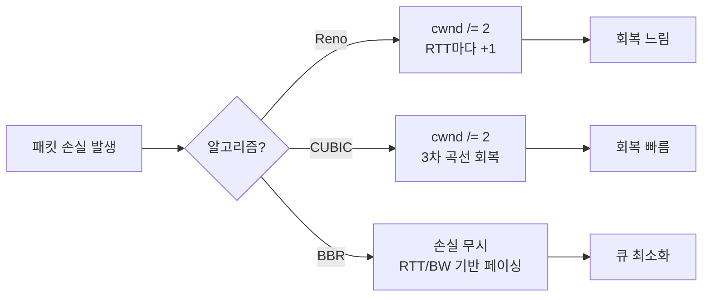

# TCP 혼잡 제어와 커널 파라미터 튜닝

## 들어가며

TCP 튜닝은 평소엔 신경 쓸 일이 별로 없다. 그러다 어느 날 갑자기 "왜 인스턴스 간 처리량이 100Mbps도 안 나오죠?", "왜 CLOSE_WAIT가 만 개씩 쌓이죠?" 같은 질문이 날아온다. 그때 가서 `tcp_window_scaling`이 뭐고 `tcp_tw_reuse`가 뭔지 검색해도 늦다. 이미 장애 한복판이다.

이 문서는 5년 동안 트래픽 많은 백엔드 서버를 운영하면서 직접 만났던 TCP 관련 문제와 그걸 풀기 위해 건드린 커널 파라미터를 정리한 글이다. 책에 나오는 일반론보다는 "이런 상황에서 이 파라미터를 이렇게 만졌더니 이렇게 됐다" 같은 구체적인 경험 위주로 썼다.

문서가 길어졌는데 한 번에 다 읽기보다는 비슷한 증상을 만났을 때 해당 절을 펼쳐서 보는 식으로 쓰는 게 낫다.

## TCP 혼잡 제어 알고리즘

### 왜 혼잡 제어가 필요한가

TCP는 두 가지 흐름을 동시에 제어한다. 하나는 받는 쪽이 처리할 수 있는 양(수신 윈도우, rwnd), 다른 하나는 네트워크 경로가 감당할 수 있는 양(혼잡 윈도우, cwnd)이다. 실제로 송신자가 한 번에 보낼 수 있는 양은 `min(rwnd, cwnd)`다.

수신 윈도우는 받는 쪽이 ACK에 명시해서 알려준다. 문제는 혼잡 윈도우다. 네트워크 중간 라우터가 얼마나 막혔는지 송신자가 직접 알 방법이 없다. 그래서 TCP는 패킷 손실(retransmit)이나 RTT 변화를 보고 간접적으로 추정한다. 이 추정 알고리즘이 혼잡 제어다.

### cwnd가 변하는 네 단계

알고리즘마다 디테일은 다르지만 큰 줄기는 비슷하다.

```
cwnd
  │                                  ╱╲
  │                                 ╱  ╲
  │                                ╱    ╲      ← Congestion Avoidance
  │                               ╱      ╲       (선형 증가)
  │                              ╱        ╲
  │  ssthresh ─ ─ ─ ─ ─ ─ ─ ─ ─ ╱ ─ ─ ─ ─ ─╲ ─ ─ ─
  │                            ╱            │
  │  Slow Start (지수 증가) ───╱             │  Fast Recovery
  │                           ╱              │  또는 RTO 후 재시작
  │                          ╱               ▼
  └──────────────────────────────────────────── time
```

- **Slow Start**: 시작할 때 cwnd가 IW(initial window, 보통 10 MSS)부터 출발해서 ACK 한 번 받을 때마다 두 배가 된다. RTT마다 두 배라는 뜻이다. 빠르게 가용 대역까지 차오르도록 만든 단계다.
- **Congestion Avoidance**: ssthresh를 넘어서면 안전 모드로 전환해서 RTT당 1 MSS씩만 늘린다. 한도가 어딘지 모르니까 살살 밀어 본다는 발상이다.
- **Fast Retransmit/Recovery**: duplicate ACK를 세 번 받으면 손실로 간주하고 즉시 재전송한 뒤 cwnd를 절반으로 자른다. RTO까지 기다리지 않는다.
- **RTO**: duplicate ACK도 안 오면 진짜 끊긴 거다. cwnd를 1로 초기화하고 처음부터 다시 한다. 이게 발생하면 처리량이 폭락한다.

`ss -tin`에서 `cwnd:23 ssthresh:11` 같은 값이 찍히는 이유가 이 모델이다.

### Reno와 그 후예

Reno는 가장 고전적인 형태다. cwnd를 천천히 늘리다가 패킷 손실을 감지하면 절반으로 깎는다(multiplicative decrease). 이 단순한 모델은 LAN처럼 손실이 거의 없는 환경에선 잘 작동한다.

문제는 Long Fat Network에서 터진다. RTT 100ms에 1Gbps 회선을 쓰는 경우, 한 번 손실이 나면 cwnd가 절반으로 떨어진 뒤 다시 원상복구 되는 데 수십 초가 걸린다. 패킷 1개 잃었다고 처리량이 50%로 주저앉는 셈이다. 클라우드 리전 간 통신이 답답한 이유 중 하나가 이거다.

NewReno는 한 번의 fast recovery 안에서 여러 패킷이 손실되는 경우를 보완했다. SACK(Selective ACK)는 어떤 세그먼트가 누락됐는지 명시적으로 알려서 송신자가 필요한 것만 골라 재전송하게 했다. 둘 다 회복 속도는 끌어올렸지만 "손실=절반"이라는 근본 동작은 그대로다.

### CUBIC

리눅스 2.6.19부터 기본값이 된 알고리즘이다. 이름 그대로 cwnd 회복 곡선을 3차 함수로 그린다. 손실이 난 직후엔 빠르게 회복하다가 직전 손실 지점 근처에서는 천천히 늘리는 식이다. RTT가 길어도 회복이 빨라서 광대역 환경에서 Reno 대비 처리량이 몇 배 차이난다.

요즘 리눅스 서버에서 `sysctl net.ipv4.tcp_congestion_control`을 찍으면 거의 다 cubic이다. 이게 사실상의 표준이다.

```bash
# 현재 사용 중인 알고리즘 확인
sysctl net.ipv4.tcp_congestion_control
# net.ipv4.tcp_congestion_control = cubic

# 사용 가능한 알고리즘 목록
sysctl net.ipv4.tcp_available_congestion_control
# net.ipv4.tcp_available_congestion_control = reno cubic bbr
```

CUBIC의 약점은 다른 손실 기반 알고리즘과 동일하다. 라우터 버퍼가 큰 환경에서 큐가 꽉 차야 비로소 cwnd를 줄이므로 bufferbloat에 취약하다.

### BBR

구글이 2016년에 공개한 알고리즘이다. 패킷 손실을 신호로 쓰지 않는다는 점에서 발상이 다르다. 대신 RTT 최솟값과 대역폭 최댓값을 측정해서 BDP(Bandwidth-Delay Product)에 맞는 송신 페이스를 직접 계산한다.

손실 기반 알고리즘은 큐가 꽉 차서 패킷이 떨어져야 비로소 cwnd를 줄인다. 라우터 버퍼가 큰 환경에선 이게 bufferbloat을 일으킨다. 큐가 잔뜩 쌓여서 RTT가 100ms에서 500ms로 늘어나도 손실은 안 나니까 TCP는 계속 밀어 넣는다. 결과적으로 처리량은 안 늘고 지연만 폭증한다.

BBR은 RTT가 늘어나는 순간을 감지하고 송신을 줄인다. 그래서 큐를 최소한으로 유지하면서 가용 대역폭을 거의 다 쓴다. 유튜브가 이걸로 해외 처리량 14% 끌어올렸다는 게 유명한 사례다.

```bash
# BBR 활성화 (qdisc도 fq로 바꿔야 한다)
echo 'net.core.default_qdisc=fq' >> /etc/sysctl.conf
echo 'net.ipv4.tcp_congestion_control=bbr' >> /etc/sysctl.conf
sysctl -p

# 모듈이 없으면 로드
modprobe tcp_bbr
```

BBR이 만능은 아니다. 같은 링크에서 CUBIC과 섞이면 BBR이 대역을 더 가져간다(공정성 문제). 사내망처럼 같은 알고리즘으로 통일된 환경에선 좋지만, 인터넷에 노출된 서버에서 무지성으로 켰다가 ISP나 CDN과 충돌이 생기는 경우도 있다. 실제로 한 번 사내 mTLS 게이트웨이에 BBR 켰다가 특정 통신사 회선에서만 처리량이 떨어지는 현상을 봤다. 결국 도로 CUBIC으로 돌렸다.

BBRv2는 ECN과 손실 신호도 같이 본다. BBRv1의 공정성 문제와 얕은 버퍼에서의 손실 폭주를 줄였다. BBRv3는 더 안정화된 버전이다. 다만 메인라인 커널에 들어간 건 v1뿐이고 v2/v3는 구글의 패치를 별도로 빌드해서 써야 한다. 일반 서버는 v1이 현실적인 선택지다.

### qdisc는 왜 fq여야 하나

BBR을 켰는데 처리량이 오히려 떨어지는 케이스가 있다. qdisc를 안 바꿔서 그렇다. BBR은 cwnd가 아니라 송신 페이싱(pacing rate)으로 속도를 조절한다. 커널이 정확한 간격으로 패킷을 내보내야 알고리즘이 의도대로 동작한다.

```bash
# 현재 qdisc 확인
tc -s qdisc show dev eth0

# fq로 변경
tc qdisc replace dev eth0 root fq
```

`pfifo_fast`나 `mq` 같은 기본 qdisc는 페이싱을 못 한다. BBR을 켤 거면 무조건 `fq`나 `fq_codel`로 바꿔야 한다.

### 어떤 걸 써야 하나

판단 기준은 단순하다.

- LAN, 사내망 위주 → CUBIC 그대로
- 리전 간, 해외 향, 모바일 클라이언트 → BBR 검토
- 임베디드, 오래된 커널 → Reno (선택의 여지가 없음)

알고리즘 변경 전후로 `ss -tin`의 `delivery_rate`, `nstat`의 재전송률, 애플리케이션 메트릭의 p95 지연을 같이 보면서 판단해야 한다. 단순 평균만 보면 BBR이 평균은 빠른데 일부 클라이언트는 느려진 케이스를 놓친다.

### TCP 알고리즘별 동작 비교



## BDP와 윈도우 크기

### BDP 계산

Bandwidth-Delay Product는 "이 회선에 한 번에 띄울 수 있는 데이터 양"이다.

```
BDP (bytes) = Bandwidth (bps) / 8 × RTT (sec)
```

예를 들어 1Gbps에 RTT 50ms 회선이라면:

```
BDP = 1,000,000,000 / 8 × 0.05 = 6,250,000 bytes ≈ 6 MB
```

송신 버퍼와 수신 윈도우가 6MB보다 작으면 회선을 절대 다 못 쓴다. 송신자는 ACK 받기 전에 버퍼만큼만 보낼 수 있는데, 6MB 보내고 멈춰 있으면 그 동안 회선이 노는 것이다.

리전 간(서울-도쿄, RTT 30ms 정도)에 EBS 백업을 보내는데 처리량이 50MB/s에서 안 올라가는 일이 있었다. 회선은 5Gbps인데 이상했다. BDP 계산해보면 5Gbps × 0.03s / 8 = 약 19MB다. 윈도우가 작아서 회선의 1/4도 못 쓰고 있었던 것이다. `net.core.rmem_max`를 32MB로 올리고 애플리케이션에서 SO_RCVBUF를 16MB로 설정하니 처리량이 4배 가까이 뛰었다.

자주 만나는 환경의 BDP를 미리 알아두면 진단할 때 빠르다.

| 환경 | 대역폭 | RTT | BDP |
|------|--------|-----|-----|
| 같은 AZ | 10Gbps | 0.5ms | 625KB |
| 리전 내 다른 AZ | 10Gbps | 2ms | 2.5MB |
| 같은 대륙 리전 간 | 1Gbps | 30ms | 3.7MB |
| 대륙 간 (서울↔미서부) | 1Gbps | 130ms | 16MB |
| 위성 회선 | 100Mbps | 600ms | 7.5MB |

위 표에서 보이듯, 같은 AZ 안에서는 기본값으로도 충분하지만 대륙 간이면 윈도우를 16MB는 잡아야 회선을 채울 수 있다.

### 윈도우 스케일링

원래 TCP 헤더의 윈도우 필드는 16비트라 최대 64KB다. 1Gbps에 RTT 1ms만 돼도 BDP가 125KB라 64KB로는 부족하다. 그래서 RFC 1323에서 윈도우 스케일링 옵션이 나왔다. SYN 단계에서 양쪽이 합의해 실제 윈도우 = 광고 윈도우 × 2^scale 형태로 확장한다.

요즘 커널은 기본으로 켜져 있다.

```bash
sysctl net.ipv4.tcp_window_scaling
# net.ipv4.tcp_window_scaling = 1
```

이걸 끄면 안 된다. 옛날 NAT 장비 때문에 끄라는 글이 가끔 있는데 2026년 환경에선 의미가 없다.

스케일은 SYN/SYN-ACK 한 번에 합의되고 연결 내내 고정된다. 그래서 SYN을 떨어뜨리는 중간 박스(오래된 방화벽 등)가 있으면 양쪽이 스케일을 0으로 협상해버려서 처리량이 박살난다. tcpdump로 SYN 패킷의 옵션 필드를 보면 `wscale` 값이 찍힌다. 의심되면 캡처해서 확인한다.

```bash
tcpdump -i any -nn 'tcp[tcpflags] & tcp-syn != 0' -vv | grep wscale
```

### Initial Window (IW10)

연결을 막 맺은 직후의 cwnd 초기값이다. 짧은 응답(HTTP 응답 한두 번 정도) 위주의 워크로드는 사실 ssthresh까지 가기 전에 끝나기 때문에 이 IW가 처리량을 결정한다.

리눅스는 RFC 6928에 따라 기본 IW=10이다. 1.4KB MSS 기준이면 첫 RTT에 14KB까지 보낼 수 있다. HTTP/1.x 응답이 평균 15KB면 거의 한 라운드에 끝난다.

CDN이나 정적 자산 서버에선 더 키우는 경우가 있다.

```bash
# route별 initial congestion window
ip route show
ip route change default via 10.0.0.1 dev eth0 initcwnd 20 initrwnd 20
```

다만 IW를 너무 키우면 회선 들어가자마자 burst가 발생해서 라우터 버퍼를 채워버린다. 결과적으로 손실이 늘 수 있다. 20 이상은 검증 없이 안 키운다.

## 송수신 버퍼 튜닝

### 시스템 전역 설정

리눅스에는 두 종류의 버퍼 한도가 있다.

```bash
# 코어 네트워크 버퍼 (모든 소켓 타입에 적용되는 hard limit)
sysctl net.core.rmem_max
sysctl net.core.wmem_max

# TCP 자동 튜닝 범위 (min, default, max)
sysctl net.ipv4.tcp_rmem
# net.ipv4.tcp_rmem = 4096 131072 6291456
sysctl net.ipv4.tcp_wmem
# net.ipv4.tcp_wmem = 4096 16384 4194304
```

`tcp_rmem`의 세 값은 각각 최소, 초기, 최대 크기다. 커널이 메모리 압박 정도에 따라 이 범위 내에서 자동으로 조정한다. 기본 max가 6MB(rmem) / 4MB(wmem)인데, 광대역 환경에선 너무 작다.

리전 간 트래픽이 많은 서버라면 이 정도까진 올린다.

```bash
# /etc/sysctl.d/99-network.conf
net.core.rmem_max = 67108864
net.core.wmem_max = 67108864
net.ipv4.tcp_rmem = 4096 87380 33554432
net.ipv4.tcp_wmem = 4096 65536 33554432
```

주의: `tcp_rmem`의 max가 `net.core.rmem_max`보다 크면 의미가 없다. 둘 다 같이 올려야 한다. 이거 모르고 tcp_rmem만 올렸다가 효과 없다고 한참 헤맨 적이 있다.

### tcp_moderate_rcvbuf

자동 튜닝의 핵심 스위치다.

```bash
sysctl net.ipv4.tcp_moderate_rcvbuf
# net.ipv4.tcp_moderate_rcvbuf = 1
```

이게 켜져 있으면 커널이 BDP를 추정해서 `tcp_rmem` 범위 안에서 수신 버퍼를 자동 조절한다. 이걸 끄면 항상 tcp_rmem의 default 값으로 고정된다. 끄지 마라.

setsockopt(SO_RCVBUF)를 명시적으로 부르는 순간 이 자동 튜닝이 꺼진다는 게 함정이다. 그래서 라이브러리가 잘못 설정해두면 커널 max를 키워도 효과가 없다.

### 애플리케이션 레벨 SO_RCVBUF/SO_SNDBUF

애플리케이션에서 setsockopt으로 직접 설정할 수도 있다. 다만 명시적으로 SO_RCVBUF를 호출하면 커널의 자동 튜닝이 꺼진다. 그래서 함부로 건드리는 게 더 위험하다.

```c
int recv_buf = 16 * 1024 * 1024;  // 16MB
setsockopt(fd, SOL_SOCKET, SO_RCVBUF, &recv_buf, sizeof(recv_buf));

int send_buf = 16 * 1024 * 1024;
setsockopt(fd, SOL_SOCKET, SO_SNDBUF, &send_buf, sizeof(send_buf));
```

리눅스는 요청한 값의 2배까지 할당한다(커널 부기 정보 공간). 그리고 `net.core.rmem_max` 한도에 걸린다. root가 아니면 한도를 못 넘는다.

자바라면 이런 식이다.

```java
ServerSocket server = new ServerSocket();
server.setReceiveBufferSize(16 * 1024 * 1024);
server.bind(new InetSocketAddress(8080));

Socket client = new Socket();
client.setSendBufferSize(16 * 1024 * 1024);
```

대부분의 웹 서버, RPC 프레임워크는 자동 튜닝에 맡기는 게 낫다. 직접 건드릴 때는 BDP 계산해서 명확한 근거가 있을 때만 한다. 무지성으로 키우면 메모리만 잡아먹고 효과는 없다. C10K 환경에서 소켓당 32MB씩 잡으면 만 개 연결만 돼도 320GB다.

### tcp_mem과 글로벌 메모리 압박

소켓별 버퍼 한도와 별개로 시스템 전체 TCP 메모리 한도가 있다.

```bash
sysctl net.ipv4.tcp_mem
# net.ipv4.tcp_mem = 92376 123168 184752  (페이지 단위, 4KB)
```

세 값은 각각 low / pressure / high 임계점이다. 사용량이 high를 넘으면 커널이 새 할당을 거부한다. pressure를 넘으면 자동 튜닝이 버퍼를 강제로 줄이기 시작한다.

대형 서버에서 동시 연결이 수십만 개가 되면 이 값이 의외로 빨리 찬다. `nstat | grep TcpExtTCPMemoryPressures`가 계속 올라가면 의심한다.

```bash
nstat -z TcpExtTCPMemoryPressures
# TcpExtTCPMemoryPressures   12  (이 숫자가 자꾸 늘면 압박 상태)

# tcp_mem 키우기
net.ipv4.tcp_mem = 786432 1048576 1572864
```

## Nagle, Delayed ACK, TCP_NODELAY

### Nagle 알고리즘

작은 패킷을 모아서 보내려는 알고리즘이다. 이전에 보낸 패킷이 ACK를 못 받았으면 새 데이터를 큐에 쌓고 기다린다. 텔넷 같은 한 글자씩 보내는 환경에서 헤더 오버헤드를 줄이려고 만들어졌다.

문제는 요즘 워크로드와 안 맞는다는 거다. HTTP 요청 같은 게 헤더 + 바디로 두 번 write 되는 경우, Nagle은 첫 패킷 ACK를 기다리느라 두 번째를 못 보낸다.

### Delayed ACK

받는 쪽도 비슷한 짓을 한다. ACK를 즉시 보내지 않고 200ms 정도 기다린다. 그 사이에 보낼 데이터가 생기면 ACK를 piggyback 해서 같이 보낸다. 따로 ACK 패킷 만드는 비용을 아끼는 것이다.

### 둘이 만나면

Nagle은 ACK를 기다리고, Delayed ACK는 데이터를 기다린다. 서로 상대를 기다리는 데드락 비슷한 상황이 만들어진다. 결과적으로 작은 메시지 두 번 보내는 데 200ms씩 깎이는 일이 벌어진다.

```
송신자                       수신자
  │                            │
  │── 작은 데이터 (Nagle 보류) →│
  │                            │ ← Delayed ACK (데이터 더 기다림)
  │                            │
  │  ... 200ms 대기 ...         │
  │                            │
  │← ACK (타이머 만료) ─────────│
  │                            │
  │── 두 번째 write ──────────→ │
```

Redis나 Memcached 클라이언트가 응답이 왜 이렇게 느리지 싶을 때 십중팔구 이 조합이다.

해결은 단순하다. 송신 쪽에서 TCP_NODELAY를 켠다.

```c
int flag = 1;
setsockopt(fd, IPPROTO_TCP, TCP_NODELAY, &flag, sizeof(flag));
```

자바.

```java
socket.setTcpNoDelay(true);
```

Go는 더 간단하다. net.TCPConn은 기본적으로 NODELAY가 켜져 있다.

대부분의 RPC 프레임워크(gRPC, Thrift), 메시지 브로커 클라이언트, Redis 클라이언트는 NODELAY가 기본이다. 직접 소켓 다룰 때만 신경 쓰면 된다.

다만 짧은 메시지를 빈도 높게 보내는 워크로드에서 NODELAY를 켜면 패킷 수가 폭증한다. 1만 RPS에 평균 메시지 100바이트면 패킷도 1만 개 + 헤더 오버헤드가 그대로다. 이 경우 애플리케이션 레벨에서 배치 묶음을 직접 구현하는 편이 낫다.

### TCP_CORK

NODELAY의 반대편이다. 명시적으로 데이터를 묶었다가 한 번에 내보낸다. 헤더 + 바디를 sendfile로 보내는 정적 파일 서버에서 쓴다. nginx의 `tcp_nopush` 디렉티브가 이걸 켠다.

```c
int flag = 1;
setsockopt(fd, IPPROTO_TCP, TCP_CORK, &flag, sizeof(flag));
// ... 여러 번 write ...
flag = 0;
setsockopt(fd, IPPROTO_TCP, TCP_CORK, &flag, sizeof(flag));  // flush
```

NODELAY와 CORK는 동시에 켜면 CORK가 우선이다. CORK 해제 시점에 곧바로 보내진다.

### TCP_QUICKACK

받는 쪽에서 Delayed ACK를 끄는 옵션이다. 다만 영구 설정이 아니라 매 read마다 다시 켜야 한다. 커널이 알아서 토글한다.

```c
int flag = 1;
setsockopt(fd, IPPROTO_TCP, TCP_QUICKACK, &flag, sizeof(flag));
```

요청-응답이 명확하게 핑퐁 식으로 도는 워크로드에서 가끔 쓴다. 실제로 효과 본 경우는 많지 않다.

## TIME_WAIT 누적

### 왜 쌓이는가

TCP를 능동적으로 종료한 쪽(먼저 FIN 보낸 쪽)은 마지막에 TIME_WAIT 상태로 들어간다. 2 × MSL(보통 60초) 동안 포트를 점유한다. 늦게 도착한 패킷이 다음 연결과 섞이지 않게 하기 위함이다.

문제는 부하 테스트나 Healthcheck 폭격 같은 시나리오다. 짧은 연결을 초당 수천 개씩 만들고 끊으면 TIME_WAIT가 만 단위로 쌓인다.

```bash
ss -tan state time-wait | wc -l
# 28491
```

`net.ipv4.ip_local_port_range`가 32768-60999면 가용 포트는 약 28000개다. TIME_WAIT가 그만큼 쌓이면 새 outbound 연결이 안 만들어진다. `connect: cannot assign requested address` 에러가 그거다.

### 4-tuple 관점에서 다시 보기

포트 소진은 정확히는 `(src_ip, src_port, dst_ip, dst_port)` 4-tuple이 고갈되는 거다. 같은 dst로 가는 경우에만 src_port가 충돌한다. 그래서 outbound 트래픽이 다양한 목적지로 흩어지면 사실 28000개로도 꽤 버틴다.

문제가 되는 건 한 목적지(예: 내부 DB나 API)에 트래픽이 집중될 때다. 이 경우 src_ip를 늘리는 게 빠른 해결책이다. ENI를 추가하거나 secondary IP를 붙이면 그만큼 4-tuple 공간이 늘어난다.

### 해결 순서

먼저 의심해야 할 건 애플리케이션이다. HTTP 클라이언트를 매 요청마다 새로 만들고 있진 않은가, 커넥션 풀이 너무 작거나 keep-alive가 꺼져 있진 않은가. 대부분 여기서 잡힌다.

```python
# 매번 새 세션 만드는 안티 패턴
def call_api():
    return requests.get("http://internal/api")  # TIME_WAIT 폭탄

# 세션 재사용
session = requests.Session()
def call_api():
    return session.get("http://internal/api")
```

그래도 누적이 잡히지 않으면 커널 파라미터를 본다.

### tcp_tw_reuse

TIME_WAIT 상태인 소켓을 새 outbound 연결에 재활용한다. 타임스탬프(RFC 1323)가 켜져 있어야 안전하게 동작한다. 클라이언트 쪽에서 효과 본다.

```bash
sysctl -w net.ipv4.tcp_tw_reuse=1
```

이건 옛날부터 안전하다고 평가받는 옵션이다. 마음 편히 켤 수 있다.

### tcp_tw_recycle (사용 금지)

이름이 비슷해서 같이 켜는 사람이 있는데, 이건 절대 켜면 안 된다. 4.12 커널부터 아예 제거됐다. NAT 뒤에 있는 클라이언트들의 타임스탬프가 섞여서 SYN이 무작위로 드랍되는 문제가 있었다. 사내 NAT 환경에서 이거 켰다가 반쯤 죽은 사례가 인터넷에 차고 넘친다.

### 포트 범위 확장

```bash
sysctl -w net.ipv4.ip_local_port_range="10000 65535"
```

가용 포트를 약 두 배로 늘린다. tw_reuse와 같이 쓴다.

다만 10000 이하 영역에 다른 서비스(예: 9200 Elasticsearch, 8080 등)가 listen 중이면 충돌이 난다. `ip_local_reserved_ports`에 해당 포트를 등록해서 outbound 할당에서 제외해야 한다.

```bash
sysctl -w net.ipv4.ip_local_reserved_ports="9200,8080,8500"
```

### tcp_max_tw_buckets

TIME_WAIT 상태 소켓의 최대 개수다. 이걸 넘으면 그냥 즉시 RST로 끊어버린다. 메모리 보호용이다.

```bash
sysctl net.ipv4.tcp_max_tw_buckets
# net.ipv4.tcp_max_tw_buckets = 65536
```

기본값으로도 보통 충분하다. 너무 작게 잡으면 정상 종료가 RST로 바뀌어서 다른 문제가 생긴다.

## CLOSE_WAIT 누적

### TIME_WAIT와 다른 문제

CLOSE_WAIT는 상대가 FIN을 보냈는데 우리 쪽이 close()를 안 한 상태다. 타임아웃이 없다. close 호출하기 전까지 영원히 그 상태다.

```bash
ss -tan state close-wait
```

CLOSE_WAIT가 쌓인다는 건 100% 애플리케이션 버그다. 커널 파라미터로 풀 수 없다. 코드를 봐야 한다.

흔한 패턴.

```java
// 예외 났을 때 close 안 함
Socket s = new Socket(host, port);
InputStream in = s.getInputStream();
process(in);  // 여기서 예외 → s.close() 호출 못 함
s.close();
```

```java
// try-with-resources로 보장
try (Socket s = new Socket(host, port)) {
    process(s.getInputStream());
}
```

DB 커넥션 풀, HTTP 클라이언트 풀에서 health check가 실패해서 풀이 소켓을 못 회수하는 경우도 있다. 풀 라이브러리(HikariCP, Apache HttpClient 등)의 `validation`, `evictionInterval` 설정을 다시 본다.

조사할 때 `lsof -i -nP | grep CLOSE_WAIT`로 어떤 프로세스가 들고 있는지 본 다음 그 프로세스의 코드를 따라간다.

JVM이면 더 자세히 봐야 할 게 있다.

```bash
# 어떤 스레드가 close_wait fd를 들고 있는지
jstack <pid> | grep -A 20 -i "socket\|http"
```

비동기 클라이언트(Netty, Reactor)는 채널을 명시적으로 release/close 안 하면 GC 전까지 안 닫힌다. 자원 누수의 정석 패턴이다.

## ECN과 명시적 혼잡 신호

손실 기반 알고리즘은 "큐 넘쳐서 패킷이 떨어져야" 혼잡을 알 수 있다. ECN(Explicit Congestion Notification)은 라우터가 패킷을 떨어뜨리지 않고 IP 헤더의 CE 비트를 켜서 "곧 넘칠 거다"라고 알려주는 방식이다.

```bash
sysctl net.ipv4.tcp_ecn
# 0: 사용 안 함
# 1: 양방향 (서버/클라이언트 모두 협상)
# 2: 들어오는 SYN만 ECN 협상 수락 (기본값)
```

기본값 2가 보수적인 선택이다. 우리가 능동적으로 ECN을 요청하지는 않고, 상대가 요청하면 받아준다. 1로 켜면 outbound 연결도 ECN을 협상한다.

문제는 인터넷의 일부 미들박스가 ECN 비트를 보고 SYN을 떨어뜨리는 경우가 있다는 거다. 옛날만큼 심하진 않지만 여전히 가끔 만난다. 사내망이나 클라우드 내부 트래픽에서는 안전하게 켤 수 있다.

데이터센터 내부에선 DCTCP라는 ECN 기반 변종을 쓰는 경우도 있다. ECN 마킹 비율을 보고 cwnd를 비례적으로 줄인다. 일반 ECN보다 더 적극적으로 큐 길이를 짧게 유지한다.

```bash
sysctl -w net.ipv4.tcp_congestion_control=dctcp
sysctl -w net.ipv4.tcp_ecn=1
```

DC 내부 RDMA-like 워크로드(분산 학습, 분산 스토리지)에서 효과가 크다. 일반 인터넷 트래픽엔 권장하지 않는다.

## qdisc와 페이싱

### qdisc가 무엇을 하나

qdisc(queueing discipline)는 NIC로 패킷을 내보내기 직전의 큐 정책이다. 어떤 패킷을 먼저 보낼지, 한 번에 얼마나 보낼지, 누가 너무 많이 쓰면 어떻게 할지를 결정한다.

리눅스 기본은 보통 `fq_codel`이거나 멀티큐 NIC면 `mq`다. 확인은 이렇게 한다.

```bash
tc qdisc show dev eth0
# qdisc fq_codel 0: root refcnt 2 ... limit 10240p flows 1024 quantum 1514

# 기본 qdisc 변경
sysctl -w net.core.default_qdisc=fq
```

### fq와 BBR

앞에서 잠깐 언급했지만 BBR을 켤 때 fq가 필요한 이유는 정확한 페이싱(packet pacing) 때문이다. BBR이 계산한 송신 페이스를 fq가 ns 단위 타이머로 정확히 내보낸다. 다른 qdisc는 이 페이싱 인터페이스를 지원하지 않거나 버킷 단위로만 처리한다.

`fq_codel`도 페이싱은 되지만 fq보다 정밀도가 떨어진다. 데이터센터에서 BBR 쓸 거면 fq를 권장한다.

### bufferbloat과 fq_codel

집/엑세스 망의 라우터 버퍼가 너무 크면 손실 기반 TCP가 큐를 가득 채워서 인터넷 지연이 폭증한다. 이게 bufferbloat이다.

`fq_codel`은 큐 안의 패킷 체류 시간을 측정해서 너무 오래 머문 패킷은 떨어뜨린다. 동시에 flow별로 큐를 분리해서 한 헤비 플로우가 다른 플로우를 굶기지 못하게 한다.

```bash
tc qdisc replace dev eth0 root fq_codel
```

서버 쪽 NIC가 직접 ISP에 물려 있는 경우가 아니면 큰 차이는 없다. 클라우드의 가상 NIC라면 그냥 fq나 fq_codel 중 하나로 두면 된다.

### TSO/GSO와의 상호작용

TSO(TCP Segmentation Offload)는 큰 데이터를 한 번에 NIC에게 넘기고 NIC가 MSS 단위로 잘라 보낸다. GSO는 그 소프트웨어 버전이다. CPU 절약 효과가 크다.

페이싱이 정밀해야 하는 BBR에선 TSO 청크가 너무 크면 burst가 발생한다. 그래서 BBR은 TSO 청크 크기를 자동으로 제한한다. 따로 끌 필요는 없다.

확인은 ethtool로 한다.

```bash
ethtool -k eth0 | grep -E 'tcp-seg|generic-seg'
# tcp-segmentation-offload: on
# generic-segmentation-offload: on
```

켜져 있는 게 정상이다.

## 자주 건드리는 net.ipv4.tcp_* 파라미터

### tcp_fin_timeout

FIN_WAIT_2 상태 타임아웃. 우리가 close 했는데 상대가 ACK만 보내고 FIN을 안 보낼 때 그 상태로 머문다. 기본 60초.

```bash
sysctl -w net.ipv4.tcp_fin_timeout=15
```

좀비 클라이언트가 많은 환경에서 줄여둔다.

### tcp_keepalive_*

```bash
sysctl net.ipv4.tcp_keepalive_time     # 7200 (2시간)
sysctl net.ipv4.tcp_keepalive_intvl    # 75
sysctl net.ipv4.tcp_keepalive_probes   # 9
```

기본 keep-alive는 2시간 동안 트래픽이 없으면 그제서야 프로브를 시작한다. LB나 NAT가 5분 만에 세션을 끊는 환경에선 쓸모가 없다. 그래서 보통 애플리케이션 레벨에서 더 짧게 설정한다.

```bash
# 사내 LB 타임아웃이 5분이면
sysctl -w net.ipv4.tcp_keepalive_time=240
sysctl -w net.ipv4.tcp_keepalive_intvl=30
sysctl -w net.ipv4.tcp_keepalive_probes=3
```

이러면 4분에 첫 프로브, 30초마다 3번 시도, 6분 안에 죽은 연결을 정리한다.

### tcp_syncookies

SYN flood 방어용. 백로그 큐가 꽉 차면 쿠키 기반으로 SYN+ACK를 만들어 보낸다. 합법 클라이언트의 ACK가 돌아오면 그제서야 진짜 소켓을 만든다.

```bash
sysctl -w net.ipv4.tcp_syncookies=1
```

요즘 배포판은 기본으로 켜져 있다. 끌 이유가 없다.

다만 syncookies가 켜진 채로 백로그가 넘치면 TCP 옵션(SACK, wscale 등)이 일부 무시된다는 함정이 있다. 평상시에는 백로그가 안 넘치게 운영하는 게 우선이다.

### tcp_max_syn_backlog, somaxconn

```bash
sysctl net.ipv4.tcp_max_syn_backlog
sysctl net.core.somaxconn
```

`tcp_max_syn_backlog`은 SYN_RECV 상태 큐 크기. `somaxconn`은 ESTABLISHED 후 accept() 대기 큐 크기. 둘 다 부하 큰 서버에선 기본 4096이 작다.

```bash
sysctl -w net.core.somaxconn=32768
sysctl -w net.ipv4.tcp_max_syn_backlog=32768
```

다만 listen() 시점에 backlog 인자를 같이 키워야 한다. 자바의 ServerSocket(port, backlog) 같은 거다. 커널 값만 키워도 애플리케이션이 작은 backlog로 listen 했으면 작은 쪽이 적용된다.

```java
// 기본값 50으로 listen 하면 somaxconn=32768도 의미 없음
new ServerSocket(8080, 32768);
```

Spring Boot 임베디드 톰캣이면 `server.tomcat.accept-count`다. nginx면 `listen backlog=`다. 이 값들과 somaxconn을 같이 봐야 한다.

### tcp_slow_start_after_idle

연결이 잠시 idle 상태였다가 다시 데이터를 보낼 때 cwnd를 초기화하고 slow start부터 다시 한다. 장수명 keep-alive 연결이 많은 환경(HTTP/2, gRPC 스트림)에선 처리량을 갉아먹는다.

```bash
sysctl -w net.ipv4.tcp_slow_start_after_idle=0
```

이거 끄면 idle 후에도 cwnd가 유지된다. 트래픽 패턴이 burst 한 API 게이트웨이에서 처리량 차이를 본 적이 있다.

### tcp_notsent_lowat

송신 큐에 sent되지 않고 쌓일 수 있는 양의 상한이다. 기본은 무제한(uint max). HTTP/2 같은 멀티플렉싱 프로토콜에서 한 스트림이 송신 큐를 다 차지하는 head-of-line blocking을 줄이려고 작게 잡는다.

```bash
sysctl -w net.ipv4.tcp_notsent_lowat=131072
```

128KB 정도가 흔히 쓰는 값이다. 구글이 HTTP/2 운영 가이드에서 추천한 적 있다.

### tcp_sack과 tcp_dsack

```bash
sysctl net.ipv4.tcp_sack    # 1
sysctl net.ipv4.tcp_dsack   # 1
```

SACK는 손실된 세그먼트를 골라서 재전송할 수 있게 해주는 옵션이다. DSACK는 중복 수신했을 때 그걸 알려주는 확장이다. 둘 다 켜져 있는 게 정상. 끌 이유가 없다.

가끔 보안 권고로 끄라는 글이 보이는데, 그건 CVE-2019-11477("SACK Panic")처럼 특정 커널 버전의 버그 회피용이었다. 패치된 커널이면 그대로 둔다.

### tcp_fastopen

TCP Fast Open(TFO). 3-way handshake의 SYN 단계에 데이터를 같이 실어 보낸다. 한 RTT를 절약한다.

```bash
sysctl net.ipv4.tcp_fastopen
# 0: off, 1: 클라이언트, 2: 서버, 3: 양쪽
```

좋아 보이지만 현실에서 잘 안 쓰는 이유가 있다. 미들박스가 SYN의 데이터 옵션을 보고 떨어뜨리는 경우가 있고, 애플리케이션이 sendto/MSG_FASTOPEN을 명시적으로 호출해야 동작한다. 그래서 기본 라이브러리만 쓰면 켜져 있어도 효과가 없다.

QUIC(HTTP/3)가 보편화되면서 TFO의 입지가 더 좁아졌다. 굳이 쓸 이유가 없다.

### tcp_no_metrics_save

리눅스는 연결이 종료될 때 RTT, ssthresh 등의 메트릭을 라우트 캐시에 저장해서 같은 목적지로 가는 다음 연결의 초기값으로 쓴다. 그런데 이 캐시된 값이 잘못되면(과거 손실 때문에 ssthresh가 낮게 저장됨) 새 연결도 손해를 본다.

```bash
sysctl -w net.ipv4.tcp_no_metrics_save=1
```

이러면 캐시를 안 쓴다. 처리량이 들쭉날쭉한 환경에서 일관성을 위해 켜는 경우가 있다. 다만 효과가 명확하지 않으니 기본값 0으로 두는 게 무난하다.

### tcp_thin_linear_timeouts

작은 응답을 주고받는 연결("thin stream")에서 RTO를 더 적극적으로 짧게 잡는다. 게임 서버나 인터랙티브 SSH 같은 워크로드에 쓴다.

```bash
sysctl -w net.ipv4.tcp_thin_linear_timeouts=1
```

대부분 서비스엔 의미 없다.

## 진단할 때 보는 것들

### 현재 상태 한눈에 보기

```bash
# 상태별 소켓 개수
ss -tan | awk 'NR>1 {print $1}' | sort | uniq -c

# 재전송 카운터
nstat -z | grep -i retrans
# TcpExtTCPLostRetransmit  142
# TcpRetransSegs           58291

# 혼잡 윈도우 / RTT를 소켓별로
ss -tin
```

`ss -tin`이 의외로 쓸 만하다. cwnd, rtt, rto, retrans 횟수를 연결별로 보여준다.

```
ESTAB  0  0  10.0.1.5:8080  10.0.2.7:53124
    cubic wscale:8,8 rto:204 rtt:1.234/0.567 ato:40
    mss:1448 cwnd:23 ssthresh:11 bytes_sent:1234567
    bytes_acked:1234500 segs_out:891 segs_in:445 send 216.5Mbps
    lastsnd:4 lastrcv:4 lastack:4 pacing_rate 433Mbps
    delivery_rate 215.3Mbps app_limited
```

해석할 때 자주 보는 필드.

- `cwnd`: 현재 혼잡 윈도우(MSS 단위). 위 예시는 23 × 1448 ≈ 33KB.
- `ssthresh`: 다음 cwnd가 도달하면 congestion avoidance로 전환되는 임계점.
- `rtt`: smoothed RTT / mean deviation. 둘 다 ms 단위.
- `retrans`: 누적 재전송 횟수. 새로 측정하려면 ss 끄고 다시 봐야 한다.
- `delivery_rate`: 실제 전달 속도. 회선 대역폭에 가까우면 잘 가고 있는 것.
- `app_limited`: 애플리케이션이 데이터를 못 채우고 있다는 표시. 이게 떠 있으면 네트워크가 아니라 애플리케이션 쪽이 병목이다.

### sysctl 한꺼번에 보기

```bash
sysctl -a 2>/dev/null | grep -E '^net\.(ipv4\.tcp_|core\.[rw]mem)' | sort
```

### 패킷 손실 확인

```bash
nstat -z TcpRetransSegs TcpInSegs
# 이 둘의 비율이 1% 넘으면 의심
```

`TcpExtTCPLostRetransmit`은 재전송한 패킷이 또 손실된 케이스다. 이게 많다는 건 경로가 진짜 문제다.

`TcpExtTCPSpuriousRetransmits`는 불필요한 재전송이다. RTT 추정이 너무 짧아져서 ACK 늦게 온 걸 손실로 오인한 경우. 모바일 환경에서 자주 본다.

### eBPF로 더 깊이 보기

bpftrace나 bcc 도구로 커널 내부 이벤트를 직접 본다.

```bash
# tcpconnect: 새 outbound 연결 추적
/usr/share/bcc/tools/tcpconnect

# tcpretrans: 재전송 이벤트
/usr/share/bcc/tools/tcpretrans
# TIME     PID     IP LADDR:LPORT          T> RADDR:RPORT          STATE
# 14:23:01 1234    4  10.0.0.5:443         R> 1.2.3.4:54321        ESTABLISHED

# tcplife: 연결 수명과 처리량
/usr/share/bcc/tools/tcplife

# tcpdrop: 패킷 드롭 이유
/usr/share/bcc/tools/tcpdrop
```

`tcpdrop`은 특히 좋다. 어떤 이유로 패킷이 떨어졌는지 커널 스택 트레이스와 함께 보여준다. 알 수 없는 RST가 발생할 때 단서가 된다.

bpftrace 일회용 스니펫.

```bash
# RTT 변화 추적
bpftrace -e 'kprobe:tcp_rcv_established {
  $sk = (struct sock *)arg0;
  $tp = (struct tcp_sock *)$sk;
  @rtt = hist($tp->srtt_us >> 3);
}'
```

운영 중에 풀가동하지는 말고, 재현 가능한 시점에 잠깐 켜서 본다.

### tcpdump 정석

```bash
# 특정 호스트, SYN/FIN/RST만
tcpdump -i any -nn 'host 10.0.1.5 and (tcp[tcpflags] & (tcp-syn|tcp-fin|tcp-rst) != 0)' -w /tmp/trace.pcap

# 캡처 후 wireshark의 Statistics → TCP Stream Graph로 cwnd 그래프
```

처음부터 풀 캡처는 디스크 폭탄이다. BPF 필터로 좁히고 -s 옵션으로 페이로드를 자른다.

```bash
tcpdump -i eth0 -s 96 -nn 'tcp port 443' -w /tmp/trace.pcap
```

### 메트릭 자동 수집

운영 환경에선 위 명령을 매번 치는 게 아니라 노드 익스포터에 TCP 메트릭을 같이 띄우고 그라파나에서 본다.

- `node_netstat_Tcp_*` (Prometheus node_exporter)
- `node_netstat_TcpExt_*` (확장 카운터)

`TcpExt_TCPMemoryPressures`, `TcpExt_TCPSlowStartRetrans`, `TcpExt_ListenOverflows` 같은 지표에 알람을 걸어두면 장애 전조를 잡을 수 있다.

## 실무 튜닝 사례 정리

### 사례 1: 리전 간 백업 처리량 부족

증상: 서울→도쿄 EBS 스냅샷 복사가 50MB/s에서 정체. 회선은 5Gbps.

진단: `ss -tin`으로 보니 cwnd는 충분히 컸는데 rwnd가 6MB 근처에서 멈춰 있었다.

원인: BDP 19MB인데 송수신 버퍼 max가 6MB.

처방:
```bash
net.core.rmem_max = 67108864
net.core.wmem_max = 67108864
net.ipv4.tcp_rmem = 4096 87380 33554432
net.ipv4.tcp_wmem = 4096 65536 33554432
```

결과: 200MB/s까지 상승. BBR도 같이 켰으면 더 올랐을 텐데 당시엔 검증이 안 됐어서 보류했다.

### 사례 2: API 게이트웨이 TIME_WAIT 폭주

증상: 피크 시간에 outbound 연결이 안 만들어지면서 502 에러 폭증.

진단: `ss -tan state time-wait | wc -l`이 27000을 넘었다. 가용 포트 28000이 다 찼다.

원인: 백엔드 호출용 HTTP 클라이언트가 keep-alive를 안 쓰고 있었다. 매 요청마다 새 connection.

1차 처방: 클라이언트 keep-alive + 커넥션 풀 도입. 90% 해결.

2차 처방:
```bash
net.ipv4.tcp_tw_reuse = 1
net.ipv4.ip_local_port_range = 10000 65535
```

이걸로 잔여분도 안전 마진 안에 들어갔다.

### 사례 3: WebSocket 서버 CLOSE_WAIT 누적

증상: 서비스 시작 후 며칠 지나면 CLOSE_WAIT가 수천 개. 결국 파일 디스크립터 한도 도달하고 OOM.

진단: `lsof -i -nP | grep CLOSE_WAIT`로 보니 같은 자바 프로세스의 fd. jstack 떠보니 worker 스레드가 read()에 블록되어 있었다.

원인: 클라이언트가 비정상 종료할 때(모바일 백그라운드 등) FIN이 와도 애플리케이션 핸들러가 여전히 read()에 블록되어 있었다. 핸들러 종료 후에야 close() 호출.

처방: read 타임아웃 추가, 주기적으로 idle connection 정리, keep-alive ping 추가. 커널 파라미터로 풀 수 없는 문제였다.

### 사례 4: gRPC 스트리밍 지연 spike

증상: 평소엔 1ms RTT인데 가끔 200ms씩 튀는 응답.

진단: tcpdump로 캡처해서 wireshark로 보니 ACK가 정확히 200ms 늦게 도착하는 패턴.

원인: gRPC 클라이언트가 Nagle은 안 켜져 있었지만 서버 쪽 Delayed ACK가 작동. 작은 메시지 응답에서 ACK 200ms 지연.

처방: 양쪽 다 TCP_NODELAY 명시적 설정. 라이브러리에 따라 기본값이 달라서 확인이 필요했다.

### 사례 5: 부하 테스트 중 SYN 드랍

증상: wrk로 부하 줄 때 일정 RPS 넘어가면 connection refused가 폭증.

진단: `nstat -z TcpExtListenOverflows TcpExtListenDrops` 둘 다 빠르게 증가. accept 큐가 넘치고 있었다.

원인: 톰캣 `acceptCount`가 100이었다. somaxconn이 4096이어도 listen()이 100으로 들어가서 그게 한도.

처방:
```bash
sysctl -w net.core.somaxconn=32768
```
+ Spring Boot `server.tomcat.accept-count=8192` 설정.

결과: 한 노드당 처리 RPS가 2배 가까이 올라갔다. accept 큐가 부족해서 SYN을 떨어뜨리고 있던 거지 CPU나 메모리는 여유가 있었다.

### 사례 6: BBR 도입 후 일부 클라이언트 처리량 저하

증상: 사내 API 게이트웨이에 BBR 켰는데 모니터링에선 전체 처리량 평균이 올랐다. 그런데 특정 통신사 모바일 사용자만 지연이 늘었다는 제보가 왔다.

진단: 클라이언트 측 메트릭을 통신사별로 쪼개 보니 한 통신사 회선의 p95 응답시간이 1.5초에서 4초로 증가. 그쪽 회선의 RTT가 평소에도 200ms 이상이라 BBR의 minRTT 추정이 자주 갱신되면서 페이싱이 출렁였다.

처방: 게이트웨이 BBR 해제, CUBIC으로 복구. BBR은 안정적인 경로에서만 효과가 큰데 변동 큰 모바일 회선에서는 오히려 손해를 봤다.

교훈: BBR 도입은 전체 평균만 보면 안 된다. 클라이언트 코호트별로 p95/p99를 보고 손해 보는 그룹이 있는지 확인한다.

### 사례 7: 데이터 적재 파이프라인 처리량 갑작스러운 저하

증상: 평소 800MB/s로 적재되던 Kafka → S3 파이프라인이 어느 날 300MB/s로 떨어짐.

진단: `nstat`로 보니 `TcpExtTCPMemoryPressures`가 분당 수백 회 증가. `cat /proc/net/sockstat`을 보니 TCP memory used가 max에 닿아 있었다.

원인: 동시 연결 수가 2배 늘었는데 `net.ipv4.tcp_mem` 한도가 그대로였다. 메모리 압박이 발생할 때마다 커널이 모든 연결의 버퍼를 강제로 줄여서 처리량이 떨어진 것.

처방:
```bash
# 페이지 단위, 4KB 기준
net.ipv4.tcp_mem = 786432 1048576 1572864
```

결과: 다음 날 처리량 정상화. 단일 연결 튜닝만 보다가 시스템 전역 한도를 놓친 케이스였다.

## 마지막으로

네트워크 튜닝의 첫 번째 원칙은 "측정 없이 만지지 마라"다. CUBIC을 BBR로 바꾸는 건 한 줄이지만 그게 효과 있는지, 부작용 없는지는 측정해야 안다. `ss -tin`으로 cwnd 보고, `nstat`으로 재전송률 보고, `tcpdump`로 실제 패킷 흐름 보고 나서 결정한다.

두 번째는 "애플리케이션 먼저, 커널 나중에"다. CLOSE_WAIT 누적을 sysctl로 풀 수 없듯이, 대부분의 TCP 문제는 코드에서 시작된다. 커넥션 풀 설정, keep-alive, 타임아웃, 에러 핸들링을 점검한 다음에 커널을 본다.

세 번째는 "기본값을 의심하라"다. 리눅스 기본값은 90년대 다이얼업 환경에 맞춰진 게 많다. 1Gbps 회선에서 윈도우 max가 6MB인 게 그런 잔재다. 환경에 맞게 다시 잡는다.

네 번째는 "한 번에 하나씩"이다. sysctl 열 줄을 한 번에 바꾸면 어느 게 효과 있었는지 모른다. 하나 바꾸고, 측정하고, 다음 걸 바꾼다. 변경 이력을 sysctl 파일 주석으로 남겨두면 6개월 뒤 다른 사람이 봐도 이해한다.
