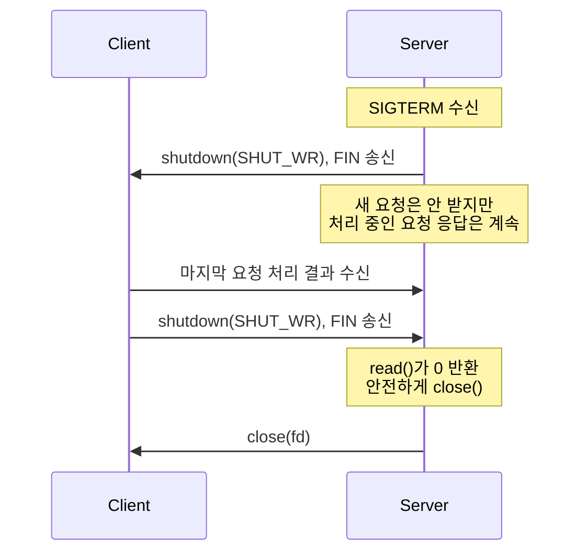

# TCP 소켓 프로그래밍 실무 패턴

TCP 프로토콜 자체의 동작은 핸드셰이크와 상태 머신, 혼잡 제어로 설명이 끝난다. 그런데 애플리케이션 코드를 짜다 보면 그 위에 또 다른 층이 있다. 소켓 옵션을 어떻게 잡느냐, close()를 어떤 식으로 부르느냐, 부분 전송을 어떻게 처리하느냐. 커넥션 풀 라이브러리, 게임 서버, 메시지 브로커 클라이언트 같은 걸 만들다 보면 이 영역에서 시간을 가장 많이 잡아먹는다.

이 문서는 TCP 프로토콜 동작을 이미 안다는 전제로, 그 위에서 소켓을 어떻게 다루는지 정리한다.

## SO_REUSEADDR과 SO_REUSEPORT

배포 직후 서비스를 재시작했는데 `EADDRINUSE` 에러가 뜬다. 분명 프로세스는 죽었는데 포트가 안 풀린다. 이게 TIME_WAIT 상태 때문이라는 건 알 텐데, 그래서 다들 `SO_REUSEADDR`을 켠다.

`SO_REUSEADDR`이 하는 일은 단순하다. TIME_WAIT 상태에 있는 소켓이 점유 중인 포트를 새 소켓이 bind할 수 있게 해준다. Linux 기준으로는 와일드카드 주소(0.0.0.0)와 특정 주소 사이의 bind 충돌도 일부 허용한다.

문제는 `SO_REUSEADDR`이 같은 포트에 두 프로세스가 동시에 listen하는 걸 허용하지는 않는다는 점이다. 그래서 Nginx worker나 Node cluster처럼 여러 워커가 같은 포트로 들어오는 연결을 나눠 받고 싶을 때는 부족하다. 마스터 프로세스 하나가 listen하고 accept된 fd를 워커한테 넘기는 식으로 우회해야 했다.

`SO_REUSEPORT`는 Linux 3.9부터 들어온 옵션인데, 같은 주소·포트에 여러 소켓이 동시에 listen할 수 있게 해준다. 커널이 들어오는 SYN을 5-tuple 해시로 워커에 분산시킨다. 이게 들어오면서 사용자 공간에서 fd를 넘기던 코드가 거의 사라졌다.

```javascript
const net = require('net');

// SO_REUSEADDR: TIME_WAIT 회피용
const server1 = net.createServer();
server1.listen({ port: 8080, exclusive: false }); // Node 기본값

// Node cluster에서 SO_REUSEPORT 흉내내기
// Node는 기본적으로 마스터가 listen하고 워커에 round-robin으로 분배한다
// 진짜 SO_REUSEPORT를 쓰려면 cluster의 schedulingPolicy를 None으로 두고
// 각 워커에서 reusePort: true (Node 23+) 또는 net.createServer에 직접 옵션을 줘야 한다
const cluster = require('cluster');
if (cluster.isPrimary) {
  for (let i = 0; i < 4; i++) cluster.fork();
} else {
  // Node 23 이상에서 reusePort: true 지원
  net.createServer().listen({ port: 8080, reusePort: true });
}
```

C 시스템 콜 레벨로 내려가면 옵션 차이가 더 명확해진다.

```c
int fd = socket(AF_INET, SOCK_STREAM, 0);

int opt = 1;
// 두 옵션은 독립이다. 둘 다 켜는 게 일반적
setsockopt(fd, SOL_SOCKET, SO_REUSEADDR, &opt, sizeof(opt));
setsockopt(fd, SOL_SOCKET, SO_REUSEPORT, &opt, sizeof(opt));

struct sockaddr_in addr = { .sin_family = AF_INET,
                            .sin_port = htons(8080),
                            .sin_addr.s_addr = INADDR_ANY };
bind(fd, (struct sockaddr*)&addr, sizeof(addr));
listen(fd, 1024);
```

`SO_REUSEPORT`를 켜고 N개 프로세스가 같은 포트에 listen하면 커널이 부하를 알아서 나눠준다. 다만 분배는 5-tuple 해시 기반이라 클라이언트 IP가 편향되면 워커 간 부하 불균형이 생긴다. 한 IP가 트래픽의 절반을 차지하는 환경이라면 워커 하나만 죽도록 일한다.

또 하나 빠지기 쉬운 함정이 보안 측면이다. `SO_REUSEPORT`를 켠 포트에 같은 UID 프로세스라면 누구나 bind해서 들어오는 트래픽을 가로챌 수 있다. Linux 4.5부터는 `SO_REUSEPORT_LB`나 BPF 기반 분배 같은 방어 옵션이 있지만, 일반적인 컨테이너 환경에선 그냥 같은 사용자로만 돌리는 걸로 충분하다.

## SO_LINGER와 close()의 동작 변경

`close(fd)`를 부르면 보통 무슨 일이 일어나는가. 송신 버퍼에 남은 데이터를 모두 보내고, FIN을 날린 뒤, 함수가 바로 리턴한다. 실제 FIN 송신과 ACK 수신은 커널이 백그라운드에서 처리한다. graceful close라고 부른다.

`SO_LINGER`는 이 동작을 바꾼다.

```c
struct linger lin;
lin.l_onoff = 1;
lin.l_linger = 5; // 5초

setsockopt(fd, SOL_SOCKET, SO_LINGER, &lin, sizeof(lin));
```

`l_onoff=1, l_linger>0`이면 close()가 블로킹된다. 송신 버퍼가 빌 때까지, 또는 타이머가 만료될 때까지. 버퍼가 비기 전에 타이머가 끝나면 RST를 보내고 끊는다. "확실히 보내고 끊거나 아니면 깨끗하게 포기" 형태다.

`l_onoff=1, l_linger=0`은 더 거칠다. close() 호출 즉시 RST를 보내고 끊는다. 송신 버퍼에 남은 데이터는 그냥 버린다. TIME_WAIT 상태도 안 거친다.

`l_linger=0`은 두 경우에 쓴다. 첫째, 서버를 빠르게 재시작해야 하는데 TIME_WAIT가 너무 많이 쌓이는 상황. 둘째, 비정상 클라이언트를 즉시 끊어내고 싶을 때. 정상 트래픽에 쓰면 안 된다. 마지막에 보낸 데이터가 통째로 날아가서 상대는 데이터를 다 받지도 못한 채로 연결 종료를 본다.

```javascript
// Node.js에서는 socket.resetAndDestroy()가 SO_LINGER l_linger=0 + close()와 비슷한 의미
// (Node 18.3+에서 RST로 끊는다)
const net = require('net');
const socket = net.createConnection(8080, 'localhost');

socket.on('error', (err) => {
  if (err.code === 'EPIPE') {
    socket.resetAndDestroy(); // graceful close 대신 RST
  }
});

// graceful close
socket.end(); // FIN 송신, 송신 버퍼 비울 때까지 대기
```

게임 서버를 만들 때 한 가지 실수를 한 적이 있다. 클라이언트가 인증에 실패하면 즉시 `close()`만 부르고 끝냈는데, 인증 실패 메시지를 보내자마자 close가 이어졌더니 클라이언트가 그 메시지를 못 받는 경우가 생겼다. 송신 버퍼에는 들어가 있는데 SO_LINGER가 기본값(off)이라서 메시지 전송이 완료되기 전에 fd가 닫혔다고 시스템콜은 리턴했고, 그 사이 클라이언트가 RST를 받기도 했다. 다음 패치에서는 `socket.end(errorMsg)`로 바꾸고, 그래도 안 닿으면 5초 후에 `destroy()`하는 식으로 정리했다.

## 블로킹/논블로킹과 connect() 타임아웃

`connect()`는 블로킹 모드에서 기본적으로 OS의 SYN 재전송 타임아웃(보통 75초~127초)이 끝날 때까지 안 돌아온다. 외부 API를 호출하는 코드가 갑자기 멈췄다는 제보를 받고 들여다보면 connect에서 60초씩 잡혀 있는 경우가 흔하다.

논블로킹 모드에서 connect()는 즉시 `EINPROGRESS`로 리턴한다. 그러고 나서 epoll/kqueue/select로 fd를 writable 상태가 될 때까지 기다린다. writable이 됐다는 건 연결이 완료됐다는 뜻이거나(성공) 에러가 났다는 뜻이다(실패). 어느 쪽인지는 `getsockopt(fd, SOL_SOCKET, SO_ERROR, ...)`로 확인한다.

```c
int fd = socket(AF_INET, SOCK_STREAM, 0);
int flags = fcntl(fd, F_GETFL, 0);
fcntl(fd, F_SETFL, flags | O_NONBLOCK);

int rc = connect(fd, (struct sockaddr*)&addr, sizeof(addr));
if (rc < 0 && errno != EINPROGRESS) {
    // 진짜 에러
    return -1;
}

struct pollfd pfd = { .fd = fd, .events = POLLOUT };
int n = poll(&pfd, 1, 3000); // 3초 타임아웃
if (n == 0) {
    // 타임아웃 — connect 중단
    close(fd);
    return -1;
}

int err;
socklen_t len = sizeof(err);
getsockopt(fd, SOL_SOCKET, SO_ERROR, &err, &len);
if (err != 0) {
    // ECONNREFUSED, ETIMEDOUT, EHOSTUNREACH 같은 거
    close(fd);
    return -1;
}
// 연결 성공
```

`poll()`을 안 거치고 그냥 writable 이벤트를 받아도 `SO_ERROR`를 반드시 확인해야 한다. ECONNREFUSED인데 writable이 되는 경우가 있기 때문이다.

Node.js에서는 이 처리가 net 모듈 안에 들어 있고, `setTimeout`을 걸어두는 식으로 노출된다.

```javascript
const socket = new net.Socket();
socket.setTimeout(3000);
socket.on('timeout', () => {
  socket.destroy(new Error('connect timeout'));
});
socket.connect(8080, 'remote.example.com');
```

setTimeout은 connect 단계만이 아니라 연결 이후의 idle 타임아웃도 같이 잡는다는 점이 자주 헷갈리는 부분이다. connect 직후 정상 트래픽이 흐르기 시작하면 `setTimeout(0)`으로 다시 끄거나, 아니면 connect 전용 타이머를 따로 둬야 한다.

## half-close와 graceful shutdown

`close()`는 양방향을 한꺼번에 닫는다. `shutdown()`은 한쪽 방향만 닫을 수 있다.

- `shutdown(fd, SHUT_WR)`: 송신만 닫는다. FIN을 보낸다. 수신은 계속 열려 있다.
- `shutdown(fd, SHUT_RD)`: 수신만 닫는다.
- `shutdown(fd, SHUT_RDWR)`: 양방향. close()와 차이는 fd가 해제되지 않는다는 점.

half-close 패턴은 서버가 graceful shutdown을 할 때 자주 쓴다. 흐름은 이렇다.



서버 입장에서 SIGTERM을 받으면 송신을 닫아 클라이언트한테 "더 보낼 거 없어"를 알린다. 그래도 클라이언트가 보내는 건 계속 받는다. 클라이언트가 자기 일을 마치고 FIN을 보내면 그제야 완전히 닫는다.

HTTP/1.1 Keep-Alive 연결이 풀에 잡혀 있는데 서버가 종료될 때 이 패턴이 필요하다. 그냥 close()해버리면 클라이언트가 풀에서 꺼낸 연결로 요청을 보내다가 RST를 맞는다.

```javascript
const server = net.createServer((socket) => {
  socket.on('data', handleRequest);
});
server.listen(8080);

process.on('SIGTERM', () => {
  // Node의 server.close()는 새 연결만 막을 뿐
  // 기존 연결을 어떻게 닫을지는 직접 결정해야 한다
  server.close(() => process.exit(0));

  // 각 연결에 half-close 신호
  for (const socket of activeSockets) {
    socket.end(); // FIN 송신, 수신은 열어둠
  }

  setTimeout(() => process.exit(1), 30000); // 30초 후 강제 종료
});
```

C에서는 직접 부른다.

```c
// 새 accept 중단
close(listen_fd);

// 모든 클라이언트 연결에 FIN 송신
for (int i = 0; i < num_clients; i++) {
    shutdown(clients[i].fd, SHUT_WR);
}

// recv()가 0을 리턴할 때까지 응답 처리 계속
// 클라이언트가 FIN을 보내면 close()
```

## half-open 연결 감지

half-close는 우리가 의도해서 한쪽 방향만 닫은 상태다. 반면 half-open은 상대가 비정상 종료해서 우리만 모르는 상태다. 둘은 완전히 다른 문제다.

half-open이 생기는 시나리오:
- 상대 서버가 패닉으로 죽었는데 FIN을 못 보냄
- 네트워크 케이블이 빠짐
- 클라이언트 모바일 디바이스가 셀룰러에서 WiFi로 옮겨가면서 NAT가 바뀜
- 중간 방화벽이 idle 연결을 silently 끊음

우리 쪽 소켓은 ESTABLISHED 상태 그대로다. 우리가 데이터를 안 보내면 영원히 살아 있는 것처럼 보인다. 커넥션 풀에 이런 좀비 연결이 쌓이면 풀에서 꺼내서 쓰는 순간 에러가 난다.

감지 방법은 세 가지 트레이드오프가 있다.

**TCP Keepalive**

커널이 알아서 보낸다. Linux 기본값은 7200초(2시간) 무동작 후 75초 간격으로 9번 프로브를 보내고 응답이 없으면 끊는다. 기본값으로는 너무 느리다. 소켓별로 줄여야 쓸 만하다.

```c
int keepalive = 1;
int idle = 30;       // 30초 idle 후 첫 프로브
int interval = 10;   // 10초 간격
int count = 3;       // 3번 실패하면 끊음

setsockopt(fd, SOL_SOCKET, SO_KEEPALIVE, &keepalive, sizeof(int));
setsockopt(fd, IPPROTO_TCP, TCP_KEEPIDLE, &idle, sizeof(int));
setsockopt(fd, IPPROTO_TCP, TCP_KEEPINTVL, &interval, sizeof(int));
setsockopt(fd, IPPROTO_TCP, TCP_KEEPCNT, &count, sizeof(int));
```

```javascript
socket.setKeepAlive(true, 30000); // 30초 idle 후 프로브 시작
```

장점은 코드가 단순하다는 점. 단점은 프로브 시그널이 애플리케이션 계층으로 안 올라온다는 것. 우리 코드 입장에선 "연결이 살아 있다"만 알 뿐, 상대 애플리케이션이 응답할 수 있는 상태인지는 모른다. 상대 OS는 멀쩡한데 애플리케이션이 무한 루프에 빠졌다면 keepalive는 통과한다.

**애플리케이션 heartbeat**

WebSocket의 ping/pong, gRPC의 keepalive, MQTT의 PINGREQ가 다 이 카테고리다. 애플리케이션이 직접 일정 주기로 메시지를 보내고 응답을 확인한다.

장점은 애플리케이션이 정말로 응답할 수 있는지 검증한다는 점. 단점은 프로토콜이 그걸 지원해야 한다는 점. 그리고 응답 안 오면 어떻게 할지(재시도, 재연결, 풀에서 제거 등)를 직접 코드로 짜야 한다.

메시지 브로커 클라이언트를 만들면서 heartbeat 주기를 잘못 잡아 고생한 적이 있다. 브로커가 60초마다 heartbeat를 기대하는데, 클라이언트가 트래픽 많은 시간대에 GC pause로 70초를 멈췄다. 그 사이 브로커가 연결을 끊었는데, 우리는 다음 publish가 실패할 때까지 모르고 메시지 큐에 계속 쌓고 있었다. 결국 GC pause를 고려해 heartbeat 주기를 브로커 측 타임아웃의 1/3로 줄였다.

**Lazy reconnect (poison check)**

풀에서 연결을 꺼낼 때 한 번 체크한다. 가장 간단한 형태는 0바이트 send를 시도하거나, `recv()`에 `MSG_PEEK | MSG_DONTWAIT`로 살짝 들여다본다.

```c
char buf[1];
int n = recv(fd, buf, 1, MSG_PEEK | MSG_DONTWAIT);
if (n == 0) {
    // 상대가 정상 종료 (FIN)
} else if (n < 0 && errno == EAGAIN) {
    // 정상 — 읽을 게 없을 뿐
} else if (n < 0) {
    // 진짜 에러
}
```

장점은 키프얼라이브나 heartbeat 없이도 쓸 수 있다는 것. 단점은 race condition이 있다는 것. 체크 시점엔 살아 있었는데 그 직후 끊어질 수 있다. 결국 진짜 보낼 때 EPIPE를 받을 가능성을 없앨 수는 없다.

세 방식 중 뭘 쓸지는 풀 사용 패턴에 따라 다르다. 풀에서 꺼내는 빈도가 매우 높고 idle 시간이 짧으면 keepalive로 충분하다. idle 시간이 길고 연결당 비용이 크면(SSL 핸드셰이크 같은 거) heartbeat+lazy 조합으로 적극 관리한다.

## epoll과 kqueue, level-triggered vs edge-triggered

소켓 하나당 스레드 하나로는 동접 처리가 안 된다. 그래서 I/O 멀티플렉싱이 필요하다. Linux는 epoll, BSD/macOS는 kqueue.

기본 모델은 같다. fd 여러 개를 등록해두고, 그중 읽기/쓰기 가능한 게 생기면 한 번에 통보받는다. 차이는 통보 방식이다.

**Level-Triggered (LT, 기본값)**

fd가 readable 상태에 있는 한 epoll_wait이 계속 그걸 알려준다. select()와 비슷한 동작이라 직관적이다. recv()로 일부만 읽고 다음 루프로 넘어가도 다음 epoll_wait에서 다시 알려준다.

**Edge-Triggered (ET)**

fd 상태가 변할 때만 통보한다. readable이 안 되어 있다가 됐을 때 한 번. 그 다음엔 안 알려준다. 한 번 통보받으면 recv()가 `EAGAIN`을 리턴할 때까지 전부 다 읽어야 한다. 안 그러면 버퍼에 남은 데이터를 영원히 못 본다.

```c
// LT 모드 — 기본값
struct epoll_event ev = { .events = EPOLLIN, .data.fd = fd };
epoll_ctl(epfd, EPOLL_CTL_ADD, fd, &ev);

while (1) {
    int n = epoll_wait(epfd, events, MAX_EVENTS, -1);
    for (int i = 0; i < n; i++) {
        char buf[4096];
        // 일부만 읽어도 됨. 다음 루프에서 또 알려줌
        int r = recv(events[i].data.fd, buf, sizeof(buf), 0);
        process(buf, r);
    }
}

// ET 모드
ev.events = EPOLLIN | EPOLLET;
epoll_ctl(epfd, EPOLL_CTL_ADD, fd, &ev);

while (1) {
    int n = epoll_wait(epfd, events, MAX_EVENTS, -1);
    for (int i = 0; i < n; i++) {
        // EAGAIN 받을 때까지 다 읽어야 함
        while (1) {
            char buf[4096];
            int r = recv(events[i].data.fd, buf, sizeof(buf), 0);
            if (r < 0 && errno == EAGAIN) break;
            if (r <= 0) { handle_error_or_close(); break; }
            process(buf, r);
        }
    }
}
```

ET가 LT보다 빠른 이유는 epoll_wait 호출 횟수가 줄어들기 때문이다. 같은 fd가 readable인 상태로 계속 있어도 LT는 매 루프마다 그걸 알려주는 오버헤드가 있다. ET는 한 번만이다.

대신 ET는 버그가 나기 쉽다. EAGAIN 처리를 빠뜨리면 데이터가 남은 채로 다음 통보를 기다리게 된다. 클라이언트는 응답을 보냈는데 서버가 안 받는 미스터리가 발생한다. nginx 같은 고성능 서버는 ET를 쓰지만, 일반적인 애플리케이션은 LT로 충분하다.

Node.js의 libuv는 내부적으로 epoll(Linux), kqueue(BSD/macOS), IOCP(Windows)를 추상화해서 쓴다. JavaScript 레벨에서는 이걸 직접 만질 일이 없지만, C++ 애드온을 만들거나 성능 튜닝을 할 때 동작 모델은 알아둬야 한다.

## 부분 전송과 EAGAIN 처리

`send()`가 100바이트를 보내달라는 요청을 받았을 때, 실제로는 60바이트만 보내고 60을 리턴할 수 있다. 송신 버퍼에 남은 공간이 60바이트뿐이면 그런 일이 생긴다. 논블로킹 모드에서 이건 일상이다.

```c
ssize_t send_all(int fd, const char *buf, size_t len) {
    size_t sent = 0;
    while (sent < len) {
        ssize_t n = send(fd, buf + sent, len - sent, 0);
        if (n < 0) {
            if (errno == EINTR) continue;
            if (errno == EAGAIN || errno == EWOULDBLOCK) {
                // 송신 버퍼 가득. epoll에 EPOLLOUT 등록하고
                // writable 이벤트를 기다려야 함
                return sent; // 일부 전송 상태로 리턴
            }
            return -1; // 진짜 에러
        }
        sent += n;
    }
    return sent;
}
```

EAGAIN을 받으면 송신 버퍼가 가득 차서 더 못 받는다는 뜻이다. 이 상태에서 무한 루프로 send를 반복하면 CPU만 태운다. epoll에 `EPOLLOUT`을 등록해두고, writable 이벤트가 올 때 남은 데이터를 마저 보내는 식으로 짜야 한다. 보내야 할 데이터는 어딘가에 큐로 쌓아둬야 한다.

`recv()`도 마찬가지다. 4KB를 받으려고 했는데 1KB만 받을 수 있다. TCP가 스트림 프로토콜이라 메시지 경계를 보장 안 하기 때문이다. 길이 prefix를 붙이거나 delimiter를 정하지 않으면 메시지 단위로 처리할 수 없다.

```javascript
// Node.js에서 이 처리는 stream에 숨겨져 있다
socket.on('data', (chunk) => {
  buffer = Buffer.concat([buffer, chunk]);
  while (buffer.length >= 4) {
    const len = buffer.readUInt32BE(0);
    if (buffer.length < 4 + len) break; // 더 받아야 함
    const message = buffer.subarray(4, 4 + len);
    handle(message);
    buffer = buffer.subarray(4 + len);
  }
});

socket.write(data, (err) => {
  // err가 있으면 송신 실패
  // err가 없으면 커널 버퍼까지는 들어갔다는 뜻
  // 상대가 받았다는 보장은 아님
});

// 백프레셔 처리
const ok = socket.write(data);
if (!ok) {
  // 송신 버퍼가 highWaterMark 초과
  // 데이터 생산을 잠시 멈춰야 함
  source.pause();
  socket.once('drain', () => source.resume());
}
```

Node의 `socket.write()`가 false를 리턴하는 건 송신 버퍼가 임계치를 넘었다는 뜻이지 EAGAIN이 그대로 노출되는 건 아니다. libuv가 큐에 쌓아두고 epoll 이벤트로 다시 처리한다. 다만 백프레셔를 무시하고 계속 write를 호출하면 메모리가 무한히 쌓인다. 큰 파일 전송 같은 곳에서 OOM을 일으키는 흔한 원인이다.

## 소켓 옵션 디버깅: ss와 getsockopt

운영 환경에서 "왜 이 연결이 끊겼지" 또는 "왜 이렇게 느리지"를 보려면 ss가 가장 빠르다.

```bash
ss -t -n -o -i
# -t: TCP, -n: 이름 해석 안 함, -o: 타이머 정보, -i: 내부 정보
```

출력에서 봐야 할 핵심들:

```
ESTAB  0  0  10.0.1.5:443  10.0.2.30:54321
    timer:(keepalive,29min,0)
    cubic wscale:7,7 rto:204 rtt:3.5/1.5 ato:40
    mss:1460 cwnd:10 ssthresh:7 bytes_acked:1500 segs_in:5 send 33.4Mbps
    pacing_rate 66.8Mbps unacked:0 retrans:0/2 reordering:3
```

- `timer:(keepalive,29min,0)`: TCP keepalive가 켜져 있고 다음 프로브까지 29분 남았음. 0은 실패 카운트
- `rto:204 rtt:3.5/1.5`: Retransmission Timeout 204ms, RTT 평균 3.5ms (편차 1.5ms)
- `cwnd:10 ssthresh:7`: 혼잡 윈도우 10 MSS, slow start threshold 7
- `retrans:0/2`: 현재 미처리 재전송 0, 누적 재전송 2회
- `cubic`: 혼잡 제어 알고리즘

retrans가 누적으로 자꾸 늘면 회선 품질에 문제가 있다. send 속도가 cwnd로 막혀 있다면 네트워크 자체의 latency 문제다. ato(ACK timeout)가 비정상적으로 크면 상대가 ACK를 늦게 보낸다는 뜻이다.

`ss -tlnp`는 listen 소켓의 백로그 상태를 본다.

```bash
ss -tlnp
State   Recv-Q   Send-Q   Local Address:Port
LISTEN  0        128            0.0.0.0:8080  users:(("node",pid=1234,fd=20))
```

listen 소켓에서 Recv-Q는 현재 완전히 수립됐는데 accept되지 않은 연결 수, Send-Q는 백로그 최대치다. Recv-Q가 백로그에 근접하면 accept가 늦어 SYN drop이 일어나기 직전이다.

소켓 옵션 자체를 보려면 `getsockopt`을 코드에서 호출하거나, GDB로 attach해서 들여다본다. 의심이 가는 옵션이 SO_RCVBUF, SO_SNDBUF, TCP_NODELAY 정도라면 그냥 ss의 `-m` 옵션이 더 빠르다.

```bash
ss -t -m -n
ESTAB  0  0  ...
    skmem:(r0,rb131072,t0,tb87040,f0,w0,o0,bl0,d0)
```

`rb`는 수신 버퍼 크기, `tb`는 송신 버퍼 크기. 코드에서 `setsockopt(SO_RCVBUF)`를 했는데 적용 안 되는 것 같으면 여기서 확인할 수 있다. Linux는 `net.core.rmem_max` 이상으로는 못 늘리니까 sysctl도 같이 봐야 한다.

마지막으로, 운영 중에 EPIPE가 자꾸 발생한다면 두 가지 경우다. 상대가 RST를 보냈거나, 우리가 모르는 사이 연결이 끊긴 상태에서 send를 호출했거나. 후자는 SIGPIPE 핸들링 문제로도 이어진다. `MSG_NOSIGNAL` 플래그를 send에 주거나 `signal(SIGPIPE, SIG_IGN)`을 프로세스 초기화에서 해두지 않으면 SIGPIPE 한 방에 프로세스가 죽는다. Node.js는 알아서 무시하지만 C로 직접 짜는 코드에서는 빠뜨리기 쉽다.
