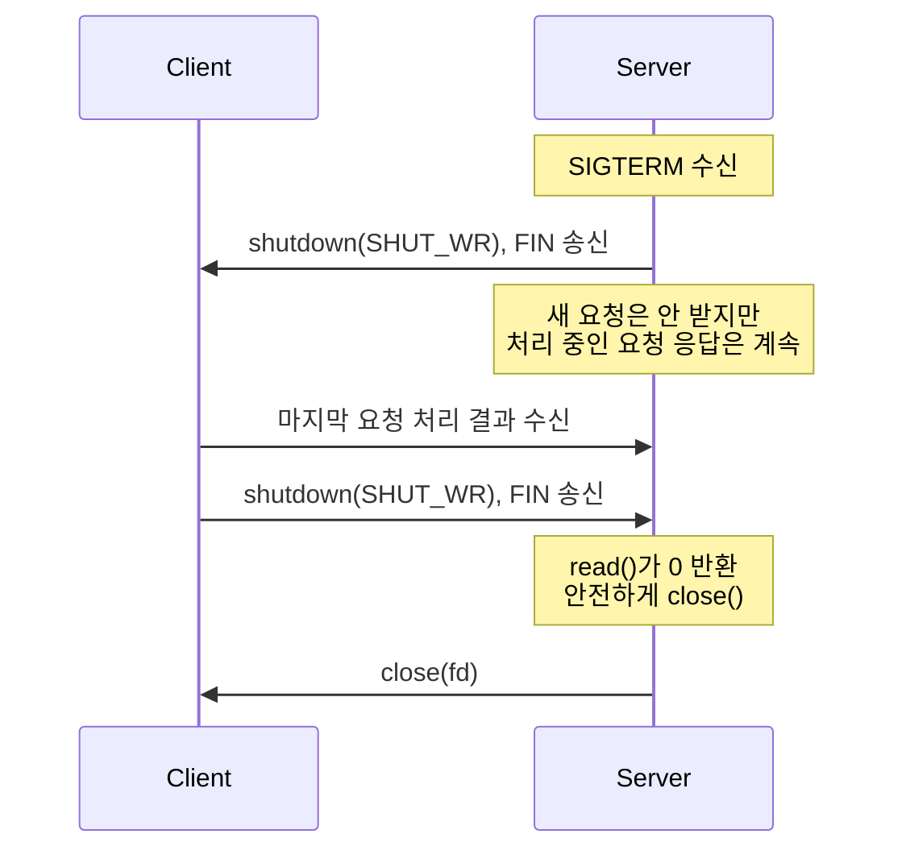

# TCP 소켓 프로그래밍 실무 패턴

TCP 프로토콜 자체의 동작은 핸드셰이크와 상태 머신, 혼잡 제어로 설명이 끝난다. 그런데 애플리케이션 코드를 짜다 보면 그 위에 또 다른 층이 있다. 소켓 옵션을 어떻게 잡느냐, `close()`를 어떤 식으로 부르느냐, 부분 전송을 어떻게 처리하느냐. 커넥션 풀 라이브러리, 게임 서버, 메시지 브로커 클라이언트 같은 걸 만들다 보면 이 영역에서 시간을 가장 많이 잡아먹는다.

이 문서는 TCP 프로토콜 동작을 이미 안다는 전제로, 그 위에서 소켓을 어떻게 다루는지 정리한다. 크게 다섯 갈래로 묶을 수 있다. 포트 재사용·종료(`SO_REUSEADDR`, `SO_LINGER`, half-close)는 서버 라이프사이클을 다룬다. 지연·묶음 전송(`TCP_NODELAY`, `TCP_CORK`, `accept4`, 백로그)은 응답 시간과 수용량을 좌우한다. I/O 모델(epoll·kqueue, 부분 전송, 메시지 프레이밍)은 동접 처리에 필수다. 연결 감지·풀 관리(half-open, keepalive, 풀 구성)는 운영 중 좀비 연결을 막는다. 마지막으로 운영 도구(zero-copy, SIGPIPE, thundering herd, `ss`)는 실패가 났을 때 진짜 원인을 찾는다. 각 섹션은 독립적으로 읽을 수 있게 썼지만, 풀 구현 같은 이야기는 keepalive와 SIGPIPE를 같이 봐야 의미가 산다.

## SO_REUSEADDR과 SO_REUSEPORT

배포 직후 서비스를 재시작했는데 `EADDRINUSE` 에러가 뜬다. 분명 프로세스는 죽었는데 포트가 안 풀린다. 이게 TIME_WAIT 상태 때문이라는 건 알 텐데, 그래서 다들 `SO_REUSEADDR`을 켠다.

### 두 옵션의 동작 차이

`SO_REUSEADDR`이 하는 일은 단순하다. TIME_WAIT 상태에 있는 소켓이 점유 중인 포트를 새 소켓이 bind할 수 있게 해준다. Linux 기준으로는 와일드카드 주소(`0.0.0.0`)와 특정 주소 사이의 bind 충돌도 일부 허용한다.

문제는 `SO_REUSEADDR`이 같은 포트에 두 프로세스가 동시에 listen하는 걸 허용하지는 않는다는 점이다. 그래서 Nginx worker나 Node cluster처럼 여러 워커가 같은 포트로 들어오는 연결을 나눠 받고 싶을 때는 부족하다. 마스터 프로세스 하나가 listen하고 accept된 fd를 워커한테 넘기는 식으로 우회해야 했다.

`SO_REUSEPORT`는 Linux 3.9부터 들어온 옵션인데, 같은 주소·포트에 여러 소켓이 동시에 listen할 수 있게 해준다. 커널이 들어오는 SYN을 5-tuple 해시로 워커에 분산시킨다. 이게 들어오면서 사용자 공간에서 fd를 넘기던 코드가 거의 사라졌다.

```javascript
const net = require('net');

// SO_REUSEADDR: TIME_WAIT 회피용
const server1 = net.createServer();
server1.listen({ port: 8080, exclusive: false }); // Node 기본값

// Node cluster에서 SO_REUSEPORT 흉내내기
// Node는 기본적으로 마스터가 listen하고 워커에 round-robin으로 분배한다
// 진짜 SO_REUSEPORT를 쓰려면 cluster의 schedulingPolicy를 None으로 두고
// 각 워커에서 reusePort: true (Node 23+) 또는 net.createServer에 직접 옵션을 줘야 한다
const cluster = require('cluster');
if (cluster.isPrimary) {
  for (let i = 0; i < 4; i++) cluster.fork();
} else {
  // Node 23 이상에서 reusePort: true 지원
  net.createServer().listen({ port: 8080, reusePort: true });
}
```

C 시스템 콜 레벨로 내려가면 옵션 차이가 더 명확해진다.

```c
int fd = socket(AF_INET, SOCK_STREAM, 0);

int opt = 1;
// 두 옵션은 독립이다. 둘 다 켜는 게 일반적
setsockopt(fd, SOL_SOCKET, SO_REUSEADDR, &opt, sizeof(opt));
setsockopt(fd, SOL_SOCKET, SO_REUSEPORT, &opt, sizeof(opt));

struct sockaddr_in addr = { .sin_family = AF_INET,
                            .sin_port = htons(8080),
                            .sin_addr.s_addr = INADDR_ANY };
bind(fd, (struct sockaddr*)&addr, sizeof(addr));
listen(fd, 1024);
```

### 부하 분배 편향 문제

`SO_REUSEPORT`를 켜고 N개 프로세스가 같은 포트에 listen하면 커널이 부하를 알아서 나눠준다. 다만 분배는 5-tuple 해시 기반이라 클라이언트 IP가 편향되면 워커 간 부하 불균형이 생긴다. 한 IP가 트래픽의 절반을 차지하는 환경이라면 워커 하나만 죽도록 일한다.

게임 서버에서 이걸 직접 본 적이 있다. 같은 회사 사옥에서 출퇴근 시간에 수십 명이 같은 NAT를 거쳐 들어오는데, 그 사람들의 5-tuple 중 source IP가 전부 동일해서 source port 해시 차이만 남는다. 운 나쁘게 해시가 몰리면 워커 4개 중 1개가 평소의 3배 트래픽을 받는다. `top`을 띄워두고 워커별 CPU를 보면 한 워커만 90%를 찍는다. 이런 환경에서는 사용자 공간에서 직접 분배하거나, 뒤에서 다룰 `SO_REUSEPORT_LB`/BPF 기반 분배가 필요하다.

### 보안 측면 주의사항

또 하나 빠지기 쉬운 함정이 보안 측면이다. `SO_REUSEPORT`를 켠 포트에 같은 UID 프로세스라면 누구나 bind해서 들어오는 트래픽을 가로챌 수 있다. 내가 만든 서비스가 8080에서 listen 중인데 같은 사용자로 돌아가는 다른 프로세스가 `SO_REUSEPORT`로 같은 포트에 bind하면 커널은 막지 않는다. 일부 요청이 그쪽으로 빨려 들어간다.

컨테이너 환경에서는 보통 컨테이너당 UID가 분리되니 큰 문제는 없다. 한 호스트에서 여러 사용자가 섞여 돌아가는 베어메탈이라면 8080 같은 흔한 포트에 `SO_REUSEPORT`를 켜는 게 위험할 수 있다. Linux 4.5부터는 `SO_REUSEPORT_LB`(FreeBSD 기원)나 BPF 기반 분배로 같은 UID라도 정해진 규칙으로만 받게 막는 방법이 있다. 일반적인 쿠버네티스 배포에서는 그냥 같은 사용자로만 돌리는 걸로 충분하다.

## SO_LINGER와 close()의 동작 변경

`close(fd)`를 부르면 보통 무슨 일이 일어나는가. 송신 버퍼에 남은 데이터를 모두 보내고, FIN을 날린 뒤, 함수가 바로 리턴한다. 실제 FIN 송신과 ACK 수신은 커널이 백그라운드에서 처리한다. graceful close라고 부른다.

### l_onoff/l_linger 조합 4가지 케이스

`SO_LINGER`는 이 동작을 바꾼다. `l_onoff`와 `l_linger` 두 값의 조합으로 동작이 갈린다.

```c
struct linger lin;
lin.l_onoff = 1;
lin.l_linger = 5; // 5초

setsockopt(fd, SOL_SOCKET, SO_LINGER, &lin, sizeof(lin));
```

네 가지 케이스를 정리하면 이렇다.

`l_onoff=0` (기본값). 표준 graceful close. `close()`가 즉시 리턴한다. 송신 버퍼에 남은 데이터는 커널이 백그라운드로 보낸다.

`l_onoff=1, l_linger>0`. `close()`가 블로킹된다. 송신 버퍼가 빌 때까지, 또는 타이머가 만료될 때까지. 버퍼가 비기 전에 타이머가 끝나면 RST를 보내고 끊는다. "확실히 보내고 끊거나 아니면 깨끗하게 포기" 형태다. 다만 블로킹이라는 점이 문제다. 이벤트 루프 안에서 부르면 루프 전체가 멈춘다.

`l_onoff=1, l_linger=0`. `close()` 호출 즉시 RST를 보내고 끊는다. 송신 버퍼에 남은 데이터는 그냥 버린다. TIME_WAIT 상태도 안 거친다.

`l_onoff=1, l_linger>0` + 논블로킹 fd. POSIX는 이 경우 동작을 명확히 정의하지 않는다. 구현에 따라 다르다. Linux는 `EWOULDBLOCK`을 리턴하면서 백그라운드로 처리한다. 이식성을 따져야 하면 피하는 게 낫다.

### TIME_WAIT 폭증 대응

`l_linger=0`은 두 경우에 쓴다. 첫째, 서버를 빠르게 재시작해야 하는데 TIME_WAIT가 너무 많이 쌓이는 상황. 둘째, 비정상 클라이언트를 즉시 끊어내고 싶을 때.

TIME_WAIT가 쌓이는 원인은 결국 active close를 한 쪽이 이 상태를 60초(`2*MSL`) 동안 유지하기 때문이다. 단기간에 수만 개 연결을 active close하면 동일한 5-tuple의 재사용이 막혀 새 연결을 못 만들기도 한다.

해결책은 순서대로 시도한다. 첫째, 가능하면 클라이언트 쪽이 먼저 끊게 프로토콜을 설계한다. 둘째, `net.ipv4.tcp_tw_reuse=1`로 TIME_WAIT 소켓을 새 연결에 재사용하게 한다. 셋째, ephemeral port 범위를 늘린다(`net.ipv4.ip_local_port_range`). 그래도 안 풀리면 마지막으로 `SO_LINGER l_linger=0`을 쓴다.

`l_linger=0`을 정상 트래픽에 쓰면 마지막에 보낸 데이터가 통째로 날아간다. 상대는 데이터를 다 받지도 못한 채로 연결 종료를 본다.

```javascript
// Node.js에서는 socket.resetAndDestroy()가 SO_LINGER l_linger=0 + close()와 비슷한 의미
// (Node 18.3+에서 RST로 끊는다)
const net = require('net');
const socket = net.createConnection(8080, 'localhost');

socket.on('error', (err) => {
  if (err.code === 'EPIPE') {
    socket.resetAndDestroy(); // graceful close 대신 RST
  }
});

// graceful close
socket.end(); // FIN 송신, 송신 버퍼 비울 때까지 대기
```

### 실무 사례: 인증 실패 응답 유실

게임 서버를 만들 때 한 가지 실수를 한 적이 있다. 클라이언트가 인증에 실패하면 즉시 `close()`만 부르고 끝냈는데, 인증 실패 메시지를 보내자마자 close가 이어졌더니 클라이언트가 그 메시지를 못 받는 경우가 생겼다. 송신 버퍼에는 들어가 있는데 `SO_LINGER`가 기본값(off)이라서 메시지 전송이 완료되기 전에 fd가 닫혔다고 시스템콜은 리턴했고, 그 사이 클라이언트가 RST를 받기도 했다.

원인은 두 가지가 겹쳤다. 우리 쪽 라이브러리가 close 직전에 `SO_LINGER l_linger=0`을 설정해 두는 코드가 있었고, 클라이언트가 절반쯤 받은 시점에 RST가 도착하면 받은 데이터까지 무효화돼 그냥 끊긴 연결로 보였다. 다음 패치에서는 `socket.end(errorMsg)`로 바꾸고, 그래도 안 닿으면 5초 후에 `destroy()`하는 식으로 정리했다. `l_linger=0`은 의도된 곳에서만 명시적으로 쓰고, 정상 응답 경로에는 절대 두지 않는다.

## 블로킹/논블로킹과 connect() 타임아웃

`connect()`는 블로킹 모드에서 기본적으로 OS의 SYN 재전송 타임아웃(보통 75초~127초)이 끝날 때까지 안 돌아온다. 외부 API를 호출하는 코드가 갑자기 멈췄다는 제보를 받고 들여다보면 connect에서 60초씩 잡혀 있는 경우가 흔하다.

논블로킹 모드에서 connect()는 즉시 `EINPROGRESS`로 리턴한다. 그러고 나서 epoll/kqueue/select로 fd를 writable 상태가 될 때까지 기다린다. writable이 됐다는 건 연결이 완료됐다는 뜻이거나(성공) 에러가 났다는 뜻이다(실패). 어느 쪽인지는 `getsockopt(fd, SOL_SOCKET, SO_ERROR, ...)`로 확인한다.

```c
int fd = socket(AF_INET, SOCK_STREAM, 0);
int flags = fcntl(fd, F_GETFL, 0);
fcntl(fd, F_SETFL, flags | O_NONBLOCK);

int rc = connect(fd, (struct sockaddr*)&addr, sizeof(addr));
if (rc < 0 && errno != EINPROGRESS) {
    // 진짜 에러
    return -1;
}

struct pollfd pfd = { .fd = fd, .events = POLLOUT };
int n = poll(&pfd, 1, 3000); // 3초 타임아웃
if (n == 0) {
    // 타임아웃 — connect 중단
    close(fd);
    return -1;
}

int err;
socklen_t len = sizeof(err);
getsockopt(fd, SOL_SOCKET, SO_ERROR, &err, &len);
if (err != 0) {
    // ECONNREFUSED, ETIMEDOUT, EHOSTUNREACH 같은 거
    close(fd);
    return -1;
}
// 연결 성공
```

`poll()`을 안 거치고 그냥 writable 이벤트를 받아도 `SO_ERROR`를 반드시 확인해야 한다. ECONNREFUSED인데 writable이 되는 경우가 있기 때문이다.

Node.js에서는 이 처리가 net 모듈 안에 들어 있고, `setTimeout`을 걸어두는 식으로 노출된다.

```javascript
const socket = new net.Socket();
socket.setTimeout(3000);
socket.on('timeout', () => {
  socket.destroy(new Error('connect timeout'));
});
socket.connect(8080, 'remote.example.com');
```

setTimeout은 connect 단계만이 아니라 연결 이후의 idle 타임아웃도 같이 잡는다는 점이 자주 헷갈리는 부분이다. connect 직후 정상 트래픽이 흐르기 시작하면 `setTimeout(0)`으로 다시 끄거나, 아니면 connect 전용 타이머를 따로 둬야 한다.

## TCP_NODELAY와 Nagle/Delayed ACK 상호작용

RPC 응답이 99퍼센타일에서 200ms 즈음 튄다는 제보를 받고 추적해 본 적이 있다. 평균은 5ms도 안 되는데 어떤 호출만 정확히 200ms 가까이 걸린다. 네트워크 자체에는 문제가 없다. 범인은 Nagle 알고리즘과 Delayed ACK의 상호작용이다.

### Nagle 알고리즘의 동작

Nagle은 작은 패킷을 모아서 한 번에 보낸다. 정확하게는 "이전 송신 데이터에 대한 ACK를 못 받았고, MSS보다 작은 데이터를 보내려는 경우 송신을 미룬다". MSS 크기로 묶일 때까지, 또는 ACK를 받을 때까지.

원래 목적은 telnet 같은 인터랙티브 프로토콜에서 1바이트씩 보내는 송신을 줄이는 거였다. 1바이트 페이로드 + 40바이트 헤더로 보내는 게 누적되면 헤더가 트래픽의 대부분이 된다. Nagle은 이걸 막는다.

### Delayed ACK의 동작

상대 쪽 커널은 데이터를 받자마자 ACK를 보내지 않는다. Delayed ACK는 200ms(Linux 기본 40ms) 또는 다음 송신 데이터에 ACK를 piggyback할 수 있을 때까지 기다린다. 두 가지 시나리오 중 하나가 ACK를 즉시 트리거한다. 두 번째 데이터 세그먼트가 도착했거나, 응용이 곧바로 응답을 만들어 piggyback할 데이터가 생겼거나.

### Nagle + Delayed ACK가 만드는 200ms 함정

문제는 두 알고리즘이 만나면 둘 다 상대를 기다린다는 점이다.

```
Client                          Server
--write(req_part1)-->
                                <waiting for piggyback or 2nd seg>
--write(req_part2)              (Nagle 대기 중: ACK 안 옴)
   ↑ Nagle이 막아둠
   
   (200ms 경과)
                                Delayed ACK 타이머 만료
                                <--ACK------------------------
   ACK 받음, Nagle 풀림
--write(req_part2)-->
                                요청 완성, 응답 처리
                                <--write(resp)----------------
```

RPC 라이브러리가 헤더와 바디를 두 번에 나눠 `write()`하면 정확히 이 시나리오가 나온다. 헤더는 즉시 나가지만 바디는 Nagle에 잡힌다. 상대는 헤더만 받고 "두 번째 세그먼트가 오나 보자"며 ACK를 미루고, 헤더만으로는 요청이 완성되지 않으니 응답할 데이터도 없다. 결국 둘 다 타이머가 만료될 때까지 200ms를 잡아먹는다.

### TCP_NODELAY를 켤 때와 끌 때

`TCP_NODELAY`는 Nagle을 끈다. RPC, HTTP, gRPC 같은 요청-응답 프로토콜은 거의 다 켠다.

```c
int yes = 1;
setsockopt(fd, IPPROTO_TCP, TCP_NODELAY, &yes, sizeof(yes));
```

```javascript
socket.setNoDelay(true); // Node 기본은 true
```

Node는 `net.Socket`에서 기본적으로 `TCP_NODELAY`를 켠다. 직접 C로 짜는 RPC 서버는 꼭 켜야 한다. 안 켜면 위 시나리오가 그대로 재현된다.

반대로 켜면 안 되는 경우도 있다. 작은 패킷을 자주 보내는 모니터링 에이전트나 텔레메트리 같은 곳. Nagle을 끄면 40바이트 헤더 + 4바이트 페이로드 같은 패킷이 그대로 나간다. 대역폭이 모자란 환경에서는 부담이 된다.

근본 해법은 애플리케이션이 한 메시지를 한 번의 `write()`로 보내는 거다. `writev()`로 헤더와 바디를 한 syscall에 묶으면 된다. 또는 사용자 공간에서 버퍼링하다가 메시지 단위로 flush. 그러면 `TCP_NODELAY`를 켜든 안 켜든 문제가 안 생긴다. 다만 라이브러리 안쪽까지 손볼 수 없는 경우가 많아서 `TCP_NODELAY`가 현실적인 방어선이다.

## TCP_CORK와 메시지 묶음 전송

`TCP_NODELAY`가 "지금 가진 데이터를 즉시 보내라"라면 `TCP_CORK`는 그 반대다. "내가 풀 때까지 송신을 막아 둬라".

### TCP_CORK 동작

`TCP_CORK`(Linux)나 `TCP_NOPUSH`(BSD/macOS)를 켜면 송신이 보류된다. MSS 크기까지 채우거나, cork를 풀거나, 200ms 타이머가 만료될 때까지 패킷이 안 나간다.

```c
int yes = 1;
setsockopt(fd, IPPROTO_TCP, TCP_CORK, &yes, sizeof(yes));

write(fd, http_header, header_len);
sendfile(fd, file_fd, NULL, file_size);
write(fd, http_trailer, trailer_len);

int no = 0;
setsockopt(fd, IPPROTO_TCP, TCP_CORK, &no, sizeof(no)); // 풀면 한꺼번에 전송
```

### TCP_NODELAY와의 차이

이름은 비슷한데 목적이 반대다. `TCP_NODELAY`는 Nagle을 꺼서 부분 메시지가 200ms 동안 잡혀 있지 않게 만든다. `TCP_CORK`는 작은 write를 여러 번 해도 한 세그먼트로 묶일 때까지 송신을 막는다.

둘이 동시에 켜져 있으면 어떻게 되나. Linux 2.6 이후로는 `TCP_CORK`가 우선이다. cork가 걸려 있는 동안은 `TCP_NODELAY`가 무시되고, cork를 풀면 그제야 보낸다.

### sendfile/HTTP 응답 합치기 패턴

`TCP_CORK`의 전형적인 쓰임새는 HTTP 응답이다. 헤더, 파일 본문, 트레일러 세 부분이 한 세그먼트로 묶이면 패킷 수가 줄어든다.

Nginx가 `tcp_nopush on`을 켜면 내부적으로 `TCP_CORK`/`TCP_NOPUSH`를 사용한다. 정적 파일을 sendfile()로 보낼 때 헤더와 파일 데이터가 한 세그먼트에 들어가서 작은 파일은 패킷 한 개로 끝난다.

`writev()`로도 비슷한 효과를 낼 수 있지만, sendfile은 사용자 공간에 헤더가, 커널에 파일이 있어서 한 syscall로 묶기가 어렵다. cork가 그 사이를 메운다.

주의할 점은 cork를 안 풀면 200ms까지 잡혀 있다는 것. 응답을 다 쓴 직후에 반드시 cork를 풀어야 한다. 처리 흐름에서 잊어버리면 또 200ms 함정을 만난다.

## accept4()와 SOCK_NONBLOCK·SOCK_CLOEXEC

accept된 fd를 논블로킹으로 만들어야 epoll에 등록해 쓸 수 있다. 자식 프로세스로 fork할 때 fd가 유출되지 않게 close-on-exec도 켜야 한다. 보통은 이런 순서로 짠다.

```c
int cfd = accept(lfd, NULL, NULL);
int flags = fcntl(cfd, F_GETFL, 0);
fcntl(cfd, F_SETFL, flags | O_NONBLOCK);
fcntl(cfd, F_SETFD, FD_CLOEXEC);
```

### accept() 후 fcntl 호출의 race

문제는 accept 리턴과 fcntl 호출 사이에 틈이 있다는 것. 멀티스레드 환경에서 다른 스레드가 그 사이 fork+exec을 하면 새 자식이 이 fd를 상속받는다. CGI나 외부 명령 실행을 자주 하는 서버에서 가끔 좀비 fd가 자식 프로세스에 흘러 들어가는 원인이 된다.

논블로킹 설정도 마찬가지다. accept 직후 다른 코드가 그 fd로 블로킹 read를 시도하면 그대로 멈춘다.

### accept4()의 원자성

Linux 2.6.28부터 `accept4()`가 있다. accept + fcntl을 원자적으로 처리한다.

```c
#define _GNU_SOURCE
#include <sys/socket.h>

int cfd = accept4(lfd, NULL, NULL, SOCK_NONBLOCK | SOCK_CLOEXEC);
```

syscall이 하나로 줄어 성능 면에서도 약간 이득이다. accept를 초당 수만 번 부르는 서버에서는 fcntl 두 번이 무시 못 할 만큼 쌓인다. 무엇보다 race가 사라진다. 새로 짜는 코드라면 무조건 `accept4()`를 쓰는 게 낫다.

### 플랫폼별 차이 (macOS는 없음)

macOS와 FreeBSD에는 `accept4()`가 없다. 대신 listening 소켓에 `SOCK_NONBLOCK`/`SOCK_CLOEXEC` 속성을 미리 걸어두고 accept하면 fd가 상속받는 구현이 있다. 다만 정확한 동작은 OS마다 다르다. 이식성을 따져야 한다면 다음 패턴이 안전하다.

```c
#if defined(__linux__)
    int cfd = accept4(lfd, NULL, NULL, SOCK_NONBLOCK | SOCK_CLOEXEC);
#else
    int cfd = accept(lfd, NULL, NULL);
    if (cfd >= 0) {
        // race 가능성 인정. 멀티스레드 fork를 하는 서버라면 추가 보호 필요
        fcntl(cfd, F_SETFL, fcntl(cfd, F_GETFL, 0) | O_NONBLOCK);
        fcntl(cfd, F_SETFD, FD_CLOEXEC);
    }
#endif
```

Node.js 같은 런타임은 이걸 내부에서 알아서 처리한다. libuv가 Linux에서는 `accept4()`를 우선 시도하고 실패하면 fallback한다.

## listen 백로그와 SYN cookies

`listen(fd, backlog)`의 두 번째 인자가 뭐냐는 질문에 "동시 접속 수"라고 답하면 절반은 맞고 절반은 틀리다. 실제로는 두 개의 큐가 있다.

### somaxconn과 tcp_max_syn_backlog

Linux 커널 안에는 SYN 큐와 accept 큐가 별도로 존재한다. SYN 큐는 SYN을 받고 SYN+ACK를 보낸 상태에서 마지막 ACK를 기다리는 연결을 담는다. accept 큐는 핸드셰이크가 완전히 끝난(ESTABLISHED) 연결 중 아직 `accept()`로 사용자 공간에 전달되지 않은 것들을 담는다.


크기를 결정하는 변수가 따로 있다.

- `listen()`의 `backlog` 인자: accept 큐의 최대 크기
- `net.core.somaxconn`: accept 큐의 시스템 전역 최대치(Linux 5.4+ 기본 4096, 이전 128)
- `net.ipv4.tcp_max_syn_backlog`: SYN 큐의 시스템 전역 최대치

`listen()`에 1024를 넘겨도 `somaxconn`이 128이면 128로 clamp된다. 부하 테스트에서 backlog만 키우고 sysctl을 안 만진 채 정상 동작을 기대하면 안 된다.

### accept queue vs SYN queue

accept 큐가 가득 차면 어떻게 되나. 기본적으로 새 핸드셰이크 완료 연결이 drop된다. 클라이언트는 ACK를 보냈는데 서버 쪽에서 묵묵부답이라 SYN+ACK 재전송이 일어난다. 클라이언트 입장에선 3~9초씩 connect가 늘어진다. 99퍼센타일 지연이 갑자기 튀는 원인 중 하나다.

`net.ipv4.tcp_abort_on_overflow=1`로 설정하면 drop 대신 RST를 보낸다. 클라이언트가 즉시 실패를 보는 게 낫다고 판단할 때 쓴다.

SYN 큐가 차면 새 SYN이 drop된다. 정상 트래픽에서 SYN 큐가 차는 경우는 드물지만 SYN flood 공격에서 빈번하다.

서버가 accept를 못 따라가서 큐가 차는 게 보이면 어떻게 진단하나. `ss -ltn`의 `Recv-Q`(현재 큐 크기)와 `Send-Q`(최대치)를 본다. `nstat -az | grep -i listendrop`으로 listen 큐 overflow 카운터를 확인한다.

```bash
nstat -az | grep -i listen
TcpExtListenOverflows         1432   # accept queue overflow
TcpExtListenDrops             1432   # SYN queue drop 포함
```

`ListenOverflows`가 0이 아니면 accept queue가 차고 있다는 뜻. 해결책은 두 갈래다. accept를 더 빨리 돌리거나(워커 추가, 이벤트 루프 블로킹 줄이기), backlog와 `somaxconn`을 키우거나.

### SYN flood와 SYN cookies

SYN flood는 가짜 source IP에서 SYN만 잔뜩 보낸다. 서버는 SYN+ACK를 보내고 SYN 큐에 항목을 만들지만, 마지막 ACK는 영원히 오지 않는다. SYN 큐가 가득 차면 정상 클라이언트의 SYN도 drop된다.

SYN cookies는 이 공격을 막는 우회책이다. SYN 큐에 항목을 만들지 않고, SYN+ACK의 시퀀스 번호 자체에 검증 정보를 인코딩한다. 마지막 ACK가 오면 그 ACK 번호로 다시 검증해 정상이면 ESTABLISHED 상태로 만든다.

```bash
# 현재 설정 확인
cat /proc/sys/net/ipv4/tcp_syncookies
# 0 = 끔, 1 = SYN 큐 가득 찰 때만, 2 = 항상 사용

sysctl -w net.ipv4.tcp_syncookies=1
```

기본값은 1이라 평소엔 일반 핸드셰이크를 쓰고, SYN 큐 overflow가 임박할 때만 cookie 방식으로 전환한다. 일반 서비스 환경에서 굳이 끌 이유가 없다. 다만 SYN cookies는 TCP 옵션 일부(SACK, window scale, timestamps)를 SYN에 담을 공간이 부족해 일부 손실이 있다. 정상 트래픽 100%가 cookie로 처리되면 성능 손실이 좀 있다는 보고도 있어서 항상(`=2`) 모드는 부하 테스트 환경 정도에서만 쓴다.

## half-close와 graceful shutdown

`close()`는 양방향을 한꺼번에 닫는다. `shutdown()`은 한쪽 방향만 닫을 수 있다.

- `shutdown(fd, SHUT_WR)`: 송신만 닫는다. FIN을 보낸다. 수신은 계속 열려 있다.
- `shutdown(fd, SHUT_RD)`: 수신만 닫는다.
- `shutdown(fd, SHUT_RDWR)`: 양방향. close()와 차이는 fd가 해제되지 않는다는 점.

half-close 패턴은 서버가 graceful shutdown을 할 때 자주 쓴다. 흐름은 이렇다.



서버 입장에서 SIGTERM을 받으면 송신을 닫아 클라이언트한테 "더 보낼 거 없어"를 알린다. 그래도 클라이언트가 보내는 건 계속 받는다. 클라이언트가 자기 일을 마치고 FIN을 보내면 그제야 완전히 닫는다.

HTTP/1.1 Keep-Alive 연결이 풀에 잡혀 있는데 서버가 종료될 때 이 패턴이 필요하다. 그냥 close()해버리면 클라이언트가 풀에서 꺼낸 연결로 요청을 보내다가 RST를 맞는다.

```javascript
const server = net.createServer((socket) => {
  socket.on('data', handleRequest);
});
server.listen(8080);

process.on('SIGTERM', () => {
  // Node의 server.close()는 새 연결만 막을 뿐
  // 기존 연결을 어떻게 닫을지는 직접 결정해야 한다
  server.close(() => process.exit(0));

  // 각 연결에 half-close 신호
  for (const socket of activeSockets) {
    socket.end(); // FIN 송신, 수신은 열어둠
  }

  setTimeout(() => process.exit(1), 30000); // 30초 후 강제 종료
});
```

C에서는 직접 부른다.

```c
// 새 accept 중단
close(listen_fd);

// 모든 클라이언트 연결에 FIN 송신
for (int i = 0; i < num_clients; i++) {
    shutdown(clients[i].fd, SHUT_WR);
}

// recv()가 0을 리턴할 때까지 응답 처리 계속
// 클라이언트가 FIN을 보내면 close()
```

## half-open 연결 감지

half-close는 우리가 의도해서 한쪽 방향만 닫은 상태다. 반면 half-open은 상대가 비정상 종료해서 우리만 모르는 상태다. 둘은 완전히 다른 문제다.

half-open이 생기는 시나리오:

- 상대 서버가 패닉으로 죽었는데 FIN을 못 보냄
- 네트워크 케이블이 빠짐
- 클라이언트 모바일 디바이스가 셀룰러에서 WiFi로 옮겨가면서 NAT가 바뀜
- 중간 방화벽이 idle 연결을 silently 끊음

우리 쪽 소켓은 ESTABLISHED 상태 그대로다. 우리가 데이터를 안 보내면 영원히 살아 있는 것처럼 보인다. 커넥션 풀에 이런 좀비 연결이 쌓이면 풀에서 꺼내서 쓰는 순간 에러가 난다.

감지 방법은 세 가지 트레이드오프가 있다.

### TCP Keepalive

커널이 알아서 보낸다. Linux 기본값은 7200초(2시간) 무동작 후 75초 간격으로 9번 프로브를 보내고 응답이 없으면 끊는다. 기본값으로는 너무 느리다. 소켓별로 줄여야 쓸 만하다.

```c
int keepalive = 1;
int idle = 30;       // 30초 idle 후 첫 프로브
int interval = 10;   // 10초 간격
int count = 3;       // 3번 실패하면 끊음

setsockopt(fd, SOL_SOCKET, SO_KEEPALIVE, &keepalive, sizeof(int));
setsockopt(fd, IPPROTO_TCP, TCP_KEEPIDLE, &idle, sizeof(int));
setsockopt(fd, IPPROTO_TCP, TCP_KEEPINTVL, &interval, sizeof(int));
setsockopt(fd, IPPROTO_TCP, TCP_KEEPCNT, &count, sizeof(int));
```

```javascript
socket.setKeepAlive(true, 30000); // 30초 idle 후 프로브 시작
```

장점은 코드가 단순하다는 점. 단점은 프로브 시그널이 애플리케이션 계층으로 안 올라온다는 것. 우리 코드 입장에선 "연결이 살아 있다"만 알 뿐, 상대 애플리케이션이 응답할 수 있는 상태인지는 모른다. 상대 OS는 멀쩡한데 애플리케이션이 무한 루프에 빠졌다면 keepalive는 통과한다.

### 애플리케이션 heartbeat

WebSocket의 ping/pong, gRPC의 keepalive, MQTT의 PINGREQ가 다 이 카테고리다. 애플리케이션이 직접 일정 주기로 메시지를 보내고 응답을 확인한다.

장점은 애플리케이션이 정말로 응답할 수 있는지 검증한다는 점. 단점은 프로토콜이 그걸 지원해야 한다는 점. 그리고 응답 안 오면 어떻게 할지(재시도, 재연결, 풀에서 제거 등)를 직접 코드로 짜야 한다.

메시지 브로커 클라이언트를 만들면서 heartbeat 주기를 잘못 잡아 고생한 적이 있다. 브로커가 60초마다 heartbeat를 기대하는데, 클라이언트가 트래픽 많은 시간대에 GC pause로 70초를 멈췄다. 그 사이 브로커가 연결을 끊었는데, 우리는 다음 publish가 실패할 때까지 모르고 메시지 큐에 계속 쌓고 있었다. 결국 GC pause를 고려해 heartbeat 주기를 브로커 측 타임아웃의 1/3로 줄였다.

### Lazy reconnect (poison check)

풀에서 연결을 꺼낼 때 한 번 체크한다. 가장 간단한 형태는 0바이트 send를 시도하거나, `recv()`에 `MSG_PEEK | MSG_DONTWAIT`로 살짝 들여다본다.

```c
char buf[1];
int n = recv(fd, buf, 1, MSG_PEEK | MSG_DONTWAIT);
if (n == 0) {
    // 상대가 정상 종료 (FIN)
} else if (n < 0 && errno == EAGAIN) {
    // 정상 — 읽을 게 없을 뿐
} else if (n < 0) {
    // 진짜 에러
}
```

장점은 키프얼라이브나 heartbeat 없이도 쓸 수 있다는 것. 단점은 race condition이 있다는 것. 체크 시점엔 살아 있었는데 그 직후 끊어질 수 있다. 결국 진짜 보낼 때 EPIPE를 받을 가능성을 없앨 수는 없다.

세 방식 중 뭘 쓸지는 풀 사용 패턴에 따라 다르다. 풀에서 꺼내는 빈도가 매우 높고 idle 시간이 짧으면 keepalive로 충분하다. idle 시간이 길고 연결당 비용이 크면(SSL 핸드셰이크 같은 거) heartbeat+lazy 조합으로 적극 관리한다.

## epoll과 kqueue, level-triggered vs edge-triggered

소켓 하나당 스레드 하나로는 동접 처리가 안 된다. 그래서 I/O 멀티플렉싱이 필요하다. Linux는 epoll, BSD/macOS는 kqueue.

기본 모델은 같다. fd 여러 개를 등록해두고, 그중 읽기/쓰기 가능한 게 생기면 한 번에 통보받는다. 차이는 통보 방식이다.

### LT 동작 모델

Level-Triggered는 epoll 기본값이다. fd가 readable 상태에 있는 한 `epoll_wait`이 계속 그걸 알려준다. select()와 비슷한 동작이라 직관적이다. recv()로 일부만 읽고 다음 루프로 넘어가도 다음 `epoll_wait`에서 다시 알려준다.

```c
// LT 모드 — 기본값
struct epoll_event ev = { .events = EPOLLIN, .data.fd = fd };
epoll_ctl(epfd, EPOLL_CTL_ADD, fd, &ev);

while (1) {
    int n = epoll_wait(epfd, events, MAX_EVENTS, -1);
    for (int i = 0; i < n; i++) {
        char buf[4096];
        // 일부만 읽어도 됨. 다음 루프에서 또 알려줌
        int r = recv(events[i].data.fd, buf, sizeof(buf), 0);
        process(buf, r);
    }
}
```

LT의 장점은 코드가 단순하고 EAGAIN 누락 같은 버그가 없다는 것. 단점은 같은 fd가 계속 readable이면 매 `epoll_wait` 호출마다 통보가 반복돼서 syscall 오버헤드가 쌓인다.

### ET 동작 모델과 EAGAIN 루프

Edge-Triggered는 fd 상태가 변할 때만 통보한다. readable이 안 되어 있다가 됐을 때 한 번. 그 다음엔 안 알려준다. 한 번 통보받으면 recv()가 `EAGAIN`을 리턴할 때까지 전부 다 읽어야 한다. 안 그러면 버퍼에 남은 데이터를 영원히 못 본다.

```c
ev.events = EPOLLIN | EPOLLET;
epoll_ctl(epfd, EPOLL_CTL_ADD, fd, &ev);

while (1) {
    int n = epoll_wait(epfd, events, MAX_EVENTS, -1);
    for (int i = 0; i < n; i++) {
        // EAGAIN 받을 때까지 다 읽어야 함
        while (1) {
            char buf[4096];
            int r = recv(events[i].data.fd, buf, sizeof(buf), 0);
            if (r < 0 && errno == EAGAIN) break;
            if (r <= 0) { handle_error_or_close(); break; }
            process(buf, r);
        }
    }
}
```

ET가 LT보다 빠른 이유는 `epoll_wait` 호출 횟수가 줄어들기 때문이다. 같은 fd가 readable인 상태로 계속 있어도 LT는 매 루프마다 그걸 알려주는 오버헤드가 있다. ET는 한 번만이다.

대신 ET는 버그가 나기 쉽다. EAGAIN 처리를 빠뜨리면 데이터가 남은 채로 다음 통보를 기다리게 된다. 클라이언트는 응답을 보냈는데 서버가 안 받는 미스터리가 발생한다. 또한 ET는 fairness 문제가 있다. 한 fd에서 데이터가 끝없이 들어오면 EAGAIN까지 다 읽다가 다른 fd 처리가 늦어진다. 보통 한 번에 읽는 양에 상한을 두고, 다 못 읽었으면 다시 큐에 넣는 식으로 처리한다.

nginx 같은 고성능 서버는 ET를 쓰지만, 일반적인 애플리케이션은 LT로 충분하다.

### oneshot과 round-robin 분배

워커 스레드가 여러 개고 같은 epoll fd를 공유하면 EPOLLONESHOT이 필요하다. 한 번 통보된 fd는 자동으로 비활성화돼서 같은 fd가 두 스레드에 동시에 분배되는 걸 막는다. 처리를 마치면 `epoll_ctl(MOD)`로 다시 활성화해야 한다.

```c
ev.events = EPOLLIN | EPOLLET | EPOLLONESHOT;
epoll_ctl(epfd, EPOLL_CTL_ADD, fd, &ev);

// 워커가 처리 후 다시 살림
epoll_ctl(epfd, EPOLL_CTL_MOD, fd, &ev);
```

이 패턴은 워커 풀에 fd를 round-robin으로 분배할 때 흔히 쓴다. 워커마다 자기 epoll fd를 두고, 새 연결을 받는 listener가 round-robin으로 워커별 epoll에 넣는 방식도 있다. 후자는 워커 간 동기화가 필요 없어서 더 단순하다.

`EPOLLEXCLUSIVE`(Linux 4.5+)는 다른 해법이다. 여러 워커가 같은 epoll fd를 공유하면서 새 fd가 ready 상태가 되면 워커 한 명만 깨운다. 이게 뒤에 나올 thundering herd 회피와 직결된다.

### kqueue EVFILT 차이점

kqueue는 epoll보다 모델이 풍부하다. `EVFILT_READ`, `EVFILT_WRITE`, `EVFILT_VNODE`, `EVFILT_PROC`, `EVFILT_SIGNAL`, `EVFILT_TIMER` 같은 필터를 한 인터페이스에서 다룬다. 파일 변경 감시, 프로세스 종료, 시그널 수신을 epoll처럼 fd로 다 처리할 수 있다. epoll은 signalfd, timerfd, inotify로 따로 떼야 하는 걸 한 군데서 처리한다.

```c
// kqueue 등록
int kq = kqueue();
struct kevent ev;
EV_SET(&ev, fd, EVFILT_READ, EV_ADD | EV_CLEAR, 0, 0, NULL); // EV_CLEAR가 ET
kevent(kq, &ev, 1, NULL, 0, NULL);

// 이벤트 대기
struct kevent events[64];
int n = kevent(kq, NULL, 0, events, 64, NULL);
```

`EV_CLEAR`가 ET, 기본값이 LT다. `EV_ONESHOT`도 EPOLLONESHOT과 거의 같은 의미.

kqueue의 묘한 점 하나는 `EVFILT_READ`의 `data` 필드가 읽을 수 있는 바이트 수를 알려준다는 것. listen 소켓에선 accept 대기 큐에 쌓인 수, 일반 소켓에선 수신 버퍼의 바이트 수다. 정확한 수치는 아니지만 큰 흐름을 보기엔 충분하다. epoll에는 없는 정보다.

Node.js의 libuv는 내부적으로 epoll(Linux), kqueue(BSD/macOS), IOCP(Windows)를 추상화해서 쓴다. JavaScript 레벨에서는 이걸 직접 만질 일이 없지만, C++ 애드온을 만들거나 성능 튜닝을 할 때 동작 모델은 알아둬야 한다.

## 부분 전송과 EAGAIN 처리

`send()`가 100바이트를 보내달라는 요청을 받았을 때, 실제로는 60바이트만 보내고 60을 리턴할 수 있다. 송신 버퍼에 남은 공간이 60바이트뿐이면 그런 일이 생긴다. 논블로킹 모드에서 이건 일상이다.

```c
ssize_t send_all(int fd, const char *buf, size_t len) {
    size_t sent = 0;
    while (sent < len) {
        ssize_t n = send(fd, buf + sent, len - sent, 0);
        if (n < 0) {
            if (errno == EINTR) continue;
            if (errno == EAGAIN || errno == EWOULDBLOCK) {
                // 송신 버퍼 가득. epoll에 EPOLLOUT 등록하고
                // writable 이벤트를 기다려야 함
                return sent; // 일부 전송 상태로 리턴
            }
            return -1; // 진짜 에러
        }
        sent += n;
    }
    return sent;
}
```

EAGAIN을 받으면 송신 버퍼가 가득 차서 더 못 받는다는 뜻이다. 이 상태에서 무한 루프로 send를 반복하면 CPU만 태운다. epoll에 `EPOLLOUT`을 등록해두고, writable 이벤트가 올 때 남은 데이터를 마저 보내는 식으로 짜야 한다. 보내야 할 데이터는 어딘가에 큐로 쌓아둬야 한다.

`recv()`도 마찬가지다. 4KB를 받으려고 했는데 1KB만 받을 수 있다. TCP가 스트림 프로토콜이라 메시지 경계를 보장 안 하기 때문이다. 길이 prefix를 붙이거나 delimiter를 정하지 않으면 메시지 단위로 처리할 수 없다.

```javascript
// Node.js에서 이 처리는 stream에 숨겨져 있다
socket.on('data', (chunk) => {
  buffer = Buffer.concat([buffer, chunk]);
  while (buffer.length >= 4) {
    const len = buffer.readUInt32BE(0);
    if (buffer.length < 4 + len) break; // 더 받아야 함
    const message = buffer.subarray(4, 4 + len);
    handle(message);
    buffer = buffer.subarray(4 + len);
  }
});

socket.write(data, (err) => {
  // err가 있으면 송신 실패
  // err가 없으면 커널 버퍼까지는 들어갔다는 뜻
  // 상대가 받았다는 보장은 아님
});

// 백프레셔 처리
const ok = socket.write(data);
if (!ok) {
  // 송신 버퍼가 highWaterMark 초과
  // 데이터 생산을 잠시 멈춰야 함
  source.pause();
  socket.once('drain', () => source.resume());
}
```

Node의 `socket.write()`가 false를 리턴하는 건 송신 버퍼가 임계치를 넘었다는 뜻이지 EAGAIN이 그대로 노출되는 건 아니다. libuv가 큐에 쌓아두고 epoll 이벤트로 다시 처리한다. 다만 백프레셔를 무시하고 계속 write를 호출하면 메모리가 무한히 쌓인다. 큰 파일 전송 같은 곳에서 OOM을 일으키는 흔한 원인이다.

## 메시지 프레이밍 패턴

TCP는 스트림이라 메시지 경계가 없다. 100바이트 쓰고 200바이트 쓰면 받는 쪽은 300바이트 한 덩어리로 받을 수도 있고, 50바이트씩 6번에 나눠 받을 수도 있다. 메시지 단위로 처리하려면 애플리케이션이 경계를 직접 만들어야 한다. 세 가지 패턴이 일반적이다.

### Length-prefix

각 메시지 앞에 길이를 붙인다. 4바이트 빅엔디언이 흔하다.

```
+--------+--------+-----------------+
| len=N  |  type  |   payload (N)   |
+--------+--------+-----------------+
```

장점은 명확하다. 받는 쪽이 4바이트만 읽으면 정확히 몇 바이트가 더 필요한지 안다. 부분 read를 깨끗하게 처리할 수 있고, 메시지가 어디서 끝나는지 페이로드를 보지 않고도 안다. gRPC, Kafka, Redis RESP3, MQTT 같은 대부분의 바이너리 프로토콜이 이걸 쓴다.

단점은 길이를 미리 알아야 한다는 것. 스트리밍으로 메시지를 만들면 송신 시점에 총 길이를 모른다. 보통 한 메시지를 메모리에 모은 다음 길이를 채우는데, 메시지가 크면 메모리 부담이 된다. Kafka는 이걸 풀려고 압축까지 다 끝낸 후에야 길이를 채운다.

```javascript
function parseFrames(buffer) {
  const messages = [];
  let offset = 0;
  while (offset + 4 <= buffer.length) {
    const len = buffer.readUInt32BE(offset);
    if (offset + 4 + len > buffer.length) break; // 부족
    messages.push(buffer.subarray(offset + 4, offset + 4 + len));
    offset += 4 + len;
  }
  return { messages, remaining: buffer.subarray(offset) };
}
```

### Delimiter

특정 바이트(또는 시퀀스)를 메시지 끝 표시로 쓴다. HTTP/1.1이 헤더에서 `\r\n\r\n`을, 라인 기반 프로토콜이 `\n`을 쓴다.

장점은 사람이 읽기 좋다는 것. 디버깅에 강하고 telnet으로 직접 쳐도 동작한다. Redis는 RESP가 `\r\n` delimiter라 디버깅이 쉽다.

단점은 페이로드에 delimiter가 나오면 안 된다는 것. 이걸 해결하려면 escape를 해야 하는데 그러면 페이로드를 한 바이트씩 스캔해야 해서 느려진다. HTTP가 헤더 끝나면 본문에는 `Content-Length`로 length-prefix를 쓰는 이유다. 헤더는 사람 친화적으로 delimiter, 본문은 효율적으로 length-prefix.

```javascript
function parseLines(buffer) {
  const lines = [];
  let start = 0;
  for (let i = 0; i < buffer.length; i++) {
    if (buffer[i] === 0x0a) { // \n
      lines.push(buffer.subarray(start, i));
      start = i + 1;
    }
  }
  return { lines, remaining: buffer.subarray(start) };
}
```

### Fixed-size

메시지 크기가 고정. 16바이트짜리 알람 메시지가 끝없이 들어온다거나. 받는 쪽이 16바이트씩 끊으면 끝.

장점은 가장 단순하다는 것. 헤더 파싱이 필요 없다. 임베디드 장비와 데이터를 주고받을 때 흔히 쓴다.

단점은 메시지마다 크기가 다르면 못 쓴다는 것. 그래서 보통은 fixed-size 헤더 + variable payload 조합으로 변형해서 쓴다. 결국 length-prefix와 만난다.

### 세 패턴 비교

| 패턴 | 파싱 비용 | 페이로드 자유도 | 디버깅 |
|---|---|---|---|
| Length-prefix | 낮음(O(1) per msg) | 임의 바이너리 가능 | 어려움 |
| Delimiter | 중간(스캔 필요) | delimiter escape 필요 | 쉬움 |
| Fixed-size | 가장 낮음 | 크기 고정 | 중간 |

새로 프로토콜을 만든다면 거의 length-prefix를 고른다. 사람이 읽을 일이 거의 없는 내부 통신이고, 페이로드에 임의 바이너리(이미지, 압축된 페이로드)가 들어갈 수 있기 때문. HTTP처럼 사람-기계 혼용이면 헤더는 delimiter, 본문은 length-prefix 하이브리드가 답.

## Zero-copy 전송

큰 파일을 네트워크로 보낼 때 일반적인 흐름은 이렇다. 디스크에서 read()로 사용자 공간 버퍼에 읽고, send()로 사용자 공간 버퍼에서 커널 송신 버퍼로 복사한다. 데이터가 두 번 복사된다.

### sendfile()

`sendfile(out_fd, in_fd, offset, count)`은 디스크 fd에서 소켓 fd로 직접 보낸다. 사용자 공간을 거치지 않는다. Linux 2.2부터 있다.

```c
off_t offset = 0;
ssize_t sent = sendfile(socket_fd, file_fd, &offset, file_size);
```

Nginx가 정적 파일을 서빙할 때 거의 항상 sendfile을 쓴다. `sendfile on;`이 기본값이다. 1GB짜리 파일을 보낼 때 사용자 공간 버퍼링이 사라지면 CPU 사용량이 눈에 띄게 떨어진다.

제약은 두 가지. 첫째, in_fd는 정규 파일이어야 한다(소켓 → 소켓은 안 됨). 둘째, TLS와 안 맞는다. 데이터가 사용자 공간을 안 거치니 암호화할 수가 없다. Kernel TLS(kTLS)가 이걸 해결하려는 시도다.

### splice()와 vmsplice()

`splice(in_fd, off_in, out_fd, off_out, len, flags)`은 더 일반적이다. fd 간 데이터를 파이프 버퍼를 통해 이동시킨다. 한쪽이 파이프여야 한다.

```c
int pipefd[2];
pipe(pipefd);

// socket → pipe → socket 패턴
ssize_t n = splice(in_socket, NULL, pipefd[1], NULL, 4096, SPLICE_F_MOVE);
splice(pipefd[0], NULL, out_socket, NULL, n, SPLICE_F_MOVE);
```

이걸로 프록시 같은 걸 짤 수 있다. 클라이언트와 백엔드 사이에서 데이터를 사용자 공간 복사 없이 전달한다. HAProxy가 일부 경로에서 splice를 쓴다.

vmsplice는 사용자 메모리를 파이프에 매핑한다. 직접 쓸 일은 드물고 라이브러리가 내부에서 쓴다.

### MSG_ZEROCOPY

`send()`에 `MSG_ZEROCOPY` 플래그를 주면 사용자 버퍼를 그대로 커널에 매핑해서 보낸다. 복사가 사라진다.

```c
setsockopt(fd, SOL_SOCKET, SO_ZEROCOPY, &(int){1}, sizeof(int));
ssize_t n = send(fd, buf, len, MSG_ZEROCOPY);
```

대가가 있다. 송신이 끝났다는 통보를 비동기로 받아야 한다. `recvmsg()`로 error queue에서 완료 통지를 꺼내야 한다. 그 통지를 받기 전엔 buf를 재사용하면 안 된다. 코드 복잡도가 확 늘어난다.

그래서 작은 메시지에는 안 맞는다. 4KB 미만에서는 복사가 더 싸다. 큰 데이터 블록(수십 KB 이상)을 자주 보내는 미디어 서버 같은 곳에서나 의미가 있다.

세 가지를 정리하면. 정적 파일을 보낸다면 sendfile. fd-to-fd 프록시라면 splice. 사용자 공간에 데이터를 만들어 보내야 하고 크기가 충분히 크다면 `MSG_ZEROCOPY`. 일반 RPC 같은 작은 메시지에서는 그냥 평범한 send가 가장 빠르다.

## SIGPIPE와 MSG_NOSIGNAL

상대가 끊어진 소켓에 send를 하면 두 가지 일이 동시에 일어난다. send가 `EPIPE`를 리턴하고, 프로세스에 `SIGPIPE` 시그널이 발생한다. 기본 SIGPIPE 핸들러는 프로세스를 죽인다.

### SIGPIPE의 동작

C 데몬이 갑자기 죽었다는 제보가 들어와서 코어덤프를 봤더니 시그널이 13번(SIGPIPE)이었다. 직전에 짧게 끊어진 클라이언트 fd로 write를 한 게 원인이었다. EPIPE를 핸들링하긴 했는데, 그것보다 시그널이 먼저 와서 프로세스를 죽였다.

해결책 세 가지가 있다.

### Linux: MSG_NOSIGNAL

send 호출마다 `MSG_NOSIGNAL` 플래그를 준다. 이 호출에서만 SIGPIPE가 발생하지 않는다.

```c
ssize_t n = send(fd, buf, len, MSG_NOSIGNAL);
if (n < 0 && errno == EPIPE) {
    // 상대가 끊었음. 시그널은 안 옴
}
```

장점은 호출 단위 제어. 다른 코드 흐름에 영향을 안 준다. 라이브러리가 자기 send에만 적용할 수 있다.

단점은 매 호출에 플래그를 안 잊고 줘야 한다는 것. `write()`나 `sendmsg()`도 모두 `MSG_NOSIGNAL` 같은 방어를 해야 한다.

### macOS: SO_NOSIGPIPE와 PIPE 무시 차이

macOS에는 `MSG_NOSIGNAL`이 없다(BSD 일부엔 있다). 대신 fd별로 `SO_NOSIGPIPE`를 켠다.

```c
int set = 1;
setsockopt(fd, SOL_SOCKET, SO_NOSIGPIPE, &set, sizeof(set));
```

이 옵션은 fd 단위로 적용되니까 accept나 socket 직후 한 번만 켜두면 된다. send마다 플래그를 줄 필요가 없다. 그래서 macOS 코드는 보통 이 옵션을 한 번 켜고 끝낸다.

Linux도 `SO_NOSIGPIPE`가 추가되긴 했지만, 광범위하게 지원되는 건 `MSG_NOSIGNAL`이라 이식성 면에서 다음 패턴이 자주 보인다.

```c
#ifdef MSG_NOSIGNAL
    #define SEND_FLAGS MSG_NOSIGNAL
#else
    #define SEND_FLAGS 0
    // fd 생성 직후 SO_NOSIGPIPE 설정
#endif
```

세 번째 방법은 프로세스 초기화에서 SIGPIPE를 통째로 무시하는 것.

```c
signal(SIGPIPE, SIG_IGN);
// 또는 sigaction()으로
```

가장 단순하지만 시그널을 통째로 가린다는 단점이 있다. SIGPIPE를 의도적으로 받고 싶은 다른 코드 경로가 있다면 못 쓴다. 보통 그런 경로는 없으니 데몬 초기화에서 한 줄 넣는 게 가장 간편하다.

### Node/JVM의 처리 방식

Node.js는 런타임 초기화 시점에 SIGPIPE를 무시한다. JavaScript에서 신경 쓸 필요가 없다. 다만 child_process로 띄운 자식 프로세스는 별도 환경이라 자체적으로 핸들링해야 한다.

JVM도 SIGPIPE를 무시한다. Java 소켓에서는 IOException으로만 보인다.

Go runtime도 SIGPIPE를 무시한다. 다만 표준 입출력으로 broken pipe가 오면 종료시키는 식의 특수 케이스가 있다.

요약하면 고수준 런타임에서는 신경 쓸 일이 거의 없고, C/C++로 데몬을 짠다면 `signal(SIGPIPE, SIG_IGN)`이나 `MSG_NOSIGNAL`/`SO_NOSIGPIPE` 중 하나는 꼭 챙긴다.

## thundering herd와 SO_REUSEPORT_LB

여러 워커가 같은 자원을 기다리다가 한 이벤트에 다 같이 깨어나는데 정작 일은 한 워커만 한다. 나머지는 깨어났다가 다시 잠든다. 이게 thundering herd 문제다.

### accept thundering herd

옛날(Linux 2.4 이전) accept는 herd가 심했다. 여러 프로세스가 같은 listen fd에 blocking accept로 기다리고 있으면, SYN 한 번에 전부 깨어나서 한 명만 fd를 얻고 나머지는 EAGAIN을 받았다. 이건 커널이 한 명만 깨우게 고쳐서(Linux 2.4) 거의 사라졌다.

### epoll thundering herd와 EPOLLEXCLUSIVE

문제는 epoll에서 다시 부활했다. 여러 프로세스가 각자 epoll fd에 listen fd를 등록해두고 `epoll_wait`하고 있으면, 새 연결이 오면 모두 깨어났다. accept()는 한 명만 성공하지만 나머지는 깨어났다가 EAGAIN 받고 다시 잠든다.

`EPOLLEXCLUSIVE`(Linux 4.5+)가 해법이다. epoll_ctl에 이 플래그를 주면 같은 fd를 등록한 epoll 중 한 명만 깨운다.

```c
struct epoll_event ev = {
    .events = EPOLLIN | EPOLLEXCLUSIVE,
    .data.fd = listen_fd
};
epoll_ctl(epfd, EPOLL_CTL_ADD, listen_fd, &ev);
```

다만 한계가 있다. ET와 같이 쓰면 동작이 묘하고, `epoll_ctl(MOD)`로 옵션 변경이 안 된다. 추가는 되지만 수정이 불가.

### SO_REUSEPORT의 분배 불균형

`SO_REUSEPORT`로 워커별 listen 소켓을 따로 두면 thundering herd가 원천 차단된다. 커널이 SYN 단계에서 5-tuple 해시로 분배하기 때문에 한 워커만 깨운다.

다만 SO_REUSEPORT 섹션에서 이야기한 부하 편향 문제가 그대로 있다. 5-tuple 해시라 같은 source IP가 몰리면 분배가 불균형해진다. 한 워커는 일이 많고 다른 워커는 놀고 있다.

### SO_REUSEPORT_LB와 BPF 기반 분배

FreeBSD의 `SO_REUSEPORT_LB`는 같은 옵션을 켰을 때 round-robin이나 hash 같은 분배 정책을 선택할 수 있다. Linux는 `SO_ATTACH_REUSEPORT_CBPF`/`SO_ATTACH_REUSEPORT_EBPF`로 BPF 프로그램을 붙여 분배 규칙을 직접 정한다.

```c
// 간단한 round-robin BPF (의사 코드)
// 워커 인덱스를 직접 결정
int worker_id = packet_count % num_workers;
return worker_id;
```

이걸 실제로 쓰는 경우는 흔치 않다. nginx, envoy, HAProxy 같은 프록시들이 내부적으로 worker별 reuseport에 BPF를 붙여 균등 분배를 시도하는 정도. 일반 애플리케이션은 그냥 워커 수를 좀 넉넉히 두고 5-tuple 해시 분배의 편향을 받아들이는 편이다.

추가로 알아둘 게 하나 있다. 워커가 죽거나 추가될 때 BPF 분배 맵을 갱신해야 한다. 가만히 두면 죽은 워커한테 트래픽이 분배돼서 일부 연결이 실패한다. 운영 자동화가 필요한 영역이라 진짜 필요한 케이스가 아니면 reuseport 기본 분배로 가는 게 단순하다.

## 커넥션 풀 구현 시 고려사항

DB 클라이언트, HTTP 클라이언트, 메시지 브로커 클라이언트는 보통 풀로 연결을 관리한다. 직접 풀을 구현할 일이 있다면 다음 항목들을 정한 후에 코드를 짜야 한다.

### 최소/최대 풀 크기

최소(min)는 idle 상태에서도 유지할 연결 수. 최대(max)는 동시 사용 가능한 상한.

min이 0이면 트래픽이 없을 땐 연결이 0으로 줄어든다. 다음 요청이 오면 처음부터 connect+핸드셰이크+TLS를 해야 해서 첫 요청이 느려진다. min이 너무 크면 서버 쪽이 idle 연결 수천 개를 떠안는다. DB 서버는 보통 max_connections에 한계가 있어서 클라이언트 풀 min의 총합이 서버 max를 넘으면 클라이언트가 connect를 못 받는다.

max를 정할 때 흔한 실수는 한 머신만 보고 정하는 것. 4코어 서버에서 풀 max=100을 잡았는데 그게 10대 배포되면 서버는 1000개 동시 연결을 봐야 한다. 클러스터 전체 합산을 고려해야 한다.

```javascript
const pool = createPool({
  min: 2,
  max: 20,
  // 트래픽 패턴에 맞게: 평상시 2, 피크시 최대 20
});
```

PgBouncer 같은 미들 풀러를 쓰는 패턴도 흔하다. 애플리케이션 풀은 작게 두고, 미들 풀러가 큰 풀을 관리해서 DB 연결을 보호한다.

### Idle eviction

연결을 풀에 너무 오래 두면 위험하다. 방화벽이나 NAT가 idle 연결을 silently 끊는데 풀은 그걸 모른다. 다음에 풀에서 꺼낸 연결로 요청을 보내면 RST나 타임아웃을 만난다.

idle eviction은 일정 시간 안 쓰인 연결을 닫는다. AWS NLB가 350초 idle timeout이라 풀의 idle timeout은 그보다 짧게 잡아야 한다. 보통 300초나 그 이하.

```javascript
const pool = createPool({
  idleTimeout: 300_000, // 5분
  maxLifetime: 1_800_000, // 30분 (오래된 연결은 강제 교체)
});
```

`maxLifetime`도 같이 둔다. 연결이 충분히 오래되면 무조건 닫고 새로 만든다. 서버 측 메모리 누수나 통계 갱신 같은 걸 막는 효과가 있다.

### Health check 주기와 비용

idle 연결이 살아 있는지 검증하는 빈도. 종류는 두 갈래.

active check: 별도 타이머가 일정 주기로 풀의 모든 idle 연결에 ping을 보낸다. SQL 풀에서는 `SELECT 1` 같은 쿼리. 비용이 들지만 풀에서 꺼냈을 때 거의 확실히 살아 있다.

passive check: 풀에서 꺼낼 때만 검증한다. half-open 감지 섹션의 lazy reconnect와 같은 흐름. 비용이 적지만 race가 있다.

대규모 풀에서 active check를 너무 자주 돌리면 idle을 아낀 게 무의미해진다. 200개 연결에 30초마다 `SELECT 1`을 돌리면 DB 부하가 무시할 수 없다. 보통 30초~5분 사이에서 조정한다.

```javascript
const pool = createPool({
  testOnBorrow: true, // 풀에서 꺼낼 때 검사 (passive)
  testWhileIdle: true, // 백그라운드 검사 (active)
  testIntervalMillis: 60_000, // 1분마다
});
```

운영 중에 풀 관련 장애가 가장 많이 발생하는 시나리오는 두 가지다. 첫째, DB 재시작 직후 모든 클라이언트 풀이 죽은 연결을 들고 있는 상태. eviction이 동작하기 전에 트래픽이 한꺼번에 실패한다. 둘째, 풀 max가 부족해서 connect 대기 큐가 길어지고 그게 곧 응답 지연으로 이어지는 상황. 풀 관련 메트릭(현재 active, idle, waiting 수)을 반드시 모니터링해야 한다.

## 소켓 옵션 디버깅: ss와 getsockopt

운영 환경에서 "왜 이 연결이 끊겼지" 또는 "왜 이렇게 느리지"를 보려면 `ss`가 가장 빠르다.

```bash
ss -t -n -o -i
# -t: TCP, -n: 이름 해석 안 함, -o: 타이머 정보, -i: 내부 정보
```

출력에서 봐야 할 핵심들:

```
ESTAB  0  0  10.0.1.5:443  10.0.2.30:54321
    timer:(keepalive,29min,0)
    cubic wscale:7,7 rto:204 rtt:3.5/1.5 ato:40
    mss:1460 cwnd:10 ssthresh:7 bytes_acked:1500 segs_in:5 send 33.4Mbps
    pacing_rate 66.8Mbps unacked:0 retrans:0/2 reordering:3
```

- `timer:(keepalive,29min,0)`: TCP keepalive가 켜져 있고 다음 프로브까지 29분 남았음. 0은 실패 카운트
- `rto:204 rtt:3.5/1.5`: Retransmission Timeout 204ms, RTT 평균 3.5ms (편차 1.5ms)
- `cwnd:10 ssthresh:7`: 혼잡 윈도우 10 MSS, slow start threshold 7
- `retrans:0/2`: 현재 미처리 재전송 0, 누적 재전송 2회
- `cubic`: 혼잡 제어 알고리즘

retrans가 누적으로 자꾸 늘면 회선 품질에 문제가 있다. send 속도가 cwnd로 막혀 있다면 네트워크 자체의 latency 문제다. ato(ACK timeout)가 비정상적으로 크면 상대가 ACK를 늦게 보낸다는 뜻이다.

`ss -tlnp`는 listen 소켓의 백로그 상태를 본다.

```bash
ss -tlnp
State   Recv-Q   Send-Q   Local Address:Port
LISTEN  0        128            0.0.0.0:8080  users:(("node",pid=1234,fd=20))
```

listen 소켓에서 Recv-Q는 현재 완전히 수립됐는데 accept되지 않은 연결 수, Send-Q는 백로그 최대치다. Recv-Q가 백로그에 근접하면 accept가 늦어 SYN drop이 일어나기 직전이다. 앞서 listen 백로그 섹션에서 본 `ListenOverflows` 카운터와 같이 보면 진단이 정확해진다.

소켓 옵션 자체를 보려면 `getsockopt`을 코드에서 호출하거나, GDB로 attach해서 들여다본다. 의심이 가는 옵션이 SO_RCVBUF, SO_SNDBUF, TCP_NODELAY 정도라면 그냥 ss의 `-m` 옵션이 더 빠르다.

```bash
ss -t -m -n
ESTAB  0  0  ...
    skmem:(r0,rb131072,t0,tb87040,f0,w0,o0,bl0,d0)
```

`rb`는 수신 버퍼 크기, `tb`는 송신 버퍼 크기. 코드에서 `setsockopt(SO_RCVBUF)`를 했는데 적용 안 되는 것 같으면 여기서 확인할 수 있다. Linux는 `net.core.rmem_max` 이상으로는 못 늘리니까 sysctl도 같이 봐야 한다.

마지막으로, 운영 중에 EPIPE가 자꾸 발생한다면 두 가지 경우다. 상대가 RST를 보냈거나, 우리가 모르는 사이 연결이 끊긴 상태에서 send를 호출했거나. 후자는 SIGPIPE 핸들링 문제로도 이어진다. 앞 SIGPIPE 섹션에서 다룬 `MSG_NOSIGNAL` 플래그를 send에 주거나 `signal(SIGPIPE, SIG_IGN)`을 프로세스 초기화에서 해두지 않으면 SIGPIPE 한 방에 프로세스가 죽는다. Node.js는 알아서 무시하지만 C로 직접 짜는 코드에서는 빠뜨리기 쉽다.
