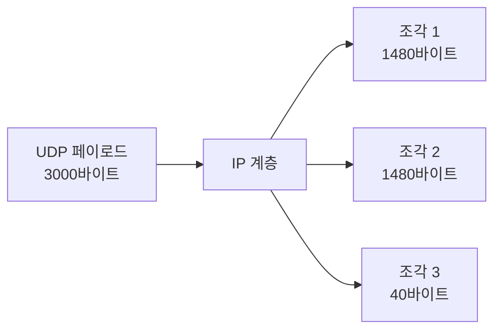

# UDP 프로토콜 동작 메커니즘

UDP는 TCP와 같은 트랜스포트 계층 프로토콜인데, 공통점은 거기서 끝난다. 연결도 없고, 재전송도 없고, 순서 보장도 없다. 그저 IP 위에 포트 번호와 길이, 체크섬만 얹어놓은 얇은 막 같은 프로토콜이다. 처음 백엔드를 시작했을 때는 "왜 이렇게 부실한 프로토콜을 쓰는가" 싶었는데, DNS·NTP·VoIP·QUIC·게임 서버를 다루다 보면 "TCP가 너무 무겁다"는 말을 체감하게 된다.

## UDP 헤더 구조

UDP 헤더는 정확히 8바이트다. TCP 헤더가 옵션 없이도 20바이트인 것과 비교하면 절반도 안 된다.

```
 0                   1                   2                   3
 0 1 2 3 4 5 6 7 8 9 0 1 2 3 4 5 6 7 8 9 0 1 2 3 4 5 6 7 8 9 0 1
+-+-+-+-+-+-+-+-+-+-+-+-+-+-+-+-+-+-+-+-+-+-+-+-+-+-+-+-+-+-+-+-+
|          Source Port          |       Destination Port        |
+-+-+-+-+-+-+-+-+-+-+-+-+-+-+-+-+-+-+-+-+-+-+-+-+-+-+-+-+-+-+-+-+
|             Length            |           Checksum            |
+-+-+-+-+-+-+-+-+-+-+-+-+-+-+-+-+-+-+-+-+-+-+-+-+-+-+-+-+-+-+-+-+
|                          Data (가변)                          |
+-+-+-+-+-+-+-+-+-+-+-+-+-+-+-+-+-+-+-+-+-+-+-+-+-+-+-+-+-+-+-+-+
```

각 필드를 보자.

**Source Port (16bit)**: 송신 측 포트. 응답이 필요 없는 단방향 전송이면 0으로 둘 수도 있다. DNS 응답이나 NTP는 응답이 필요하니 항상 채운다.

**Destination Port (16bit)**: 수신 측 포트. 이 포트로 바인딩된 소켓이 없으면 커널이 ICMP "Port Unreachable"을 돌려보낸다.

**Length (16bit)**: 헤더와 데이터를 합친 전체 길이. 단위는 바이트. 최댓값이 65535라서 이론상 UDP 페이로드는 65527바이트(65535 - 8)까지 가능하다. 다만 현실에서 이 크기를 그대로 보내는 일은 없다.

**Checksum (16bit)**: IPv4에서는 선택, IPv6에서는 필수. 0으로 두면 "체크섬 계산 안 함"이라는 의미다. 헤더만이 아니라 IP 헤더 일부(pseudo header)와 데이터까지 포함해 계산한다.

TCP 헤더에는 시퀀스 번호, 윈도우 크기, 플래그(SYN/ACK/FIN), 옵션이 모두 들어있다. UDP는 이런 게 전부 없다. 그래서 헤더 파싱 비용이 거의 0에 가깝고, 커널 스택을 통과하는 시간도 짧다.

## 비신뢰 전송이라는 말의 의미

"UDP는 신뢰성이 없다"는 말이 처음에는 추상적으로 들리는데, 실제로 어떤 보장이 없는지 나열해보면 명확해진다.

- 패킷이 도착한다는 보장이 없다
- 도착하더라도 순서가 보낸 순서와 같다는 보장이 없다
- 같은 패킷이 두 번 도착할 수 있다 (네트워크 장비가 복제)
- 송신 속도와 수신 능력이 맞는지 신경 쓰지 않는다 (혼잡 제어 없음)

이 네 가지가 없기 때문에 UDP 소켓에 `sendto()`를 호출하면 커널은 그냥 IP 계층으로 패킷을 던져버린다. 응답을 기다리지 않고, ACK도 받지 않는다. 송신 측에서 보면 `sendto()`는 거의 항상 성공한다. 패킷이 라우터에서 드롭되어도 송신자는 모른다.

이게 단점인가 하면 그렇지 않다. 실시간 음성을 전송하는데 200ms 전 패킷을 재전송 받아봐야 의미가 없다. 차라리 손실된 부분은 무시하고 다음 패킷으로 넘어가는 게 낫다. UDP는 이런 결정을 애플리케이션에 맡긴다.

## 체크섬, 그리고 0이 두 가지 의미를 가지는 문제

UDP 체크섬은 1의 보수 합산 방식으로 계산한다. 흥미로운 점은 계산 결과가 0이 나오면 그 값을 그대로 0으로 보내는 게 아니라 0xFFFF로 바꿔서 보낸다는 것이다. 왜냐하면 0은 "체크섬 계산 안 함"을 의미하는 특수값이기 때문이다.

실무에서 체크섬이 문제가 되는 경우는 두 가지다.

첫째, NIC의 체크섬 오프로딩. 요즘 NIC는 체크섬 계산을 하드웨어에서 처리한다. tcpdump로 캡처한 패킷의 체크섬이 "incorrect"로 보이면 당황하기 쉬운데, 실제로는 NIC가 송신 직전에 계산해서 채워주기 때문에 wire 위에서는 정상이다.

```bash
# 체크섬 오프로딩 확인
ethtool -k eth0 | grep checksum

# 디버깅 목적으로 끄기 (운영에서는 끄지 말 것)
ethtool -K eth0 tx-checksum-ipv4 off
```

둘째, IPv6에서는 체크섬이 필수다. IPv6는 IP 계층에서 체크섬을 제거했기 때문에 트랜스포트 계층에서 무결성을 책임져야 한다. UDP 패킷의 체크섬을 0으로 보내면 IPv6 스택은 그 패킷을 버린다. IPv4에서 동작하던 코드가 IPv6에서 갑자기 패킷이 안 가면 이걸 의심해봐야 한다.

## MTU와 단편화 문제

UDP가 TCP와 다른 가장 골치 아픈 차이가 단편화다. TCP는 MSS(Maximum Segment Size) 협상을 해서 한 번에 보낼 크기를 알아서 조절한다. UDP는 그런 게 없으니 애플리케이션이 MTU를 의식하지 않으면 IP 계층에서 단편화가 일어난다.

이더넷 MTU가 1500바이트라고 하면, IP 헤더 20바이트와 UDP 헤더 8바이트를 빼면 UDP 페이로드가 1472바이트를 넘는 순간 단편화가 발생한다. PPPoE를 쓰는 회선이면 MTU가 1492라서 더 작아진다.



단편화의 문제점은 조각 하나라도 손실되면 UDP 패킷 전체가 무효가 된다는 것이다. 1500바이트짜리 패킷이 손실될 확률이 1%라면, 3개로 쪼개진 4500바이트 패킷이 도착할 확률은 0.99³ ≈ 97%로 떨어진다. 거기다 일부 방화벽과 NAT 장비는 IP 단편을 아예 통과시키지 않는다.

DNS가 옛날부터 512바이트 제한을 둔 이유가 여기 있다. EDNS0가 나오면서 그 제한이 풀렸지만, 응답이 1500바이트를 넘기면 단편화 문제로 응답이 안 도착하는 경우가 생긴다. DNSSEC가 보급되면서 이 문제가 자주 보고됐다.

실무에서는 안전하게 UDP 페이로드를 1400바이트 정도로 잡는다. 인터넷 경로 중간 어딘가의 MTU가 1500보다 작을 수 있기 때문이다. Path MTU Discovery를 쓰면 정확한 값을 알 수 있지만, ICMP 차단된 경로에서는 동작하지 않는다.

```bash
# Path MTU 확인 (Linux)
tracepath www.example.com

# DF 비트를 켜서 단편화 없이 보내보기
ping -M do -s 1472 www.example.com
```

## TCP와의 실무적 비교

이론서는 "TCP는 신뢰성, UDP는 속도"라는 식으로 단순하게 정리하는데, 실제 선택 기준은 더 구체적이다.

**연결 수립 비용**: TCP는 3-Way Handshake로 RTT 1번을 쓴다. TLS까지 붙이면 RTT 2~3번이 추가된다. DNS 같은 단발성 요청에 RTT 4번을 쓰는 건 낭비다. UDP는 이게 0이다.

**Head-of-line blocking**: TCP는 순서를 보장하니 중간 패킷 하나가 손실되면 뒤따르는 패킷이 도착해도 애플리케이션에 전달하지 않는다. 실시간 영상에서 이게 치명적이다. UDP는 패킷 단위로 독립적이라 이 문제가 없다. QUIC가 UDP 위에서 만들어진 이유 중 하나가 이거다.

**상태 유지 비용**: TCP 연결은 양쪽 커널에 메모리를 점유한다. 동시 연결 1만 개면 송수신 버퍼만 합쳐도 수백 MB가 된다. UDP는 소켓 하나로 모든 클라이언트를 처리할 수 있다. DNS 서버, NTP 서버가 적은 리소스로 수만 QPS를 처리하는 비결이다.

**방화벽 친화도**: TCP는 SYN/FIN으로 연결 시작과 끝이 명확하니 stateful 방화벽이 추적하기 쉽다. UDP는 상태가 없어서 방화벽이 "5분간 응답 패킷이 없으면 세션 종료"같은 휴리스틱으로 추적한다. 그래서 NAT 뒤의 UDP 통신은 keepalive를 자주 보내야 한다.

| 항목 | TCP | UDP |
|------|-----|-----|
| 헤더 크기 | 20+ 바이트 | 8 바이트 |
| 연결 수립 RTT | 1 (TLS 추가 시 +2) | 0 |
| 패킷 손실 시 | 재전송 | 무시 |
| 순서 보장 | 있음 | 없음 |
| 흐름 제어 | 있음 (윈도우) | 없음 |
| 혼잡 제어 | 있음 (Reno/Cubic/BBR) | 없음 |
| 양방향 스트림 | 바이트 스트림 | 데이터그램 |
| 멀티캐스트 | 불가 | 가능 |

## 실제 사용 사례

**DNS (53)**: 질의·응답이 한 번에 끝나는 짧은 메시지. TCP를 쓰면 핸드셰이크에 시간을 다 쓴다. 응답이 512바이트를 넘으면 TC 비트를 켜서 클라이언트에게 TCP로 다시 물어보라고 알려준다.

**NTP (123)**: 시간 동기화는 정확한 RTT 측정이 핵심이다. TCP의 재전송 대기와 윈도우 제어가 측정값을 왜곡한다. UDP가 적합하다.

**VoIP / WebRTC**: 음성·영상은 늦게 도착한 데이터가 의미가 없다. SRTP가 UDP 위에서 동작하는 이유다. 패킷이 손실되면 PLC(Packet Loss Concealment)로 잠깐 보간하고 넘어간다.

**QUIC / HTTP/3**: TCP의 head-of-line blocking과 핸드셰이크 비용을 우회하기 위해 UDP 위에 새 트랜스포트를 만든 사례. 신뢰성·순서 보장·혼잡 제어는 QUIC 자체가 가지고 있다. 커널 스택을 안 거치고 사용자 공간에서 구현되니 진화 속도가 빠르다.

**게임 서버**: FPS·MOBA처럼 응답성이 핵심인 게임. 위치 정보는 0.1초만 늦어도 의미가 없다. 손실 허용하고 다음 업데이트로 넘어간다. 다만 아이템 거래 같은 신뢰성 필요한 통신은 별도로 TCP를 쓰거나 UDP 위에 reliable 채널을 만든다.

**SNMP, syslog, DHCP, TFTP**: 인프라 영역의 단방향 전송 다수가 UDP 기반이다.

## sendto / recvfrom 시스템콜

UDP 소켓 프로그래밍의 핵심은 `sendto()`와 `recvfrom()`이다. TCP의 `connect()`/`accept()`/`read()`/`write()` 흐름과 완전히 다르다.

```c
// 서버: 데이터그램 수신
int sock = socket(AF_INET, SOCK_DGRAM, 0);

struct sockaddr_in addr = {0};
addr.sin_family = AF_INET;
addr.sin_port = htons(5000);
addr.sin_addr.s_addr = INADDR_ANY;
bind(sock, (struct sockaddr*)&addr, sizeof(addr));

char buf[2048];
struct sockaddr_in client;
socklen_t clen = sizeof(client);

while (1) {
    ssize_t n = recvfrom(sock, buf, sizeof(buf), 0,
                        (struct sockaddr*)&client, &clen);
    if (n < 0) continue;
    // 응답을 같은 client 주소로 sendto
    sendto(sock, buf, n, 0, (struct sockaddr*)&client, clen);
}
```

`recvfrom()`은 한 번의 호출이 정확히 하나의 데이터그램을 반환한다. TCP의 `read()`처럼 "받을 수 있는 만큼 받는" 방식이 아니다. 만약 버퍼가 데이터그램보다 작으면 남은 데이터는 버려진다 (`MSG_TRUNC` 플래그가 설정된다). 그래서 `recvfrom()`의 버퍼는 예상되는 최대 패킷 크기보다 크게 잡아야 한다.

`sendto()`도 마찬가지로 한 번의 호출이 하나의 데이터그램을 만든다. TCP처럼 "버퍼에 쌓고 나중에 한꺼번에 보내는" 동작이 없다. Nagle 알고리즘 같은 것도 없다.

`connect()`를 UDP 소켓에 호출할 수도 있는데, 이때 의미는 "이 주소로만 보내고 받겠다"는 필터 설정이다. 연결 수립이 일어나는 게 아니다. `connect()` 후에는 `send()`/`recv()`를 쓸 수 있고, 다른 주소에서 온 패킷은 커널이 걸러낸다. 클라이언트 측에서 자주 쓴다.

## Python으로 같은 동작 확인하기

C 예제가 시스템콜의 의미를 드러내는 데는 좋지만, 실무에서 디버깅용 더미 서버를 띄울 때는 Python이 빠르다. asyncio 없이 동기 코드만으로도 충분한 경우가 많다.

```python
import socket

# 서버
sock = socket.socket(socket.AF_INET, socket.SOCK_DGRAM)
sock.setsockopt(socket.SOL_SOCKET, socket.SO_RCVBUF, 4 * 1024 * 1024)
sock.bind(("0.0.0.0", 5000))

while True:
    data, addr = sock.recvfrom(2048)
    print(f"from {addr}: {len(data)} bytes")
    sock.sendto(data, addr)  # echo
```

```python
# 클라이언트 (connect 사용)
sock = socket.socket(socket.AF_INET, socket.SOCK_DGRAM)
sock.connect(("192.168.1.10", 5000))
sock.settimeout(1.0)  # 응답 안 오면 1초 후 예외

sock.send(b"ping")
try:
    data = sock.recv(2048)
    print("got:", data)
except socket.timeout:
    print("no response")  # UDP는 무응답이 정상 경로 중 하나다
```

Python에서 `recvfrom()`의 버퍼 크기를 너무 작게 잡으면 데이터그램이 잘린다. C와 동일하다. 2048 정도는 잡아두는 게 안전하다. 굳이 메모리를 아낄 이유가 없다.

`settimeout()`은 UDP 클라이언트에서 거의 필수다. TCP라면 RST나 FIN이 와서 read가 깨지지만, UDP는 영원히 응답이 없어도 커널이 알려주지 않는다. 애플리케이션 타임아웃을 직접 거는 수밖에 없다.

## SO_REUSEPORT로 다중 워커 확장

리눅스 3.9 이후로 `SO_REUSEPORT`가 들어왔다. 같은 포트에 여러 소켓을 바인딩해서 커널이 해시 기반으로 패킷을 분산해준다. UDP 서버를 단일 코어에서 다중 코어로 확장할 때 가장 단순한 방법이다.

```c
int sock = socket(AF_INET, SOCK_DGRAM, 0);
int opt = 1;
setsockopt(sock, SOL_SOCKET, SO_REUSEPORT, &opt, sizeof(opt));
bind(sock, ...);
```

이 옵션을 켜고 동일한 코드의 워커 프로세스 N개를 띄우면 커널이 4-tuple(src_ip, src_port, dst_ip, dst_port) 해시로 패킷을 분배한다. 같은 클라이언트에서 온 패킷은 같은 워커로 가니까 세션 상태를 워커별로 들고 있을 수 있다.

주의할 점은 워커 하나가 죽으면 그 워커의 hash bucket에 해당하는 트래픽이 잠깐 다른 워커로 옮겨간다는 것이다. 세션 상태를 메모리에만 갖고 있으면 그 순간 클라이언트가 끊긴다. QUIC 서버처럼 connection ID 기반 라우팅이 필요하면 eBPF로 `SO_ATTACH_REUSEPORT_EBPF` 프로그램을 붙여서 직접 분배 규칙을 정의한다.

DNS 서버나 NTP 서버 같은 stateless 워크로드는 SO_REUSEPORT만으로 충분히 선형 확장된다. CPU 코어 수만큼 워커를 띄우는 게 일반적이다.

## 패킷 손실 측정과 SO_RCVBUF 튜닝

UDP에서 패킷 손실은 두 군데서 발생한다. 네트워크 경로 중간(라우터 큐 오버플로우)과 수신 호스트(소켓 버퍼 오버플로우). 이 둘을 구별해야 대응 방법이 달라진다.

수신 측 손실은 `/proc/net/udp`나 `netstat -su`로 확인한다.

```bash
# UDP 통계 보기
netstat -su

# 출력 예시
# Udp:
#     1234567 packets received
#     12 packets to unknown port received
#     345 packet receive errors
#     ...
#     RcvbufErrors: 245
#     SndbufErrors: 0
```

`RcvbufErrors`가 0이 아니면 소켓 수신 버퍼가 가득 차서 패킷이 버려지고 있다는 신호다. 원인은 보통 둘 중 하나다. 애플리케이션이 `recvfrom()`을 충분히 빠르게 호출하지 않거나, 버스트 트래픽을 흡수할 버퍼가 작거나.

기본 SO_RCVBUF는 보통 200KB 정도로 작다. 고처리량 UDP 서버는 이걸 키워야 한다.

```c
int rcvbuf = 4 * 1024 * 1024;  // 4MB
setsockopt(sock, SOL_SOCKET, SO_RCVBUF, &rcvbuf, sizeof(rcvbuf));
```

다만 SO_RCVBUF는 커널 최댓값(`net.core.rmem_max`)에 의해 제한된다. 그래서 sysctl도 함께 손봐야 한다.

```bash
# 현재 최댓값 확인
sysctl net.core.rmem_max
sysctl net.core.rmem_default

# 16MB로 늘리기
sysctl -w net.core.rmem_max=16777216
sysctl -w net.core.rmem_default=4194304
```

루트 권한이 필요한 `SO_RCVBUFFORCE`도 있는데, 이건 `rmem_max`를 무시하고 강제로 설정한다. 운영 환경에서는 sysctl을 정상적으로 손보는 게 맞다.

송신 측은 `SndbufErrors`로 확인할 수 있고, 송신 큐가 가득 차면 `sendto()`가 EAGAIN/ENOBUFS를 반환한다. 이때 애플리케이션이 어떻게 반응할지 정해놔야 한다. 그냥 버릴 건지, 잠깐 기다릴 건지.

네트워크 경로에서의 손실은 송수신 양쪽의 시퀀스 번호로 추정한다. 애플리케이션 프로토콜에 시퀀스를 넣어두면 수신 측에서 빠진 번호를 세어 손실률을 측정한다. RTP가 16비트 시퀀스를 헤더에 넣은 이유가 이거다.

## sendmmsg / recvmmsg 와 GSO/GRO

수만 QPS를 처리하는 UDP 서버에서는 시스템콜 자체가 병목이 된다. `recvfrom()`을 패킷마다 부르면 컨텍스트 스위치 비용이 누적된다. 리눅스는 `recvmmsg()`/`sendmmsg()`로 한 번의 시스템콜에서 여러 데이터그램을 처리하게 해준다.

```c
struct mmsghdr msgs[64];
struct iovec iovs[64];
char bufs[64][2048];
struct sockaddr_in addrs[64];

for (int i = 0; i < 64; i++) {
    iovs[i].iov_base = bufs[i];
    iovs[i].iov_len = sizeof(bufs[i]);
    msgs[i].msg_hdr.msg_iov = &iovs[i];
    msgs[i].msg_hdr.msg_iovlen = 1;
    msgs[i].msg_hdr.msg_name = &addrs[i];
    msgs[i].msg_hdr.msg_namelen = sizeof(addrs[i]);
}

int n = recvmmsg(sock, msgs, 64, 0, NULL);
// n개의 데이터그램을 한 번에 받음
```

벤치마크에서 패킷당 처리량이 2~3배 오르는 일이 흔하다. nginx의 QUIC 구현, dnsdist 같은 고성능 DNS 프록시가 모두 이걸 쓴다.

NIC 레벨의 GSO(Generic Segmentation Offload)와 GRO(Generic Receive Offload)도 UDP에서 동작한다. 커널이 큰 UDP 페이로드를 하나의 의사 패킷처럼 다루다가 NIC가 송신 직전에 잘게 쪼개거나, 수신 측에서는 작은 패킷들을 모아서 한 번에 스택으로 올린다. QUIC가 한 syscall로 64KB를 던지면 NIC가 알아서 1400바이트 단위로 쪼개주는 식이다.

```bash
# UDP GSO/GRO 상태 확인
ethtool -k eth0 | grep -E "udp|generic"

# tx-udp-segmentation, rx-udp-gro-forwarding 항목
```

오래된 커널(4.18 이하)이나 일부 NIC에서는 UDP GSO가 안 들어가 있다. 고처리량 UDP를 운영하려면 커널 버전과 NIC 드라이버를 확인해야 한다.

## UDP 위에서 신뢰성 만들기

UDP 기반 애플리케이션 프로토콜을 만들면 결국 TCP가 해주던 일을 직접 구현해야 한다. 일부만 필요한 경우가 많아서, 어디까지 만들지를 결정하는 게 설계의 핵심이다.

**재전송**: ACK와 타임아웃을 정의해야 한다. 단순히 RTO를 고정값으로 두면 RTT 변동에 대응이 안 된다. RFC 6298의 SRTT/RTTVAR 기반 RTO 계산이 검증된 방법이다.

```
SRTT = (1 - α) * SRTT + α * RTT_sample      (α = 1/8)
RTTVAR = (1 - β) * RTTVAR + β * |SRTT - RTT_sample|   (β = 1/4)
RTO = SRTT + 4 * RTTVAR
```

**순서 보장**: 시퀀스 번호와 재정렬 버퍼가 필요하다. 단, 순서가 깨진 패킷을 얼마나 기다릴지 정해야 한다. 너무 오래 기다리면 지연이 커지고, 너무 짧으면 reorder 손실이 늘어난다.

**중복 제거**: 같은 시퀀스가 두 번 오는 경우. 시퀀스 윈도우를 두고 이미 받은 번호인지 체크한다.

**혼잡 제어**: 이게 가장 까다롭다. UDP를 쓴다고 혼잡 제어를 안 만들면 네트워크에 부하를 주고 자기 트래픽도 손해다. RFC 8085(UDP Usage Guidelines)는 자기 트래픽이 일정 비율 이상이면 TFRC 같은 TCP-friendly 알고리즘을 구현하라고 권장한다. QUIC도 NewReno/CUBIC/BBR 같은 TCP의 혼잡 제어를 사용자 공간에서 구현했다.

**MTU 처리**: 단편화를 피하려면 애플리케이션이 패킷 크기를 1400바이트 정도로 제한해야 한다. 큰 메시지는 직접 쪼개고 합쳐야 한다.

이걸 다 직접 구현하느니 그냥 TCP를 쓰는 게 낫다는 결론이 나오는 경우가 대부분이다. UDP를 선택할 때는 "TCP의 어떤 동작이 우리 워크로드에 안 맞는가"를 먼저 명확히 해야 한다. 막연히 "UDP가 빠르다더라"로 시작하면 결국 부실한 TCP를 다시 만들게 된다.

## 게임 서버에서 UDP를 다루는 방식

FPS·MOBA·MMO 클라이언트가 서버와 주고받는 데이터는 크게 입력(input)과 상태(state)다. 입력은 클라이언트에서 서버로, 상태는 서버에서 클라이언트로 흐른다. 두 흐름의 특성이 달라서 UDP 위에서도 다르게 설계한다.

**입력 패킷**: 키 입력, 마우스 이동 같은 사용자 조작. 초당 30~60회 보낸다. 손실되면 그 순간의 조작이 사라지니까, 최근 N프레임의 입력을 매번 같이 보낸다. 패킷 손실이 산발적이면 다음 패킷에 포함된 직전 N프레임으로 복구된다. ACK도 시퀀스도 명시적으로 안 쓰는 단순한 패턴이지만, 1% 손실 환경에서도 입력 누락이 거의 안 일어난다.

**상태 스냅샷**: 서버가 모든 플레이어·발사체·맵 오브젝트의 위치를 모아서 클라이언트에게 보낸다. 초당 20~30회. 풀 스냅샷은 크기가 커서 매번 보내면 대역폭이 폭발한다. 그래서 마지막으로 ACK된 스냅샷과의 차이만 보내는 delta encoding을 쓴다. Quake 3의 snapshot 시스템이 원조다.

```
client → server : input { seq:1234, ack_snapshot:97, inputs:[t-3, t-2, t-1, t] }
server → client : snapshot { seq:98, base_seq:97, delta:{...} }
```

스냅샷 시퀀스가 클라이언트의 ack보다 너무 멀어지면 (예: 50 프레임 이상) 서버는 풀 스냅샷을 다시 보내야 한다. 그래서 ACK 흐름은 가볍더라도 반드시 있어야 한다.

**신뢰성이 필요한 메시지**: 채팅, 아이템 획득, 라운드 종료 같은 이벤트. 이건 손실되면 안 되니까 별도의 reliable 채널을 둔다. ENet, RakNet, GameNetworkingSockets 같은 라이브러리가 이 두 채널(unreliable + reliable)을 하나의 UDP 소켓 위에 멀티플렉싱한다. 직접 만들면 ACK + 재전송 + 순서 보장 코드를 다시 짜는 일이 된다.

**지터 버퍼와 보간**: 30Hz 스냅샷이라도 도착 간격이 일정하지 않다. 클라이언트는 받은 스냅샷을 바로 렌더링하지 않고 50~100ms 버퍼에 쌓아두고 시간상 한 박자 뒤로 보간해서 그린다. 이게 게임의 "넷코드 지연"의 정체다. 줄이면 끊김이 보이고, 늘리면 반응성이 떨어진다.

**시간 동기화**: 서버와 클라이언트가 같은 시계를 봐야 입력/상태가 의미가 통한다. NTP를 쓰지 않고 자체 핸드셰이크에서 RTT를 측정해 서버 시각을 추정한다. 5~10초마다 재추정해서 drift를 보정한다.

이 모든 게 TCP였다면 head-of-line blocking 한 번에 게임이 얼어붙는다. 그래서 게임은 거의 예외 없이 UDP다.

## DTLS로 UDP 암호화

TLS는 TCP의 순서·신뢰 보장을 전제로 만들어졌다. UDP에 그대로 못 올린다. 그래서 만들어진 게 DTLS(Datagram TLS)다. RFC 9147(DTLS 1.3) 기준이다.

DTLS는 TLS와 핸드셰이크 메시지가 거의 같지만 다음 차이가 있다.

- 핸드셰이크 메시지마다 시퀀스 번호와 재전송 타이머를 들고 있다 (TLS는 TCP가 해주던 일).
- 레코드마다 epoch와 시퀀스를 명시적으로 헤더에 넣어 중복·재전송을 구별한다.
- DoS 완화 목적으로 cookie 교환(HelloRetryRequest)이 들어간다. ClientHello에 반사 공격이 가능하기 때문이다.

WebRTC의 미디어 채널은 DTLS-SRTP로 키 교환을 한다. CoAP over DTLS는 IoT 영역에서 표준이다. OpenSSL이 DTLS 1.2/1.3을 지원하니 직접 구현하지 말고 라이브러리를 쓰면 된다.

QUIC는 DTLS를 쓰지 않는다. TLS 1.3 핸드셰이크를 QUIC 프레임에 직접 묶어버려서 별도 레이어가 없다. 그래서 QUIC 핸드셰이크가 TCP+TLS보다 RTT 한 번을 더 줄일 수 있다.

## 멀티캐스트와 브로드캐스트

UDP만의 특권이다. TCP는 1:1 연결이라 멀티캐스트가 불가능하다. UDP는 송신자가 멀티캐스트 그룹 주소(IPv4 224.0.0.0/4, IPv6 ff00::/8)로 보내면 그 그룹에 가입한 모든 호스트가 받는다.

```c
// 멀티캐스트 그룹 가입
struct ip_mreq mreq;
mreq.imr_multiaddr.s_addr = inet_addr("239.1.1.1");
mreq.imr_interface.s_addr = INADDR_ANY;
setsockopt(sock, IPPROTO_IP, IP_ADD_MEMBERSHIP, &mreq, sizeof(mreq));
```

실무에서 인터넷 멀티캐스트는 거의 죽었다. ISP가 멀티캐스트 라우팅을 안 켜준다. 데이터센터 내부 LAN이나 사내망에서는 살아있다. 금융권 시세 분배(주식 호가)가 대표적이다. 하나의 호가 스트림을 수백 개 워크스테이션에 동시에 뿌리는 데 멀티캐스트만큼 싼 방법이 없다.

브로드캐스트(`255.255.255.255` 또는 서브넷 브로드캐스트)는 같은 L2 세그먼트에만 도달한다. DHCP가 클라이언트 IP를 받기 전 서버를 찾는 용도로 쓰는 게 거의 유일한 일상 사례다.

mDNS·SSDP 같은 서비스 디스커버리가 IPv4 멀티캐스트의 흔한 응용이다. `224.0.0.251:5353`에 가입하면 같은 네트워크의 AirPlay·Chromecast 같은 장비가 광고하는 패킷을 받을 수 있다.

## netcat으로 디버깅

UDP는 연결이 없어서 디버깅 도구도 좀 다르게 동작한다. 기본 `nc`가 UDP를 지원하니 간단한 검증에 자주 쓴다.

```bash
# 서버 측: 5000 포트에서 UDP 수신
nc -u -l 5000

# 클라이언트 측: 서버에 UDP 전송
nc -u 192.168.1.10 5000
# 표준입력으로 입력한 내용이 전송됨
```

여기서 함정이 있다. `nc -u`는 첫 패킷이 도착하기 전에는 응답을 보낼 곳을 모른다. 그래서 클라이언트가 먼저 뭐든 보내야 서버가 그 주소를 기억하고 응답할 수 있다. TCP라면 `accept()`로 클라이언트 정보를 얻지만, UDP는 `recvfrom()` 호출 결과로만 알 수 있기 때문이다.

특정 포트에 UDP 서비스가 떠있는지 확인하는 것도 TCP보다 까다롭다. TCP는 SYN을 보내면 RST나 SYN+ACK가 돌아와서 명확한데, UDP는 응답이 없는 게 정상이다. nmap의 `-sU` 스캔도 정확도가 낮다.

```bash
# UDP 포트 스캔 (느리고 부정확)
nmap -sU -p 53 192.168.1.10

# 특정 페이로드를 보내야 응답하는 서비스도 많다
# DNS는 정상 질의를 보내야 응답
dig @192.168.1.10 example.com

# tcpdump로 실제 패킷 흐름 확인이 가장 확실
tcpdump -i eth0 -n udp port 5000 -X
```

수신 통계가 의심스러우면 `ss -lun`으로 UDP 리스닝 소켓을, `ss -un`으로 모든 UDP 소켓을 확인한다. `Recv-Q`가 계속 차있으면 애플리케이션이 패킷을 못 빼가고 있다는 뜻이다.

```bash
# UDP 소켓 상태와 큐
ss -lunp
# State  Recv-Q  Send-Q  Local Address:Port
# UNCONN    0       0           *:5000      users:(("server",pid=1234,fd=3))
```

운영 중인 서버에서 UDP 손실이 의심되면 보통 다음 순서로 확인한다. `netstat -su`로 RcvbufErrors 증가 여부를 본다. 증가하면 SO_RCVBUF나 애플리케이션 처리 속도 문제다. 증가하지 않으면 네트워크 경로의 손실이거나 방화벽 문제일 가능성이 크다. tcpdump로 wire 위 패킷을 직접 보고, 양쪽 호스트에서 동시에 캡처해 어디서 사라지는지 추적한다. 이게 UDP 운영의 거의 전부다.
