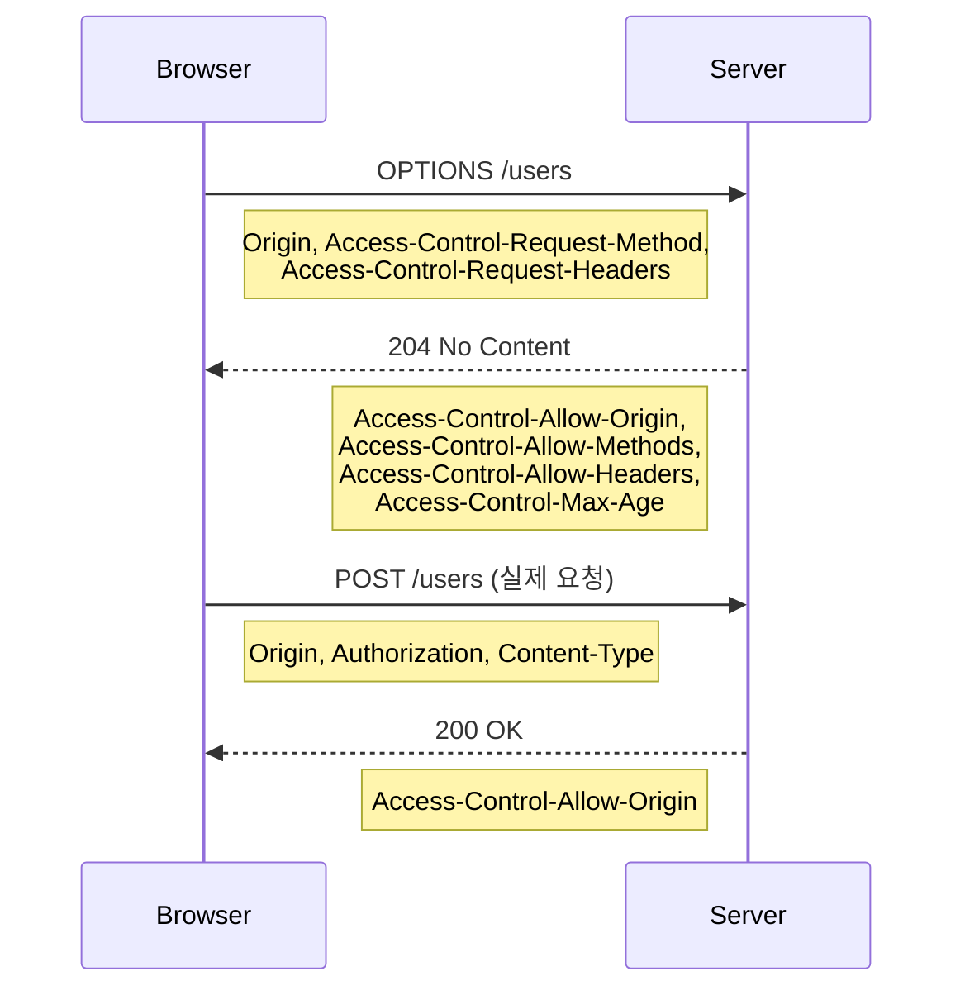

# CORS - Origin, Preflight, 인증 쿠키, 인프라 설정

CORS는 백엔드 5년 차쯤 되면 누구나 한 번은 크게 데인다. 로컬에서는 잘 되던 API가 배포하면 막히고, OPTIONS 요청이 401로 떨어지고, `*`을 줬는데도 쿠키가 안 실리고, 프론트는 "CORS 에러요"라고 한 줄만 던지고 사라진다. 정작 브라우저 콘솔에 찍히는 메시지는 모호해서 어디부터 봐야 할지 감이 안 온다.

이 문서는 그동안 운영하면서 겪은 패턴들을 정리한다. 스펙 자체는 Fetch Living Standard에 정의되어 있는데, 실무에서는 그 스펙이 어떤 형태로 인프라(Nginx, ALB, API Gateway)에 매핑되는지가 더 중요하다.

## CORS가 왜 존재하나

브라우저는 기본적으로 **Same-Origin Policy(SOP)** 라는 보안 정책을 따른다. 자바스크립트가 다른 Origin의 응답을 읽지 못하게 막는 게 핵심이다. 이게 없으면 사용자가 광고 사이트를 열었을 때 그 사이트의 스크립트가 사용자의 은행 계좌 페이지를 fetch해서 잔액을 긁어갈 수 있다.

문제는 SOP만 있으면 SPA + API 분리 아키텍처가 동작을 안 한다는 점이다. `app.example.com`에서 `api.example.com`으로 요청을 보내야 하는데, 이건 다른 Origin이라 막힌다. 그래서 등장한 게 CORS — 서버가 "이 Origin은 내 응답을 읽어도 됨"을 헤더로 명시하면 브라우저가 통과시켜 주는 메커니즘이다.

핵심을 짚고 넘어가야 할 게 있다. **CORS는 서버가 요청을 막는 게 아니라 브라우저가 응답을 차단하는 것이다.** 서버는 요청을 받고 처리도 다 한다. 다만 브라우저가 응답을 자바스크립트에 넘기지 않을 뿐이다. 그래서 CORS가 막혀도 서버 로그에는 200 OK가 찍힌다. 이거 모르고 서버 로그만 보다가 "왜 멀쩡한데 안 된대?" 하는 일이 흔하다.

## Origin의 정의

CORS를 이해하려면 먼저 Origin이 뭔지 정확히 알아야 한다. Origin은 **scheme + host + port** 세 가지의 조합이다.

```
https://example.com:443/path
└─┬─┘   └────┬────┘ └─┬─┘
scheme    host    port

→ Origin: https://example.com (443은 https 기본 포트라 생략)
```

세 가지 중 하나라도 다르면 다른 Origin이다. 실무에서 자주 사고 나는 케이스를 정리하면:

```
https://example.com   vs  http://example.com       → 다름 (scheme)
https://example.com   vs  https://api.example.com  → 다름 (host, 서브도메인)
https://example.com   vs  https://example.com:8080 → 다름 (port)
https://example.com   vs  https://example.com/v2   → 같음 (path는 무관)
```

서브도메인이 다르면 무조건 다른 Origin이다. `example.com`과 `www.example.com`도 다르다. 쿠키의 도메인 정책(eTLD+1 기반)과 헷갈리기 쉬운데, **CORS의 Origin 동일성과 쿠키의 도메인 정책은 별개의 룰**이다.

## Simple Request vs Preflight

CORS 요청은 두 종류로 나뉜다. **Simple Request(단순 요청)** 와 **Preflighted Request(사전 요청 동반)**. 어느 쪽으로 분류되느냐에 따라 OPTIONS 요청이 추가로 가는지 말지가 갈린다.

Simple Request의 조건은 모두 만족해야 한다.

- 메서드: GET, HEAD, POST 셋 중 하나
- 헤더: 안전한 헤더(Accept, Accept-Language, Content-Language, Content-Type)만 사용
- Content-Type: `application/x-www-form-urlencoded`, `multipart/form-data`, `text/plain` 셋 중 하나
- ReadableStream 미사용, XMLHttpRequest의 upload 이벤트 리스너 미등록

이 조건 중 하나라도 어기면 Preflight가 발생한다. 실무에서 이걸 어기는 흔한 케이스가 두 가지다.

```javascript
// 케이스 1: Content-Type이 application/json
fetch('https://api.example.com/users', {
  method: 'POST',
  headers: { 'Content-Type': 'application/json' },
  body: JSON.stringify({ name: 'foo' })
});

// 케이스 2: 커스텀 헤더(Authorization도 일부 환경에서 트리거)
fetch('https://api.example.com/users', {
  headers: { 'X-Request-Id': 'abc123' }
});
```

요즘 API는 거의 다 `application/json`을 쓰니까 사실상 모든 POST/PUT/DELETE 요청은 Preflight를 동반한다고 봐도 된다. 이게 의외로 트래픽 비용에 영향을 준다 — 요청 한 번에 OPTIONS + 실제 요청 두 번이 나간다.

`Authorization` 헤더는 단순 헤더 목록에 없다. JWT를 `Authorization: Bearer ...`로 넘기면 자동으로 Preflight가 걸린다. 이걸 모르고 "GET 요청인데 왜 OPTIONS가 가지?" 하는 경우가 종종 있다.

### Preflight 흐름



Preflight 응답 코드는 보통 204로 한다. 200도 되지만 본문이 없으니 204가 의미상 맞다. 중요한 건 **Preflight 응답이 2xx여야 한다**는 점이다. 401, 403이 떨어지면 브라우저는 실제 요청을 보내지도 않고 차단한다. 이거 때문에 사고가 많이 난다(뒤에서 다룬다).

## Preflight 캐시: Access-Control-Max-Age

매 요청마다 OPTIONS가 나가면 latency 손실이 크다. 그래서 브라우저는 Preflight 결과를 캐싱한다. `Access-Control-Max-Age` 헤더로 초 단위 TTL을 지정한다.

```
Access-Control-Max-Age: 86400
```

이 값을 주면 24시간 동안 같은 Origin + 메서드 + 헤더 조합에 대해 OPTIONS를 다시 보내지 않는다. 그런데 **브라우저별 상한이 있다**. Chrome은 2시간(7200초), Firefox는 24시간(86400초)이 상한이다. 그 이상 줘도 무시된다.

운영 환경에서 86400을 박아두는 게 일반적이지만, CORS 설정을 자주 바꾸는 초기 단계에서는 짧게 두는 게 디버깅에 유리하다. 캐시가 살아 있으면 서버에서 헤더를 고쳐도 클라이언트는 이전 응답을 계속 신뢰해서 "왜 안 바뀌지?" 하는 함정에 빠진다.

또 하나 주의할 점은 **캐시 키가 (Origin, URL, 메서드, 헤더 조합) 단위**라는 점이다. URL의 path가 바뀌면 캐시가 무효화된다. RESTful API에서 `/users/1`과 `/users/2`는 다른 캐시 엔트리를 만들기 때문에 사실 캐시 효과가 생각보다 작다. 이건 스펙상 그렇게 정의된 것이고, 어쩔 수 없다.

## credentials: include의 함정

CORS에서 가장 자주 사고 나는 영역이 인증 정보(쿠키, Authorization 헤더, TLS 클라이언트 인증서) 처리다. 기본적으로 fetch나 XHR은 cross-origin 요청에 쿠키를 안 실어 보낸다. 쿠키를 실으려면 명시적으로 옵션을 줘야 한다.

```javascript
// Fetch API
fetch('https://api.example.com/me', { credentials: 'include' });

// Axios
axios.get('https://api.example.com/me', { withCredentials: true });

// XMLHttpRequest
xhr.withCredentials = true;
```

이렇게 보내면 서버 쪽 응답도 두 가지를 만족해야 한다.

1. `Access-Control-Allow-Credentials: true`
2. `Access-Control-Allow-Origin`은 **반드시 구체적인 Origin** (와일드카드 `*` 금지)

```
Access-Control-Allow-Origin: https://app.example.com
Access-Control-Allow-Credentials: true
```

### 왜 credentials 모드에서 `*`을 못 쓰나

이건 단순히 명세 작성자가 그렇게 정한 게 아니라 보안적으로 명확한 이유가 있다. `*`을 허용하면 모든 Origin에서 인증 쿠키와 함께 요청이 가능해진다. 이러면 사용자가 로그인된 상태에서 악성 사이트가 인증된 요청을 보내고 그 응답까지 읽을 수 있다. 사실상 SOP를 무력화하는 것과 같다.

그래서 명세는 강제했다. credentials를 실으면 서버는 **"누가 보낸 요청인지"를 명확히 인지하고 허용한 것이어야 한다**. 그게 구체적 Origin을 요구하는 이유다.

실무에서는 보통 화이트리스트를 둔다.

```javascript
// Express + cors 미들웨어 예시
const allowedOrigins = ['https://app.example.com', 'https://admin.example.com'];

app.use(cors({
  origin: (origin, callback) => {
    if (!origin || allowedOrigins.includes(origin)) {
      callback(null, true);
    } else {
      callback(new Error('CORS blocked'));
    }
  },
  credentials: true,
}));
```

요청의 Origin을 보고 화이트리스트에 있으면 그 Origin을 그대로 응답에 박는 패턴이다. 와일드카드를 못 쓰니까 동적으로 매핑해주는 거다. 이때 Origin 검증을 정규식으로 하다가 실수해서 `*.example.com`이 `example.com.evil.com`까지 매치되는 사고를 친 적이 있다. 정규식은 항상 anchor(`^`, `$`)를 명확히 박아야 한다.

또한 Origin 헤더를 그대로 응답에 echo할 때는 **`Vary: Origin` 헤더를 같이 줘야 한다**. 안 그러면 CDN이나 중간 프록시가 Origin이 다른 응답을 캐싱해서 잘못 내려보낸다. 이거 빼먹어서 다른 사용자의 응답이 섞여 나온 사고를 한 번 본 적이 있다.

```
Access-Control-Allow-Origin: https://app.example.com
Access-Control-Allow-Credentials: true
Vary: Origin
```

## withCredentials와 SameSite 쿠키

withCredentials를 켜도 쿠키가 안 실리는 경우가 있다. 거의 99% **SameSite 쿠키 속성** 문제다. 2020년 이후 Chrome이 SameSite 기본값을 `Lax`로 바꾸면서 cross-site 요청에 쿠키가 자동으로 빠진다.

쿠키의 SameSite 속성은 세 종류다.

- `Strict`: cross-site 요청에 절대 안 실림. 같은 Origin에서만 보낸다.
- `Lax`: 일반적인 cross-site 요청에는 빠지지만, top-level 네비게이션(링크 클릭, GET form submit)은 허용
- `None`: cross-site 요청에 무조건 실림. 단 `Secure` 속성 필수(HTTPS)

SPA + 별도 도메인 API 구조에서 인증 쿠키를 cross-origin으로 보내려면 `SameSite=None; Secure`를 줘야 한다.

```
Set-Cookie: session=abc123; HttpOnly; Secure; SameSite=None; Path=/
```

여기서 한 번 더 함정이 있다. `app.example.com`과 `api.example.com`은 cross-origin이지만 **same-site**다(eTLD+1이 `example.com`으로 같으니까). 그래서 SameSite=Lax도 동작하는 케이스가 있다. 정확히는:

- same-site: eTLD+1이 같음 (`app.example.com` vs `api.example.com`)
- same-origin: scheme + host + port가 같음 (`api.example.com:443` vs `api.example.com:443`)

CORS는 same-origin 기준으로 동작하고, SameSite 쿠키는 same-site 기준으로 동작한다. 그래서 "CORS는 막히는데 쿠키는 실리는" 미묘한 상황이 나온다. 같은 회사 내부 도메인끼리는 same-site니까 SameSite=Lax로도 충분한 경우가 많다.

전혀 다른 도메인(예: `app.foo.com`과 `api.bar.com`)이면 무조건 `SameSite=None; Secure`다.

## Nginx에서 CORS 헤더 설정

Nginx로 CORS를 다룰 때 가장 흔한 실수가 `if` 안에서 헤더를 추가하는 것이다. Nginx의 `if`는 evil로 유명한데, 특히 location 블록 내에서 if를 쓰면 add_header가 다른 add_header를 덮어버리는 일이 있다.

기본 패턴은 이렇게 짠다.

```nginx
location /api/ {
    # Preflight
    if ($request_method = 'OPTIONS') {
        add_header 'Access-Control-Allow-Origin' "$http_origin" always;
        add_header 'Access-Control-Allow-Credentials' 'true' always;
        add_header 'Access-Control-Allow-Methods' 'GET, POST, PUT, DELETE, OPTIONS' always;
        add_header 'Access-Control-Allow-Headers' 'Authorization, Content-Type, X-Request-Id' always;
        add_header 'Access-Control-Max-Age' 86400 always;
        add_header 'Content-Length' 0;
        add_header 'Content-Type' 'text/plain; charset=utf-8';
        return 204;
    }

    # 실제 요청
    add_header 'Access-Control-Allow-Origin' "$http_origin" always;
    add_header 'Access-Control-Allow-Credentials' 'true' always;
    add_header 'Vary' 'Origin' always;

    proxy_pass http://upstream;
}
```

`always` 플래그가 중요하다. 이게 없으면 4xx/5xx 응답에는 CORS 헤더가 안 붙어서 에러 메시지를 브라우저가 못 읽는다. 그러면 프론트는 정확한 에러 코드 대신 그냥 "CORS 에러"만 본다.

그리고 `$http_origin`을 그대로 쓰면 모든 Origin이 통과한다. 보안상 문제가 있으면 `map`으로 화이트리스트를 만들어야 한다.

```nginx
map $http_origin $cors_origin {
    default "";
    "~^https://(app|admin)\.example\.com$" $http_origin;
}

server {
    location /api/ {
        add_header 'Access-Control-Allow-Origin' "$cors_origin" always;
        add_header 'Vary' 'Origin' always;
        # ...
    }
}
```

## ALB(Application Load Balancer)에서의 CORS

AWS ALB는 자체적으로 CORS 헤더를 추가하는 기능이 없다. 정확히는 ALB의 listener rule에서 fixed response를 줄 때 헤더 한두 개를 박을 수는 있지만, 보통의 reverse proxy처럼 응답 헤더를 자유롭게 조작하는 기능은 제공하지 않는다.

그래서 ALB 뒤에 있는 애플리케이션이 직접 CORS 헤더를 내려야 한다. Express의 cors 미들웨어, Spring의 CorsFilter, Django의 corsheaders 같은 걸 쓴다.

ALB만으로 CORS를 처리하고 싶다면 두 가지 방법이 있다.

1. ALB → Lambda(또는 ECS) 사이에 Nginx/Envoy 같은 reverse proxy를 한 단 더 둔다
2. CloudFront를 ALB 앞에 두고 CloudFront Functions 또는 Response Headers Policy로 헤더를 박는다

CloudFront의 Response Headers Policy는 2021년 말에 추가된 기능인데, CORS 헤더를 코드 없이 콘솔에서 설정할 수 있다. 화이트리스트 Origin도 지정 가능하다. 다만 동적 Origin echo는 못 하고 정적 Origin만 가능하다는 한계가 있다. credentials를 쓸 거면 Origin을 하나만 지정해야 하니까 사실상 불편하다.

## API Gateway의 CORS 처리

AWS API Gateway는 콘솔에서 "Enable CORS" 버튼이 있다. 이걸 누르면 OPTIONS 메서드를 자동으로 추가하고 Mock integration으로 Preflight 응답을 만들어준다.

```yaml
# OpenAPI 정의 (REST API)
options:
  responses:
    '200':
      description: CORS preflight
      headers:
        Access-Control-Allow-Origin:
          schema: { type: string }
        Access-Control-Allow-Methods:
          schema: { type: string }
        Access-Control-Allow-Headers:
          schema: { type: string }
  x-amazon-apigateway-integration:
    type: mock
    requestTemplates:
      application/json: '{"statusCode": 200}'
    responses:
      default:
        statusCode: 200
        responseParameters:
          method.response.header.Access-Control-Allow-Origin: "'https://app.example.com'"
          method.response.header.Access-Control-Allow-Methods: "'GET,POST,OPTIONS'"
          method.response.header.Access-Control-Allow-Headers: "'Content-Type,Authorization'"
```

API Gateway에서 CORS를 켤 때 가장 자주 빠뜨리는 게 **실제 메서드 응답에도 CORS 헤더를 추가하는 작업**이다. OPTIONS만 자동으로 만들어지고, GET/POST 응답에는 별도로 `Access-Control-Allow-Origin` 헤더를 정의해줘야 한다. 이걸 빼먹으면 Preflight는 통과하는데 실제 응답에서 막힌다.

HTTP API(v2)는 이게 좀 더 단순해서, 콘솔에서 CORS 설정을 한 번 하면 모든 응답에 헤더가 자동으로 붙는다. REST API(v1)는 메서드마다 일일이 설정해야 한다.

## OPTIONS가 인증 미들웨어에 막히는 사고

이게 정말 흔한 사고다. 백엔드에 인증 미들웨어를 글로벌하게 걸어둔 상태에서, OPTIONS 요청에는 Authorization 헤더가 안 실려 오니까(Preflight는 단순한 메타 요청이다) 미들웨어가 401을 떨어뜨린다. 그러면 브라우저는 Preflight 실패로 보고 실제 요청을 보내지도 않는다.

```javascript
// 잘못된 패턴
app.use(authMiddleware);  // 모든 요청에 인증 체크
app.use(corsMiddleware);  // OPTIONS도 인증을 통과해야 함
```

해결 방법은 두 가지다.

```javascript
// 방법 1: CORS를 인증보다 먼저
app.use(corsMiddleware);
app.use(authMiddleware);

// 방법 2: 인증 미들웨어에서 OPTIONS 예외
function authMiddleware(req, res, next) {
  if (req.method === 'OPTIONS') return next();
  // ... 토큰 검증
}
```

`cors` npm 패키지처럼 잘 만들어진 라이브러리는 OPTIONS 요청을 즉시 처리하고 다음 미들웨어로 안 넘긴다. 그런데 직접 미들웨어를 짜면 이걸 빼먹기 쉽다.

Spring의 경우 `CorsFilter`를 SecurityFilterChain의 가장 앞에 등록해야 한다. `addFilterBefore(corsFilter, ChannelProcessingFilter.class)` 같은 식으로 명시적으로 순서를 지정한다.

또 하나 자주 보는 케이스 — **API Gateway에 Lambda Authorizer를 걸어둔 경우**다. Authorizer가 OPTIONS 요청에서 토큰을 못 찾고 401을 반환한다. 해결은 Authorizer 설정에서 OPTIONS는 검증을 건너뛰게 하거나, OPTIONS 라우트를 Authorizer 없이 별도 정의하는 식이다.

## 프록시로 우회하는 패턴

CORS를 아예 회피하는 가장 무식하고 확실한 방법은 같은 Origin으로 만드는 것이다. 프론트와 백엔드 사이에 프록시를 두면 브라우저 입장에서는 same-origin이라 CORS가 발동하지 않는다.

### 개발 환경: 프론트엔드 dev server의 프록시

```javascript
// Vite의 vite.config.js
export default {
  server: {
    proxy: {
      '/api': {
        target: 'http://localhost:8080',
        changeOrigin: true,
      }
    }
  }
}

// Webpack devServer
devServer: {
  proxy: {
    '/api': 'http://localhost:8080'
  }
}
```

프론트는 자기 자신의 dev server(`http://localhost:5173`)에 `/api/...`로 요청을 보내고, dev server가 백엔드(`http://localhost:8080`)로 프록시한다. 브라우저는 전부 same-origin으로 본다.

### 운영 환경: Nginx 또는 ALB로 path 기반 라우팅

```
example.com/        → 프론트 정적 파일 (S3 + CloudFront)
example.com/api/*   → 백엔드 API (ALB → ECS)
```

이렇게 한 도메인 아래에 path로 분리하면 CORS를 신경 쓸 일이 거의 없다. 다만 캐시 정책, SSL 인증서, 배포 파이프라인이 복잡해질 수 있어서 트레이드오프가 있다.

서버 사이드 프록시를 쓰는 패턴도 있다. 백엔드 A가 백엔드 B의 API를 대신 호출해주는 식이다. 이때는 브라우저가 아니라 서버끼리 통신하니까 CORS와 무관하다. 다만 서버 부하가 늘고 인증/권한 처리가 한 단계 더 필요하다.

## CORS와 CSRF는 다른 개념이다

이게 의외로 헷갈려 하는 사람이 많다. 둘 다 cross-site와 관련된 보안 개념이지만 막는 대상이 다르다.

| 항목 | CORS | CSRF |
|------|------|------|
| 막는 대상 | 다른 Origin 스크립트가 응답을 **읽는** 것 | 사용자도 모르게 인증된 요청이 **전송**되는 것 |
| 동작 주체 | 브라우저 | 서버(토큰 검증 등) |
| 발동 시점 | 자바스크립트가 fetch/XHR을 호출할 때 | form submit, img src, link 등 모든 요청 |
| 해결 방법 | 서버가 Allow-Origin 헤더 응답 | CSRF 토큰, SameSite 쿠키, double-submit cookie |

CORS는 **읽기를 막는** 메커니즘이다. 자바스크립트가 다른 Origin의 응답을 읽지 못하게 한다. 그런데 **전송 자체는 막지 않는다**. simple request의 경우 OPTIONS 없이 바로 서버에 도달하고, 서버는 요청을 처리한다(쿠키도 SameSite 설정에 따라 실릴 수 있다). 다만 응답을 자바스크립트에 안 넘길 뿐이다.

여기서 CSRF가 등장한다. CSRF는 사용자가 로그인한 상태에서 악성 사이트가 사용자 모르게 요청을 보내 상태를 변경(POST, DELETE 등)하는 공격이다. 응답을 못 읽어도 서버 상태는 이미 바뀌었으니 피해는 발생한다.

```html
<!-- 악성 사이트의 코드 -->
<form action="https://bank.example.com/transfer" method="POST">
  <input name="to" value="attacker">
  <input name="amount" value="1000000">
</form>
<script>document.forms[0].submit();</script>
```

이런 form submit은 CORS 대상이 아니다. CORS는 자바스크립트의 fetch/XHR을 제약하는 것이고, form은 그 이전부터 cross-origin 전송이 허용되어 있다. 그래서 CORS를 빡빡하게 설정해도 CSRF는 막을 수 없다.

CSRF 방어는 별도 메커니즘이다.

- **CSRF 토큰**: 서버가 발급한 랜덤 토큰을 form/header에 넣어 검증
- **SameSite 쿠키**: `SameSite=Lax` 또는 `Strict`로 cross-site 요청에 쿠키가 안 실리게
- **Origin/Referer 헤더 검증**: 서버가 들어온 Origin을 화이트리스트와 비교
- **double-submit cookie**: 쿠키와 헤더에 같은 토큰을 넣고 서버가 매칭 검증

요약하면, **CORS는 cross-origin 자바스크립트의 응답 읽기를 막는 브라우저 정책이고, CSRF는 cross-origin 인증된 요청을 막는 서버 측 방어다**. 둘 다 필요하고, 한쪽만 한다고 다른 쪽이 자동으로 해결되지 않는다.

## 디버깅 체크 순서

CORS 에러가 났을 때 매번 같은 순서로 확인한다.

1. **브라우저 Network 탭에서 OPTIONS 요청과 실제 요청을 분리해서 본다.** 어느 쪽이 막혔는지부터 정확히 짚어야 한다.
2. **OPTIONS 응답이 2xx인지 확인한다.** 401, 403, 500이면 인증 미들웨어 또는 라우팅 문제다.
3. **응답 헤더에 `Access-Control-Allow-Origin`이 있는지 본다.** 없으면 서버가 CORS 헤더를 안 보내는 것이다.
4. **`Allow-Origin` 값이 요청 Origin과 정확히 일치하는지 본다.** 대소문자, 끝의 슬래시까지 정확히 매치되어야 한다.
5. **credentials를 쓰는데 `*`이면 막힌다.** 구체적 Origin으로 바꿔야 한다.
6. **요청에 사용한 헤더가 `Allow-Headers`에 다 들어 있는지 확인한다.** `Authorization`, `Content-Type`, 커스텀 헤더 등.
7. **Preflight 캐시를 의심한다.** Network 탭에서 "Disable cache"를 켜거나 시크릿 창에서 다시 시도한다.

대부분의 사고는 1~3번에서 잡힌다. 서버 로그만 보지 말고 브라우저 개발자 도구를 같이 봐야 정확한 원인이 보인다.
