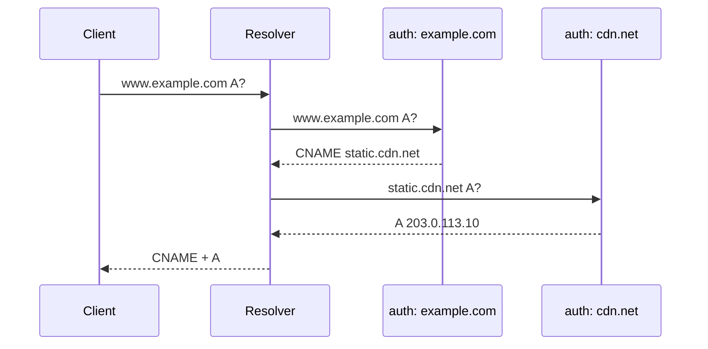

# CNAME (Canonical Name Record)

## 개요

CNAME은 한 도메인을 다른 도메인의 별칭으로 지정하는 DNS 레코드다. RFC 1034 3.6.2와 RFC 2181 10.1에 정의돼 있다. `www.example.com`을 `example.com`으로 가리키거나, `api.example.com`을 CDN이나 클라우드 로드밸런서의 도메인(`d1234.cloudfront.net` 같은)으로 보내는 용도로 가장 많이 쓴다.

문법은 단순하지만 운영에서 사고가 잘 난다. apex에 못 쓰고, 같은 이름에 다른 레코드를 못 두고, 체이닝하면 latency가 누적되고, TTL이 꼬이면 캐시 무효화가 비대칭으로 일어난다. 5년차쯤 되면 한 번씩 다 밟아본다.

## CNAME의 동작 원리

### 리졸버는 CNAME을 만나면 재귀적으로 따라간다

질의 흐름을 보자. 클라이언트가 `www.example.com`의 A를 묻는다. 권한 서버가 `www.example.com CNAME example.com`을 돌려준다. 리졸버는 이걸 받고 다시 `example.com`의 A를 묻는다. 권한 서버가 `93.184.216.34`를 돌려준다. 최종적으로 클라이언트에는 CNAME 체인과 마지막 A가 함께 전달된다.

```
$ dig www.example.com +noall +answer
www.example.com.    300    IN    CNAME    example.com.
example.com.        300    IN    A        93.184.216.34
```

리졸버 입장에서는 한 번의 질의로 두 단계의 DNS 조회가 일어난 셈이다. 권한 서버가 같은 zone이면 한 응답에 다 담겨 오고, 다른 zone이면 리졸버가 추가 질의를 보낸다. 후자가 latency 누적의 원인이다.

### CNAME은 "이 이름은 사실 저 이름이다"라는 선언

A 레코드처럼 IP를 가리키는 게 아니라 다른 이름을 가리킨다. 그래서 리졸버는 CNAME을 받으면 "이 이름으로 다시 묻지 말고 저 이름으로 물어라"라고 해석한다. 이게 핵심이고, 모든 제약이 여기서 파생된다.



## Apex(루트) 도메인에는 CNAME을 못 쓴다

### RFC 1912 2.4와 RFC 2181 10.1의 제약

`example.com` 같은 zone apex에는 SOA와 NS 레코드가 반드시 있어야 한다. CNAME이 있는 이름에는 다른 레코드를 둘 수 없다. 두 조건이 충돌하니 apex에 CNAME을 쓸 수 없다. 이건 BIND나 다른 권한 서버 구현 문제가 아니라 RFC 자체의 제약이다.

```
; 이렇게 못 쓴다 (zone apex)
example.com.    IN    CNAME    cdn-provider.com.    ; INVALID

; apex가 아닌 서브도메인은 가능
www.example.com.    IN    CNAME    cdn-provider.com.    ; OK
```

엄밀하게 BIND는 apex에 CNAME을 쓰면 zone 로드 자체를 거부한다. AWS Route 53 같은 매니지드 DNS는 UI 단에서 막아준다.

### 왜 이 제약이 문제가 되나

CDN이나 클라우드 LB는 보통 도메인을 준다. `d1234.cloudfront.net`, `my-elb-123.elb.amazonaws.com` 같은. 서비스를 `https://example.com`으로 띄우려면 apex에 이 도메인을 가리켜야 하는데, CNAME을 못 쓰니 막힌다. 옛날엔 어쩔 수 없이 A 레코드로 IP를 박았는데, CDN이나 LB는 IP가 자주 바뀌니까 운영이 깨졌다.

### ALIAS, ANAME, CNAME flattening — 우회 방식

이 문제를 풀려고 DNS 제공자들이 비표준 확장을 만들었다.

**ALIAS (Route 53, DNSimple 등)**: 권한 서버가 zone을 응답할 때 ALIAS 대상 도메인을 자기가 미리 풀어서 A 레코드로 변환해 돌려준다. 외부에서 보면 그냥 A 레코드처럼 보인다. 클라이언트 리졸버는 추가 질의가 필요 없다.

```
; Route 53 콘솔에서 보면 이렇게 설정한다
example.com.    A    ALIAS    d1234.cloudfront.net.
; 실제 응답은
example.com.    60    IN    A    13.32.45.67
example.com.    60    IN    A    13.32.45.68
```

**ANAME (DNS Made Easy, easyDNS 등)**: ALIAS와 동작은 같다. 이름만 다르다. 일부 제공자는 둘 다 지원하고 일부는 한쪽만 지원한다.

**CNAME flattening (Cloudflare)**: Cloudflare가 만든 방식. apex에 CNAME을 설정하면 자기네 권한 서버가 CNAME 대상을 미리 풀어서 A로 변환해 응답한다. 결과적으로 ALIAS와 동작이 같다.

세 방식 모두 공통적으로 권한 서버가 CNAME 대상을 직접 해석해서 A로 펴서 응답하는 방식이다. 차이점은 어느 제공자가 만든 명칭이냐. RFC에 정의된 표준은 아니다.

주의할 점: ALIAS 대상이 dynamic IP 풀이면 권한 서버 캐시 TTL과 실제 대상 도메인의 TTL이 어긋날 수 있다. CloudFront처럼 IP가 자주 바뀌는 경우 ALIAS 대상의 TTL을 짧게 잡고, 권한 서버도 응답 TTL을 60초 이하로 운영해야 한다.

## 같은 이름에 CNAME과 다른 레코드를 못 둔다

### RFC 1034 3.6.2

CNAME이 있는 이름에는 그 외 어떤 레코드도 둘 수 없다. A, MX, TXT, NS 전부 안 된다. 이유는 단순하다. CNAME은 "이 이름은 저 이름이다"라는 redirection인데, 같은 이름에 A까지 있으면 리졸버는 어느 쪽을 따라야 할지 모른다.

```
; 충돌. zone 로드 실패하거나 권한 서버가 거부한다
shop.example.com.    IN    CNAME    cdn.provider.com.
shop.example.com.    IN    MX       10 mail.example.com.    ; INVALID
shop.example.com.    IN    TXT      "v=spf1 ..."             ; INVALID
```

### 실전에서 자주 터지는 케이스

서브도메인을 CDN으로 보내놨는데 메일 서비스를 같은 서브도메인에서 받으려는 경우. 이게 안 된다. SPF, DKIM, DMARC를 같은 이름에 TXT로 박으려고 해도 CNAME이 있으면 막힌다.

해결책은 셋 중 하나:
- 서브도메인을 나눈다. `shop.example.com`은 CDN, `mail.shop.example.com`은 메일.
- CNAME 대신 ALIAS/ANAME으로 우회한다(같은 제약이지만 일부 제공자는 ALIAS와 MX 공존을 허용한다).
- CDN 대상이 IP 고정이면 A 레코드로 직접 박는다.

특히 SaaS 도메인 검증을 CNAME으로 시키고 그 도메인에서 메일도 받아야 하는 경우, 처음부터 검증용 서브도메인을 따로 파야 한다. 나중에 분리하려면 마이그레이션 비용이 크다.

## CNAME 체이닝과 TTL 누적

### 체인이 길어지면 무슨 일이 일어나나

CNAME이 다른 CNAME을 가리키고, 그게 또 다른 CNAME을 가리키는 구조를 체이닝이라 한다.

```
www.example.com.        CNAME    lb.example.com.
lb.example.com.         CNAME    region1.provider.com.
region1.provider.com.   CNAME    edge-cluster-7.provider.com.
edge-cluster-7.provider.com.  A  203.0.113.50
```

리졸버는 캐시가 비어 있을 때 이 체인을 다 따라가야 한다. zone이 다 다르면 각 단계마다 추가 권한 서버 질의가 필요하다. 한 hop당 50~100ms가 추가될 수 있다. 4단계면 cold cache에서 300~400ms가 DNS에만 들어간다.

### TTL 누적

각 단계의 TTL이 다르면 캐시 만료 시점이 어긋난다. 다음 상황을 보자.

```
www.example.com.      CNAME    lb.example.com.       TTL 3600
lb.example.com.       CNAME    cdn.provider.com.     TTL 60
cdn.provider.com.     A        203.0.113.10           TTL 30
```

리졸버는 각 레코드를 개별 TTL로 캐시한다. 30초 뒤에는 마지막 A만 만료된다. 60초 뒤에는 중간 CNAME과 A가 만료된다. 1시간이 지나야 첫 CNAME이 만료된다. 만약 첫 CNAME 대상을 바꾼다면 1시간 동안 옛날 체인을 따라간다.

운영 룰: 체인 위로 갈수록 TTL을 짧게 잡는다. 자주 바꿀 가능성이 높은 레코드는 TTL을 60초 이하로. CDN처럼 IP가 자주 바뀌는 말단은 30~60초가 일반적이다.

### 멀티 CNAME으로 인한 latency 실전 사례

SaaS 회사에서 본 케이스. 고객 도메인 `app.customer.com`을 자기네 도메인 `customer-tenant.saas-app.com`으로 CNAME으로 받고, 그게 다시 `regional-lb.saas-app.com`으로, 또 그게 `aws-elb-xyz.elb.amazonaws.com`으로, 마지막에 A 레코드. 4단계.

모바일 클라이언트에서 cold cache 상태로 첫 요청 시 DNS 해석에만 250~400ms가 걸렸다. 본 API 응답이 200ms인데 DNS가 그보다 더 걸린다. 게다가 멀티 리전 환경에서 클라이언트 위치와 권한 서버 위치가 멀면 더 늘어났다.

해결: 중간 CNAME 두 단계를 잘라내고 ALIAS로 직접 ELB를 가리키게 바꿨다. DNS 해석이 50~80ms로 줄었다.

체이닝은 운영 편의성과 latency의 trade-off다. 운영 자동화를 위해 한 단계는 두는 게 흔하지만 3단계 이상은 의식적으로 피해야 한다.

## MX, NS와의 충돌

### MX는 CNAME 대상을 못 가리킨다

RFC 2181 10.3에 명시돼 있다. MX 레코드의 RDATA는 CNAME이 아닌 도메인을 가리켜야 한다.

```
; 이렇게 하면 안 된다
example.com.       MX     10 mail.example.com.
mail.example.com.  CNAME  smtp-server.provider.com.    ; MX 대상이 CNAME → INVALID

; 이렇게 해야 한다
example.com.              MX  10 mail.example.com.
mail.example.com.         A   203.0.113.20
```

실제로는 많은 SMTP 서버가 CNAME을 따라가긴 한다. 하지만 RFC 위반이고 일부 엄격한 메일 서버는 reject한다. 메일 운영에서 디버깅이 어려운 간헐적 실패의 원인이 되니 피해야 한다.

### NS도 CNAME 대상을 못 가리킨다

같은 이유. NS 레코드의 RDATA가 CNAME이면 위임 체인이 깨진다. 권한 서버를 찾으려고 NS를 따라갔는데 거기서 또 CNAME으로 redirect되면 권한 서버를 결정할 수 없다.

```
; INVALID
example.com.       NS     ns1.example.com.
ns1.example.com.   CNAME  ns.provider.com.    ; NS가 CNAME → INVALID
```

## CDN, ELB, Vercel 같은 외부 서비스 연결 패턴

### 일반적인 패턴

대부분의 외부 서비스는 자기네 도메인을 주고 그걸 CNAME으로 가리키게 한다. 이유는 IP를 직접 노출하지 않고, 자기네가 IP를 자유롭게 바꿀 수 있게 하기 위해서다.

```
; CloudFront
www.example.com.    CNAME    d1234abcd.cloudfront.net.

; AWS ELB/ALB
api.example.com.    CNAME    my-app-123456.us-east-1.elb.amazonaws.com.

; Vercel
www.example.com.    CNAME    cname.vercel-dns.com.

; Netlify
www.example.com.    CNAME    apex-loadbalancer.netlify.com.

; GitHub Pages
www.example.com.    CNAME    username.github.io.
```

apex가 필요하면 ALIAS/ANAME이나 CNAME flattening으로 풀어야 한다.

### 외부 서비스 CNAME의 함정

서비스 제공자가 IP를 바꾸면 그쪽 TTL이 만료되는 시점에 클라이언트가 새 IP를 받는다. 여기서 두 가지가 자주 문제된다.

첫째, 클라이언트(브라우저, OS, 앱)는 자기 캐시도 갖는다. 리졸버가 새 IP를 줘도 OS DNS 캐시가 옛날 IP를 들고 있을 수 있다. 모바일 앱은 자체 리졸버를 쓰는 경우도 있다. CDN이 트래픽을 옮겨도 옛날 엣지로 가는 트래픽이 한참 남는다.

둘째, 외부 서비스의 TTL과 우리 CNAME의 TTL이 함께 결정한다. 우리 CNAME TTL이 짧아도 외부 A 레코드 TTL이 길면 effective TTL은 더 긴 쪽에 따라간다(실제로는 리졸버 구현마다 다르다). 외부 서비스의 TTL을 확인하고 우리 CNAME TTL을 거기에 맞춰야 한다.

### Vercel 같은 PaaS에서 자주 보이는 검증 절차

도메인을 PaaS에 연결할 때 소유권 검증을 CNAME이나 TXT로 시킨다.

```
; Vercel 도메인 검증 (예시)
_vercel.example.com.    CNAME    cname.vercel-dns.com.
```

검증용 CNAME을 박고 PaaS가 그걸 확인한 뒤 실제 서비스 도메인을 활성화한다. 이런 검증 CNAME은 검증이 끝나면 지우지 말아야 한다. 일부 PaaS는 주기적으로 재검증하기 때문에 지우면 다음 검증 사이클에서 서비스가 끊긴다.

## SaaS 도메인 위임과 ACME DNS-01

### ACME DNS-01 챌린지

Let's Encrypt나 다른 ACME CA에서 와일드카드 인증서를 발급받으려면 DNS-01 챌린지를 통과해야 한다. CA가 지정한 토큰을 `_acme-challenge.example.com`에 TXT로 박아야 한다.

```
_acme-challenge.example.com.    TXT    "abc123...random-token..."
```

자동화하려면 ACME 클라이언트가 DNS provider API를 통해 TXT를 박았다가 검증 후 지운다. 그런데 DNS provider API 권한을 ACME 클라이언트에 주는 게 보안상 부담된다. 메인 도메인 전체에 대한 쓰기 권한을 주게 되니까.

### CNAME 위임으로 권한 격리

`_acme-challenge.example.com`을 별도 zone의 도메인으로 CNAME 위임한다. ACME 클라이언트는 위임 대상 zone에만 권한을 갖고 메인 zone은 건드릴 수 없다.

```
; 메인 zone — 한 번만 설정하고 다시 안 건드림
_acme-challenge.example.com.    CNAME    example.acme-delegation.io.

; acme-delegation.io zone (별도 권한)
example.acme-delegation.io.     TXT      "token-from-ACME"
```

ACME 클라이언트는 `acme-delegation.io` zone의 TXT만 갱신하면 된다. CA는 CNAME을 따라가서 TXT를 검증한다. 메인 도메인의 DNS 권한을 외부에 노출하지 않고 자동화가 가능하다.

이 패턴은 acme-dns(https://github.com/joohoi/acme-dns) 같은 전용 서버를 띄우거나, 클라우드 DNS 제공자가 제공하는 limited-scope IAM으로 구현한다.

### SaaS의 멀티 테넌트 도메인 검증

SaaS가 고객 도메인을 받을 때도 같은 패턴을 쓴다. 고객 `customer.com`을 SaaS의 `tenant-123.saas-app.com`으로 받고, SaaS 쪽에서 인증서를 자동 발급한다.

```
; 고객이 자기 zone에 설정
www.customer.com.               CNAME    tenant-123.saas-app.com.
_acme-challenge.www.customer.com.    CNAME    tenant-123.acme.saas-app.com.

; SaaS 권한 zone (자동화)
tenant-123.acme.saas-app.com.   TXT      "auto-rotated-token"
```

이 구조면 고객은 두 개의 CNAME만 박고, 그 뒤로는 SaaS가 알아서 인증서를 갱신한다. 고객 zone 권한은 노출되지 않는다.

## dig로 CNAME 체인 추적하기

### 기본 조회

```bash
$ dig www.example.com

;; ANSWER SECTION:
www.example.com.    300    IN    CNAME    lb.example.com.
lb.example.com.     60     IN    CNAME    edge.provider.com.
edge.provider.com.  30     IN    A        203.0.113.10
edge.provider.com.  30     IN    A        203.0.113.11
```

ANSWER SECTION에 체인 전체가 보인다. 각 레코드의 TTL이 모두 다른 게 일반적이다.

### `+trace` 옵션으로 권한 위임 추적

```bash
$ dig www.example.com +trace
```

root → TLD → zone 권한 서버 순서로 위임 체인을 보여준다. 어느 권한 서버에서 어떤 응답이 오는지 단계별로 확인할 수 있다. CDN 도메인이 다른 zone에 있으면 그쪽 권한 서버도 따라간다.

### `+short`로 최종값만

```bash
$ dig www.example.com +short
lb.example.com.
edge.provider.com.
203.0.113.10
203.0.113.11
```

체인을 한 줄씩 보여준다. 자동화 스크립트에서 최종 IP만 쓰려면 `tail -n 1` 같이 잘라야 한다.

### CNAME만 보려면

```bash
$ dig www.example.com CNAME +short
lb.example.com.
```

A 타입을 명시적으로 묻지 않으니 CNAME만 돌려준다. 체인의 첫 단계만 확인할 때 쓴다.

### 특정 리졸버에 묻기

```bash
$ dig @8.8.8.8 www.example.com
$ dig @1.1.1.1 www.example.com
```

서로 다른 리졸버 캐시 상태를 비교할 때 유용하다. DNS 전파 확인 시 여러 public 리졸버에 동시에 묻는다.

### 권한 서버에 직접 묻기

```bash
$ dig @ns1.example.com www.example.com
```

리졸버 캐시를 우회해서 권한 서버의 최신 응답을 본다. DNS 변경 직후 전파 전에 권한 서버에 잘 들어갔는지 확인할 때 쓴다. AA(Authoritative Answer) 플래그가 응답에 붙어 있어야 정상이다.

## 실전 트러블슈팅

### "CNAME을 바꿨는데 옛날 값이 보인다"

원인 후보:
- 리졸버 캐시. TTL이 길었으면 그만큼 기다려야 한다.
- 클라이언트 OS DNS 캐시. macOS는 `sudo dscacheutil -flushcache && sudo killall -HUP mDNSResponder`, 리눅스는 `systemd-resolve --flush-caches`.
- 브라우저 자체 DNS 캐시. 크롬은 `chrome://net-internals/#dns`에서 flush.
- 일부 ISP는 minimum TTL을 강제한다(예: 일부 모바일 캐리어가 300초 미만을 무시).
- CDN edge의 internal DNS 캐시.

확인 순서: 권한 서버 직접 조회 → 공용 리졸버(`@8.8.8.8`) → 로컬 리졸버 → 클라이언트.

### "왜 CNAME 변경이 일부 사용자만 안 먹나"

리졸버마다 캐시 상태가 다르기 때문이다. 어떤 리졸버는 TTL 만료 후 lazy refresh를 하고, 어떤 리졸버는 stale-while-revalidate를 한다. 강제로 갱신할 방법은 거의 없다. TTL을 미리 짧게 줄여놓고 변경을 진행하는 게 유일한 사전 대비책이다.

큰 변경 전에는 일주일 전쯤 TTL을 60초로 낮추고, 변경 후 다시 원래 TTL로 올린다. 이게 안전 변경의 기본이다.

### "CNAME 체인이 갑자기 끊어졌다"

체인 중간 zone이 사라지거나 NXDOMAIN을 반환하면 전체가 끊어진다. SaaS의 외부 도메인이 만료됐거나 권한 서버 설정이 깨졌을 때 일어난다. `dig +trace`로 어느 단계에서 끊어졌는지 본다.

특히 비즈니스 도메인 만료가 가장 흔하다. 작은 SaaS의 도메인이 만료돼서 그쪽으로 CNAME 걸어둔 고객들이 한꺼번에 다 죽는 사고가 가끔 일어난다.

### "DNSSEC 검증이 CNAME에서 실패한다"

CNAME 체인 중간에 DNSSEC 서명된 zone과 서명 안 된 zone이 섞이면 검증이 깨질 수 있다. 특히 chain of trust가 끊어진 부분에서 SERVFAIL이 난다. CDN이 DNSSEC을 지원하지 않으면 그쪽으로 CNAME 거는 순간 우리 도메인의 DNSSEC 보장이 효과적으로 깨진다.

### "Cloudflare 뒤로 보낸 뒤 CNAME flattening이 IP를 잘못 준다"

Cloudflare는 자기 권한 서버에서 CNAME 대상을 풀어서 자기 edge IP로 응답한다. 만약 CNAME 대상이 다른 CDN이면 그쪽 IP가 아닌 Cloudflare edge IP가 돌아온다. 이중 CDN을 의도한 게 아니라면 단순 reverse proxy 모드(grey cloud)로 바꿔야 한다.

## 정리

CNAME은 단순한 별칭이지만 운영 제약이 많다. apex 금지, 같은 이름 다른 레코드 금지, MX/NS 대상 금지가 세 가지 핵심 제약이다. 체이닝과 TTL 누적은 latency와 전파 시간에 직접 영향을 준다. 외부 서비스 연결, ACME 자동화, 멀티 테넌트 SaaS 도메인 위임 같은 패턴에서 CNAME은 일상적으로 쓰이지만, 잘못 쓰면 디버깅이 까다로워진다. dig로 체인을 직접 추적하는 습관과 변경 전 TTL을 낮춰두는 운영 규율이 사고를 줄인다.
