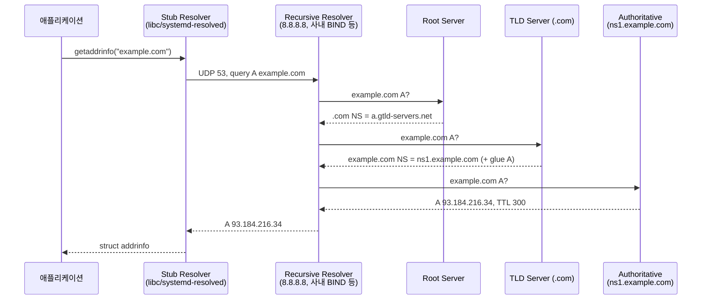

# DNS Lookup (도메인 이름 시스템 조회)

## 개요

`curl https://example.com` 한 줄을 실행하면 TCP 연결이 일어나기 전에 도메인을 IP로 바꾸는 단계가 먼저 끝나야 한다. 이 단계가 DNS Lookup이다. 보통 수 ms 안에 끝나는 작업이라 무시하기 쉽지만, 운영 환경에서는 이 짧은 구간이 5초씩 멈추거나 `getaddrinfo ENOTFOUND` 한 줄로 장애를 만든다. 그래서 이 문서는 "이름이 IP로 바뀐다"는 정의보다, 실제 패킷이 어떤 순서로 어떤 서버를 거치는지, OS의 어떤 함수가 어떤 설정 파일을 읽는지를 중심으로 정리한다.

흔히 머릿속에 있는 그림은 단순하다. "브라우저가 DNS 서버에 물어본다." 실제로는 그 사이에 최소 다섯 단계의 중간자가 끼어 있다. 애플리케이션이 호출한 `getaddrinfo()`는 stub resolver를 깨우고, stub resolver는 `/etc/resolv.conf`에 적힌 recursive resolver(보통 `127.0.0.53`이나 ISP 서버)에 UDP 패킷을 던진다. 그 recursive resolver가 루트 → TLD → authoritative 서버를 차례로 돌며 답을 찾고, 마지막에 stub resolver가 받은 IP를 애플리케이션에 돌려준다. 이 사이 어디 하나가 늦으면 전체 요청이 늦는다.

## Stub Resolver와 Recursive Resolver

DNS를 다루다 보면 "리졸버"라는 단어가 같은 자리에 두 번 나오는데, 둘은 하는 일이 다르다.

- **Stub resolver**: 클라이언트 머신 안에 사는 얇은 라이브러리다. glibc의 `libresolv`, macOS의 `mDNSResponder`, systemd의 `systemd-resolved`가 모두 stub resolver다. 직접 루트 서버를 찾아가지 않는다. `/etc/resolv.conf`에 적힌 IP에 패킷을 한 번 던지고, 받은 답을 그대로 애플리케이션에 넘긴다.
- **Recursive resolver**: ISP나 회사 내부망, 아니면 Cloudflare(`1.1.1.1`)·Google(`8.8.8.8`) 같은 곳에서 운영하는 큰 서버다. stub resolver의 질문을 받아 루트부터 차례로 따라 내려가며 권한 있는(authoritative) 서버까지 도달해 최종 답을 만든다. 캐시도 여기에 쌓인다.

이 구조를 모르면 트러블슈팅이 어긋난다. "DNS가 느리다"는 보고를 받았을 때, stub resolver의 캐시(macOS의 `mDNSResponder`)를 비울지, recursive resolver(사내 BIND, AWS Route 53 Resolver)를 의심할지를 골라야 한다. 둘 사이의 RTT가 1ms도 안 되는 LAN인데 응답이 100ms 이상 나온다면 recursive resolver 쪽 문제고, recursive resolver는 빠른데 애플리케이션 로그만 느리다면 stub resolver 캐시나 `nsswitch.conf`의 다른 소스(예: LDAP, mDNS)를 봐야 한다.



## /etc/resolv.conf — stub resolver의 입력 파일

리눅스에서 stub resolver의 동작을 결정하는 핵심 파일이다. 형식은 단순하지만 옵션 하나가 지연 시간을 좌우한다.

```text
# /etc/resolv.conf
nameserver 127.0.0.53      # 1순위 resolver (보통 systemd-resolved)
nameserver 8.8.8.8         # 1순위 실패 시 fallback
search corp.example.com    # 짧은 이름 보정용 도메인
options timeout:2 attempts:2 rotate single-request-reopen
```

자주 봐야 하는 옵션은 다음과 같다.

- `timeout:N`: 한 번의 질의 대기 시간(초). 기본 5초. 사내 DNS가 죽으면 이 값만큼 매 호출이 멈춘다. 컨테이너에서는 `2` 정도로 줄여두는 편이 안전하다.
- `attempts:N`: nameserver별 재시도 횟수. 기본 2회.
- `single-request`: A와 AAAA를 같은 소켓으로 순차 전송한다. 일부 NAT 장비가 동시 전송된 두 질의를 묶어 응답하지 못하는 버그를 우회하기 위해 자주 쓴다.
- `single-request-reopen`: 같은 의미지만 매번 새 소켓을 연다. 컨테이너 환경에서 `glibc`와 `conntrack`가 충돌해 AAAA 응답이 사라지는 사례에 처방한다.
- `ndots:N`: 점이 N개 미만이면 search 도메인을 먼저 붙여 시도한다. 쿠버네티스가 기본 `ndots:5`를 넣어 외부 도메인 조회마다 search 도메인을 4번 시도해 지연을 만드는 일이 흔하다. 외부 호출이 많은 파드는 `ndots:2`로 낮추는 편이 낫다.

운영 중인 호스트에서 `/etc/resolv.conf`를 직접 편집하는 것은 위험하다. systemd, NetworkManager, cloud-init이 부팅마다 덮어써서 변경이 사라진다. systemd-resolved를 쓰는 머신이라면 `/etc/systemd/resolved.conf`를 편집하고 `systemctl restart systemd-resolved`를 해야 한다.

## getaddrinfo() — 애플리케이션이 실제로 부르는 함수

`gethostbyname()`은 오래된 API라 IPv6도, 스레드 안전성도 보장하지 않는다. 요즘 라이브러리는 거의 전부 POSIX 표준인 `getaddrinfo()`를 호출한다. `curl`, `nginx`, Node.js, Python의 `socket` 모듈, JVM의 `InetAddress.getByName()` 모두 내부적으로 이 함수를 거친다.

`getaddrinfo()`가 하는 일은 단순한 DNS 호출이 아니다. `nsswitch.conf`에 적힌 순서대로 소스를 차례로 뒤진다.

```text
# /etc/nsswitch.conf
hosts: files mdns4_minimal [NOTFOUND=return] dns
```

이 줄은 "먼저 `/etc/hosts`(files)를 보고, 다음에 mDNS, 그래도 없으면 DNS"라는 뜻이다. 그래서 `/etc/hosts`에 등록된 이름은 DNS 트래픽을 만들지 않고 그대로 해석된다. 개발 환경에서 `127.0.0.1 myapp.local`을 박아 두면 사내 DNS와 무관하게 동작하는 이유다.

함수 시그니처와 기본 동작은 다음과 같다.

```c
int getaddrinfo(
    const char *node,            // "example.com"
    const char *service,         // "https" 또는 "443"
    const struct addrinfo *hints,
    struct addrinfo **res        // 결과 연결리스트
);
```

`hints->ai_family`를 `AF_UNSPEC`으로 두면 IPv4(A)와 IPv6(AAAA) 둘 다 조회한다. `AF_INET`만 주면 A 레코드만, `AF_INET6`만 주면 AAAA만 본다. 운영 환경에서 IPv6를 안 쓰는데 응답이 느리다면, 이 hint를 IPv4로 고정해 AAAA 트래픽 자체를 만들지 않는 것이 가장 확실한 처방이다.

또 한 가지 중요한 점은 `getaddrinfo()`가 동기·블로킹 함수라는 것이다. Node.js에서 기본 dns 조회가 libuv 스레드풀(기본 4개)에서 돌아가는 이유도 이것이다. 동시에 5개 이상의 DNS 조회가 발생하면 다섯 번째 요청은 앞 요청이 끝날 때까지 기다린다. 트래픽이 많은 서버에서 외부 API를 많이 부르면 `UV_THREADPOOL_SIZE`를 키우거나 `dns.resolve()`(아래에서 설명)로 우회해야 한다.

## DNS 패킷의 구조와 dig 출력 해석

`dig`는 DNS 메시지를 그대로 보여주는 도구다. 출력은 패킷 자체의 섹션 구성을 따른다.

```text
$ dig example.com

;; ->>HEADER<<- opcode: QUERY, status: NOERROR, id: 12345
;; flags: qr rd ra; QUERY: 1, ANSWER: 1, AUTHORITY: 0, ADDITIONAL: 1

;; OPT PSEUDOSECTION:
; EDNS: version: 0, flags:; udp: 4096

;; QUESTION SECTION:
;example.com.                  IN      A

;; ANSWER SECTION:
example.com.            300    IN      A       93.184.216.34

;; AUTHORITY SECTION:
example.com.            172800 IN      NS      a.iana-servers.net.
example.com.            172800 IN      NS      b.iana-servers.net.

;; ADDITIONAL SECTION:
a.iana-servers.net.     172800 IN      A       199.43.135.53
```

각 섹션이 의미하는 바는 다음과 같다.

- **HEADER의 status**: `NOERROR`면 정상, `NXDOMAIN`은 존재하지 않는 도메인, `SERVFAIL`은 서버가 답을 못 만든 경우(DNSSEC 검증 실패, upstream 장애 등). `REFUSED`는 그 서버가 해당 zone을 안 가지고 있는 경우다.
- **flags**: `qr`은 응답, `rd`는 recursion desired(클라이언트 요청), `ra`는 recursion available(서버 지원), `aa`는 authoritative answer. `aa` 플래그가 있으면 권한 있는 서버에서 직접 받은 응답이라는 뜻이다.
- **QUESTION**: 보낸 질문 그대로. 디버깅 시 0x20 인코딩(아래) 때문에 대소문자가 섞여 있을 수 있다.
- **ANSWER**: 실제 정답. TTL, 클래스(IN), 타입(A/AAAA/CNAME 등), 값. CNAME이 끼어 있으면 CNAME 한 줄과 그 타깃의 A 한 줄이 같이 나온다.
- **AUTHORITY**: 답을 보장하는 zone의 NS 레코드. authoritative 서버가 직접 답하는 경우 자기 zone의 NS를 같이 알려준다.
- **ADDITIONAL**: 보너스 정보. 보통 AUTHORITY에 나온 NS 도메인의 A/AAAA 레코드(glue)나 EDNS0 OPT 레코드가 들어있다.

`dig +short`만 봐서는 잡히지 않는 정보가 많다. SERVFAIL이 떴는데 캐시 때문에 ANSWER가 비어 있는 상황, AUTHORITY에 다른 도메인의 NS가 위임으로 나오는 상황을 구분하려면 위 섹션을 같이 봐야 한다.

## EDNS0와 UDP 512바이트 제한, TCP fallback

원래 RFC 1035가 정의한 DNS 메시지는 UDP에서 512바이트를 넘을 수 없었다. 응답이 그보다 크면 헤더의 TC(truncated) 플래그를 켜서 보내고, 클라이언트는 같은 질의를 TCP 53번으로 다시 보내야 한다. 이걸 TCP fallback이라 한다.

문제는 요즘 DNS 응답이 자주 512바이트를 넘긴다는 것이다. DNSSEC 서명, 여러 개의 A 레코드, IPv6 AAAA가 같이 들어가면 금방 1KB를 넘는다. 그래서 RFC 6891이 정의한 EDNS0 확장이 사실상 표준이 됐다. EDNS0의 OPT 의사 레코드(위 dig 출력의 `OPT PSEUDOSECTION`)에 클라이언트가 받을 수 있는 최대 UDP 크기(보통 4096)를 적어 보내면, 서버는 그 크기까지 UDP로 보낸다.

운영에서 이 동작이 문제가 되는 경우가 있다.

- **방화벽이 53/UDP만 열고 53/TCP를 막은 경우**: DNSSEC zone에 대해 모든 조회가 SERVFAIL이 된다. AWS VPC 보안 그룹, 클라우드 NAT 정책에서 자주 본다.
- **MTU와 IP fragmentation**: EDNS0가 4096을 광고하는데 경로 MTU가 1500이면 응답이 IP 단편화된다. 일부 미들박스는 단편화된 UDP를 드롭한다. 결과는 "어떤 도메인만 가끔 안 풀린다"는 형태로 나타난다. 처방은 EDNS0 버퍼 크기를 1232로 낮추는 것(`dig +bufsize=1232 ...`나 BIND `edns-udp-size 1232;`).

EDNS0의 OPT에는 client subnet(ECS) 같은 옵션도 들어가는데, CDN의 GeoDNS 응답이 사용자 위치에 맞춰 다른 IP를 돌려주게 만드는 메커니즘이 여기에 실린다.

## 0x20 인코딩 — 캐시 포이즈닝 방어 트릭

DNS 질의의 도메인 이름은 대소문자를 구분하지 않는다. `Example.COM`과 `example.com`은 같은 zone을 가리킨다. 이 성질을 역이용하는 것이 0x20(혹은 DNS-0x20) 인코딩이다.

recursive resolver가 upstream에 질의를 보낼 때 도메인의 각 글자 케이스를 무작위로 섞어서 보낸다. 응답이 돌아오면, 응답에 적힌 케이스가 보낸 케이스와 정확히 같은지 확인한다. 공격자가 응답을 위조하려면 케이스 패턴까지 맞춰야 하므로, 16자 도메인이면 추측해야 할 비트가 16비트 더 늘어난다.

```text
$ dig Example.COM

;; QUESTION SECTION:
;Example.COM.                  IN      A

;; ANSWER SECTION:
Example.COM.            300    IN      A       93.184.216.34
```

QUESTION 섹션에 보낸 케이스 그대로 응답이 와야 한다. 일부 오래된 authoritative 서버가 이 트릭을 처리하지 못해 케이스를 정규화해서 응답하는데, BIND 같은 resolver는 그 zone에 대해 0x20을 비활성화하는 옵션을 가진다. 운영 중에 "특정 도메인만 쿼리가 가끔 실패한다"고 할 때 의심할 만한 후보 중 하나다.

## glue record — 닭과 달걀 문제

`ns1.example.com`이 `example.com`의 NS라고 위임받았다고 하자. recursive resolver가 `ns1.example.com`의 IP를 알아야 그쪽에 질의할 수 있는데, 그 IP를 알려면 `example.com`의 권한 서버에 물어야 한다. 이게 닭과 달걀이다.

해결책은 부모 zone(.com)이 위임 정보를 줄 때 NS 도메인의 A/AAAA를 같이 끼워주는 것이다. 이걸 glue record라 한다. 위 dig 출력의 ADDITIONAL 섹션에 NS 도메인의 A 레코드가 같이 나오는 게 그 결과다.

도메인을 등록할 때 자기 도메인 안에 있는 NS(예: `ns1.example.com`)를 쓰려면 등록기관(registrar)에 glue record를 등록해야 한다. 안 그러면 위임 자체가 풀리지 않는다. 외부 NS(예: AWS Route 53의 `ns-123.awsdns-12.com`)를 쓰면 부모 zone(`.com`)이 이미 그 NS의 glue를 가지고 있으므로 신경 쓸 게 없다. "도메인 이전했더니 가끔 NXDOMAIN이 나온다" 같은 사례의 절반은 glue record가 누락된 경우다.

## happy eyeballs — IPv4/IPv6 경합

호스트가 IPv6 주소를 가지고 있는데 인터넷 경로에 IPv6가 안 닿는 환경이 있다. 이런 곳에서 `AF_UNSPEC`으로 조회하면 AAAA가 먼저 돌아오고, 클라이언트가 IPv6로 TCP를 시도하다가 30초 가까이 멈춘다. 이걸 막으려고 RFC 8305(happy eyeballs v2)가 정의됐다.

핵심은 두 가지다.

1. A와 AAAA를 동시에 질의하고, AAAA가 먼저 와도 A를 50ms 정도 더 기다린다(반대도 마찬가지).
2. 두 family로 동시에 TCP `connect()`를 시도하되 IPv6를 약간 우대한다. 먼저 SYN-ACK이 오는 쪽을 쓰고, 진 쪽은 RST.

`curl`은 `--happy-eyeballs-timeout-ms` 옵션으로 이 값을 만진다. Node.js는 18부터 `autoSelectFamily`(기본 false였다가 19에서 true로) 옵션을 지원한다. happy eyeballs가 켜져 있어도 DNS 단계의 AAAA 지연은 별개 문제로 남는다.

## 5초 지연 — 가장 자주 만나는 DNS 트러블슈팅

쿠버네티스나 도커 환경에서 "외부 API 호출이 정확히 5초씩 늦어진다"는 보고는 거의 정형화된 증상이다. 원인은 글래스도 패치도 아닌, glibc의 `getaddrinfo()` 동작이다.

흐름은 이렇다.

1. glibc는 `AF_UNSPEC`로 호출되면 A와 AAAA 질의를 같은 소켓으로 거의 동시에 보낸다.
2. Linux 커널의 `conntrack`이 두 질의를 같은 5-tuple로 보고 두 응답 중 하나를 NAT 처리하다 race를 만든다(커널 버그 이력이 있다).
3. AAAA 응답이 사라진다. glibc는 timeout(기본 5초)까지 기다린 뒤 재시도, 그래도 안 오면 A 결과만으로 진행한다.
4. 결과적으로 매 호출 5초 지연.

처방은 `/etc/resolv.conf`에 `options single-request-reopen` 또는 `single-request`를 추가하는 것이다. 쿠버네티스라면 파드의 `dnsConfig.options`에 넣으면 된다.

```yaml
# Pod spec
dnsConfig:
  options:
    - name: ndots
      value: "2"
    - name: single-request-reopen
    - name: timeout
      value: "2"
    - name: attempts
      value: "2"
```

`getaddrinfo ENOTFOUND example.com`도 흔하다. 이건 stub resolver가 NXDOMAIN을 받았거나, 모든 nameserver에 접근 못 한 경우다. 컨테이너 안에서 `cat /etc/resolv.conf`로 nameserver를 확인하고, `dig @<nameserver> example.com`을 직접 시도해보면 어디서 끊긴 건지 바로 보인다. 쿠버네티스라면 CoreDNS 파드가 죽었거나, NetworkPolicy가 53번을 막은 경우가 대부분이다.

## Node.js — dns.lookup vs dns.resolve

Node.js의 dns 모듈은 두 가지 다른 메커니즘을 노출한다. 둘은 결과가 같아 보여도 동작이 완전히 다르다.

```javascript
const dns = require('node:dns');

// 1) getaddrinfo() 호출 — libuv 스레드풀에서 동기 처리
dns.lookup('example.com', { family: 0, all: true }, (err, addrs) => {
  console.log(addrs);
  // [{ address: '93.184.216.34', family: 4 }, { address: '2606:2800:...', family: 6 }]
});

// 2) UDP로 직접 DNS 패킷을 만들어 보냄 — c-ares 라이브러리
dns.resolve4('example.com', (err, addrs) => {
  console.log(addrs); // ['93.184.216.34']
});

// resolver 직접 지정 (c-ares만 가능)
const resolver = new dns.Resolver();
resolver.setServers(['1.1.1.1', '8.8.8.8']);
resolver.resolve4('example.com', console.log);
```

`dns.lookup()`은 OS의 stub resolver를 쓰므로 `/etc/hosts`, `/etc/nsswitch.conf`, mDNS를 모두 따른다. 대신 libuv 스레드풀(기본 4)에서 블로킹 호출을 돌리므로 동시성이 제한된다. `dns.resolve*()` 계열은 c-ares가 직접 UDP 패킷을 보내므로 비동기·고동시성이지만 `/etc/hosts`를 무시한다. 외부에 트래픽 많은 서비스라면 `dns.resolve()` 쪽이 유리하고, 사내 도메인을 `/etc/hosts`로 처리하는 환경이라면 `dns.lookup()`을 써야 한다.

`http.Agent`의 `lookup` 옵션으로 함수 자체를 갈아끼울 수 있어서, 캐싱 라이브러리(`cacheable-lookup`)를 끼워 외부 API 호출의 DNS 비용을 없애는 패턴이 흔하다.

## Python — socket과 dnspython

Python 표준 라이브러리의 `socket.gethostbyname()`은 내부적으로 `gethostbyname_r()`을 부르므로 IPv6를 처리하지 못하고 단일 결과만 돌려준다. 운영 코드에서는 `socket.getaddrinfo()`를 직접 쓰는 게 맞다.

```python
import socket

# IPv4만, TCP용
results = socket.getaddrinfo(
    "example.com", 443,
    family=socket.AF_INET,
    type=socket.SOCK_STREAM,
)
for family, socktype, proto, canonname, sockaddr in results:
    print(sockaddr)  # ('93.184.216.34', 443)
```

OS resolver를 우회하고 직접 DNS 패킷을 다루고 싶을 때는 `dnspython`을 쓴다. dig 출력과 거의 1:1로 대응되는 API를 가진다.

```python
import dns.resolver
import dns.message
import dns.query

# 고수준 API — 캐시·검색도메인 처리 포함
resolver = dns.resolver.Resolver(configure=False)
resolver.nameservers = ["1.1.1.1"]
resolver.lifetime = 2.0  # 전체 타임아웃
answer = resolver.resolve("example.com", "A")
for rdata in answer:
    print(rdata.address, "TTL", answer.rrset.ttl)

# 저수준 — 패킷 직접 조립
query = dns.message.make_query("example.com", "A", use_edns=0, payload=1232)
response = dns.query.udp(query, "1.1.1.1", timeout=2.0)
print(response.flags, response.answer)
```

DNS 디버깅 자동화나 모니터링 봇을 만들 때는 `dnspython`이 거의 필수다. `dig`을 subprocess로 부르는 것보다 결과 파싱이 안정적이다.

## 캐시와 TTL — 어디서 얼마나 머무르는가

DNS 응답은 여러 층에서 캐시된다. 운영에서 신경 써야 할 건 "내가 레코드를 바꿨는데 왜 안 바뀌었나"라는 질문이고, 답은 어디 캐시가 아직 살아있느냐다.

| 캐시 위치 | 수명 결정 요소 | 비우는 방법 |
|---|---|---|
| 브라우저 | 자체 정책 (Chrome 60초 등) | 브라우저 재시작, `chrome://net-internals/#dns` |
| stub resolver (OS) | TTL 또는 자체 정책 | macOS: `dscacheutil -flushcache`, Linux: `resolvectl flush-caches` |
| recursive resolver | 응답의 TTL | 직접 통제 불가 (서비스 운영자에 요청) |
| authoritative | zone 파일의 TTL | 자기 zone이면 TTL 줄이고 기다림 |

레코드를 바꿀 예정이라면 며칠 전에 TTL을 60초 정도로 줄여두는 것이 정석이다. 그래야 변경 시점에 전 세계 recursive resolver의 캐시가 빠르게 만료된다. 변경 후에는 다시 TTL을 길게 돌려놓는다. 한 번 풀린 캐시는 또 풀어낼 수 없다.

음수 캐시(negative caching)도 있다. NXDOMAIN 응답도 SOA의 minimum TTL만큼 캐시된다. zone 안에 없는 서브도메인을 잠깐 잘못 조회하면, 그 "없음"이 한 시간씩 캐시되는 경우가 생긴다. 새 서브도메인을 추가했는데 안 풀린다는 보고는 이쪽을 의심한다.

## 디버깅 명령어 정리

```bash
# 패킷 흐름 전체 추적 — 루트부터 따라가며 각 단계 응답을 보여준다
$ dig +trace example.com

# 특정 resolver에 직접 질의
$ dig @1.1.1.1 example.com A

# EDNS0 버퍼 크기 조정
$ dig +bufsize=1232 example.com

# TCP로 강제 (UDP 차단 의심 시)
$ dig +tcp example.com

# 0x20 인코딩 효과 확인
$ dig Example.COM

# stub resolver 우회 안 하고 OS 경로로 — 컨테이너 안에서 유용
$ getent hosts example.com

# /etc/resolv.conf, /etc/nsswitch.conf 가 어떻게 적용되는지 확인
$ resolvectl status        # systemd-resolved
$ scutil --dns             # macOS

# DNS 응답시간만 뽑기
$ for r in 1.1.1.1 8.8.8.8 9.9.9.9; do
    printf "%s: " "$r"
    dig @"$r" example.com +noall +stats | awk '/Query time/'
  done
```

`dig +trace`는 캐시를 거치지 않고 직접 루트부터 돌아 각 단계의 응답을 그대로 보여주므로, "위임이 어디서 끊겼나"를 찾을 때 가장 먼저 쓴다. 출력의 마지막 응답이 권한 서버에서 오지 않는다면 그 위 단계 위임이 깨진 것이다.

---

## 참조

- RFC 1034 / 1035: Domain Names — Concepts / Implementation
- RFC 3596: DNS Extensions to Support IP Version 6
- RFC 6891: Extension Mechanisms for DNS (EDNS(0))
- RFC 7766: DNS Transport over TCP — Implementation Requirements
- RFC 8305: Happy Eyeballs Version 2
- draft-vixie-dnsext-dns0x20-00: Use of Bit 0x20 in DNS Labels
- glibc resolver(3) / nsswitch.conf(5) man page
- Node.js dns 모듈 공식 문서
- dnspython documentation
