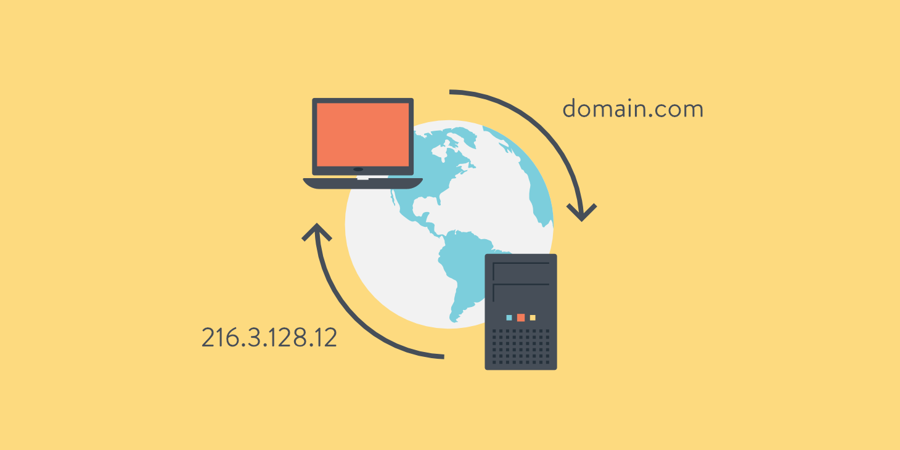

# DNS (Domain Name System)

## DNS의 기본 개념
- DNS는 인터넷의 전화번호부와 같은 역할을 하는 분산형 데이터베이스 시스템입니다.
- 사람이 이해하기 쉬운 도메인 이름(예: google.com)을 컴퓨터가 이해할 수 있는 IP 주소(예: 172.217.31.46)로 변환하는 역할을 합니다.
- 1983년 Paul Mockapetris가 개발한 이래로 인터넷의 핵심 인프라로 작동해왔습니다.

## DNS의 작동 원리
1. 사용자가 브라우저에 도메인 이름을 입력합니다 (예: www.example.com)
2. 브라우저는 먼저 로컬 DNS 캐시를 확인합니다
3. 캐시에 없으면, 운영체제에 설정된 DNS 서버(보통 ISP의 DNS 서버)에 쿼리를 보냅니다
4. DNS 서버는 다음과 같은 순서로 IP 주소를 찾습니다:
   - Root DNS 서버 (.com, .org 등의 최상위 도메인 정보)
   - TLD (Top Level Domain) 서버
   - Authoritative DNS 서버 (실제 도메인 정보를 관리하는 서버)
5. 찾은 IP 주소를 클라이언트에게 반환합니다
6. 클라이언트는 해당 IP 주소로 웹 서버에 접속합니다

<div align="center">
    
</div>

## DNS 레코드 타입

### A 레코드 (Address Record)
- 도메인 이름을 IPv4 주소로 매핑하는 가장 기본적인 레코드 타입입니다.
- 예시:
  ```
  example.com.    IN    A    93.184.216.34
  ```
- 장점:
  - 직접적인 IP 주소 매핑으로 빠른 응답이 가능합니다
  - DNS 쿼리 횟수가 적어 성능이 좋습니다
- 단점:
  - IP 주소가 변경될 때마다 DNS 레코드를 수정해야 합니다
  - 서버 이전이나 IP 변경이 빈번한 환경에서는 관리가 어려울 수 있습니다

### CNAME (Canonical Name)
- 도메인 이름을 다른 도메인 이름으로 매핑하는 레코드 타입입니다.
- 예시:
  ```
  www.example.com.    IN    CNAME    example.com.
  ```
- 장점:
  - IP 주소 변경 시 원본 도메인만 수정하면 됩니다
  - 여러 서브도메인이 하나의 IP를 가리킬 때 유용합니다
  - CDN이나 클라우드 서비스 연동 시 유연하게 대응 가능합니다
- 단점:
  - 최종 IP 주소를 얻기 위해 추가 DNS 쿼리가 필요합니다
  - 성능이 A 레코드보다 약간 느릴 수 있습니다

### 추가적인 DNS 레코드 타입
1. AAAA 레코드
   - IPv6 주소를 매핑하는 레코드
   - 예: `example.com. IN AAAA 2606:2800:220:1:248:1893:25c8:1946`

2. MX 레코드 (Mail Exchange)
   - 이메일 서버의 주소를 지정
   - 예: `example.com. IN MX 10 mail.example.com.`

3. NS 레코드 (Name Server)
   - 도메인의 DNS 서버를 지정
   - 예: `example.com. IN NS ns1.example.com.`

4. TXT 레코드
   - 도메인에 대한 텍스트 정보를 저장
   - 주로 SPF, DKIM 등의 이메일 인증에 사용

## DNS 캐싱
- DNS 쿼리 결과를 일정 시간 동안 저장하여 성능을 향상
- TTL(Time To Live) 값으로 캐시 유지 시간을 설정
- 로컬 캐시, ISP 캐시, DNS 서버 캐시 등 여러 계층에서 이루어짐

## DNS 보안
1. DNSSEC (DNS Security Extensions)
   - DNS 응답의 무결성과 인증을 보장
   - 위조된 DNS 응답을 방지

2. DNS over HTTPS (DoH)
   - DNS 쿼리를 HTTPS로 암호화
   - 프라이버시와 보안 강화

3. DNS over TLS (DoT)
   - DNS 쿼리를 TLS로 암호화
   - 중간자 공격 방지

## 실제 사용 사례
1. 웹 서비스
   - 도메인 이름으로 웹사이트 접속
   - CDN 서비스 연동

2. 이메일 서비스
   - MX 레코드를 통한 메일 서버 설정
   - SPF, DKIM 설정

3. 클라우드 서비스
   - AWS, Azure 등의 서비스 연동
   - 로드 밸런싱 설정

## 결론
1. DNS는 인터넷의 핵심 인프라로, 도메인 이름과 IP 주소를 매핑하는 중요한 서비스입니다.
2. 다양한 DNS 레코드 타입을 상황에 맞게 적절히 사용해야 합니다.
3. 성능과 보안을 고려한 DNS 설정이 필요합니다.
4. DNS 캐싱과 보안 메커니즘을 이해하고 활용해야 합니다.
