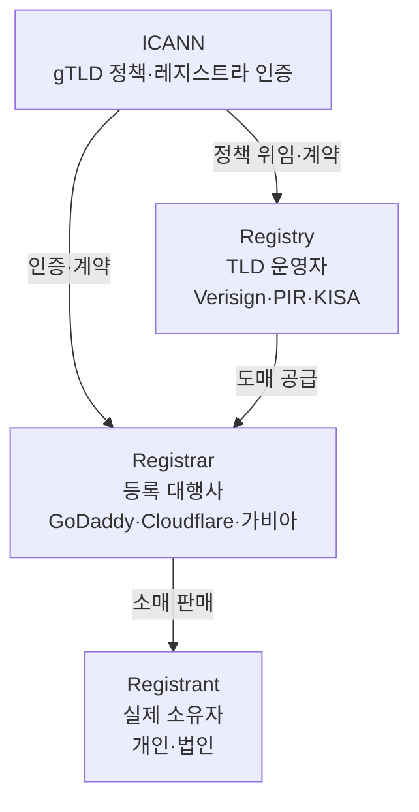
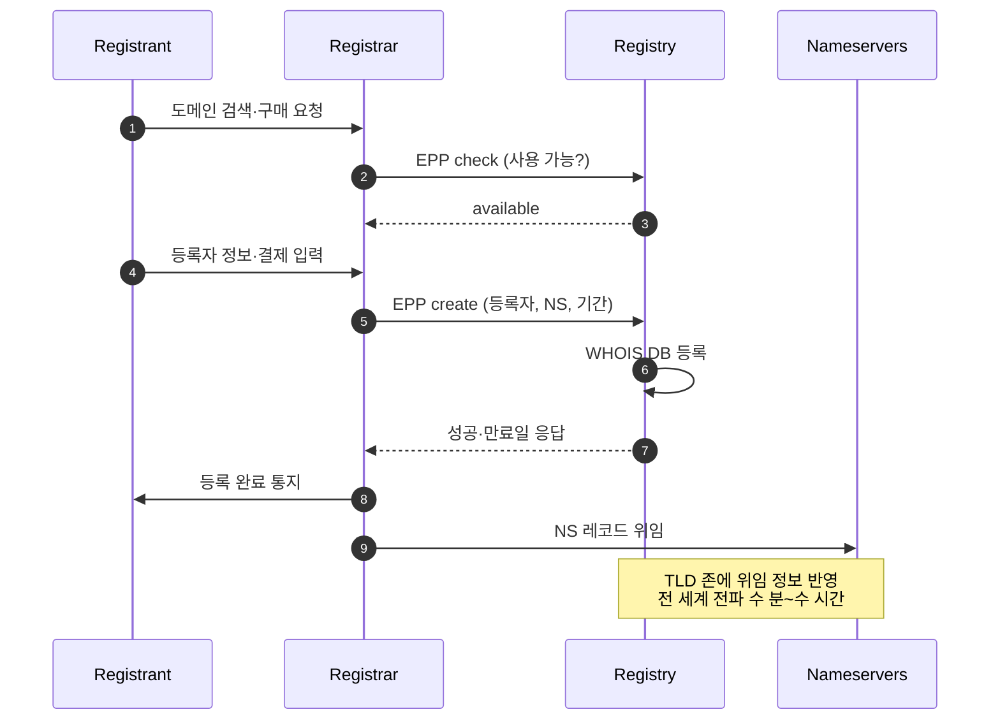
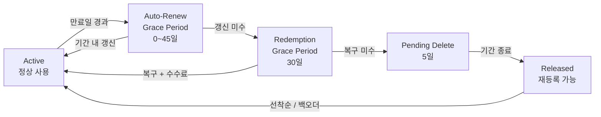
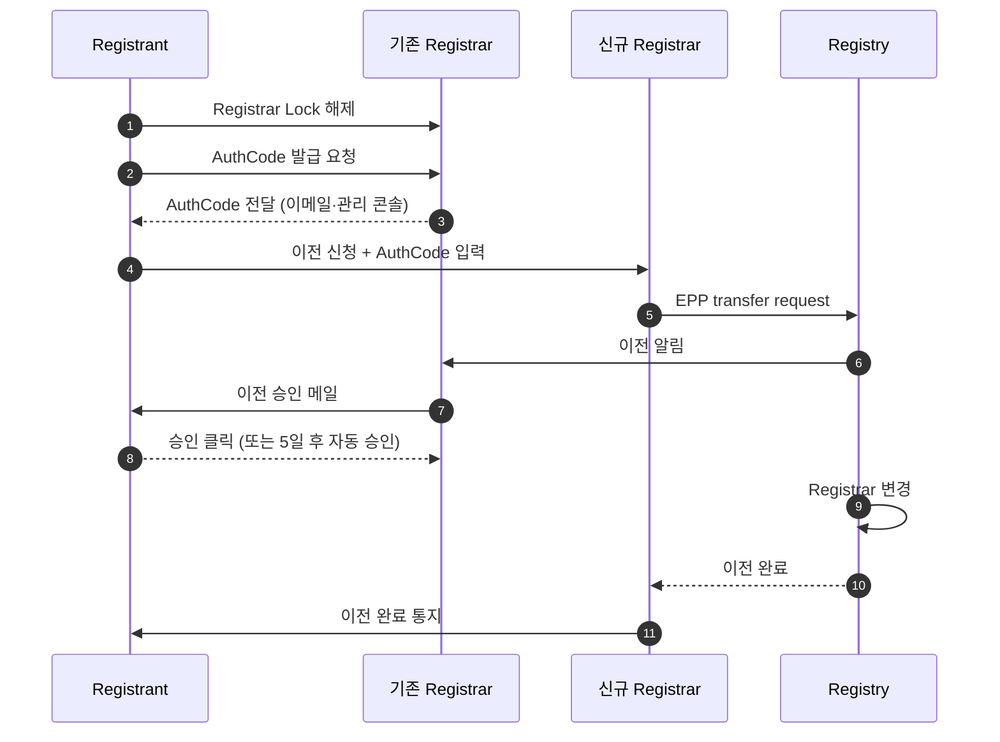

# 도메인 등록과 라이프사이클

## 개요

도메인은 한 번 사두면 끝나는 자산이 아니다. 매년 갱신해야 하고, 만료되면 단계별로 회수 절차를 밟다가 결국 다른 사람에게 넘어간다. 회사 규모가 커지면 보유 도메인이 수백 개로 늘어나고, 갱신 일정과 결제 카드, DNS 위임 상태, 잠금 설정을 따로 관리해야 한다. DNS 조회 동작이나 서브도메인 설계와는 결이 다른 영역이다. 여기서는 도메인을 자산으로 다루는 관점에서 등록부터 만료, 이전, 인수까지 한 사이클을 정리한다.

도메인 운영에서 사고가 나는 패턴은 거의 정해져 있다. 결제 카드가 만료됐는데 알림 메일이 스팸으로 분류돼 못 봤거나, 이전 작업 중 인증 코드가 만료돼 다시 받아야 하거나, 만료 도메인을 사놓고 보니 스팸 블랙리스트에 올라가 있어 메일이 다 차단된다. 이런 일은 등록 시점에 처리 방식을 정해 두지 않으면 사람이 바뀔 때마다 반복된다.

## Registry, Registrar, Registrant 3계층

도메인 산업은 세 주체로 나뉜다. 헷갈리기 쉬워서 자주 거꾸로 쓰이는데, 책임 범위가 다르므로 정확히 알아둬야 한다.

### Registry (레지스트리)

TLD 단위로 권한을 가진 운영자다. `.com`은 Verisign, `.org`는 PIR, `.kr`은 KISA, `.io`는 Identity Digital이 운영한다. 레지스트리는 해당 TLD의 모든 도메인 데이터베이스를 관리하고 권한 있는 네임서버를 운영한다. 일반 사용자가 레지스트리와 직접 거래하지는 않는다. 레지스트리가 정한 도매 가격이 도메인 원가의 하한선이다.

### Registrar (레지스트라)

ICANN(또는 각국 기관)에서 인증받은 도매-소매 중간 업체다. GoDaddy, Namecheap, Cloudflare Registrar, AWS Route 53, 가비아 같은 곳이 여기 해당한다. 사용자가 도메인을 등록할 때 직접 거래하는 상대방이다. 레지스트라마다 가격, UI, API, 부가 서비스(DNS 호스팅, Privacy, 자동 갱신 정책)가 다르다.

같은 도메인이라도 레지스트라를 바꿀 수 있다. 이게 도메인 이전(Transfer)이다.

### Registrant (등록자)

도메인을 실제로 소유한 개인 또는 법인이다. WHOIS에 등록자 정보가 기록된다. 회사 도메인을 직원 개인 명의로 등록해 두면 퇴사 후 분쟁이 자주 일어난다. 회사 도메인은 반드시 법인 명의로 등록하고, 관리자 이메일도 개인 메일이 아니라 도메인 운영팀 공용 메일을 써야 한다.

### ICANN의 역할

ICANN은 비영리 조직으로 gTLD 정책을 정하고 레지스트라를 인증한다. 이전 정책(60일 잠금, AuthCode 처리), 등록자 보호 정책(WHOIS 정확성 검증), 분쟁 해결 절차(UDRP) 같은 룰이 모두 ICANN 산하에서 결정된다. ccTLD는 ICANN 산하가 아니라 각국 NIC가 자체 정책을 운영한다. `.kr`은 KISA, `.jp`는 JPRS다. 그래서 ccTLD는 이전 정책이나 분쟁 해결이 gTLD와 미묘하게 다르다.



## TLD 종류와 선택 기준

### gTLD

`.com`, `.net`, `.org`, `.info`, `.biz` 같은 일반 TLD다. 누구나 등록할 수 있고 ICANN 정책이 그대로 적용된다. `.com`이 가장 비싸고 가장 안정적이다. 회사 메인 도메인은 거의 예외 없이 `.com`을 권한다. 실무에서 `.net`이나 `.org`를 메인으로 쓰면 사용자가 자꾸 `.com`으로 잘못 입력한다.

### ccTLD

`.kr`, `.jp`, `.uk`, `.de` 같은 국가 TLD다. 각국 NIC가 운영하므로 등록 자격, 가격, 이전 정책, 분쟁 절차가 다 다르다. `.kr`은 한국에 주소가 있어야 등록 가능하고, `.de`는 독일 내 행정 연락처(admin-c)가 필수다. 한국 서비스라도 글로벌 진출을 고려한다면 `.kr`보다 `.com`이 우선이다. SEO나 국가 지역 타겟팅을 명확히 하려는 경우만 ccTLD를 메인으로 쓴다.

`.io`, `.ai`, `.tv`처럼 ccTLD인데 실질적으로 gTLD처럼 쓰이는 경우가 있다. 스타트업이 `.io`를 많이 쓰는데, `.io`는 영국령 인도양 지역(BIOT)의 ccTLD다. 영토 분쟁 때문에 향후 도메인이 사라질 가능성이 거론된 적도 있어서 핵심 자산을 `.io`에만 의존하는 건 리스크가 있다.

### nTLD (new gTLD)

2012년 이후 ICANN이 추가로 풀어준 신규 TLD다. `.app`, `.dev`, `.tech`, `.shop`, `.cloud` 같은 것들이다. 가격이 들쭉날쭉하고, 첫해 프로모션 가격과 갱신 가격 차이가 5~10배 나는 경우가 흔하다. 등록할 때 갱신 가격까지 반드시 확인해야 한다. `.dev`나 `.app`은 HSTS preload가 강제돼 HTTPS 없이는 접속이 안 된다. 사이드 프로젝트나 내부 도구용으로는 괜찮은데 일반 사용자 대상 서비스는 `.com`이 무난하다.

### 선택 기준

메인 도메인은 `.com`을 우선 확보한다. 이미 누가 가지고 있다면 사용 가능한 변형(짧은 이름, 하이픈 없는 형태)이 있는지 본다. ccTLD는 국가 타겟팅이 명확할 때만 메인으로 쓴다. 브랜드 보호 차원에서 주요 변형 도메인(`.net`, `.co`, 국내 ccTLD, 오타 변형)을 같이 등록하고 메인으로 301 리다이렉트한다.

## WHOIS와 RDAP

### WHOIS

도메인 등록자 정보, 등록일, 만료일, 네임서버 정보를 조회하는 프로토콜이다. 1980년대에 만들어진 텍스트 기반 프로토콜로, TCP 43번 포트를 쓴다. 응답 포맷이 레지스트리마다 제각각이라 파싱이 까다롭다.

```bash
# .com 도메인 조회
whois example.com

# .kr 도메인 조회 (한국어 응답)
whois -h whois.kr example.kr
```

WHOIS의 가장 큰 문제는 개인정보 노출이다. 등록자 이름, 주소, 전화번호, 이메일이 그대로 공개된다. 그래서 GDPR 시행 후 유럽 등록자 정보는 마스킹되고, 미국·아시아 등록자도 대부분 Privacy/Proxy 서비스로 가린다.

### RDAP

WHOIS의 후속 프로토콜이다. JSON 응답에 HTTPS 기반이라 파싱과 인증이 깔끔하다. ICANN이 2019년부터 신규 gTLD에 RDAP 의무화를 했고, 점진적으로 WHOIS를 대체하는 중이다. 자동화 스크립트라면 WHOIS보다 RDAP를 쓰는 게 낫다.

```bash
# RDAP 조회 (HTTP)
curl -s https://rdap.verisign.com/com/v1/domain/example.com | jq

# .org RDAP
curl -s https://rdap.publicinterestregistry.org/rdap/domain/example.org | jq
```

응답에서 `events` 배열의 `registration`, `expiration`, `transfer` 시점, `entities` 배열의 등록자·관리자 정보, `nameservers`, `secureDNS`(DNSSEC 활성 여부)를 확인할 수 있다.

### Privacy/Proxy 서비스

레지스트라가 제공하는 개인정보 마스킹 서비스다. WHOIS에 등록자 본명·주소·전화·이메일 대신 레지스트라가 제공한 대리 정보가 노출된다. Cloudflare Registrar는 기본 무료, GoDaddy는 유료 부가 서비스로 운영한다.

Privacy를 켜면 스팸과 도메인 사기 메일이 확연히 줄어든다. 도메인 만료 시점에 가짜 갱신 청구서를 보내는 사기가 많은데, 등록자 메일이 노출되면 이런 메일이 매주 온다. Privacy를 켜면 모든 연락이 레지스트라를 거쳐 등록자에게 전달된다.

다만 Privacy는 도메인 이전이나 분쟁 처리 시 일시적으로 풀어야 할 때가 있다. 이전 코드를 받기 위해 등록자 메일로 인증을 거치는데, Privacy 메일 주소가 외부 메일을 막거나 지연시키면 인증이 안 된다. 이전 작업 시작 전에 Privacy를 잠시 끄고 끝나면 다시 켠다.

## 등록 절차와 결제

### 등록 흐름



EPP(Extensible Provisioning Protocol)는 레지스트라와 레지스트리 간 통신 프로토콜이다. 도메인 생성·갱신·이전·삭제, 호스트 등록, 연락처 관리가 EPP 명령으로 처리된다. 사용자가 직접 EPP를 쓸 일은 없지만, 도메인 이전 시 받는 AuthCode는 EPP 인증 코드다.

### 결제 단위

도메인은 연 단위 결제다. 최소 1년, 최대 10년까지 한 번에 등록할 수 있다. gTLD는 대부분 10년이 상한이고, ccTLD는 다르다. `.kr`은 9년이 상한이고 `.de`는 1년 단위다.

장기 등록 시 가격 할인은 거의 없지만, 갱신을 잊을 위험이 줄어든다. 도메인이 회사 핵심 자산이라면 처음 등록 시 5년 또는 10년을 한꺼번에 결제해 두는 편이 안전하다. 카드 만료나 결제 실패로 인한 사고가 일어나지 않는다.

### SLD 길이 제한

서브도메인을 제외한 도메인 본체는 보통 63자까지다. ASCII 영숫자와 하이픈만 허용된다. 한글·일본어 같은 IDN 도메인은 Punycode로 변환돼 등록된다. `한글.kr`이 실제로는 `xn--bj0bj06e.kr`로 저장된다. IDN 도메인은 브라우저 표시 정책 때문에 피싱 위험이 있어 메인 도메인으로는 잘 안 쓴다.

## 자동 갱신과 그 함정

자동 갱신은 만료 며칠 전에 등록된 카드로 자동 결제하는 기능이다. 레지스트라마다 갱신 시도 시점이 다르다. Cloudflare Registrar는 만료 30일 전, Namecheap은 7일 전부터 시도한다.

자동 갱신을 켰다고 안심하면 사고가 난다. 실무에서 가장 많이 보는 함정 몇 가지다.

### 결제 카드 만료

법인 카드는 보통 3~5년에 한 번 갱신된다. 도메인 등록 후 카드 갱신 시점에 맞춰 레지스트라 결제 정보를 업데이트하지 않으면 자동 갱신이 실패한다. 카드사가 연속 번호로 갱신해 주는 경우도 있지만 보장되지 않는다.

여러 도메인을 같은 카드에 묶어두면 카드 한 장 만료로 한꺼번에 갱신 실패한다. 회사 도메인 관리 시 카드별로 분산하거나, 정기 결제 가능한 가상 카드를 따로 발급해 도메인 전용으로 쓴다.

### 알림 메일 누락

레지스트라는 만료 60일 전부터 갱신 알림을 등록자 이메일로 보낸다. 회사 메일 시스템이 외부 메일을 자동 분류하면서 스팸함으로 들어가는 경우가 많다. 등록자 메일을 개인이 아니라 `domains@회사.com` 같은 분배 그룹으로 설정하고, 해당 메일을 도메인 운영팀 채널로 자동 포워딩해야 한다.

레지스트라 자체 통보 외에 별도 모니터링이 필요하다. 만료일을 캘린더에 등록하거나, RDAP를 주기적으로 조회해 만료 30일 전·7일 전·1일 전 알림을 띄우는 스크립트를 둔다.

```python
# RDAP로 만료일 조회 후 30일 이내면 경고
import requests
from datetime import datetime, timezone

def check_expiry(domain: str, tld: str = "com") -> int:
    url = f"https://rdap.verisign.com/{tld}/v1/domain/{domain}"
    r = requests.get(url, timeout=5)
    r.raise_for_status()
    for event in r.json().get("events", []):
        if event["eventAction"] == "expiration":
            exp = datetime.fromisoformat(event["eventDate"].replace("Z", "+00:00"))
            days = (exp - datetime.now(timezone.utc)).days
            return days
    raise ValueError("expiration event not found")

days = check_expiry("example", "com")
if days < 30:
    print(f"WARN: example.com expires in {days} days")
```

### 갱신 가격 변경

특히 nTLD는 첫해 프로모션 가격이 갱신 시 정상가로 돌아온다. `.shop` 같은 도메인은 첫해 1달러로 사놓고 갱신 시 30달러를 내야 한다. 자동 갱신을 켰다가 갑자기 큰 청구서가 나오는 일이 흔하다. 등록 시 갱신 가격을 확인하고, 비싼 nTLD라면 갱신 시점에 다른 레지스트라로 이전하면서 갱신하는 식으로 비용을 관리한다.

### 레지스트라 자체 장애

레지스트라가 결제 시스템 오류로 갱신을 시도하지 못할 때가 있다. 이 경우 만료 후 Auto-Renew Grace Period로 들어가지만, 알림이 늦으면 그 사실조차 모를 수 있다. 메인 도메인은 만료 60일 전에 수동으로 갱신해 버리는 게 안전하다.

## 만료 후 라이프사이클

도메인이 만료되면 즉시 사라지지 않는다. ICANN이 정한 단계를 거쳐 회수된다. 단계마다 도메인 상태와 복구 비용이 다르다.



### Auto-Renew Grace Period (AGP)

만료일 직후의 유예 기간이다. ICANN gTLD 기준 0~45일이고 레지스트라마다 다르게 설정한다. 이 기간에는 정상 갱신 가격으로 도메인을 살릴 수 있고, DNS도 그대로 동작하는 경우가 많다. 다만 레지스트라가 만료된 도메인을 광고 페이지나 주차(parking) 페이지로 돌려놓는 경우가 흔하다. 이때 사이트가 갑자기 광고로 바뀌어 사용자가 알아챈다.

AGP 동안 갱신하면 비용은 정상 갱신가다. 추가 수수료가 없다.

### Redemption Grace Period (RGP)

AGP가 지나도 갱신하지 않으면 RGP로 넘어간다. ICANN gTLD 기준 30일이다. 이 기간에는 도메인이 비활성화되고 DNS 위임이 풀린다. 사이트가 완전히 끊긴다.

RGP에서는 복구(Redemption)가 가능하지만 복구 수수료(Restore Fee)가 추가된다. 레지스트라마다 다른데 보통 80~200달러다. 정상 갱신가에 복구 수수료까지 내야 한다. 사고 처리 비용이 갑자기 커진다.

이 단계에서는 도메인 정보 변경이 막힌다. 네임서버 변경, 등록자 정보 변경, 이전이 다 안 된다. 일단 복구해서 정상 상태로 돌려놓고 다음 작업을 해야 한다.

### Pending Delete

RGP까지 지나면 Pending Delete로 들어간다. 5일간 유지되며 이 단계에서는 어떤 복구도 불가능하다. 5일 후 도메인이 풀려서 재등록 가능 상태가 된다.

### Released (Drop)

Pending Delete가 끝나는 시점에 도메인이 풀린다. Drop이라고 부른다. 인기 도메인은 풀리는 순간 자동화된 시스템들이 0.001초 단위로 등록을 시도한다. 이걸 사람이 수동으로 잡는 건 거의 불가능하고, 백오더(Backorder) 서비스를 통해야 한다.

### ccTLD의 차이

위 단계는 gTLD 기준이다. ccTLD는 자체 정책을 따르므로 기간과 비용이 다르다. `.kr`은 만료 후 30일 유예 기간이 있고, 그 후 즉시 풀린다. RGP가 따로 없는 셈이다. `.de`는 만료 후 즉시 잠기고 별도 처리가 필요하다. ccTLD를 운영한다면 해당 NIC 정책을 별도로 확인해 둔다.

## 도메인 이전 (Transfer)

레지스트라를 바꾸는 작업이다. 등록자는 그대로 두고 관리 업체만 옮기는 것이다. 가격, UI, API, 부가 서비스 차이로 옮기는 경우가 많다. 한국 레지스트라에서 Cloudflare Registrar로 옮겨 비용을 줄이는 사례가 흔하다.

### 이전 절차



전 과정은 보통 5~7일 걸린다. 이전 시 1년이 자동 추가되므로 만료일이 1년 연장된다.

### AuthCode (EPP Code, Transfer Code)

이전을 위한 인증 코드다. 도메인별로 발급되며 기존 레지스트라가 생성한다. 8~32자 무작위 문자열이다. 한 번 발급받으면 보통 14일 정도 유효하고, 그 안에 신규 레지스트라에 입력해야 한다. 만료되면 기존 레지스트라에서 다시 발급받아야 한다.

AuthCode는 등록자 이메일로 발송되거나 관리 콘솔에서 직접 확인한다. 메일로 받았는데 등록자 메일이 Privacy로 가려져 있으면 메일이 안 도착할 수 있다. 이전 시작 전 Privacy를 끄거나, 관리 콘솔에서 직접 확인 가능한 레지스트라인지 미리 본다.

### 60일 잠금

도메인 등록 후 60일, 그리고 이전 후 60일 동안은 다시 이전할 수 없다. ICANN 정책이다. 새로 등록한 도메인을 즉시 다른 레지스트라로 옮기려고 해도 거부된다. 등록자 정보를 크게 변경한 경우에도 60일 잠금이 걸리는 경우가 있다(레지스트라 옵션에 따라 다름).

회사가 인수합병으로 도메인을 받는 상황에서 이 60일 잠금에 걸리는 경우가 많다. 인수 직후 도메인 통합을 하려고 보면 이전이 막혀 있다. 이 경우 잠금이 풀릴 때까지 기다리거나, 푸시(Push) 기능을 쓴다. 같은 레지스트라 내에서는 계정 간 푸시로 즉시 이전이 된다(예: GoDaddy 계정 A에서 계정 B로). 다만 푸시 자체가 ICANN 이전이 아니므로 60일 잠금이 안 걸린다.

### Registrar Lock과 Transfer Lock

레지스트라가 제공하는 보안 기능이다. 잠금이 켜져 있으면 이전, 네임서버 변경, 등록자 변경이 막힌다. 도메인 탈취를 막기 위해 평소엔 켜놓는 게 표준이다.

이전 작업 시작 전에 잠금을 풀고, 끝나면 다시 켠다. 잠금을 풀어둔 상태로 잊으면 사회 공학 공격(가짜 이전 요청 + 등록자 메일 탈취)으로 도메인이 넘어갈 위험이 있다.

대형 도메인에는 Registry Lock이라는 추가 잠금이 있다. 이건 레지스트라 단계가 아닌 레지스트리 단계 잠금이라 변경 시 오프라인 인증(전화·서면)을 거친다. 구글, 페이스북 같은 대형 도메인이 이걸 쓴다. 보통 레지스트라가 별도 유료 서비스로 제공한다.

## DNSSEC와 위임

DNSSEC를 활성화한 도메인을 이전할 때 가장 자주 깨진다. DNSSEC는 도메인 응답에 서명을 붙여 위·변조를 막는 기술인데, 서명용 키(KSK, Key Signing Key)의 다이제스트(DS 레코드)를 부모 존(레지스트리)에 등록해야 한다.

이전 시 DNS 호스팅을 같이 옮긴다면 새 호스팅에서 새 KSK가 생성되고, 기존 DS 레코드는 더 이상 유효하지 않다. 이전 작업 중 DS 레코드를 미리 해제하지 않으면 검증 실패로 도메인이 SERVFAIL을 반환한다. 사용자 측에서 사이트가 완전히 끊긴다.

DNSSEC 도메인 이전 시 순서:

1. 새 호스팅에서 미리 존을 구성하고 검증
2. 기존 DNS에서 DS 레코드 제거 → 부모 존 TTL(보통 1~2일) 대기
3. DNSSEC 검증이 비활성화된 상태로 이전 진행
4. 새 호스팅의 DS 레코드를 신규 레지스트라에서 등록
5. DNSSEC 활성화 확인

이 순서를 빠뜨리고 이전부터 시도하면 사이트가 다운된다. DNSSEC를 안 쓰는 도메인이라면 이런 걱정은 없다.

## 프리미엄 도메인과 백오더

### 프리미엄 도메인

레지스트라가 일반 가격이 아닌 별도 가격을 책정해 둔 도메인이다. 짧고 좋은 이름이 대상이다. `.com`은 보통 14달러인데 프리미엄이면 5천 달러, 5만 달러, 5백만 달러까지 간다. 갱신 가격도 일반과 다르다. 갱신가가 매년 1천 달러인 도메인도 있다. 등록 시 갱신가를 반드시 확인해야 한다.

레지스트리가 보유한 프리미엄(Registry Premium)과 개인이 매물로 내놓은 프리미엄(Aftermarket)이 있다. Sedo, Afternic, Dan.com 같은 마켓플레이스가 후자를 거래한다.

### 백오더

만료 임박한 도메인을 노려 풀리는 즉시 등록을 시도하는 서비스다. SnapNames, DropCatch, GoDaddy Auctions 같은 곳이 운영한다. 인기 있는 도메인은 여러 백오더 서비스가 동시에 등록을 시도하고, 잡힌 도메인은 입찰 경매로 넘어간다.

백오더 한 번 신청한다고 잡히는 게 아니다. 인기 도메인은 결국 경매가 되고, 수백~수천 달러까지 올라간다. 잡힐 확률이 낮은 도메인은 그냥 풀리는 시점에 일반 등록으로도 잡힌다. 정말 갖고 싶은 도메인이라면 여러 백오더 서비스에 동시 신청해 둔다.

## 만료 도메인 인수 시 검증 순서

만료 도메인을 사는 건 스타트업이나 리브랜딩 시 흔한 선택이다. 짧고 좋은 이름이라 매력적인데, 이전 사용 이력이 안 좋으면 인수 후 한참 고생한다. 인수 전에 다음을 검증한다.

### 이전 사용 이력

Wayback Machine(`web.archive.org`)으로 과거 어떤 사이트였는지 본다. 일반 회사 사이트, 블로그, 개인 페이지면 무난하다. 성인물, 도박, 약물 판매, 사기 사이트였으면 도메인 평판이 망가져 있을 가능성이 크다.

`archive.org`에서 도메인을 검색하면 연도별 스냅샷이 나온다. 스냅샷이 아예 없으면 사용된 적이 없는 깨끗한 도메인일 수 있고(좋음), 또는 사용은 됐는데 robots.txt로 막아 둔 사이트였을 수 있다(의심).

### 블랙리스트 조회

Spamhaus, Barracuda, SURBL, URIBL 같은 메일·URL 블랙리스트에 올라가 있는지 확인한다. 블랙리스트에 있는 도메인을 인수해 메일을 보내면 대부분 차단되어 도착하지 않는다. 해제 신청은 가능하지만 시간이 걸리고 도메인 종류에 따라 거부되기도 한다.

```bash
# MXToolbox 같은 사이트에서 일괄 조회 가능
# 또는 dig로 직접 RBL 조회
# example.com을 spamhaus zen.spamhaus.org에 조회
dig +short example.com.zen.spamhaus.org

# 응답이 있으면 블랙리스트 등재
# 응답이 NXDOMAIN이면 깨끗
```

도메인 자체 블랙리스트 외에 IP 블랙리스트도 봐야 한다. 과거 사이트가 호스팅됐던 IP가 블랙리스트면 같은 IP를 다시 쓰면 안 된다.

### 백링크 확인

Ahrefs, Semrush, Majestic, Moz 같은 SEO 도구로 도메인의 외부 링크를 본다. 인수 의도가 SEO 자산이라면 링크가 많을수록 좋고, 깨끗한 사이트면 더 좋다. 그런데 스팸 사이트에서 자동 생성된 백링크가 잔뜩 있으면 구글이 패널티를 줄 수 있다. 이런 경우 인수 후 Disavow 도구로 거부 신청을 해야 한다.

링크가 너무 많은데 깨끗한 출처가 없으면 SEO 패널티 위험이 있다. 링크 0개에 가까운 깨끗한 도메인이 차라리 안전하다.

### Google 인덱싱 상태

`site:example.com`으로 구글에 검색해 본다. 검색 결과가 비어 있으면 깨끗한 상태다. 결과가 있는데 야한 키워드, 도박, 약물이 노출되면 검색 결과가 정리될 때까지 새 사이트 운영이 어렵다. Google Search Console에서 수동 작업(Manual Action) 패널티가 걸려 있을 수도 있다.

### 등록 정보 확인

WHOIS/RDAP로 등록 이력을 본다. 도메인이 자주 손바뀜됐으면 평판이 흔들렸을 가능성이 있다. 한 등록자가 오래 보유하다가 풀린 도메인이 안전한 편이다.

### 검증 순서 정리

처음 보는 만료 도메인을 인수할 때 이 순서로 점검한다.

```
1. Wayback Machine — 과거 사이트 성격 확인
2. 블랙리스트 — Spamhaus·Barracuda·SURBL 확인
3. Google 인덱싱 — site: 검색으로 잔존 결과 확인
4. 백링크 — Ahrefs·Semrush 등으로 링크 출처 확인
5. WHOIS/RDAP — 등록 이력 확인
6. 가격 평가 — 위 결과에 따라 입찰가 결정
```

이 중 하나라도 빨간불이 켜지면 가격을 깎거나 인수를 포기한다. 좋은 도메인 이름 하나 때문에 메일 차단과 SEO 패널티를 떠안는 건 손해가 더 크다.

## 자산 관리 관점에서 둘 사항

여러 도메인을 운영하는 회사에서는 도메인을 회계 자산처럼 관리해야 한다. 스프레드시트나 사내 도구에 도메인별로 다음을 기록한다.

- 도메인명, TLD, 만료일
- 레지스트라, 결제 카드, 자동 갱신 여부
- 등록자 정보, 관리자 메일, 기술 담당자
- 네임서버, DNSSEC 활성화 여부
- 잠금 상태(Registrar Lock, Registry Lock)
- 사용 용도(메인, 리다이렉트, 보호용, 사이드 프로젝트)
- 갱신 비용

이 데이터를 기준으로 만료 60일 전 알림, 카드 만료 시점 점검, 분기별 잠금 상태 점검 같은 운영 작업을 자동화한다. 회사 도메인 사고는 거의 다 운영 누락에서 발생한다. 등록 시점에 룰을 정해 두면 이런 사고가 일어나지 않는다.
