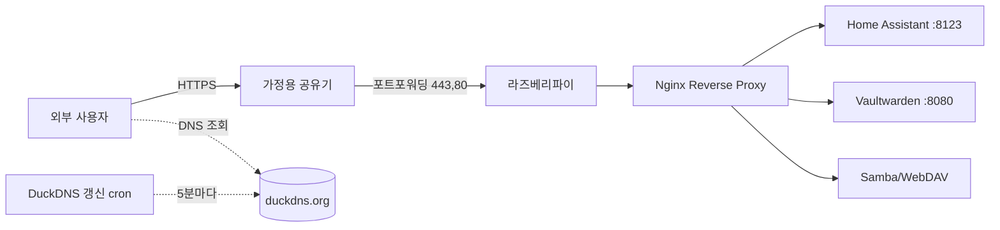

# DuckDNS 동적 DNS 서비스

## 개요

집에서 서버를 돌려본 사람이라면 ISP가 주는 IP가 수시로 바뀐다는 사실에 한 번쯤 부딪힌다. 한국 가정용 회선은 PPPoE 재접속이나 모뎀 재부팅 한 번이면 IP가 갈리는 경우가 많다. 외부에서 집 서버에 들어가려고 IP를 적어 두면 다음 날에는 못 들어간다. 이 문제를 해결하려고 나온 게 동적 DNS(DDNS)이고, DuckDNS는 그 중에서도 가장 자주 거론되는 무료 서비스다.

DuckDNS는 `*.duckdns.org` 서브도메인을 무료로 4개까지 등록해 주고, HTTP GET 한 번으로 IP를 갱신할 수 있게 해 준다. 가입에 신용카드도 필요 없고, 한 번 등록한 서브도메인은 갱신만 하면 계속 살아 있다. 라즈베리파이로 돌리는 홈서버, Nextcloud, Home Assistant, Plex처럼 외부에서 접근해야 하는 가정용 서비스의 진입 도메인으로 많이 쓰인다.

다만 무료라는 점에서 오는 한계가 분명히 있다. SLA는 없고, 가끔 갱신 API가 느려지거나 갱신을 받았다고 응답하고도 실제 전파가 5분 이상 걸리는 경우가 있다. 회사 운영 도메인으로는 절대 못 쓰고, 홈랩이나 사이드 프로젝트 수준에서만 써야 한다. 운영 환경에서 동적 IP를 다뤄야 한다면 Cloudflare API + 자체 도메인 조합으로 가는 편이 낫다.

### DuckDNS가 잘 맞는 상황

집에 라즈베리파이를 두고 거기서 Home Assistant를 돌리는데 외부에서 가끔 접근해야 한다. 굳이 도메인을 사기에는 아깝고, IP 직접 입력은 자꾸 바뀌어서 못 쓴다. 이때 `mypi.duckdns.org` 같은 서브도메인 하나 받아서 90단어짜리 갱신 스크립트를 cron에 걸어 두면 끝난다.

또 하나는 Let's Encrypt 와일드카드 인증서가 필요한 경우다. 와일드카드는 DNS-01 챌린지로만 발급되는데, DuckDNS는 TXT 레코드 갱신 API를 제공해서 certbot-dns-duckdns 플러그인으로 자동화가 된다. 자체 도메인 없이도 `*.mypi.duckdns.org`로 HTTPS를 전부 깔 수 있다.

### DuckDNS가 안 맞는 상황

회사 외부 공개 서비스, 결제가 들어가는 서비스, 메일 발송이 필요한 서비스에는 절대 안 된다. `duckdns.org` 자체가 무료 DDNS 도메인으로 알려져 있어서 스팸 발신지 평판이 좋지 않다. 메일 서버를 올리면 거의 다 차단된다. 또 외부에서 도메인 이전이 불가능하고, 4개 슬롯 제한이 있어서 서비스 단위로 도메인을 나누고 싶으면 부족하다.

## 계정 가입과 토큰 발급

DuckDNS 가입은 OAuth 로그인 방식이다. https://www.duckdns.org 에 접속하면 첫 화면에 GitHub, Reddit, Twitter, Google 로그인 버튼이 뜬다. 이메일 가입은 없다. 처음 써본다면 Google 계정으로 로그인하는 게 편하다. 한 번 로그인하면 OAuth provider가 곧 계정 식별자가 되기 때문에, 다른 OAuth로 다시 로그인하면 별도 계정이 만들어진다. 도메인은 계정에 묶여 있어서 OAuth provider를 바꾸면 기존 도메인을 못 본다. 이 부분에서 한 번씩 사고가 난다.

로그인하면 상단에 `token: xxxxxxxx-xxxx-xxxx-xxxx-xxxxxxxxxxxx` 형태의 UUID가 보인다. 이게 갱신 API 인증용 토큰이고, 계정당 하나만 발급된다. 토큰은 변경이 안 되고 재발급 메뉴도 없다. 토큰이 유출되면 새 계정을 파야 한다. 그래서 토큰은 Git에 절대 올리면 안 되고, 환경 변수나 별도 파일에 두고 .gitignore에 넣어 둬야 한다. 토큰 한 개로 그 계정의 모든 서브도메인을 갱신할 수 있기 때문에, 한 도메인만 노출돼도 다른 도메인이 같이 털린다.

## 도메인 등록

같은 화면에서 `domains` 입력칸에 원하는 서브도메인을 넣고 `add domain`을 누르면 즉시 등록된다. `mypi`를 넣으면 `mypi.duckdns.org`가 생긴다. 이미 다른 사람이 가져간 이름이면 거부된다. 좋은 이름은 대부분 선점돼 있어서, 본인 닉네임이나 프로젝트 이름을 조합해서 만들어야 한다. 등록한 도메인 옆에는 현재 등록된 IPv4 주소(`current ip`), IPv6 주소(`current ipv6`), TXT 값(`txt`)이 표시되고, 이 화면에서 직접 수정할 수도 있다.

도메인을 처음 등록하면 IP 필드가 비어 있다. 갱신 API를 한 번 호출하거나 화면에서 IP를 채워야 실제로 조회가 된다. 등록 직후 `dig mypi.duckdns.org`를 때려도 응답이 비어 있다면 IP가 안 들어간 상태다.

```bash
dig +short mypi.duckdns.org
# 비어 있으면 IP 미설정
```

## IP 자동 갱신

갱신은 GET 요청 하나가 전부다.

```
https://www.duckdns.org/update?domains=mypi&token=YOUR-TOKEN&ip=
```

`ip` 파라미터를 비워두면 DuckDNS 서버가 요청 발신 IP를 그대로 받는다. 집에서 cron으로 돌리는 가장 흔한 케이스에서는 이 방식이 제일 간단하다. 명시적으로 IP를 지정하고 싶으면 `&ip=1.2.3.4` 식으로 넣는다. 응답은 본문에 `OK` 또는 `KO` 한 줄로 온다. HTTP 상태 코드는 항상 200이라서, 본문을 봐야 성공/실패를 판단할 수 있다. 이 부분 때문에 `curl -f`로 실패 처리하려다가 영영 못 잡는 경우가 있다.

### 기본 cron 스크립트

DuckDNS 공식 예제도 cron이다. `/home/pi/duckdns/duck.sh` 같은 경로에 두고 5분마다 실행한다.

```bash
#!/bin/bash
# /home/pi/duckdns/duck.sh
DOMAIN="mypi"
TOKEN="xxxxxxxx-xxxx-xxxx-xxxx-xxxxxxxxxxxx"
LOG="/home/pi/duckdns/duck.log"

RESULT=$(curl -k -s "https://www.duckdns.org/update?domains=${DOMAIN}&token=${TOKEN}&ip=")
echo "$(date -Iseconds) ${RESULT}" >> "${LOG}"

if [ "${RESULT}" != "OK" ]; then
    exit 1
fi
```

```bash
chmod 700 /home/pi/duckdns/duck.sh
crontab -e
# 5분마다 실행
*/5 * * * * /home/pi/duckdns/duck.sh >/dev/null 2>&1
```

스크립트 권한을 700으로 잡는 이유는 토큰이 평문으로 박혀 있기 때문이다. 644로 두면 같은 머신의 다른 유저가 토큰을 그대로 읽을 수 있다. 로그는 `duck.log`에 한 줄씩 쌓이는데, 한두 달만 돌려도 수천 줄이 된다. logrotate를 안 걸 거면 로그 자체를 안 남기는 게 낫다.

`*/5`로 5분마다 도는 이유는 DuckDNS 자체가 5분 캐시를 두고 있어서, 더 자주 호출해도 의미가 없다. 오히려 1분마다 돌리면 rate limit에 걸려서 한동안 응답이 안 오는 경험을 한 번씩 한다.

### systemd timer 방식

cron 대신 systemd로 관리하면 로그를 journald에서 같이 보고 실패 알림도 붙이기 쉽다. 라즈베리파이 OS, Ubuntu, Debian 어디서나 동일하게 동작한다.

```ini
# /etc/systemd/system/duckdns.service
[Unit]
Description=DuckDNS update
After=network-online.target
Wants=network-online.target

[Service]
Type=oneshot
User=pi
EnvironmentFile=/etc/duckdns/env
ExecStart=/usr/bin/curl -sf -o /dev/null \
    "https://www.duckdns.org/update?domains=${DOMAIN}&token=${TOKEN}&ip="
```

```ini
# /etc/systemd/system/duckdns.timer
[Unit]
Description=Run DuckDNS update every 5 minutes

[Timer]
OnBootSec=1min
OnUnitActiveSec=5min
Unit=duckdns.service

[Install]
WantedBy=timers.target
```

`/etc/duckdns/env` 파일에 토큰과 도메인을 넣고 root:root 600으로 잡는다.

```
DOMAIN=mypi
TOKEN=xxxxxxxx-xxxx-xxxx-xxxx-xxxxxxxxxxxx
```

```bash
sudo systemctl daemon-reload
sudo systemctl enable --now duckdns.timer
journalctl -u duckdns.service -f
```

이 방식의 장점은 토큰이 스크립트 파일에 박히지 않는다는 점과, 실패 시 `systemctl status`로 바로 보인다는 점이다. 다만 위 ExecStart는 응답 본문을 검증하지 않기 때문에, `OK` 검증까지 하려면 작은 셸 스크립트를 한 번 거쳐야 한다.

## Docker 컨테이너

호스트에 cron이나 systemd를 건드리고 싶지 않다면 컨테이너로 돌리는 방법이 있다. linuxserver/duckdns 이미지가 잘 알려져 있고, 5분마다 갱신을 알아서 해 준다.

```yaml
# docker-compose.yml
services:
  duckdns:
    image: lscr.io/linuxserver/duckdns:latest
    container_name: duckdns
    environment:
      - PUID=1000
      - PGID=1000
      - TZ=Asia/Seoul
      - SUBDOMAINS=mypi,mypi-vpn
      - TOKEN=xxxxxxxx-xxxx-xxxx-xxxx-xxxxxxxxxxxx
      - UPDATE_IP=ipv4
      - LOG_FILE=false
    restart: unless-stopped
```

`SUBDOMAINS`에 콤마로 여러 개를 넣으면 한 번에 같이 갱신된다. `UPDATE_IP`는 `ipv4`, `ipv6`, `both` 중 하나다. 컨테이너 네트워크 모드가 bridge면 컨테이너 외부 IP가 호스트의 공인 IP로 잡힌다. DuckDNS 서버가 요청 발신 IP를 보기 때문에, NAT 뒤에서 돌려도 외부 공인 IP가 정상적으로 등록된다.

주의할 점은 `TOKEN`이 docker inspect에 평문으로 노출된다는 점이다. 같은 호스트의 다른 컨테이너나 사용자에서 `docker inspect duckdns`를 때리면 토큰이 그대로 보인다. 도커 시크릿이나 외부 env 파일로 분리해야 그나마 낫다.

```yaml
    env_file:
      - /etc/duckdns/.env
```

## Let's Encrypt DNS-01 와일드카드 인증서

DuckDNS의 진짜 가치는 와일드카드 인증서를 무료로 발급받을 수 있다는 점에 있다. `*.mypi.duckdns.org`로 인증서 하나 따 두면 `home.mypi.duckdns.org`, `vault.mypi.duckdns.org`, `nas.mypi.duckdns.org`처럼 서비스를 쪼개 두고 전부 HTTPS로 깔 수 있다.

와일드카드는 HTTP-01 챌린지로 발급이 안 되고 DNS-01만 가능하다. DNS-01은 챌린지 값을 TXT 레코드에 넣어 두면 Let's Encrypt가 그걸 조회해서 검증하는 방식인데, DuckDNS는 이 TXT 갱신 API를 공식으로 지원한다.

```
https://www.duckdns.org/update?domains=mypi&token=YOUR-TOKEN&txt=challenge-value
```

`txt=` 파라미터로 임의 값을 넣으면 `_acme-challenge.mypi.duckdns.org` TXT 레코드에 그 값이 박힌다. 값을 비우거나 `clear=true`를 같이 보내면 삭제된다.

certbot-dns-duckdns 플러그인을 쓰면 이 과정이 자동화된다.

```bash
# pipx로 설치
pipx install certbot
pipx inject certbot certbot-dns-duckdns

# 자격 증명 파일
cat > /etc/letsencrypt/duckdns.ini <<EOF
dns_duckdns_token = xxxxxxxx-xxxx-xxxx-xxxx-xxxxxxxxxxxx
EOF
chmod 600 /etc/letsencrypt/duckdns.ini

# 와일드카드 발급
certbot certonly \
    --authenticator dns-duckdns \
    --dns-duckdns-credentials /etc/letsencrypt/duckdns.ini \
    --dns-duckdns-propagation-seconds 60 \
    -d 'mypi.duckdns.org' \
    -d '*.mypi.duckdns.org' \
    --agree-tos -m me@example.com --non-interactive
```

`--dns-duckdns-propagation-seconds 60`이 중요한 부분이다. DuckDNS는 TXT 갱신 후에도 권한 네임서버에 전파되기까지 시간이 좀 걸려서, 기본값(10초)으로 두면 검증 실패가 잦다. 60초로 넉넉히 잡아 두면 거의 안 깨진다. 30초로 줄였다가 한 번씩 실패하는 경험은 이 서비스 쓰는 사람이라면 한 번씩 한다.

갱신은 cron 한 줄로 끝난다.

```bash
0 3 * * * certbot renew --quiet
```

발급된 인증서는 `/etc/letsencrypt/live/mypi.duckdns.org/fullchain.pem`에 있고, Nginx, Caddy, Traefik 어디에 붙여도 똑같이 동작한다. 와일드카드라서 새 서브도메인을 추가해도 인증서를 다시 따지 않아도 된다.

## 라즈베리파이 홈서버 활용

라즈베리파이 + DuckDNS + Let's Encrypt + Nginx 조합이 사실상 표준이다. 한 번 세팅해 두면 사람이 손댈 일이 거의 없다.



흐름은 단순하다. 외부에서 `vault.mypi.duckdns.org`를 조회하면 DuckDNS가 현재 등록된 공인 IP를 돌려준다. 그 IP는 우리 집 공유기 WAN 주소다. 공유기에서 443/80을 라즈베리파이 내부 IP로 포워딩해 두면 Nginx가 받고, SNI 기반으로 백엔드 서비스에 라우팅한다. cron이 5분마다 공인 IP를 DuckDNS에 등록해 두기 때문에, ISP가 IP를 바꿔도 5분 안에 복구된다.

함정은 보통 두 군데서 생긴다. 첫째는 공유기 포트포워딩이 ISP에 막혀 있는 경우다. 가정용 회선 중 일부는 80/443을 ISP단에서 차단하고 있어서, 포트를 열어도 외부에서 접근이 안 된다. 이때는 443 대신 8443 같은 비표준 포트로 우회하거나 Cloudflare Tunnel 같은 역방향 터널을 써야 한다. 둘째는 공유기가 이중 NAT 환경인 경우다. ISP 모뎀 뒤에 공유기가 또 있으면, 공유기 WAN에 사설 IP가 잡혀서 DuckDNS에 등록되는 IP가 외부에서 접근 불가능한 IP가 된다. `curl ifconfig.me`로 보이는 IP와 공유기 WAN IP가 다르면 이중 NAT다.

## 라우터 내장 DDNS

ASUS, TP-Link, Netgear, OpenWrt 같은 가정용 공유기는 펌웨어에 DDNS 기능이 들어 있다. ASUS는 메뉴 자체에 DuckDNS가 빠져 있지만, "Custom" 항목에 갱신 URL을 직접 넣을 수 있는 경우가 많다.

```
URL: https://www.duckdns.org/update?domains=mypi&token=YOUR-TOKEN&ip=
```

OpenWrt는 ddns-scripts에 DuckDNS 서비스가 포함돼 있어서 LuCI 메뉴에서 서비스만 골라 토큰과 도메인을 넣으면 된다.

라우터 내장 방식의 장점은 별도 머신 없이 돌릴 수 있다는 점이고, 단점은 펌웨어가 보는 IP가 항상 정확한 게 아니라는 점이다. 이중 NAT 환경이거나 펌웨어가 WAN IP를 잘못 잡는 경우에는 갱신은 되는데 외부에서 접근이 안 되는 상황이 생긴다. 라즈베리파이 같은 내부 머신에서 `ip=` 빈 파라미터로 보내는 방식이 외부에서 본 IP를 그대로 등록하기 때문에 더 안전하다.

## IPv6 AAAA 레코드

DuckDNS는 IPv4와 IPv6를 둘 다 지원한다. `ipv6` 파라미터로 별도 등록하면 AAAA 레코드가 박힌다.

```
https://www.duckdns.org/update?domains=mypi&token=YOUR-TOKEN&ipv6=2001:db8::1
```

IPv4와 IPv6를 같이 갱신하려면 호출 두 번을 따로 해야 한다. 한 호출에 둘 다 넣을 수도 있지만, 빈 값으로 두면 발신 IP가 들어가기 때문에 IPv6 망에서 IPv4 호출이 가면 IPv4 필드가 비워진다. 보통은 IPv4만 쓰고, IPv6는 ISP가 진짜 IPv6를 주는 환경에서만 굳이 등록한다. 한국 가정용 회선에서 IPv6를 정상적으로 라우팅해 주는 곳은 아직 많지 않다.

```bash
# IPv4와 IPv6를 분리해서 갱신
curl -sf "https://www.duckdns.org/update?domains=${DOMAIN}&token=${TOKEN}&ip="
curl -sf "https://www.duckdns.org/update?domains=${DOMAIN}&token=${TOKEN}&ipv6=$(ip -6 addr show scope global | grep inet6 | awk '{print $2}' | cut -d/ -f1 | head -1)"
```

IPv6 갱신을 cron으로 돌릴 때는 위처럼 ip 명령으로 현재 IPv6 글로벌 주소를 뽑아서 명시 전달하는 편이 안정적이다. 발신 IP에 의존하면 듀얼스택 환경에서 어느 쪽으로 나갈지 라우팅 결정에 따라 달라진다.

## TXT 레코드 갱신

TXT는 위에서 본 ACME 챌린지 외에도 SPF나 자체 검증용으로 쓸 일이 가끔 있다. 다만 DuckDNS의 TXT는 `_acme-challenge.도메인` 형태로만 박히고, 임의 위치에 TXT를 넣을 수는 없다. 메일 SPF/DKIM/DMARC 용도로는 못 쓴다고 봐야 한다.

```bash
# TXT 설정
curl -sf "https://www.duckdns.org/update?domains=mypi&token=${TOKEN}&txt=hello-world"

# TXT 삭제
curl -sf "https://www.duckdns.org/update?domains=mypi&token=${TOKEN}&txt=removed&clear=true"

# 확인
dig +short TXT _acme-challenge.mypi.duckdns.org
```

## 트러블슈팅

### 갱신 응답이 OK인데 dig는 옛날 IP를 돌려준다

DuckDNS는 권한 네임서버에 변경을 반영하는 데 1~5분이 걸린다. `OK` 응답을 받은 직후 `dig`를 때리면 옛날 값이 그대로 보일 수 있다. 로컬 리졸버나 ISP 리졸버 캐시까지 합치면 더 늦어진다. 검증할 때는 8.8.8.8을 직접 찍는 게 빠르다.

```bash
dig @8.8.8.8 +short mypi.duckdns.org
```

### KO 응답이 온다

KO는 인증 실패, 잘못된 파라미터, rate limit 셋 중 하나다. 응답 본문이 그냥 `KO`라서 원인이 구분이 안 된다. 토큰 오타와 도메인 오타가 가장 흔하고, 도메인을 `mypi.duckdns.org`로 보내면 안 되고 `mypi`만 보내야 한다. 등록한 적 없는 도메인을 넣어도 KO가 온다. 짧은 시간 안에 너무 자주 호출해도 KO가 오는데, 이때는 10분쯤 기다리면 풀린다.

### 응답이 한참 안 오거나 타임아웃

DuckDNS 서버가 가끔 느려진다. 무료 서비스라 어쩔 수 없다. curl에 `--max-time 30` 정도는 걸어 두는 게 좋다. 안 걸면 스크립트가 분 단위로 매달려 있다가 cron이 또 떠서 프로세스가 쌓인다.

```bash
curl -sf --max-time 30 "https://www.duckdns.org/update?domains=${DOMAIN}&token=${TOKEN}&ip="
```

### 토큰이 깃허브에 올라갔다

가장 자주 보는 사고다. duckdns.sh 같은 파일을 .gitignore 없이 올려서 토큰이 공개 저장소에 노출된다. 토큰 재발급이 안 되기 때문에, 노출되는 순간 그 계정 전체를 새로 파야 한다. 새 계정에서 같은 이름으로 도메인을 다시 등록하면 OK다(기존 계정에서 도메인 삭제 후). 새 OAuth 계정으로 다시 로그인하고 도메인을 재등록하는 게 안전하다.

```bash
# .gitignore
duckdns.sh
*.token
/etc/duckdns/env
```

### Let's Encrypt 갱신이 자꾸 깨진다

대부분 DNS 전파 대기 시간이 짧아서 생기는 문제다. `--dns-duckdns-propagation-seconds`를 60 이상으로 늘리고, 그래도 안 되면 90까지 올린다. 인증서를 한 번에 여러 도메인으로 받을 때 TXT 레코드 충돌이 생기는 경우도 있는데, DuckDNS는 도메인당 TXT가 하나만 들어가기 때문에 여러 챌린지가 동시에 오면 마지막 것만 남는다. 와일드카드 + apex(`mypi.duckdns.org` + `*.mypi.duckdns.org`)는 챌린지가 두 번 필요하지만 같은 위치(`_acme-challenge.mypi.duckdns.org`)를 공유한다. certbot 플러그인이 이걸 알아서 순차 처리하기 때문에 보통은 문제가 없지만, 다른 클라이언트를 쓰면 동시 요청으로 깨질 수 있다.

### 도커 컨테이너가 자꾸 죽는다

linuxserver/duckdns 이미지는 토큰이나 도메인 오타가 있으면 5분 후 다음 시도 전에 바로 죽지 않고 한참 살아 있다가 죽는다. `docker logs duckdns`로 응답을 직접 확인해야 KO인지 OK인지 알 수 있다. `LOG_FILE=false`로 둬도 stdout에는 응답이 나온다.

## No-IP, FreeDNS와 비교

| 항목 | DuckDNS | No-IP Free | FreeDNS (afraid.org) |
|------|---------|-----------|----------------------|
| 가입 | OAuth만 | 이메일 + 30일마다 확인 메일 | 이메일 |
| 도메인 수 | 4개 | 3개 | 사실상 무제한 (커뮤니티 도메인) |
| 도메인 형태 | `*.duckdns.org` | 선택한 서브 도메인 | 수백 개 커뮤니티 도메인 |
| TXT 레코드 | `_acme-challenge`만 | 제한적 | 임의 TXT 가능 |
| 와일드카드 인증서 | 가능 (certbot 플러그인) | 유료 | 가능 (afraid.org 플러그인) |
| API | GET 한 줄 | DynDNS 호환 | DynDNS 호환 + 자체 API |
| 30일 갱신 강제 | 없음 | 있음 (메일 클릭 안 하면 도메인 회수) | 없음 |
| 운영 안정성 | 가끔 느림 | 무료 플랜에 광고 페이지 | 호스트마다 편차 큼 |

No-IP는 30일마다 확인 메일을 클릭해야 도메인이 유지된다. 메일을 놓치면 도메인이 풀리고, 다른 사람이 가져갈 수 있다. 이 점 하나 때문에 No-IP를 떠나서 DuckDNS로 옮기는 사람이 많다.

FreeDNS는 도메인 종류가 많고 TXT도 자유롭다. 메일 SPF를 박을 수 있어서 자체 메일 서버 실험까지 갈 수 있다. 다만 갱신 API가 호스트별로 갈리고 운영자가 개인이라 안정성이 들쭉날쭉하다.

자체 도메인을 이미 갖고 있다면 Cloudflare를 쓰는 게 가장 나은 선택이다. API 토큰을 발급받아서 DDNS 스크립트를 직접 만들면 되고, 인증서 발급도 dns-cloudflare 플러그인으로 같은 방식이다. DuckDNS는 어디까지나 "도메인 없이 시작하기"의 자리다.

## 실제 사용 시 주의사항

### 상업적 사용은 안 된다

DuckDNS 약관은 상업적 사용을 명시적으로 금지하지는 않지만, SLA가 0이고 운영 주체도 자원봉사 수준이다. 매출이 발생하는 서비스의 진입 도메인으로 쓰면 안 된다. 다운된 시간을 보상받을 방법이 없다. 사이드 프로젝트라도 결제가 들어가면 빼야 한다.

### 도메인 만료 정책

DuckDNS는 도메인 갱신 비용도 없고 만료라는 개념도 별로 없다. 등록한 계정이 살아 있으면 도메인도 살아 있다. 다만 계정이 비활성 상태로 오래 방치되면 운영자가 도메인을 회수할 수 있다는 조항은 있다(공식 안내에는 활동이 없는 계정의 도메인은 회수 대상이 될 수 있다고 적혀 있다). 한두 달 갱신 호출이 없다고 회수되지는 않지만, 1년 넘게 방치된 도메인은 회수된 사례가 보고된다. cron이 돌고 있으면 자동으로 호출이 가니까 사실상 회수당할 일은 없다.

### 토큰 관리

토큰은 사실상 비밀번호다. 재발급이 안 되니까 비밀번호보다 더 조심해야 한다. 평문으로 박힌 스크립트는 권한 600/700으로 잡고, 가능하면 환경 변수로 분리한다. 도커 컨테이너로 돌리면 inspect로 노출되는 점도 인지해야 한다. CI 환경에서 쓰려면 secret 스토어에 넣고 빌드 로그에 echo가 안 찍히게 마스킹 설정을 챙겨야 한다.

### IP 갱신 주기

5분이 표준이다. 10분, 15분도 충분하다. 1분은 의미 없고 rate limit 위험만 있다. 집에서 ISP가 IP를 갈아치우는 빈도는 보통 며칠~몇 주에 한 번이라, 5분 주기면 충분히 빠르다. 갱신 호출이 며칠 동안 실패해도 마지막 값으로 조회는 계속 된다.

### 도메인 분리

서비스마다 도메인을 따로 쓰고 싶으면 4개 슬롯을 잘 배분해야 한다. 인증서를 와일드카드로 한 번 따고 같은 도메인 아래 서브로 쪼개는 게 가장 깔끔하다. `mypi.duckdns.org` 하나만 받고 그 아래 `home.mypi`, `vault.mypi`, `nas.mypi`로 가는 식이다. Nginx에서 SNI로 분기하면 4개 슬롯 안에서도 수십 개 서비스를 운영할 수 있다.

### 도커 + Caddy 조합

Caddy는 Let's Encrypt 자동 발급이 내장돼 있어서 DuckDNS와 잘 맞는다. 다만 와일드카드는 DNS-01이 필요하고 Caddy에는 DuckDNS 플러그인이 따로 빌드돼야 한다. caddy-dns/duckdns 모듈을 xcaddy로 빌드해서 같이 넣어 줘야 한다. 단일 도메인만 쓸 거면 HTTP-01로 충분하니까 굳이 빌드 안 해도 된다.

```caddyfile
home.mypi.duckdns.org {
    reverse_proxy localhost:8123
}
```

한 줄이면 인증서 발급, 갱신, 리버스 프록시가 자동으로 돌아간다. 단, 80/443이 외부에서 닿아야 한다. ISP에서 80을 막아 두면 HTTP-01이 실패하니까 DNS-01 빌드가 강제된다.
