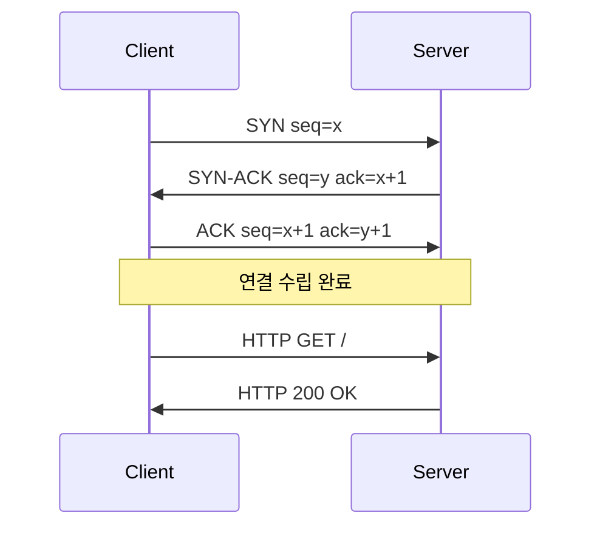
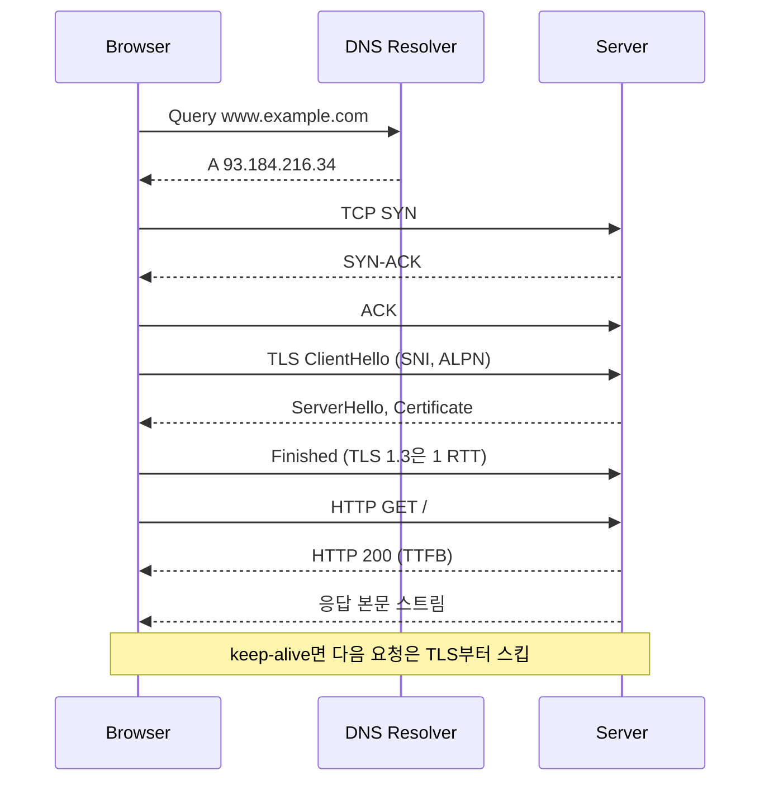

## 개요

브라우저 주소창에 URL을 치고 엔터를 눌렀을 때 화면이 뜰 때까지, 사실 패킷 레벨에서 보면 꽤 많은 일이 일어난다. URL 파싱, DNS 조회, TCP 3-way handshake, TLS handshake, HTTP 요청/응답, 그리고 브라우저 렌더링. 각 단계마다 ms 단위로 시간이 쌓이고, 어느 한 곳에서 막히면 전체 응답이 느려진다.

장애 대응할 때 "느리다"는 리포트만 보고 어디가 병목인지 모르면 답이 안 나온다. DNS인지 TCP 연결인지, TLS 협상인지, 서버 처리인지, 다운로드인지를 구분할 수 있어야 한다. 이 문서는 각 단계를 실제 명령어와 패킷 출력으로 확인하면서 어디에서 시간이 소모되고 어디에서 자주 깨지는지 정리한다.

### 용어 정리

| 용어 | 설명 |
|------|------|
| RTT | Round Trip Time. 패킷이 왕복하는 시간 |
| TTFB | Time To First Byte. 요청을 보내고 첫 응답 바이트를 받기까지 |
| SNI | Server Name Indication. TLS handshake에서 어떤 호스트로 접속할지 알려주는 확장 |
| ALPN | Application-Layer Protocol Negotiation. TLS 위에서 HTTP/2, HTTP/3을 협상 |
| keep-alive | 한 번 맺은 TCP 연결을 재사용 |
| QUIC | UDP 기반 전송 프로토콜. HTTP/3가 사용 |

---

## 1. URL 파싱

브라우저나 HTTP 클라이언트는 가장 먼저 URL을 분해한다. 프로토콜, 호스트, 포트, 경로, 쿼리, 프래그먼트로 쪼개야 어디로 어떻게 연결할지 결정할 수 있다.

```
https://www.example.com:443/login?redirect=home#section1
└─┬─┘   └──────┬──────┘ └┬┘└──┬─┘└──────┬──────┘└───┬──┘
protocol      host    port path        query     fragment
```

프래그먼트(`#` 뒤)는 서버로 전송되지 않는다. 브라우저 내부에서만 쓴다. 신입 때 액세스 로그에서 프래그먼트가 안 보여서 한참 헤맸던 기억이 있다.

### Node.js URL API로 파싱 확인

```javascript
const url = new URL('https://www.example.com:443/login?redirect=home#section1');

console.log(url.protocol); // 'https:'
console.log(url.hostname); // 'www.example.com'
console.log(url.port);     // '' (기본 포트면 빈 문자열)
console.log(url.pathname); // '/login'
console.log(url.search);   // '?redirect=home'
console.log(url.hash);     // '#section1'

// 쿼리 파라미터 접근
console.log(url.searchParams.get('redirect')); // 'home'
```

`url.port`가 기본 포트(http:80, https:443)면 빈 문자열로 나오는 점에 주의해야 한다. 직접 비교 로직을 짤 때 이걸 모르면 분기가 어긋난다.

### 브라우저 Performance API로 단계별 시간 측정

브라우저에서 한 요청의 단계별 시간을 코드로 잡으려면 `PerformanceResourceTiming`을 쓴다.

```javascript
// 페이지 로드가 끝난 뒤 실행
const [nav] = performance.getEntriesByType('navigation');

console.log({
  redirect:        nav.redirectEnd - nav.redirectStart,
  dns:             nav.domainLookupEnd - nav.domainLookupStart,
  tcp:             nav.connectEnd - nav.connectStart,
  tls:             nav.connectEnd - nav.secureConnectionStart,
  request:         nav.responseStart - nav.requestStart,   // TTFB
  response:        nav.responseEnd - nav.responseStart,    // 다운로드
  domInteractive:  nav.domInteractive - nav.responseEnd,
  load:            nav.loadEventEnd - nav.startTime,
});
```

특정 fetch 호출만 측정하려면 `getEntriesByName`으로 이름을 찍어서 가져온다.

```javascript
performance.mark('api-start');
const res = await fetch('/api/users');
performance.mark('api-end');
performance.measure('api-call', 'api-start', 'api-end');
```

---

## 2. DNS 조회

도메인을 IP로 바꾸는 단계다. 서비스가 갑자기 안 되는 장애의 절반은 DNS에서 시작된다. 먼저 클라이언트가 어떤 순서로 캐시를 뒤지는지 알아야 한다.

```mermaid
flowchart TD
    A[브라우저 캐시] -->|miss| B[OS DNS 캐시]
    B -->|miss| C[/etc/hosts 또는 hosts]
    C -->|없음| D[리졸버 DNS]
    D -->|miss| E[루트 DNS]
    E --> F[TLD DNS .com .kr]
    F --> G[권한 있는 DNS]
    G -->|A 레코드| D
    D -->|응답| B
```

브라우저 캐시 → OS 캐시 → hosts 파일 → 리졸버(보통 ISP 또는 8.8.8.8) → 루트 → TLD → 권한 있는 네임서버 순으로 내려간다. 각 단계마다 TTL이 다르고, 어디서 캐시되어 있는지에 따라 응답 시간이 0ms에서 수백 ms까지 갈린다.

### dig으로 직접 따라가기

`dig`은 DNS 디버깅의 기본기다. `+trace` 옵션을 붙이면 루트부터 권한 있는 네임서버까지 한 단계씩 따라간다.

```bash
dig +trace www.example.com
```

```
.                       518400  IN  NS  a.root-servers.net.
.                       518400  IN  NS  b.root-servers.net.
...
com.                    172800  IN  NS  a.gtld-servers.net.
...
example.com.            172800  IN  NS  a.iana-servers.net.
...
www.example.com.        86400   IN  A   93.184.216.34
```

특정 레코드 타입만 보고 싶으면 타입을 지정한다.

```bash
dig www.example.com A          # IPv4
dig www.example.com AAAA       # IPv6
dig example.com MX             # 메일 서버
dig example.com NS             # 네임서버
dig example.com TXT            # SPF, DKIM, 도메인 검증
```

특정 DNS 서버에 직접 물어보려면 `@` 뒤에 서버를 적는다. 캐시를 우회하고 권한 있는 서버에 직접 묻고 싶을 때 자주 쓴다.

```bash
dig @8.8.8.8 www.example.com
dig @1.1.1.1 www.example.com
dig @ns1.example.com www.example.com   # 권한 있는 서버에 직접
```

`+short`로 결과만 뽑고, `+stats`로 응답 시간을 본다.

```bash
$ dig +short www.example.com
93.184.216.34

$ dig www.example.com | grep "Query time"
;; Query time: 32 msec
```

macOS는 `dscacheutil -flushcache; sudo killall -HUP mDNSResponder`로 OS 캐시를 비울 수 있고, Linux는 systemd-resolved를 쓰면 `resolvectl flush-caches`다.

### Node.js dns 모듈로 캐시 무시하고 조회

Node의 기본 `dns.lookup()`은 OS의 getaddrinfo를 호출한다. 즉 OS DNS 캐시를 탄다. 캐시를 무시하고 DNS 서버에 직접 물어보려면 `dns.resolve*` 계열을 써야 한다.

```javascript
const dns = require('node:dns').promises;

// OS 캐시 사용 (getaddrinfo)
const lookup = await dns.lookup('www.example.com');
console.log(lookup); // { address: '93.184.216.34', family: 4 }

// 리졸버에 직접 (OS 캐시 우회)
const a    = await dns.resolve4('www.example.com');
const aaaa = await dns.resolve6('www.example.com');
const mx   = await dns.resolveMx('example.com');
const txt  = await dns.resolveTxt('example.com');

console.log(a);   // [ '93.184.216.34' ]
console.log(mx);  // [ { exchange: '...', priority: 10 } ]
```

특정 DNS 서버에 직접 묻고 싶으면 `Resolver`를 만들어서 `setServers`로 지정한다.

```javascript
const { Resolver } = require('node:dns').promises;
const resolver = new Resolver();
resolver.setServers(['8.8.8.8', '1.1.1.1']);

const addrs = await resolver.resolve4('www.example.com');
```

장애 분석할 때 "내 서버에서는 8.8.8.8로 물어보면 잘 나오는데 사내 DNS에서는 안 나온다" 같은 상황을 잡으려면 이 방식이 필수다.

### 자주 만나는 DNS 트러블

DNS는 캐시 계층이 많아서 변경이 즉시 반영되지 않는다. 도메인 IP를 바꿨는데 일부 사용자만 안 된다고 하면 거의 캐시 문제다. 점검 순서는 이렇다.

1. `dig @권한네임서버 도메인` — 원본은 정상인지 확인
2. `dig @8.8.8.8 도메인` — 외부 리졸버에서 어떻게 보이는지
3. `dig 도메인` (서버 명시 없이) — 실제 사용하는 리졸버 응답
4. 클라이언트 OS 캐시 비우기

TTL을 너무 길게(예: 24시간) 잡아둔 도메인을 바꾸려고 하면 하루 종일 일부 트래픽이 옛 IP로 간다. 변경 예정 시점 며칠 전에 TTL을 60초 같은 짧은 값으로 미리 낮춰두는 작업을 해야 한다.

또 하나 자주 보는 건 `/etc/hosts`에 테스트용 엔트리가 남아 있는 경우다. 분명 DNS는 새 IP를 가리키는데 한 서버만 옛 IP로 가고 있어서 한참 헤매다 hosts 파일을 보면 한 줄이 박혀 있다.

---

## 3. TCP 3-way Handshake

DNS로 IP를 얻었으면 TCP 연결을 맺는다. SYN → SYN-ACK → ACK 세 패킷을 주고받아야 양쪽이 "보낼 준비도 받을 준비도 됐다"는 합의를 한다.



이 과정은 무조건 1 RTT가 든다. 서버가 미국에 있고 RTT가 150ms라면, 데이터를 보내기도 전에 150ms를 깐다.

### tcpdump로 실제 패킷 보기

tcpdump로 핸드셰이크를 직접 캡처해보면 동작이 머리에 박힌다. 80번 포트(또는 443)에 대한 패킷을 잡는다.

```bash
sudo tcpdump -i any -nn 'tcp port 80 and host www.example.com' -c 6
```

별도 터미널에서 `curl http://www.example.com`을 치면 이런 출력이 나온다.

```
14:23:01.123456 IP 192.168.1.10.54321 > 93.184.216.34.80: Flags [S], seq 1000, win 65535
14:23:01.198765 IP 93.184.216.34.80 > 192.168.1.10.54321: Flags [S.], seq 5000, ack 1001, win 65535
14:23:01.198901 IP 192.168.1.10.54321 > 93.184.216.34.80: Flags [.], ack 5001, win 65535
14:23:01.199012 IP 192.168.1.10.54321 > 93.184.216.34.80: Flags [P.], seq 1001:1078, ack 5001
14:23:01.275123 IP 93.184.216.34.80 > 192.168.1.10.54321: Flags [P.], seq 5001:6500, ack 1078
```

`[S]`는 SYN, `[S.]`는 SYN-ACK, `[.]`는 ACK, `[P.]`는 PSH+ACK(데이터 푸시). 첫 SYN과 마지막 ACK 사이의 시간 차이가 핸드셰이크에 든 시간이다. 위 예시는 약 75ms.

좀 더 자세히 보려면 `-vv`나 `-X`(헥사 + ASCII)를 추가한다. 패킷을 파일로 저장해서 Wireshark에서 열어 보고 싶으면 `-w` 옵션을 쓴다.

```bash
sudo tcpdump -i any -nn -w capture.pcap 'tcp port 443 and host api.example.com'
# 다른 터미널에서 요청 발생
# Ctrl+C로 종료 후
wireshark capture.pcap
```

Wireshark에서 `tcp.flags.syn == 1 && tcp.flags.ack == 0` 같은 필터로 SYN만 골라 보면 핸드셰이크 패턴이 한눈에 들어온다.

### TIME_WAIT 누적 문제

연결을 active close한 쪽은 TIME_WAIT 상태로 보통 60~120초간 남는다. 짧은 HTTP 요청을 초당 수천 번 보내는 워커가 있으면 로컬 포트가 바닥나거나 conntrack 테이블이 가득 찬다.

```bash
# 상태별 TCP 연결 개수
ss -tan | awk '{print $1}' | sort | uniq -c
# 또는
netstat -an | grep -c TIME_WAIT
```

해결은 keep-alive를 켜서 연결을 재사용하는 것이다. 서버 간 통신을 단발성 fetch로 짜놓고 트래픽 늘었다고 TIME_WAIT 수만으로 깔리는 패턴을 신입한테 자주 본다. HTTP 클라이언트(axios, undici, requests, OkHttp 등)는 보통 connection pool이 있다. 풀 사이즈와 keep-alive 옵션을 확인해야 한다.

---

## 4. TLS Handshake

HTTPS면 TCP 위에 TLS handshake가 또 붙는다. TLS 1.2는 2 RTT, TLS 1.3은 1 RTT(또는 0-RTT). 인증서 검증, 키 교환, 암호 스위트 합의가 여기서 일어난다.

### openssl s_client로 단계별 출력 보기

`openssl s_client`는 TLS 진단의 표준 도구다.

```bash
openssl s_client -connect www.example.com:443 -servername www.example.com
```

출력 핵심부:

```
CONNECTED(00000003)
depth=2 C = US, O = ..., CN = ... Root CA
verify return:1
depth=1 C = US, O = ..., CN = ... Intermediate CA
verify return:1
depth=0 CN = www.example.com
verify return:1
---
Certificate chain
 0 s:CN = www.example.com
   i:C = US, O = ..., CN = ... Intermediate CA
 1 s:C = US, O = ..., CN = ... Intermediate CA
   i:C = US, O = ..., CN = ... Root CA
---
SSL handshake has read 5234 bytes and written 412 bytes
---
New, TLSv1.3, Cipher is TLS_AES_256_GCM_SHA384
Server public key is 2048 bit
Secure Renegotiation IS NOT supported
Compression: NONE
Expansion: NONE
No ALPN negotiated
Verification: OK
```

확인해야 할 것은 다음과 같다.

- `verify return:1`이 모든 depth에서 나오는가 — 인증서 체인 검증 통과
- `Certificate chain`에 root까지 가는 경로가 다 나오는가 — 중간 인증서 누락 여부
- `Cipher is`에 협상된 암호 스위트
- `New, TLSvX.X` — 협상된 TLS 버전
- `Verification: OK`

`-servername` 옵션(SNI)을 빼먹으면 가상 호스팅 서버에서 다른 인증서가 돌아오거나 handshake가 실패한다. SNI가 일반적이 된 지금은 이 옵션을 거의 항상 붙여야 한다.

ALPN 협상을 보고 싶으면 `-alpn h2,http/1.1`을 추가한다.

```bash
openssl s_client -connect www.example.com:443 -servername www.example.com -alpn h2,http/1.1
```

출력에 `ALPN protocol: h2`가 뜨면 HTTP/2로 협상된 것이다.

특정 TLS 버전을 강제하려면 `-tls1_2`, `-tls1_3` 같은 플래그를 쓴다. 버전 협상 문제를 디버깅할 때 유용하다.

### 인증서 체인 깨짐

서비스 한 곳에서는 잘 되는데 다른 곳에서 인증서 오류가 뜨는 경우, 거의 중간 인증서(intermediate) 누락이다. 브라우저는 보통 OS에 깔린 root CA를 신뢰하지만, 중간 인증서는 서버가 함께 보내줘야 한다. nginx면 `ssl_certificate` 파일에 leaf + intermediate를 합친 fullchain을 지정해야 한다. leaf만 넣으면 모바일이나 Java 클라이언트에서 깨진다.

체인 검증은 SSL Labs(`https://www.ssllabs.com/ssltest/`)나 위 `openssl s_client` 출력에서 `Certificate chain` 길이로 확인한다.

### SNI 미스매치

한 IP에 여러 도메인이 호스팅돼 있는데 클라이언트가 SNI를 보내지 않거나 잘못된 호스트로 보내면, 서버가 default 인증서를 돌려준다. 그 기본 인증서가 요청한 도메인과 안 맞으면 hostname mismatch 에러.

```bash
# SNI를 일부러 다르게 줘서 재현
openssl s_client -connect 1.2.3.4:443 -servername wrong.example.com
```

오래된 라이브러리(Java 7 이하 일부, 일부 임베디드 환경)는 SNI를 안 보낸다. 이런 클라이언트만 인증서 오류가 난다면 SNI가 의심 1순위다.

---

## 5. HTTP/1.1 vs HTTP/2 vs HTTP/3

같은 리소스를 가져와도 HTTP 버전에 따라 동작이 다르다.

| 항목 | HTTP/1.1 | HTTP/2 | HTTP/3 |
|------|----------|--------|--------|
| 전송 계층 | TCP | TCP | UDP (QUIC) |
| 다중화 | 불가, 한 연결당 한 요청 | 한 연결에서 동시 다중 요청 | HTTP/2와 동일하나 head-of-line 차단 없음 |
| 헤더 압축 | 없음 | HPACK | QPACK |
| 연결 수립 | TCP + TLS = 2~3 RTT | TCP + TLS = 2~3 RTT | QUIC = 1 RTT, 0-RTT 가능 |
| Server Push | 없음 | 있음 (현재는 폐기 추세) | 있음 |

HTTP/1.1의 가장 큰 약점은 한 연결에서 한 요청을 끝내야 다음 요청을 보낼 수 있다는 것(파이프라이닝은 사실상 죽었다). 그래서 브라우저가 도메인당 6개 정도 연결을 만들었다. HTTP/2는 한 연결에서 stream을 다중화한다. HTTP/3는 TCP의 head-of-line 차단까지 우회하려고 UDP 위 QUIC을 쓴다.

### curl로 버전별 비교

`curl --http1.1`, `--http2`, `--http3`로 버전을 강제해서 비교할 수 있다.

```bash
# HTTP/1.1
curl --http1.1 -o /dev/null -s -w 'connect=%{time_connect} ttfb=%{time_starttransfer} total=%{time_total}\n' \
  https://www.example.com/

# HTTP/2 (TLS ALPN으로 협상)
curl --http2 -o /dev/null -s -w 'connect=%{time_connect} ttfb=%{time_starttransfer} total=%{time_total}\n' \
  https://www.example.com/

# HTTP/3 (curl이 HTTP/3 지원 빌드여야 함)
curl --http3 -o /dev/null -s -w 'connect=%{time_connect} ttfb=%{time_starttransfer} total=%{time_total}\n' \
  https://www.example.com/
```

`-v`로 헤더와 협상 과정을 자세히 보면 `ALPN: server accepted h2` 같은 줄이 뜬다. HTTP/3는 첫 요청에서는 보통 HTTP/2로 시작하고, `Alt-Svc` 헤더로 "다음부터는 h3로 와라"고 알려주는 방식이다. 그래서 `--http3`로 강제하지 않으면 HTTP/3 협상이 잘 안 잡힌다.

여러 리소스를 동시에 받을 때 HTTP/2의 다중화 효과가 드러난다. 단일 큰 파일 하나만 받으면 차이가 거의 없다. 작은 파일 100개를 받는 페이지에서는 HTTP/1.1과 HTTP/2의 체감 속도가 확연히 다르다.

### Connection: close와 keep-alive 오설정

HTTP/1.1은 기본이 keep-alive다. 응답 헤더에 `Connection: close`가 있으면 응답 후 연결을 끊는다. 가끔 옛 코드가 이걸 무조건 박아놓고 있어서, 분명 keep-alive 풀을 쓰는 클라이언트인데도 매 요청마다 새 TCP 연결을 만든다. 트래픽이 늘면 비용이 폭발한다.

```bash
curl -v https://api.example.com/ 2>&1 | grep -i 'connection:'
```

응답 헤더에 `Connection: close`가 보이는지 확인. 서버 설정(nginx의 `keepalive_timeout`, 애플리케이션 프레임워크의 keep-alive 설정)을 점검해야 한다. 반대로 클라이언트가 매 요청에서 `Connection: close`를 강제로 넣는 경우도 있다.

---

## 6. curl로 단계별 시간 측정

가장 빠른 진단은 curl이다. `-w` 옵션에 timing 변수를 넣으면 각 단계별 누적 시간이 나온다.

```bash
curl -o /dev/null -s -w '
namelookup:    %{time_namelookup}s
connect:       %{time_connect}s
appconnect:    %{time_appconnect}s
pretransfer:   %{time_pretransfer}s
starttransfer: %{time_starttransfer}s
total:         %{time_total}s
' https://www.example.com/
```

출력 예시:

```
namelookup:    0.003425s
connect:       0.078123s
appconnect:    0.198765s
pretransfer:   0.198812s
starttransfer: 0.275432s
total:         0.276891s
```

각 변수의 의미는 다음과 같다.

| 변수 | 의미 | 어디까지 끝났을 때 시각 |
|------|------|--------------------------|
| `time_namelookup` | DNS 조회 끝 | DNS 응답 받음 |
| `time_connect` | TCP 연결 끝 | 3-way handshake 끝 |
| `time_appconnect` | TLS handshake 끝 | HTTPS의 TLS 협상 완료 |
| `time_pretransfer` | 전송 직전 | 첫 바이트 보내기 직전 |
| `time_starttransfer` | TTFB | 첫 응답 바이트 받음 |
| `time_total` | 전체 끝 | 응답 다운로드 완료 |

차이로 단계별 소요시간을 뽑는다. `connect - namelookup = TCP 핸드셰이크`, `appconnect - connect = TLS 핸드셰이크`, `starttransfer - pretransfer = 서버 처리 + 첫 바이트 도착`, `total - starttransfer = 응답 다운로드`.

이 한 줄이면 "느리다"는 리포트를 받았을 때 어디서 시간이 깔리는지 1차 분류가 끝난다. DNS가 0.3초씩 걸리면 리졸버나 캐시 문제, TCP 연결이 길면 네트워크 RTT 또는 방화벽, TLS가 길면 인증서 OCSP 또는 RTT, TTFB가 길면 서버 내부, total - starttransfer가 길면 응답 크기나 대역폭.

### DNS 캐시 영향 빼고 측정

DNS 캐시가 따뜻한지 차가운지에 따라 첫 측정과 두 번째 측정이 크게 다르다. 비교하려면 캐시 비우고 측정하거나, 캐시를 우회한다.

```bash
# DNS를 미리 박아 캐시 영향 제거
curl --resolve www.example.com:443:93.184.216.34 -o /dev/null -s -w '%{time_connect}\n' \
  https://www.example.com/
```

`--resolve`로 IP를 직접 박아두면 DNS 단계가 0이 된다. 순수 TCP/TLS/HTTP 시간만 보고 싶을 때 쓴다.

---

## 7. 브라우저 DevTools Network Timing

브라우저 DevTools Network 탭에서 한 요청을 클릭해 Timing을 보면 다음 항목이 뜬다. 이 표시가 무엇을 의미하는지 모르면 진단이 안 된다.

| 항목 | 의미 | 길어지면 의심할 것 |
|------|------|---------------------|
| Queueing | 브라우저 큐에서 대기 | 도메인당 동시 연결 수 한계, 우선순위 낮은 리소스 |
| Stalled | 연결 풀 대기, 프록시 협상 등 | HTTP/1.1에서 동시 요청이 너무 많음 |
| DNS Lookup | DNS 조회 | 리졸버 응답 지연, 캐시 미스 |
| Initial connection | TCP 연결 + 재시도 | 네트워크 RTT, 방화벽 드롭 |
| SSL | TLS handshake | TLS 1.2 사용, OCSP stapling 미적용, RTT |
| Request sent | 요청 헤더/바디 전송 | 거의 안 길어짐. 길면 큰 POST |
| Waiting (TTFB) | 서버 응답 대기 | 서버 내부 처리, DB, 캐시 미스 |
| Content Download | 응답 본문 다운로드 | 응답 크기, 대역폭, 압축 누락 |

DNS가 길면 클라이언트 리졸버 또는 권한 있는 네임서버 문제. Initial connection이 길면 RTT 또는 서버 측 SYN 대기. SSL이 길면 인증서 체인이 너무 길거나 OCSP 응답을 클라이언트가 받으러 가는 경우(서버에 OCSP stapling 켜면 사라진다). TTFB가 길면 서버 내부. Content Download가 길면 응답 크기를 줄이거나 압축(gzip/br)을 켜야 한다.

`Stalled`가 유독 긴 요청들이 보이면 HTTP/1.1에서 도메인당 6 connection 한계에 걸려 있을 가능성이 높다. HTTP/2로 올리면 사라진다.

---

## 8. 전체 흐름 시퀀스

지금까지 본 단계를 한 그림에 합치면 이렇게 된다.



같은 호스트로 두 번째 요청을 보내면 DNS는 캐시, TCP는 재사용, TLS도 재사용된다. 그래서 첫 요청과 N번째 요청의 timing 분포는 완전히 다르다. 실서비스 성능을 볼 때는 cold start와 warm path를 따로 측정해야 한다.

---

## 9. 자주 만나는 트러블 정리

장애 들어왔을 때 이 순서로 분류하면 80%는 빠르게 잡힌다.

**DNS가 의심**
- 일부 사용자만 안 됨 → 클라이언트 측 DNS 캐시 또는 리졸버 차이
- `dig +trace`로 권한 있는 서버까지 추적
- `/etc/hosts`에 잔여 엔트리 확인

**TCP 연결이 안 됨**
- `nc -zv host port` 또는 `telnet host port`로 포트 도달성 확인
- 방화벽/보안그룹/네트워크 ACL 점검
- 서버에서 `ss -ltn`으로 실제 LISTEN 중인지 확인

**TLS handshake 실패**
- `openssl s_client -connect host:443 -servername host`로 직접 확인
- 인증서 만료 (`openssl x509 -enddate -noout -in cert.pem`)
- 중간 인증서 누락
- 클라이언트가 SNI를 안 보냄
- 클라이언트와 서버의 TLS 버전 불일치(예: TLS 1.0 강제하는 옛 클라이언트)

**연결은 되는데 응답이 느림**
- `curl -w` timing으로 단계 분류
- TTFB가 길면 서버 내부 — APM이나 서버 로그
- Content Download가 길면 압축 누락, 응답 크기 과다

**연결이 매번 새로 맺어짐**
- 응답 헤더 `Connection: close` 확인
- 클라이언트 풀 설정 확인
- 서버 keep-alive timeout 너무 짧지 않은지

**TIME_WAIT 폭증**
- 단발성 요청 패턴 → keep-alive 풀로 전환
- conntrack 테이블 한계 확인 (`sysctl net.netfilter.nf_conntrack_max`)

**Connection reset / EPIPE**
- 보통 서버가 idle timeout으로 끊었는데 클라이언트가 모르고 보냄
- 클라이언트 풀의 idle timeout을 서버보다 짧게 잡아야 한다

---

## 참고

- RFC 9110 (HTTP Semantics): https://www.rfc-editor.org/rfc/rfc9110
- RFC 9111 (HTTP Caching): https://www.rfc-editor.org/rfc/rfc9111
- RFC 9112 (HTTP/1.1): https://www.rfc-editor.org/rfc/rfc9112
- RFC 9113 (HTTP/2): https://www.rfc-editor.org/rfc/rfc9113
- RFC 9114 (HTTP/3): https://www.rfc-editor.org/rfc/rfc9114
- RFC 8446 (TLS 1.3): https://www.rfc-editor.org/rfc/rfc8446
- RFC 1035 (DNS): https://www.rfc-editor.org/rfc/rfc1035
- curl `-w` 변수 목록: https://everything.curl.dev/usingcurl/verbose/writeout
- MDN PerformanceResourceTiming: https://developer.mozilla.org/docs/Web/API/PerformanceResourceTiming
