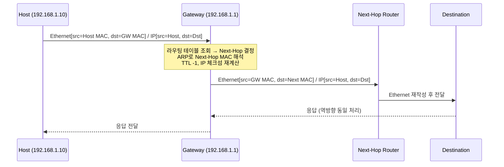
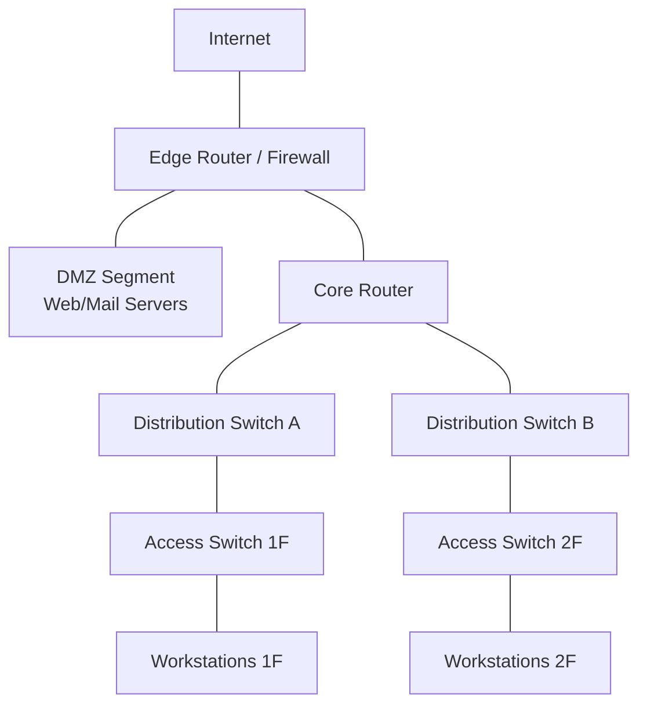

# Network Gateway 심화

기존 Gateway 개요 문서가 API Gateway까지 한 데 묶다 보니 정작 L3 라우팅 게이트웨이가 패킷을 어떻게 다루는지는 한 줄로 끝났다. 운영 중에 `default route`가 사라져서 트래픽이 전부 멈추거나, NAT 매핑 타임아웃 때문에 장시간 idle 세션이 끊기는 사례를 몇 번 겪고 나면 이 부분이 결국 머리를 잡는다. 이 문서는 그 빈 자리를 채우는 용도다. API Gateway 이야기는 안 한다.

## L3 게이트웨이가 패킷을 처리하는 흐름

라우터가 패킷을 받았을 때 실제로 무슨 일이 일어나는지부터 정리한다. 단말 입장에서는 "게이트웨이로 던지면 알아서 가더라"지만, 라우터 안에서는 매 패킷마다 라우팅 테이블 조회·Next-Hop 결정·ARP 해석·MAC 재작성·TTL 감소·체크섬 갱신이 모두 일어난다.

### 라우팅 테이블 조회 (Longest Prefix Match)

라우터에 들어온 패킷의 목적지 IP가 `203.0.113.45`라고 하자. 라우팅 테이블에 다음과 같은 엔트리가 있다.

```
Destination       Next-Hop          Interface   Metric
0.0.0.0/0         10.0.0.1          eth0        1
203.0.113.0/24    10.0.0.5          eth1        1
203.0.113.32/27   10.0.0.9          eth2        1
192.168.10.0/24   directly conn.    eth3        0
```

이 경우 `203.0.113.45`는 `/24`, `/27` 두 엔트리에 모두 매칭된다. 라우터는 항상 **가장 긴 prefix**를 우선한다(Longest Prefix Match, LPM). `/27`이 `/24`보다 길기 때문에 `10.0.0.9`로 보낸다. 어떤 엔트리에도 안 맞으면 `0.0.0.0/0` 디폴트 라우트로 떨어진다.

여기서 한 가지 흔히 헷갈리는 점이 있는데, `directly connected` 라우트는 Next-Hop이 별도로 없다. 같은 서브넷이라서 ARP만 풀면 바로 보낼 수 있는 경우다. Next-Hop이 명시된 라우트는 한 단계 더 거친다.

### Next-Hop 결정 후 ARP 해석

`10.0.0.9`로 보내야 한다고 결정했지만, 이건 IP다. 이더넷 프레임을 만들려면 MAC 주소가 필요하다. 라우터는 ARP 캐시를 먼저 본다.

```
$ ip neigh show
10.0.0.1   dev eth0   lladdr  00:11:22:33:44:55  REACHABLE
10.0.0.9   dev eth2   lladdr  aa:bb:cc:dd:ee:ff  STALE
```

`STALE`이면 일단 그 MAC으로 보내면서 백그라운드로 ARP 갱신을 시도한다. 캐시에 없으면 ARP Request를 브로드캐스트하고, 응답이 올 때까지 패킷은 큐에 잠시 머문다. ARP 응답이 안 오면 호스트는 `Destination Host Unreachable` 응답을 받는다.

### MAC 재작성과 TTL/체크섬 갱신

가장 자주 오해하는 부분이다. 라우터가 패킷을 전달할 때 **IP 헤더의 source/destination IP는 절대 안 바꾼다**(NAT가 끼지 않는 한). 바뀌는 건 L2 헤더다.

| 필드 | 변경 여부 |
|------|-----------|
| L2 Source MAC | 라우터의 송신 인터페이스 MAC으로 교체 |
| L2 Destination MAC | Next-Hop의 MAC으로 교체 |
| IP Source/Destination | 그대로 |
| IP TTL | -1 |
| IP Header Checksum | TTL 바뀌었으니 재계산 |
| L4 Checksum | 일반 라우팅에선 그대로 (NAT 시에만 재계산) |

TTL이 0이 되면 `ICMP Time Exceeded`를 돌려준다. `traceroute`가 이걸 이용한다. TTL을 1부터 하나씩 늘려가며 보내고, 중간 라우터마다 돌려주는 `Time Exceeded`의 송신 IP를 모아 경로를 만든다.



## Default Gateway가 결정되는 과정

단말에서 패킷을 보낼 때 "이걸 게이트웨이로 보낼지, 같은 LAN에 직접 보낼지"를 매번 결정한다. 이걸 판단하는 게 **서브넷 마스크와의 AND 연산**이다.

### 단말 측 결정 로직

호스트가 `192.168.1.10/24`이고 게이트웨이가 `192.168.1.1`이라고 하자. 호스트가 `192.168.1.50`으로 보낼 때는 같은 서브넷이라 ARP로 직접 MAC을 찾는다. 호스트가 `8.8.8.8`로 보낼 때는 다음 과정을 거친다.

1. `(8.8.8.8) AND (255.255.255.0)` = `8.8.8.0` → 내 네트워크(`192.168.1.0`)와 다름 → 외부
2. 라우팅 테이블에서 `0.0.0.0/0` 엔트리(default route) 찾기
3. Next-Hop = `192.168.1.1` (게이트웨이)
4. `192.168.1.1`의 MAC을 ARP로 해석
5. 이더넷 프레임의 **dst MAC만 게이트웨이 MAC**으로 설정, 단 IP dst는 `8.8.8.8` 그대로

이게 자주 함정이 되는 지점이다. 패킷을 캡처해 보면 `8.8.8.8`로 가는 프레임의 dst MAC이 게이트웨이 MAC으로 찍혀 있다. "왜 게이트웨이 MAC인데 IP는 구글이지?" 하고 처음엔 의아한데, L2와 L3가 다른 일을 한다는 걸 받아들이면 자연스러워진다.

### 디폴트 라우트가 0.0.0.0/0인 이유

`0.0.0.0/0`은 prefix가 0이라 모든 IP와 매칭된다. 동시에 prefix가 가장 짧으니 LPM 규칙에 따라 **다른 엔트리에 매칭되지 않을 때만** 선택된다. 즉, "마지막 보루"로 동작하도록 설계된 prefix다.

리눅스에서 확인하면 이렇게 나온다.

```
$ ip route
default via 192.168.1.1 dev eth0 proto dhcp metric 100
192.168.1.0/24 dev eth0 proto kernel scope link src 192.168.1.10
```

`default`가 `0.0.0.0/0`의 표시 형태다. DHCP로 받은 게이트웨이가 `proto dhcp`로 마킹돼 있다. 만약 default route가 사라지면 같은 서브넷 외 통신이 전부 멈춘다. 이건 뒤 트러블슈팅에서 다시 다룬다.

## NAT/PAT 변환 동작

NAT는 IP 헤더를 건드린다. 헤더가 바뀌니 체크섬을 다시 계산해야 하고, 외부에서 들어온 응답을 원래 내부 호스트로 돌려보내려면 매핑 테이블이 필요하다. PAT(Port Address Translation, 흔히 NAPT)는 여기에 포트까지 매핑해 N:1로 압축한다. 가정용 공유기가 하는 게 이거다.

### 매핑 테이블의 상태 관리

리눅스 conntrack 테이블을 보면 NAT가 무엇을 기억하고 있는지 한눈에 보인다.

```
$ conntrack -L
tcp  6  299  ESTABLISHED  src=192.168.1.10 dst=93.184.216.34 sport=51234 dport=443
                          src=93.184.216.34 dst=203.0.113.5  sport=443   dport=51234
                          [ASSURED] mark=0 use=1
```

윗줄이 내부→외부 방향에서 본 5-tuple, 아랫줄이 외부에서 본 5-tuple이다. 내부 호스트 `192.168.1.10:51234`가 공인 IP `203.0.113.5`의 어떤 포트로 매핑됐는지 보여준다(여기선 PAT라 sport이 그대로 51234로 살아 있지만, 충돌 시 다른 포트로 재할당된다).

### 포트 할당 전략

내부에서 두 호스트가 동시에 같은 외부 포트를 쓰면 응답을 누구한테 줘야 할지 알 수 없다. PAT는 이걸 피하려고 외부 포트를 새로 발급한다.

- **Endpoint-Independent (Cone NAT)**: 내부 (src IP, src Port) 하나당 외부 포트 하나를 고정. 외부 어떤 IP가 와도 같은 포트.
- **Address/Port-Restricted**: 같은 내부 (IP, Port)라도 통신 상대마다 다른 매핑. 보안에 유리하지만 P2P 곤란.
- **Symmetric NAT**: 모든 5-tuple마다 별도 매핑. P2P, WebRTC ICE에서 STUN으로 뚫기 어려움.

홈 공유기는 대부분 Cone에 가깝다. 엔터프라이즈 방화벽은 Symmetric인 경우가 많다. WebRTC가 일부 환경에서 안 되는 이유 중 하나다.

### 체크섬 재계산

IPv4 헤더에 src/dst IP가 들어가고, TCP/UDP 의사 헤더(pseudo-header)에도 src/dst IP가 들어간다. NAT가 IP를 바꾸면

- IP 헤더 체크섬 재계산
- TCP/UDP 체크섬 재계산 (의사 헤더가 바뀌었으므로)
- 만약 포트도 바꾸면 TCP/UDP 체크섬 한 번 더

NIC의 checksum offload가 켜져 있으면 하드웨어가 처리하지만, conntrack 모듈이 패킷을 mangle하면 소프트웨어로 재계산해야 한다. 패킷 처리량이 높은 게이트웨이에서 CPU가 튀는 흔한 원인이다.

```python
# NAT 매핑이 어떻게 동작하는지 의사 코드로
class NATTable:
    def __init__(self, public_ip):
        self.public_ip = public_ip
        self.mappings = {}     # (inner_ip, inner_port, proto) -> outer_port
        self.reverse = {}      # (outer_port, proto) -> (inner_ip, inner_port)
        self.next_port = 49152 # ephemeral range

    def outbound(self, pkt):
        key = (pkt.src_ip, pkt.src_port, pkt.proto)
        if key not in self.mappings:
            port = self._allocate_port(pkt.proto)
            self.mappings[key] = port
            self.reverse[(port, pkt.proto)] = (pkt.src_ip, pkt.src_port)
        outer_port = self.mappings[key]
        pkt.src_ip, pkt.src_port = self.public_ip, outer_port
        pkt.recompute_checksum()  # IP + L4 둘 다
        return pkt

    def inbound(self, pkt):
        key = (pkt.dst_port, pkt.proto)
        if key not in self.reverse:
            return None  # 매핑 없으면 드롭
        inner_ip, inner_port = self.reverse[key]
        pkt.dst_ip, pkt.dst_port = inner_ip, inner_port
        pkt.recompute_checksum()
        return pkt
```

실제 conntrack은 여기에 TCP 상태머신(SYN_SENT, ESTABLISHED, FIN_WAIT…)과 타임아웃이 더해진다. UDP는 상태가 없으니 그냥 마지막 패킷 시각으로 idle 타임아웃을 잰다.

## Network Gateway vs Proxy Gateway vs API Gateway

자주 한 묶음으로 다뤄지지만 동작 계층과 관심사가 다르다. 한 줄로 정리하면 이렇다.

| 구분 | 동작 계층 | 패킷 처리 방식 | 클라이언트가 보는 상대 |
|------|----------|----------------|----------------------|
| Network Gateway | L3 (IP) | 헤더 재작성, 페이로드 미터치 | 최종 서버 |
| Proxy Gateway | L4~L7 | 연결을 양쪽에서 끊고 재생성 | 프록시 자신 |
| API Gateway | L7 (HTTP/gRPC) | 요청 단위 파싱·변환·라우팅 | 게이트웨이 자신 |

### Network Gateway는 패킷을 "통과"시킨다

L3에서 동작한다. TCP 연결은 클라이언트와 최종 서버 사이에 직접 맺어지고, 게이트웨이는 그 사이를 지나는 패킷의 L2 헤더(+ NAT가 끼면 IP 헤더)만 재작성한다. 게이트웨이는 TCP 상태를 처음부터 끝까지 유지하지 않는다(conntrack가 흐름 추적은 하지만, 그건 5-tuple 매핑 유지 용도지 SYN 다시 보내거나 ACK 만들지는 않는다).

```
Client ── SYN ──> Gateway(L3, just forward) ── SYN ──> Server
       <── SYN+ACK ──            <── SYN+ACK ──
```

같은 TCP 연결이 통째로 끝까지 간다.

### Proxy Gateway는 연결을 "종단"한다

Proxy는 TCP 연결을 자신이 종단한 뒤 백엔드로 **새 연결**을 연다. Nginx, HAProxy, Envoy 같은 L7 프록시가 이렇게 동작한다.

```
Client ── TCP/TLS ──> Proxy ── 별개 TCP/TLS ──> Backend
```

이러면 무엇이 가능해지냐면 — TLS 종단·HTTP 헤더 조작·요청 본문 파싱·캐싱·압축·재시도가 전부 가능하다. 대신 연결이 두 번 맺어지니 latency가 한 stage 더 늘고, 프록시가 살아있는 동안 모든 in-flight 요청 상태를 들고 있어야 한다. 클라이언트는 `X-Forwarded-For` 같은 헤더로만 자신의 원본 IP를 알릴 수 있다.

### API Gateway는 더 위로 올라간다

API Gateway는 Proxy의 일종이지만 **API 단위로 메타데이터를 갖고** 동작한다. `/users/{id}` 같은 라우트 매칭, OpenAPI 스키마 검증, JWT 인증, Rate Limit, 응답 변환(REST↔gRPC), API 키 사용량 집계 같은 게 추가된다. 패킷이나 TCP 연결이 아니라 **HTTP 요청**을 1차 단위로 본다.

핵심은 이거다. Network Gateway 트러블슈팅에서 "이 라우트가 왜 안 나가지?"를 물을 때와 API Gateway 트러블슈팅에서 "이 엔드포인트가 왜 401이지?"를 물을 때 보는 도구와 로그가 완전히 다르다. `tcpdump`, `ip route`, `conntrack`이 전자, 액세스 로그·JWT 디코더·rate limit 메트릭이 후자다.

## 홈 vs 엔터프라이즈 네트워크 구성

게이트웨이가 한 대인지 여러 대 계층인지에 따라 운영 방식이 갈린다.

### 홈 공유기: WAN-LAN 단일 NAT

가정용 공유기는 한 대가 WAN(공인 IP) ↔ LAN(사설 IP) 경계에서 NAT, DHCP, DNS 포워딩, 방화벽, 무선 AP까지 다 한다. 토폴로지가 단순하다.

```
ISP ── (공인 IP) ── [공유기 WAN] [공유기 LAN] ── (192.168.0.0/24) ── 단말들
```

라우팅 테이블이 사실상 두 줄이다. `192.168.0.0/24`는 directly connected, 나머지는 default route via ISP gateway. 라우팅 트러블슈팅이라고 할 게 거의 없다. 대신 NAT 동작이 모든 외부 통신의 병목이고, 포트포워딩·UPnP·DMZ 같은 기능으로 inbound를 일부 뚫는 형태로 동작한다.

### 엔터프라이즈: Core/Distribution/Access 3계층

규모가 커지면 라우터가 역할별로 계층화된다.



- **Edge Router / Firewall**: 외부 경계. NAT, IPS, VPN 종단. ISP와 BGP나 static으로 연결.
- **DMZ**: 외부에 노출되는 서버 구간. 내부망과 분리해서 침해 시 차단 가능.
- **Core Router**: 내부 백본. 트래픽 빠르게 스위칭. 정책은 거의 없음.
- **Distribution**: VLAN 게이트웨이, ACL, QoS. 부서·층 단위 정책 적용.
- **Access**: 단말이 직접 꽂히는 스위치.

각 단말이 사용하는 default gateway는 보통 distribution 스위치의 VLAN 인터페이스 IP다. 단일 장비가 죽으면 그 VLAN 전체가 외부와 단절되니 이중화가 필수다.

### HSRP/VRRP 이중화

두 대 이상의 라우터가 같은 가상 IP를 공유해서 active 라우터가 죽으면 standby가 즉시 인계받는다. 단말 입장에서는 default gateway IP가 그대로라 재설정이 필요 없다.

```
VLAN 10
  ├── R1 (real IP 10.10.0.2, priority 110)
  ├── R2 (real IP 10.10.0.3, priority 100)
  └── Virtual IP 10.10.0.1  ← 단말의 default gateway
```

R1이 hello 패킷을 멀티캐스트로 주기적으로 뿌리고, R2는 받기만 한다. R1이 죽어 hello가 끊기면 R2가 active로 전환되며 가상 IP의 ARP entry를 자기 MAC으로 광고한다(Gratuitous ARP). 단말의 ARP 캐시가 갱신되며 새 active로 트래픽이 흐른다.

HSRP는 Cisco 전용, VRRP는 표준(RFC 5798). 동작 원리는 거의 같다. failover 시간은 보통 3~10초인데, BFD를 곁들이면 1초 미만으로 줄일 수 있다.

## 트러블슈팅

운영 중에 실제로 마주치는 세 가지 시나리오.

### Default Route가 없거나 사라진다

증상: 같은 서브넷 호스트끼리는 ping이 되는데 외부는 일체 안 됨. 시간이 지나면서 갑자기 발생.

확인:

```
$ ip route
192.168.1.0/24 dev eth0 proto kernel scope link src 192.168.1.10
# default 줄이 없다
```

원인 후보:

- DHCP 갱신 실패로 lease가 만료되면서 default route까지 같이 사라짐(특히 dhclient hook이 추가했던 라우트)
- `NetworkManager`/`systemd-networkd` 재시작 중 일시적으로 라우트 비어짐
- 의도치 않은 `ip route del default` 또는 다른 default route 추가로 인한 충돌

수동 복구:

```
$ sudo ip route add default via 192.168.1.1 dev eth0
$ ping -c 1 8.8.8.8
```

근본 해결은 DHCP/네트워크 매니저 로그를 봐야 한다. 라우트만 다시 넣고 끝내면 다음에 또 사라진다.

### Asymmetric Routing

증상: 일부 TCP 연결만 RST로 끊어지거나, stateful 방화벽 뒤의 서비스가 간헐적으로 응답하지 않음.

원인은 요청 경로와 응답 경로가 다른 라우터/방화벽을 거치는 것이다.

```
Client ── 요청 ──> Router A ── ──> Server
       <── 응답 ──            <── Router B ──
```

Router A의 conntrack은 outbound SYN을 봤지만, Router B는 inbound SYN+ACK만 보기 때문에 "허락 안 한 패킷"으로 간주해 드롭한다. ECMP, BGP, 다중 ISP 환경에서 흔하다.

해결 방향:

- 가능하면 policy-based routing으로 같은 5-tuple은 같은 경로로 흐르게 강제
- conntrack을 두 라우터 간 동기화(Cisco ASA active/active의 state sharing 등)
- stateful 검사를 끄거나 좁히기(보안 trade-off)

확인 명령:

```
# 방화벽에서 드롭 카운터 증가하는지
$ conntrack -S
$ iptables -L -v -n | grep -i drop

# 양 방향 패킷이 어디로 흐르는지
$ traceroute -T -p 443 server.example.com   # outbound
$ tcpdump -i any -nn 'host CLIENT_IP and tcp port 443'  # 서버측에서
```

### NAT 매핑 타임아웃

증상: long-lived TCP 연결(SSH, DB persistent connection, WebSocket)이 일정 시간 idle 후 끊어짐. 양쪽 다 정상인데도.

원인은 NAT/conntrack의 idle timeout 만료. 기본값이 너무 짧으면 idle 연결의 매핑이 지워지고, 그 후 패킷이 오면 매핑이 없으니 드롭된다.

리눅스 conntrack 기본 타임아웃:

```
$ sysctl net.netfilter.nf_conntrack_tcp_timeout_established
net.netfilter.nf_conntrack_tcp_timeout_established = 432000   # 5일

$ sysctl net.netfilter.nf_conntrack_udp_timeout
net.netfilter.nf_conntrack_udp_timeout = 30
```

기본 5일이면 보통은 문제가 안 되는데, 가정용 공유기·일부 클라우드 NAT Gateway는 훨씬 짧다(AWS NAT Gateway는 idle TCP 350초). 그래서 NAT를 거치는 long-lived 연결은 TCP keepalive를 의도적으로 짧게 설정해야 한다.

서버측에서 keepalive 빈번하게:

```
# 60초 idle 후 keepalive 시작, 10초 간격으로 6번 시도
$ sudo sysctl -w net.ipv4.tcp_keepalive_time=60
$ sudo sysctl -w net.ipv4.tcp_keepalive_intvl=10
$ sudo sysctl -w net.ipv4.tcp_keepalive_probes=6
```

애플리케이션 레벨에서 ping/heartbeat을 보내는 게 더 확실하다. DB 커넥션 풀은 보통 `testWhileIdle` 같은 옵션으로 idle 연결을 주기적으로 검증한다. 이걸 안 켜놓으면 NAT 타임아웃으로 죽은 연결을 풀에서 꺼내 쓰다가 첫 쿼리에서 실패한다.

## 정리

L3 게이트웨이는 라우팅 테이블 조회 → Next-Hop 결정 → ARP → MAC 재작성 → TTL/체크섬 갱신을 매 패킷마다 반복한다. NAT가 끼면 IP 헤더와 L4 체크섬까지 건드리고, 응답 라우팅을 위해 매핑 테이블을 유지한다. Proxy/API Gateway는 패킷을 통과시키는 게 아니라 연결을 종단해서 재생성하는 다른 종류의 장비다. 같은 "게이트웨이"라는 단어를 쓰지만 트러블슈팅 도구도, 성능 특성도, 보안 모델도 모두 다르다. 운영하면서 마주치는 문제의 대부분은 default route 누락·asymmetric routing·NAT 매핑 타임아웃 셋 중 하나다.
