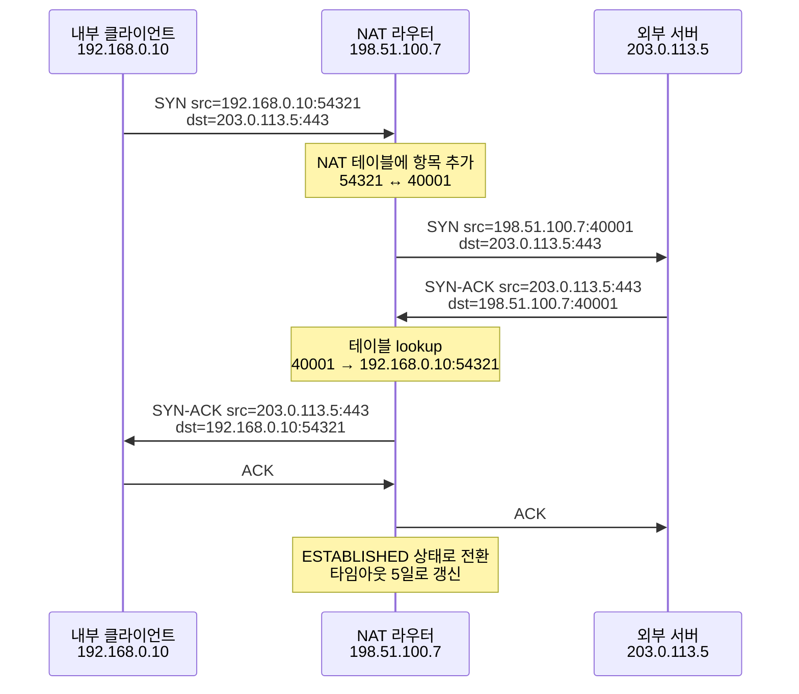

# NAT (Network Address Translation)

## 정의

NAT은 IP 패킷이 라우터를 통과할 때 출발지 또는 목적지 IP 주소를 바꿔치기하는 기술이다. 1990년대 IPv4 주소가 고갈되기 시작하면서 한 조직이 하나의 공인 IP 뒤에 수많은 사설 IP를 숨기는 용도로 퍼졌고, 지금은 가정용 공유기부터 통신사 백본까지 어디에나 들어가 있다. 사설 IP 대역(10.0.0.0/8, 172.16.0.0/12, 192.168.0.0/16)을 인터넷으로 내보내려면 반드시 거쳐야 하는 관문이다.

이름은 "주소 변환"이지만 실제로는 주소만 바꾸는 게 아니다. 대부분의 현대 NAT은 포트 번호까지 같이 바꾸는 NAPT(Network Address Port Translation, 흔히 PAT라고도 부른다)이고, 이걸 위해 라우터 내부에 패킷이 어디서 와서 어디로 가는지 추적하는 상태 테이블을 유지한다. 이 테이블이 NAT의 본질이고, 실무에서 발생하는 NAT 장애의 대부분이 이 테이블과 관련된다.

NAT은 원래 주소 절약이 목적이었지 보안 장비가 아니다. 그런데 외부에서 안으로 들어오는 연결을 기본적으로 차단하는 부수 효과 때문에 "방화벽 비슷한 것"으로 오해받는다. 실제로는 상태 테이블에 매칭되지 않는 inbound 패킷을 떨구는 동작일 뿐이고, NAT 자체는 보안 정책을 강제하는 장비가 아니다. 이 구분이 흐릿하면 보안 설계가 NAT에 의존하게 되고 IPv6로 넘어갔을 때 문제가 터진다.

---

## NAT이 하는 일을 한 패킷 단위로 보기

집에서 노트북(192.168.0.10)이 외부 웹서버(203.0.113.5)의 443 포트로 접속하는 상황을 생각해보자. 공유기의 공인 IP는 198.51.100.7이다.

노트북이 만들어 보내는 SYN 패킷의 헤더는 이렇다.

```
src: 192.168.0.10:54321
dst: 203.0.113.5:443
```

이 패킷이 공유기에 도착하면 공유기는 두 가지를 한다. 첫째, 내부 포트(54321)를 외부에서 쓸 포트로 매핑한다. 충돌이 없으면 54321을 그대로 쓰지만 다른 내부 단말이 이미 그 포트를 외부로 매핑했으면 다른 포트(예: 40001)를 할당한다. 둘째, 매핑 정보를 NAT 테이블에 기록한다.

| 내부 src | 외부 src | 목적지 | 프로토콜 | 만료 |
|----------|----------|--------|----------|------|
| 192.168.0.10:54321 | 198.51.100.7:40001 | 203.0.113.5:443 | TCP | 86400s |

그 다음 패킷의 출발지를 고쳐서 인터넷으로 내보낸다.

```
src: 198.51.100.7:40001
dst: 203.0.113.5:443
```

웹서버는 이 패킷이 어느 사설 IP에서 왔는지 모른다. 그냥 198.51.100.7:40001에서 왔다고 알고 응답한다.

```
src: 203.0.113.5:443
dst: 198.51.100.7:40001
```

공유기는 들어온 패킷의 목적지 IP:port를 NAT 테이블에서 역방향으로 찾는다. 매칭되는 항목이 있으면 목적지를 원래 사설 주소로 되돌려서 내부로 전달한다.

```
src: 203.0.113.5:443
dst: 192.168.0.10:54321
```

이게 NAT의 한 사이클이다. 핵심은 이 매핑 항목이 라우터 메모리에 살아 있는 동안만 트래픽이 흐른다는 점이다. 항목이 만료되거나 지워지면 그 다음 패킷은 어디로 가야 할지 모르는 상태가 되고, 보통은 RST나 무응답으로 끝난다.

---

## 1:1 NAT (Static NAT)

가장 단순한 형태다. 내부 사설 IP 하나와 외부 공인 IP 하나를 정적으로 매핑한다. 포트는 건드리지 않는다.

```
192.168.10.20 ↔ 198.51.100.20
192.168.10.21 ↔ 198.51.100.21
```

이 매핑은 라우터 설정 파일에 박혀 있고 트래픽 유무와 무관하게 항상 살아 있다. 외부에서 198.51.100.20의 어느 포트로 접속해도 192.168.10.20의 같은 포트로 들어간다. 사실상 외부에서 보면 그 서버가 공인 IP를 직접 갖고 있는 것처럼 보인다.

장점은 단순하고 양방향 통신이 자유롭다는 점이다. 외부에서 들어오는 연결이든 안에서 나가는 연결이든 똑같이 동작한다. 단점은 공인 IP가 사설 IP 개수만큼 필요해서 IPv4 주소 절약 목적과 정면으로 배치된다는 점이다. 그래서 1:1 NAT은 보통 DMZ에 둔 외부 공개 서버, 클라우드의 EIP(Elastic IP) 같은 곳에서만 쓴다. 일반 단말은 1:1 NAT을 쓰지 않는다.

클라우드에서 EC2 인스턴스에 Elastic IP를 붙이는 동작이 사실상 1:1 NAT이다. 인스턴스 자체는 사설 IP(예: 10.0.1.50)를 갖고 있고, VPC 라우터가 그걸 공인 IP(예: 54.x.x.x)와 정적으로 매핑한다. 인스턴스 내부에서 `ifconfig`를 쳐도 공인 IP가 안 보이는 이유가 이거다. 인스턴스는 자기가 공인 IP를 가졌다는 사실을 모른다.

---

## NAPT / PAT — 다수의 사설 IP를 하나의 공인 IP로

지금 우리가 일상에서 만나는 NAT은 거의 다 NAPT다. 가정용 공유기, 회사 방화벽, 모바일 캐리어 NAT까지 전부 이쪽이다. 시스코 용어로는 PAT(Port Address Translation), 리눅스 iptables 용어로는 MASQUERADE라고 부르는데 다 같은 개념이다.

NAPT의 핵심은 포트를 식별자로 쓴다는 점이다. 공인 IP 하나가 갖는 포트 범위(1~65535) 중 사용 가능한 것을 내부 연결마다 하나씩 할당해서, 같은 공인 IP를 수많은 내부 단말이 공유한다.

내부에 단말 두 대가 있다고 하자.

```
단말 A: 192.168.0.10
단말 B: 192.168.0.20
```

둘 다 같은 외부 서버 203.0.113.5:443에 접속한다. 우연히 둘 다 출발지 포트로 54321을 쓴다고 해도, 공유기는 외부로 내보낼 때 포트 충돌이 안 나도록 한쪽을 다른 포트로 바꾼다.

| 내부 | 외부 |
|------|------|
| 192.168.0.10:54321 → 203.0.113.5:443 | 198.51.100.7:40001 → 203.0.113.5:443 |
| 192.168.0.20:54321 → 203.0.113.5:443 | 198.51.100.7:40002 → 203.0.113.5:443 |

응답 패킷이 198.51.100.7:40001로 오면 단말 A로, 40002로 오면 단말 B로 라우팅한다. 외부 포트가 사실상 "내부 연결을 식별하는 번호표" 역할을 한다.

이 구조 때문에 NAPT은 외부에서 안으로 들어오는 연결을 받기 힘들다. 외부 단말이 198.51.100.7:80에 접속하려고 해도, 공유기 입장에서는 80번 포트로 들어온 inbound 패킷을 어느 내부 단말로 보내야 할지 알 수 없다. NAT 테이블에 80번 포트에 대한 매핑 항목이 없기 때문이다. 그래서 포트포워딩(static port forwarding)을 따로 설정해야 외부 공개 서버를 돌릴 수 있다. 공유기 관리 페이지에서 "외부 8080 → 내부 192.168.0.50:80" 같은 규칙을 만드는 게 이거다.

### NAPT의 매핑 동작 분류

NAPT이 외부 포트를 어떻게 할당하느냐에 따라 분류가 갈리고, 이게 P2P 통신 가능 여부를 결정한다. 자세한 P2P 관점은 [P2P.md](./P2P.md)에서 다루고, 여기서는 NAT 자체의 동작만 정리한다.

- **Full Cone NAT**: 같은 내부 (IP, 포트)에서 나가는 모든 트래픽이 같은 외부 (IP, 포트)로 매핑된다. 한 번 매핑이 생기면 외부 누구든 그 외부 포트로 패킷을 보낼 수 있다.
- **Restricted Cone NAT**: 같은 외부 포트로 매핑되지만, 응답은 이전에 안에서 나간 적이 있는 외부 IP에서 온 것만 통과시킨다.
- **Port-Restricted Cone NAT**: Restricted Cone에서 한 단계 더 빡빡하다. 외부 IP뿐 아니라 포트까지 일치하는 응답만 받는다.
- **Symmetric NAT**: 내부 (IP, 포트)가 같아도 목적지가 달라지면 외부 포트가 다르게 할당된다. STUN으로 알아낸 외부 포트가 다른 피어와의 통신에는 무용지물이 되어 홀펀칭이 거의 불가능하다.

가정용 공유기는 보통 Full Cone이나 Restricted Cone이고, 기업용 방화벽과 캐리어 NAT은 Symmetric이 많다. iptables의 MASQUERADE는 기본 동작상 Symmetric에 가깝다.

---

## NAT 테이블의 동작과 타임아웃

NAT 테이블은 영구 저장소가 아니라 라우터의 RAM에 올라가는 휘발성 상태다. 항목마다 만료 시간이 있고, 만료되면 지워진다. 만료 시간은 프로토콜에 따라 다르다.

리눅스 conntrack의 기본 타임아웃을 보자.

| 상태 | 타임아웃 |
|------|----------|
| TCP SYN_SENT | 120초 |
| TCP ESTABLISHED | 432000초 (5일) |
| TCP TIME_WAIT | 120초 |
| TCP CLOSE | 10초 |
| UDP unreplied | 30초 |
| UDP replied (stream) | 180초 |
| ICMP | 30초 |

이 표에서 두 가지를 봐야 한다.

첫째, TCP ESTABLISHED의 5일은 길어 보이지만 실제 가정용 공유기는 이보다 훨씬 짧다. 메모리 한계 때문이다. 시중 공유기들은 보통 30분에서 2시간 사이로 설정되어 있고, 명시적으로 끄지 않은 SSH 세션이 한 시간쯤 손 놓고 있으면 다음 키 입력에 멈춰버리는 흔한 원인이 이거다. 라우터 입장에서는 5일간 한 글자도 안 흐르는 TCP 연결이 만료된 거지만, 양 끝단은 여전히 ESTABLISHED라고 믿는다. 그 다음 패킷이 라우터에 도달하면 NAT 테이블 매칭에 실패해서 RST가 돌아오거나 그냥 drop된다.

둘째, UDP의 unreplied 30초가 까다롭다. UDP는 연결 개념이 없어서 NAT은 "나간 패킷에 대한 응답이 30초 안에 안 오면 매핑 항목을 지운다"는 식으로 동작한다. WebRTC나 게임 같이 짧은 UDP 패킷을 띄엄띄엄 주고받는 시스템은 이 30초가 매우 신경 쓰인다. 한쪽이 침묵하는 동안 NAT 매핑이 사라지면 다음 패킷이 안 들어온다.

그래서 UDP 기반 시스템은 keepalive 패킷을 주기적으로(보통 15~25초 간격) 보내서 NAT 매핑을 살려둔다. WebRTC의 ICE consent freshness, WireGuard의 `PersistentKeepalive` 옵션이 이 역할을 한다. WireGuard 클라이언트 설정에서 NAT 뒤에 있을 때 `PersistentKeepalive = 25`를 안 넣으면 한쪽에서 트래픽이 끊겼을 때 다시 안 붙는 문제가 자주 보고된다.

---

## conntrack — 리눅스에서 NAT의 실체

리눅스 라우터/방화벽에서 NAT을 한다면 그 실제 동작은 netfilter의 conntrack(connection tracking) 모듈이 한다. NAT 자체는 conntrack 위에 얹힌 보조 기능에 가깝다. conntrack이 패킷의 "연결"을 식별해서 테이블에 올리고, NAT은 그 항목에 변환 규칙을 덧붙이는 식으로 동작한다.

테이블 내용을 직접 볼 수 있다.

```bash
# 현재 추적 중인 연결 보기
conntrack -L

# 특정 IP의 연결만 보기
conntrack -L -s 192.168.0.10

# UDP 매핑만 보기
conntrack -L -p udp

# 통계 (CPU별 처리량, drop 수)
conntrack -S
```

출력 예시는 이렇게 생겼다.

```
tcp  6  431999 ESTABLISHED src=192.168.0.10 dst=203.0.113.5 sport=54321 dport=443 src=203.0.113.5 dst=198.51.100.7 sport=443 dport=40001 [ASSURED] mark=0 use=1
```

좌측이 내부에서 본 5-tuple, 우측이 외부에서 본 5-tuple이다. `[ASSURED]`는 양방향 패킷이 다 흘렀다는 표시고, 이 플래그가 붙으면 conntrack 테이블이 가득 찼을 때 마지막에 제거되는 항목이 된다.

conntrack 테이블 크기는 `/proc/sys/net/netfilter/nf_conntrack_max`에 설정되어 있다. 기본값은 메모리 크기에 따라 자동 계산되고, 보통 256K~1M 사이다. 트래픽이 많은 NAT 게이트웨이에서는 이 값을 모니터링해야 한다.

```bash
# 현재 사용량
cat /proc/sys/net/nf_conntrack_count

# 최대값
cat /proc/sys/net/netfilter/nf_conntrack_max

# 가득 차면 dmesg에 이런 메시지가 찍힌다
# nf_conntrack: table full, dropping packet
```

이 메시지가 보이면 그 시점에 신규 연결이 무차별 drop된다. 기존 ESTABLISHED 연결은 영향 없지만 새로 들어오는 연결과 신규 outbound 연결이 다 막힌다. 사용자 입장에서는 "갑자기 인터넷이 안 됐다가 잠시 후 풀린다"로 보인다.

타임아웃 값도 sysctl로 조정 가능하다.

```bash
# UDP stream 타임아웃 60초로 줄이기 (테이블 회전 빠르게)
sysctl -w net.netfilter.nf_conntrack_udp_timeout_stream=60

# TCP ESTABLISHED를 1시간으로 (장시간 idle TCP 정리)
sysctl -w net.netfilter.nf_conntrack_tcp_timeout_established=3600
```

쿠버네티스 노드에서는 kube-proxy가 iptables/ipvs로 서비스 라우팅을 하면서 conntrack을 대량으로 쓴다. 노드당 수만 개 Pod가 외부와 통신하면 nf_conntrack_max를 기본값으로 둔 채로는 금방 가득 찬다. kube-proxy가 부팅 시 이 값을 노드 메모리 비례로 자동 조정하긴 하지만, 트래픽이 폭증하는 워크로드면 따로 모니터링해야 한다.

---

## Hairpin NAT (NAT Loopback)

내부망에서 자기 공인 IP로 접속할 때 발생하는 문제다. 이게 자주 디버깅 시간을 잡아먹는다.

상황을 그려보자. 사무실 LAN(192.168.1.0/24)에 웹서버(192.168.1.50)가 있고, 공유기에 포트포워딩 규칙 `203.0.113.7:80 → 192.168.1.50:80`이 설정돼 있다. 외부에서 `http://203.0.113.7`로 접속하면 잘 된다. 그런데 같은 사무실의 노트북(192.168.1.30)에서 `http://203.0.113.7`로 접속하면 안 된다. 사설 IP `http://192.168.1.50`으로는 또 잘 된다.

원인은 이렇다. 노트북이 보낸 패킷의 출발지는 192.168.1.30, 목적지는 203.0.113.7이다. 이게 공유기에 도착하면 공유기는 포트포워딩 규칙에 따라 목적지를 192.168.1.50으로 바꿔서 웹서버로 보낸다. 패킷이 웹서버에 도착했을 때 출발지는 여전히 192.168.1.30이다. 같은 서브넷이니까 웹서버는 응답을 노트북으로 직접 보낸다. 공유기를 거치지 않고.

노트북이 받은 응답 패킷의 출발지는 192.168.1.50이다. 그런데 노트북은 203.0.113.7과 통신 중이라고 알고 있다. 자기가 보낸 SYN에 대한 SYN-ACK가 다른 IP에서 왔으니 노트북은 이걸 무관한 패킷으로 판단하고 버린다. TCP 연결이 안 맺어진다.

해결책은 공유기가 hairpin NAT(또는 NAT loopback)을 지원하면 된다. hairpin NAT은 위 상황에서 공유기가 패킷의 출발지까지 같이 바꾼다. 출발지를 자기 자신(공유기의 LAN 측 IP)으로 바꿔서 웹서버로 보내면, 웹서버는 응답을 공유기로 보내고, 공유기가 다시 NAT 역변환해서 노트북에 전달한다. 노트북 입장에서는 자기가 보낸 SYN의 응답이 203.0.113.7에서 정상적으로 온 것으로 보인다.

가정용 공유기 중 일부는 hairpin NAT을 지원하지 않거나 기본값에서 꺼져 있다. 그런 환경에서는 사내 DNS로 도메인을 사설 IP로 응답하게 하는 split-horizon DNS를 두는 게 일반적 우회책이다. 외부에서 `internal.example.com`을 조회하면 공인 IP가 나오고, 사내에서 조회하면 사설 IP가 나오는 식이다. 이러면 hairpin이 필요 없다.

쿠버네티스에서도 비슷한 현상이 있다. Pod가 자기 노드의 Service ClusterIP를 거쳐서 자기 자신과 통신할 때 hairpin 모드가 켜져 있어야 한다. kubelet의 `--hairpin-mode` 옵션(`promiscuous-bridge`/`hairpin-veth`/`none`)이 이걸 결정하고, 잘못 설정되면 Pod가 자기 자신과 통신할 때 패킷이 drop된다.

---

## Carrier-Grade NAT (CGNAT)

통신사가 가입자들에게 공인 IPv4를 못 나눠줘서 가입자 측 망 안에서 한 번 더 NAT을 두는 구조다. 가입자 모뎀이 받는 IP가 진짜 공인 IP가 아니라 통신사 내부의 사설 대역(보통 100.64.0.0/10)이고, 그게 통신사 측 NAT 장비에서 진짜 공인 IP로 한 번 더 변환된다.

집에서 보면 이중 NAT이 된다. 가정용 공유기가 첫 번째 NAT(사설 192.168.x.x → 100.64.x.x), 통신사 NAT이 두 번째 NAT(100.64.x.x → 진짜 공인 IP)이다. 모바일 캐리어(LTE/5G)는 더 흔하게 CGNAT을 쓴다.

CGNAT 환경의 실무적 영향은 이렇다.

**포트포워딩이 불가능하다.** 가입자가 자기 공유기에 포트포워딩을 설정해도, 통신사 NAT의 진짜 공인 IP는 다른 가입자들과 공유되어 있어서 외부에서 그 포트로 도달할 수 없다. 외부 공개 서버를 자기 집 회선으로 돌리는 게 불가능하거나, 통신사에 별도로 신청해서 공인 IP를 받아야 한다. 알뜰폰 사업자나 일부 모바일 회선은 아예 공인 IP 옵션이 없다.

**P2P 연결이 매우 어렵다.** 통신사 NAT은 거의 대부분 Symmetric이다. STUN으로 외부 포트를 알아낼 수 있어도 그 포트가 다른 피어와의 연결에는 쓸 수 없다. WebRTC 같은 P2P 시스템에서 CGNAT 사용자 비율이 높으면 TURN 릴레이 비용이 크게 늘어난다.

**한 공인 IP를 수많은 가입자가 공유하므로 IP 기반 추적/차단이 부정확하다.** 어떤 서비스가 IP rate limit을 걸면 CGNAT 뒤의 멀쩡한 사용자들이 다 같이 차단되는 경우가 있다. 반대로 어떤 IP에서 어뷰징이 들어왔을 때 그 IP만 차단하면 같은 CGNAT 뒤의 무관한 사용자도 다 같이 막힌다.

**로그 추적이 어렵다.** 통신사 NAT은 한 공인 IP의 한 포트를 시간 단위로 여러 가입자에게 돌려쓰기 때문에, 사후에 "어떤 시각의 어떤 IP:port를 누가 썼는지"를 알려면 NAT 로그가 필요하다. 통신사는 법적 요구에 대비해 이 로그를 보관하지만, 자체 추적 목적으로는 거의 못 쓴다.

IPv6가 CGNAT의 근본적인 해답이라 통신사들이 IPv6 듀얼스택을 늘리고 있긴 한데, IPv4가 사라지지 않는 한 CGNAT은 계속 남는다.

---

## NAT 동작을 한눈에

NAT 패킷 흐름을 시퀀스로 보면 이렇다.



이 흐름의 어디가 실무에서 깨지는지가 중요하다. 클라이언트가 SYN을 보낸 직후 라우터를 재부팅하면 매핑이 사라져서 응답이 와도 매칭에 실패한다. 양쪽이 한참 침묵하다가 다시 통신하려고 하면 매핑이 만료됐을 수 있다. 외부에서 먼저 패킷이 들어오면 매핑 자체가 없어서 라우터가 버린다. 이 세 가지가 NAT 장애의 80%다.

---

## 실무 장애 — 포트 고갈 (Port Exhaustion)

NAPT의 외부 포트 풀은 유한하다. 보통 1024~65535 범위에서 한 공인 IP당 약 64,000개의 포트를 쓸 수 있다. 그런데 NAT 테이블 항목은 (외부 IP, 외부 포트, 목적지 IP, 목적지 포트, 프로토콜) 5-tuple로 식별되기 때문에 같은 외부 포트도 목적지가 다르면 재사용할 수 있다. 그래서 실제 사용 가능한 항목 수는 훨씬 많다.

문제는 같은 목적지에 대량의 연결이 몰릴 때다. 회사 사내망 수만 명이 같은 외부 SaaS의 같은 IP:port에 접속하는 상황을 생각해보자. 5-tuple 중 (목적지 IP, 목적지 포트, 프로토콜)이 고정이고 (외부 IP)도 NAT 게이트웨이 하나로 고정이면, 식별자가 될 수 있는 건 외부 포트 하나뿐이다. 그러면 1024~65535 사이의 약 64K개가 한계가 된다.

AWS NAT Gateway가 이 한계로 자주 문제를 일으킨다. AWS 문서에 명시된 한계가 "고유 목적지당 약 55,000개 동시 연결"이고, 이걸 넘으면 신규 연결이 `ErrorPortAllocation` 메트릭으로 잡히면서 drop된다. 같은 S3 엔드포인트나 같은 RDS 엔드포인트에 수많은 Pod가 동시에 붙으면 도달한다. 해결은 NAT Gateway를 여러 개 두거나(서브넷별 분산), 가능한 경우 VPC Endpoint를 써서 NAT Gateway를 우회하는 것이다.

리눅스 NAT 박스의 경우 conntrack 테이블 자체가 가득 차는 것과 SNAT 포트 풀 고갈 두 가지가 따로 일어날 수 있다. iptables MASQUERADE는 SNAT을 동적으로 할당하면서 conntrack 항목을 만든다. 부하 테스트할 때 NAT 박스에서 새 연결이 갑자기 안 되면 다음 두 가지를 본다.

```bash
# conntrack 사용량
cat /proc/sys/net/nf_conntrack_count

# 포트 풀 상태 (TIME_WAIT 누적 등)
ss -s
```

TIME_WAIT가 많이 쌓인다면 NAT 박스의 `net.ipv4.ip_local_port_range`와 `net.ipv4.tcp_tw_reuse` 설정을 본다. 기본 포트 범위는 32768~60999인데 이걸 1024~65535로 넓히면 가용 포트가 두 배가 된다.

```bash
sysctl -w net.ipv4.ip_local_port_range="1024 65535"
sysctl -w net.ipv4.tcp_tw_reuse=1
```

다만 `tcp_tw_reuse`는 양날의 검이다. 같은 5-tuple로 너무 빨리 재연결하면 이전 연결의 잔여 패킷이 새 연결에 섞일 수 있다. NAT 환경에서 이게 발생할 확률은 낮지만 0이 아니다.

---

## 실무 장애 — NAT 뒤 서버의 응답 누락

NAT 뒤에 둔 내부 서버가 외부에 응답할 때 누락이 발생하는 패턴이다. 가장 흔한 형태는 비대칭 라우팅(asymmetric routing)이다.

회사망에 NAT 게이트웨이가 두 개(GW-A, GW-B) 있고 로드밸런서가 그 앞단에 있다고 하자. 내부 서버가 외부로 보낸 패킷은 GW-A를 통해 나갔는데 응답 패킷이 GW-B로 들어오면, GW-B의 NAT 테이블에는 그 연결의 매핑이 없으므로 패킷을 drop한다. 서버 입장에서는 보낸 요청에 응답이 오지 않는 현상으로 보이고, 외부 서비스 입장에서는 "응답을 보냈는데 받은 적 없다고 한다"는 모순이 생긴다.

이게 평소에는 잘 안 나타나다가 라우팅 변경, 게이트웨이 fallback, ECMP 해시 변경 같은 이벤트와 함께 갑자기 터진다. 회사망 라우팅이 단순할 때는 안 보이다가 멀티 리전이나 멀티 ISP 구성을 도입하면 나오기 시작한다. 해결은 connection-aware 라우팅(같은 연결의 패킷이 항상 같은 게이트웨이를 거치도록)이거나 NAT 상태를 게이트웨이끼리 동기화하는 것이다. 후자가 어려워서 보통 전자로 푼다.

또 다른 패턴은 NAT 뒤 서버의 응답이 시간차로 들어왔을 때다. 클라이언트가 NAT 매핑 만료 직후에 도착한 응답 패킷은 NAT 테이블 미스로 drop된다. 서버는 응답을 보냈고 NAT은 받았는데 클라이언트에는 안 들어오는 상황이다. 서버 로그에는 정상 응답이 찍히고 클라이언트 로그에는 타임아웃이 찍힌다. 디버깅하는 입장에서 양쪽 로그가 모순돼서 한참 헤매게 된다. 의심되면 NAT 박스에서 패킷 캡처를 떠야 한다.

```bash
# NAT 박스에서 특정 클라이언트 IP로 향하는 트래픽 잡기
tcpdump -i any -nn host 198.51.100.7 and port 443
```

---

## 실무 장애 — ALG가 필요한 프로토콜 (FTP, SIP, H.323)

NAT의 기본 가정은 "헤더의 IP/포트만 바꿔치기하면 된다"이다. 그런데 일부 프로토콜은 IP/포트를 페이로드 안에 다시 박아 넣는다. 이런 프로토콜은 NAT이 헤더만 바꿔서는 동작하지 않는다.

대표적인 게 FTP(Active mode)다. 클라이언트가 서버에 PORT 명령으로 "내 IP 192.168.0.10, 포트 5000번으로 데이터 보내라"고 알려준다. 그런데 192.168.0.10은 사설 IP라서 서버가 이걸 받아도 데이터 연결을 못 맺는다. 서버가 봐야 할 IP는 NAT의 공인 IP다.

이를 해결하는 게 ALG(Application Layer Gateway)다. NAT 라우터가 FTP 트래픽을 인식해서 PORT 명령의 페이로드 안에 박힌 IP/포트까지 같이 바꿔준다. 이 과정에서 동적으로 인바운드 포트포워딩 규칙까지 임시로 만들어서 서버가 들어오는 데이터 연결을 받을 수 있게 해준다.

ALG가 필요한 대표적인 프로토콜:

- **FTP** (Active/Passive 모드 둘 다)
- **SIP** (VoIP 시그널링, RTP 미디어 스트림과 분리되어 있어 NAT 처리가 복잡)
- **H.323** (구식 VoIP/화상회의)
- **PPTP** (GRE 터널, 포트 개념이 없어서 NAT이 특수 처리해야 함)
- **IRC DCC** (P2P 파일 전송)

ALG의 문제는 이중적이다. 첫째, ALG가 없으면 위 프로토콜들이 NAT 뒤에서 깨진다. 둘째, ALG가 잘못 동작하면 더 나쁘다. 시스코 IOS의 SIP ALG가 SIP 패킷을 잘못 만져서 VoIP 통화가 끊기는 사례가 유명하고, 일부 가정용 공유기의 FTP ALG가 TLS로 암호화된 FTPS 트래픽을 잘못 인식해서 연결을 망치는 경우도 있다.

실무에서 VoIP나 FTP를 다룬다면 공유기/방화벽의 SIP ALG, FTP ALG 옵션 위치를 먼저 확인한다. 켜져 있는데 동작이 이상하면 일단 꺼본다. 끄면 ALG 없이도 동작하도록 클라이언트 측에서 STUN으로 외부 주소를 알아내거나 Passive 모드로 우회하는 식의 처리가 가능하다.

SIP의 경우 ALG 대신 SBC(Session Border Controller)나 STUN/ICE를 쓰는 게 표준적인 해법이 되어가고 있다. FTP는 가능하면 Passive 모드로 쓰고, 그래도 안 되면 SFTP(SSH 기반)로 갈아탄다. SFTP는 단일 포트만 쓰기 때문에 NAT과 깨끗하게 호환된다.

---

## NAT과 보안의 관계

NAT이 방화벽 역할을 한다는 통념은 절반만 맞다. NAT은 외부에서 안으로 들어오는 패킷을 매핑 항목이 없으면 버린다. 부수적으로 외부 스캔이나 무차별 inbound 공격으로부터 내부 호스트를 가려주는 효과가 있다. 그래서 가정용 공유기 뒤의 PC가 직접 공인 IP를 가졌을 때보다 더 안전해 보이는 게 사실이다.

하지만 이건 보안 정책의 산물이 아니라 NAT의 부수 효과일 뿐이다. 다음 경우들에서 NAT은 보호 장치가 되지 못한다.

- 안에서 밖으로 나간 연결의 응답은 그대로 들어온다. 내부 PC가 악성 사이트에 접속하면 응답으로 받은 페이로드는 NAT을 그대로 통과한다.
- 포트포워딩으로 열어둔 포트는 NAT의 보호를 받지 않는다. 그 포트 뒤의 서버가 자기 보안을 책임져야 한다.
- 같은 NAT 뒤의 내부 단말끼리는 NAT을 거치지 않으므로 서로에 대해 무방비다. 회사 LAN의 동료 PC가 감염되면 NAT은 아무 일도 못한다.
- UPnP를 켜두면 내부 단말이 NAT 라우터에 포트포워딩을 자유롭게 요청해서 열 수 있다. 악성코드가 이걸 악용한다.

그래서 NAT을 보안 장비로 의존하면 안 되고, 별도의 방화벽 정책이 필요하다. IPv6 환경으로 가면 NAT이 사라지면서 모든 내부 단말이 공인 주소를 갖게 되는데, 이때 NAT의 부수적 보호 효과에 익숙해진 보안 설계가 그대로 노출되어 문제가 생긴다. IPv6 라우터는 NAT 대신 stateful firewall로 inbound를 차단하는 정책을 기본으로 깐다.

---

## NAT과 IPv6

IPv6는 주소 공간이 2^128로 사실상 무한하기 때문에 IPv4의 NAT처럼 주소를 절약할 필요가 없다. 그래서 IPv6 NAT(NAT66)은 표준이지만 권장되지 않는다. RFC 4864는 "IPv6 환경에서 NAT의 부수 효과(주소 가리기, 토폴로지 숨김)를 다른 방법으로 대체하라"고 명시한다.

실무에서 IPv6를 도입하면 NAT을 끊고 stateful firewall로 가는 게 정석이다. 그런데 NAT 관성이 강해서 일부 조직은 IPv6에도 NAT66을 두기도 한다. 이건 기술적으로는 가능하지만 IPv6의 설계 의도와 맞지 않고, 디버깅을 어렵게 만든다. P2P, 멀티캐스트, 모바일 IPv6 같은 기능이 NAT 없는 환경을 전제로 설계되어 있어서 NAT66을 끼면 그 이점을 못 받는다.

NAT64는 또 다른 이야기다. IPv6-only 클라이언트가 IPv4 서버와 통신해야 할 때 쓰는 변환 메커니즘이고, 통신사가 IPv6 듀얼스택을 도입할 때 자주 등장한다. 클라이언트는 IPv6 주소만 갖고 있고, NAT64 게이트웨이가 IPv6 ↔ IPv4 변환을 한다. 이때 DNS64가 짝으로 동작해서 IPv4 도메인 응답을 합성 IPv6 주소로 바꿔준다. 모바일 캐리어(특히 미국 T-Mobile, 한국 일부 5G 망)에서 IPv6-only로 동작하는 단말이 점점 늘고 있고, 그런 환경에서 IPv4 전용 외부 API에 접속할 때 NAT64를 거친다.

---

## 정리하면서 다음 단계

NAT은 IPv4 부족을 메우는 임시방편으로 시작했지만 30년 가까이 인터넷 구조의 기본 가정에 들어가 있다. 백엔드 개발자 입장에서 NAT을 직접 설정할 일은 드물지만, NAT이 만드는 부작용은 자주 만난다. WebSocket이 30초마다 한 번씩 끊긴다거나, AWS NAT Gateway 비용이 갑자기 치솟는다거나, 사내망에서 자기 서비스의 공인 도메인으로 접속이 안 된다거나 하는 문제는 다 NAT의 동작에서 출발한다.

NAT 자체보다 NAT 테이블의 만료, 포트 고갈, ALG 오작동, hairpin 미지원 같은 운영 이슈를 인지하는 게 더 중요하다. 시스템을 새로 설계할 때 keepalive 간격을 NAT 타임아웃보다 짧게 잡고, 같은 외부 엔드포인트에 몰리는 연결 수를 미리 계산하고, 서비스 도메인을 사내외에서 다르게 해석하도록 split DNS를 두는 식의 사전 대비가 NAT 환경의 안정성을 좌우한다.

P2P 관점의 NAT Traversal(STUN/TURN/홀펀칭)은 [P2P.md](./P2P.md)에서 자세히 다룬다. NAT 뒤에서 양방향 통신을 만들어야 하는 시나리오면 그쪽을 같이 본다.
