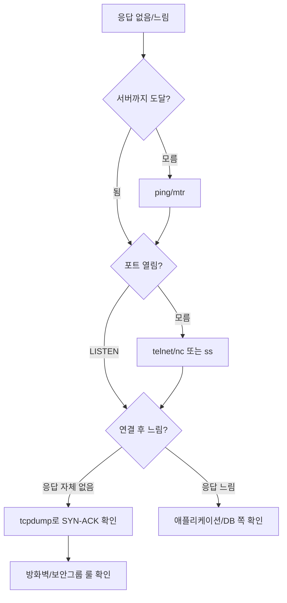

# 네트워크 기초 — 백엔드 개발자가 실제로 마주치는 것들

서버가 죽었다고 해서 모든 장애가 서버 코드 문제는 아니다. 5년 정도 백엔드를 하다 보면, 코드는 멀쩡한데 네트워크 때문에 새벽에 호출되는 일이 더 많다. 헬스체크는 200을 반환하는데 외부에서는 타임아웃이 나고, 같은 VPC 안에서는 응답이 빠른데 다른 리전에서 호출하면 800ms가 찍히고, 방화벽 룰 한 줄 때문에 배포 직후 SLA가 깨진다. 이 문서는 OSI 7계층, TCP/IP, DNS 같은 개별 주제로 들어가기 전에 알아야 하는 토대를 한 번에 모아둔 진입 문서다. 각 항목은 깊이 들어가지 않고, 실제로 장애를 잡을 때 떠올려야 할 수준만 적었다.

## LAN과 WAN의 실무적 구분

LAN과 WAN을 교과서적으로는 "범위로 구분한다"고 배우지만, 백엔드 입장에서는 **레이턴시 특성과 신뢰도 모델이 다르다**고 보는 편이 정확하다.

LAN(Local Area Network)은 같은 건물·같은 데이터센터·같은 VPC 안의 통신이다. RTT(Round Trip Time)가 1ms 미만이고, 패킷 손실이 거의 없다고 가정해도 된다. 사내 DB 호출, 같은 K8s 클러스터 안의 파드 간 통신이 여기에 속한다. 코드에서 connection timeout을 1초로 잡아도 거의 문제가 없는 환경이다.

WAN(Wide Area Network)은 데이터센터를 넘어가는 모든 통신이다. 서울 리전에서 도쿄 RDS를 부르거나, 클라이언트가 모바일 LTE로 API를 부르는 경우다. RTT는 수십~수백ms, 패킷 손실도 0이 아니다. WAN 호출에 LAN과 같은 timeout·retry를 설정하면 첫 장애가 났을 때 그대로 폭발한다.

실무에서 헷갈리는 케이스는 클라우드다. AWS 기준으로:

- 같은 AZ의 EC2 ↔ EC2: LAN으로 봐도 됨 (보통 RTT 0.5ms 이하)
- 같은 리전, 다른 AZ: LAN과 WAN의 중간 (RTT 1~2ms, AZ 간 트래픽 비용이 붙음)
- 리전 간(서울 ↔ 도쿄): WAN (RTT 30~40ms)
- 리전 간(서울 ↔ 버지니아): 명백한 WAN (RTT 180ms 내외)

리전 간 호출을 동기로 묶어둔 코드는 거의 항상 사고를 부른다. 외부 API 호출은 서울→도쿄 정도만 되어도 인프라 레이턴시가 비즈니스 로직 시간을 넘어간다.

## 회선 교환과 패킷 교환

전통적인 전화망은 회선 교환(circuit switching) 방식이다. 통화 시작 시점에 발신자~수신자 사이에 물리 회선을 할당하고, 통화가 끝날 때까지 그 회선을 점유한다. 회선이 살아 있는 동안에는 대역폭이 보장되지만, 통화가 없어도 회선이 점유되어 있어 자원이 낭비된다.

인터넷은 패킷 교환(packet switching)이다. 데이터를 작은 패킷으로 잘라서, 각 패킷이 독립적으로 라우팅된다. 같은 출발지·목적지의 패킷이라도 경로가 달라질 수 있고, 도착 순서도 바뀔 수 있다. 회선 점유가 없으니 자원 효율은 좋지만, 대역폭이 보장되지 않고 패킷 손실·순서 뒤바뀜·중복이 발생한다.

이 차이가 백엔드에서 왜 중요한가? **TCP가 하는 일이 결국 "패킷 교환망 위에서 회선 교환의 환상을 만드는 것"이기 때문이다.** TCP는 순서 보장·재전송·중복 제거를 처리해서, 애플리케이션 입장에서는 마치 전용 회선이 있는 것처럼 동작하게 한다. 그래서 네트워크가 나빠지면 TCP 레이어에서 retransmission이 폭증하고, 이게 애플리케이션 응답 시간으로 그대로 튄다.

패킷 손실 1%만 나도 TCP throughput은 절반 이하로 떨어진다. 단순히 "어쩌다 패킷 하나 빠지는 정도"가 아니라, congestion control이 발동하면서 윈도우 크기가 줄어들기 때문이다. 모니터링에서 응답 시간 분포의 P99가 갑자기 뛰면, 가장 먼저 의심해야 할 게 패킷 손실이다.

## 성능 지표 — 무엇이 다른가

네트워크 성능 이야기를 할 때 단어를 섞어 쓰는 사람이 많은데, 의미가 다르다.

**대역폭(Bandwidth)** 은 단위 시간당 전송할 수 있는 최대 데이터량이다. 1Gbps 회선은 이론상 초당 1Gbit를 흘릴 수 있다. 하드디스크의 용량 같은 개념이라 보면 된다. 큰 파일을 옮길 때 중요하다.

**처리량(Throughput)** 은 실제로 흐르는 데이터량이다. 1Gbps 회선이라도 실효 처리량은 700Mbps일 수 있다. TCP 오버헤드, 혼잡, 상대편 처리 속도 때문에 대역폭의 100%를 쓰는 건 거의 불가능하다.

**지연시간(Latency, RTT)** 은 패킷이 출발해서 응답이 돌아올 때까지 걸리는 시간이다. 대역폭과 무관하게 결정된다. 서울~버지니아는 광속의 한계 때문에 아무리 좋은 회선을 깔아도 RTT가 180ms 밑으로 안 내려간다. API 호출이 100번 직렬로 일어나면, 100 * 180ms = 18초가 그냥 사라진다.

**지터(Jitter)** 는 지연시간의 변동폭이다. 평균 RTT가 50ms인데 어떤 패킷은 30ms에 오고 어떤 건 200ms에 오면 지터가 큰 것이다. VoIP·영상통화·게임에서 치명적이지만, 일반 HTTP API에서도 P99 응답 시간을 결정하는 핵심 요소다.

**패킷 손실(Packet Loss)** 은 보낸 패킷 중 도착하지 않은 비율이다. TCP는 손실을 재전송으로 메우지만, 그 과정에서 처리량이 급락한다. 0.1% 손실이라도 long fat network(대역폭 크고 RTT 큰 회선)에서는 처리량이 절반 이하로 떨어진다.

대역폭을 늘려도 RTT는 안 줄어든다. 5년차쯤 되면 인프라팀에 "회선 좀 늘려달라"고 요청하기 전에, 진짜 문제가 대역폭인지 RTT인지부터 본다. 한국 사용자가 미국 서버를 호출해서 느린 건 회선 문제가 아니라 거리 문제다. 회선을 10배 키워도 안 빨라진다. 답은 CDN·엣지 배치다.

## 포트와 소켓 — 코드에서 보이는 것과 OS가 보는 것

포트는 "프로세스를 식별하는 16비트 숫자"다. 0~65535 중 0~1023은 well-known(루트 권한 필요), 1024~49151은 registered, 49152~65535는 dynamic/ephemeral이다.

소켓은 흔히 `(IP, Port)` 쌍으로 설명되지만, 실제로는 **5튜플**로 식별된다.

```
(protocol, local_ip, local_port, remote_ip, remote_port)
```

이게 왜 중요한가? 같은 서버 포트 8080에 클라이언트 100만 명이 동시에 붙어도, 각 연결의 5튜플이 다르기 때문에 OS가 구분한다. "포트 하나에 동시 접속 6만 5천 개 한계"라는 말은 잘못된 이해다. 그 한계는 클라이언트 측에서 같은 서버로 갈 때만 적용된다(클라이언트 ephemeral port가 부족해짐). 서버 측은 포트 하나로 수십만 연결을 받는 게 정상이다.

그런데도 서버가 "Address already in use"를 자주 뱉는 이유는 `TIME_WAIT` 때문이다. TCP 연결을 끊은 쪽은 `TIME_WAIT` 상태로 60초(리눅스 기본 2*MSL)간 5튜플을 점유한다. 배포 직후 서버를 재시작했는데 바로 안 뜨는 게 이 때문이다. 해결은 `SO_REUSEADDR` 소켓 옵션이고, 운영 서버는 이게 설정되어 있어야 한다.

```python
import socket

s = socket.socket(socket.AF_INET, socket.SOCK_STREAM)
s.setsockopt(socket.SOL_SOCKET, socket.SO_REUSEADDR, 1)
s.bind(("0.0.0.0", 8080))
s.listen(128)
```

리눅스에서 소켓을 너무 많이 열면 `Too many open files` 에러가 난다. 파일 디스크립터 한도 때문이다. ulimit으로 늘려줘야 한다.

```bash
# 현재 한도 확인
ulimit -n

# 영구 설정 (/etc/security/limits.conf)
*  soft  nofile  65536
*  hard  nofile  65536
```

systemd 환경이면 service 파일에 `LimitNOFILE=65536`을 따로 박아야 한다. ulimit만 고치고 systemd 설정을 안 건드려서, 배포된 서비스가 여전히 1024 한도로 뜨는 사고가 흔하다.

## NAT — 사설 IP가 공용 인터넷에 나가는 방법

집 공유기 뒤의 노트북, 회사 사무실의 PC, 클라우드 사설 서브넷의 EC2 — 모두 사설 IP(10.x, 172.16~31.x, 192.168.x)를 가진다. 이 IP는 인터넷에서 라우팅되지 않는다. 그런데 어떻게 외부 서버에 접속할까? NAT(Network Address Translation)가 있기 때문이다.

NAT는 사설 IP를 공인 IP로 바꿔서 내보낸다. 가장 흔한 형태가 PAT(Port Address Translation, 또는 NAPT)인데, IP뿐 아니라 포트도 같이 바꾼다.

```
사설망 클라이언트 192.168.1.10:54321
        ↓
NAT 게이트웨이 (공인 203.0.113.5)
        ↓ (출발지를 203.0.113.5:38492로 바꿔서 송신)
인터넷 서버 1.2.3.4:443

응답이 203.0.113.5:38492 로 오면
NAT가 매핑 테이블 보고 192.168.1.10:54321 로 다시 돌려보냄
```

이 매핑 테이블이 NAT의 핵심이고, 동시에 한계다. 매핑은 일정 시간(보통 TCP 3600초, UDP 30~120초) 후 만료된다. 만료 후 외부에서 들어오는 패킷은 갈 곳이 없어서 버려진다.

백엔드에서 자주 겪는 문제가 **NAT idle timeout으로 죽는 long-lived connection**이다. DB 커넥션 풀, gRPC 스트리밍, 메시지 큐 컨슈머가 NAT 뒤에 있으면, 트래픽이 없는 동안 NAT가 매핑을 지워버린다. 클라이언트는 연결이 살아있다고 믿고 다음 쿼리를 보내는데, NAT가 모르는 5튜플이라 그냥 버려진다. 클라이언트는 TCP keepalive가 만료될 때까지(보통 2시간) 응답을 기다리다가 타임아웃 난다.

해결은 애플리케이션 레벨 keepalive를 짧게(NAT timeout보다 짧게, 보통 30~60초) 보내는 것이다. PostgreSQL이라면 `tcp_keepalives_idle`, gRPC라면 `KEEPALIVE_TIME_MS`다. AWS NAT Gateway는 idle timeout이 350초로 고정이라 이보다 짧게 잡아야 한다.

### 포트 포워딩

NAT는 기본적으로 outbound만 처리한다. 외부에서 사설망 안 서버로 직접 들어올 수는 없다. 들어오게 하려면 **포트 포워딩**으로 매핑을 미리 박아두어야 한다.

```
공인 IP 203.0.113.5:8080 → 사설 IP 192.168.1.50:8080
```

집에서 NAS 외부 접속할 때 공유기 설정하는 게 이거다. 클라우드에서는 ELB·NLB·Public IP가 같은 역할을 한다.

## 방화벽이 트래픽을 막는 실제 사례

방화벽 룰 때문에 멈추는 케이스는 몇 가지 패턴이 있다. 코드 의심하기 전에 먼저 봐야 한다.

**케이스 1. inbound는 열려있는데 outbound가 막힘.** 사내 망에서 AWS S3로 업로드하는 배치 잡을 짰는데, 개발 PC에서는 잘 되고 사내 서버에서는 안 됨. 사내 방화벽이 outbound 443을 화이트리스트로만 허용하는데, S3 도메인이 거기 없는 것이다. 회사마다 outbound proxy를 강제하는 곳도 있어서, `HTTP_PROXY`·`HTTPS_PROXY` 환경변수를 안 잡으면 connect timeout이 난다.

**케이스 2. SYN은 가는데 SYN-ACK이 안 옴.** tcpdump로 잡아 보면 SYN은 나가는데 응답이 없다. 보통 두 가지다. 서버 쪽 보안 그룹이 inbound를 막은 경우, 또는 stateful 방화벽에서 reverse path가 차단된 경우. AWS 보안 그룹은 stateful이라 outbound만 열어두면 응답이 알아서 돌아오지만, NACL은 stateless라 양방향을 다 열어야 한다. NACL을 잘못 건드려서 응답이 막히는 사고가 자주 난다.

**케이스 3. 처음에는 되는데 한참 후에 끊김.** 위에서 설명한 NAT idle timeout이거나, 방화벽의 connection tracking timeout이다. iptables의 conntrack 테이블에는 5튜플별로 타임아웃이 있고, idle 상태로 오래 두면 만료된다.

**케이스 4. ICMP만 막힘.** ping은 안 되는데 실제 HTTP는 잘 된다. 보안 정책상 ICMP를 차단하는 환경이 있다. 그래서 ping으로 "서버가 살아있나" 판단하는 건 신뢰할 수 없다. 헬스체크는 실제 서비스 포트로 TCP 또는 HTTP 레벨에서 해야 한다.

iptables 룰 확인은 이렇게 본다.

```bash
# 현재 룰 보기
sudo iptables -L -n -v

# NAT 테이블
sudo iptables -t nat -L -n -v

# conntrack 상태
sudo conntrack -L | head -20
```

`-n`을 안 붙이면 IP를 DNS 역조회하느라 한참 걸린다. 운영에서 룰 확인할 때는 항상 `-n`을 붙인다.

## 네트워크 토폴로지 — 스타와 메시

네트워크 토폴로지는 노드들이 어떻게 연결되어 있는지의 구조다. 백엔드 입장에서 자주 마주치는 건 두 가지다.

**스타(Star) 토폴로지** 는 중앙 허브를 통해 모든 노드가 연결된다. 한국의 일반 사무실 LAN, 가정용 무선 공유기 뒤의 환경이 다 스타다. 허브가 죽으면 전체가 죽지만, 노드 하나가 죽어도 다른 노드에 영향이 없다. 관리도 단순하다. 마이크로서비스 아키텍처에서 API 게이트웨이를 중심에 두는 구조도 논리적으로 스타다.

**메시(Mesh) 토폴로지** 는 노드들이 서로 직접 연결된다. 풀 메시는 N개 노드에 N(N-1)/2개 링크가 필요해서 노드가 많아지면 비현실적이다. 부분 메시가 현실적이다. 서비스 메시(Istio, Linkerd)에서 마이크로서비스끼리 사이드카 프록시로 직접 통신하는 구조가 부분 메시에 가깝다.

스타는 단순하지만 중앙이 SPOF(Single Point of Failure)다. 메시는 회복력이 좋지만 연결 관리·보안 정책이 복잡해진다. 5년 정도 시스템을 만들어 보면, 처음에는 모놀리스라 스타가 자연스럽다가, 마이크로서비스로 쪼개면서 메시 비슷한 구조로 넘어가고, 운영 비용이 폭증해서 다시 게이트웨이 중심으로 돌아오는 패턴을 자주 본다.

## 트러블슈팅 명령어 — 실제 출력으로 보기

이론은 이쯤 하고, 실제로 장애 났을 때 치는 명령어를 본다.

### ping — L3 도달성 확인

가장 기본이지만 한계도 명확하다. ICMP가 막혀 있으면 결과가 의미 없고, 실제 서비스 포트가 아닌 호스트 자체의 응답만 본다. 그래도 평균 RTT와 패킷 손실은 빠르게 확인할 수 있다.

```bash
$ ping -c 5 google.com
PING google.com (142.250.207.78): 56 data bytes
64 bytes from 142.250.207.78: icmp_seq=0 ttl=115 time=33.412 ms
64 bytes from 142.250.207.78: icmp_seq=1 ttl=115 time=32.901 ms
64 bytes from 142.250.207.78: icmp_seq=2 ttl=115 time=34.221 ms
64 bytes from 142.250.207.78: icmp_seq=3 ttl=115 time=33.110 ms
64 bytes from 142.250.207.78: icmp_seq=4 ttl=115 time=33.554 ms

--- google.com ping statistics ---
5 packets transmitted, 5 packets received, 0.0% packet loss
round-trip min/avg/max/stddev = 32.901/33.439/34.221/0.443 ms
```

`stddev`(표준편차)가 평균 대비 크면 지터가 심한 것이다. 위 예시는 stddev 0.443ms라 매우 안정적이다. 0.0% packet loss와 안정적인 RTT는 회선이 정상이라는 뜻이다.

### traceroute — 경로 추적

도달은 되는데 느릴 때, 어느 홉에서 막히는지 본다.

```bash
$ traceroute -n google.com
traceroute to google.com (142.250.207.78), 64 hops max
 1  192.168.1.1  1.234 ms  0.987 ms  1.102 ms
 2  10.123.0.1  3.456 ms  3.221 ms  3.789 ms
 3  203.0.113.45  5.678 ms  5.432 ms  5.890 ms
 4  * * *
 5  108.170.244.97  28.123 ms  28.456 ms  28.789 ms
 6  142.250.207.78  33.412 ms  33.221 ms  33.554 ms
```

`* * *`은 그 홉이 ICMP TTL exceeded 응답을 안 보내는 것이다. 막힌 게 아니라 응답을 안 할 뿐일 수도 있다. 그 다음 홉이 정상 응답하면 경로 자체는 살아있는 것이다. 특정 홉에서 갑자기 RTT가 100ms 이상 뛴다면, 거기가 병목 구간이다.

리눅스에서는 `mtr`이 더 유용하다. ping과 traceroute를 합친 것 같은 도구로, 각 홉의 패킷 손실률을 실시간으로 보여준다.

```bash
$ mtr -n -c 50 google.com
                              Packets               Pings
 Host                       Loss%   Snt   Avg  Best  Wrst StDev
 1. 192.168.1.1              0.0%    50   1.2   0.9   2.1   0.3
 2. 10.123.0.1               0.0%    50   3.5   3.2   4.8   0.4
 3. 203.0.113.45              2.0%    50   5.7   5.3   8.1   0.6
 4. 108.170.244.97            0.0%    50  28.1  27.8  29.5   0.5
 5. 142.250.207.78            0.0%    50  33.4  33.0  34.2   0.4
```

3번 홉에서 2% 손실이 뜬다면 그 라우터가 병목이거나 ICMP rate limit 때문일 수 있다. 다음 홉이 정상이면 후자에 가깝다.

### netstat / ss — 소켓 상태

netstat은 옛날 도구고, 요즘 리눅스는 `ss`가 표준이다. ss가 훨씬 빠르다. 운영 서버에 수만 개 연결이 있으면 netstat은 몇 초씩 걸린다.

```bash
# LISTEN 상태인 모든 TCP 소켓
$ ss -tlnp
State    Recv-Q   Send-Q   Local Address:Port    Peer Address:Port   Process
LISTEN   0        128            0.0.0.0:22           0.0.0.0:*       users:(("sshd",pid=1234,fd=3))
LISTEN   0        128            0.0.0.0:8080         0.0.0.0:*       users:(("java",pid=5678,fd=87))
LISTEN   0        128          127.0.0.1:5432         0.0.0.0:*       users:(("postgres",pid=2345,fd=5))

# ESTABLISHED 연결 수 세기 (포트별)
$ ss -tn state established | awk '{print $4}' | awk -F: '{print $NF}' | sort | uniq -c | sort -rn
   1247 8080
     34 5432
      8 22

# TIME_WAIT 소켓이 너무 많을 때
$ ss -tn state time-wait | wc -l
12489
```

`Recv-Q`가 계속 차 있으면 애플리케이션이 패킷을 못 따라가고 있다는 뜻이다. `Send-Q`가 차 있으면 상대방이 ack를 안 보내거나 윈도우가 닫혀있는 것이다. 둘 다 0에 가까운 게 정상이다.

장애 진단할 때 가장 먼저 보는 게 `ss -s`다.

```bash
$ ss -s
Total: 1289
TCP:   1456 (estab 1247, closed 192, orphaned 0, timewait 178)

Transport Total     IP        IPv6
RAW       0         0         0
UDP       8         8         0
TCP       1264      1264      0
INET      1272      1272      0
FRAG      0         0         0
```

`timewait`가 수만 개씩 쌓여 있으면 ephemeral port 고갈이 가까워졌다는 신호다.

### tcpdump — 진짜로 패킷이 가고 있는지

위의 모든 도구가 안 된다면 마지막은 tcpdump다. 패킷 자체를 보는 거라 거짓말을 못 한다.

```bash
# 8080 포트로 가는 트래픽만 캡처, 호스트별로 분류
$ sudo tcpdump -i any -n 'port 8080' -c 20
14:23:01.123456 IP 10.0.1.5.54321 > 10.0.2.10.8080: Flags [S], seq 1234567890, win 65535, length 0
14:23:01.124012 IP 10.0.2.10.8080 > 10.0.1.5.54321: Flags [S.], seq 9876543210, ack 1234567891, win 65535, length 0
14:23:01.124456 IP 10.0.1.5.54321 > 10.0.2.10.8080: Flags [.], ack 1, win 65535, length 0
14:23:01.124789 IP 10.0.1.5.54321 > 10.0.2.10.8080: Flags [P.], seq 1:401, ack 1, win 65535, length 400
```

`Flags [S]`는 SYN, `[S.]`는 SYN-ACK, `[.]`는 ACK, `[P.]`는 PSH+ACK(데이터 전송), `[F.]`는 FIN이다. 위 출력은 정상적인 3-way handshake 후 클라이언트가 데이터 400바이트를 보낸 모습이다.

SYN만 나가고 SYN-ACK이 안 오면 서버가 못 받거나 응답을 못 보내는 것이다. 방화벽·보안그룹부터 의심한다. SYN-ACK이 왔는데 그 다음 ACK이 없으면 클라이언트 쪽 문제다.

장시간 캡처해서 와이어샤크로 분석하려면 파일로 저장한다.

```bash
$ sudo tcpdump -i any -n 'port 8080' -w /tmp/dump.pcap
# Ctrl+C로 종료 후 와이어샤크에서 dump.pcap 열기
```

운영 서버에서 tcpdump를 너무 오래 돌리면 디스크가 차거나 CPU에 부담이 가니 `-c`(패킷 수 제한)나 `-G`(파일 로테이션)를 같이 쓰는 게 안전하다.

### 도구 선택 흐름

장애가 났을 때 보통 이 순서로 친다.



## 기존 문서로의 연결

이 문서는 진입점이다. 깊이 들어가려면 디렉토리 안의 개별 문서를 본다.

- 계층 모델과 각 계층 역할: `7 Layer/`
- TCP·UDP·HTTP 등 프로토콜 개별 동작: `Protocol/`
- DNS·도메인 이름 해석: `Domain/`
- 게이트웨이·로드밸런서: `GateWay/`
- 프록시·리버스 프록시: `Proxy/`
- TLS·인증서·보안 토픽: `Security/`
- 라우팅 동작: `라우팅.md`
- VPN·SSH 터널: `Tunneling.md`

장애 대응을 시작하기 전에 이 문서로 돌아와서 "지금 보고 있는 게 어느 레이어 문제인가"부터 정리하면, 헛수고가 줄어든다.
