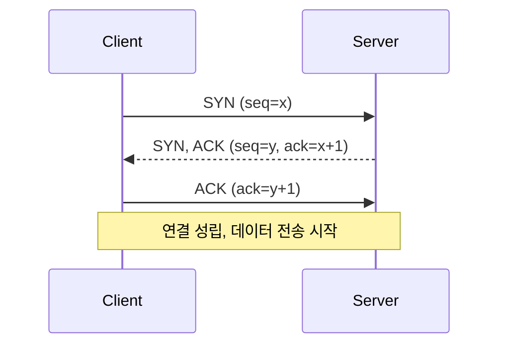

# tcpdump 패킷 캡처와 분석

애플리케이션 로그만으로는 안 잡히는 문제가 있다. "타임아웃이 났는데 상대 서버 로그에는 요청이 안 보인다", "커넥션이 자꾸 끊긴다", "응답은 200인데 클라이언트가 못 받았다고 한다" 같은 상황. 이럴 때는 결국 와이어 위에서 실제로 무슨 패킷이 오갔는지를 봐야 답이 나온다. tcpdump는 그걸 보는 도구다.

여기서는 tcpdump 필터 문법, 캡처한 파일을 Wireshark로 넘겨서 분석하는 방법, TCP 재전송·RST·핸드셰이크 실패를 패킷에서 읽어내는 법, 그리고 운영 서버에서 캡처할 때 디스크와 성능을 어떻게 챙기는지를 다룬다.

## tcpdump가 보는 것

tcpdump는 커널의 패킷 필터(리눅스는 AF_PACKET, BPF)에 붙어서 NIC를 지나는 프레임을 그대로 복사해 온다. 애플리케이션 계층 위에서 동작하는 게 아니라 그 아래에서 본다. 그래서 TLS로 암호화된 페이로드는 못 읽지만, TCP 핸드셰이크·재전송·윈도우·RST 같은 전송 계층의 사실은 전부 보인다. 문제가 애플리케이션에 있는지 네트워크에 있는지를 가르는 데는 이 정도만으로 충분한 경우가 많다.

기본 실행은 인터페이스와 필터를 주는 형태다.

```bash
# eth0에서 80번 포트로 오가는 패킷을 화면에 출력
tcpdump -i eth0 -n port 80
```

`-n`을 빼면 tcpdump가 IP를 호스트명으로, 포트를 서비스명으로 역변환하려고 DNS를 친다. 캡처 중에 DNS 조회가 끼어들면 출력이 느려지고, 그 DNS 트래픽 자체가 캡처에 섞여서 헷갈린다. 운영에서 캡처할 때는 `-nn`을 거의 항상 붙인다(`-nn`은 포트 이름 변환까지 끈다).

```bash
tcpdump -i eth0 -nn port 443
```

인터페이스 이름이 헷갈리면 `tcpdump -D`로 목록을 본다. `any`를 주면 모든 인터페이스를 한꺼번에 잡는데, 이 경우 링크 계층 헤더가 표준 이더넷 형식이 아니라서 일부 필터가 다르게 동작하는 경우가 있다. 가능하면 실제 인터페이스를 지정하는 게 깔끔하다.

## 필터 문법 (BPF)

tcpdump 필터는 BPF(Berkeley Packet Filter) 문법이다. 커널 수준에서 거르기 때문에, 필터를 잘 쓰면 애초에 관심 없는 패킷은 유저 공간으로 올라오지도 않는다. 운영 서버에서 이건 성능 차이로 직결된다. 트래픽 많은 서버에서 필터 없이 `tcpdump -i eth0` 한 줄 잘못 치면 부하가 확 오른다.

### host, net, port

가장 많이 쓰는 세 가지다.

```bash
# 특정 호스트와 오가는 모든 패킷
tcpdump -nn host 10.0.1.50

# 출발지 또는 목적지를 따로 지정
tcpdump -nn src host 10.0.1.50
tcpdump -nn dst host 10.0.1.50

# 서브넷 단위
tcpdump -nn net 10.0.1.0/24

# 포트
tcpdump -nn port 5432
tcpdump -nn src port 5432      # 출발지 포트가 5432 (DB 응답)
tcpdump -nn dst port 5432      # 목적지 포트가 5432 (DB 요청)

# 포트 범위
tcpdump -nn portrange 8000-8100
```

### 논리 연산자로 조합

`and`(`&&`), `or`(`||`), `not`(`!`)로 묶는다. 실무에서는 거의 항상 조합해서 쓴다. "이 DB로 가는 우리 앱 서버 트래픽만" 같은 식으로 좁혀야 노이즈가 줄어든다.

```bash
# 특정 호스트의 5432 포트 트래픽만
tcpdump -nn host 10.0.1.50 and port 5432

# 두 호스트 사이 트래픽
tcpdump -nn host 10.0.1.50 and host 10.0.2.30

# 5432나 6379 중 하나
tcpdump -nn port 5432 or port 6379

# SSH는 빼고 보기 (캡처를 SSH로 하고 있을 때 자기 트래픽 제외)
tcpdump -nn host 10.0.1.50 and not port 22
```

SSH로 접속한 채 캡처하면 내가 친 명령과 그 출력이 다시 SSH 패킷으로 잡혀서 무한히 늘어나는 경우가 있다. `and not port 22` 또는 `and not host <내 IP>`를 습관적으로 붙이는 게 좋다.

### TCP 플래그 필터

여기서부터가 트러블슈팅의 핵심이다. TCP 헤더의 플래그 비트를 직접 거를 수 있다. `tcp[tcpflags]`로 플래그 바이트를 가리키고, 비트 이름은 `tcp-syn`, `tcp-ack`, `tcp-fin`, `tcp-rst`, `tcp-push`, `tcp-urg`다.

```bash
# SYN이 켜진 패킷 (연결 시도 + 응답)
tcpdump -nn 'tcp[tcpflags] & tcp-syn != 0'

# SYN만 켜지고 ACK는 꺼진 순수 연결 요청 (핸드셰이크 첫 패킷)
tcpdump -nn 'tcp[tcpflags] & (tcp-syn|tcp-ack) == tcp-syn'

# RST가 켜진 패킷 (연결 거부/강제 종료)
tcpdump -nn 'tcp[tcpflags] & tcp-rst != 0'

# FIN이 켜진 패킷 (정상 종료 시작)
tcpdump -nn 'tcp[tcpflags] & tcp-fin != 0'
```

작은따옴표로 감싸는 이유는 `&`, `|`, 괄호가 셸 메타문자라서다. 안 감싸면 셸이 먼저 해석해서 엉뚱하게 동작한다.

`tcp[tcpflags] & X != 0`은 "X 비트가 켜진 패킷"이고, `tcp[tcpflags] & (A|B) == A`는 "A는 켜지고 B는 꺼진 패킷"이다. 후자가 순수 SYN만 잡을 때 쓰는 형태다. SYN-ACK까지 포함하면 연결이 성립했는지 안 했는지가 안 보인다.

RST만 거르는 필터는 연결 문제 잡을 때 제일 먼저 친다. RST가 어느 방향에서 누구한테서 오는지만 봐도 절반은 풀린다.

### 페이로드 길이로 거르기

데이터가 실제로 실린 패킷만 보고 싶을 때가 있다. 순수 ACK(데이터 없는 빈 ACK)를 빼는 식이다.

```bash
# IP 전체 길이에서 IP헤더+TCP헤더를 빼서 페이로드가 있는 TCP 패킷만
tcpdump -nn 'tcp and (ip[2:2] - ((ip[0]&0xf)<<2) - ((tcp[12]&0xf0)>>2)) != 0'
```

이건 외우기 어렵고 자주 쓰지도 않는다. 보통은 Wireshark로 넘겨서 거기서 거른다. tcpdump 단계에서는 host/port/flags 조합까지만 하고, 세밀한 분석은 GUI에서 한다.

## 파일로 저장하고 Wireshark로 분석

화면에 흘려보면서 보는 건 한계가 명확하다. 패킷이 빠르게 지나가고, 스크롤백도 안 되고, 여러 스트림이 섞이면 눈으로 못 따라간다. 실무에서는 거의 항상 파일로 떨군 다음 Wireshark로 연다.

```bash
# pcap 파일로 저장 (-w)
tcpdump -i eth0 -nn host 10.0.1.50 and port 5432 -w /tmp/db.pcap
```

`-w`로 저장할 때는 화면에 패킷 내용이 안 나오고 캡처된 개수만 카운트된다. 저장 파일은 바이너리 pcap 포맷이라 `cat`으로 못 본다. 다시 읽으려면 `-r`을 쓴다.

```bash
# 저장한 파일을 다시 tcpdump로 읽기 (필터 다시 적용 가능)
tcpdump -nn -r /tmp/db.pcap 'tcp[tcpflags] & tcp-rst != 0'
```

`-r`로 읽을 때도 BPF 필터를 다시 줄 수 있다. 일단 넓게 캡처해서 파일로 받고, 읽을 때 좁히는 방식이 안전하다. 캡처 시점에 필터를 너무 좁게 걸었다가 정작 필요한 패킷을 놓치는 것보다, 디스크 여유가 있으면 넓게 받아두는 편이 낫다.

### 스냅 길이와 전체 페이로드

tcpdump는 기본적으로 패킷 앞부분만 잘라서 캡처할 수 있다. 옛날 기본값은 잘렸지만 요즘 버전은 기본이 262144바이트라 사실상 전체를 받는다. 헤더만 필요하면 `-s`로 잘라서 파일 크기를 줄인다.

```bash
# 헤더만 (96바이트면 IP+TCP 헤더는 충분히 커버)
tcpdump -i eth0 -nn -s 96 port 443 -w /tmp/headers.pcap

# 전체 페이로드 명시
tcpdump -i eth0 -nn -s 0 port 8080 -w /tmp/full.pcap
```

`-s 0`은 "자르지 말고 전체"라는 뜻이다. HTTP 본문이나 평문 프로토콜 내용까지 봐야 하면 `-s 0`으로 받아야 한다. 스냅 길이를 너무 짧게 잡으면 Wireshark에서 "Packet size limited during capture"가 뜨면서 본문 분석이 안 된다.

### Wireshark로 옮겨서 보기

파일을 받았으면 로컬로 가져와서 Wireshark로 연다.

```bash
# 운영 서버에서 캡처한 파일을 로컬로 복사
scp prod-server:/tmp/db.pcap ./
```

Wireshark에서 자주 쓰는 표시 필터(display filter)는 tcpdump의 BPF와 문법이 다르다. 헷갈리기 쉬운데, Wireshark 표시 필터는 점 표기법이다.

| 목적 | tcpdump (BPF) | Wireshark (표시 필터) |
|---|---|---|
| 특정 호스트 | `host 10.0.1.50` | `ip.addr == 10.0.1.50` |
| 목적지 포트 | `dst port 5432` | `tcp.dstport == 5432` |
| RST 패킷 | `tcp[tcpflags] & tcp-rst != 0` | `tcp.flags.reset == 1` |
| SYN 패킷 | `tcp[tcpflags] & tcp-syn != 0` | `tcp.flags.syn == 1` |
| 재전송 | (BPF로 불가) | `tcp.analysis.retransmission` |

마지막 줄이 중요하다. 재전송은 BPF만으로는 못 거른다. 재전송 여부는 시퀀스 번호를 추적해서 같은 데이터가 다시 왔는지를 봐야 알 수 있는데, 이건 상태를 들고 있어야 하는 분석이라 tcpdump의 무상태 필터로는 안 된다. Wireshark는 스트림을 따라가면서 `tcp.analysis.retransmission`, `tcp.analysis.duplicate_ack` 같은 걸 자동으로 표시해 준다. 그래서 "재전송이 일어났나"는 질문은 거의 항상 Wireshark에서 답한다.

Wireshark에서 패킷 하나를 우클릭해서 "Follow > TCP Stream"을 누르면 그 커넥션의 전체 주고받은 내용을 하나로 모아서 보여준다. 평문 HTTP면 요청·응답이 그대로 읽힌다. 어떤 커넥션이 문제인지 잡았으면 이걸로 흐름 전체를 본다.

## 패킷에서 문제 읽어내기

### 핸드셰이크 성공과 실패

정상적인 TCP 연결은 3-way 핸드셰이크로 시작한다. SYN → SYN-ACK → ACK. tcpdump 출력에서 이게 보이면 연결 자체는 됐다는 뜻이다.



tcpdump 실제 출력은 이렇게 보인다.

```
10:12:03.001 IP 10.0.2.30.51234 > 10.0.1.50.5432: Flags [S], seq 1000
10:12:03.002 IP 10.0.1.50.5432 > 10.0.2.30.51234: Flags [S.], seq 8000, ack 1001
10:12:03.002 IP 10.0.2.30.51234 > 10.0.1.50.5432: Flags [.], ack 8001
```

`[S]`가 SYN, `[S.]`가 SYN-ACK(점이 ACK), `[.]`가 순수 ACK다. `[R]`은 RST, `[F]`는 FIN, `[P]`는 PSH다. 이 세 줄이 차례로 보이면 핸드셰이크 성공이다.

핸드셰이크 실패는 패턴이 몇 가지로 갈린다.

**SYN만 가고 응답이 없다.** 클라이언트가 SYN을 보냈는데 SYN-ACK가 안 온다. 그리고 잠시 후 같은 SYN이 또 나간다(SYN 재전송). 이건 보통 상대 서버까지 패킷이 안 닿거나, 방화벽이 조용히 드롭하고 있다는 신호다. 방화벽이 거부(reject)면 RST나 ICMP가 오는데, 그냥 버리면(drop) 아무것도 안 온다. 그래서 "SYN만 반복해서 나가고 무응답"이면 경로 어딘가에서 드롭되고 있다고 본다.

```
10:12:03.001 IP 10.0.2.30.51234 > 10.0.1.50.5432: Flags [S], seq 1000
10:12:04.001 IP 10.0.2.30.51234 > 10.0.1.50.5432: Flags [S], seq 1000
10:12:06.001 IP 10.0.2.30.51234 > 10.0.1.50.5432: Flags [S], seq 1000
```

1초, 2초… 간격이 벌어지면서 SYN이 재시도되는 게 보인다. 상대 SYN-ACK가 한 줄도 없다.

**SYN에 RST로 응답이 온다.** 포트가 안 열려 있거나 서비스가 안 떠 있다. 상대 호스트까지는 패킷이 닿았는데, 해당 포트에서 듣는 프로세스가 없으면 커널이 RST로 거절한다.

```
10:12:03.001 IP 10.0.2.30.51234 > 10.0.1.50.5432: Flags [S], seq 1000
10:12:03.002 IP 10.0.1.50.5432 > 10.0.2.30.51234: Flags [R.], seq 0, ack 1001
```

SYN 보냈더니 바로 `[R.]`이 돌아온다. "Connection refused"의 정체가 이거다. 애플리케이션이 안 떠 있거나, 떠 있어도 다른 포트에서 듣고 있거나, listen 백로그가 꽉 찼을 때 이런 RST가 온다.

### RST의 의미 구분

RST는 한 가지 의미가 아니다. 언제 어느 방향에서 오느냐로 원인이 갈린다.

연결 시도(SYN) 직후의 RST는 위에서 본 "포트 안 열림"이다. 반면 이미 연결돼서 데이터가 오가던 중에 갑자기 RST가 나오면 다른 얘기다. 한쪽이 비정상 종료했거나(애플리케이션 크래시, OOM 킬), 커넥션을 강제로 끊었거나(타임아웃 설정으로 서버가 idle 커넥션을 RST로 정리), 방화벽/로드밸런서가 중간에 끼어들어 끊은 경우다.

```
# 데이터 주고받던 중간에 갑자기 RST
10:15:20.100 IP 10.0.1.50.5432 > 10.0.2.30.51234: Flags [P.], seq 8000:8100, ack 1500
10:15:20.101 IP 10.0.2.30.51234 > 10.0.1.50.5432: Flags [.], ack 8100
10:15:45.000 IP 10.0.1.50.5432 > 10.0.2.30.51234: Flags [R.], seq 8100, ack 1500
```

마지막 RST의 타임스탬프를 보면 직전 패킷에서 25초가 떴다. 25초 동안 조용하다가 서버가 RST를 보냈다. 이러면 서버나 중간 장비(LB, 방화벽)의 idle timeout을 의심한다. 클라이언트 커넥션 풀이 죽은 커넥션을 재사용하려다 "Connection reset by peer"를 맞는 전형적인 패턴이다. 커넥션 풀의 idle 검증 주기나 최대 수명을 중간 장비 타임아웃보다 짧게 잡으면 해결되는 경우가 많다.

RST 방향도 본다. 서버 IP에서 나온 RST면 서버 쪽 사정(앱 종료, 타임아웃)이고, 클라이언트에서 나온 RST면 클라이언트가 끊은 거다. HTTP 클라이언트 라이브러리가 응답을 다 안 받고 커넥션을 닫으면 클라이언트발 RST가 보인다.

### 재전송 판독

재전송은 패킷이 중간에 유실됐거나 ACK가 제때 안 와서 송신 측이 같은 데이터를 다시 보낸 거다. 적당한 재전송은 정상이지만, 비율이 높으면 경로 어딘가에 문제가 있다. 패킷 로스, 혼잡, MTU 불일치 같은 게 원인이다.

tcpdump 출력만으로는 재전송을 알아보기 어렵다. 같은 시퀀스 번호가 두 번 나오면 재전송이긴 한데, 빠르게 흐르는 출력에서 시퀀스를 눈으로 비교하긴 힘들다. 그래서 재전송은 Wireshark에서 본다.

```
# Wireshark 표시 필터
tcp.analysis.retransmission           # 재전송된 패킷
tcp.analysis.fast_retransmission      # 빠른 재전송 (중복 ACK 3개 후)
tcp.analysis.duplicate_ack            # 중복 ACK
tcp.analysis.lost_segment             # 유실 추정 구간
```

Wireshark는 이걸 검정 배경에 빨간 글씨로 강조해 준다. 재전송이 띄엄띄엄 몇 개면 무시해도 되지만, 특정 커넥션에서 연달아 뜨거나 전체 패킷 중 비율이 높으면(대략 1%만 넘어도 체감 성능이 떨어진다) 네트워크 경로를 의심한다.

MTU 문제로 인한 재전송은 패턴이 특이하다. 작은 패킷은 잘 가는데 큰 패킷만 계속 재전송되면 경로 중간의 MTU가 작아서 큰 프레임이 드롭되고 있을 수 있다. 특히 터널링(VPN, 오버레이 네트워크)이 끼면 헤더가 추가되면서 MTU 여유가 줄어 이런 일이 생긴다.

중복 ACK가 연달아 보이면 수신 측이 "기대한 시퀀스가 안 왔다"고 계속 신호하는 거고, 송신 측이 중복 ACK 3개를 받으면 타임아웃을 안 기다리고 바로 다시 보낸다(빠른 재전송). Wireshark에서 중복 ACK 뒤에 빠른 재전송이 따라붙는 패턴이 보이면 그 구간에서 패킷 하나가 유실됐다고 읽는다.

## 운영 서버에서 캡처할 때

개발 환경에서야 마음대로 캡처해도 되지만, 트래픽 받는 운영 서버에서는 캡처 자체가 사고로 이어질 수 있다. 두 가지를 항상 챙긴다. 디스크와 성능.

### 디스크가 먼저 찬다

`-w`로 저장하면 파일이 계속 커진다. 트래픽 많은 서버에서 `-s 0`으로 전체 캡처를 걸어두고 잊어버리면 몇 분 만에 수 GB가 쌓이고, 디스크가 꽉 차면 그때부터는 캡처가 아니라 서비스가 죽는다. 로그를 못 써서 애플리케이션이 멈추는 식이다.

그래서 운영에서는 항상 파일을 돌려쓰는 옵션을 건다.

```bash
# 파일당 100MB로 자르고(-C), 최대 10개만 유지(-W)
tcpdump -i eth0 -nn host 10.0.1.50 and port 5432 \
  -s 0 -C 100 -W 10 -w /tmp/capture.pcap
```

`-C 100`은 파일이 100MB가 되면 새 파일로 넘어가고, `-W 10`은 파일을 10개까지만 유지하면서 가장 오래된 걸 덮어쓴다. 이렇게 하면 최대 사용량이 1GB로 묶인다. 링 버퍼처럼 동작해서 디스크가 무한정 차는 일이 없다.

시간 기준으로 자르려면 `-G`를 쓴다.

```bash
# 60초마다 새 파일, 파일명에 타임스탬프
tcpdump -i eth0 -nn port 443 -G 60 -w /tmp/cap-%Y%m%d-%H%M%S.pcap
```

`-G`와 함께 `-W`를 주면 시간 기준 링 버퍼가 된다. 패킷 개수로 끊고 싶으면 `-c`를 쓴다. `-c 10000`이면 1만 개 잡고 자동으로 멈춘다. "잠깐만 떠서 증상 한 번 잡고 끝낼" 때 `-c`가 편하다. 켜놓고 깜빡할 일이 없다.

캡처는 가능하면 `/tmp`이나 별도 볼륨처럼 서비스 데이터와 분리된 곳에 쓴다. 같은 디스크에 쓰면 캡처가 서비스 IO와 경쟁하고, 꽉 찼을 때 같이 죽는다.

### 성능 부담

tcpdump가 부하를 주는 지점은 두 곳이다. 패킷을 커널에서 유저 공간으로 복사하는 비용, 그리고 파일로 쓰는 디스크 IO. 트래픽이 많을수록 둘 다 커진다.

부하를 줄이는 첫 번째는 BPF 필터를 좁히는 거다. 필터는 커널에서 적용되니까, 관심 없는 패킷이 유저 공간으로 안 올라오게 막으면 복사 비용 자체가 준다. `tcpdump -i eth0` 같은 무필터 캡처를 트래픽 많은 서버에서 돌리는 건 피한다. 반드시 host와 port로 좁힌다.

두 번째는 헤더만 받는 거다. 페이로드 분석이 필요 없으면 `-s 96`으로 잘라서 복사·저장량을 줄인다. RST/재전송/핸드셰이크만 볼 거면 본문이 필요 없으니 헤더만으로 충분하다.

세 번째는 화면 출력을 끄는 거다. `-w`로 파일에 쓰면 패킷을 사람이 읽는 텍스트로 변환하는 비용이 안 든다. 화면에 흘리면서 보는 건 변환·출력 비용이 추가로 든다. 운영에서는 무조건 `-w`로 파일에 받고, 분석은 나중에 따로 한다.

```bash
# 운영 서버 캡처 권장 형태: 필터 좁힘 + 헤더만 + 링버퍼 + 개수 제한
tcpdump -i eth0 -nn 'host 10.0.1.50 and port 5432' \
  -s 128 -C 100 -W 5 -c 500000 \
  -w /tmp/db-issue.pcap
```

이렇게 하면 특정 호스트·포트만, 헤더 위주로, 최대 500MB, 최대 50만 패킷까지만 받고 멈춘다. 잠깐 떠서 증상을 잡는 용도로는 이 정도가 안전하다.

### 권한과 흔적

tcpdump는 raw 소켓을 열어야 해서 root나 `CAP_NET_RAW` 권한이 필요하다. 운영 서버에서 sudo로 돌릴 텐데, 캡처 파일에 평문 트래픽이 그대로 담긴다는 걸 잊으면 안 된다. 평문 HTTP면 헤더의 토큰, 쿠키, 인증 정보가 pcap에 다 남는다. 분석 끝나면 파일을 지운다. 로컬로 옮긴 pcap도 마찬가지다. 민감 정보가 담긴 캡처 파일을 정리 안 하고 방치하는 게 의외로 흔한 사고다.

캡처를 백그라운드로 돌렸으면 끝나고 프로세스가 살아있는지 확인한다. `-c`나 `-W` 없이 띄운 tcpdump를 nohup으로 백그라운드에 넣고 잊으면, 며칠 뒤 디스크 알람으로 그 존재를 알게 된다.

## 자주 쓰는 한 줄 모음

상황별로 바로 꺼내 쓰는 형태를 정리해 둔다.

```bash
# 연결이 안 된다 - SYN/RST만 보면서 핸드셰이크 추적
tcpdump -nn 'host 10.0.1.50 and (tcp[tcpflags] & (tcp-syn|tcp-rst) != 0)'

# 커넥션이 끊긴다 - RST와 FIN 추적
tcpdump -nn 'host 10.0.1.50 and (tcp[tcpflags] & (tcp-rst|tcp-fin) != 0)'

# 특정 DB로 가는 트래픽 전체를 파일로 (분석은 나중에)
tcpdump -i eth0 -nn 'host 10.0.1.50 and port 5432' -s 0 -C 100 -W 5 -w /tmp/db.pcap

# DNS 조회 확인 (이름 해석이 의심될 때)
tcpdump -nn -i eth0 'udp port 53'

# 특정 호스트로 가는 ICMP (ping/unreachable)
tcpdump -nn -i eth0 'icmp and host 10.0.1.50'

# 저장한 파일에서 RST만 다시 추려보기
tcpdump -nn -r /tmp/db.pcap 'tcp[tcpflags] & tcp-rst != 0'
```

tcpdump로 캡처해서 좁히고, 파일로 받아서 Wireshark로 따라가는 흐름이 거의 모든 네트워크 트러블슈팅의 기본 동선이다. 핸드셰이크가 되는지, RST가 어디서 오는지, 재전송이 얼마나 일어나는지. 이 세 개를 패킷에서 읽어내면 "네트워크 문제냐 애플리케이션 문제냐"는 대부분 그 자리에서 갈린다.
