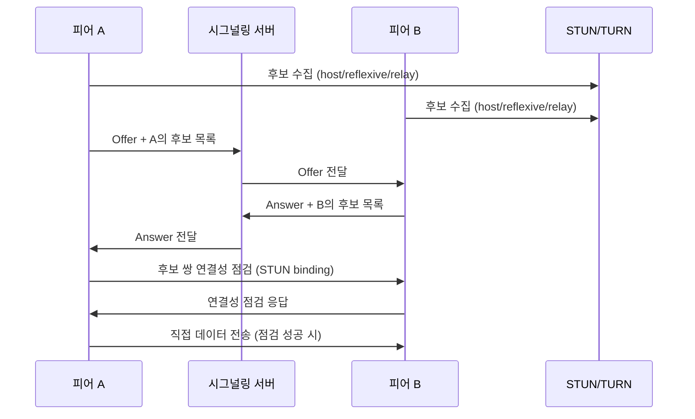

# P2P (Peer-to-Peer) 네트워크

## 정의

P2P는 참여 노드(피어)가 서버이자 클라이언트로 동시에 동작하는 네트워크 구조다. 한쪽이 자원을 제공하고 다른 쪽이 소비하는 역할이 고정되지 않는다. A가 B에게 파일을 보내는 순간 A는 서버지만, 같은 순간 C에게서 다른 조각을 받으면 클라이언트다. 역할이 연결 단위, 심지어 데이터 조각 단위로 계속 바뀐다.

클라이언트/서버(C/S) 모델과 비교하면 차이가 분명해진다. C/S에서는 모든 트래픽이 중앙 서버를 거친다. 클라이언트끼리는 서로의 존재조차 모르고, 통신하려면 반드시 서버를 경유한다. 채팅 메시지 하나도 발신자 → 서버 → 수신자로 두 번 흐른다. 서버는 모든 상태의 단일 출처(single source of truth)이자 단일 장애점(SPOF)이다.

P2P는 이 중앙을 없애거나 최소화한다. 피어끼리 직접 연결을 맺으면 데이터가 서버를 거치지 않는다. 1000명이 같은 파일을 받을 때 C/S라면 서버 대역폭이 1000배로 필요하지만, P2P에서는 먼저 받은 피어가 다른 피어에게 나눠주므로 참여자가 늘수록 전체 가용 대역폭도 같이 늘어난다. 이게 BitTorrent가 인기 파일일수록 빨라지는 이유다.

대신 대가가 있다. 중앙 서버가 사라지면 "누가 무엇을 가졌는가"를 관리할 주체도 사라진다. 피어를 어떻게 찾을 것인가(피어 발견), 수시로 들어오고 나가는 피어를 어떻게 추적할 것인가(처닝, churn), 신뢰할 수 없는 피어가 거짓 데이터를 보내면 어떻게 검증할 것인가 같은 문제를 분산 환경에서 풀어야 한다. C/S에서는 서버가 한 번에 해결하던 일이다.

```
C/S 모델                         순수 P2P 모델
                                
   [Server]                      [Peer]───[Peer]
   /  |  \                         |  \   /  |
  /   |   \                        |   \ /   |
[C]  [C]  [C]                    [Peer]─X─[Peer]
                                   |   / \   |
모든 트래픽이 서버 경유            피어끼리 직접 연결
서버 다운 = 전체 마비             일부 피어 다운돼도 동작
```

현실의 시스템 대부분은 순수 C/S도 순수 P2P도 아니다. 시그널링은 서버로 하고 데이터는 P2P로 흘리는 WebRTC, 트래커 서버로 피어 목록을 받되 파일 전송은 피어끼리 하는 BitTorrent처럼 두 모델을 섞는다. P2P를 "서버가 아예 없는 것"으로 이해하면 실무에서 헷갈린다. 핵심은 데이터 평면(data plane)이 피어 직결이냐 서버 경유냐다.

---

## P2P 구조 분류

P2P 시스템은 "피어를 어떻게 찾고 인덱스를 어디에 두느냐"로 갈린다. 데이터 전송은 어느 쪽이든 피어끼리 하지만, 그 피어를 찾기까지의 구조가 다르다.

### 중앙집중형 인덱스 (냅스터 방식)

가장 단순한 형태다. 중앙 서버는 "누가 어떤 파일을 가졌는지" 인덱스만 관리하고, 실제 파일 전송은 피어끼리 직접 한다. 1999년 냅스터가 이 구조였다.

동작은 이렇다. 피어가 접속하면 자기가 가진 파일 목록을 서버에 등록한다. 다른 피어가 "yesterday.mp3"를 검색하면 서버는 그 파일을 가진 피어들의 IP를 돌려준다. 검색을 요청한 피어는 받은 IP로 직접 TCP 연결을 맺어 파일을 받는다. 서버는 전화번호부 역할만 하고 실제 통화는 당사자끼리 한다.

장점은 검색이 빠르고 정확하다는 점이다. 서버가 전체 인덱스를 가지므로 한 번 조회로 모든 보유 피어를 안다. 단점은 그 서버가 SPOF라는 점이다. 냅스터는 이 중앙 서버 때문에 법적으로 셧다운당했다. 인덱스 서버 하나만 막으면 전체 네트워크가 멈춘다.

```javascript
// 냅스터 방식 인덱스 서버 (개념 구현)
const net = require('net');

// fileHash -> Set of "ip:port"
const index = new Map();

const server = net.createServer((socket) => {
  socket.on('data', (buf) => {
    const msg = JSON.parse(buf.toString());

    if (msg.type === 'ANNOUNCE') {
      // 피어가 보유 파일을 등록
      for (const hash of msg.files) {
        if (!index.has(hash)) index.set(hash, new Set());
        index.get(hash).add(`${msg.ip}:${msg.port}`);
      }
    }

    if (msg.type === 'SEARCH') {
      // 파일 보유 피어 목록만 응답. 실제 전송은 관여하지 않는다
      const peers = [...(index.get(msg.fileHash) || [])];
      socket.write(JSON.stringify({ type: 'PEERS', peers }));
    }
  });
});

server.listen(6699);
```

### 순수 분산형 (가십/플러딩)

중앙 서버를 아예 없앤다. 인덱스를 가진 곳이 없으므로 검색을 네트워크 전체에 퍼뜨린다. 그누텔라(Gnutella) 0.4가 이 방식이었다.

피어가 검색 쿼리를 보내면 자기가 아는 이웃 피어들에게 전달하고, 받은 피어는 다시 자기 이웃에게 전달한다. 이렇게 쿼리가 물결처럼 퍼지는 걸 플러딩(flooding)이라 한다. 무한히 퍼지면 네트워크가 마비되므로 TTL(Time To Live)을 둬서 일정 홉(hop)을 넘으면 쿼리를 버린다. 보통 TTL 7이면 7단계까지만 전파된다.

```
플러딩 (TTL=2):

      [A] 검색 시작
     /  |  \
   [B] [C] [D]      ← 1홉 (TTL 2→1)
   / \      |
 [E] [F]   [G]      ← 2홉 (TTL 1→0, 여기서 멈춤)
```

가십(gossip) 프로토콜은 플러딩을 확률적으로 다듬은 것이다. 모든 이웃에게 보내는 대신 무작위로 고른 일부 피어에게만 전달한다. 전염병이 퍼지듯 결국 전체에 도달하지만 트래픽이 훨씬 적다. Cassandra가 노드 간 멤버십·장애 정보를 퍼뜨릴 때 이 방식을 쓴다.

순수 분산형은 SPOF가 없어 죽이기 어렵다. 하지만 검색이 비싸다. TTL 안에 답이 없으면 그 파일은 못 찾고, 쿼리 하나가 수백 개 메시지로 증폭된다. 그누텔라 초기에 검색 트래픽이 대역폭을 다 잡아먹어 확장성 문제가 컸다. 이 비효율을 푼 게 뒤에 나오는 DHT다.

### 하이브리드 (슈퍼노드)

순수 분산형의 검색 비효율과 중앙집중형의 SPOF 사이를 절충한다. 모든 피어를 동등하게 두지 않고, 성능 좋고 네트워크가 안정적인 일부 피어를 슈퍼노드(supernode)로 승격시킨다. 그누텔라 0.6, 카자(KaZaA), 초기 스카이프가 이 구조였다.

일반 피어(leaf node)는 가까운 슈퍼노드 하나에 붙어서 자기 파일 목록을 넘긴다. 슈퍼노드는 자기에게 붙은 리프들의 인덱스를 들고 있다가, 슈퍼노드끼리만 쿼리를 주고받는다. 검색 범위가 전체 피어가 아니라 슈퍼노드들로 줄어 플러딩 비용이 크게 떨어진다. 슈퍼노드는 동적으로 선출되므로 하나가 죽어도 리프들이 다른 슈퍼노드로 재접속한다. 중앙집중형처럼 단일 서버에 의존하지 않는다.

| 구조 | 인덱스 위치 | 검색 비용 | SPOF | 대표 사례 |
|------|-----------|----------|------|----------|
| 중앙집중형 | 중앙 서버 | 낮음 (O(1) 조회) | 있음 | 냅스터 |
| 순수 분산형 | 없음 (플러딩) | 높음 (메시지 폭증) | 없음 | 그누텔라 0.4 |
| 하이브리드 | 슈퍼노드 분산 | 중간 | 부분적 | 카자, 초기 스카이프 |
| 구조화 P2P(DHT) | 키 해시로 분산 | 낮음 (O(log N)) | 없음 | BitTorrent DHT, IPFS |

---

## 오버레이 네트워크와 DHT

### 오버레이 네트워크

오버레이 네트워크는 실제 물리 네트워크(IP 레이어) 위에 논리적으로 얹은 가상 네트워크다. 물리적으로는 인터넷을 타고 가지만, 피어들이 자기들만의 주소 체계와 이웃 관계를 따로 정의한다. 한국에 있는 피어와 미국에 있는 피어가 오버레이상에서는 "바로 옆"일 수 있다. 물리 거리와 오버레이 거리가 무관하기 때문이다.

오버레이를 어떻게 구성하느냐가 P2P 검색 효율을 결정한다. 플러딩처럼 구조 없이 아무 이웃이나 두면(비구조화, unstructured) 검색이 비싸다. 반대로 피어와 데이터에 규칙적인 주소를 부여하고 그 규칙에 따라 이웃을 정하면(구조화, structured) 원하는 데이터를 가진 피어로 정확히 라우팅할 수 있다. 이 구조화 오버레이의 핵심 자료구조가 DHT다.

### DHT (Distributed Hash Table)

DHT는 해시 테이블을 네트워크 전체에 흩뿌린 것이다. 일반 해시 테이블은 `key → value`를 한 머신의 메모리에 둔다. DHT는 이 key-value 쌍을 수천 개 피어에 나눠 저장하면서도, 어떤 피어든 `get(key)`를 호출하면 그 key를 책임지는 피어를 몇 단계 만에 찾아낸다.

핵심 아이디어는 키와 노드를 같은 주소 공간에 올리는 것이다. 파일의 해시(key)도 160비트, 노드 ID도 160비트로 만든다. 그러면 "key K는 K와 가장 가까운 노드 ID를 가진 피어가 책임진다"는 규칙을 세울 수 있다. 어떤 피어가 K를 찾고 싶으면 K에 점점 가까운 노드로 한 홉씩 이동하면 된다. 전체 피어가 N개일 때 O(log N) 홉이면 도달한다. 100만 노드여도 20홉 안쪽이다.

DHT가 푸는 진짜 문제는 피어 발견이다. "yesterday.mp3를 가진 피어가 누구냐"를 중앙 서버 없이 알아내는 것. key를 파일 해시로, value를 보유 피어 목록으로 두면 트래커 없는 P2P가 된다. BitTorrent의 트래커리스(trackerless) 모드가 바로 이 DHT다.

대표 구현이 Kademlia와 Chord다. 둘 다 O(log N) 라우팅이지만 거리를 정의하는 방식이 다르다.

### Kademlia — XOR 거리

Kademlia는 두 ID 사이의 거리를 XOR로 정의한다. `distance(A, B) = A XOR B`를 정수로 해석한 값이다. XOR 거리는 직관과 다르게 동작한다. 노드 ID `0011`과 `0010`의 거리는 `0001`(=1)로 가깝지만, `0011`과 `1011`은 `1000`(=8)로 멀다. 상위 비트가 다를수록 멀다.

XOR 거리를 쓰는 이유는 대칭성과 단방향성이다. `d(A,B) = d(B,A)`가 성립하고(대칭), 어떤 노드에서 특정 거리에 있는 노드는 유일하다(단방향). 이 성질 덕분에 라우팅 테이블 관리가 단순해지고, 쿼리 경로상의 노드들이 자연스럽게 서로의 정보를 갱신한다.

Kademlia의 라우팅 테이블은 k-버킷(k-bucket)들로 구성된다. 노드 ID가 160비트면 버킷이 160개 있고, i번째 버킷은 "나와의 XOR 거리가 2^i 이상 2^(i+1) 미만인 노드"들을 담는다. 즉 가까운 거리 구간은 촘촘하게, 먼 거리 구간은 듬성듬성 안다. 각 버킷은 최대 k개(보통 k=20) 노드만 보관한다.

검색은 반복적(iterative)이다. key K를 찾을 때, 자기 라우팅 테이블에서 K에 가장 가까운 노드 α개(보통 3개)를 골라 동시에 묻는다. 응답받은 노드들이 "내가 아는 더 가까운 노드는 이들이다"라고 알려주면, 그중 더 가까운 쪽으로 다시 묻는다. 매 단계마다 K와의 거리가 줄어 O(log N) 만에 도달한다.

```javascript
// Kademlia XOR 거리 계산과 가까운 노드 정렬 (개념)
function xorDistance(idA, idB) {
  // idA, idB는 Buffer (예: 20바이트 = 160비트)
  const out = Buffer.alloc(idA.length);
  for (let i = 0; i < idA.length; i++) {
    out[i] = idA[i] ^ idB[i];
  }
  return out;
}

// 두 거리 Buffer 비교: a가 b보다 가까우면 음수
function compareDistance(a, b) {
  for (let i = 0; i < a.length; i++) {
    if (a[i] !== b[i]) return a[i] - b[i];
  }
  return 0;
}

// 타겟 키에 가까운 순으로 노드 정렬
function closestNodes(targetId, nodes, k = 20) {
  return nodes
    .map((n) => ({ node: n, dist: xorDistance(n.id, targetId) }))
    .sort((x, y) => compareDistance(x.dist, y.dist))
    .slice(0, k)
    .map((x) => x.node);
}
```

Kademlia는 BitTorrent DHT, IPFS, Ethereum의 노드 발견(discv5)에서 쓰는 사실상의 표준이다. Node.js에서는 `bittorrent-dht`, `webtorrent` 같은 라이브러리가 내부에서 Kademlia를 구현한다.

### Chord — 링과 finger table

Chord는 노드와 키를 하나의 원형 주소 공간(0 ~ 2^m-1)에 배치한다. consistent hashing이다. 각 키 K는 "링을 시계 방향으로 돌 때 K 이상인 첫 번째 노드"가 책임진다. 이 노드를 successor(K)라 부른다.

```
Chord 링 (m=6, 주소 공간 0~63)

         N1
      /      \
   N56        N8
    |          |
   N51        N14
    |          |
   N48        N21
      \      /
        N38  N32

키 K=24 → successor는 N32 (24 이상 첫 노드)
키 K=54 → successor는 N56
```

각 노드는 successor 하나만 알아도 링을 따라 순차 검색이 가능하지만 그러면 O(N)이다. Chord는 finger table로 이를 O(log N)으로 줄인다. finger table의 i번째 항목은 "내 위치에서 2^i 만큼 떨어진 지점의 successor"를 가리킨다. m=160이면 finger 160개로, 거리를 절반씩 좁혀가며 점프한다. 이진 탐색과 같은 원리다.

Chord와 Kademlia의 실무적 차이는 라우팅의 비대칭성이다. Chord는 시계 방향으로만 검색하므로 경로가 한 방향이고, finger table 유지를 위한 stabilize 프로토콜을 주기적으로 돌려야 한다. Kademlia는 XOR 대칭성 덕에 쿼리 트래픽만으로 라우팅 테이블이 자연 갱신돼 처닝에 강하다. 피어가 수시로 드나드는 공개 P2P 환경에서 Kademlia가 더 많이 쓰이는 이유다. Chord는 비교적 안정적인 분산 스토리지나 학술적 맥락에서 자주 등장한다.

---

## NAT 환경에서 피어 연결 문제

P2P의 가장 큰 실무 장벽은 NAT다. 이론상 피어 둘이 IP를 알면 직접 연결되지만, 현실의 피어는 거의 다 NAT 뒤에 있다. 집 공유기, 회사 방화벽, 모바일 캐리어 NAT(CGNAT) 뒤에서는 외부에서 들어오는 연결을 받을 수 없다. 공인 IP와 사설 IP 구분, NAT의 동작 원리는 별도 문서(`공인 IP와 사설 IP`)에서 다루고, 여기서는 P2P 연결 관점만 본다.

문제의 핵심은 이렇다. NAT 뒤의 피어 A는 자기 사설 IP(예: 192.168.0.10)만 안다. 인터넷에서 A에게 도달하려면 공유기의 공인 IP와 NAT이 매핑한 포트를 알아야 하는데, A 자신도 그 값을 모른다. NAT은 보통 안에서 밖으로 나간 연결에 대한 응답만 받아들이고, 밖에서 먼저 들어오는 연결은 버린다. 양쪽 다 NAT 뒤에 있으면 누가 먼저 연결을 시작해도 상대 NAT에서 차단된다.

### NAT 종류와 홀펀칭 가능 여부

NAT이 외부 포트를 매핑하는 방식에 따라 P2P 연결 난이도가 크게 갈린다.

| NAT 종류 | 매핑 규칙 | 홀펀칭 |
|---------|----------|--------|
| Full Cone | 내부 (IP:port)당 외부 포트 고정, 누구나 그 포트로 진입 가능 | 쉬움 |
| Restricted Cone | 외부 포트 고정, 단 A가 먼저 보낸 IP에서 오는 패킷만 허용 | 가능 |
| Port Restricted Cone | 외부 포트 고정, A가 먼저 보낸 IP:port에서 오는 패킷만 허용 | 가능 |
| Symmetric | 목적지마다 다른 외부 포트를 매핑 | 어려움/실패 |

대칭형(Symmetric) NAT이 문제다. 같은 내부 소켓이라도 목적지가 달라지면 외부 포트가 바뀐다. STUN 서버로 알아낸 외부 포트는 STUN 서버와 통신할 때 쓴 포트일 뿐, 상대 피어와 통신할 때는 다른 포트가 열린다. 그래서 STUN으로 얻은 주소가 무용지물이 된다. 양쪽 다 대칭형 NAT이면 홀펀칭이 거의 불가능하고 릴레이(TURN)로 폴백해야 한다.

### STUN — 내 공인 주소 알아내기

STUN(Session Traversal Utilities for NAT)은 단순하다. 피어가 STUN 서버에 패킷을 보내면, 서버는 "내가 본 너의 출발지 주소는 이거다"라고 공인 IP:port를 돌려준다. 피어는 이걸로 자기가 NAT 뒤에서 외부에 어떻게 보이는지 안다. 이 주소를 후보(candidate)로 상대에게 알려주면 상대가 그 주소로 연결을 시도할 수 있다.

STUN은 NAT 종류 판별에도 쓰인다. 서로 다른 STUN 서버/포트에 보낸 응답의 매핑 포트를 비교하면 대칭형인지 콘형인지 추정할 수 있다. STUN은 트래픽을 중계하지 않으므로 서버 부하가 거의 없고, 그래서 무료 공개 STUN 서버가 많다(구글 `stun.l.google.com:19302` 등).

### TURN — 릴레이 폴백

홀펀칭이 실패하면 TURN(Traversal Using Relays around NAT)으로 폴백한다. TURN 서버는 양쪽 피어의 트래픽을 중계한다. A가 TURN 서버에 보내면 서버가 B에게 전달하고, 반대도 마찬가지다. 직접 연결이 아니라 서버 경유이므로 엄밀히 P2P가 아니지만, 연결 자체가 안 되는 것보다는 낫다.

TURN의 문제는 비용이다. 모든 미디어/데이터가 서버를 통과하므로 대역폭을 그대로 잡아먹는다. 화상통화 1080p 한 세션이 양방향 수 Mbps를 쓰는데, 이게 다 TURN 서버 대역폭이다. 그래서 TURN은 최후의 수단으로만 쓰고, 실패한 연결만 릴레이로 떨어뜨린다. 무료 STUN과 달리 TURN은 직접 운영하거나(coturn) 유료 서비스를 써야 한다.

### ICE — 후보를 모아 최선을 고른다

ICE(Interactive Connectivity Establishment)는 STUN과 TURN을 묶어 "연결 가능한 경로를 자동으로 찾는" 절차다. 단일 기술이 아니라 후보 수집 → 후보 교환 → 연결성 점검을 조율하는 프레임워크다.

각 피어는 세 종류 후보를 모은다.

- host 후보: 자기 사설 IP:port (같은 LAN이면 이걸로 바로 붙는다)
- server reflexive 후보: STUN으로 알아낸 공인 IP:port (홀펀칭용)
- relay 후보: TURN 서버가 할당한 릴레이 주소 (폴백용)

양쪽이 후보 목록을 시그널링으로 교환한 뒤, 모든 후보 쌍에 대해 STUN 바인딩 요청을 주고받으며 실제로 통하는 경로를 찾는다(connectivity check). 통하는 쌍 중 우선순위가 가장 높은 것을 고른다. 보통 host > reflexive > relay 순이라 직접 연결이 되면 그걸 쓰고, 안 되면 릴레이로 내려간다.



---

## WebRTC — 브라우저 간 P2P

WebRTC는 브라우저끼리 서버 경유 없이 미디어와 데이터를 주고받게 하는 표준이다. 위에서 본 ICE/STUN/TURN을 브라우저에 내장해 둬서, 개발자는 시그널링만 직접 구현하면 된다. 화상통화, 화면 공유, 브라우저 기반 파일 전송이 모두 WebRTC 위에서 돌아간다.

WebRTC가 직접 해결하지 않는 단 하나가 시그널링이다. 두 피어가 SDP(Session Description Protocol)와 ICE 후보를 교환해야 연결이 시작되는데, 서로의 주소를 모르는 시점이라 이 첫 교환을 중계할 채널이 필요하다. 이게 시그널링 서버다. WebRTC 표준은 시그널링 방식을 정하지 않았다. WebSocket이든 HTTP 폴링이든 상관없고, 연결만 맺어지면 시그널링 서버는 더 이상 데이터 경로에 끼지 않는다.

### 시그널링 서버 (Node.js + WebSocket)

```javascript
// signaling-server.js — SDP/ICE 후보를 중계하는 최소 시그널링 서버
const WebSocket = require('ws');
const wss = new WebSocket.Server({ port: 8080 });

// roomId -> Set<WebSocket>
const rooms = new Map();

wss.on('connection', (ws) => {
  let roomId = null;

  ws.on('message', (raw) => {
    const msg = JSON.parse(raw);

    if (msg.type === 'join') {
      roomId = msg.room;
      if (!rooms.has(roomId)) rooms.set(roomId, new Set());
      rooms.get(roomId).add(ws);
      return;
    }

    // offer / answer / candidate를 같은 방의 다른 피어에게 그대로 전달
    if (roomId && rooms.has(roomId)) {
      for (const peer of rooms.get(roomId)) {
        if (peer !== ws && peer.readyState === WebSocket.OPEN) {
          peer.send(raw.toString());
        }
      }
    }
  });

  ws.on('close', () => {
    if (roomId && rooms.has(roomId)) {
      rooms.get(roomId).delete(ws);
      if (rooms.get(roomId).size === 0) rooms.delete(roomId);
    }
  });
});

console.log('signaling server on ws://localhost:8080');
```

서버는 메시지 내용을 해석하지 않고 같은 방의 상대에게 그대로 던진다. SDP가 뭔지, 후보가 뭔지 서버는 알 필요가 없다. 연결이 맺어진 뒤 실제 데이터는 이 서버를 거치지 않으므로, 시그널링 서버 한 대가 동시에 수많은 P2P 쌍을 중개할 수 있다.

### RTCPeerConnection과 DataChannel (브라우저)

```javascript
// 양쪽 브라우저에서 실행되는 클라이언트. caller가 offer를 만든다
const ws = new WebSocket('ws://localhost:8080');
const ROOM = 'demo-room';

const pc = new RTCPeerConnection({
  iceServers: [
    { urls: 'stun:stun.l.google.com:19302' },
    // 대칭형 NAT 폴백용 TURN (실제 운영 시 자격증명 필요)
    // { urls: 'turn:turn.example.com:3478', username: 'u', credential: 'p' },
  ],
});

// 데이터 전송용 채널. caller 쪽에서 먼저 만든다
let channel;
const isCaller = location.hash === '#caller';

if (isCaller) {
  channel = pc.createDataChannel('chat');
  setupChannel(channel);
} else {
  // callee는 상대가 만든 채널을 수신
  pc.ondatachannel = (e) => {
    channel = e.channel;
    setupChannel(channel);
  };
}

function setupChannel(ch) {
  ch.onopen = () => console.log('P2P 채널 열림 — 이제 서버 경유 없음');
  ch.onmessage = (e) => console.log('수신:', e.data);
}

// ICE 후보가 생길 때마다 시그널링으로 상대에게 전달
pc.onicecandidate = (e) => {
  if (e.candidate) {
    ws.send(JSON.stringify({ type: 'candidate', candidate: e.candidate }));
  }
};

ws.onopen = async () => {
  ws.send(JSON.stringify({ type: 'join', room: ROOM }));
  if (isCaller) {
    const offer = await pc.createOffer();
    await pc.setLocalDescription(offer);
    ws.send(JSON.stringify({ type: 'offer', sdp: offer }));
  }
};

ws.onmessage = async (event) => {
  const msg = JSON.parse(event.data);

  if (msg.type === 'offer') {
    await pc.setRemoteDescription(msg.sdp);
    const answer = await pc.createAnswer();
    await pc.setLocalDescription(answer);
    ws.send(JSON.stringify({ type: 'answer', sdp: answer }));
  }

  if (msg.type === 'answer') {
    await pc.setRemoteDescription(msg.sdp);
  }

  if (msg.type === 'candidate') {
    // 원격 description이 아직 안 들어왔으면 후보가 거부될 수 있다
    try {
      await pc.addIceCandidate(msg.candidate);
    } catch (err) {
      console.error('addIceCandidate 실패:', err);
    }
  }
};

// 연결된 뒤 메시지 전송
function send(text) {
  if (channel && channel.readyState === 'open') channel.send(text);
}
```

여기서 실무자가 자주 막히는 지점이 있다. `addIceCandidate`는 `setRemoteDescription`이 끝난 뒤에 호출해야 한다. 시그널링은 비동기라 후보가 offer/answer보다 먼저 도착하는 경쟁 상태가 생긴다. 이때 후보를 큐에 모아뒀다가 remote description 설정 후 한꺼번에 추가하는 처리가 필요하다. 위 코드는 단순화를 위해 try/catch로 넘겼지만, 실제로는 pending 후보 큐를 둬야 안정적이다.

또 하나, `RTCPeerConnection`의 `connectionState`를 반드시 모니터링해야 한다. `failed`로 떨어지면 ICE가 모든 후보 쌍에서 실패한 것이고, 이때 TURN 설정이 없으면 연결이 안 된다. `iceServers`에 STUN만 넣고 TURN을 빼면 같은 LAN이나 콘형 NAT에서는 되다가, 대칭형 NAT 사용자에게서만 산발적으로 연결 실패가 보고되는 디버깅하기 까다로운 상황이 된다.

Node.js 서버 쪽에서도 WebRTC 피어가 되려면 `wrtc`나 `node-datachannel` 같은 네이티브 바인딩을 쓴다. 브라우저 클라이언트와 서버 사이에 미디어 서버(SFU)를 두는 구조에서 이 라이브러리들이 등장한다.

---

## BitTorrent 프로토콜

BitTorrent는 대용량 파일을 여러 피어가 나눠 받는 P2P 프로토콜이다. 파일을 통째로 받는 게 아니라 조각(piece) 단위로 받고, 받은 조각을 동시에 다른 피어에게 올려준다. 받으면서 동시에 뿌리기 때문에 인기 있는 파일일수록 빨라진다.

### piece와 검증

파일은 고정 크기(보통 256KB~1MB) piece로 쪼개진다. .torrent 파일(메타인포)에는 각 piece의 SHA-1 해시가 들어있다. 피어가 piece를 받으면 해시를 다시 계산해 메타인포의 값과 비교한다. 일치하지 않으면 그 piece를 버리고 다시 받는다. 신뢰할 수 없는 피어가 오염된 데이터를 보내도 이 해시 검증에서 걸러진다. P2P에서 데이터 무결성을 보장하는 핵심 장치다.

piece는 다시 block(보통 16KB) 단위로 요청한다. 여러 피어에게 서로 다른 block을 동시에 요청해 병렬로 받는다. 어떤 piece를 먼저 받을지는 보통 rarest-first 방식으로 정한다. 네트워크에서 가장 희귀한 piece를 먼저 받아두면, 그 piece를 가진 피어가 떠나도 파일이 끊기지 않는다.

### peer와 choke

피어끼리는 양방향으로 piece를 교환한다. 무한정 올려주면 대역폭이 고갈되므로 choke/unchoke로 업로드 상대를 제한한다. 기본적으로 나에게 잘 올려주는 피어에게 우선 올려주는 tit-for-tat(받은 만큼 돌려주기) 방식이다. 받기만 하고 안 올리는 피어(leecher)는 choke 당해 다운로드가 느려진다.

### tracker

트래커는 "이 토렌트에 참여 중인 피어 목록"을 관리하는 서버다. 피어가 트래커에 announce 요청을 보내면(내 IP:port와 진행률을 알림), 트래커는 다른 피어 목록을 돌려준다. 트래커는 피어 발견만 담당하고 실제 파일 데이터는 관여하지 않는다. 냅스터의 인덱스 서버와 역할이 비슷하지만, 파일 위치가 아니라 참여 피어 목록만 다룬다는 차이가 있다.

```javascript
// 트래커 announce 요청 (HTTP 트래커, bencode 응답 파싱은 생략)
const http = require('http');
const querystring = require('querystring');

function announce(trackerUrl, infoHash, peerId, port) {
  const params = querystring.stringify({
    info_hash: infoHash,   // 20바이트 SHA-1 (raw)
    peer_id: peerId,       // 20바이트 클라이언트 식별자
    port,                  // 내가 수신 대기하는 포트
    uploaded: 0,
    downloaded: 0,
    left: 0,
    compact: 1,            // 피어 목록을 압축 형식으로 받기
  });
  // 응답에 피어들의 IP:port가 들어온다 → 그 피어들과 직접 연결
  http.get(`${trackerUrl}?${params}`, (res) => {
    /* bencode 디코딩 후 peers 추출 */
  });
}
```

### DHT — 트래커 없는 BitTorrent

트래커도 SPOF다. 트래커가 죽으면 새 피어를 못 찾는다. 그래서 현대 BitTorrent는 Kademlia DHT를 병행한다(BEP 5). 토렌트의 info_hash를 DHT의 key로 쓰고, value로 보유 피어 목록을 저장한다. 피어를 찾으려면 트래커 대신 DHT에서 `get_peers(info_hash)`를 하면 된다. 마그넷 링크(magnet:?xt=urn:btih:...)가 .torrent 파일 없이 동작하는 게 이 DHT 덕분이다. info_hash만 알면 DHT로 피어와 메타인포를 다 구한다.

Node.js에서는 `webtorrent`가 트래커, DHT, 피어 와이어 프로토콜, WebRTC(브라우저 피어 연결)까지 한 번에 처리한다.

```javascript
const WebTorrent = require('webtorrent');
const client = new WebTorrent();

const magnetURI = 'magnet:?xt=urn:btih:...';
client.add(magnetURI, (torrent) => {
  console.log('피어 발견 경로: tracker + DHT');
  torrent.on('wire', (wire) => {
    console.log('피어 연결:', wire.remoteAddress);
  });
  torrent.on('download', () => {
    console.log(`진행률 ${(torrent.progress * 100).toFixed(1)}%, 피어 ${torrent.numPeers}`);
  });
});
```

---

## 피어 발견 (Peer Discovery)

P2P에서 "첫 피어를 어떻게 만나느냐"는 닭과 달걀 문제다. 네트워크에 참여하려면 이미 참여 중인 피어를 알아야 하는데, 처음 접속한 피어는 아무도 모른다. 이걸 푸는 방법이 몇 가지 있다.

### bootstrap 노드

bootstrap 노드는 주소가 하드코딩된, 항상 떠 있다고 가정하는 진입점이다. DHT 기반 네트워크는 클라이언트에 bootstrap 노드 주소 몇 개를 박아둔다. 새 피어는 이 노드에 접속해 "내 ID 근처 노드를 알려줘"라고 요청하고, 받은 노드들로 라우팅 테이블을 채워 네트워크에 합류한다. BitTorrent DHT의 `router.bittorrent.com:6881`, IPFS의 bootstrap 리스트가 이 역할이다. bootstrap 노드는 진입에만 쓰이고, 일단 합류하면 더 이상 의존하지 않는다.

### mDNS — 로컬 네트워크 발견

같은 LAN 안의 피어는 mDNS(multicast DNS)로 서버 없이 서로를 찾는다. 멀티캐스트 주소(224.0.0.251:5353)로 "나 여기 있다"를 브로드캐스트하고, 같은 서브넷의 피어가 이걸 듣는다. IPFS가 LAN 내 노드를 즉시 발견할 때, 크롬캐스트/에어플레이 기기 탐색이 이 방식을 쓴다. 인터넷 너머로는 멀티캐스트가 안 가므로 LAN 한정이다.

```javascript
// mDNS로 같은 LAN의 P2P 피어 광고/탐색 (multicast-dns)
const mdns = require('multicast-dns')();
const SERVICE = '_p2pdemo._tcp.local';
const MY_PORT = 4001;

// 다른 피어의 질의에 응답 — 내 서비스를 광고
mdns.on('query', (query) => {
  const asked = query.questions.some((q) => q.name === SERVICE);
  if (asked) {
    mdns.respond({
      answers: [{
        name: SERVICE, type: 'SRV', data: { port: MY_PORT, target: 'my-host.local' },
      }],
    });
  }
});

// LAN의 피어 탐색
mdns.on('response', (res) => {
  for (const a of res.answers) {
    if (a.type === 'SRV' && a.name === SERVICE) {
      console.log('LAN 피어 발견:', a.data.target, a.data.port);
    }
  }
});

setInterval(() => mdns.query({ questions: [{ name: SERVICE, type: 'SRV' }] }), 5000);
```

### tracker

앞서 본 BitTorrent 트래커처럼 중앙 서버가 피어 목록을 관리하는 방식이다. 발견이 빠르고 정확하지만 트래커가 SPOF다. 그래서 트래커 + DHT를 병행하거나, 트래커 여러 개를 등록해 한쪽이 죽어도 동작하게 한다.

실무에서는 이 방법들을 섞는다. bootstrap으로 글로벌 DHT에 진입하고, mDNS로 같은 LAN의 피어를 즉시 잡고, 트래커로 특정 콘텐츠의 피어를 빠르게 받는다. 하나에만 의존하면 그게 막혔을 때 네트워크 진입 자체가 불가능해진다.

---

## 실무에서 겪는 문제

### 대칭형 NAT — 홀펀칭 실패와 TURN 폴백

가장 자주 부딪히는 문제다. STUN만 믿고 시스템을 만들면 개발 환경(보통 콘형 NAT)에서는 멀쩡히 되다가, 대칭형 NAT을 쓰는 일부 사용자에게서만 연결 실패가 산발적으로 발생한다. 모바일 캐리어 NAT(CGNAT)이 대칭형인 경우가 많아 모바일 사용자 비율이 높으면 실패율이 눈에 띈다.

대칭형 NAT은 목적지마다 다른 외부 포트를 매핑하므로 STUN으로 알아낸 포트가 상대 피어와의 통신에는 안 맞는다. 양쪽 다 대칭형이면 홀펀칭은 사실상 포기해야 한다. 해법은 TURN 릴레이뿐이다. 전체 연결의 일정 비율(보고에 따라 10~20%)은 결국 TURN으로 떨어진다고 보고 TURN 서버 용량을 미리 잡아야 한다. STUN만 넣고 TURN을 빼면 "대부분 되는데 가끔 안 되는" 재현 어려운 장애가 된다.

### 방화벽과 포트 제약

기업망이나 학교망은 아웃바운드 UDP를 막는 경우가 흔하다. WebRTC와 대부분의 P2P는 UDP를 쓰는데, UDP가 막히면 STUN/TURN 모두 안 된다. 이 환경을 위해 TURN을 TCP(`turn:...?transport=tcp`)나 TLS 위(`turns:`, 443 포트)로 제공한다. 443 포트는 HTTPS와 같아서 거의 안 막히므로, 빡빡한 방화벽 뒤 사용자를 위한 최후의 경로가 TURN over TLS 443이다. 운영에서는 STUN, TURN/UDP, TURN/TCP, TURN/TLS:443을 모두 iceServers에 넣어 ICE가 통하는 경로를 고르게 한다.

### NAT 타임아웃과 keepalive

홀펀칭으로 뚫은 NAT 매핑은 영원하지 않다. NAT은 일정 시간 트래픽이 없는 매핑을 회수한다. UDP 매핑은 보통 30초~2분으로 짧다. 화상통화처럼 계속 패킷이 흐르면 문제없지만, 어쩌다 한 번 메시지를 주고받는 DataChannel은 침묵하는 사이 매핑이 닫혀 다음 패킷이 버려진다. WebRTC는 ICE consent freshness로 주기적 STUN 바인딩을 보내 매핑을 유지한다. 직접 UDP P2P를 구현한다면 15~25초 간격으로 keepalive 패킷을 보내야 한다. NAT 타임아웃보다 짧게 잡는 게 핵심이다.

### 무료 STUN 서버 신뢰성

구글의 공개 STUN 서버를 그냥 쓰는 코드가 많은데, 운영 서비스에서 외부 무료 STUN에 의존하면 위험하다. SLA가 없어 언제 응답이 느려지거나 막힐지 모르고, 막히면 ICE 후보 수집이 지연돼 연결 수립 시간이 길어진다. 트래픽이 몰리면 rate limit에 걸릴 수도 있다. 개발/프로토타입은 공개 STUN으로 충분하지만, 운영에서는 coturn으로 STUN/TURN을 같이 직접 운영하거나 유료 제공자를 쓰는 게 안전하다. STUN은 부하가 작아 직접 운영 비용이 낮다.

### 시그널링 서버 부하

WebRTC에서 데이터는 P2P로 흐르니 시그널링 서버는 가볍다고 생각하기 쉽지만, 연결 수립 단계에는 부하가 몰린다. 모든 피어가 연결 전 SDP와 다수의 ICE 후보를 주고받고, WebSocket 연결을 계속 유지해야 재연결·재협상이 가능하다. 동시 접속 피어가 많아지면 WebSocket 연결 수와 메시지 팬아웃이 부담이 된다. 방(room) 단위로 메시지를 라우팅하고, 한 방의 피어 수가 커지면 시그널링 서버를 수평 확장하면서 같은 방의 피어가 같은 서버 인스턴스에 붙도록 라우팅하거나, Redis pub/sub으로 인스턴스 간 메시지를 공유해야 한다. 시그널링이 죽으면 이미 연결된 P2P는 살아있지만 신규 연결과 재협상이 막힌다는 점을 장애 설계에 반영해야 한다.

### 피어 검증과 신뢰

P2P는 상대 피어를 신뢰할 수 없다는 전제로 설계해야 한다. 거짓 데이터를 보내는 피어, 받기만 하고 안 주는 피어, 가짜 피어 정보를 DHT에 심는 공격(Sybil attack)이 실제로 일어난다. BitTorrent가 piece마다 해시 검증을 하는 것도 이 때문이다. 직접 P2P 프로토콜을 만든다면 받은 데이터를 항상 검증하고(해시·서명), 피어의 IP나 ID를 그대로 신뢰하지 말아야 한다. 중앙 서버가 보증하던 신뢰를 분산 환경에서는 암호학적 검증으로 대체해야 한다.
