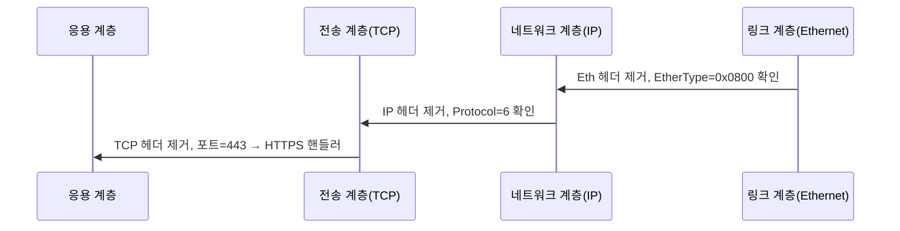

# 네트워크 프로토콜(Protocol)

## 정의

프로토콜은 서로 다른 시스템이 데이터를 주고받기 위해 합의한 규칙의 집합이다. 비트 단위 인코딩부터 메시지 순서, 오류 처리 방식, 종료 조건까지 모든 단계가 포함된다.

규칙이 없으면 같은 바이트열도 양쪽에서 다르게 해석한다. 예전에 사내 메시지 큐를 직접 구현했다가 한쪽은 빅엔디안, 다른 쪽은 리틀엔디안으로 읽어서 길이 필드가 4MB를 가리키는 사고를 본 적이 있다. 그 사건 이후로 "프로토콜은 합의"라는 말이 무겁게 다가왔다.

### 프로토콜의 3요소

- **구문(Syntax)**: 비트 순서, 필드 길이, 구분자 같은 형식 규칙
- **의미(Semantics)**: 각 필드의 뜻과 동작 규정
- **타이밍(Timing)**: 언제 보내고 언제 응답하며 얼마 만에 타임아웃 처리할지

HTTP 요청을 예로 들면 `GET /api HTTP/1.1\r\n`이라는 텍스트 형태는 구문, `GET`이 "데이터 조회"라는 의미를 갖는 것은 의미론, 3초 안에 응답이 없으면 끊겠다는 것은 타이밍이다. 셋 중 하나만 어긋나도 통신은 깨진다.

---

## 프로토콜 스택과 캡슐화

### 스택(Stack)이라는 개념

네트워크 통신은 한 덩어리의 프로토콜이 모든 일을 처리하지 않는다. 계층별로 역할이 나뉘고, 위 계층은 아래 계층의 서비스만 사용한다. 이런 수직 구조를 프로토콜 스택이라고 부른다.

서버에서 `curl https://example.com`을 실행하면 다음 스택이 가동된다.

```
[ HTTP ]    ─ 응용 계층: 요청 메서드, 헤더, 본문
[ TLS  ]    ─ 보안 계층: 암호화, 인증
[ TCP  ]    ─ 전송 계층: 연결, 신뢰성, 흐름 제어
[ IP   ]    ─ 네트워크 계층: 라우팅, 주소 지정
[ETHER ]    ─ 데이터 링크 계층: 프레임 전송, MAC
[PHYSL ]    ─ 물리 계층: 전기 신호, 광 신호
```

위 계층은 자기 일만 한다. HTTP는 IP 주소가 어떻게 라우팅되는지 모른다. TCP는 데이터의 내용이 JSON인지 바이너리인지 모른다. 이 격리 덕분에 한 계층을 바꿔도 다른 계층은 그대로 둘 수 있다. HTTP/2가 HTTP/1.1을 대체했지만 TCP는 그대로 쓴다. HTTP/3가 TCP 대신 QUIC을 쓰지만 HTTP의 의미론은 거의 그대로 둔다.

### 캡슐화(Encapsulation)

송신 측에서 데이터는 위에서 아래로 내려가며 각 계층의 헤더가 앞에 붙는다. 양파를 거꾸로 싸는 모양새다.

```
응용 데이터:                    [ Payload                            ]
TCP 캡슐화:               [ TCP H | Payload                          ]
IP 캡슐화:           [ IP H | TCP H | Payload                        ]
Ethernet 캡슐화: [ Eth H | IP H | TCP H | Payload     | Eth Trailer  ]
                  └────────────── 최종 전송 단위 ──────────────────┘
```

각 계층은 자기 헤더에 다음 계층 정보가 무엇인지 표시한다. Ethernet 헤더의 EtherType 필드가 `0x0800`이면 다음 페이로드는 IPv4, `0x86DD`면 IPv6다. IP 헤더의 Protocol 필드가 `6`이면 TCP, `17`이면 UDP다. 수신 측은 이 필드를 보고 어느 디코더로 넘길지 결정한다.

### 디캡슐화(Decapsulation)

수신 측은 반대로 아래에서 위로 한 겹씩 벗긴다. 각 계층의 헤더를 읽고 처리한 뒤 페이로드만 위로 넘긴다.



이 과정 중 하나라도 헤더가 손상되면 그 시점에서 패킷이 버려진다. Ethernet의 CRC, IP의 헤더 체크섬, TCP의 체크섬이 각각 별도로 검증한다.

---

## 계층별 PDU와 헤더 크기

PDU(Protocol Data Unit)는 각 계층에서 다루는 데이터 단위의 이름이다. 같은 데이터가 계층마다 다른 이름으로 불린다는 점을 모르면 로그를 읽다가 헷갈린다.

| 계층 | PDU 이름 | 대표 헤더 | 헤더 크기 |
|------|----------|-----------|-----------|
| 응용 | Message / Data | HTTP, DNS Message | 가변 |
| 전송 (TCP) | Segment | TCP 헤더 | 20바이트 + 옵션 (최대 60) |
| 전송 (UDP) | Datagram | UDP 헤더 | 8바이트 고정 |
| 네트워크 | Packet | IPv4 / IPv6 헤더 | IPv4: 20~60, IPv6: 40 고정 |
| 데이터 링크 | Frame | Ethernet II 헤더 | 14바이트 + FCS 4바이트 |
| 물리 | Bit / Symbol | 없음 | — |

### 헤더 오버헤드 계산

표준 Ethernet MTU 1500바이트 환경에서 TCP 페이로드로 쓸 수 있는 크기를 따져보면:

```
1500 (MTU)
 -20 (IPv4 헤더)
 -20 (TCP 헤더, 옵션 없음)
─────
1460 (MSS, Maximum Segment Size)
```

여기에 Ethernet 헤더 14바이트와 FCS 4바이트를 더하면 한 프레임에 1518바이트가 전송된다. 1MB짜리 데이터를 보내려면 약 718개 프레임이 필요하고, 헤더만 모아도 40KB 가까이 된다.

IPv6를 쓰면 헤더가 40바이트 고정이라 MSS가 1440으로 줄어든다. VPN이나 터널링(IPsec, GRE, VXLAN)을 끼면 또 줄어든다. 사내 VPN 환경에서 큰 파일 업로드가 자꾸 끊겨서 추적했더니 추가 캡슐화 헤더 때문에 MSS가 1380까지 떨어져 있던 적이 있다. MTU/MSS 불일치는 의외로 자주 만나는 문제다.

### TCP 헤더 구조

```
 0                   1                   2                   3
 0 1 2 3 4 5 6 7 8 9 0 1 2 3 4 5 6 7 8 9 0 1 2 3 4 5 6 7 8 9 0 1
+-+-+-+-+-+-+-+-+-+-+-+-+-+-+-+-+-+-+-+-+-+-+-+-+-+-+-+-+-+-+-+-+
|          Source Port          |       Destination Port        |
+-+-+-+-+-+-+-+-+-+-+-+-+-+-+-+-+-+-+-+-+-+-+-+-+-+-+-+-+-+-+-+-+
|                        Sequence Number                        |
+-+-+-+-+-+-+-+-+-+-+-+-+-+-+-+-+-+-+-+-+-+-+-+-+-+-+-+-+-+-+-+-+
|                    Acknowledgment Number                      |
+-+-+-+-+-+-+-+-+-+-+-+-+-+-+-+-+-+-+-+-+-+-+-+-+-+-+-+-+-+-+-+-+
| Off |Rsvd |C|E|U|A|P|R|S|F|         Window Size               |
+-+-+-+-+-+-+-+-+-+-+-+-+-+-+-+-+-+-+-+-+-+-+-+-+-+-+-+-+-+-+-+-+
|           Checksum            |        Urgent Pointer         |
+-+-+-+-+-+-+-+-+-+-+-+-+-+-+-+-+-+-+-+-+-+-+-+-+-+-+-+-+-+-+-+-+
|                  Options (가변, 0~40바이트)                    |
+-+-+-+-+-+-+-+-+-+-+-+-+-+-+-+-+-+-+-+-+-+-+-+-+-+-+-+-+-+-+-+-+
```

Sequence Number와 Acknowledgment Number가 4바이트씩 차지하는 게 눈에 띈다. 이 두 필드 덕에 TCP가 순서 보장과 재전송을 처리한다. UDP에는 이런 필드가 없어서 헤더가 8바이트로 끝난다.

### UDP 헤더 구조

```
 0                   1                   2                   3
 0 1 2 3 4 5 6 7 8 9 0 1 2 3 4 5 6 7 8 9 0 1 2 3 4 5 6 7 8 9 0 1
+-+-+-+-+-+-+-+-+-+-+-+-+-+-+-+-+-+-+-+-+-+-+-+-+-+-+-+-+-+-+-+-+
|          Source Port          |       Destination Port        |
+-+-+-+-+-+-+-+-+-+-+-+-+-+-+-+-+-+-+-+-+-+-+-+-+-+-+-+-+-+-+-+-+
|             Length            |           Checksum            |
+-+-+-+-+-+-+-+-+-+-+-+-+-+-+-+-+-+-+-+-+-+-+-+-+-+-+-+-+-+-+-+-+
```

8바이트가 끝이다. 연결 정보도 순서 정보도 없다. 그래서 DNS 같은 짧은 질의/응답에 쓰면 TCP보다 빠르고, 게임이나 음성 통화에서는 약간의 손실을 감수하고 지연을 줄이는 편이 낫다.

---

## 텍스트 기반 vs 바이너리 기반 프로토콜

### 텍스트 기반

ASCII나 UTF-8로 사람이 읽을 수 있는 형태로 메시지를 구성한다. HTTP/1.1, SMTP, FTP, IRC, Redis RESP가 대표 예다.

```
GET /users/42 HTTP/1.1\r\n
Host: api.example.com\r\n
Accept: application/json\r\n
\r\n
```

장점이 명확하다. `telnet`이나 `nc`로 직접 입력해서 디버깅할 수 있고, 로그를 그대로 읽으면 의미가 보인다. 새 필드를 추가해도 파서가 모르는 헤더는 무시하면 그만이라 확장이 부드럽다.

단점은 파싱 비용과 크기다. 정수 1을 표현하는 데 텍스트는 `"1"`(1바이트)이지만 큰 숫자일수록 차이가 벌어진다. `1234567890`을 텍스트로는 10바이트, 바이너리 int32로는 4바이트로 표현한다. 구분자(공백, 콜론, 줄바꿈)를 일일이 찾는 파싱 자체도 비싸다.

### 바이너리 기반

길이가 정해진 비트/바이트 필드로 메시지를 구성한다. TCP/IP 자체, HTTP/2, gRPC(Protocol Buffers), MQTT, MongoDB Wire Protocol이 여기 속한다.

```
[1바이트 타입][4바이트 길이][N바이트 페이로드]
```

장점은 크기와 속도다. 필드 위치가 고정이라 오프셋만 계산하면 바로 읽는다. 헤더가 작아서 회선을 덜 먹는다.

단점은 디버깅이 까다롭다는 것. `tcpdump -X`로 헥사 덤프를 떠서 사양서와 대조해야 한다. 사양이 없으면 분석 자체가 불가능에 가깝다. 사내 메시지 큐를 디버깅하려고 Wireshark의 dissector를 직접 Lua로 작성한 적도 있다.

### 어떻게 고를까

- 사람이 자주 들여다봐야 하면 텍스트(API, 로그)
- 처리량이 압도적으로 중요하면 바이너리(브로커, 게임 서버, 데이터베이스)
- 크기 차이가 십 단위 ms 이상이면 바이너리, 그렇지 않으면 텍스트로 시작하고 필요할 때 바꾼다

실무에서는 외부 API는 JSON(텍스트), 내부 서비스 간 통신은 gRPC(바이너리)로 나누는 패턴을 많이 본다.

---

## 프로토콜 버저닝과 하위 호환성

### 왜 어려운가

프로토콜을 한 번 배포하면 클라이언트가 전 세계에 깔린다. 새 버전을 만들어도 구버전 클라이언트가 사라질 때까지 양쪽을 동시에 지원해야 한다. 보통 수년 단위로 끌고 가는 일이다.

### HTTP/1.1 → HTTP/2 전환

HTTP/2는 의미론을 그대로 두고 전송 방식만 바이너리 프레이밍으로 바꿨다. 메서드, 헤더, 상태 코드는 동일하다. 새로운 점은:

- 같은 TCP 연결에서 여러 요청을 동시에 처리(멀티플렉싱)
- 헤더를 압축(HPACK)
- 서버가 클라이언트 요청 없이도 리소스를 보낼 수 있음(서버 푸시, 지금은 거의 폐기 분위기)

호환성은 ALPN(Application-Layer Protocol Negotiation)으로 해결했다. TLS 핸드셰이크 중 클라이언트가 "h2"와 "http/1.1" 중 지원하는 걸 알리고 서버가 고른다. HTTPS가 강제 조건이 된 이유 중 하나다. 평문 HTTP/2(h2c)도 사양엔 있지만 실제로는 거의 쓰지 않는다.

전환기에는 같은 백엔드가 HTTP/1.1과 HTTP/2를 동시에 받는 게 일반적이었다. Nginx 1.9.5 이후 한 줄(`listen 443 ssl http2`)로 양쪽을 받게 했다. 클라이언트 라이브러리가 HTTP/2를 잘못 구현해서 멀티플렉싱이 깨지는 사례도 있었는데, 이때는 `--http1.1` 강제 옵션으로 우회했다.

### HTTP/2 → HTTP/3 전환

HTTP/3는 더 큰 변화다. TCP를 버리고 UDP 기반의 QUIC을 쓴다. 이유:

- TCP의 head-of-line blocking: 한 패킷이 손실되면 뒤따라오는 모든 스트림이 멈춤
- TCP 핸드셰이크 + TLS 핸드셰이크의 RTT 비용
- 모바일에서 IP가 바뀌면 TCP 연결이 끊김

QUIC은 이 셋을 모두 해결한다. 0-RTT 재연결, 스트림별 독립적 손실 복구, 연결 ID 기반 마이그레이션을 제공한다.

호환성은 Alt-Svc 헤더로 협상한다. 처음에는 HTTP/2로 연결한 뒤 서버가 `Alt-Svc: h3=":443"` 헤더로 "다음에는 HTTP/3로 와도 된다"고 알린다. 클라이언트가 다음 요청을 UDP 443으로 시도한다. 실패하면 다시 TCP로 떨어진다(fallback).

방화벽이 UDP 443을 막아둔 환경이 의외로 많아서 도입 초기에는 fallback 비율이 높았다. 사내 네트워크에서 HTTP/3 성능 테스트를 했더니 회사 방화벽이 UDP 443을 죽여서 전부 HTTP/2로 떨어지는 일이 있었다. 도입 전 방화벽 설정 확인이 먼저다.

### 버저닝 패턴 정리

- **인밴드 협상**: HTTP/1.1의 Upgrade 헤더, HTTP/2의 ALPN
- **사이드채널 협상**: HTTP/3의 Alt-Svc
- **버전 필드**: TCP/IP 헤더의 Version 필드(IPv4=4, IPv6=6)
- **포트 분리**: HTTP=80, HTTPS=443처럼 버전별로 포트를 다르게 쓰는 방식. 단순하지만 포트가 모자란다

---

## 헤더 압축 / 멀티플렉싱 / 파이프라이닝

### 파이프라이닝(Pipelining)

HTTP/1.1이 도입한 기법. 응답을 기다리지 않고 요청을 연속해서 보낸다. 단점이 컸다. 응답은 요청 순서대로 와야 해서, 첫 응답이 늦으면 뒤따르는 응답도 함께 늦는다(head-of-line blocking). 결국 대부분의 브라우저가 기본적으로 끄게 됐다. 지금은 거의 사어다.

### 멀티플렉싱(Multiplexing)

HTTP/2의 핵심. 한 TCP 연결 안에서 여러 스트림이 동시에 흐른다. 각 스트림은 ID를 가지고 서로 독립적이다. 응답 순서도 요청 순서와 무관하다.

```
[연결 1] ─┬─ Stream 1: GET /a.js
          ├─ Stream 3: GET /b.css
          ├─ Stream 5: GET /c.png
          └─ Stream 7: GET /d.html
```

이 덕에 HTTP/1.1 시대의 도메인 샤딩, 이미지 스프라이트, JS/CSS 인라이닝 같은 우회 기법이 무의미해졌다. 다만 TCP 자체가 직렬이라 패킷 손실 시 모든 스트림이 멈추는 한계가 남았고, HTTP/3의 QUIC이 이를 풀었다.

### 헤더 압축

HTTP/1.1은 같은 헤더(예: Cookie, User-Agent)를 요청마다 그대로 다시 보낸다. 페이지 하나 로드에 수십 요청을 보내면 헤더만 수십 KB가 된다.

HTTP/2의 HPACK은 두 가지 방식으로 줄인다:

- **정적 테이블**: 자주 쓰는 헤더(`:method: GET`, `:status: 200` 등)에 정수 인덱스 부여
- **동적 테이블**: 연결 중 등장한 헤더를 양쪽이 같이 기억하고 다음에는 인덱스로 참조

HTTP/3의 QPACK도 비슷한 개념이지만 UDP의 무순서 특성 때문에 더 복잡해졌다.

압축 효과는 크다. 대형 사이트에서 HTTP/1.1 대비 80% 이상 헤더 크기가 줄어드는 게 보통이다.

다만 HPACK 동적 테이블을 노린 CRIME/HEIST류 공격이 알려져서, 민감 헤더(Cookie 등)는 동적 테이블에 넣지 않는 식의 대응이 들어갔다.

---

## 표준화 기관과 RFC 읽는 법

### 주요 기관

- **IETF (Internet Engineering Task Force)**: 인터넷 프로토콜 표준. RFC 문서로 발행한다. HTTP, TCP, IP, DNS, TLS가 모두 여기 소관.
- **IEEE (Institute of Electrical and Electronics Engineers)**: 물리/링크 계층 표준. 802.3(Ethernet), 802.11(Wi-Fi)이 대표.
- **ITU-T (International Telecommunication Union)**: 통신 표준. H.264 같은 미디어 코덱이나 SS7 같은 전화망 프로토콜.
- **W3C (World Wide Web Consortium)**: 웹 표준. HTML, CSS, WebSocket(IETF와 공동).
- **ISO**: OSI 7계층 모델의 발신지. 실제 인터넷은 OSI보다 TCP/IP를 쓴다는 게 역사의 아이러니.

### RFC 문서 읽는 법

RFC는 번호로 식별한다. RFC 9110이 HTTP 의미론, RFC 9112가 HTTP/1.1 메시지 포맷, RFC 9113이 HTTP/2다. 한 번 발행되면 내용을 바꾸지 않는다. 수정이 필요하면 새 RFC가 이전 RFC를 obsoletes(폐기) 처리한다. RFC 2616(HTTP/1.1)은 RFC 7230~7235로 쪼개졌다가 다시 RFC 9110~9112로 통합되는 식의 흐름을 거쳤다.

문서 구조는 거의 같다:

- **Abstract**: 한 문단 요약
- **Status of This Memo / Categories**: Standards Track인지 Informational인지
- **Terminology**: 용어 정의. `MUST`, `SHOULD`, `MAY` 같은 키워드는 RFC 2119에 규정된 의미를 갖는다
- **본문**: 프로토콜 명세
- **Security Considerations**: 보안 위협 검토
- **IANA Considerations**: 등록할 포트, 헤더, 알고리즘 식별자
- **References**: 참조 문서

처음 읽을 때 요령:

1. Abstract와 목차로 큰 그림만 잡는다
2. Terminology를 훑어 키워드 의미를 익힌다
3. 관심 있는 절만 깊게 본다. 한 번에 전체 읽기는 비현실적이다
4. `MUST` 위반은 호환성 깨짐, `SHOULD` 위반은 권장 사항 위반이라는 점을 기억한다

RFC를 안 읽고 구글에 검색해서 나오는 블로그만 보다가 사양과 다른 동작을 한 경험은 모두에게 있다. 의심스러우면 원문이 답이다.

조회는 [datatracker.ietf.org](https://datatracker.ietf.org)나 [rfc-editor.org](https://www.rfc-editor.org)에서 한다. obsolete 여부와 errata(오탈자/오류 정정)도 같이 확인한다.

---

## 주요 프로토콜

### HTTP

웹 통신의 기반. 클라이언트가 요청하고 서버가 응답하는 구조다.

특징:
- 무상태(Stateless): 각 요청은 독립적. 상태는 쿠키나 세션 ID로 별도 유지
- 요청-응답 모델
- 텍스트 기반(HTTP/1.1), 바이너리 기반(HTTP/2/3)

메서드 의미는 RFC 9110에 규정돼 있고, GET은 안전(safe)하고 idempotent하며, POST는 둘 다 아니다, PUT/DELETE는 idempotent하다는 점이 핵심이다. 멱등성 위반(POST를 PUT처럼 쓰는 등)은 캐시, 재시도 로직과 충돌해서 사고로 이어진다.

버전별 차이:
- **HTTP/1.1**: 지속 연결(Keep-Alive), 청크 전송, 파이프라이닝(거의 미사용)
- **HTTP/2**: 바이너리 프레이밍, 멀티플렉싱, HPACK
- **HTTP/3**: QUIC 위에서 동작, 0-RTT, 연결 마이그레이션

### HTTPS

HTTP 위에 TLS 계층을 끼운 것. 별도 프로토콜이라기보다 HTTP + TLS의 조합 이름이다.

- 암호화: AES-GCM, ChaCha20 같은 대칭 키 암호로 본문 보호
- 인증: X.509 인증서로 서버 신원 확인. mTLS면 클라이언트도 인증
- 무결성: AEAD로 변조 감지

TLS 1.3은 핸드셰이크 RTT를 1로 줄였고(이전 1.2는 2 RTT), 0-RTT 모드로 재접속 시에는 RTT 0도 가능하다. 다만 0-RTT는 재전송 공격 위험이 있어 GET처럼 멱등성 있는 요청에만 써야 한다.

### WebSocket

HTTP 핸드셰이크로 시작해서 양방향 통신으로 업그레이드되는 프로토콜. RFC 6455.

특징:
- 전이중 통신
- 핸드셰이크 후 TCP 연결을 그대로 점유
- 프레임 단위 메시지(텍스트 또는 바이너리)
- 헤더가 2~14바이트 수준으로 가볍다

| 항목 | HTTP | WebSocket |
|------|------|-----------|
| 통신 방식 | 요청-응답 | 양방향 |
| 연결 | 일시적 | 지속적 |
| 오버헤드 | 헤더 큼 | 프레임 헤더 작음 |
| 실시간성 | 제한적 | 우수 |
| 사용처 | API, 페이지 | 채팅, 알림, 협업 |

자세한 내용은 같은 디렉토리의 WebSocket.md 참고.

### TCP

연결 지향, 신뢰성 보장 전송 프로토콜.

핵심 기능:
- 3-way handshake로 연결 수립, 4-way로 종료
- 시퀀스 번호 기반 순서 보장과 재전송
- 슬라이딩 윈도우 흐름 제어
- 혼잡 제어(Reno, CUBIC, BBR 등 알고리즘 다양)

### UDP

비연결, 신뢰성 없음, 최소 오버헤드.

- 핸드셰이크 없음
- 8바이트 헤더
- 순서 보장 없음, 재전송 없음

DNS, NTP, VoIP, 게임, QUIC(HTTP/3 기반)이 사용한다. 신뢰성이 필요하면 애플리케이션이 직접 구현한다. QUIC이 그 예다.

| 항목 | TCP | UDP |
|------|-----|-----|
| 연결 | 연결 지향 | 비연결 |
| 신뢰성 | 보장 | 없음 |
| 속도 | 상대적으로 느림 | 빠름 |
| 헤더 크기 | 20+ 바이트 | 8 바이트 |
| 순서 보장 | O | X |
| 사용처 | 웹, 이메일, DB | DNS, 게임, 스트리밍 |

---

## 계층 모델

### OSI 7계층

| 계층 | 이름 | PDU | 대표 프로토콜 | 역할 |
|------|------|-----|---------------|------|
| 7 | 응용 | Data | HTTP, FTP, SMTP, DNS | 애플리케이션 인터페이스 |
| 6 | 표현 | Data | TLS, ASCII, JPEG | 인코딩, 암호화, 압축 |
| 5 | 세션 | Data | NetBIOS, RPC | 세션 관리 |
| 4 | 전송 | Segment/Datagram | TCP, UDP | 종단 간 전달 |
| 3 | 네트워크 | Packet | IP, ICMP, OSPF | 라우팅, 주소 지정 |
| 2 | 데이터 링크 | Frame | Ethernet, Wi-Fi, PPP | 링크 단위 전송 |
| 1 | 물리 | Bit | 동축, 광, 무선 | 신호 변환 |

### TCP/IP 4계층

| 계층 | 대응 OSI | 프로토콜 |
|------|----------|----------|
| 응용 | 5~7 | HTTP, HTTPS, FTP, SMTP, DNS, SSH |
| 전송 | 4 | TCP, UDP |
| 인터넷 | 3 | IP, ICMP, ARP |
| 네트워크 액세스 | 1~2 | Ethernet, Wi-Fi, PPP |

실무에서는 TCP/IP 4계층이 현실에 가깝다. OSI는 개념 정리용으로 본다.

---

## Wireshark로 프로토콜 분석

### 기본 워크플로우

1. **캡처 인터페이스 선택**: 메인 화면에서 트래픽이 흐르는 인터페이스를 고른다. macOS면 보통 `en0`, 서버면 `eth0`/`enp0s3`.
2. **캡처 시작**: 잠깐만 받는다. 분 단위면 수십만 패킷이 쌓여서 다루기 어렵다.
3. **필터링**: 화면 위의 Display Filter에 조건을 건다.
4. **패킷 상세 보기**: 아래 창에서 계층별로 펼친다.
5. **Follow Stream**: 우클릭 → Follow → TCP/HTTP/TLS Stream으로 하나의 대화 흐름만 추출.

### 자주 쓰는 Display Filter

```
http                                     # HTTP만
http.request.method == "POST"            # POST 요청만
tcp.port == 443                          # 443 포트
ip.addr == 10.0.0.5                      # 특정 IP가 끼인 모든 패킷
tcp.flags.syn == 1 and tcp.flags.ack == 0  # SYN만 (3-way 시작)
tcp.analysis.retransmission              # 재전송 의심 패킷
tls.handshake.type == 1                  # ClientHello
dns.qry.name contains "example"          # DNS 질의에 특정 도메인
```

캡처 필터(BPF)와 디스플레이 필터는 문법이 다르다. 캡처 필터는 `tcp port 443`처럼 tcpdump 문법, 디스플레이 필터는 `tcp.port == 443`처럼 Wireshark 고유 문법이다. 헷갈리지 않게 처음 며칠은 한쪽만 쓰는 게 낫다.

### 실전 추적 패턴

**HTTPS 핸드셰이크 분석**

```
1. tls.handshake.type == 1 (ClientHello)에서 지원하는 cipher, ALPN 확인
2. tls.handshake.type == 2 (ServerHello)에서 선택된 cipher와 TLS 버전 확인
3. ALPN 협상 결과로 h2 / http/1.1 / h3 결정 여부 확인
```

ALPN 확인을 위해서는 ClientHello의 Extension 중 `application_layer_protocol_negotiation`을 본다. 이게 빠져 있으면 HTTP/2를 못 쓴다.

**TCP 연결 끊김 추적**

```
tcp.flags.reset == 1
```

RST 패킷이 누가 보낸 건지 본다. 보통:
- 클라이언트가 보냄: 애플리케이션이 소켓을 강제 닫음
- 서버가 보냄: listen 큐 가득, 방화벽 차단, 또는 keepalive 만료
- 중간 장비가 보냄: 방화벽이나 IPS

출발지 IP/포트로 누가 보냈는지 식별한다. TTL 값이 평소와 다르면(예: 64가 아니라 250) 중간 장비일 가능성이 있다.

**패킷 손실/지연 추적**

I/O Graph(Statistics → I/O Graph)로 시간대별 트래픽 양과 재전송율을 그래프로 본다. Expert Information(Analyze → Expert Information)에서 Warning/Note 단위로 분류된 이상 패킷을 확인한다.

### tshark CLI

GUI를 쓰기 어려운 서버 환경에서는 tshark로 같은 일을 한다.

```bash
# 인터페이스 목록
tshark -D

# 캡처해서 화면 출력
sudo tshark -i eth0 -f "port 443"

# 파일로 저장
sudo tshark -i eth0 -w capture.pcap -f "host 10.0.0.5"

# 저장된 파일 디스플레이 필터로 분석
tshark -r capture.pcap -Y "http.request.method == POST" -T fields -e ip.src -e http.host -e http.request.uri

# 통계
tshark -r capture.pcap -q -z conv,tcp        # TCP 대화 목록
tshark -r capture.pcap -q -z http,tree       # HTTP 통계
```

---

## 디코딩 트러블슈팅

Wireshark/tshark가 만능은 아니다. 디코딩이 실패하거나 잘못 해석하는 경우를 자주 만난다.

### 비표준 포트에서 표준 프로토콜 사용

HTTP를 8080이 아닌 9999 포트로 띄우면 Wireshark가 자동으로 HTTP로 디코딩하지 못한다. 패킷이 `TCP` 또는 `Data`로만 보인다.

해결: 해당 패킷 우클릭 → Decode As → 9999 포트를 HTTP로 매핑.

`Preferences → Protocols → HTTP → TCP Ports`에서 영구 추가도 가능하다.

자주 만나는 경우:
- 사내 마이크로서비스가 8081, 9090 같은 포트로 HTTP 운영
- TLS를 443이 아닌 포트로 운영
- Redis(6379), MongoDB(27017)를 다른 포트로 운영

### 잘못된 디섹터 활성화로 오탐

특정 포트에 디섹터가 잘못 매핑되어 있으면 엉뚱하게 해석한다. 예전에 사내에서 9000 포트에 자체 프로토콜을 띄웠는데 Wireshark가 그걸 HTTP로 잘못 해석해서 "Malformed Packet" 경고만 잔뜩 뿌렸다. `Preferences → Protocols → HTTP`에서 해당 포트를 빼서 해결했다.

### TLS 암호화된 트래픽 해독

TLS 트래픽은 기본적으로 페이로드가 안 보인다. 두 가지 방법:

**1. (Pre-)Master Secret Log 파일**

브라우저나 curl에 환경변수를 설정:

```bash
export SSLKEYLOGFILE=/tmp/sslkeys.log
curl https://example.com
```

Wireshark의 `Preferences → Protocols → TLS → (Pre)-Master-Secret log filename`에 이 파일 경로를 넣으면 해독된 페이로드가 보인다. 제품 환경에서는 보안 정책상 못 쓴다는 점을 기억한다.

**2. 서버 RSA 키**

RSA 키 교환을 쓰는 구버전 TLS에 한해 서버 개인키로 해독 가능. TLS 1.3은 PFS(Perfect Forward Secrecy)를 강제해서 이 방법이 안 통한다.

### 분할/단편화된 메시지

HTTP/2의 한 응답이 여러 TCP 세그먼트에 걸쳐 있거나, IP 단편화로 패킷이 쪼개진 경우 디섹터가 한 번에 못 본다. `Preferences → Protocols → TCP → Allow subdissector to reassemble TCP streams`가 켜져 있는지 확인한다. 보통 기본 켜짐이지만 누가 끄면 디코딩이 안 된다.

### 비표준 프로토콜

사내에서 만든 바이너리 프로토콜은 Wireshark가 모른다. 두 가지 선택지:

- **Lua dissector**: 짧은 코드로 추가 가능. 사양이 단순하면 한 시간이면 만든다
- **C dissector**: 빌드해서 플러그인으로 넣는다. 처리량이 많고 사양이 복잡할 때

Lua 예시:

```lua
local p = Proto("myproto", "Internal Protocol")
local f_type = ProtoField.uint8("myproto.type", "Type")
local f_len  = ProtoField.uint32("myproto.length", "Length")
p.fields = { f_type, f_len }

function p.dissector(buf, pkt, tree)
    local subtree = tree:add(p, buf())
    subtree:add(f_type, buf(0,1))
    subtree:add(f_len,  buf(1,4))
    pkt.cols.protocol = "MYPROTO"
end

DissectorTable.get("tcp.port"):add(9000, p)
```

`~/.config/wireshark/plugins/`(또는 `Help → About → Folders`에 표시된 경로)에 .lua 파일로 두면 자동 로드된다.

---

## 실습 명령어

### tcpdump — 패킷 캡처

```bash
# 기본
sudo tcpdump -i eth0
sudo tcpdump -i any

# 프로토콜/포트 필터
sudo tcpdump -i eth0 port 80
sudo tcpdump -i eth0 port 443
sudo tcpdump -i eth0 udp port 53
sudo tcpdump -i eth0 tcp port 3306

# 호스트 필터
sudo tcpdump -i eth0 host 192.168.1.100
sudo tcpdump -i eth0 src 192.168.1.100
sudo tcpdump -i eth0 dst 192.168.1.1

# 조합
sudo tcpdump -i eth0 "host 192.168.1.100 and port 80"
sudo tcpdump -i eth0 "port 80 or port 443"

# 출력 옵션
sudo tcpdump -i eth0 -n -v port 80
sudo tcpdump -i eth0 -X port 80              # 16진수 + ASCII
sudo tcpdump -i eth0 -w capture.pcap port 80 # 파일로 저장
sudo tcpdump -r capture.pcap
```

### TCP 3-way Handshake 캡처

```bash
sudo tcpdump -i eth0 -n "tcp[tcpflags] & (tcp-syn|tcp-ack) != 0" port 80

# 출력 예시
# 14:30:01.123456 IP 192.168.1.100.54321 > 93.184.216.34.80: Flags [S],  seq 100
# 14:30:01.234567 IP 93.184.216.34.80 > 192.168.1.100.54321: Flags [S.], seq 200 ack 101
# 14:30:01.234890 IP 192.168.1.100.54321 > 93.184.216.34.80: Flags [.],  ack 201

# Flags
# [S]  SYN
# [S.] SYN-ACK
# [.]  ACK
# [F.] FIN-ACK
# [R]  RST
# [P.] PSH-ACK
```

### ss — 연결 상태 확인

```bash
ss -an
ss -tn                              # TCP만
ss -tn state established            # ESTABLISHED만
ss -tlnp                            # TCP 리스닝 + 프로세스
ss -ulnp                            # UDP 리스닝 + 프로세스

# TIME_WAIT 카운트
ss -tn state time-wait | wc -l
```

`netstat`은 더 이상 권장되지 않는다. 서버 표준은 `ss`다.

### nc (netcat) — 프로토콜 테스트

```bash
# TCP 포트 연결 확인
nc -zv 192.168.1.100 8080

# 범위 스캔
nc -zv 192.168.1.100 8080-8090

# HTTP 요청 수동 전송
printf "GET / HTTP/1.1\r\nHost: example.com\r\n\r\n" | nc example.com 80

# UDP
nc -u 8.8.8.8 53

# 간이 파일 전송
nc -l 9999 > received_file.txt       # 수신
nc 192.168.1.100 9999 < file.txt     # 전송
```

### curl — HTTP 디버깅

```bash
curl -I https://example.com
curl -v https://example.com

# TLS 정보
curl -vI https://example.com 2>&1 | grep -E "SSL|TLS|Certificate"

# 응답 시간 분해
curl -o /dev/null -s -w \
  "DNS: %{time_namelookup}s\nConnect: %{time_connect}s\nTLS: %{time_appconnect}s\nTotal: %{time_total}s\n" \
  https://example.com

# HTTP 버전 강제
curl --http1.1 -v https://example.com
curl --http2   -v https://example.com
curl --http3   -v https://example.com   # libcurl이 HTTP/3 빌드여야 함

# 응답 헤더만 깔끔하게
curl -sD - -o /dev/null https://example.com
```

---

## 참고

- RFC 9110 — HTTP Semantics
- RFC 9112 — HTTP/1.1
- RFC 9113 — HTTP/2
- RFC 9114 — HTTP/3
- RFC 9000 — QUIC
- RFC 9001 — QUIC + TLS
- RFC 9293 — TCP (2022년 갱신본, RFC 793 폐기)
- RFC 768 — UDP
- RFC 6455 — WebSocket
- RFC 8446 — TLS 1.3
- RFC 2119 — Key words for use in RFCs (MUST/SHOULD/MAY)
- IEEE 802.3 — Ethernet
- IEEE 802.11 — Wi-Fi
