# 🌐 프록시 (Proxy) 

## 📌 개요

### 💡 프록시의 정의

> **프록시(Proxy)** = "대리인" 또는 "중개자"
> 
> 클라이언트와 서버 사이에서 중개 역할을 수행하는 네트워크 구성 요소

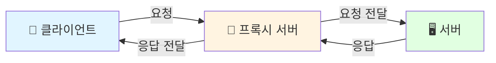

**실생활 비유**: 부동산 중개업소가 매수자와 매도자 사이에서 중개하는 것처럼, 프록시는 클라이언트의 요청을 받아 서버에 전달하고, 서버의 응답을 다시 클라이언트에게 전달합니다.

---

### 🎯 프록시의 핵심 개념

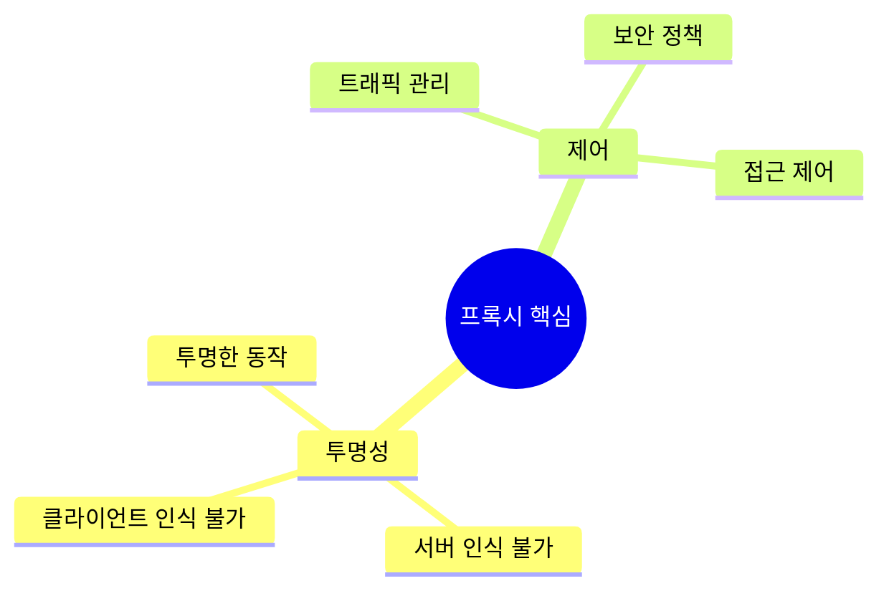

| 핵심 개념 | 설명 | 목적 |
|---------|------|------|
| **🔍 투명성 (Transparency)** | 클라이언트나 서버가 프록시의 존재를 인식하지 못하도록 함 | 원활한 통신 보장 |
| **🎮 제어 (Control)** | 네트워크 트래픽을 관리하고 보안 정책을 적용 | 보안 & 성능 최적화 |

---

### 🤔 프록시가 필요한 이유

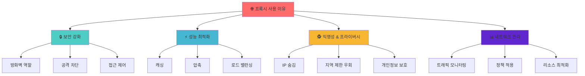

| 구분 | 주요 기능 | 효과 |
|------|----------|------|
| **🔒 보안 강화** | • 방화벽 역할<br>• 악성 트래픽 차단<br>• 접근 권한 제어 | 내부 네트워크 보호 & 보안 강화 |
| **⚡ 성능 최적화** | • 콘텐츠 캐싱<br>• 데이터 압축<br>• 로드 밸런싱 | 응답 시간 단축 & 대역폭 절약 |
| **🕵️ 익명성 & 프라이버시** | • IP 주소 숨김<br>• 지역 제한 우회<br>• 개인정보 보호 | 사용자 프라이버시 보장 |
| **📊 네트워크 관리** | • 트래픽 모니터링<br>• 정책 일관 적용<br>• 리소스 최적화 | 효율적인 네트워크 운영 |

---

### 📂 프록시의 분류

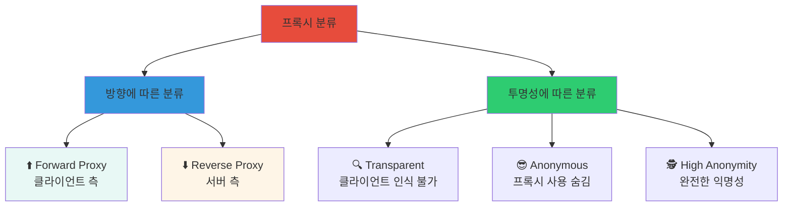

#### 📊 상세 비교표

| 분류 기준 | 유형 | 특징 | 주요 사용처 |
|----------|------|------|-----------|
| **방향** | ⬆️ Forward Proxy | 클라이언트 앞에 위치 | 기업 네트워크, VPN |
|  | ⬇️ Reverse Proxy | 서버 앞에 위치 | 웹 서버, CDN, API 게이트웨이 |
| **투명성** | 🔍 Transparent | 자동 리다이렉션 | ISP 레벨 캐싱 |
|  | 😎 Anonymous | 프록시 사용 숨김 | 일반 프라이버시 보호 |
|  | 🕵️ High Anonymity | 완전한 익명성 | 보안이 중요한 환경 |

---

## 🎓 핵심 개념

### 1️⃣ Forward Proxy (포워드 프록시)

> **클라이언트를 대신하여 외부 서버에 요청하는 프록시**

#### 🏗️ 구조 및 동작 원리

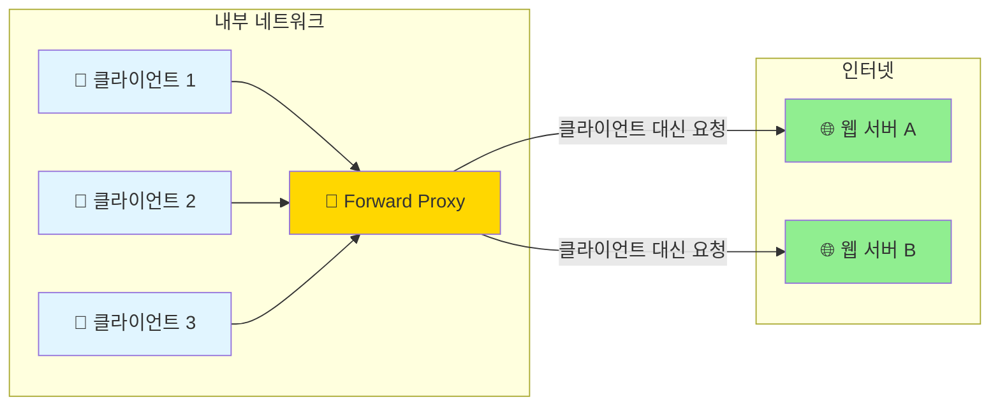

#### 📋 동작 흐름 (시퀀스)

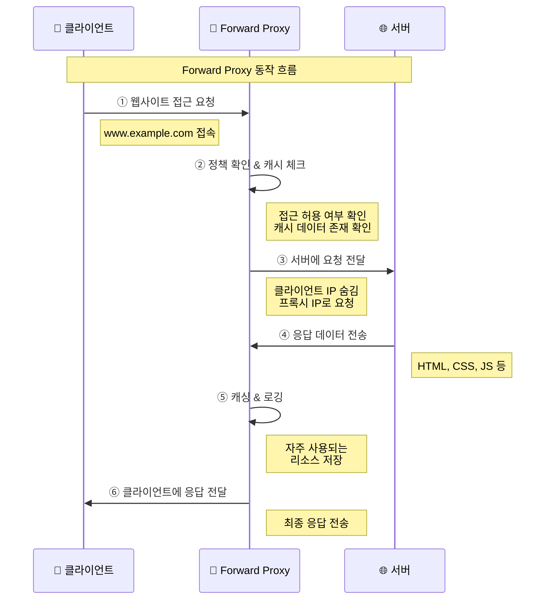

#### ✨ 주요 특징

| 특징 | 설명 | 장점 |
|------|------|------|
| **🛡️ 클라이언트 보호** | 클라이언트의 실제 IP 주소와 신원을 서버로부터 숨김 | 프라이버시 보호, 익명성 확보 |
| **🚫 접근 제어** | 특정 웹사이트나 콘텐츠에 대한 접근을 제한 | 보안 정책 준수, 생산성 향상 |
| **💾 캐싱** | 자주 요청되는 콘텐츠를 저장하여 빠른 응답 제공 | 속도 향상, 대역폭 절약 |
| **📝 로깅** | 클라이언트의 인터넷 사용 패턴을 기록 | 모니터링, 감사 추적 |

#### 🏢 사용 환경과 사례

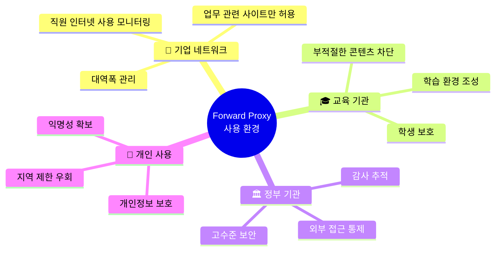

---

### 2️⃣ Reverse Proxy (리버스 프록시)

> **서버를 대신하여 클라이언트 요청을 받아 백엔드 서버로 전달하는 프록시**

#### 🏗️ 구조 및 동작 원리

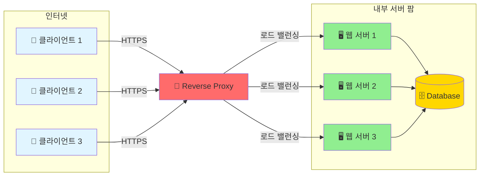

#### 📋 동작 흐름 (시퀀스)

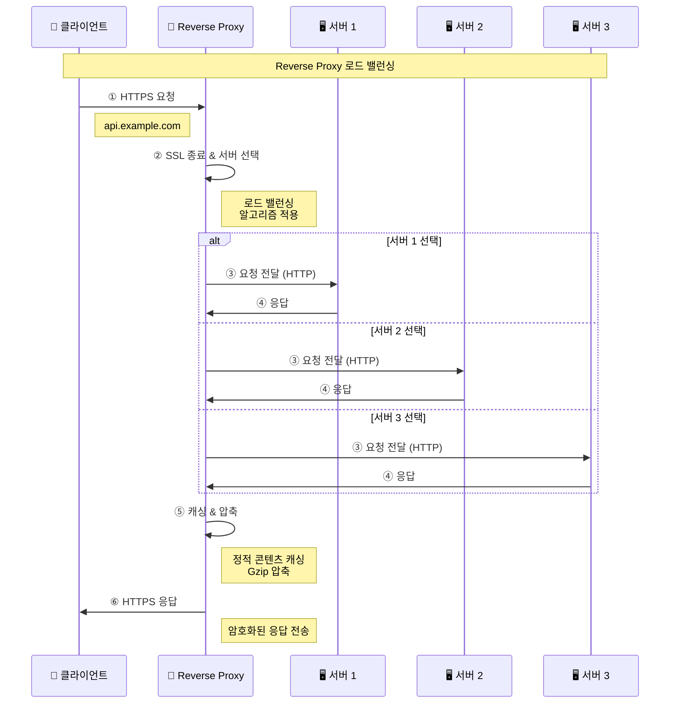

#### ✨ 주요 특징

| 특징 | 설명 | 장점 |
|------|------|------|
| **🛡️ 서버 보호** | 백엔드 서버의 실제 IP와 구조를 클라이언트로부터 숨김 | 보안 강화, DDoS 방어 |
| **⚖️ 로드 밸런싱** | 여러 백엔드 서버에 요청을 지능적으로 분산 | 성능 향상, 고가용성 |
| **🔐 SSL 종료** | HTTPS 연결을 프록시에서 처리 | 백엔드 부하 감소, 인증서 관리 용이 |
| **💾 캐싱** | 정적 콘텐츠를 캐시하여 빠른 응답 | 속도 향상, 백엔드 부하 감소 |
| **🗜️ 압축** | 응답 데이터를 압축하여 전송 | 대역폭 절약, 속도 향상 |

#### 🏢 사용 환경과 사례

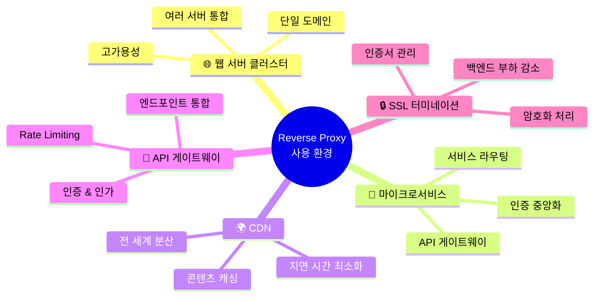

---

### 3️⃣ 프록시의 핵심 기능

#### ⚖️ 로드 밸런싱 (Load Balancing)

> 여러 백엔드 서버에 요청을 분산하여 시스템의 성능과 가용성을 향상

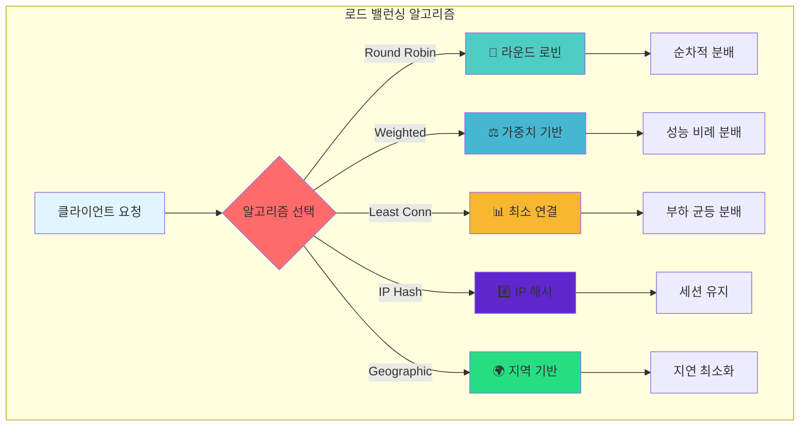

##### 📊 알고리즘 비교표

| 알고리즘 | 동작 방식 | 장점 | 단점 | 사용 사례 |
|---------|----------|------|------|----------|
| **🔄 Round Robin** | 순차적 분배 | 구현 간단, 공평한 분배 | 서버 성능 차이 미고려 | 동일 성능 서버 |
| **⚖️ Weighted** | 가중치 기반 분배 | 서버 성능 반영 | 가중치 설정 필요 | 이기종 서버 환경 |
| **📊 Least Connections** | 연결 수 기반 | 실시간 부하 반영 | 오버헤드 증가 | 장시간 연결 |
| **#️⃣ IP Hash** | IP 기반 일관된 분배 | 세션 유지 용이 | 부하 불균형 가능 | 세션 기반 서비스 |
| **🌍 Geographic** | 지리적 위치 기반 | 지연 시간 최소화 | 복잡한 구성 | 글로벌 서비스 |

---

#### 💾 캐싱 (Caching)

> 자주 요청되는 콘텐츠를 저장하여 응답 시간 단축 및 서버 부하 감소

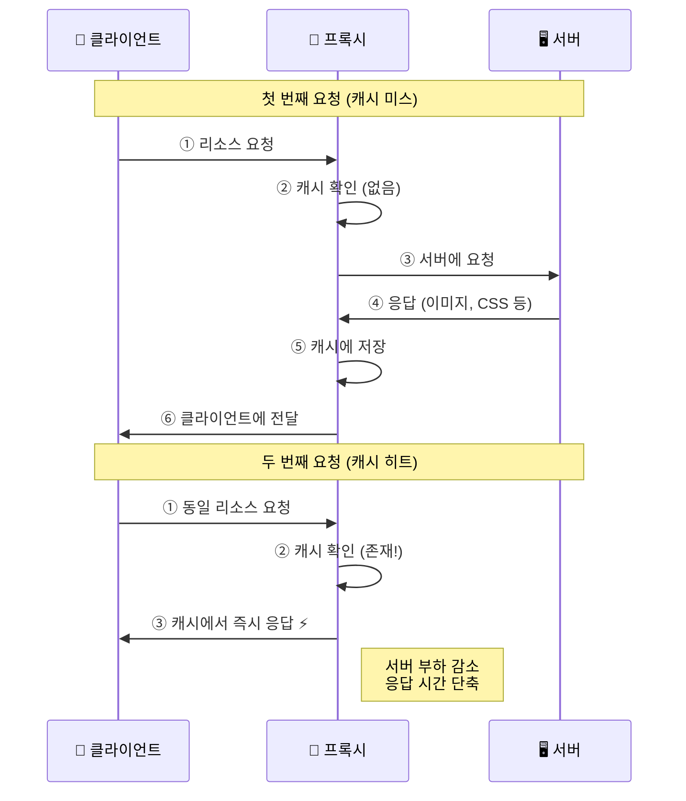

##### 📋 캐싱 전략

| 전략 | 대상 | TTL | 효과 |
|------|------|-----|------|
| **🖼️ 정적 콘텐츠** | 이미지, CSS, JS | 24시간+ | 높은 캐시 히트율 |
| **📊 동적 콘텐츠** | API 응답, DB 쿼리 | 분~시간 | 서버 부하 감소 |
| **🔄 조건부 캐싱** | ETag, Last-Modified | 동적 | 효율적 검증 |
| **🗑️ 캐시 무효화** | 콘텐츠 변경 시 | 즉시 | 최신 데이터 보장 |

---

#### 🔐 SSL 터미네이션 (SSL Termination)

> HTTPS 연결을 프록시에서 처리하여 백엔드 서버 부하 감소

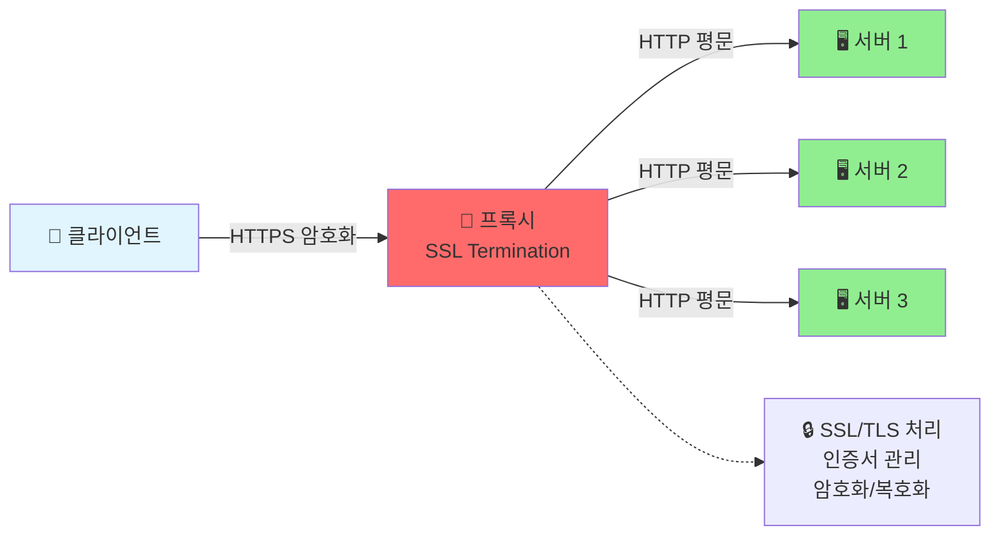

##### ✅ 장점

| 항목 | 효과 | 설명 |
|------|------|------|
| **⚡ 성능 향상** | 백엔드 CPU 절약 | 암호화 처리를 프록시에서 일괄 수행 |
| **🔧 관리 용이** | 중앙화된 인증서 관리 | 하나의 인증서로 여러 서버 보호 |
| **🔒 보안 강화** | 일관된 보안 정책 | TLS 버전, 암호화 스위트 통일 |
| **📊 모니터링** | SSL 트래픽 분석 | 암호화된 트래픽 검사 가능 |

---

#### 🗜️ 압축 (Compression)

> 응답 데이터 압축으로 대역폭 절약 및 전송 속도 향상

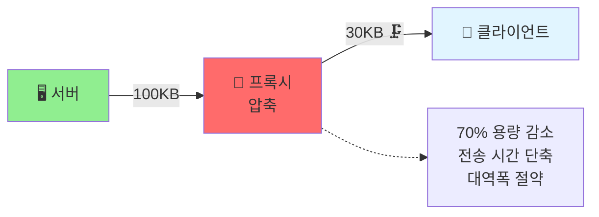

##### 📋 압축 알고리즘 비교

| 알고리즘 | 압축률 | 속도 | 브라우저 지원 | 권장 사용 |
|---------|--------|------|--------------|----------|
| **Gzip** | ⭐⭐⭐ | ⚡⚡⚡ | 모든 브라우저 | 일반적인 웹 콘텐츠 |
| **Brotli** | ⭐⭐⭐⭐ | ⚡⚡ | 최신 브라우저 | 정적 리소스, 높은 압축률 필요 시 |
| **Deflate** | ⭐⭐ | ⚡⚡⚡ | 대부분 브라우저 | 레거시 호환성 필요 시 |

---

## 💼 실제 활용 사례

### 1️⃣ 기업 환경에서의 Forward Proxy 활용

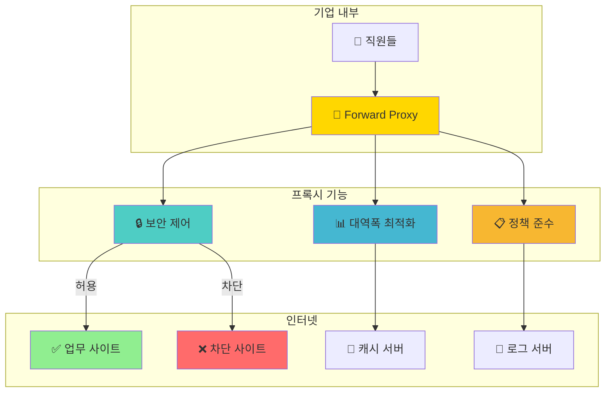

| 기능 | 구현 방법 | 효과 |
|------|----------|------|
| **🔒 네트워크 보안 강화** | 악성 사이트 차단, 콘텐츠 필터링 | 보안 위협 차단, 직원 보호 |
| **📊 대역폭 최적화** | 정적 리소스 캐싱 (이미지, CSS, JS) | 70% 이상 대역폭 절약 가능 |
| **📋 정책 준수** | SNS/스트리밍 차단, 업무시간 제한 | 생산성 향상, 컴플라이언스 |

---

### 2️⃣ 웹 서비스에서의 Reverse Proxy 활용

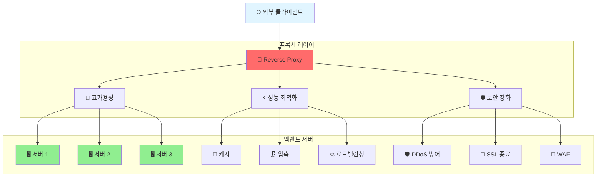

#### 📊 성능 최적화 지표

| 최적화 기법 | 개선 효과 | 적용 사례 |
|------------|----------|----------|
| **💾 캐싱** | 응답 시간 80% 감소 | 정적 리소스, API 응답 |
| **🗜️ 압축** | 전송 용량 70% 감소 | HTML, CSS, JSON |
| **⚖️ 로드 밸런싱** | 처리량 300% 증가 | 트래픽 분산 |

---

### 3️⃣ 마이크로서비스 아키텍처에서의 활용

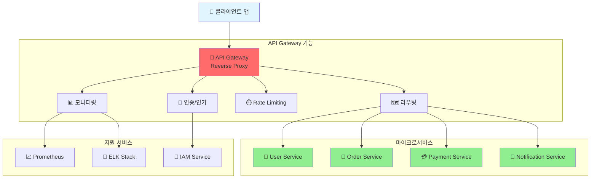

#### 🎯 핵심 가치

| 역할 | 기능 | 장점 |
|------|------|------|
| **🚪 API 게이트웨이** | 단일 진입점, 서비스 통합 | 클라이언트 단순화 |
| **🗺️ 서비스 디스커버리** | 동적 라우팅, 헬스체크 | 자동 장애 복구 |
| **📊 중앙화 모니터링** | 통합 로깅, 메트릭 수집 | 운영 효율성 향상 |

---

## 🛠️ 운영 및 관리

### 1️⃣ 프록시 서버 선택 기준

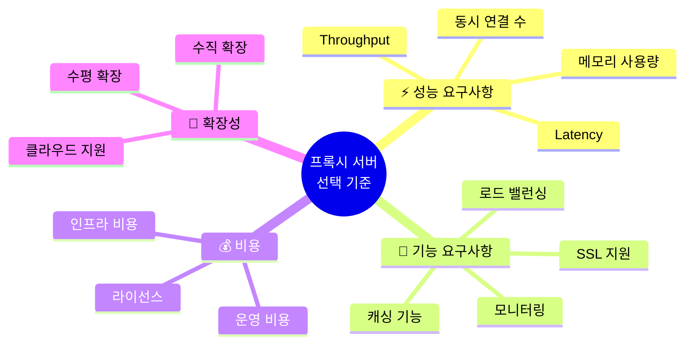

| 항목 | 평가 기준 | 권장 사양 |
|------|----------|----------|
| **⚡ 처리량** | 초당 요청 수 (RPS) | 10,000+ RPS |
| **⏱️ 지연 시간** | 평균 응답 시간 | < 10ms |
| **🔌 동시 연결** | 최대 동시 연결 수 | 100,000+ |
| **💾 메모리** | 캐싱 용량 | 8GB+ |

---

### 2️⃣ 보안 고려사항

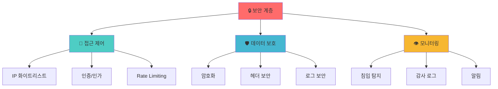

| 보안 계층 | 구현 방법 | 목적 |
|----------|----------|------|
| **🚪 접근 제어** | IP 필터링, OAuth, JWT | 무단 접근 차단 |
| **🛡️ 데이터 보호** | TLS 1.3, 헤더 마스킹 | 데이터 유출 방지 |
| **⏱️ Rate Limiting** | Token Bucket, Leaky Bucket | DDoS 공격 방어 |

---

### 3️⃣ 성능 최적화

#### 💾 캐싱 전략

| 콘텐츠 유형 | TTL | 캐시 키 | 효과 |
|------------|-----|---------|------|
| **이미지** | 7일 | URL + Version | 99% 히트율 |
| **CSS/JS** | 1일 | URL + Hash | 95% 히트율 |
| **API 응답** | 5분 | URL + Query | 70% 히트율 |
| **HTML** | 1분 | URL | 50% 히트율 |

#### 🔌 연결 관리

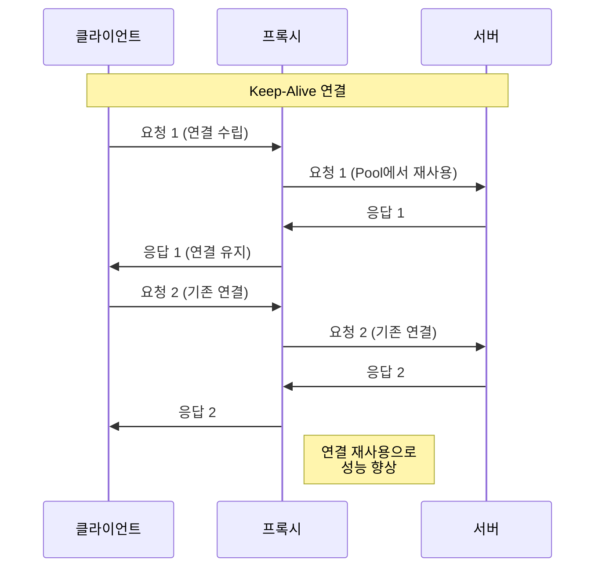

| 설정 | 권장값 | 효과 |
|------|--------|------|
| **Keep-Alive Timeout** | 65초 | 연결 재사용 극대화 |
| **Connection Pool Size** | 100+ | 동시 요청 처리 |
| **Timeout** | 30초 | 리소스 효율성 |

---

### 4️⃣ 모니터링과 로깅

```mermaid
graph LR
    subgraph "메트릭 수집"
        P[🔄 프록시] --> M1[⏱️ 응답 시간]
        P --> M2[📊 처리량]
        P --> M3[❌ 에러율]
        P --> M4[💚 헬스 체크]
    end
    
    subgraph "모니터링 도구"
        M1 --> PROM[📈 Prometheus]
        M2 --> PROM
        M3 --> PROM
        M4 --> PROM
        
        PROM --> GRAF[📊 Grafana]
        GRAF --> ALERT[🚨 알림]
    end
    
    subgraph "로그 관리"
        P --> LOG[📝 로그]
        LOG --> ELK[🔍 ELK Stack]
        ELK --> VIS[📊 시각화]
    end
    
    style P fill:#ff6b6b
    style PROM fill:#e74c3c
    style GRAF fill:#3498db
```

#### 📊 핵심 메트릭

| 메트릭 | 정상 범위 | 경고 임계값 | 조치 |
|--------|----------|-----------|------|
| **응답 시간** | < 100ms | > 500ms | 서버 증설 |
| **처리량** | 1000+ RPS | < 500 RPS | 캐시 확인 |
| **에러율** | < 0.1% | > 1% | 장애 조사 |
| **CPU 사용률** | < 70% | > 90% | 스케일 아웃 |

---

## ⚖️ 프록시의 장단점 분석

```mermaid
graph TB
    PROXY[🔄 프록시] --> PROS[✅ 장점]
    PROXY --> CONS[❌ 단점]
    
    PROS --> P1[🔒 보안 강화]
    PROS --> P2[⚡ 성능 향상]
    PROS --> P3[🛠️ 운영 효율성]
    
    CONS --> C1[🔧 복잡성 증가]
    CONS --> C2[⏱️ 성능 오버헤드]
    CONS --> C3[⚠️ 보안 고려사항]
    
    style PROXY fill:#3498db
    style PROS fill:#2ecc71
    style CONS fill:#e74c3c
    style P1 fill:#90ee90
    style P2 fill:#90ee90
    style P3 fill:#90ee90
    style C1 fill:#ffcccb
    style C2 fill:#ffcccb
    style C3 fill:#ffcccb
```

### ✅ 장점

| 카테고리 | 세부 항목 | 효과 | 중요도 |
|---------|----------|------|--------|
| **🔒 보안 강화** | • 네트워크 보호<br>• DDoS/SQL 인젝션 차단<br>• 세밀한 접근 제어 | 내부 네트워크 안전성 확보<br>공격 사전 차단<br>일관된 보안 정책 적용 | ⭐⭐⭐⭐⭐ |
| **⚡ 성능 향상** | • 캐싱<br>• 압축<br>• 로드 밸런싱 | 응답 시간 80% 감소<br>대역폭 70% 절약<br>처리량 300% 증가 | ⭐⭐⭐⭐⭐ |
| **🛠️ 운영 효율성** | • 중앙화된 관리<br>• 통합 모니터링<br>• 유연한 확장성 | 관리 포인트 단일화<br>시스템 가시성 향상<br>빠른 스케일링 | ⭐⭐⭐⭐ |

### ❌ 단점

| 카테고리 | 세부 항목 | 영향 | 완화 방법 |
|---------|----------|------|----------|
| **🔧 복잡성 증가** | • 설정 복잡성<br>• 디버깅 어려움<br>• 학습 곡선 | 초기 구축 시간 증가<br>장애 대응 시간 증가<br>전문 인력 필요 | IaC 도구 활용<br>분산 추적 도입<br>문서화 강화 |
| **⏱️ 성능 오버헤드** | • 추가 지연 (5-10ms)<br>• 리소스 사용<br>• 단일 장애점 | 응답 시간 증가<br>인프라 비용 증가<br>가용성 위험 | 고성능 프록시 사용<br>리소스 모니터링<br>HA 구성 |
| **⚠️ 보안 고려사항** | • 프록시 취약점<br>• 데이터 노출 위험<br>• 인증 복잡성 | 보안 사고 가능성<br>중간자 공격 위험<br>인증 오버헤드 | 정기 보안 패치<br>End-to-End 암호화<br>OAuth/JWT 활용 |

### 📊 Forward vs Reverse Proxy 비교

```mermaid
graph LR
    subgraph "Forward Proxy"
        direction TB
        FC[👤 클라이언트] --> FP[🔄 FP]
        FP --> FS[🌐 서버들]
        
        FPF[특징]
        FPF --> FPF1[클라이언트 보호]
        FPF --> FPF2[익명성 제공]
        FPF --> FPF3[접근 제어]
    end
    
    subgraph "Reverse Proxy"
        direction TB
        RC[👤 클라이언트들] --> RP[🔄 RP]
        RP --> RS[🖥️ 서버]
        
        RPF[특징]
        RPF --> RPF1[서버 보호]
        RPF --> RPF2[로드 밸런싱]
        RPF --> RPF3[SSL 종료]
    end
    
    style FP fill:#ffd700
    style RP fill:#ff6b6b
```

| 비교 항목 | Forward Proxy | Reverse Proxy |
|----------|--------------|---------------|
| **위치** | 클라이언트 측 | 서버 측 |
| **보호 대상** | 👤 클라이언트 | 🖥️ 서버 |
| **주요 목적** | 익명성, 접근 제어 | 보안, 성능, 확장성 |
| **사용 사례** | 기업 방화벽, VPN | 웹 서버, API 게이트웨이 |
| **투명성** | 클라이언트가 인식 | 클라이언트는 모름 |

---

## 🔖 HTTP 헤더와 프록시

### 📨 Forwarded 헤더

> 프록시를 통과하는 요청에서 원본 클라이언트 정보를 전달

```mermaid
sequenceDiagram
    participant C as 👤 클라이언트<br/>IP: 203.0.113.10
    participant P1 as 🔄 Proxy 1
    participant P2 as 🔄 Proxy 2
    participant S as 🖥️ 서버
    
    C->>P1: Request
    Note right of C: Host: api.example.com<br/>Proto: https<br/>Port: 443
    
    P1->>P2: Request + Headers
    Note right of P1: X-Forwarded-For: 203.0.113.10<br/>X-Forwarded-Host: api.example.com<br/>X-Forwarded-Proto: https
    
    P2->>S: Request + Headers
    Note right of P2: X-Forwarded-For: 203.0.113.10, 198.51.100.5<br/>X-Forwarded-Host: api.example.com<br/>X-Forwarded-Proto: https
    
    S->>S: 원본 정보 확인
    Note right of S: 실제 클라이언트:<br/>203.0.113.10
```

#### 📋 주요 헤더

| 헤더 | 용도 | 예시 | 중요도 |
|------|------|------|--------|
| **X-Forwarded-For** | 클라이언트 원본 IP 주소 | `203.0.113.10, 198.51.100.5` | ⭐⭐⭐⭐⭐ |
| **X-Forwarded-Host** | 원본 호스트명 | `api.example.com` | ⭐⭐⭐⭐ |
| **X-Forwarded-Proto** | 원본 프로토콜 | `https` | ⭐⭐⭐⭐ |
| **X-Forwarded-Port** | 원본 포트 번호 | `443` | ⭐⭐⭐ |

#### 🎯 표준화된 Forwarded 헤더 (RFC 7239)

```
Forwarded: for=203.0.113.10;host=api.example.com;proto=https;by=proxy1
```

| 장점 | 설명 |
|------|------|
| **표준화** | RFC 7239 공식 표준 |
| **다중 프록시 지원** | 여러 프록시 정보를 정확히 전달 |
| **구조화** | 명확한 키=값 형식 |

---

## 🎯 결론

### 📌 핵심 요약

```mermaid
mindmap
  root((프록시<br/>핵심 가치))
    🔒 보안
      네트워크 보호
      공격 차단
      접근 제어
    ⚡ 성능
      캐싱
      압축
      로드 밸런싱
    📊 확장성
      수평 확장
      유연한 구성
      고가용성
    🛠️ 관리
      중앙화
      모니터링
      자동화
```

> 프록시는 현대 웹 아키텍처에서 **보안**, **성능**, **확장성**을 위한 필수 기술입니다.

### 🎭 두 가지 프록시 유형

| 유형 | 특화 분야 | 핵심 가치 |
|------|----------|----------|
| **⬆️ Forward Proxy** | 클라이언트 보호 & 접근 제어 | 익명성, 보안, 정책 적용 |
| **⬇️ Reverse Proxy** | 서버 관리 & 로드 밸런싱 | 성능, 가용성, 확장성 |

### ✅ 효과적인 프록시 운영 체크리스트

```mermaid
graph LR
    A[📋 프록시 운영] --> B[1️⃣ 목적 설정]
    A --> C[2️⃣ 기술 선택]
    A --> D[3️⃣ 모니터링]
    A --> E[4️⃣ 유지보수]
    
    B --> B1[✓ 보안 우선순위<br>✓ 성능 목표<br>✓ 가용성 요구사항]
    C --> C1[✓ 솔루션 평가<br>✓ 요구사항 매칭<br>✓ PoC 수행]
    D --> D1[✓ 메트릭 수집<br>✓ 알림 설정<br>✓ 대시보드 구성]
    E --> E1[✓ 정기 패치<br>✓ 성능 튜닝<br>✓ 문서화]
    
    style A fill:#3498db
    style B fill:#2ecc71
    style C fill:#f39c12
    style D fill:#9b59b6
    style E fill:#e74c3c
```

| 단계 | 주요 활동 | 성공 기준 |
|------|----------|----------|
| **1️⃣ 명확한 목적 설정** | 보안, 성능, 가용성 우선순위 정의 | 측정 가능한 KPI 수립 |
| **2️⃣ 적절한 기술 선택** | 요구사항에 맞는 프록시 솔루션 선택 | PoC 성공, 비용 대비 효과 |
| **3️⃣ 지속적인 모니터링** | 성능과 보안 상태 실시간 추적 | SLA 달성, 장애 조기 발견 |
| **4️⃣ 정기적인 업데이트** | 보안 패치 및 성능 개선 적용 | 제로 다운타임, 보안 사고 0건 |

### 🚀 다음 단계

프록시의 특성을 이해하고 적절히 활용하면:

- ✅ **안전한 서비스**: 다층 보안으로 공격 방어
- ✅ **빠른 응답**: 캐싱과 최적화로 사용자 경험 향상
- ✅ **확장 가능**: 트래픽 증가에 유연하게 대응
- ✅ **운영 효율**: 중앙화된 관리로 비용 절감

---

## 📚 참조

### 📖 공식 문서 및 표준

| 카테고리 | 문서 | 설명 |
|---------|------|------|
| **표준** | [RFC 7239 - Forwarded HTTP Extension](https://tools.ietf.org/html/rfc7239) | 표준 Forwarded 헤더 명세 |
| **표준** | [RFC 2616 - HTTP/1.1](https://tools.ietf.org/html/rfc2616) | HTTP 프로토콜 표준 |
| **구현** | [Nginx - Reverse Proxy](https://nginx.org/en/docs/http/ngx_http_proxy_module.html) | Nginx 프록시 모듈 |
| **구현** | [Apache - mod_proxy](https://httpd.apache.org/docs/current/mod/mod_proxy.html) | Apache 프록시 모듈 |

### 🛠️ 프록시 솔루션

| 솔루션 | 특징 | 추천 용도 |
|--------|------|----------|
| **[Nginx](https://nginx.org/)** | 고성능, 경량, 비동기 | 웹 서버, Reverse Proxy |
| **[HAProxy](https://www.haproxy.org/)** | 로드 밸런싱 특화, 고가용성 | L7 로드 밸런서 |
| **[Squid](http://www.squid-cache.org/)** | 캐싱 프록시, Forward Proxy | 캐시 서버, Forward Proxy |
| **[Envoy](https://www.envoyproxy.io/)** | 마이크로서비스, 서비스 메시 | Cloud Native 환경 |
| **[Traefik](https://traefik.io/)** | 동적 설정, Kubernetes 통합 | 컨테이너 환경 |

### 🔗 관련 기술

```mermaid
mindmap
  root((프록시<br/>관련 기술))
    🌐 네트워킹
      Load Balancing
      CDN
      DNS
    🔒 보안
      WAF
      DDoS 방어
      SSL/TLS
    📦 아키텍처
      마이크로서비스
      API Gateway
      Service Mesh
    📊 모니터링
      Prometheus
      Grafana
      ELK Stack
```

### 🔐 보안 자료

| 자료 | 내용 |
|------|------|
| **[OWASP](https://owasp.org/)** | 웹 애플리케이션 보안 가이드 |
| **[NIST Cybersecurity](https://www.nist.gov/cyberframework)** | 사이버보안 프레임워크 |
| **[SSL Labs](https://www.ssllabs.com/projects/best-practices/)** | SSL/TLS 모범 사례 |

---

> **마지막 업데이트**: 2025-11-17  
> **작성자**: YGSTUDY  
> **버전**: 2.0 (시각화 개선)
