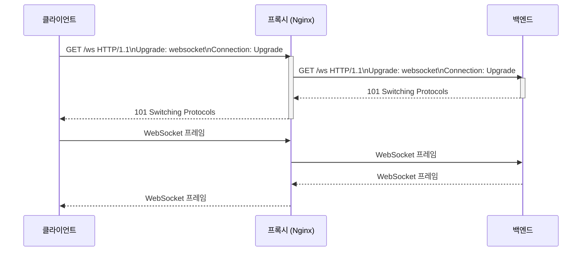

# WebSocket 프록싱 (WebSocket Proxy)

일반 HTTP 요청을 프록시하는 것과 WebSocket을 프록시하는 건 같은 Nginx를 쓰더라도 설정이 다르다. HTTP는 요청 하나에 응답 하나로 끝나지만, WebSocket은 연결을 맺은 뒤 닫힐 때까지 계속 열어둔다. 이 차이 때문에 프록시가 HTTP 방식으로 처리하려다가 연결을 중간에 끊어버리는 일이 생긴다.

## HTTP에서 WebSocket으로 업그레이드하는 흐름

WebSocket은 HTTP로 시작한다. 클라이언트가 `ws://` 또는 `wss://`로 접속할 때 실제로는 HTTP GET 요청을 먼저 보내고, 그 안에 업그레이드 요청을 담는다.

```
GET /chat HTTP/1.1
Host: example.com
Upgrade: websocket
Connection: Upgrade
Sec-WebSocket-Key: dGhlIHNhbXBsZSBub25jZQ==
Sec-WebSocket-Version: 13
```

서버가 이 요청을 받아들이면 101 Switching Protocols로 응답한다.

```
HTTP/1.1 101 Switching Protocols
Upgrade: websocket
Connection: Upgrade
Sec-WebSocket-Accept: s3pPLMBiTxaQ9kYGzzhZRbK+xOo=
```

이 교환이 끝나면 HTTP 프로토콜은 사라지고 WebSocket 프레임 방식으로 전환된다. 이후부터는 클라이언트와 서버가 언제든 양방향으로 데이터를 보낼 수 있다.

프록시가 중간에 있을 때 문제가 생기는 지점이 여기다. 프록시가 `Upgrade` 헤더와 `Connection: Upgrade`를 백엔드로 그대로 전달해야 하는데, 기본적으로 대부분의 프록시는 hop-by-hop 헤더를 제거한다. `Connection` 헤더가 hop-by-hop으로 분류되기 때문에 별도 설정 없이는 업그레이드가 실패한다.



101이 교환된 뒤 프록시는 클라이언트와 백엔드 사이에서 TCP 바이트를 그냥 중계하는 터널이 된다. HTTP 파싱은 더 이상 하지 않는다.

## Nginx 설정

Nginx에서 WebSocket 프록시를 제대로 하려면 `Upgrade`와 `Connection` 헤더를 명시적으로 백엔드에 전달해야 한다.

```nginx
http {
    # $http_upgrade가 빈 문자열이면 connection_upgrade가 "close"가 됨
    map $http_upgrade $connection_upgrade {
        default upgrade;
        ''      close;
    }

    server {
        listen 443 ssl;
        server_name example.com;

        location /ws/ {
            proxy_pass http://backend;
            proxy_http_version 1.1;

            proxy_set_header Upgrade $http_upgrade;
            proxy_set_header Connection $connection_upgrade;

            proxy_set_header Host $host;
            proxy_set_header X-Real-IP $remote_addr;
            proxy_set_header X-Forwarded-For $proxy_add_x_forwarded_for;

            # WebSocket은 long-lived connection이므로 타임아웃을 늘려야 함
            proxy_read_timeout 3600s;
            proxy_send_timeout 3600s;

            # 버퍼링 비활성화 - 실시간 메시지 지연 방지
            proxy_buffering off;
        }
    }
}
```

`proxy_http_version 1.1` 설정이 빠지면 Nginx가 HTTP/1.0으로 백엔드에 연결하고, HTTP/1.0은 `Connection: keep-alive`를 지원하지 않아 업그레이드가 안 된다.

`proxy_buffering off`는 WebSocket에서 중요하다. 버퍼링이 켜져 있으면 프록시가 데이터를 모아서 보내려 하는데, WebSocket에서는 작은 메시지를 즉시 전달해야 하는 경우가 많아 지연이 생긴다. 채팅처럼 실시간성이 중요한 경우라면 반드시 꺼야 한다.

## Caddy 설정

Caddy는 WebSocket 업그레이드를 자동으로 처리한다. 별도 헤더 설정 없이 `reverse_proxy`만 써도 WebSocket이 동작한다.

```caddyfile
example.com {
    reverse_proxy /ws/* localhost:3000 {
        # 기본적으로 Upgrade 헤더는 자동 처리됨
        # 타임아웃만 명시적으로 설정
        transport http {
            response_header_timeout 0
            read_timeout 1h
        }
    }
}
```

Caddy의 `response_header_timeout 0`은 서버 응답 헤더 수신 대기 시간을 무제한으로 설정하는 것이다. WebSocket은 101을 보낸 뒤 오랫동안 헤더를 더 보내지 않으니, 이 값이 기본값이면 연결이 끊긴다.

## HAProxy 설정

HAProxy는 HTTP 모드와 TCP 모드 두 가지 방식으로 WebSocket을 다룰 수 있다.

HTTP 모드에서 WebSocket을 프록시하려면 업그레이드 요청을 감지해서 TCP 터널로 전환하도록 설정한다.

```haproxy
frontend fe_websocket
    bind *:443 ssl crt /etc/ssl/certs/example.pem
    mode http
    option http-server-close

    # Upgrade 헤더가 있으면 ws 백엔드로
    use_backend ws_backend if { hdr(Upgrade) -i websocket }
    default_backend http_backend

backend ws_backend
    mode http
    option http-server-close

    # 타임아웃 설정
    timeout connect 5s
    timeout client  1h
    timeout server  1h

    # sticky session (아래 섹션에서 설명)
    balance roundrobin
    cookie WS_SRV insert indirect nocache

    server ws1 10.0.0.1:3000 check cookie ws1
    server ws2 10.0.0.2:3000 check cookie ws2
```

HAProxy에서 WebSocket 연결이 끊기는 원인 중 하나가 `timeout tunnel`이다. HTTP 모드에서 WebSocket으로 전환된 후에는 `timeout tunnel` 값이 적용되는데, 이 값이 기본값이나 짧은 값으로 설정되어 있으면 연결이 중간에 끊긴다.

```haproxy
defaults
    timeout tunnel  1h
```

## long-lived connection 타임아웃 문제

WebSocket은 연결을 오래 유지한다. 중간에 프록시, 방화벽, AWS ELB 같은 것들이 놀고 있는 연결을 끊어버린다.

일반적으로 발생하는 타임아웃 단계는 세 곳이다.

첫째, 프록시 자체 타임아웃. Nginx의 `proxy_read_timeout`은 백엔드에서 데이터가 오지 않으면 해당 시간 후에 연결을 닫는다. 기본값이 60초라서, 1분 동안 아무 메시지도 없으면 연결이 끊긴다. WebSocket 채팅에서 사용자가 1분 넘게 메시지를 안 보내다가 갑자기 보내면 실패하는 이유가 이것이다.

둘째, 방화벽과 NAT. 라우터나 AWS 보안 그룹 같은 곳에서 idle 연결을 일정 시간 후에 테이블에서 지운다. AWS NLB의 기본 idle timeout은 350초다. 연결이 살아있는 것처럼 보여도 중간 장비에서 이미 잊어버린 상태가 된다.

셋째, 브라우저 자체. 특정 브라우저나 모바일 환경에서 백그라운드 탭의 연결을 끊기도 한다.

해결 방법은 heartbeat ping이다. 클라이언트나 서버가 주기적으로 ping 프레임을 보내서 연결을 살아있게 유지한다. WebSocket 프로토콜에 ping/pong 프레임이 정의되어 있고, 대부분의 서버 라이브러리가 이를 지원한다.

```javascript
// Node.js ws 라이브러리 예제
const WebSocket = require('ws');
const wss = new WebSocket.Server({ port: 3000 });

wss.on('connection', (ws) => {
    // 30초마다 ping
    const interval = setInterval(() => {
        if (ws.readyState === WebSocket.OPEN) {
            ws.ping();
        }
    }, 30000);

    ws.on('close', () => clearInterval(interval));

    ws.on('pong', () => {
        // 클라이언트가 살아있음 확인
    });
});
```

프록시 타임아웃은 ping 주기보다 넉넉하게 설정해야 한다. ping을 30초마다 보낸다면 `proxy_read_timeout`은 최소 60초 이상 줘야 한다.

## 1006 close 디버깅

WebSocket 연결이 끊겼을 때 브라우저 개발자 도구에서 close code 1006이 뜨면 비정상 종료다. 정상적인 WebSocket close 핸드셰이크 없이 TCP 연결이 끊어진 것이다.

1006이 발생하는 주요 원인들이 있다.

프록시가 Upgrade 헤더를 전달하지 못한 경우, 백엔드가 101을 보내지 않고 400이나 404를 보낸다. 브라우저 네트워크 탭에서 해당 요청을 찾아 Status Code가 101인지 확인한다. 101이 아니면 프록시 설정 문제다.

타임아웃으로 끊어진 경우, 서버 로그와 프록시 로그에서 시간을 맞춰본다. Nginx의 경우 `/var/log/nginx/error.log`에 upstream timed out 메시지가 찍힌다.

```
2026/07/19 03:41:23 [error] 12345#0: *1234 upstream timed out (110: Connection timed out)
while reading response header from upstream, client: 1.2.3.4, ...
```

백엔드 프로세스가 죽은 경우, 프록시가 연결을 맺고 있던 백엔드 서버가 내려가면 프록시가 기존 연결을 닫는다. 이때도 1006이 뜬다. 재배포나 스케일 인 작업 중에 이 패턴이 나오면 정상이다.

TLS 설정 문제로 `wss://`가 실패하는 경우도 있다. 인증서 불일치나 SNI 처리 문제로 TLS 핸드셰이크 자체가 실패한다. 이 경우 브라우저 콘솔에 TLS 관련 오류가 함께 뜬다.

프록시 레벨에서 확인할 때는 `tcpdump`로 실제 패킷을 보거나, 프록시를 거치지 않고 백엔드에 직접 WebSocket 연결을 시도해서 프록시 문제인지 백엔드 문제인지 분리한다.

```bash
# wscat으로 직접 백엔드에 연결 테스트
wscat -c ws://10.0.0.1:3000/ws

# 프록시 통해서 연결 테스트
wscat -c wss://example.com/ws
```

## 스케일 아웃 시 sticky session 이슈

WebSocket 연결은 하나의 백엔드 서버에 물려 있다. 메모리 기반 상태나 연결 상태를 백엔드 서버가 들고 있는 구조라면, 요청이 다른 백엔드로 가면 그 상태를 잃어버린다.

일반적인 HTTP 요청은 각 요청마다 라운드로빈으로 백엔드를 선택해도 문제없다. 백엔드가 무상태(stateless)로 설계되어 있기 때문이다. 그런데 WebSocket은 연결 자체가 상태다. 처음 연결을 맺은 서버에 계속 붙어있어야 한다.

Nginx에서 IP 해시 방식으로 같은 클라이언트를 같은 백엔드에 고정시킬 수 있다.

```nginx
upstream ws_backend {
    ip_hash;  # 같은 클라이언트 IP는 같은 서버로
    server 10.0.0.1:3000;
    server 10.0.0.2:3000;
    server 10.0.0.3:3000;
}
```

IP 해시는 NAT 뒤에 있는 클라이언트들이 같은 IP로 보이면 한 서버에 쏠리는 문제가 있다. 사내 망에서 접속하는 사용자가 많은 서비스라면 부하 분산이 제대로 안 된다.

더 나은 방법은 연결 수 기반 해싱이나 세션 쿠키 기반 sticky session이다. HAProxy는 `balance leastconn`과 쿠키 기반 sticky session을 함께 쓸 수 있다.

```haproxy
backend ws_backend
    balance leastconn
    cookie WS_SRV insert indirect nocache httponly

    server ws1 10.0.0.1:3000 check cookie ws1
    server ws2 10.0.0.2:3000 check cookie ws2
    server ws3 10.0.0.3:3000 check cookie ws3
```

클라이언트가 처음 연결할 때 `WS_SRV` 쿠키를 받고, 이후 재연결할 때 그 쿠키로 같은 서버에 붙게 된다.

근본적으로는 백엔드가 상태를 공유 스토리지에 두는 방식이 맞다. 연결 정보나 채널 구독 상태를 Redis나 Pub/Sub 시스템에 두면 어느 백엔드에 붙어도 같은 상태를 볼 수 있다. Socket.IO를 쓰는 경우 Redis adapter를 붙이면 sticky session 없이 스케일 아웃이 된다.

sticky session으로 임시방편을 쓰면 서버 한 대가 내려갈 때 그 서버의 모든 연결이 끊기고 클라이언트가 재연결을 해야 한다. 재연결 로직을 클라이언트에 반드시 넣어야 하고, 재연결 시 다른 서버로 붙게 된다. 서버 교체나 배포할 때 이 재연결 폭풍(thundering herd)이 문제가 되면, 배포 시 서버를 순차적으로 내려서 재연결을 분산시킨다.
