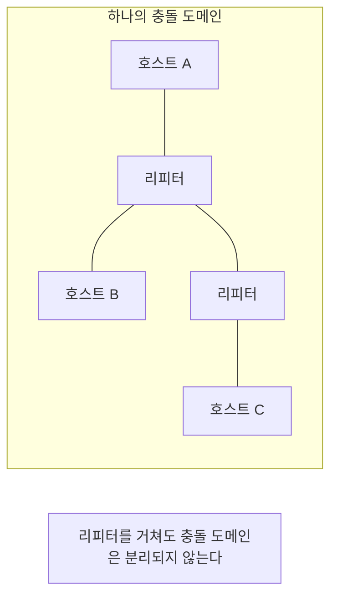

# 리피터 (Repeater)

## 정의

리피터는 OSI 1계층(물리 계층)에서 동작하는 장비다. 전송 매체를 지나면서 감쇠(attenuation)된 신호를 받아서 원래 세기로 복원한 뒤 다음 구간으로 내보낸다. 케이블이 길어지면 전기 신호든 광 신호든 거리에 비례해 약해지고 노이즈가 섞인다. 어느 지점을 넘어가면 수신 측에서 0과 1을 구분하지 못해 비트 에러가 터진다. 리피터는 신호가 그 한계에 도달하기 전에 끼어들어 깨끗한 신호를 다시 만들어 보내는 역할만 한다.

여기서 중요한 건 리피터가 비트 단위까지만 본다는 점이다. MAC 주소도, IP 주소도, 프레임 구조도 해석하지 않는다. 들어온 전기/광 펄스를 0과 1로 판독해서 똑같은 패턴을 다시 쏘는 게 전부다. 그래서 리피터를 거친다고 해서 트래픽이 걸러지거나 방향이 정해지는 일은 없다. 한쪽 포트로 들어온 신호는 무조건 다른 쪽 포트로 나간다.

물리 계층 장비라는 말은 실무에서 두 가지 의미를 갖는다. 첫째, 거리 문제를 푸는 도구지 트래픽 문제를 푸는 도구가 아니다. 둘째, 상위 계층의 모든 문제(충돌, 브로드캐스트, 루프)를 그대로 통과시킨다. 이 두 가지가 리피터를 이해하는 핵심이고, 현대 네트워크에서 순수 리피터를 잘 안 쓰는 이유이기도 하다.

---

## 신호 증폭과 신호 재생성은 다르다

리피터를 "신호 증폭기"라고 설명하는 자료가 많은데, 엄밀히 따지면 틀렸다. 증폭(amplification)과 재생성(regeneration)은 동작이 다르고, 리피터는 후자다.

증폭기(amplifier)는 들어온 파형을 그대로 키운다. 신호가 1볼트로 약해졌으면 그걸 5볼트로 끌어올린다. 문제는 신호에 섞인 노이즈도 같이 커진다는 점이다. 거리를 지나면서 붙은 왜곡과 잡음을 신호와 구분하지 못하고 통째로 증폭한다. 증폭기를 여러 단 거치면 노이즈가 계속 누적돼서 결국 원래 비트를 못 알아보는 지점이 온다. 아날로그 신호를 다루는 장비가 이렇게 동작한다.

재생성(regeneration)은 다르다. 들어온 신호를 일단 0과 1로 판독한 다음, 그 비트 패턴을 가지고 완전히 새 파형을 만들어 낸다. 노이즈가 섞인 헌 신호를 키우는 게 아니라, 비트만 읽어서 깨끗한 신호를 새로 그린다. 그래서 앞 구간에서 붙은 노이즈가 다음 구간으로 넘어가지 않는다. 이걸 보통 3R이라고 부른다.

- **Re-amplify**: 신호 세기를 정상 레벨로 복원
- **Re-shape**: 일그러진 펄스 모양을 사각파로 다시 정형
- **Re-time**: 비트 경계 타이밍(클럭)을 다시 맞춤

리피터가 단순 증폭기보다 나은 이유가 여기 있다. 비트를 한 번 판독해서 새로 쓰기 때문에 노이즈가 누적되지 않는다. 다만 공짜는 아니다. 판독 임계값 부근까지 신호가 망가진 상태로 들어오면 0을 1로, 1을 0으로 잘못 읽을 수 있다. 한 번 잘못 읽으면 그 에러는 깨끗한 신호로 "확정"돼서 그대로 전파된다. 그래서 리피터를 신호가 완전히 망가지기 전, 여유가 있을 때 넣어야 한다. 한계 직전까지 끌고 가서 리피터를 박으면 비트 에러가 그대로 재생산된다.

---

## 거리 제한을 넘기기 위한 용도

리피터를 쓰는 단 하나의 이유는 거리다. 전송 매체마다 신호가 살아 있는 최대 거리가 정해져 있고, 그걸 넘어서 케이블을 연장하려면 중간에 신호를 복원해야 한다.

이더넷 규격별 세그먼트 길이 제한이 이 거리의 기준이다.

| 규격 | 매체 | 세그먼트 최대 길이 |
|------|------|-------------------|
| 10BASE5 | 굵은 동축(thick coax) | 500m |
| 10BASE2 | 얇은 동축(thin coax) | 185m |
| 10BASE-T / 100BASE-TX / 1000BASE-T | UTP(꼬임쌍선) | 100m |
| 1000BASE-SX | 멀티모드 광 | 220~550m |
| 1000BASE-LX | 싱글모드 광 | 5km |
| 10GBASE-LR | 싱글모드 광 | 10km |

구리선 기반 이더넷의 100m 제한은 자주 부딪히는 숫자다. 이 100m는 신호 감쇠뿐 아니라 충돌 감지 타이밍까지 고려해서 정해진 값이라 단순히 "조금 넘어도 되겠지"가 통하지 않는다. 사무실 한쪽 끝에서 반대쪽 끝까지 배선했는데 90m가 넘어가는 순간 링크가 붙었다 끊겼다 하는 경우를 본다. 케이블 테스터로 길이를 재 보면 100m를 넘긴 경우가 대부분이다.

동축 케이블 시절에는 리피터로 세그먼트를 이어 붙여 거리를 늘렸다. 10BASE5 한 세그먼트가 500m인데, 리피터를 넣으면 다음 500m 세그먼트로 연결할 수 있었다. 지금은 구리선 구간을 100m 넘겨야 할 때 리피터를 쓰는 대신 중간에 스위치를 한 대 넣는다. 스위치도 한 포트에서 다음 포트로 갈 때 신호를 새로 생성하므로 리피터 역할을 겸한다. 거리도 늘고 충돌 도메인도 분리되니 순수 리피터를 쓸 이유가 없다.

광 구간은 사정이 다르다. 싱글모드 광이라도 수십 km를 넘어가면 신호가 약해지고 분산(dispersion)으로 펄스가 퍼진다. 장거리 광 전송에서는 여전히 신호 복원 장비가 필수다. 이 부분은 뒤에서 따로 다룬다.

---

## 5-4-3 규칙과 충돌 도메인 확장

리피터를 무한정 연결할 수는 없다. 공유 이더넷 시절의 5-4-3 규칙이 이 한계를 정리한 것이다.

규칙은 이렇다. 두 노드 사이 경로에 세그먼트는 최대 5개, 그 사이에 리피터는 최대 4개, 그중 호스트가 실제로 붙는 세그먼트는 최대 3개까지만 둔다. 나머지 2개 세그먼트는 거리를 늘리기 위한 링크 전용(IRL, inter-repeater link)으로만 쓴다.

왜 이런 제약이 생겼나. 공유 이더넷은 CSMA/CD로 충돌을 감지한다. 두 노드가 동시에 전송해서 신호가 부딪히면, 양쪽 다 충돌을 감지하고 잠시 기다렸다 재전송한다. 이게 제대로 동작하려면 한 노드가 보낸 신호가 가장 먼 노드까지 갔다가 충돌 신호가 되돌아올 때까지의 왕복 시간이 정해진 시간 창(10Mbps 이더넷에서 슬롯 타임 512비트 타임) 안에 들어와야 한다. 리피터를 거칠 때마다 전파 지연이 쌓이고, 세그먼트가 길어질수록 왕복 시간이 늘어난다. 리피터를 너무 많이 넣으면 이 왕복 시간이 시간 창을 넘어버린다.

그러면 늦은 충돌(late collision)이 생긴다. 송신을 다 끝냈다고 생각한 뒤에야 충돌 신호가 도착하는 상황이다. CSMA/CD는 전송 중에 충돌을 감지해야 재전송하는데, 전송이 끝난 뒤 충돌이 오면 그 프레임은 그냥 유실된다. 상위 계층이 타임아웃으로 재전송할 때까지 데이터가 안 간다. 5-4-3 규칙은 이 왕복 지연을 안전 범위 안에 묶어두기 위한 숫자다.

여기서 짚을 점은 리피터로 세그먼트를 아무리 이어 붙여도 그 전체가 하나의 충돌 도메인이라는 것이다. 리피터는 충돌 도메인을 나누지 못한다. 세그먼트를 늘릴수록 같은 충돌 도메인에 노드가 더 많이 들어오고, 그만큼 충돌 확률이 올라간다. 거리는 늘었지만 성능은 떨어진다. 5-4-3 규칙은 거리 제약인 동시에 "이 이상 늘리면 충돌 도메인이 감당 못 한다"는 성능 제약이기도 하다.

---

## 허브는 멀티포트 리피터다

허브와 리피터의 관계를 정확히 알아두면 둘을 한 번에 이해할 수 있다. 허브는 포트가 여러 개인 리피터다. 리피터가 입력 한쪽을 출력 한쪽으로 복원해 보낸다면, 허브는 한 포트로 들어온 신호를 나머지 모든 포트로 복원해서 뿌린다. 동작 원리는 똑같이 물리 계층 신호 복원이고, 포트 수만 늘어난 것이다.

그래서 허브의 한계도 리피터와 같다. 허브에 연결된 모든 포트는 하나의 충돌 도메인을 공유한다. 8포트 허브에 8대를 붙이면 8대가 같은 대역폭을 나눠 쓰고, 동시에 두 대가 전송하면 충돌한다. 100Mbps 허브라고 적혀 있어도 8대가 동시에 쓰면 실효 대역폭은 그보다 훨씬 낮다.

물리 계층(리피터, 허브)부터 데이터 링크 계층(브리지, 스위치)까지 장비를 비교하면 차이가 명확해진다.

| 항목 | 리피터 | 허브 | 브리지 | 스위치 |
|------|--------|------|--------|--------|
| 동작 계층 | L1 (물리) | L1 (물리) | L2 (데이터 링크) | L2 (데이터 링크) |
| 판단 기준 | 없음(신호만) | 없음(신호만) | MAC 주소 | MAC 주소 |
| 전달 방식 | 신호 재생성 후 전송 | 모든 포트로 플러딩 | MAC 학습 후 선택 전달 | MAC 학습 후 포트별 전달 |
| 포트 수 | 보통 2 | 다수 | 보통 소수 | 다수 |
| 충돌 도메인 | 분리 못 함 | 분리 못 함 | 포트별 분리 | 포트별 분리 |
| 브로드캐스트 도메인 | 분리 못 함 | 분리 못 함 | 분리 못 함 | 분리 못 함(VLAN으로 가능) |
| 포트당 대역폭 | 공유 | 공유 | 포트별 | 포트별 전용 |
| 동작 방식 | 하드웨어(신호) | 하드웨어(신호) | 소프트웨어 위주 | 하드웨어(ASIC) |

브리지와 스위치의 관계도 허브-리피터 관계와 닮았다. 브리지가 포트 2~몇 개로 충돌 도메인을 나누는 장비라면, 스위치는 포트마다 충돌 도메인을 분리하는 멀티포트 브리지다. L1 계열(리피터/허브)이 신호만 다루는 반면, L2 계열(브리지/스위치)은 MAC 주소를 보고 목적지 포트로만 보낸다는 게 결정적 차이다.

---

## 충돌과 브로드캐스트를 그대로 전파하는 한계

리피터가 충돌 도메인을 분리하지 못한다는 점은 실무에서 꽤 아프게 다가온다. 신호를 그대로 통과시키므로 한쪽에서 일어난 충돌이 반대쪽으로 그대로 넘어간다. 브로드캐스트 프레임도 막을 방법이 없다. 누가 ARP 브로드캐스트를 쏘면 리피터로 연결된 모든 구간이 그 프레임을 받는다. 브로드캐스트 폭주(broadcast storm)가 나면 리피터로 연결된 전 구간이 같이 마비된다.

스위치는 이걸 막는다. 포트별로 충돌 도메인을 나누니 한 포트의 충돌이 다른 포트로 안 넘어간다. 다만 스위치도 브로드캐스트 도메인은 기본적으로 못 나눈다. 브로드캐스트를 막으려면 VLAN으로 나누거나 라우터(L3)로 경계를 그어야 한다. 리피터는 충돌조차 못 막으니 한 단계 더 무력하다.

루프 문제도 있다. 리피터나 허브로 구성된 망에서 케이블을 잘못 꽂아 물리적 루프가 생기면 프레임이 무한히 돌면서 망 전체가 죽는다. L2 스위치에는 STP(Spanning Tree Protocol)가 있어서 루프를 차단하지만, L1 장비에는 그런 보호 장치가 없다. 신호를 그냥 통과시킬 뿐이라 루프가 곧바로 재앙이 된다.

---

## 지연 누적과 신호 왜곡 전파

리피터를 거칠 때마다 약간의 지연이 더해진다. 신호를 판독하고 새로 만들어 내보내는 데 시간이 걸리기 때문이다. 한두 대로는 체감이 안 되지만, 직렬로 여러 대를 연결하면 지연이 누적된다. 이 누적 지연이 앞서 말한 충돌 감지 타이밍을 망가뜨리는 직접 원인이고, 5-4-3 규칙으로 개수를 제한하는 이유다.

신호 왜곡 측면도 봐야 한다. 리피터는 3R로 신호를 복원하지만 완벽하지 않다. 클럭을 다시 맞추는 과정에서 미세한 타이밍 오차(jitter)가 남고, 이게 단마다 조금씩 쌓인다. 정상 범위 안에서는 문제없지만, 들어오는 신호가 이미 임계값 근처까지 망가져 있으면 리피터가 비트를 잘못 판독한다. 한 번 잘못 판독된 비트는 깨끗한 신호로 확정돼 다음 구간으로 그대로 간다. 즉 리피터는 "약해진 신호"는 살리지만 "잘못 읽은 비트"는 오히려 또렷하게 전파한다.

그래서 리피터를 직렬로 길게 거는 구성은 트러블슈팅이 어렵다. 중간 어느 단에서 비트 에러가 시작됐는지 추적해야 하는데, 모든 단이 신호를 재생성하니 어디서 망가졌는지 겉으로 봐선 모른다. 각 구간 케이블 품질, 커넥터 접점, 리피터 자체 상태를 하나씩 끊어가며 확인할 수밖에 없다.

---

## 광 구간: 광 증폭기(EDFA)와 옵티컬 리피터

장거리 광 전송에서는 리피터 개념이 두 갈래로 나뉜다. 광 증폭기(optical amplifier)와 광 리피터(optical regenerator)다. 둘은 동작이 완전히 다르고, 앞에서 본 증폭 대 재생성 구분이 여기서 그대로 갈린다.

EDFA(Erbium-Doped Fiber Amplifier, 어븀 첨가 광섬유 증폭기)는 광 신호를 전기로 바꾸지 않고 빛 상태 그대로 증폭한다. 어븀을 첨가한 광섬유에 펌프 레이저로 에너지를 넣어, 지나가는 신호광을 그대로 키운다. 빠르고 여러 파장을 한꺼번에 처리(WDM)할 수 있어서 장거리 해저 케이블이나 백본 광망에서 일정 거리마다 EDFA를 배치한다. 다만 EDFA는 이름 그대로 증폭기다. 신호와 함께 노이즈(ASE, 증폭 자발 방출)도 같이 키우고, 그게 단마다 누적된다. 비트를 다시 판독하는 게 아니라서 노이즈를 걸러내지 못한다.

그래서 EDFA만으로 무한정 거리를 늘릴 수는 없다. 노이즈가 일정 수준 쌓이면 신호를 다시 깨끗하게 만드는 단계가 필요하다. 이걸 하는 게 3R 옵티컬 리피터다. 광 신호를 전기로 바꾸고(O), 전기 영역에서 비트를 판독해 재생성하고(E), 다시 광으로 바꿔(O) 내보낸다. 이 O-E-O 방식이 진짜 신호 재생성이고, 노이즈를 끊어준다. 대신 EDFA보다 느리고 비싸고 파장별로 따로 처리해야 한다.

실무에서 장거리 광망은 이 둘을 섞어 쓴다. 짧은 간격마다 EDFA로 세기를 유지하다가, 노이즈가 쌓이는 더 긴 간격마다 3R 리피터로 신호를 완전히 복원하는 식이다. 광 링크가 길어졌는데 비트 에러율(BER)이 슬금슬금 올라가는 문제는 보통 EDFA 단만 늘리고 3R 복원이 부족할 때 나타난다.

---

## Wi-Fi 리피터와 유선 리피터는 다른 물건이다

집에서 흔히 쓰는 Wi-Fi 리피터(무선 중계기, range extender)를 유선 리피터와 같은 거라고 생각하면 안 된다. 이름은 같지만 동작이 다르다.

유선 리피터는 물리 계층에서 전기/광 신호를 복원할 뿐 프레임을 해석하지 않는다. 반면 Wi-Fi 리피터는 공유기의 무선 신호를 받아서(수신), 다시 무선으로 쏜다(송신). 신호를 단순 복원하는 게 아니라 받아서 다시 전송하는 구조다. 동작 계층도 물리 계층에 한정되지 않고 데이터 링크 계층까지 걸쳐 있다.

여기서 실무적으로 가장 자주 겪는 문제가 대역폭 반감이다. 무선 리피터가 라디오 한 개로 동작하면, 같은 채널로 신호를 받으면서 동시에 보낼 수 없다. 받는 시간과 보내는 시간을 번갈아 써야 하므로 실효 처리량이 절반 가까이로 떨어진다. 공유기에서 100Mbps가 나오던 구간에 리피터를 하나 끼우면 그 너머에서는 50Mbps 안팎으로 떨어지는 식이다. 리피터를 두 단 거치면 또 절반이 된다. "신호 막대는 꽉 찼는데 속도가 안 나온다"는 민원의 흔한 원인이다.

이걸 피하려면 라디오를 두 개 쓰는(dual-radio) 중계기를 쓰거나, 애초에 유선 백홀(backhaul)로 연결되는 메시 와이파이나 AP를 쓰는 게 낫다. 무선 중계 한 단을 끼우는 순간 그 뒤쪽 대역폭은 반토막이 된다는 걸 전제로 설계해야 한다.

---

## 현대 네트워크에서 순수 리피터를 안 쓰는 이유

지금 데이터센터나 사무실 네트워크를 새로 깔면서 리피터나 허브를 박는 일은 거의 없다. 자리를 전부 스위치가 가져갔기 때문이다.

이유는 단순하다. 스위치는 리피터가 하던 신호 복원(포트 간 신호 재생성)을 그대로 하면서, 리피터가 못 하던 일까지 한다. 포트마다 충돌 도메인을 분리하고, MAC 주소를 보고 목적지로만 보내고, 포트별로 전용 대역폭을 준다. 기능이 상위 호환인데 가격 차이도 거의 없다. L2 스위치가 충분히 싸진 지금, 거리 연장이 필요하면 그냥 스위치를 한 대 넣는다. 거리도 늘고 충돌 도메인도 나뉘니 손해 볼 게 없다.

순수 리피터가 남아 있는 곳은 특수한 물리 환경이다. 장거리 광 전송(EDFA, O-E-O 리피터), 특정 산업용 시리얼 통신 거리 연장, 일부 무선 중계 정도다. 일반적인 LAN 환경에서 "리피터를 한 대 사서 넣자"는 선택지는 사실상 사라졌다.

그래도 리피터 개념을 알아둬야 하는 이유는, 스위치의 포트 간 동작이나 광 링크 설계, 와이파이 중계 구성을 이해할 때 결국 "신호를 어디서 어떻게 복원하느냐"로 돌아오기 때문이다. 충돌 도메인이 어디서 나뉘는지, 거리 한계가 왜 생기는지는 리피터의 한계를 알아야 설명이 된다.

---

## 실무 트러블슈팅

### 거리 초과로 링크가 불안정한 경우

증상은 링크가 붙었다 끊겼다 반복하거나(link flapping), 평소엔 되는데 트래픽이 몰리면 패킷 손실이 튀는 식이다. 구리선 이더넷이라면 가장 먼저 케이블 길이를 의심한다. 케이블 테스터나 스위치의 케이블 진단 기능(예: `show cable-diagnostics tdr`)으로 실제 포설 길이를 잰다. 100m를 넘겼으면 그게 원인이다.

해결은 거리를 줄이거나 중간에 신호를 복원하는 것이다. 요즘은 리피터 대신 중간 지점에 스위치를 한 대 넣어 두 개의 100m 구간으로 나눈다. 광이 가능한 환경이면 해당 구간을 광으로 바꾸는 게 깔끔하다. 광 구간이라면 링크 버짓(link budget) 계산을 다시 한다. 송신 광 출력, 케이블·커넥터·스플라이스 손실 합, 수신 감도를 따져서 여유(margin)가 음수면 거리를 못 버티는 것이다. 이때 거리에 맞는 SFP 모듈(장거리용 LR/ER)로 바꾸거나 중간에 광 증폭/복원 장비를 넣어야 한다.

거리 한계 근처는 평소엔 멀쩡하다가 온도가 오르거나 케이블이 노후하면 신호 여유가 줄어 갑자기 터지는 특성이 있다. "어제까지 됐는데 오늘 안 된다"는 거리 한계 직전 구간에서 흔하다. 처음 깔 때부터 한계의 70~80% 안쪽으로 잡아두는 게 안전하다.

### 리피터/허브를 추가했더니 충돌이 늘어난 경우

오래된 망을 손보다 보면 허브가 직렬로 물려 있는 구성을 만난다. 여기에 노드나 허브를 더 붙이면 충돌이 급증한다. 같은 충돌 도메인에 노드가 늘었으니 당연한 결과다.

진단은 충돌 카운터를 보는 데서 시작한다. 스위치/장비 포트 통계에서 `collisions`, `late collisions` 값이 올라가는지 확인한다. 정상 충돌은 공유 이더넷에서 어느 정도 생기지만, late collision이 잡히면 거리/리피터 단수가 한계를 넘었다는 신호다. 이건 케이블이나 단수를 줄이지 않으면 안 풀린다.

근본 해결은 충돌 도메인을 쪼개는 것이다. 허브를 스위치로 교체하면 포트마다 충돌 도메인이 분리되고, 풀 듀플렉스로 동작해서 충돌 자체가 사라진다(CSMA/CD를 안 쓴다). 사실 요즘 환경에서 "충돌이 많다"는 건 거의 항상 어딘가에 허브가 남아 있거나, 듀플렉스 불일치(한쪽 full, 한쪽 half)가 있다는 뜻이다. 듀플렉스 미스매치는 한쪽 포트만 half-duplex로 잡혀서 충돌과 FCS 에러가 동시에 나는 형태로 나타난다. 양쪽 듀플렉스 설정을 맞추거나 auto로 통일하면 풀린다.
