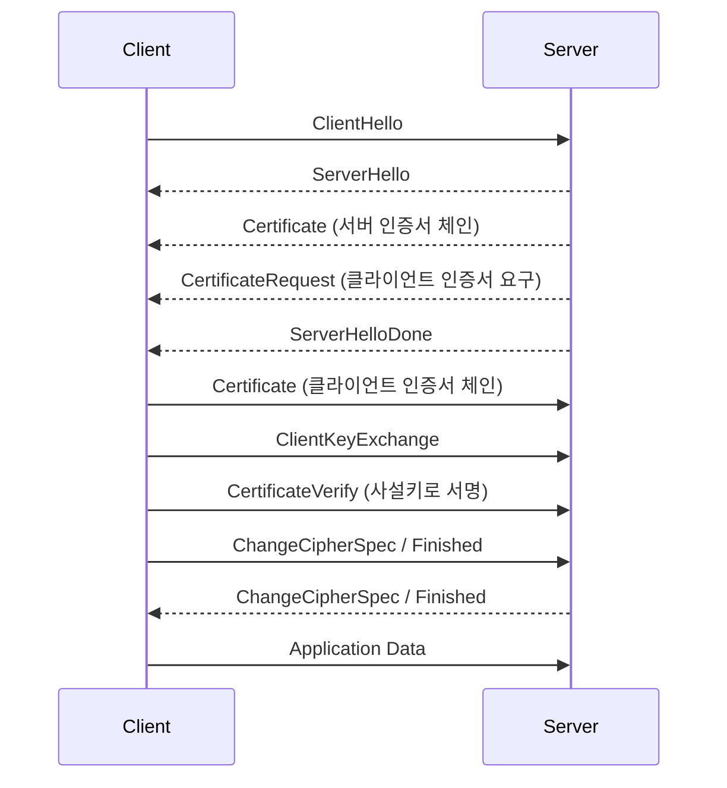

# mTLS - 상호 TLS 인증과 서비스 간 신뢰

일반 HTTPS는 서버만 인증서를 보여준다. 클라이언트는 "이 서버가 진짜 example.com이 맞나"를 검증하지만, 서버 입장에서 "지금 접속한 클라이언트가 누구인가"는 TLS 계층에서 알 수 없다. 그건 보통 그 위 애플리케이션 계층에서 토큰이나 세션으로 처리한다.

mTLS(mutual TLS)는 이 검증을 양방향으로 만든다. 서버도 인증서를 내고, 클라이언트도 인증서를 낸다. 핸드셰이크가 끝나는 순간 서로가 서로의 신원을 인증서로 증명한 상태가 된다. 처음엔 "그냥 API 키 쓰면 되지 왜 인증서까지"라고 생각했는데, 서비스 수가 수십 개로 늘고 내부 트래픽도 평문으로 두면 안 되는 상황이 되니까 mTLS 말고는 답이 없었다. 토큰은 탈취되면 끝이지만, 사설키는 디스크 밖으로 나가지 않게 운영할 수 있다.

이 문서는 mTLS의 핸드셰이크 흐름, 서비스 메시와 제로트러스트에서 mTLS를 어떻게 쓰는지, SPIFFE라는 신원 체계, 그리고 운영하면서 가장 자주 깨지는 인증서 만료·SAN 불일치 문제를 다룬다. 단방향 TLS 핸드셰이크 자체나 ACME 자동 갱신은 [TLS와 HTTPS](TLS_HTTPS.md) 문서에 정리해 두었으니 그쪽을 먼저 보는 게 좋다.

## 단방향 TLS와 무엇이 다른가

핵심 차이는 핸드셰이크 중간에 서버가 클라이언트 인증서를 요구하느냐다. TLS 1.2 기준으로 서버가 `CertificateRequest` 메시지를 보내면 그때부터 양방향이 된다. 클라이언트는 자기 인증서를 보내고, 그 인증서로 핸드셰이크 해시에 서명한 `CertificateVerify`까지 보낸다. 서버는 이 서명을 검증해서 "클라이언트가 정말 그 사설키를 들고 있다"는 걸 확인한다.



여기서 `CertificateRequest`와 `CertificateVerify` 두 메시지가 단방향 TLS에는 없는 부분이다. 나머지는 동일하다. TLS 1.3에서는 메시지 순서가 좀 다르고 `CertificateRequest`가 암호화된 구간에서 오가지만, "서버가 요구하면 클라이언트가 인증서와 서명을 낸다"는 본질은 같다.

서버가 클라이언트 인증서를 검증할 때 보는 건 두 가지다. 첫째, 클라이언트 인증서가 서버가 신뢰하는 CA로 서명됐는가(체인 검증). 둘째, 그 인증서에 박힌 신원(CN 또는 SAN)이 허용된 대상인가. 첫 번째는 TLS 라이브러리가 자동으로 해주지만, 두 번째는 애플리케이션이나 프록시 설정에서 별도로 걸어줘야 하는 경우가 많다. 이걸 빼먹으면 "우리 CA가 발급한 인증서면 누구든 통과"가 되어서 mTLS를 하는 의미가 절반으로 준다.

## CA 체인과 신뢰 구조

mTLS에서 양쪽이 인증서를 검증하려면 공통의 신뢰 기준이 있어야 한다. 그게 CA(Certificate Authority)다. 외부 공개 서비스는 Let's Encrypt 같은 공인 CA를 쓰지만, 내부 서비스 간 mTLS는 거의 사설 CA(internal CA)를 직접 운영한다. 공인 CA는 클라이언트 인증서를 수백 개씩 발급해 주지도 않고, 내부 서비스 이름으로 인증서를 받을 수도 없기 때문이다.

사설 CA 구조는 보통 루트 CA 하나에 중간 CA를 두고, 실제 서비스 인증서는 중간 CA로 발급한다. 루트 CA의 사설키는 평소에 오프라인으로 격리하고 중간 CA만 온라인에 두는 식이다. 루트가 털리면 전체 신뢰가 무너지지만 중간 CA는 폐기하고 재발급하면 되니까 위험을 분리하는 구조다.

체인 검증은 잎(서비스 인증서)에서 시작해서 루트까지 거슬러 올라간다.

```
서비스 인증서 (leaf)
  └─ 발급자: 중간 CA
       └─ 발급자: 루트 CA  ← 양쪽이 미리 신뢰 목록에 가지고 있어야 함
```

여기서 자주 터지는 게 중간 CA 인증서 누락이다. 서버가 leaf 인증서만 보내고 중간 CA를 빼먹으면, 클라이언트는 leaf의 발급자를 찾지 못해 체인을 못 잇는다. 브라우저는 AIA(Authority Information Access) 필드를 보고 중간 인증서를 알아서 받아오는 경우가 있어서 브라우저에선 되는데 curl이나 다른 서비스에선 깨지는 일이 생긴다. 그래서 서버는 항상 leaf + 중간 CA를 묶은 풀체인(fullchain)을 내보내야 한다.

검증해 보려면 openssl로 직접 체인을 확인하는 게 빠르다.

```bash
# 서버가 실제로 내보내는 인증서 체인 확인
openssl s_client -connect api.internal:443 -showcerts </dev/null 2>/dev/null

# 클라이언트 인증서를 들고 mTLS 연결 시도
openssl s_client -connect api.internal:443 \
  -cert client.crt -key client.key \
  -CAfile ca-chain.crt </dev/null

# 인증서 하나를 CA 체인으로 검증
openssl verify -CAfile ca-chain.crt client.crt
```

`openssl verify`가 `OK`를 내면 체인이 정상이다. `unable to get local issuer certificate`가 나오면 중간 CA가 빠진 것이고, `certificate has expired`면 만료다.

## 클라이언트 인증서 발급과 로테이션

서버 인증서는 만료 관리만 잘하면 되지만, 클라이언트 인증서는 발급 대상이 서비스/워크로드 단위로 늘어나기 때문에 운영 부담이 다르다. 서비스가 50개면 클라이언트 인증서도 50종이고, 오토스케일로 인스턴스가 뜨고 죽을 때마다 인증서가 필요하다. 이걸 손으로 발급하는 건 불가능하다.

처음엔 인증서 유효기간을 1년쯤 길게 잡고 싶은 유혹이 있는데, 길게 잡으면 그만큼 탈취됐을 때 노출 시간이 길어진다. 그래서 요즘은 오히려 유효기간을 짧게(몇 시간~며칠) 가져가고 자동으로 재발급하는 쪽으로 간다. 짧게 가면 폐기 목록(CRL/OCSP)을 관리할 필요도 줄어든다. 어차피 곧 만료되니까.

로테이션에서 제일 중요한 건 무중단이다. 인증서를 교체하는 순간 기존 연결이 끊기거나 새 연결이 거부되면 안 된다. 핵심은 겹침 구간을 두는 것이다.

- 새 인증서를 발급할 때 기존 인증서가 만료되기 한참 전에 미리 발급한다.
- 서버의 CA 신뢰 목록에는 구 CA와 신 CA를 동시에 올려둔다(CA를 교체하는 경우).
- 클라이언트가 새 인증서로 갈아탄 뒤에야 구 인증서를 폐기한다.

CA 자체를 교체(rotation)할 때 이 겹침을 안 두면 대형 장애가 난다. 신 CA로 발급한 클라이언트가 접속했는데 서버가 아직 구 CA만 신뢰하고 있으면 전부 거부된다. 그래서 CA 교체는 "신 CA를 신뢰 목록에 추가 → 모든 워크로드를 신 CA 인증서로 전환 → 구 CA 제거" 순서를 반드시 지킨다. 중간 단계에서 둘 다 신뢰하는 구간이 있어야 한다.

파일 기반으로 인증서를 마운트해 쓰는 서비스라면, 인증서 파일이 교체됐을 때 프로세스가 다시 읽도록 해야 한다. Nginx는 reload 신호를 줘야 새 인증서를 읽고, Envoy는 SDS(Secret Discovery Service)로 받으면 재시작 없이 갱신된다. 파일만 바꿔놓고 reload를 안 해서 만료된 인증서를 계속 쓰다가 터지는 사고가 흔하다.

## SPIFFE와 SVID

서비스가 많아지면 "이 인증서가 어느 서비스 것인가"를 사람이 정한 CN 문자열로 관리하는 게 한계에 부딪힌다. SPIFFE(Secure Production Identity Framework For Everyone)는 이 신원을 표준화한 규격이다.

SPIFFE의 핵심은 SPIFFE ID라는 신원 식별자다. URI 형태로 생긴다.

```
spiffe://example.org/ns/payment/sa/checkout-service
```

이 ID가 워크로드의 신원이다. 도메인(trust domain) `example.org` 아래에 네임스페이스 `payment`, 서비스 계정 `checkout-service`라는 식으로 계층 구조를 표현한다. 이 SPIFFE ID를 X.509 인증서의 SAN(URI 타입)에 박은 게 SVID(SPIFFE Verifiable Identity Document)다. 즉 SVID는 그냥 "SPIFFE ID가 SAN에 들어간 X.509 인증서"다.

```
X.509 SVID
  Subject Alternative Name:
    URI: spiffe://example.org/ns/payment/sa/checkout-service
```

이렇게 하면 서버가 클라이언트 인증서를 검증할 때 SAN의 URI를 보고 "아, 이건 payment 네임스페이스의 checkout 서비스구나"를 명확히 안다. CN에 호스트명을 적던 방식보다 신원이 분명하고, 권한 정책도 이 SPIFFE ID 기준으로 짤 수 있다.

SPIFFE를 구현한 대표적인 게 SPIRE다. SPIRE는 워크로드를 증명(attestation)해서 SVID를 자동 발급하고, 짧은 주기로 로테이션까지 처리한다. 워크로드는 사설키를 직접 들고 다닐 필요 없이 SPIRE 에이전트한테서 SVID를 받아 쓴다. 서비스 메시 중에는 내부적으로 이 SPIFFE 신원 체계를 그대로 쓰는 것들이 있다.

## 서비스 메시에서의 mTLS

내부 서비스가 수십 개일 때 각 서비스 코드에 mTLS 핸드셰이크와 인증서 로딩을 직접 넣는 건 현실적이지 않다. 서비스 메시는 이걸 사이드카 프록시로 빼낸다. 애플리케이션은 평문으로 통신한다고 생각하고, 옆에 붙은 프록시(Envoy 등)가 나가고 들어오는 트래픽을 가로채서 mTLS로 감싼다.


서비스 코드는 mTLS를 전혀 몰라도 된다. 프록시 사이 구간만 암호화·상호인증된다. 애플리케이션과 사이드카는 같은 파드/호스트 안 localhost로 붙으니까 그 구간은 외부에 노출되지 않는다.

Istio는 이걸 기본으로 제공한다. PeerAuthentication 정책으로 mTLS 모드를 정한다.

```yaml
apiVersion: security.istio.io/v1
kind: PeerAuthentication
metadata:
  name: default
  namespace: payment
spec:
  mtls:
    mode: STRICT
```

`STRICT`는 mTLS가 아닌 평문 연결을 전부 거부한다. `PERMISSIVE`는 평문과 mTLS를 둘 다 받는데, 이건 마이그레이션 중에만 쓰는 모드다. 기존 서비스를 메시에 점진적으로 넣을 때 일단 PERMISSIVE로 평문도 받다가, 전부 들어온 걸 확인하고 STRICT로 조인다. 처음부터 STRICT로 켜면 아직 사이드카가 안 붙은 서비스가 통신을 못 해서 장애가 난다.

Istio는 인증서 발급·로테이션을 istiod(컨트롤 플레인)가 자동으로 처리한다. 각 워크로드의 SPIFFE ID는 서비스 계정 기준으로 자동 생성된다. 그래서 운영자가 인증서를 직접 만들 일이 거의 없다. 권한 정책(AuthorizationPolicy)도 이 SPIFFE ID(principal)로 "payment 네임스페이스의 checkout만 order 서비스를 호출 가능" 같은 규칙을 건다.

```yaml
apiVersion: security.istio.io/v1
kind: AuthorizationPolicy
metadata:
  name: order-allow-checkout
  namespace: order
spec:
  rules:
  - from:
    - source:
        principals: ["cluster.local/ns/payment/sa/checkout-service"]
```

Linkerd도 비슷하게 동작하는데, mTLS가 기본으로 켜져 있고 설정이 더 단순한 편이다. Linkerd는 메시 안에 들어온 TCP 트래픽을 자동으로 mTLS로 감싸고, 인증서 로테이션(기본 24시간 주기)도 알아서 한다. Istio가 설정 표면이 넓고 세밀한 제어가 되는 대신 복잡하다면, Linkerd는 "켜면 그냥 된다"는 쪽이다. 다만 Linkerd는 트러스트 앵커(루트 CA)를 직접 갈아끼울 때 수동 단계가 있어서, CA 만료 전에 미리 교체하는 작업을 까먹으면 메시 전체가 죽는 사고가 난다. 트러스트 앵커 만료일은 캘린더에 박아두는 게 안전하다.

## 제로트러스트에서의 위치

제로트러스트는 "내부망이니까 믿는다"를 버리는 모델이다. 네트워크 경계 안에 있다는 사실만으로는 아무것도 신뢰하지 않고, 모든 요청을 그 요청자의 신원으로 검증한다. 전통적인 모델은 방화벽 안쪽을 신뢰 구역으로 봤지만, 한 번 내부로 침투당하면 측면 이동(lateral movement)을 막을 수 없다는 게 문제였다.

mTLS는 제로트러스트에서 서비스 간(workload-to-workload) 인증을 담당한다. 사람의 인증은 OIDC 토큰 같은 걸로 하지만, 서비스끼리는 사람이 없으니까 인증서가 신원이 된다. 모든 서비스 호출이 양방향 인증서 검증을 거치면, 침투한 공격자가 다른 서비스로 옮겨가려 해도 유효한 클라이언트 인증서가 없으면 막힌다. 평문 트래픽 자체를 거부하므로 내부망 스니핑도 무력화된다.

여기서 mTLS는 신원 증명(authentication)까지만 한다. "이 서비스가 누구다"는 확인하지만, "이 서비스가 저 API를 호출할 권한이 있나"는 인가(authorization) 정책의 몫이다. 그래서 mTLS만 켜고 인가 정책을 안 짜면, 메시 안의 모든 서비스가 서로를 자유롭게 호출할 수 있는 상태가 된다. 신원은 분명한데 권한 통제가 없는 셈이다. SPIFFE ID나 인증서 신원을 기준으로 최소 권한 정책을 같이 걸어야 제로트러스트가 완성된다.

## Nginx 설정 예제

Nginx로 mTLS를 거는 건 지시어 몇 개면 된다. 클라이언트 인증서를 검증할 CA를 지정하고, 검증을 강제하면 된다.

```nginx
server {
    listen 443 ssl;
    server_name api.internal;

    # 서버 인증서 (단방향 TLS와 동일)
    ssl_certificate     /etc/nginx/certs/server-fullchain.crt;
    ssl_certificate_key /etc/nginx/certs/server.key;

    # 클라이언트 인증서를 검증할 CA 체인
    ssl_client_certificate /etc/nginx/certs/client-ca-chain.crt;

    # on: 반드시 유효한 클라이언트 인증서 요구
    # optional: 있으면 검증, 없어도 통과 (애플리케이션에서 분기)
    ssl_verify_client on;

    # 체인 깊이 (중간 CA가 있으면 2 이상으로)
    ssl_verify_depth 2;

    location / {
        # 검증 결과와 클라이언트 신원을 백엔드로 전달
        proxy_set_header X-Client-Verify  $ssl_client_verify;
        proxy_set_header X-Client-Subject $ssl_client_s_dn;
        proxy_pass http://backend;
    }
}
```

`ssl_verify_client on`이면 유효한 클라이언트 인증서 없이는 핸드셰이크가 거부된다. `$ssl_client_verify`는 검증 결과(`SUCCESS`, `FAILED`, `NONE`)를 담고, `$ssl_client_s_dn`은 클라이언트 인증서의 Subject DN을 담는다. 이걸 헤더로 백엔드에 넘기면 애플리케이션이 "어느 클라이언트가 들어왔는지"를 알 수 있다.

주의할 점이 있다. `ssl_verify_client on`은 CA 체인이 맞는지까지만 본다. 즉 그 CA로 발급된 인증서면 누구든 통과한다. 특정 클라이언트만 허용하려면 `$ssl_client_s_dn`이나 SAN을 보고 추가로 걸러야 한다. `optional`로 두고 애플리케이션에서 신원별로 분기하거나, Nginx map 지시어로 허용 목록을 만드는 식이다.

```nginx
# 허용된 클라이언트 DN만 통과
map $ssl_client_s_dn $allowed {
    default                              0;
    "CN=checkout,O=payment"             1;
    "CN=order,O=fulfillment"            1;
}

server {
    # ...
    location / {
        if ($allowed = 0) { return 403; }
        proxy_pass http://backend;
    }
}
```

## Envoy 설정 예제

Envoy는 서비스 메시에서 쓰지만 단독으로도 mTLS를 건다. 리스너의 transport_socket에 양방향 검증을 설정한다.

```yaml
transport_socket:
  name: envoy.transport_sockets.tls
  typed_config:
    "@type": type.googleapis.com/envoy.extensions.transport_sockets.tls.v3.DownstreamTlsContext
    require_client_certificate: true
    common_tls_context:
      tls_certificates:
        - certificate_chain: { filename: "/certs/server-fullchain.crt" }
          private_key:       { filename: "/certs/server.key" }
      validation_context:
        trusted_ca: { filename: "/certs/client-ca-chain.crt" }
        # SAN으로 허용 클라이언트 신원 제한
        match_typed_subject_alt_names:
          - san_type: URI
            matcher:
              prefix: "spiffe://example.org/ns/payment/"
```

`require_client_certificate: true`가 mTLS를 켜는 부분이고, `trusted_ca`로 클라이언트 인증서를 검증할 CA를 준다. `match_typed_subject_alt_names`가 Nginx에 없던 강점인데, SAN의 URI(SPIFFE ID)를 prefix로 매칭해서 "payment 네임스페이스 워크로드만 허용" 같은 신원 제한을 TLS 계층에서 바로 건다. 애플리케이션까지 안 가고 프록시가 거른다.

운영 환경에서는 인증서를 파일로 박지 않고 SDS로 받는다. 그래야 인증서가 로테이션될 때 Envoy 재시작 없이 갱신된다. 파일 기반은 로테이션마다 reload가 필요해서, 짧은 주기 로테이션과 안 맞는다.

## 트러블슈팅

mTLS에서 핸드셰이크가 깨지는 원인은 거의 정해져 있다. 증상별로 정리한다.

### 인증서 만료

가장 흔하다. `certificate has expired` 또는 `certificate is not yet valid`가 로그에 찍힌다. 후자는 인증서 시작 시각이 미래인 경우인데, 보통 서버 간 시계가 안 맞아서(NTP 미동기화) 생긴다. 인증서는 유효 기간(notBefore ~ notAfter)을 절대 시각으로 박기 때문에, 검증하는 쪽 시계가 틀어지면 멀쩡한 인증서도 거부된다.

```bash
# 인증서 유효기간 확인
openssl x509 -in client.crt -noout -dates

# 남은 일수만 빠르게 보기
openssl x509 -in client.crt -noout -enddate
```

짧은 주기 로테이션을 쓰는데 갱신 파이프라인이 멈추면, 며칠 안에 전 서비스가 동시에 만료되는 사고로 번진다. 만료 임박 인증서를 모니터링으로 사전에 알람 거는 게 필수다.

### CN/SAN 불일치

서버 인증서 검증에서 나는 문제다. 클라이언트가 `api.internal`로 접속했는데 서버 인증서의 SAN에 `api.internal`이 없으면 거부된다. 에러는 보통 이렇게 찍힌다.

```
x509: certificate is valid for api-internal, not api.internal
```

요즘 라이브러리(Go 1.15+, 최신 브라우저)는 CN을 아예 안 보고 SAN만 본다. 그래서 인증서에 CN만 넣고 SAN을 빼면, openssl로는 통과해도 실제 서비스에서는 깨진다. "예전엔 됐는데 라이브러리 업데이트하니까 안 된다"는 거의 이 케이스다. 인증서 발급할 때 SAN을 반드시 채워야 한다.

```bash
# 인증서에 박힌 SAN 확인
openssl x509 -in server.crt -noout -ext subjectAltName
```

mTLS에서는 반대 방향도 같다. 서버가 클라이언트 인증서의 SAN(SPIFFE ID 등)으로 신원을 거는데, 클라이언트 인증서 SAN이 정책과 안 맞으면 서버가 핸드셰이크를 끊는다. 이때 클라이언트는 "연결이 그냥 리셋됐다"고만 보이고 이유를 모를 수 있으니, 서버 쪽 로그를 봐야 원인이 나온다.

### 클라이언트 인증서를 안 보냄

서버는 `require_client_certificate`로 인증서를 요구하는데 클라이언트가 안 보내면, 서버가 핸드셰이크를 끊는다. 클라이언트 쪽에선 `tls: certificate required` 또는 그냥 연결 종료로 보인다. curl이면 `--cert`, `--key` 옵션을 빠뜨린 경우다.

```bash
# 클라이언트 인증서를 들고 호출
curl https://api.internal/health \
  --cert client.crt --key client.key \
  --cacert ca-chain.crt
```

`--cacert`까지 줘야 서버 인증서를 검증할 수 있다. 사설 CA라서 시스템 신뢰 저장소에 없기 때문이다. 이걸 빼면 `unable to verify the first certificate`가 난다.

### 체인 검증 실패

`unable to get local issuer certificate`는 중간 CA가 빠진 것이다. 앞서 말한 풀체인 문제다. 서버가 leaf만 보내거나, 검증하는 쪽 `trusted_ca`/`ssl_client_certificate`에 중간 CA가 없으면 난다. 한쪽 끝(leaf)에서 루트까지 연결이 끊기지 않게 체인을 다 갖춰야 한다.

체인을 확인하려면 `openssl s_client`의 출력에서 인증서가 몇 개 오는지 본다. leaf 하나만 오면 중간 CA가 빠진 것이다.

```bash
openssl s_client -connect api.internal:443 -showcerts </dev/null 2>/dev/null \
  | grep -c "BEGIN CERTIFICATE"
```

### 암호 스위트/프로토콜 불일치

`no shared cipher`나 `handshake failure`가 나면 클라이언트와 서버가 합의할 수 있는 암호 스위트나 TLS 버전이 없는 경우다. 한쪽이 TLS 1.3만 받게 설정됐는데 다른 쪽이 1.2까지만 지원하면 난다. 보안 강화한다고 서버 쪽 허용 버전을 좁혔다가 구형 클라이언트를 끊어먹는 일이 있다. 어느 버전·스위트로 연결되는지 확인하려면 다음으로 본다.

```bash
openssl s_client -connect api.internal:443 \
  -cert client.crt -key client.key </dev/null 2>/dev/null \
  | grep -E "Protocol|Cipher"
```

핸드셰이크 문제는 양쪽 로그를 같이 봐야 한다. 클라이언트 로그만 보면 "연결이 끊겼다"는 것밖에 안 나오고, 진짜 거부 이유는 서버 쪽에 찍히는 경우가 대부분이다. mTLS 디버깅의 절반은 "어느 쪽이 끊었는가"를 먼저 가리는 일이다.
