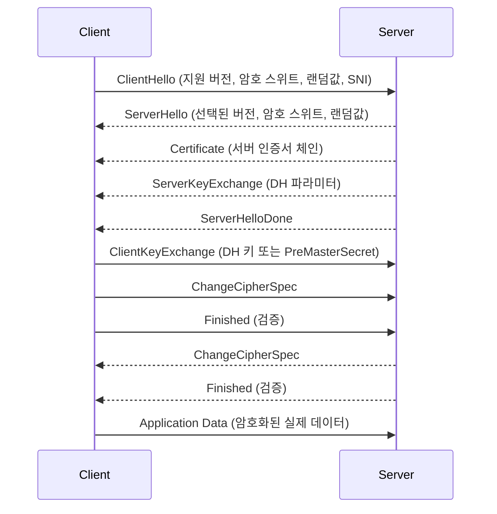
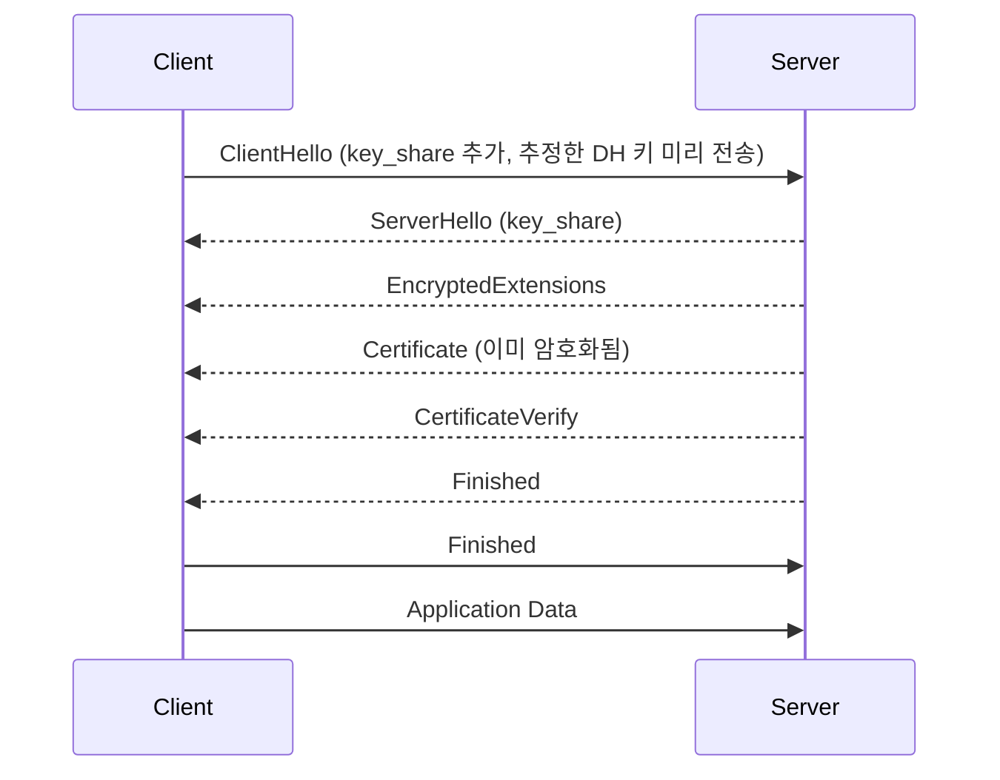

# TLS와 HTTPS - 핸드셰이크 원리와 인증서 운영 실무

처음 운영 환경에서 인증서 만료로 서비스가 죽었을 때, 새벽 3시에 깨서 부랴부랴 갱신했던 기억이 아직도 선명하다. 그날 이후 인증서는 "한 번 발급받으면 끝"이 아니라 운영의 한 축이라는 걸 배웠다. TLS는 단순히 "보안 통신"이라는 추상적인 개념이 아니라, 핸드셰이크가 어떤 RTT로 진행되는지, 인증서 체인이 어떻게 검증되는지, SNI와 ALPN이 어떤 역할을 하는지 알아야 제대로 트러블슈팅할 수 있다.

이 문서는 그동안 운영하면서 마주친 문제들 — TLS 1.2와 1.3의 핸드셰이크 차이로 지연이 달라지는 이유, 사설 CA로 발급한 인증서가 모바일 앱에서만 깨지던 사례, 0-RTT를 켰다가 멱등성 문제를 겪었던 일, ACME 자동 갱신이 갑자기 실패하던 원인들을 정리한 것이다.

## TLS의 본질

TLS(Transport Layer Security)는 TCP 위에서 동작하는 보안 계층이다. 이름에서 알 수 있듯 7계층 모델에서는 세션 계층 근처에 위치하는데, 실무 관점에서는 그냥 "TCP 연결을 맺은 다음에 그 위에서 한 번 더 협상하는 단계"로 이해하는 게 편하다. SSL은 TLS의 전신인데, SSL 3.0이 POODLE 취약점으로 무너진 뒤로 더 이상 쓰이지 않는다. 지금 "SSL 인증서"라고 부르는 것도 사실은 전부 TLS 인증서다. 용어만 관성적으로 남아있을 뿐이다.

TLS가 보장하는 것은 세 가지다.

- **기밀성(Confidentiality)**: 중간에서 패킷을 가로채도 내용을 볼 수 없다. 대칭키 암호화로 처리한다.
- **무결성(Integrity)**: 패킷이 중간에 변조되지 않았음을 보장한다. MAC 또는 AEAD로 검증한다.
- **인증(Authentication)**: 통신 상대방이 자신이 주장하는 그 서버가 맞음을 인증서로 증명한다.

이 세 가지를 한꺼번에 처리하기 위해 핸드셰이크 단계에서 비대칭키 암호화로 키 교환을 하고, 이후 데이터 전송은 대칭키로 처리한다. 비대칭키는 느리지만 안전하게 키를 교환할 수 있고, 대칭키는 빠르다는 점을 둘 다 활용하는 구조다.

## TLS 1.2 핸드셰이크

TLS 1.2의 핸드셰이크는 2-RTT다. 즉 클라이언트가 서버에 데이터를 보내기까지 4번의 메시지 왕복이 필요하다.



여기서 RTT를 세어보면 ClientHello → ServerHelloDone이 1 RTT, ClientKeyExchange → Finished가 1 RTT다. 그래서 데이터를 보내기까지 2 RTT가 필요하다. TCP 3-way handshake 1 RTT까지 포함하면 총 3 RTT다. 한국에서 미국 서버에 접속할 때 RTT가 150ms라고 하면 첫 바이트가 도착하기까지 450ms가 걸린다.

TLS 1.2의 암호 스위트는 길고 복잡하다. 예를 들어 `TLS_ECDHE_RSA_WITH_AES_256_GCM_SHA384`라는 스위트는 키 교환은 ECDHE, 인증은 RSA, 대칭키는 AES-256-GCM, 해시는 SHA-384를 쓴다는 의미다. 이렇게 4가지 요소를 클라이언트와 서버가 각자 지원하는 것 중에서 골라야 했기 때문에 협상 과정이 복잡했다.

## TLS 1.3 핸드셰이크

TLS 1.3은 2018년에 RFC 8446으로 표준화됐다. 가장 큰 변화는 핸드셰이크가 1-RTT로 줄었다는 점이다.



핵심 아이디어는 클라이언트가 ClientHello를 보낼 때 자신의 DH 키 쌍 중 공개키(`key_share`)를 미리 같이 보낸다는 것이다. 서버는 그걸 받자마자 자신의 DH 키와 결합해서 대칭키를 도출할 수 있다. 그래서 ServerHello 이후로는 모든 메시지가 이미 암호화된 채로 전송된다. 인증서조차도 암호화돼서 가는데, 이게 의외로 큰 차이다. TLS 1.2에서는 인증서가 평문으로 노출됐기 때문에 누가 어떤 사이트에 접속하는지 어느 정도 추적이 가능했다.

암호 스위트도 단순해졌다. TLS 1.3은 5개의 스위트만 있다. AES-128-GCM, AES-256-GCM, ChaCha20-Poly1305, AES-128-CCM, AES-128-CCM-8. 인증과 키 교환은 별도 협상으로 분리됐다.

실무에서 TLS 1.3으로 올렸을 때 체감되는 차이가 가장 큰 건 모바일 환경이다. RTT가 100ms를 넘는 셀룰러 망에서 1-RTT가 줄어들면 첫 바이트 도착 시간(TTFB)이 눈에 띄게 빨라진다. 단, 클라이언트가 TLS 1.3을 지원해야 한다. iOS 12.2 이상, Android 10 이상, Chrome 70 이상부터 기본 지원된다.

## 인증서 체인 검증

서버 인증서 하나만 봐서는 신뢰할 수 없다. 인증서 체인을 따라 올라가서 루트 CA까지 도달해야 한다. 일반적인 체인은 이렇게 생겼다.

```
End-Entity Certificate (example.com)
    ↑ (intermediate가 서명)
Intermediate CA Certificate (Let's Encrypt R3)
    ↑ (root가 서명)
Root CA Certificate (ISRG Root X1)
```

서버는 End-Entity 인증서와 Intermediate 인증서까지 같이 보낸다. 클라이언트는 자신의 트러스트 스토어에 들어있는 Root CA 인증서로 Intermediate를 검증하고, 그 Intermediate로 End-Entity를 검증한다. 루트 CA 인증서를 서버가 보내지 않는 이유는 어차피 클라이언트가 가지고 있어야 하기 때문이다. 보내봤자 의미가 없다.

가장 흔한 실수가 Intermediate 인증서를 빠뜨리는 것이다. 데스크톱 브라우저는 AIA(Authority Information Access) 확장으로 Intermediate를 자동으로 다운로드 받기 때문에 잘 동작하는 것처럼 보이지만, 모바일 앱이나 일부 cURL 환경에서는 그게 안 돼서 핸드셰이크가 실패한다. 그래서 인증서 파일을 만들 때는 항상 풀체인(fullchain)을 사용해야 한다. Let's Encrypt가 발급하는 `fullchain.pem`이 그래서 그 이름이다.

검증 시 확인하는 항목들이 있다.

- 서명 유효성: 상위 CA의 공개키로 서명을 검증
- 유효 기간: notBefore와 notAfter 사이인지
- 폐기 여부: CRL 또는 OCSP로 확인
- 도메인 일치: SAN(Subject Alternative Name)에 접속한 도메인이 포함되는지
- 키 사용 용도: keyUsage와 extendedKeyUsage가 적절한지

CN(Common Name) 필드는 더 이상 도메인 검증에 쓰이지 않는다. 2017년부터 Chrome은 SAN만 본다. 인증서를 발급받을 때 SAN에 도메인을 명시적으로 넣어야 한다.

## SNI와 가상 호스팅

하나의 IP에 여러 도메인을 운영할 때 문제가 생긴다. TCP 연결을 맺은 시점에는 클라이언트가 어떤 도메인에 접속하려는지 서버가 알 수 없다. HTTP는 Host 헤더가 있어서 괜찮은데, TLS 핸드셰이크는 HTTP보다 먼저 일어난다. 그래서 서버가 어떤 인증서를 제시해야 할지 결정할 수가 없다.

SNI(Server Name Indication)는 이 문제를 해결한다. 클라이언트가 ClientHello에 자신이 접속하려는 호스트명을 같이 보낸다. 서버는 그걸 보고 적절한 인증서를 골라서 응답한다.

```
ClientHello {
  server_name: "api.example.com"
  ...
}
```

문제는 SNI가 평문이라는 점이다. 누가 어떤 도메인에 접속하는지 ISP나 중간자가 그대로 볼 수 있다. ESNI(Encrypted SNI), 그 후속인 ECH(Encrypted Client Hello)가 이 문제를 해결하려고 만들어졌지만 아직 보편화되지는 않았다. Cloudflare가 활발하게 밀고 있는 정도다.

운영 관점에서 SNI 관련해서 자주 겪는 문제는 두 가지다.

첫째, 오래된 클라이언트가 SNI를 보내지 않는 경우. Java 6, Windows XP의 IE 같은 환경이다. 이때 서버는 디폴트 인증서를 제시하는데, 만약 그 디폴트 인증서가 클라이언트가 원했던 도메인과 다르면 검증이 실패한다. nginx에서는 `ssl_reject_handshake on;`으로 SNI 없는 요청을 거부할 수 있다.

둘째, 와일드카드 인증서와 SAN 인증서의 차이. `*.example.com` 와일드카드는 `api.example.com`은 커버하지만 `v2.api.example.com`은 커버하지 않는다. 한 단계만 매칭된다. 이걸 모르고 와일드카드 발급받았다가 서브도메인 추가 시 다시 발급받아야 하는 경우가 흔하다.

## ALPN과 HTTP/2 협상

HTTPS가 TLS 위에서 HTTP를 돌리는 거라면, HTTP/2는 어떻게 협상할까. HTTP/1.1은 Upgrade 헤더로 업그레이드하지만, HTTP/2의 RFC 7540은 평문 HTTP 위에서 HTTP/2를 쓰지 말라고 못박았다(이론적으로 h2c는 가능하지만 실제로는 거의 안 쓴다). 그래서 TLS 핸드셰이크 단계에서 미리 협상해야 한다.

ALPN(Application-Layer Protocol Negotiation)이 그 역할을 한다. 클라이언트가 ClientHello에 자신이 지원하는 프로토콜 목록을 보낸다.

```
ClientHello {
  alpn: ["h2", "http/1.1"]
  ...
}
```

서버는 ServerHello에서 하나를 선택한다.

```
ServerHello {
  alpn: "h2"
}
```

이렇게 핸드셰이크가 끝나면 양쪽이 HTTP/2로 통신할 준비가 된 상태가 된다. 추가 RTT가 발생하지 않는다는 게 ALPN의 핵심이다. HTTP/3는 ALPN으로 `h3`를 협상하는 점은 같지만, 그 위에서 QUIC을 쓰기 때문에 TCP가 아닌 UDP 기반으로 동작한다.

운영 중에 HTTP/2가 꺼져있는 걸 발견하는 흔한 이유는 nginx에서 `listen 443 ssl;`만 쓰고 `http2`를 빼먹은 경우다. nginx 1.25 이전에는 `listen 443 ssl http2;`처럼 명시해야 했고, 1.25부터는 `http2 on;` 디렉티브로 분리됐다. ALB나 CloudFront는 기본적으로 HTTP/2가 켜져 있다.

## 세션 재개

핸드셰이크는 비싼 작업이다. 같은 클라이언트가 여러 번 접속할 때마다 매번 풀 핸드셰이크를 하면 비효율적이다. TLS는 두 가지 세션 재개 메커니즘을 제공한다.

**Session ID 방식**은 서버가 세션 정보를 자기 메모리에 저장하고 클라이언트에게 ID만 넘겨준다. 다음에 클라이언트가 그 ID를 제시하면 저장된 세션을 복원한다. 문제는 서버가 여러 대일 때 발생한다. A 서버에서 받은 ID로 B 서버에 접속하면 복원할 수 없다. Redis나 memcached로 세션 저장소를 공유하는 방법이 있지만 운영이 복잡하다.

**Session Ticket 방식**은 세션 정보를 암호화해서 클라이언트에게 통째로 넘긴다. 서버는 자기가 가진 키로 그 티켓을 복호화해서 세션을 복원한다. 모든 서버가 같은 티켓 키를 공유하면 어느 서버로 가도 재개가 된다. 운영이 단순해서 실무에서는 Session Ticket을 더 많이 쓴다. 단, 티켓 키가 유출되면 과거 트래픽이 다 복호화될 수 있어서 주기적으로 회전(rotation)해야 한다. nginx에서는 `ssl_session_ticket_key`로 키 파일을 지정한다.

TLS 1.3에서는 이 둘이 통합돼서 PSK(Pre-Shared Key) 기반의 세션 재개로 일원화됐다. NewSessionTicket 메시지로 티켓을 전달하고, 다음 핸드셰이크에서 PSK로 사용한다.

## 0-RTT의 양면성

TLS 1.3의 0-RTT(Early Data)는 RTT를 더 줄이는 기법이다. 한 번 세션을 맺었던 클라이언트가 다시 접속할 때, ClientHello에 실제 애플리케이션 데이터를 같이 끼워서 보낸다. 서버는 그 데이터를 받자마자 처리할 수 있다. 즉 0 RTT만에 데이터가 도달한다.

문제는 재전송 공격(replay attack)에 취약하다는 점이다. 공격자가 0-RTT 데이터를 캡처해서 그대로 다시 보내면 서버는 두 번 처리할 수 있다. GET 요청이라면 큰 문제가 없지만 POST나 결제 같은 요청이라면 치명적이다.

그래서 0-RTT를 쓸 때는 **멱등(idempotent)한 요청에만 허용**하는 게 원칙이다. nginx의 `ssl_early_data on;`을 켤 때는 application 레벨에서 0-RTT 요청을 식별하고 (예: `Early-Data: 1` 헤더 확인) 멱등하지 않은 핸들러에서는 거부해야 한다. CDN(Cloudflare 등)은 자체적으로 GET만 0-RTT를 허용하는 식으로 보호한다.

실무에서는 그냥 0-RTT를 끄는 경우가 많다. 위험 대비 이득이 크지 않다고 판단하는 거다. 모바일 앱처럼 첫 요청 지연이 극도로 중요한 환경이 아니라면 굳이 켤 이유가 없다.

## HTTPS - HTTP를 TLS로 감싸기

HTTPS는 새로운 프로토콜이 아니다. HTTP를 TLS 위에서 돌리는 것뿐이다. 포트 443이 디폴트인 점, URL이 `https://`로 시작하는 점이 다르다. 핸드셰이크가 끝난 뒤에는 일반 HTTP와 똑같다.

브라우저가 `https://example.com`을 받으면 흐름은 이렇다.

1. DNS로 example.com의 IP 조회
2. 그 IP의 443 포트에 TCP 연결
3. TLS 핸드셰이크 (이때 SNI로 example.com 전달, ALPN으로 h2 협상)
4. 핸드셰이크 완료 후 암호화된 채널 위에서 HTTP/2 요청 전송
5. 응답 수신 후 렌더링

여기까지는 단순한데, 실무에서는 이 사이에 CDN, 로드밸런서, 리버스 프록시가 끼어든다. 각 구간마다 TLS가 다시 종료되고 다시 맺어질 수 있다. 가장 흔한 패턴은 "외부 클라이언트 → CDN까지 TLS, CDN → 오리진까지 다시 TLS, 오리진 내부에서는 평문"이다. 이때 인증서는 CDN에 설치되고, 오리진은 자체 인증서(보통 사설 CA로 발급)나 CDN이 발급한 오리진 인증서를 쓴다.

## Mixed Content

HTTPS 페이지 안에서 HTTP 리소스(이미지, 스크립트, CSS)를 로드하려고 하면 브라우저가 막거나 경고한다. 이걸 Mixed Content라고 부른다.

- **Active Mixed Content**: 스크립트, iframe, CSS, XHR 등 페이지 동작에 영향을 주는 리소스. 브라우저가 무조건 차단한다.
- **Passive Mixed Content**: 이미지, 비디오, 오디오. 옛날에는 경고만 했지만 최신 브라우저는 자동으로 HTTPS로 업그레이드 시도한다.

레거시 사이트를 HTTPS로 마이그레이션할 때 이게 골치다. CSS에서 `background: url('http://...')`처럼 박혀있는 경우, JS에서 `http://` URL을 하드코딩한 경우, 외부 임베드(YouTube, 광고 스크립트)가 HTTP인 경우 등이 다 걸린다. 한 번에 다 잡으려면 `Content-Security-Policy: upgrade-insecure-requests` 헤더로 모든 HTTP 요청을 HTTPS로 자동 업그레이드시킬 수 있다. 단, 업그레이드된 URL에 실제로 HTTPS가 서비스되지 않으면 깨진다.

## HSTS

HSTS(HTTP Strict Transport Security)는 "이 사이트는 앞으로 HTTPS로만 접속해라"고 브라우저에 알려주는 헤더다.

```
Strict-Transport-Security: max-age=31536000; includeSubDomains; preload
```

`max-age` 동안 브라우저는 해당 도메인을 무조건 HTTPS로만 접속한다. 사용자가 주소창에 `http://`를 쳐도 자동으로 `https://`로 보낸다. 첫 접속에서는 HSTS 헤더를 받아야만 적용되기 때문에 첫 접속에서 SSL Strip 공격을 당할 수 있다는 한계가 있다.

이걸 보완하는 게 HSTS Preload다. https://hstspreload.org/ 에 도메인을 등록하면 브라우저 소스코드에 박힌 HSTS 목록에 들어간다. 첫 접속부터 HTTPS가 강제된다. 단, preload는 사실상 영구적이다. 한 번 등록하면 빼는 게 매우 어렵다. 모바일 앱이나 서브도메인 중에 HTTPS가 안 되는 게 있으면 preload 등록 전에 점검해야 한다.

`includeSubDomains`도 신중하게 써야 한다. `*.example.com`의 모든 서브도메인이 HTTPS를 지원해야 한다. 사내 도구나 레거시 서브도메인이 HTTP만 지원하는 상태에서 켜면 그게 다 깨진다.

## 인증서 갱신 자동화 - ACME와 Let's Encrypt

Let's Encrypt가 등장하기 전에는 인증서를 1년에 한 번씩 수동으로 갱신했다. CSR 만들고, CA에 보내고, 발급받고, 서버에 설치하고, nginx 리로드하고. 까먹으면 만료. 사람이 죽어났다.

ACME(Automatic Certificate Management Environment, RFC 8555)는 이 과정을 자동화한 프로토콜이다. Let's Encrypt가 처음 도입했고, 이제는 ZeroSSL, Buypass, Google Trust Services 등 여러 CA가 지원한다.

발급 과정은 이렇다.

1. ACME 클라이언트(certbot, acme.sh, lego 등)가 CA에 계정 생성
2. 도메인 소유 증명을 위한 챌린지 요청
3. 챌린지 응답 (HTTP-01, DNS-01, TLS-ALPN-01 중 선택)
4. CA가 챌린지 검증 후 인증서 발급
5. 클라이언트가 인증서를 받아 서버에 설치

챌린지 종류별로 특성이 다르다.

- **HTTP-01**: 서버의 `/.well-known/acme-challenge/<token>` 경로에 토큰 파일을 두고 CA가 HTTP로 가져가는 방식. 80 포트가 열려있어야 하고, 와일드카드 인증서는 발급할 수 없다.
- **DNS-01**: DNS TXT 레코드로 검증. 와일드카드 발급 가능. DNS 제공자 API가 있어야 자동화가 된다.
- **TLS-ALPN-01**: 443 포트의 TLS 핸드셰이크 안에서 검증. 80 포트를 열기 어려운 환경에서 사용.

Let's Encrypt 인증서는 90일짜리다. 30일 정도 남았을 때 갱신하는 게 일반적이다. cron이나 systemd timer로 `certbot renew`를 매일 돌리면, 만료가 가까운 인증서만 자동으로 갱신한다. K8s 환경에서는 cert-manager가 같은 일을 한다. CRD(Certificate, Issuer)로 선언하면 알아서 발급, 갱신, 시크릿 마운트까지 해준다.

자동화가 멈추는 흔한 원인들이 있다.

- DNS-01 챌린지에서 DNS 제공자 API 키가 만료된 경우
- HTTP-01 챌린지에서 80 포트가 방화벽에 막힌 경우 (CDN 뒤에 있다면 CDN까지의 80 포트가 열려있어야 한다)
- Rate limit에 걸린 경우 (Let's Encrypt는 도메인당 주당 50개 발급 제한이 있다)
- ACME 클라이언트 버전 업그레이드 후 호환성 문제

만료 모니터링은 자동화에 의존하더라도 별도로 해야 한다. 자동화가 조용히 실패할 수 있기 때문이다. Prometheus blackbox exporter의 `probe_ssl_earliest_cert_expiry` 메트릭으로 만료까지 남은 시간을 계속 측정하고, 14일 이내면 알람을 보내는 식으로 구성한다.

## 트러블슈팅 도구

### openssl s_client

가장 기본이 되는 도구다. 인증서를 까보거나 핸드셰이크 과정을 디버깅할 때 쓴다.

```bash
# 서버 인증서 체인 확인
openssl s_client -connect example.com:443 -servername example.com -showcerts

# TLS 1.3 강제
openssl s_client -connect example.com:443 -tls1_3

# 특정 암호 스위트 테스트
openssl s_client -connect example.com:443 -cipher 'ECDHE-RSA-AES256-GCM-SHA384'

# ALPN 협상 확인
openssl s_client -connect example.com:443 -alpn 'h2,http/1.1'
```

`-servername`을 빼면 SNI 없이 접속한다. 이게 의외로 중요한데, SNI 없는 디폴트 인증서를 확인할 때 쓴다.

### curl -v

HTTP 레벨까지 한 번에 보고 싶을 때 쓴다.

```bash
curl -v https://example.com
```

출력에서 `*` 줄이 TLS 관련 정보다. 어떤 버전이 협상됐는지, 어떤 스위트가 선택됐는지, 인증서 검증이 어떻게 됐는지 다 보인다. `--resolve example.com:443:1.2.3.4`로 DNS를 우회해서 특정 IP로 강제할 수 있어서 CDN 트러블슈팅에 유용하다.

`--cacert`로 사설 CA를 지정할 수 있고, `-k`로 검증을 무시할 수 있다. `-k`는 디버깅용이지 운영에서 쓰면 안 된다.

### SSL Labs

https://www.ssllabs.com/ssltest/ 의 SSL Server Test는 외부에 공개된 서버의 TLS 설정을 종합 평가해준다. A부터 F까지 등급이 매겨진다. 운영 서비스를 처음 띄우거나 큰 변경이 있을 때 한 번씩 돌려보면 좋다.

A+를 받으려면 HSTS preload, CAA 레코드, OCSP stapling, TLS 1.3 지원이 다 있어야 한다. A 정도면 일반적으로 충분하다. F가 나오는 경우는 보통 SSLv3, TLS 1.0이 켜져 있거나, 약한 암호 스위트가 활성화돼 있는 경우다.

내부 서버는 SSL Labs로 검사가 안 되니까 testssl.sh 같은 로컬 도구를 쓴다. 같은 검사를 로컬에서 할 수 있다.

### nmap

서버가 지원하는 프로토콜과 스위트를 빠르게 보고 싶을 때 쓴다.

```bash
nmap --script ssl-enum-ciphers -p 443 example.com
```

지원하는 모든 TLS 버전과 각 버전별 스위트 목록을 출력한다.

## 사설 CA 운영

사내 서비스 간 통신에서는 공인 CA 인증서가 부담스러운 경우가 있다. 인증서 비용도 있고, 사내 도메인을 외부 CA에 노출하기도 그렇고. 그래서 사내 사설 CA를 운영하는 곳이 많다. HashiCorp Vault의 PKI 엔진, AWS Private CA, step-ca 같은 게 흔히 쓰는 도구다.

운영 시 주의사항이 있다.

**루트 CA 키 보호**: 사설 CA의 루트 키가 유출되면 그 CA로 발급된 모든 인증서가 신뢰할 수 없게 된다. HSM이나 최소한 오프라인 보관이 권장된다. 일상적인 발급은 Intermediate CA로 처리하고, 루트 CA는 Intermediate를 서명할 때만 잠시 사용한다.

**유효 기간 관리**: 사설 CA 인증서는 보통 10~20년짜리로 발급한다. 너무 길면 알고리즘 마이그레이션이 어렵고, 너무 짧으면 운영 부담이 크다. End-Entity 인증서는 짧게(30일~1년), Intermediate는 중간(5~10년), Root는 길게(20년) 가져가는 식이다.

**클라이언트 트러스트 스토어 배포**: 사설 CA로 발급한 인증서를 검증하려면 클라이언트가 그 CA의 루트 인증서를 트러스트 스토어에 넣어야 한다. Linux 서버는 `/etc/ssl/certs/` 또는 `/etc/pki/ca-trust/source/anchors/`에 넣고 `update-ca-certificates` 또는 `update-ca-trust`를 실행한다. macOS는 키체인, Windows는 인증서 관리자, Java는 cacerts에 keytool로 넣는다. 각 플랫폼별로 다 따로 관리해야 해서 의외로 손이 많이 간다.

**모바일 앱이 거부하는 경우**: iOS와 Android는 시스템 트러스트 스토어와 별도로 앱 레벨에서 사설 CA를 거부할 수 있다. iOS 14 이상에서는 사용자가 수동으로 설치한 CA를 앱이 신뢰하려면 Info.plist의 `NSAppTransportSecurity` 설정이 필요하다. Android 7 이상은 앱의 `network_security_config.xml`에서 명시해야 한다. 사내 모바일 앱이 사내 API를 못 부르는 경우의 흔한 원인이다.

**갱신 자동화**: 공인 CA만큼 ACME가 보편화되지 않았다. step-ca나 Vault는 ACME를 지원하지만, 자체 PKI는 자동화 도구를 직접 만들어야 하는 경우가 많다. 갱신 누락이 자주 일어나는 영역이다.

**키 알고리즘 선택**: 새로 만든다면 ECDSA P-256 또는 EdDSA(Ed25519)를 쓰는 걸 추천한다. RSA보다 핸드셰이크가 빠르고 키 크기가 작다. 단, 옛날 클라이언트와의 호환성이 필요하면 RSA 2048 이상이 안전하다. 운영 환경에서 호환성 문제가 발생할 여지가 있다면 RSA로 가는 게 보수적인 선택이다.

## 마무리

TLS는 한 번 제대로 설정하면 한참 신경 쓸 일이 없는 영역이지만, 무너지면 서비스 전체가 멈춘다. 인증서 만료로 새벽에 깨는 일이 한 번은 누구에게나 일어난다. 자동화는 필수이고, 자동화 위의 모니터링도 필수다.

핸드셰이크 원리를 이해하고 있어야 트러블슈팅이 가능하다. 평소엔 추상화 뒤에 숨어있다가, 문제가 터지면 그제서야 RTT 계산을 하고 패킷 캡처를 뜨고 인증서 체인을 까보게 된다. 그때 가서 공부하면 늦다.
