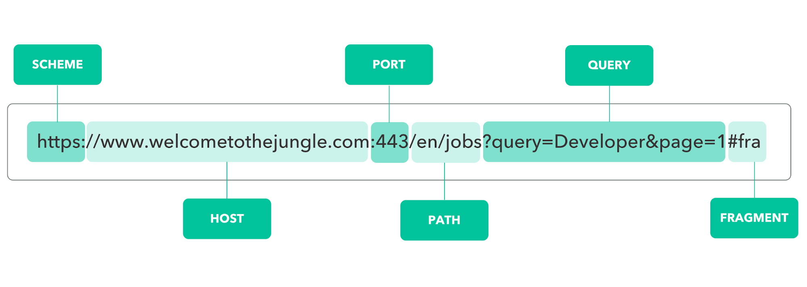

# URL과 URI 

    

## URL(UNiform Resource Locator)
- 브라우저의 주소창에 입력한 URL은 서버가 제공되는 환경에 존재하는 파일의 위치를 나타낸다.
- CLI 환경에서 폴더와 파일의 위치를 찾아 이동하듯이, 슬래시(/)를 이용해 서버의 폴더에 진입하거나 파일을 요청할 수 있다.

## URL 구성요소 
- **scheme** : 통신 방식(프로토콜)을 결정한다. ex) 웹 브라우저 : http(s)
  - **hosts** : 웹 서버의 이름이나 도메인, IP를 사용하며 주소를 나타낸다.
  - **url-path** : 웹 서버에서 지정한 루트 디렉토리부터 시작하여 웹 페이지, 이미지, 동영상 등이 위치한 경로와 파일명을 나타낸다. 

---

## URI(Uniform Resource Identifier) 
- URI는 URL을 포함하는 상위개념으로, 일반적으로 URL의 기본 요소인 scheme, hosts, url-path에 더해 query, fragment를 포함한다.
  - **query** : 웹 서버에 보내는 추가적인 질문
  - **fragment** : 일종의 북마크 기능을 수행하며 URL에 fragment(#)와 특정 HTML 요소의 id를 전달하면 해당 요소가 있는 곳으로 스크롤을 이동할 수 있다. 
