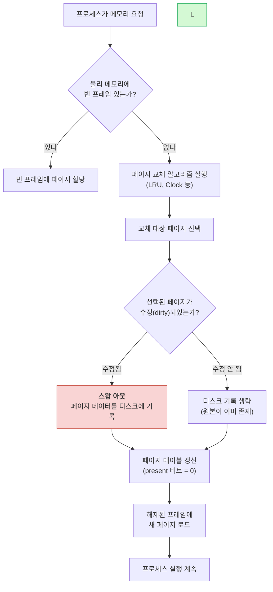
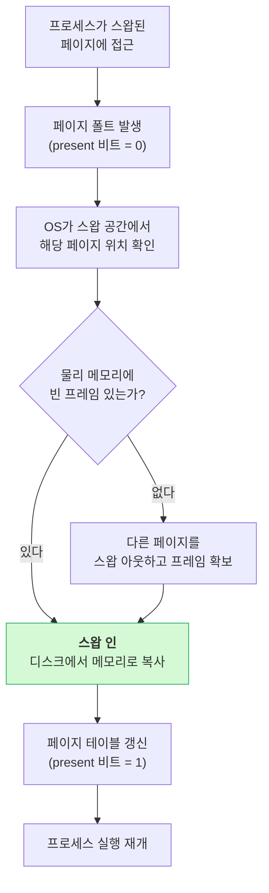
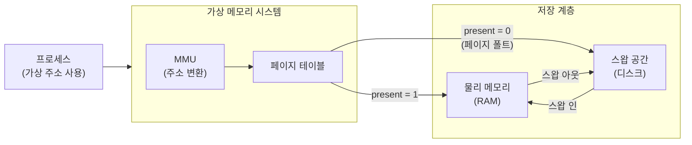

# 스왑 메모리 (Swap Memory)

## 개요

### 스왑 메모리란 무엇인가?

스왑 메모리는 RAM이 부족할 때 디스크 공간을 임시 메모리로 사용하는 기술이다. 하드디스크나 SSD의 일부 공간을 할당해서 RAM처럼 쓴다.

운영체제가 메모리 부족을 감지하면, 현재 사용하지 않는 데이터를 디스크로 옮긴다. 나중에 그 데이터가 필요해지면 다시 메모리로 불러온다. 메모리 부족으로 인한 시스템 크래시를 막아주지만, 디스크 I/O가 발생하므로 성능은 떨어진다.

### 왜 스왑 메모리가 필요한가?

**메모리 부족 상황 대응**

- 물리적 메모리는 비싸고 용량에 한계가 있다
- 애플리케이션의 메모리 요구량은 예측하기 어렵다
- 갑자기 메모리가 필요해질 때 크래시를 방지한다

**프로세스 간 메모리 관리**

- 중요한 프로세스가 메모리를 더 필요로 할 때, 덜 중요한 프로세스의 메모리를 디스크로 옮겨 공간을 확보한다
- 시스템 관리자가 프로세스 우선순위를 조절할 여지를 준다

**시스템 안정성**

- 메모리 부족으로 인한 시스템 다운을 방지한다
- 서버 환경에서는 서비스 중단을 최소화하는 데 중요하다

### 주요 개념

**스왑 인(Swap In)**
디스크에 저장된 데이터를 다시 메모리로 가져오는 과정이다. 해당 데이터가 다시 필요해졌을 때 발생하며, 운영체제가 자동으로 처리한다.

**스왑 아웃(Swap Out)**
메모리에서 사용하지 않는 데이터를 디스크로 옮기는 과정이다. 메모리 부족 상황에서 운영체제가 자동으로 수행하며, 어떤 데이터를 옮길지는 페이지 교체 알고리즘이 결정한다.

**스왑 공간(Swap Space)**
디스크에서 스왑 메모리로 사용되는 영역이다. 전용 파티션이나 파일 형태로 존재하며, 운영체제가 관리한다.

**스왑 파일(Swap File)**
스왑 공간을 파일 형태로 구현한 것이다. 파티션 방식보다 크기 조절이 쉬워서 현대 시스템에서 많이 쓴다.

**스왑 파티션(Swap Partition)**
디스크의 전용 파티션으로 할당된 스왑 공간이다. 전통적인 방식이지만 크기 조절이 어려워서 요즘은 잘 안 쓴다.

## 동작 원리

### 스왑 인/아웃 흐름

프로세스가 메모리를 요청했을 때 물리 메모리가 부족하면 스왑 아웃이 발생하고, 스왑 아웃된 페이지가 다시 필요해지면 스왑 인이 발생한다. 전체 흐름은 다음과 같다.



스왑 아웃된 페이지에 다시 접근하면 **페이지 폴트(Page Fault)**가 발생하고, 스왑 인이 진행된다.



dirty 페이지 여부가 중요하다. 읽기만 한 페이지는 디스크에 원본이 남아있으므로 스왑 아웃 시 기록을 생략할 수 있다. 쓰기가 발생한 dirty 페이지만 실제로 디스크에 써야 하므로, dirty 비트 관리가 스왑 성능에 직접 영향을 준다.

### 메모리-디스크 데이터 이동 구조

물리 메모리와 스왑 공간 사이에서 페이지가 어떤 구조로 이동하는지 나타낸 그림이다.

```
block-beta
    columns 3

    block:VIRTUAL["가상 주소 공간 (프로세스)"]
        columns 1
        VP0["페이지 0 (코드)"]
        VP1["페이지 1 (데이터)"]
        VP2["페이지 2 (힙)"]
        VP3["페이지 3 (스택)"]
    end

    block:PT["페이지 테이블"]
        columns 1
        E0["0 → 프레임2 ✓"]
        E1["1 → 스왑#5 ✗"]
        E2["2 → 프레임0 ✓"]
        E3["3 → 스왑#12 ✗"]
    end

    block:PHYS["물리 메모리 + 스왑"]
        columns 1
        F0["프레임 0: 페이지2 데이터"]
        F1["프레임 1: (다른 프로세스)"]
        F2["프레임 2: 페이지0 데이터"]
        SW["스왑 영역: #5=페이지1, #12=페이지3"]
    end

    VP0 --> E0
    VP1 --> E1
    VP2 --> E2
    VP3 --> E3
    E0 --> F2
    E1 --> SW
    E2 --> F0
    E3 --> SW
```

페이지 테이블의 present 비트(위 그림에서 ✓/✗)가 해당 페이지가 물리 메모리에 있는지, 스왑 공간에 있는지를 구분한다. 프로세스가 ✗ 표시된 페이지에 접근하면 페이지 폴트가 발생하고 스왑 인이 시작된다.

### 스왑 메모리가 작동하는 방식

운영체제는 메모리 사용량을 지속적으로 모니터링하고, 필요에 따라 데이터를 메모리와 디스크 사이에서 이동시킨다.

**1단계: 메모리 부족 상황 감지**
운영체제가 사용 가능한 메모리가 특정 임계값 이하로 떨어지면, 스왑 아웃 과정을 시작한다. 이 임계값은 시스템 설정에서 조절할 수 있다.

**2단계: 스왑 대상 페이지 선택**
어떤 페이지를 디스크로 옮길지 결정한다. 잘못된 선택은 성능에 큰 영향을 미치므로 페이지 교체 알고리즘이 이 판단을 담당한다.

**3단계: 스왑 아웃 실행**
선택된 페이지의 데이터를 디스크의 스왑 공간에 저장한다. 페이지 테이블도 업데이트하여 해당 페이지가 디스크에 있다는 것을 기록한다.

**4단계: 메모리 공간 해제**
스왑 아웃된 페이지의 메모리 공간을 해제하여 새로운 데이터를 위한 공간을 확보한다.

**5단계: 스왑 인 (필요시)**
스왑 아웃된 데이터가 다시 필요해지면, 디스크에서 메모리로 데이터를 복원한다.

### 페이지 교체 알고리즘

**LRU (Least Recently Used)**
가장 오랫동안 사용되지 않은 페이지를 스왑 아웃 대상으로 선택한다. 이론적으로는 가장 좋은 결과를 내지만, 모든 페이지의 접근 시간을 추적해야 해서 오버헤드가 크다.

**FIFO (First In First Out)**
가장 먼저 메모리에 로드된 페이지를 스왑 아웃한다. 구현이 간단하지만, 자주 사용되는 페이지도 오래되었다는 이유만으로 스왑 아웃될 수 있다.

**Clock Algorithm (Second Chance Algorithm)**
LRU의 근사 알고리즘이다. 참조 비트를 이용해 페이지의 사용 여부를 판단한다. 시계 바늘처럼 순환하면서 참조되지 않은 페이지를 찾아 스왑 아웃한다. LRU보다 구현 비용이 낮으면서 성능은 비슷하다. Linux가 이 방식을 사용한다.

## 장단점

### 장점

**물리적 메모리 한계 극복**
8GB RAM 시스템에서 12GB가 필요한 작업을 수행할 수 있다. 대용량 데이터 처리나 여러 애플리케이션을 동시에 실행해야 하는 환경에서 유용하다.

**시스템 안정성**
메모리 부족으로 시스템이 갑자기 종료되거나 애플리케이션이 강제 종료되는 상황을 막는다. 스왑 메모리가 없으면 OOM(Out of Memory) 상황에서 커널이 프로세스를 직접 죽인다.

**비용 절감**
RAM은 비싸다. 스왑 메모리로 디스크 공간을 활용하면, 물리 메모리를 추가하지 않고도 메모리 부족 상황에 대응할 수 있다. 다만 성능은 RAM보다 훨씬 떨어진다.

### 단점

**성능 저하**
가장 큰 문제다. 디스크 접근 속도는 메모리보다 수백~수천 배 느리다. 스왑 인/아웃이 빈번하게 발생하면 시스템 전체가 느려진다. HDD를 사용하는 경우 더 심각하다.

**디스크 공간 소모**
스왑 메모리를 위해 디스크 공간을 별도로 할당해야 한다. 대용량 스왑 설정 시 상당한 디스크 공간이 묶인다.

**I/O 부하 증가**
스왑 사용 시 디스크 I/O가 늘어난다. 다른 애플리케이션의 디스크 접근 성능에도 영향을 줄 수 있다.

**관리 부담**
적절한 스왑 크기 설정, 사용률 모니터링 등 추가 관리 작업이 필요하다. 잘못된 설정은 오히려 성능을 떨어뜨린다.

## 가상 메모리와의 관계

### 가상 메모리 시스템

가상 메모리는 운영체제가 제공하는 메모리 추상화 기술이다. 각 프로세스는 자신만의 큰 메모리 공간을 가진 것처럼 보이지만, 실제로는 물리 메모리와 디스크 공간이 조합되어 있다. 프로세스 간 메모리 격리를 제공하고, 각 프로세스가 독립적인 주소 공간을 가지도록 한다.

가상 메모리 시스템에서는 페이지 단위로 메모리를 관리한다. 각 페이지는 필요에 따라 물리 메모리나 디스크에 저장된다.

### 스왑 메모리의 위치

스왑 메모리는 가상 메모리 시스템의 구성 요소다. 가상 메모리가 추상화된 메모리 공간을 제공한다면, 스왑 메모리는 그 추상화를 실현하는 구체적인 기술이다.



- 가상 메모리: 전체적인 메모리 관리 시스템 (RAM + 디스크 조합)
- 스왑 메모리: 가상 메모리 시스템에서 디스크를 메모리로 활용하는 부분

프로세스는 가상 주소만 사용하기 때문에 데이터가 RAM에 있든 스왑에 있든 구분하지 못한다. MMU가 주소를 변환하다 present 비트가 0인 페이지를 만나면 페이지 폴트를 발생시키고, OS가 스왑 인을 수행한다. 이 과정이 프로세스에 투명하게 처리되는 것이 가상 메모리 시스템의 핵심이다.

## OS별 스왑 메모리 관리

### Linux

**상태 확인**

```bash
# 메모리와 스왑 사용량 확인
free -h

# 활성화된 스왑 공간 상세 정보
cat /proc/swaps

# 스왑 인/아웃 통계
vmstat 1
```

**스왑 파일 생성**

```bash
# 2GB 스왑 파일 생성
sudo fallocate -l 2G /swapfile
sudo chmod 600 /swapfile
sudo mkswap /swapfile
sudo swapon /swapfile

# 재부팅 후에도 유지하려면 /etc/fstab에 추가
echo '/swapfile none swap sw 0 0' | sudo tee -a /etc/fstab
```

**swappiness 값 조정**

swappiness는 커널이 스왑을 얼마나 적극적으로 사용할지 결정하는 값이다. 0~100 범위이며, 값이 낮을수록 스왑 사용을 최소화한다.

```bash
# 현재 값 확인
cat /proc/sys/vm/swappiness

# 임시 변경 (재부팅 시 초기화)
sudo sysctl vm.swappiness=10

# 영구 변경
echo 'vm.swappiness=10' | sudo tee -a /etc/sysctl.conf
```

서버 환경에서는 10~30 정도가 적당하다. 데이터베이스 서버는 낮게 잡는 편이 좋다.

**스왑 사용률이 계속 높다면**

스왑 사용률이 지속적으로 높은 건 메모리가 부족하다는 뜻이다. 메모리 누수가 있는지, 특정 프로세스가 메모리를 과도하게 쓰는지 확인한다. 근본적으로는 물리 메모리를 늘려야 한다.

```bash
# 프로세스별 스왑 사용량 확인
for file in /proc/*/status; do
  awk '/VmSwap|Name/{printf $2 " " $3}END{print ""}' $file
done | sort -k 2 -n -r | head -10
```

### Windows

Windows에서는 스왑 메모리를 페이지 파일(Page File)이라고 부른다. 기본적으로 시스템이 자동 관리하지만, 수동으로 크기를 지정할 수도 있다.

- 자동 관리: 대부분의 경우 문제없이 동작한다
- 수동 설정: 특정 워크로드에서 페이지 파일 크기가 부족하거나 과도할 때 조절한다
- 작업 관리자나 성능 모니터(Performance Monitor)로 사용량을 확인한다

### macOS

macOS는 스왑 파일을 동적으로 생성하고 삭제한다. 메모리 압박이 생기면 자동으로 스왑 파일을 만들고, 여유가 생기면 정리한다.

```bash
# 메모리 상태 확인
vm_stat

# 스왑 파일 확인
ls -lh /private/var/vm/swapfile*
```

## 압축 스왑 (zRAM, zswap)

디스크 대신 RAM 안에서 페이지를 압축해 보관하는 방식이다. 디스크 I/O 없이 메모리를 더 쓰는 효과를 낸다. 구현은 zRAM과 zswap 두 가지가 있고 동작 방식이 다르다.

### zRAM

RAM의 일부를 블록 디바이스처럼 만들고 그 위에 스왑을 올린다. 페이지를 LZ4나 zstd로 압축해서 저장하며 보통 2~3배 압축률이 나온다. 디스크는 전혀 안 쓴다.

Ubuntu 21.04부터 `zram-config` 패키지가 기본 설치되고, Fedora 33부터는 `zram-generator`가 systemd 서비스로 기본 활성화되어 있다. 데스크톱에서는 신경 안 써도 깔리는 경우가 많아서 `zramctl` 한 번 쳐보면 이미 동작 중인 걸 발견하기도 한다.

```bash
# 활성화된 zram 디바이스 확인
zramctl
# NAME       ALGORITHM DISKSIZE  DATA  COMPR  TOTAL STREAMS MOUNTPOINT
# /dev/zram0 lzo-rle       3.8G    4K    72B     4K       4 [SWAP]

# Fedora 계열 설정 파일
cat /etc/systemd/zram-generator.conf
# [zram0]
# zram-size = ram / 2
# compression-algorithm = zstd
```

알고리즘 선택은 트레이드오프가 있다. `lzo-rle`은 빠르지만 압축률이 낮고, `zstd`는 압축률이 좋지만 CPU를 더 쓴다. 메모리가 빡빡하고 CPU에 여유가 있는 머신은 zstd가 유리하다.

### zswap

zswap은 zRAM과 다르게 디스크 스왑의 캐시 역할을 한다. 디스크 스왑이 별도로 있어야 하고 그 앞단에 압축 캐시가 붙는 구조다. 압축된 채로 zswap 풀에 들어가다가 풀이 가득 차면 압축을 풀어 디스크로 내려보낸다.

```bash
# zswap 활성화 여부와 통계 확인
cat /sys/module/zswap/parameters/enabled
cat /sys/kernel/debug/zswap/stored_pages
cat /sys/kernel/debug/zswap/pool_total_size

# GRUB 부팅 옵션으로 활성화
# zswap.enabled=1 zswap.compressor=zstd zswap.max_pool_percent=20
```

zswap은 디스크 스왑이 필요한 서버에서 디스크 I/O를 줄이는 용도로 쓴다. zRAM은 디스크가 없거나 SSD 수명을 아끼고 싶은 환경에 맞는다. 둘을 동시에 쓸 수도 있지만 보통은 한쪽만 선택한다.

## 스왑 스래싱(Thrashing) 진단

스래싱은 스왑 인/아웃이 끊임없이 반복되어 CPU가 페이지 교체에만 시간을 쏟는 상황이다. 사용자 입장에서는 CPU 사용률은 낮은데 시스템이 멈춘 것처럼 느려진다. 응답 시간이 평소보다 수십 배 늘어나면 스래싱을 의심한다.

### vmstat의 si/so 컬럼 해석

```bash
vmstat 1
# procs -----------memory---------- ---swap-- -----io---- -system-- ------cpu-----
#  r  b   swpd   free   buff  cache   si   so    bi    bo   in   cs us sy id wa st
#  2  3 524288   8192  12288  65536  102  340  4500   600 1500 2800 10 25 30 35  0
```

- `si`: 초당 스왑 인 페이지 수 (디스크 → 메모리)
- `so`: 초당 스왑 아웃 페이지 수 (메모리 → 디스크)
- `wa`: I/O 대기 시간 비율
- `b`: I/O 대기 중인 프로세스 수

si와 so가 동시에 100~수천 단위로 지속해서 찍히고 wa가 30%를 넘으면 스래싱이다. 한 번씩 튀는 건 정상 운영 중에도 발생하지만, 분 단위로 계속되면 메모리가 모자라다는 뜻이다.

### sar로 장기 추적

`vmstat`은 실시간 관찰용이고, 장애가 지나간 뒤 거슬러 올라가서 분석할 때는 `sar`을 쓴다. `/var/log/sa/` 아래에 sysstat이 자동으로 쌓아둔다.

```bash
# 페이지 폴트 통계 (현재 시점)
sar -B 1 5
#               pgpgin/s pgpgout/s   fault/s  majflt/s  pgfree/s pgscank/s pgscand/s pgsteal/s    %vmeff

# 스왑 인/아웃 통계
sar -W 1 5
#               pswpin/s pswpout/s
# 14:32:01           0.00      0.00
# 14:32:02         120.00    340.00

# 어제 데이터 보기
sar -W -f /var/log/sa/sa$(date -d yesterday +%d)
```

`majflt/s`(major fault)는 디스크에서 페이지를 읽어와야 하는 페이지 폴트다. minor fault는 메모리 안에서 해결되어 빠르지만, major fault가 분당 수천 건씩 찍히면 응답 시간이 망가진다. 평소 0~수 건이던 게 수백 건으로 튄 시점이 있으면 그 무렵이 스래싱 시작 지점이다.

`pgscan*` 값이 치솟으면 kswapd가 회수할 페이지를 찾느라 LRU 리스트를 미친 듯이 훑고 있다는 뜻이다. 이때 `%vmeff`(회수 효율)가 30% 아래로 떨어지면 회수해도 금방 다시 필요해지는 페이지가 많다는 신호고, 사실상 더 이상 회수할 게 없는 상태에 가깝다.

## 프로세스별 스왑 추적: /proc/<pid>/status

스왑이 많이 쓰이는데 어느 프로세스가 원인인지 모를 때 `/proc/<pid>/status`의 `VmSwap` 필드를 본다. `top`이나 `ps`에는 직접 안 나오는 정보다.

```bash
# 단일 프로세스
grep VmSwap /proc/12345/status
# VmSwap:    245680 kB

# 스왑 사용량 상위 10개 프로세스
for pid in $(ls /proc | grep -E '^[0-9]+$'); do
  swap=$(awk '/VmSwap/ {print $2}' /proc/$pid/status 2>/dev/null)
  name=$(awk '/^Name/ {print $2}' /proc/$pid/status 2>/dev/null)
  if [ -n "$swap" ] && [ "$swap" -gt 0 ]; then
    echo "$swap KB - $name (PID $pid)"
  fi
done | sort -n -r | head -10
```

실제 운영에서 겪은 사례. 모니터링에서 스왑 사용량이 4GB 넘게 찍혔는데 `top`으로 봐도 RAM은 여유가 있고 si/so는 0이었다. `/proc/*/status`를 훑어보니 새벽 배치 자바 프로세스 두 개가 각각 1.5GB씩 스왑에 박혀 있었다. 일주일 전 메모리 스파이크 때 스왑된 페이지를 그 후로 다시 안 써서 그대로 남아 있던 거였다.

이런 페이지는 다시 안 쓰니 si/so에도 안 잡히고, 메모리 압박이 다시 발생하지 않는 한 영원히 안 돌아온다. RAM은 여유 있어 보여도 스왑 공간만 차곡차곡 차오른다. 모니터링 알람을 RSS만 보지 말고 VmSwap도 같이 추적하도록 바꿨다. 일정 임계 이상이면 프로세스 재시작 알람을 띄우는 식이다.

## swapoff -a 실행 시 RSS 폭증 주의

스왑을 끄거나 다른 디바이스로 옮길 때 `swapoff`를 실행하면 스왑에 있던 모든 페이지가 RAM으로 돌아온다. 스왑에 4GB가 차 있으면 그만큼이 한꺼번에 RAM으로 올라간다는 뜻이다. RAM 여유가 부족하면 OOM killer가 동작해서 중요한 프로세스가 죽는다.

```bash
# 실행 전 반드시 확인
free -h
#               total        used        free      shared  buff/cache   available
# Mem:           16Gi        10Gi       1.0Gi       512Mi        5Gi         4Gi
# Swap:         4.0Gi       3.5Gi       512Mi
```

위 상태에서 `swapoff -a`를 실행하면 3.5GB가 RAM으로 올라오는데 available은 4GB뿐이다. 다른 프로세스의 정상 활동까지 합치면 OOM이 거의 확실하다.

안전하게 끄려면.

- 사용 중인 스왑 양보다 available 메모리가 충분히 큰 시점에 실행한다
- 가능하면 트래픽이 적은 시간에 한다
- `swapoff` 자체가 수십 초에서 수 분 걸린다. 명령은 단순하지만 그동안 디스크 읽기와 메모리 압박이 동시에 발생해 응답 지연이 생긴다
- 정 안 되면 일부 프로세스를 미리 재시작해 스왑 점유를 줄이거나, 스왑 파일을 여러 개 만들어 놓고 하나씩 끈다

```bash
# 스왑을 한 번에 다 끄지 않고 단계적으로
swapoff /swapfile1
sleep 60
free -h
swapoff /swapfile2
```

DB 서버처럼 큰 프로세스가 도는 곳에서는 swapoff 도중 백엔드 응답이 수 초씩 지연될 수 있다. 점검 시간에 작업하거나, 무중단으로 해야 한다면 LB에서 잠시 빼고 진행한다.

## 컨테이너 환경: Kubernetes Pod의 스왑

Kubernetes 1.21까지 kubelet은 노드에 스왑이 켜져 있으면 시작 자체를 거부했다. 이유는 cgroup의 메모리 제한이 스왑까지 정확히 통제하지 못해서 Pod 격리가 깨질 수 있었기 때문이다. memory limit을 1GB로 걸어도 스왑이 끼면 실제로는 더 많이 쓰는 일이 생기고, QoS 클래스(Guaranteed/Burstable/BestEffort)별 OOM kill 우선순위 결정도 정확도가 떨어진다. 무엇보다 Pod 간 성능 간섭(noisy neighbor)이 심해진다.

1.22부터 `NodeSwap` feature gate가 alpha로 들어왔고, 1.28에서 beta로 승격되며 cgroup v2 환경에서 제한적으로 스왑 사용이 가능해졌다.

```yaml
# kubelet 설정 (KubeletConfiguration)
apiVersion: kubelet.config.k8s.io/v1beta1
kind: KubeletConfiguration
featureGates:
  NodeSwap: true
failSwapOn: false
memorySwap:
  swapBehavior: LimitedSwap
```

`swapBehavior`는 두 값 중 하나다.

- `NoSwap`: 노드에 스왑이 있어도 컨테이너는 못 쓴다 (기본값)
- `LimitedSwap`: Burstable QoS 컨테이너에 한해 메모리 limit 비율만큼 스왑 사용 허용

운영 환경에서는 여전히 스왑을 끄는 쪽이 다수다. 메모리가 부족하면 OOM으로 빨리 실패시키고 새 Pod를 띄우는 게, 스래싱으로 느려진 Pod를 안고 가는 것보다 낫다는 판단이다. 스왑이 켜진 Pod는 응답 시간이 한 번 망가지면 회복도 느리고, HPA(수평 확장)도 CPU/메모리 메트릭이 왜곡되어 제대로 동작 안 한다.

노드에 스왑이 켜져 있으면 다음과 같이 끈다.

```bash
sudo swapoff -a
# /etc/fstab에서 swap 라인 주석 처리
sudo sed -i.bak '/ swap / s/^/#/' /etc/fstab
```

## DB 서버에서 mlock으로 페이지 잠그기

DB 서버는 스왑이 발생하면 쿼리 응답 시간이 수 ms에서 수백 ms로 튄다. 버퍼 풀이나 인덱스가 디스크로 밀려 나갔다가 다시 올라오는 동안 모든 쿼리가 대기한다. 중요한 메모리 영역은 `mlock(2)` 또는 `mlockall(2)`로 스왑 불가 상태로 잠근다.

```c
#include <sys/mman.h>

// 특정 영역만 잠그기
char *buffer = malloc(SIZE);
if (mlock(buffer, SIZE) != 0) {
    perror("mlock failed");
}

// 프로세스 전체 메모리 잠그기 (현재 + 미래 할당분)
if (mlockall(MCL_CURRENT | MCL_FUTURE) != 0) {
    perror("mlockall failed");
}
```

`ulimit -l`로 잠글 수 있는 최대 크기가 정해져 있다. 기본값이 64KB라서 큰 메모리를 잠그려면 limit을 풀어야 한다.

```bash
# /etc/security/limits.conf
postgres soft memlock unlimited
postgres hard memlock unlimited
```

DB별 적용 방식.

- PostgreSQL: `huge_pages = on` 설정으로 huge page를 쓰면 자동으로 잠긴다
- MySQL: `[mysqld]` 섹션에 `memlock` 옵션을 켜면 InnoDB 버퍼 풀이 mlockall된다
- Redis: 응답 시간을 보장해야 하는 캐시 노드에서 mlock을 적용한다. 다만 Redis는 fork 기반 RDB 저장 시 메모리가 두 배로 잡힐 수 있어 잠금 범위 결정이 까다롭다
- MongoDB: WiredTiger 캐시 영역을 잠그는 옵션이 있다

주의할 점은 잠근 만큼 다른 프로세스가 쓸 메모리가 줄어든다는 것이다. 16GB 머신에서 12GB를 mlock으로 잠가버리면 OS 캐시와 다른 프로세스가 4GB 안에서 다퉈야 한다. mlockall(MCL_FUTURE)을 켰다가 메모리 할당 실패로 DB가 시작 안 되는 경우도 있다. 잠그기 전에 시스템 전체 메모리 여유를 확인하고, 모니터링에 mlock된 영역(`VmLck` in `/proc/<pid>/status`)을 포함한다.

```bash
# 프로세스의 잠긴 메모리 양 확인
grep VmLck /proc/$(pgrep postgres | head -1)/status
# VmLck:    8388608 kB
```

## 스왑 크기 설정

전통적으로 RAM의 2배를 권장했지만, 현대 시스템에서는 용도에 따라 다르게 설정한다.

| 용도 | 권장 크기 | 이유 |
|------|-----------|------|
| 개발 환경 | RAM의 1~2배 | 빌드 과정에서 메모리 사용량이 급증하는 경우가 있다 |
| 웹 서버 | RAM의 1배 | 트래픽 변동에 대응해야 한다 |
| DB 서버 | RAM의 0.5~1배 | 스왑이 발생하면 쿼리 성능이 크게 떨어진다 |
| 데스크톱 | RAM의 1~2배 | 여러 앱을 동시에 실행하는 경우가 많다 |

SSD를 사용하는 시스템은 스왑 성능이 HDD보다 낫지만, SSD 수명에 영향을 줄 수 있으므로 과도하게 잡지 않는다. SSD의 쓰기 수명(TBW)을 고려해서 적절히 설정한다.

---

## 참조

- Tanenbaum, A. S., & Bos, H. (2014). Modern Operating Systems (4th ed.). Pearson.
- Silberschatz, A., Galvin, P. B., & Gagne, G. (2018). Operating System Concepts (10th ed.). Wiley.
- Linux Kernel Documentation: Memory Management
- Microsoft Windows Internals (7th ed.) by Mark Russinovich, David Solomon, and Alex Ionescu
- Apple Technical Note: Memory Management in macOS
