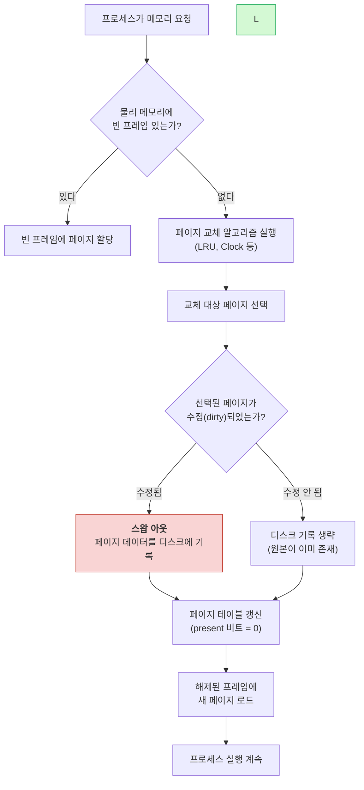
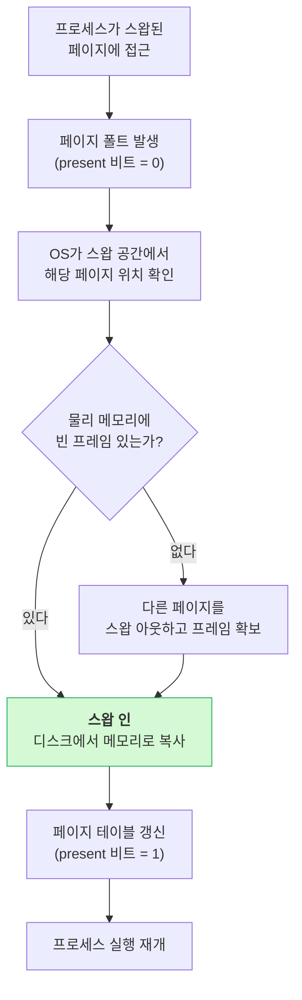
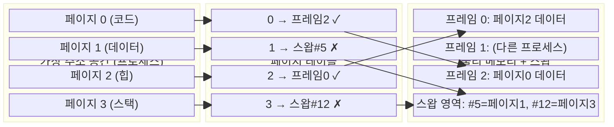
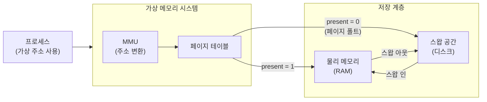

# 스왑 메모리 (Swap Memory)

## 개요

### 스왑 메모리란 무엇인가?

스왑 메모리는 RAM이 부족할 때 디스크 공간을 임시 메모리로 사용하는 기술이다. 하드디스크나 SSD의 일부 공간을 할당해서 RAM처럼 쓴다.

운영체제가 메모리 부족을 감지하면, 현재 사용하지 않는 데이터를 디스크로 옮긴다. 나중에 그 데이터가 필요해지면 다시 메모리로 불러온다. 메모리 부족으로 인한 시스템 크래시를 막아주지만, 디스크 I/O가 발생하므로 성능은 떨어진다.

### 왜 스왑 메모리가 필요한가?

**메모리 부족 상황 대응**

- 물리적 메모리는 비싸고 용량에 한계가 있다
- 애플리케이션의 메모리 요구량은 예측하기 어렵다
- 갑자기 메모리가 필요해질 때 크래시를 방지한다

**프로세스 간 메모리 관리**

- 중요한 프로세스가 메모리를 더 필요로 할 때, 덜 중요한 프로세스의 메모리를 디스크로 옮겨 공간을 확보한다
- 시스템 관리자가 프로세스 우선순위를 조절할 여지를 준다

**시스템 안정성**

- 메모리 부족으로 인한 시스템 다운을 방지한다
- 서버 환경에서는 서비스 중단을 최소화하는 데 중요하다

### 주요 개념

**스왑 인(Swap In)**
디스크에 저장된 데이터를 다시 메모리로 가져오는 과정이다. 해당 데이터가 다시 필요해졌을 때 발생하며, 운영체제가 자동으로 처리한다.

**스왑 아웃(Swap Out)**
메모리에서 사용하지 않는 데이터를 디스크로 옮기는 과정이다. 메모리 부족 상황에서 운영체제가 자동으로 수행하며, 어떤 데이터를 옮길지는 페이지 교체 알고리즘이 결정한다.

**스왑 공간(Swap Space)**
디스크에서 스왑 메모리로 사용되는 영역이다. 전용 파티션이나 파일 형태로 존재하며, 운영체제가 관리한다.

**스왑 파일(Swap File)**
스왑 공간을 파일 형태로 구현한 것이다. 파티션 방식보다 크기 조절이 쉬워서 현대 시스템에서 많이 쓴다.

**스왑 파티션(Swap Partition)**
디스크의 전용 파티션으로 할당된 스왑 공간이다. 전통적인 방식이지만 크기 조절이 어려워서 요즘은 잘 안 쓴다.

## 동작 원리

### 스왑 인/아웃 흐름

프로세스가 메모리를 요청했을 때 물리 메모리가 부족하면 스왑 아웃이 발생하고, 스왑 아웃된 페이지가 다시 필요해지면 스왑 인이 발생한다. 전체 흐름은 다음과 같다.



스왑 아웃된 페이지에 다시 접근하면 **페이지 폴트(Page Fault)**가 발생하고, 스왑 인이 진행된다.



dirty 페이지 여부가 중요하다. 읽기만 한 페이지는 디스크에 원본이 남아있으므로 스왑 아웃 시 기록을 생략할 수 있다. 쓰기가 발생한 dirty 페이지만 실제로 디스크에 써야 하므로, dirty 비트 관리가 스왑 성능에 직접 영향을 준다.

### 메모리-디스크 데이터 이동 구조

물리 메모리와 스왑 공간 사이에서 페이지가 어떤 구조로 이동하는지 나타낸 그림이다.



페이지 테이블의 present 비트(위 그림에서 ✓/✗)가 해당 페이지가 물리 메모리에 있는지, 스왑 공간에 있는지를 구분한다. 프로세스가 ✗ 표시된 페이지에 접근하면 페이지 폴트가 발생하고 스왑 인이 시작된다.

### 스왑 메모리가 작동하는 방식

운영체제는 메모리 사용량을 지속적으로 모니터링하고, 필요에 따라 데이터를 메모리와 디스크 사이에서 이동시킨다.

**1단계: 메모리 부족 상황 감지**
운영체제가 사용 가능한 메모리가 특정 임계값 이하로 떨어지면, 스왑 아웃 과정을 시작한다. 이 임계값은 시스템 설정에서 조절할 수 있다.

**2단계: 스왑 대상 페이지 선택**
어떤 페이지를 디스크로 옮길지 결정한다. 잘못된 선택은 성능에 큰 영향을 미치므로 페이지 교체 알고리즘이 이 판단을 담당한다.

**3단계: 스왑 아웃 실행**
선택된 페이지의 데이터를 디스크의 스왑 공간에 저장한다. 페이지 테이블도 업데이트하여 해당 페이지가 디스크에 있다는 것을 기록한다.

**4단계: 메모리 공간 해제**
스왑 아웃된 페이지의 메모리 공간을 해제하여 새로운 데이터를 위한 공간을 확보한다.

**5단계: 스왑 인 (필요시)**
스왑 아웃된 데이터가 다시 필요해지면, 디스크에서 메모리로 데이터를 복원한다.

### 페이지 교체 알고리즘

**LRU (Least Recently Used)**
가장 오랫동안 사용되지 않은 페이지를 스왑 아웃 대상으로 선택한다. 이론적으로는 가장 좋은 결과를 내지만, 모든 페이지의 접근 시간을 추적해야 해서 오버헤드가 크다.

**FIFO (First In First Out)**
가장 먼저 메모리에 로드된 페이지를 스왑 아웃한다. 구현이 간단하지만, 자주 사용되는 페이지도 오래되었다는 이유만으로 스왑 아웃될 수 있다.

**Clock Algorithm (Second Chance Algorithm)**
LRU의 근사 알고리즘이다. 참조 비트를 이용해 페이지의 사용 여부를 판단한다. 시계 바늘처럼 순환하면서 참조되지 않은 페이지를 찾아 스왑 아웃한다. LRU보다 구현 비용이 낮으면서 성능은 비슷하다. Linux가 이 방식을 사용한다.

## 장단점

### 장점

**물리적 메모리 한계 극복**
8GB RAM 시스템에서 12GB가 필요한 작업을 수행할 수 있다. 대용량 데이터 처리나 여러 애플리케이션을 동시에 실행해야 하는 환경에서 유용하다.

**시스템 안정성**
메모리 부족으로 시스템이 갑자기 종료되거나 애플리케이션이 강제 종료되는 상황을 막는다. 스왑 메모리가 없으면 OOM(Out of Memory) 상황에서 커널이 프로세스를 직접 죽인다.

**비용 절감**
RAM은 비싸다. 스왑 메모리로 디스크 공간을 활용하면, 물리 메모리를 추가하지 않고도 메모리 부족 상황에 대응할 수 있다. 다만 성능은 RAM보다 훨씬 떨어진다.

### 단점

**성능 저하**
가장 큰 문제다. 디스크 접근 속도는 메모리보다 수백~수천 배 느리다. 스왑 인/아웃이 빈번하게 발생하면 시스템 전체가 느려진다. HDD를 사용하는 경우 더 심각하다.

**디스크 공간 소모**
스왑 메모리를 위해 디스크 공간을 별도로 할당해야 한다. 대용량 스왑 설정 시 상당한 디스크 공간이 묶인다.

**I/O 부하 증가**
스왑 사용 시 디스크 I/O가 늘어난다. 다른 애플리케이션의 디스크 접근 성능에도 영향을 줄 수 있다.

**관리 부담**
적절한 스왑 크기 설정, 사용률 모니터링 등 추가 관리 작업이 필요하다. 잘못된 설정은 오히려 성능을 떨어뜨린다.

## 가상 메모리와의 관계

### 가상 메모리 시스템

가상 메모리는 운영체제가 제공하는 메모리 추상화 기술이다. 각 프로세스는 자신만의 큰 메모리 공간을 가진 것처럼 보이지만, 실제로는 물리 메모리와 디스크 공간이 조합되어 있다. 프로세스 간 메모리 격리를 제공하고, 각 프로세스가 독립적인 주소 공간을 가지도록 한다.

가상 메모리 시스템에서는 페이지 단위로 메모리를 관리한다. 각 페이지는 필요에 따라 물리 메모리나 디스크에 저장된다.

### 스왑 메모리의 위치

스왑 메모리는 가상 메모리 시스템의 구성 요소다. 가상 메모리가 추상화된 메모리 공간을 제공한다면, 스왑 메모리는 그 추상화를 실현하는 구체적인 기술이다.



- 가상 메모리: 전체적인 메모리 관리 시스템 (RAM + 디스크 조합)
- 스왑 메모리: 가상 메모리 시스템에서 디스크를 메모리로 활용하는 부분

프로세스는 가상 주소만 사용하기 때문에 데이터가 RAM에 있든 스왑에 있든 구분하지 못한다. MMU가 주소를 변환하다 present 비트가 0인 페이지를 만나면 페이지 폴트를 발생시키고, OS가 스왑 인을 수행한다. 이 과정이 프로세스에 투명하게 처리되는 것이 가상 메모리 시스템의 핵심이다.

## OS별 스왑 메모리 관리

### Linux

**상태 확인**

```bash
# 메모리와 스왑 사용량 확인
free -h

# 활성화된 스왑 공간 상세 정보
cat /proc/swaps

# 스왑 인/아웃 통계
vmstat 1
```

**스왑 파일 생성**

```bash
# 2GB 스왑 파일 생성
sudo fallocate -l 2G /swapfile
sudo chmod 600 /swapfile
sudo mkswap /swapfile
sudo swapon /swapfile

# 재부팅 후에도 유지하려면 /etc/fstab에 추가
echo '/swapfile none swap sw 0 0' | sudo tee -a /etc/fstab
```

**swappiness 값 조정**

swappiness는 커널이 스왑을 얼마나 적극적으로 사용할지 결정하는 값이다. 0~100 범위이며, 값이 낮을수록 스왑 사용을 최소화한다.

```bash
# 현재 값 확인
cat /proc/sys/vm/swappiness

# 임시 변경 (재부팅 시 초기화)
sudo sysctl vm.swappiness=10

# 영구 변경
echo 'vm.swappiness=10' | sudo tee -a /etc/sysctl.conf
```

서버 환경에서는 10~30 정도가 적당하다. 데이터베이스 서버는 낮게 잡는 편이 좋다.

**스왑 사용률이 계속 높다면**

스왑 사용률이 지속적으로 높은 건 메모리가 부족하다는 뜻이다. 메모리 누수가 있는지, 특정 프로세스가 메모리를 과도하게 쓰는지 확인한다. 근본적으로는 물리 메모리를 늘려야 한다.

```bash
# 프로세스별 스왑 사용량 확인
for file in /proc/*/status; do
  awk '/VmSwap|Name/{printf $2 " " $3}END{print ""}' $file
done | sort -k 2 -n -r | head -10
```

### Windows

Windows에서는 스왑 메모리를 페이지 파일(Page File)이라고 부른다. 기본적으로 시스템이 자동 관리하지만, 수동으로 크기를 지정할 수도 있다.

- 자동 관리: 대부분의 경우 문제없이 동작한다
- 수동 설정: 특정 워크로드에서 페이지 파일 크기가 부족하거나 과도할 때 조절한다
- 작업 관리자나 성능 모니터(Performance Monitor)로 사용량을 확인한다

### macOS

macOS는 스왑 파일을 동적으로 생성하고 삭제한다. 메모리 압박이 생기면 자동으로 스왑 파일을 만들고, 여유가 생기면 정리한다.

```bash
# 메모리 상태 확인
vm_stat

# 스왑 파일 확인
ls -lh /private/var/vm/swapfile*
```

## 스왑 크기 설정

전통적으로 RAM의 2배를 권장했지만, 현대 시스템에서는 용도에 따라 다르게 설정한다.

| 용도 | 권장 크기 | 이유 |
|------|-----------|------|
| 개발 환경 | RAM의 1~2배 | 빌드 과정에서 메모리 사용량이 급증하는 경우가 있다 |
| 웹 서버 | RAM의 1배 | 트래픽 변동에 대응해야 한다 |
| DB 서버 | RAM의 0.5~1배 | 스왑이 발생하면 쿼리 성능이 크게 떨어진다 |
| 데스크톱 | RAM의 1~2배 | 여러 앱을 동시에 실행하는 경우가 많다 |

SSD를 사용하는 시스템은 스왑 성능이 HDD보다 낫지만, SSD 수명에 영향을 줄 수 있으므로 과도하게 잡지 않는다. SSD의 쓰기 수명(TBW)을 고려해서 적절히 설정한다.

---

## 참조

- Tanenbaum, A. S., & Bos, H. (2014). Modern Operating Systems (4th ed.). Pearson.
- Silberschatz, A., Galvin, P. B., & Gagne, G. (2018). Operating System Concepts (10th ed.). Wiley.
- Linux Kernel Documentation: Memory Management
- Microsoft Windows Internals (7th ed.) by Mark Russinovich, David Solomon, and Alex Ionescu
- Apple Technical Note: Memory Management in macOS
