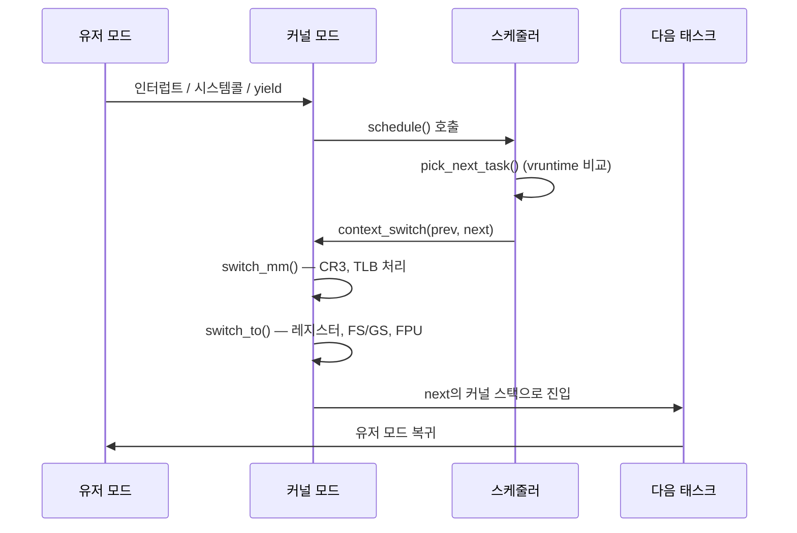

# 컨텍스트 스위칭 (Context Switching)

CPU가 현재 실행 중인 태스크(프로세스 또는 스레드)를 멈추고, 다른 태스크로 전환하는 과정이다. 운영체제 스케줄러가 이 전환을 담당한다.

멀티태스킹의 근간이지만, 공짜가 아니다. 전환할 때마다 CPU 사이클이 사라지고, 캐시·TLB·분기 예측기가 함께 무너진다. 5년 정도 백엔드 일을 하면서 마주친 성능 이슈의 상당수가 결국 "스레드를 너무 많이 만들었다" 또는 "락 경합으로 강제 전환이 폭발했다"로 귀결됐다.

---

## 모드 스위치 vs 컨텍스트 스위치

이 둘을 헷갈리는 경우가 많다. 시스템 콜을 호출하면 무조건 컨텍스트 스위칭이 일어난다고 잘못 알고 있는 경우가 흔한데, 그렇지 않다.

| 구분 | 모드 스위치 (Mode Switch) | 컨텍스트 스위치 (Context Switch) |
|------|---------------------------|----------------------------------|
| 발생 시점 | 시스템 콜, 인터럽트, 예외 | 스케줄러가 다른 태스크 선택 시 |
| 전환 대상 | 같은 태스크의 user → kernel | 태스크 자체가 바뀜 |
| TLB | 영향 없음 | 프로세스 간 전환 시 영향 |
| 페이지 테이블 | 그대로 | 프로세스 간 전환 시 변경 |
| 비용 | 수십~수백 ns | 수 μs ~ 수십 μs |

`getpid()` 같은 짧은 시스템 콜을 부르면 user 모드에서 kernel 모드로 잠깐 들어갔다가 같은 태스크로 돌아온다. CPU 권한 레벨(x86의 ring 0 ↔ ring 3)만 바뀌었지, `current` 매크로가 가리키는 태스크는 그대로다. 이건 컨텍스트 스위치가 아니다.

진짜 컨텍스트 스위치는 `schedule()`이 불려서 `prev`와 `next`가 다른 태스크일 때 일어난다. 시스템 콜이 블로킹되어 sleep으로 들어가거나, 타임 슬라이스가 만료되거나, 더 높은 우선순위 태스크가 깨어나는 등의 이유로 스케줄러가 새 태스크를 선택해야 할 때다.

`perf stat`로 확인할 때 `context-switches` 카운터가 모드 스위치까지 포함하는 게 아니라는 점을 기억해야 한다. 시스템 콜만 잔뜩 부르는 코드의 컨텍스트 스위치 카운트는 의외로 낮을 수 있다.

---

## task_struct: Linux의 PCB 실체

교과서는 PCB(Process Control Block)라고 부르지만, Linux 커널 소스에서는 `struct task_struct`다. `include/linux/sched.h`에 정의되어 있고, 1만 줄 가까운 헤더에서 약 700줄 가량을 차지한다. 필드가 수백 개라 전부 외울 필요는 없고, 컨텍스트 스위칭과 관련된 핵심 영역만 짚으면 된다.

```c
struct task_struct {
    struct thread_info      thread_info;     // CPU 플래그, preempt 카운터
    unsigned int            __state;         // TASK_RUNNING, TASK_INTERRUPTIBLE 등

    void                    *stack;          // 커널 스택 포인터
    refcount_t              usage;
    int                     prio;            // 동적 우선순위
    int                     static_prio;
    int                     normal_prio;
    unsigned int            rt_priority;     // 실시간 우선순위 (1~99)

    const struct sched_class *sched_class;   // 스케줄링 클래스 (CFS, RT 등)
    struct sched_entity     se;              // CFS용 엔티티 (vruntime 등)
    struct sched_rt_entity  rt;              // RT 스케줄러용
    struct sched_dl_entity  dl;              // Deadline 스케줄러용

    struct mm_struct        *mm;             // 메모리 디스크립터 (주소 공간)
    struct mm_struct        *active_mm;      // 커널 스레드용

    pid_t                   pid;
    pid_t                   tgid;            // 스레드 그룹 ID = 유저 공간의 PID

    struct files_struct     *files;          // 열린 파일 디스크립터 테이블
    struct fs_struct        *fs;             // 현재 작업 디렉토리 등
    struct signal_struct    *signal;
    struct sighand_struct   *sighand;

    struct thread_struct    thread;          // 아키텍처별 레지스터 상태
    cpumask_t               cpus_mask;       // 실행 가능한 CPU 마스크
};
```

각 필드의 역할은 아래와 같다.

- `thread_struct thread`: x86이면 `arch/x86/include/asm/processor.h`에 정의된 구조체로, 스택 포인터(`sp`), FS/GS 베이스, TLS 디스크립터, FPU 컨텍스트 포인터 등 아키텍처 의존적인 레지스터 상태가 들어간다. 컨텍스트 스위치할 때 실제로 저장/복원되는 핵심 영역이다.
- `mm_struct *mm`: 가상 메모리 레이아웃. 페이지 글로벌 디렉토리 포인터(`pgd`), VMA 리스트, 힙/스택 경계 등이 들어 있다. 프로세스 간 전환 시 이걸 바꿔야 한다.
- `files_struct *files`: 파일 디스크립터 배열. 같은 프로세스의 스레드들은 이걸 공유한다. fork하면 복제, clone에 `CLONE_FILES` 플래그를 주면 공유.
- `signal_struct`, `sighand_struct`: 시그널 핸들링 상태. 프로세스 단위로 묶이는 정보.
- `sched_entity se`: CFS가 사용하는 가상 실행 시간(`vruntime`), 레드-블랙 트리 노드 등. 스케줄러 종류에 따라 `rt`, `dl`이 사용된다.

스레드와 프로세스가 같은 `task_struct`로 표현되는 게 Linux의 특징이다. `pid`는 커널 내부의 태스크 ID, `tgid`는 유저 공간에서 보는 PID다. `pthread_create()`가 만드는 스레드는 동일한 `tgid`를 공유하면서 `pid`만 다른 task_struct가 된다. 즉 Linux에서 "스레드"는 `mm`, `files`, `signal` 등을 공유하는 task_struct일 뿐이다. 이 단순한 모델 덕분에 스케줄러는 프로세스/스레드를 구분하지 않고 동일하게 취급한다.

---

## 전환 흐름과 핵심 함수

### context_switch() 진입

스케줄러 핵심 함수 `schedule()`이 다음 태스크를 정하면 `context_switch(rq, prev, next, ...)`를 호출한다. `kernel/sched/core.c`에 있다.

```c
static __always_inline struct rq *
context_switch(struct rq *rq, struct task_struct *prev,
               struct task_struct *next, struct rq_flags *rf)
{
    prepare_task_switch(rq, prev, next);

    if (!next->mm) {                          // 커널 스레드로 전환
        enter_lazy_tlb(prev->active_mm, next);
        next->active_mm = prev->active_mm;
    } else {                                  // 유저 태스크로 전환
        membarrier_switch_mm(rq, prev->active_mm, next->mm);
        switch_mm_irqs_off(prev->active_mm, next->mm, next);
    }

    switch_to(prev, next, prev);              // 레지스터/스택 전환
    barrier();

    return finish_task_switch(prev);
}
```

흐름이 단순해 보이지만 두 줄짜리 핵심에 꽤 많은 일이 숨어 있다. `switch_mm`은 가상 주소 공간을 바꾸고, `switch_to`는 CPU의 실행 흐름 자체를 다음 태스크의 커널 스택으로 넘긴다.

### switch_mm() 내부: CR3와 TLB

x86-64에서 `switch_mm_irqs_off()`의 핵심은 CR3 레지스터를 새 페이지 글로벌 디렉토리 주소로 갱신하는 것이다. CR3가 바뀌면 CPU의 MMU는 새 페이지 테이블을 따라 가상 주소를 변환한다.

```c
// arch/x86/mm/tlb.c (단순화)
void switch_mm_irqs_off(struct mm_struct *prev, struct mm_struct *next,
                        struct task_struct *tsk)
{
    if (prev == next) return;

    if (cpu_feature_enabled(X86_FEATURE_PCID)) {
        u16 new_asid = choose_new_asid(next, ...);
        write_cr3(build_cr3(next->pgd, new_asid));   // PCID 비트 포함
    } else {
        write_cr3(__pa(next->pgd));                  // TLB 전체 플러시
    }

    load_mm_ldt(next);
    switch_ldt(prev, next);
}
```

PCID(Process Context Identifier)가 없으면 CR3를 쓰는 순간 TLB가 통째로 날아간다. PCID를 켜면 12비트 ID로 엔트리를 구분해서, 같은 태스크로 돌아왔을 때 살아있는 TLB 엔트리를 재활용할 수 있다. Linux 4.14부터 KPTI(Meltdown 패치) 도입과 함께 PCID 사용이 적극화됐다.

같은 프로세스의 스레드끼리 전환할 때는 `prev == next`라서 이 함수가 사실상 no-op이다. 이게 스레드 전환이 프로세스 전환보다 훨씬 싼 결정적인 이유다.

커널 스레드(`mm == NULL`)로 전환할 때는 `enter_lazy_tlb()`가 불리고 이전 프로세스의 `active_mm`을 빌려 쓴다. CR3를 안 건드리니 TLB가 보존된다. 커널 스레드는 유저 공간을 안 보기 때문에 가능한 최적화다.

### switch_to() 내부: 레지스터, FSGSBASE, FPU

`switch_to`는 어셈블리에 가까운 매크로다. x86-64에서는 `arch/x86/entry/entry_64.S`의 `__switch_to_asm`과 C 코드 `__switch_to`(`arch/x86/kernel/process_64.c`)가 짝을 이룬다.

```c
__visible __notrace_funcgraph struct task_struct *
__switch_to(struct task_struct *prev_p, struct task_struct *next_p)
{
    struct thread_struct *prev = &prev_p->thread;
    struct thread_struct *next = &next_p->thread;

    switch_fpu_prepare(prev_p, cpu);          // FPU 저장 준비
    save_fsgs(prev_p);                        // FS/GS 베이스 저장
    load_TLS(next, cpu);                      // TLS 디스크립터 적재
    arch_end_context_switch(next_p);
    load_seg_legacy(prev->fsindex, prev->fsbase,
                    next->fsindex, next->fsbase, FS);
    load_seg_legacy(prev->gsindex, prev->gsbase,
                    next->gsindex, next->gsbase, GS);
    switch_fpu_finish(next_p);                // FPU 복원
    this_cpu_write(current_task, next_p);
    ...
}
```

세 가지가 핵심이다.

**범용 레지스터와 스택 포인터.** `__switch_to_asm`에서 callee-saved 레지스터(rbp, rbx, r12~r15)를 prev의 커널 스택에 푸시하고, next의 커널 스택 포인터로 RSP를 갈아 끼운 뒤 pop한다. 이 한 번의 RSP 교체로 실행 흐름이 다음 태스크로 넘어간다. caller-saved 레지스터는 컴파일러가 어차피 함수 호출 규약상 처리하므로 별도로 저장하지 않는다.

**FSGSBASE.** TLS(Thread-Local Storage) 베이스 주소가 FS/GS 세그먼트 베이스에 들어 있다. 예전에는 MSR(`MSR_FS_BASE`, `MSR_KERNEL_GS_BASE`) 읽고 쓰는 데 200~300 사이클이 들었는데, FSGSBASE 명령어(`rdfsbase`, `wrfsbase` 등)가 추가되고 Linux 5.9에서 활성화되면서 수십 사이클로 줄었다. Ivy Bridge 이후 CPU에서 지원하지만 커널 옵션 `nofsgsbase`가 켜져 있으면 옛날 방식으로 돌아간다.

**FPU lazy save/restore.** 옛날 커널은 FPU 상태(SSE/AVX 레지스터)를 매 전환마다 저장/복원하면 비싸니까, 다음 태스크가 FPU를 실제로 건드릴 때만 처리하는 lazy 방식을 썼다. CR0의 TS 비트를 세팅해 두고, FPU 명령어가 실행되면 #NM 예외가 발생해 그때 복원했다. 그런데 Lazy FPU Save Restore Vulnerability(CVE-2018-3665)가 터지면서 Linux 4.6부터는 eager 방식, 즉 매 전환마다 `xsave`/`xrstor`로 저장/복원한다. AVX-512까지 켜진 환경에서는 FPU 영역만 2KB 가까이 되므로 만만치 않은 비용이다. 워크로드가 SIMD를 안 쓰면 굳이 AVX-512용 컨텍스트 영역을 키우지 않도록 `XSAVES` 마스크를 손보는 튜닝도 있다.

### 전체 흐름



---

## 컨텍스트 스위칭 비용

### 직접 비용

레지스터 저장/복원, CR3 갱신, FPU 처리에 드는 CPU 사이클이다. x86-64 서버급에서 1~5μs 정도 걸린다. lmbench의 `lat_ctx`나 직접 짠 파이프 핑퐁 벤치마크로 측정 가능하다.

### 간접 비용 — 진짜 비싼 부분

직접 비용보다 간접 비용이 훨씬 크다. 실무에서 성능 이슈를 일으키는 것도 거의 이쪽이다.

**캐시 오염.** 프로세스 A가 워밍업한 L1/L2/L3 캐시가 B로 전환하면 무용지물이 된다. L3 미스 한 번이 DRAM 접근으로 이어지면 약 100ns. 전환 직후 수백~수천 번의 캐시 미스가 누적되면 직접 비용의 수십~수백 배가 된다.

**TLB 플러시.** 프로세스 간 전환 시 TLB가 무효화된다. PCID가 없거나 ASID가 부족하면 전체 플러시가 발생하고, 이후 페이지 테이블 워킹이 폭발한다.

**브랜치 예측기와 RSB.** 분기 예측기와 Return Stack Buffer는 프로세스별 패턴을 학습한다. Spectre 완화책(IBPB, retpoline)이 켜진 환경에서는 컨텍스트 스위치마다 예측기를 명시적으로 비우기 때문에 추가 비용이 든다. 보안과 성능의 트레이드오프인데, 클라우드 멀티 테넌트 환경에서는 이걸 끌 수 없다.

### CPU 마이그레이션과 NUMA

같은 코어에서 일어나는 컨텍스트 스위치도 비싸지만, 다른 코어로 옮겨가는 마이그레이션은 한 단계 더 비싸다. 캐시가 아예 없는 코어에서 새로 시작하기 때문이다.

NUMA(Non-Uniform Memory Access) 시스템에서는 이게 훨씬 심각해진다. 듀얼 소켓 EPYC이나 Xeon에서 태스크가 소켓 0에서 실행되다가 소켓 1로 마이그레이션되면, 메모리는 여전히 소켓 0의 NUMA 노드에 있다. 원격 노드 접근은 로컬 대비 1.5~3배 느리고, L3 캐시는 소켓별로 분리되어 있으니 캐시도 다 날아간다.

`numactl --hardware`로 노드 구조를 확인하고, `perf stat -e node-loads,node-load-misses,node-stores`로 원격 메모리 접근을 측정할 수 있다. 핫한 워커 스레드가 의도치 않게 소켓을 옮겨다니면서 성능이 들쭉날쭉할 때, 거의 NUMA 마이그레이션 문제다. 해결책은 뒤의 "실무 튜닝" 절에 있는 affinity 고정과 cpuset 격리다.

vmstat의 `cpu-migrations`(perf로도 측정) 카운터가 비정상적으로 높으면 의심해야 한다.

---

## 프로세스 전환 vs 스레드 전환

같은 프로세스 내의 스레드 간 전환은 프로세스 간 전환보다 가볍다.

| 항목 | 프로세스 간 | 스레드 간 (같은 프로세스) |
|------|-------------|--------------------------|
| 레지스터 저장/복원 | 필요 | 필요 |
| FPU 저장/복원 | 필요 | 필요 |
| `switch_mm()` (CR3) | 발생 | no-op |
| TLB | PCID 없으면 전체 플러시 | 보존 |
| 캐시 영향 | 큼 | 작음 (코드/힙 공유) |

핵심 차이는 `switch_mm()`의 동작 여부다. 같은 `mm_struct`를 공유하면 `prev == next`라 CR3를 안 건드리고 TLB도 그대로다. 실측 기준으로 프로세스 간 전환은 약 3~5μs, 스레드 간 전환은 약 1~2μs 정도다.

---

## 커널 스레드, 유저 스레드, M:N 모델

스레드는 어디서 관리되느냐에 따라 세 가지 모델로 나뉜다.

**1:1 (커널 스레드 모델).** 유저 공간의 스레드 하나가 커널의 task_struct 하나에 직접 매핑된다. Linux의 NPTL(pthread), Windows 스레드, JVM의 플랫폼 스레드가 여기에 해당한다. 커널이 스케줄링하므로 멀티코어 활용이 자연스럽고, 한 스레드가 블로킹되어도 다른 스레드는 영향이 없다. 단점은 스레드 생성/전환 비용이 커널 영역까지 가서 컨텍스트 스위칭을 동반한다는 점이다.

**N:1 (유저 스레드 모델).** 유저 공간 라이브러리가 자체적으로 스케줄링한다. 커널은 단일 task_struct만 본다. 전환이 함수 호출 수준으로 싸지만, 한 스레드가 시스템 콜로 블로킹되면 프로세스 전체가 멈춘다. 멀티코어 활용도 어렵다. 옛날 GNU Pth, Solaris의 초기 LWP 모델이 이런 식이었다.

**M:N (하이브리드).** M개의 유저 스레드를 N개의 커널 스레드 위에 매핑한다. 유저 공간 스케줄러가 가벼운 전환을 처리하면서, 멀티코어도 활용한다. Solaris의 후기 모델, FreeBSD의 KSE, 현재 Go 런타임의 G-M-P 모델, Java 21의 Virtual Thread가 이 계열이다.

5년 전쯤만 해도 1:1이 사실상 표준이었는데, 최근 몇 년 사이 동시성 워크로드가 폭증하면서 M:N이 다시 주류가 되고 있다. 이유는 명확하다. 100만 개의 동시 연결을 다루는 서버에 OS 스레드 100만 개를 띄울 수는 없기 때문이다.

---

## CFS와 vruntime: 언제 전환되나

CFS(Completely Fair Scheduler)는 Linux 2.6.23 이후의 기본 스케줄러다. 핵심은 `vruntime`(가상 실행 시간)이라는 단일 지표로 공정성을 정의하는 것이다.

`vruntime`은 태스크가 실제로 실행된 시간을 nice 값에 따라 가중치로 보정한 값이다. nice가 0인 태스크는 실제 시간 그대로 누적되고, nice가 낮을수록(우선순위 높음) 가중치가 커서 같은 실제 시간에 대해 vruntime이 더 천천히 증가한다.

```c
// kernel/sched/fair.c (단순화)
static void update_curr(struct cfs_rq *cfs_rq) {
    struct sched_entity *curr = cfs_rq->curr;
    u64 delta_exec = now - curr->exec_start;

    curr->vruntime += calc_delta_fair(delta_exec, curr);  // 가중치 적용
    curr->exec_start = now;

    update_min_vruntime(cfs_rq);
}
```

CFS는 모든 RUNNABLE 태스크를 vruntime 기준의 레드-블랙 트리로 관리한다. 가장 왼쪽(=vruntime이 가장 작은) 태스크가 다음에 실행된다.

컨텍스트 스위치가 트리거되는 시점은 다음과 같다.

- **타임 슬라이스 만료**: 현재 태스크의 누적 vruntime이 `sysctl_sched_min_granularity`(기본 0.75ms~3ms 가량, 부하에 따라 동적 조정) 이상이고 트리에서 더 작은 vruntime을 가진 태스크가 있으면 스케줄러가 호출된다.
- **wake-up preemption**: 깨어난 태스크의 vruntime이 현재 태스크보다 충분히 작으면(`wakeup_granularity_ns` 이상 차이) 즉시 선점한다.
- **자발적 양보**: I/O 대기, `sleep()`, 락 대기 등으로 태스크가 `TASK_INTERRUPTIBLE`/`TASK_UNINTERRUPTIBLE`로 전환되면서 schedule()을 호출.
- **명시적 yield**: `sched_yield()` 호출.

긴 시간 sleep했다가 깨어난 태스크는 vruntime이 매우 작아서 한참 동안 CPU를 독차지할 수 있다. 이걸 막기 위해 CFS는 깨어날 때 vruntime을 `min_vruntime - sched_latency/2` 근처로 끌어올린다. 이 동작이 의외로 자주 잘못 이해되는데, "sleep 끝난 태스크가 즉시 우선권을 받는다"는 건 정확하지 않다.

Linux 6.6부터는 EEVDF(Earliest Eligible Virtual Deadline First)가 기본이 됐다. CFS의 vruntime 개념을 유지하면서 가상 데드라인 기반으로 선택을 바꿨는데, 외부에서 보는 동작 양상은 비슷하다. nice 값과 동일하게 보정되는 가상 시간이라는 본질은 변하지 않았다.

---

## 커널 Preemption 모델

같은 커널이라도 컴파일 옵션에 따라 선점 정책이 달라진다. `CONFIG_PREEMPT_*` 옵션이고, 워크로드 특성에 따라 골라야 한다.

| 모델 | 동작 | 적합 워크로드 |
|------|------|---------------|
| `PREEMPT_NONE` | 커널 모드 실행 중에는 절대 선점되지 않음 | 처리량 우선 서버, 배치, HPC |
| `PREEMPT_VOLUNTARY` | 커널 코드 곳곳의 `might_sleep()` 지점에서만 선점 | 일반 데스크톱, 균형 잡힌 서버 |
| `PREEMPT` (Low-Latency Desktop) | 스핀락/RCU 임계 구역 외에는 거의 어디서나 선점 | 인터랙티브, 미디어, 게이밍 |
| `PREEMPT_RT` | 스핀락까지 mutex로 변환, 거의 모든 곳에서 선점 가능 | 산업 제어, 오디오, 로보틱스 |

`PREEMPT_NONE`은 컨텍스트 스위치 횟수를 줄이고 처리량을 끌어올리는 데 유리하다. 한 시스템 콜이 길어져도 다른 태스크를 기다리게 한다. 단점은 인터랙티브 응답성이 떨어진다는 것. 데이터베이스 서버나 ML 학습 같은 처리량 중심 워크로드에 어울린다.

`PREEMPT`는 응답성을 위해 처리량을 일부 포기한다. 짧은 응답이 중요한 워크로드에서는 평균 처리량이 약간 떨어져도 99퍼센타일 지연이 좋아진다.

`PREEMPT_RT`는 2024년쯤(Linux 6.12)에 메인라인에 완전히 머지됐다. 모든 스핀락이 슬립 가능한 mutex로 변환되고, 인터럽트 핸들러도 스레드화된다. 마이크로초 단위 결정성이 필요한 분야 외에는 잘 안 쓴다. 일반 서버에서 켜면 처리량이 크게 떨어진다.

런타임에 확인할 때는 `cat /sys/kernel/debug/sched_features`나 `uname -a`의 RT 표기, 또는 `cat /boot/config-$(uname -r) | grep PREEMPT`가 빠르다.

Linux 6.12 이후로는 `PREEMPT_DYNAMIC` 옵션이 있어서 부팅 파라미터(`preempt=none|voluntary|full`)나 sysfs(`/sys/kernel/debug/sched/preempt`)로 런타임에 모델을 전환할 수 있다. 클라우드 이미지가 한 가지로 빌드돼 있어도 워크로드별로 골라 쓸 수 있게 됐다.

---

## 실무 튜닝: CPU 고정과 실시간 정책

스케줄러에 맡기지 않고 직접 CPU 배치를 강제하는 방법이다. 핵심 워커가 다른 코어로 마이그레이션되거나 커널 데몬과 같은 코어를 공유하면서 지터가 생기는 걸 막는 데 쓴다.

**taskset.** 실행 중이거나 새로 시작하는 프로세스의 CPU 마스크를 설정한다.

```bash
# PID 12345를 코어 4~7에만 묶기
taskset -pc 4-7 12345

# 새 프로세스를 코어 2번에 고정해서 실행
taskset -c 2 ./my_server
```

**sched_setaffinity().** 코드에서 직접 설정하려면 이 시스템 콜을 쓴다.

```c
#define _GNU_SOURCE
#include <sched.h>
#include <pthread.h>

void pin_to_cpu(int cpu) {
    cpu_set_t set;
    CPU_ZERO(&set);
    CPU_SET(cpu, &set);
    pthread_setaffinity_np(pthread_self(), sizeof(set), &set);
}
```

워커 스레드가 NUMA 노드를 넘나들지 않게 묶어 두면 P99 지연이 눈에 띄게 안정된다.

**isolcpus와 nohz_full.** 부팅 파라미터로 특정 코어를 일반 스케줄러에서 빼낸다. `isolcpus=4-7 nohz_full=4-7 rcu_nocbs=4-7`처럼 설정하면 코어 4~7번에는 스케줄러 틱과 RCU 콜백이 안 들어와서 거의 인터럽트 없는 환경이 된다. HFT, 패킷 처리(DPDK), 저지연 매칭 엔진 같은 곳에서 쓴다. 단점은 격리된 코어로는 명시적으로 affinity를 걸어야만 태스크가 들어간다는 것.

**cgroup v2 cpuset.** 컨테이너 환경에서 코어를 격리하려면 cpuset이 자연스럽다.

```bash
mkdir /sys/fs/cgroup/critical
echo "4-7" > /sys/fs/cgroup/critical/cpuset.cpus
echo "0" > /sys/fs/cgroup/critical/cpuset.mems
echo $PID > /sys/fs/cgroup/critical/cgroup.procs
```

systemd unit에서는 `CPUAffinity=4-7`, `AllowedCPUs=4-7` 같은 옵션이 같은 일을 해준다.

**SCHED_FIFO / SCHED_RR.** 실시간 정책이다. nice가 아니라 1~99의 실시간 우선순위를 가지며, 같은 우선순위의 일반 태스크보다 항상 먼저 실행된다.

```c
struct sched_param param = { .sched_priority = 50 };
pthread_setschedparam(pthread_self(), SCHED_FIFO, &param);
```

`SCHED_FIFO`는 CPU를 양보하지 않으면 무한 실행된다. 무한 루프 버그가 SCHED_FIFO에서 터지면 시스템이 멈춘다. 그래서 `RLIMIT_RTTIME`이나 `sched_rt_runtime_us`(기본 950ms/1초) 같은 안전장치가 있는데, 운영 환경에서 함부로 SCHED_FIFO를 쓰면 곤란하다.

`SCHED_RR`은 같은 우선순위 안에서만 라운드로빈이고, 외부 동작은 SCHED_FIFO와 비슷하다.

저지연 사용 사례가 아니라면 `SCHED_OTHER`(=CFS) + affinity 고정이 거의 항상 충분하다. 실시간 정책은 망가졌을 때 디버깅이 어렵다.

---

## 그린 스레드와 코루틴: 스위칭 비용 회피

OS 컨텍스트 스위칭이 비싸니까, 유저 공간에서 가벼운 동시성 단위를 만들어 비용을 우회하는 접근이다.

**Go goroutine.** 런타임이 G(goroutine), M(OS thread), P(processor) 세 단위로 스케줄링한다. M은 진짜 OS 스레드, G는 2KB짜리 가변 스택을 가진 가벼운 실행 단위, P는 G와 M을 연결하는 논리 프로세서(`GOMAXPROCS` 개수만큼 존재)다. 시스템 콜이 블로킹되면 P가 다른 M으로 옮겨가서 G들을 계속 실행한다.

goroutine 간 전환은 함수 호출 수준이다. 레지스터 일부를 G의 스택에 저장하고 다음 G의 스택으로 점프하면 끝. `gopark`/`goready` 메커니즘이 이걸 처리하는데, OS 컨텍스트 스위치(1~3μs) 대비 200~300ns 정도라 한 자릿수 빠르다. 채널 송수신, 네트워크 I/O 대기, mutex 경합 같은 상황에서 자동으로 전환된다.

Go가 100만 goroutine을 돌릴 수 있는 이유는 OS 스레드 100만 개를 만들어서가 아니라, 8~16개 OS 스레드 위에 100만 개의 가벼운 G를 다중화하기 때문이다.

**Java Virtual Thread (Project Loom, Java 21+).** JVM이 자체 스케줄러로 가상 스레드를 캐리어 스레드(=ForkJoinPool의 OS 스레드) 위에 다중화한다. 블로킹 I/O를 만나면 JVM이 가상 스레드를 캐리어에서 떼어내(`unmount`) 다른 가상 스레드를 올린다. I/O가 끝나면 다시 어떤 캐리어에 올라간다.

기존 `Thread` API를 그대로 쓰면서 비용 구조만 바뀌었다. 한 가지 함정은 `synchronized` 블록 안에 들어간 가상 스레드는 캐리어에 핀되어 떼어낼 수 없다는 점(`ReentrantLock`은 괜찮다). 이걸 모르고 마이그레이션하면 캐리어 부족으로 처리량이 더 떨어진다. Java 24쯤(`monitor pinning` 제거) 해결됐다.

**Rust async/await, Python asyncio, C++ coroutine.** 컴파일 타임 변환으로 코루틴을 상태 머신으로 바꾼다. await 지점에서 함수 자체가 끝나고 상태만 보존된 채 리액터로 제어가 돌아간다. 스위칭 비용이 함수 호출보다도 작은 경우가 많다. 단점은 실행 모델이 명시적이고 모든 라이브러리가 async를 지원해야 한다는 것(전염성).

**공통 한계.** 코루틴은 진짜 컴퓨팅 부하에서는 도움이 안 된다. CPU를 100% 쓰는 작업이 있으면 결국 OS가 그 캐리어 스레드를 다른 코어로 안 보내는 한 막힌다. 또 디버거와 프로파일러가 OS 스레드 단위로 동작하는 경우가 많아서 분석이 까다롭다. CPU 바운드는 그냥 OS 스레드, I/O 바운드는 코루틴 — 이게 여전히 합리적인 기준이다.

---

## 측정 도구

### /proc/[pid]/status, /proc/[pid]/sched

```bash
grep ctxt /proc/<pid>/status
# voluntary_ctxt_switches:     1523
# nonvoluntary_ctxt_switches:  42

cat /proc/<pid>/sched
# nr_switches, nr_voluntary_switches, nr_involuntary_switches
# se.statistics.wait_max, wait_sum 등 스케줄러 대기 시간
```

`voluntary`는 스스로 양보(I/O 대기, 락 대기 등), `nonvoluntary`는 강제 선점(타임 슬라이스 만료, 더 높은 우선순위에 밀림). nonvoluntary가 높으면 CPU 경합이 심하다는 뜻이고, voluntary가 폭증하면 락 경합이나 I/O 대기를 의심한다.

### vmstat, pidstat

```bash
vmstat 1                       # cs 컬럼: 초당 시스템 전체 스위칭
pidstat -w -p <pid> 1          # cswch/s, nvcswch/s
```

### perf

```bash
perf stat -e context-switches,cpu-migrations,task-clock -p <pid> sleep 10
perf record -e sched:sched_switch -g -p <pid> sleep 10
perf sched record -- ./workload
perf sched latency           # 스케줄링 지연 분포
perf sched timehist          # 태스크별 타임라인
```

`perf sched latency`는 깨어난 시점부터 실제 실행까지 걸린 시간을 통계로 보여주는데, 스케줄러가 응답성에 미치는 영향을 직접 본다.

### ftrace / trace-cmd: sched_switch 이벤트

ftrace는 커널에 내장된 추적 인프라다. `sched:sched_switch` 이벤트가 컨텍스트 스위치를 정확히 기록한다.

raw 인터페이스로 직접 다루면:

```bash
cd /sys/kernel/tracing
echo 1 > events/sched/sched_switch/enable
echo 1 > tracing_on
sleep 2
echo 0 > tracing_on
cat trace
```

출력에서 `prev_comm`/`prev_pid`/`prev_state`와 `next_comm`/`next_pid`를 확인할 수 있다. `prev_state`는 한 글자 코드(`R` running, `S` interruptible sleep, `D` uninterruptible, `T` stopped 등)다. `R`이면 강제 선점된 것이고, `S`/`D`면 자발적으로 빠진 것이다.

trace-cmd가 조작이 훨씬 편하다.

```bash
trace-cmd record -e sched_switch -e sched_wakeup -P <pid> sleep 5
trace-cmd report | head
# <idle>-0  [003] 12345.678901: sched_switch:
#   prev_comm=swapper/3 prev_pid=0 prev_prio=120 prev_state=R
#   ==> next_comm=nginx next_pid=1234 next_prio=120

# 특정 PID만 필터
trace-cmd record -e sched_switch -f "next_pid==1234 || prev_pid==1234" sleep 10

# 히스토그램
trace-cmd record -p function_graph -l schedule sleep 5
trace-cmd report
```

특정 태스크가 왜 실행을 못하고 있는지 추적할 때 가장 강력하다. `sched_wakeup`과 `sched_switch`를 같이 켜고 보면 깨어난 시점, 실제 실행된 시점, 어떤 태스크에 밀려서 못 들어갔는지가 한눈에 보인다.

bpftrace로 같은 작업을 한 줄로 처리할 수도 있다.

```bash
# 태스크별 컨텍스트 스위치 횟수
bpftrace -e 'tracepoint:sched:sched_switch { @[comm] = count(); }'

# off-CPU 시간(태스크가 실행 안 된 시간) 집계
bpftrace -e '
  tracepoint:sched:sched_switch { @start[args->prev_pid] = nsecs; }
  tracepoint:sched:sched_wakeup  /@start[args->pid]/ {
      @latency = hist(nsecs - @start[args->pid]);
      delete(@start[args->pid]);
  }'
```

프로덕션에서 P99 지연이 튀는 원인을 좁힐 때, 이 off-CPU 시간 분포가 가장 빠른 단서가 된다. 태스크가 깨어난 뒤 실제 실행될 때까지의 큐잉 시간이 곧 스케줄러 측면의 지연이다.

---

## 컨텍스트 스위칭이 문제가 되는 패턴

### 과도한 스레드 생성

스레드 수만 개를 만들면 스케줄러가 바빠지고, 실제 작업보다 전환에 더 많은 시간을 쓰게 된다.

```java
// 안 됨
for (int i = 0; i < 10000; i++) {
    new Thread(() -> doWork()).start();
}

// 풀 사용
ExecutorService pool = Executors.newFixedThreadPool(
    Runtime.getRuntime().availableProcessors()
);
for (int i = 0; i < 10000; i++) {
    pool.submit(() -> doWork());
}

// I/O 바운드면 Virtual Thread (Java 21+)
try (var exec = Executors.newVirtualThreadPerTaskExecutor()) {
    for (int i = 0; i < 10000; i++) {
        exec.submit(() -> doWork());
    }
}
```

### 락 경합

여러 스레드가 같은 락을 잡으려고 경쟁하면, 락을 못 잡은 스레드는 블로킹되면서 voluntary 스위칭이 폭발한다.

```java
synchronized (lock) {
    // DB 조회, 외부 API 호출 같은 오래 걸리는 작업
    // → 다른 스레드들이 줄줄이 대기, 컨텍스트 스위칭 폭발
}
```

`voluntary_ctxt_switches`가 급증하면 락 경합부터 의심한다. perf로 콜스택을 잡아 어디서 걸리는지 본다.

### 빈번한 동기 I/O

블로킹 I/O마다 스위칭이 발생한다. 작은 read/write를 잔뜩 부르는 패턴은 비동기 I/O(epoll, io_uring)나 큰 단위로 묶는 배치로 해결한다.

---

## 직접 측정해보기

파이프 핑퐁으로 컨텍스트 스위칭 비용을 체감할 수 있다.

```c
#include <stdio.h>
#include <stdlib.h>
#include <unistd.h>
#include <time.h>

#define ITERATIONS 100000

int main() {
    int pipe1[2], pipe2[2];
    pipe(pipe1);
    pipe(pipe2);

    char buf = 'x';
    pid_t pid = fork();

    if (pid == 0) {
        for (int i = 0; i < ITERATIONS; i++) {
            read(pipe1[0], &buf, 1);
            write(pipe2[1], &buf, 1);
        }
        exit(0);
    }

    struct timespec start, end;
    clock_gettime(CLOCK_MONOTONIC, &start);

    for (int i = 0; i < ITERATIONS; i++) {
        write(pipe1[1], &buf, 1);
        read(pipe2[0], &buf, 1);
    }

    clock_gettime(CLOCK_MONOTONIC, &end);
    double elapsed = (end.tv_sec - start.tv_sec) * 1e9
                   + (end.tv_nsec - start.tv_nsec);
    printf("컨텍스트 스위칭 1회 평균: %.0f ns\n",
           elapsed / (ITERATIONS * 2));
    return 0;
}
```

일반적인 Linux 서버에서 1~5μs 수준이 나온다. 캐시 워밍업 비용이 빠진 직접 비용 근사치다. 같은 코드를 `taskset -c 0`로 묶고 실행하면 마이그레이션이 사라져서 더 안정적인 숫자가 나오고, 두 코어로 분산하면 평균은 비슷하지만 분산이 커지는 걸 볼 수 있다. 직접 해 보면 affinity가 왜 중요한지 감이 잡힌다.
