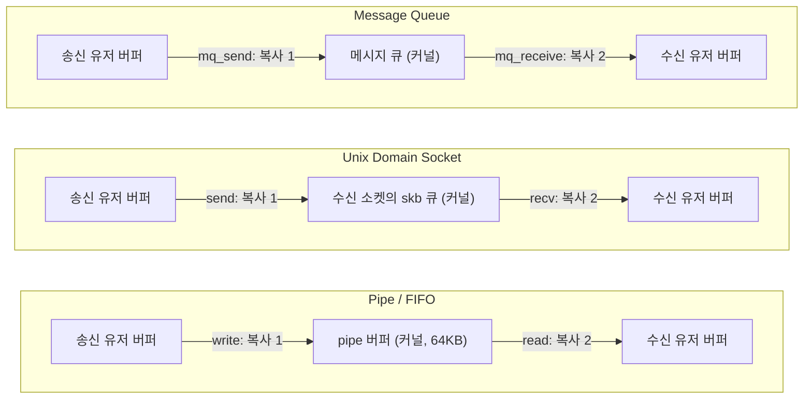
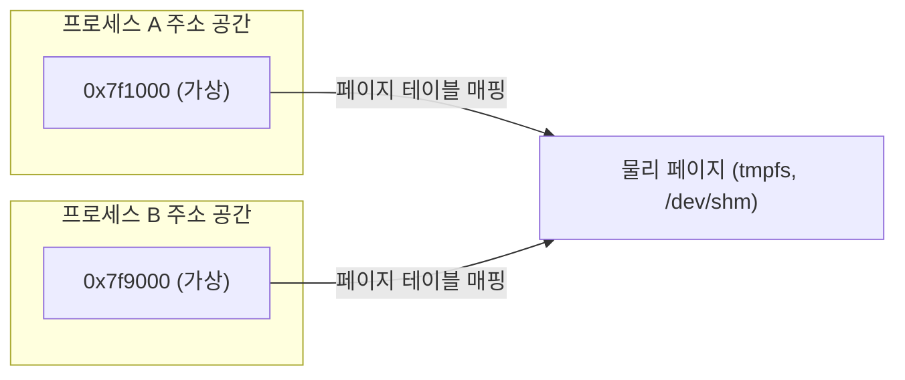
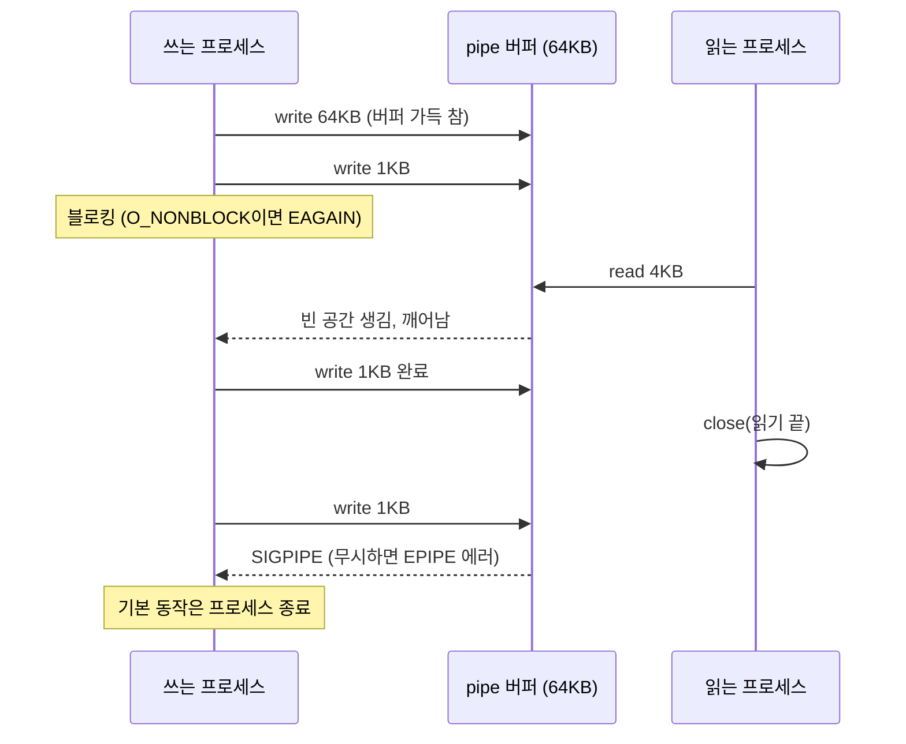
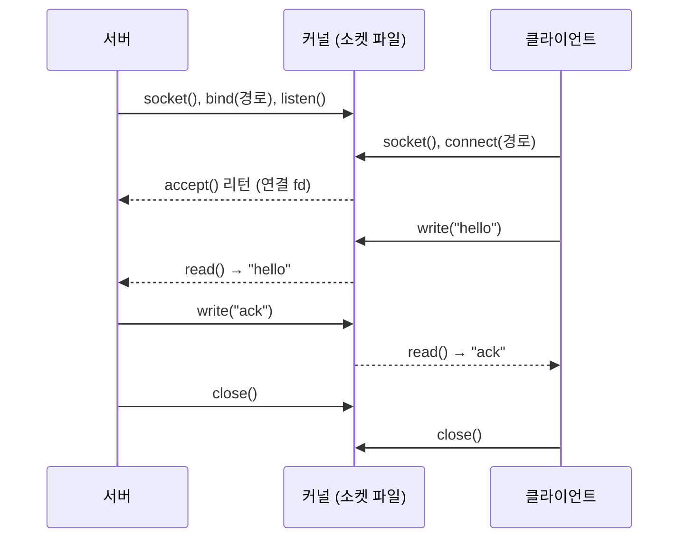
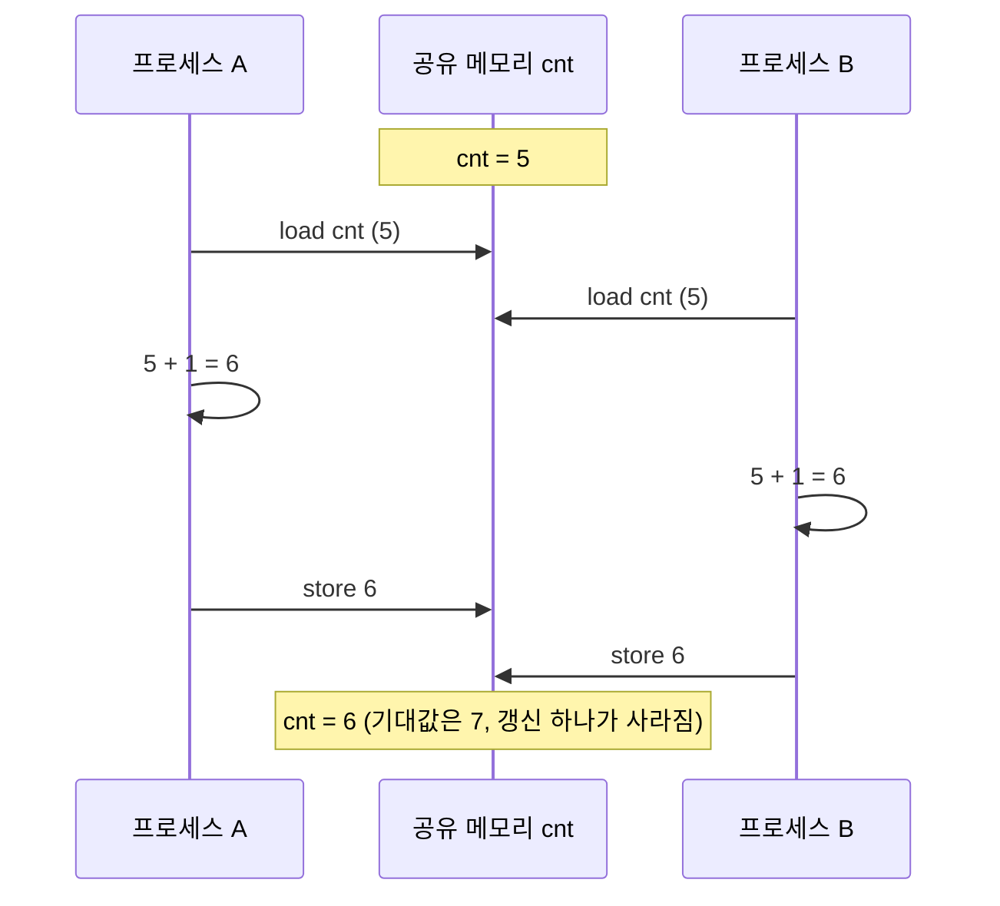
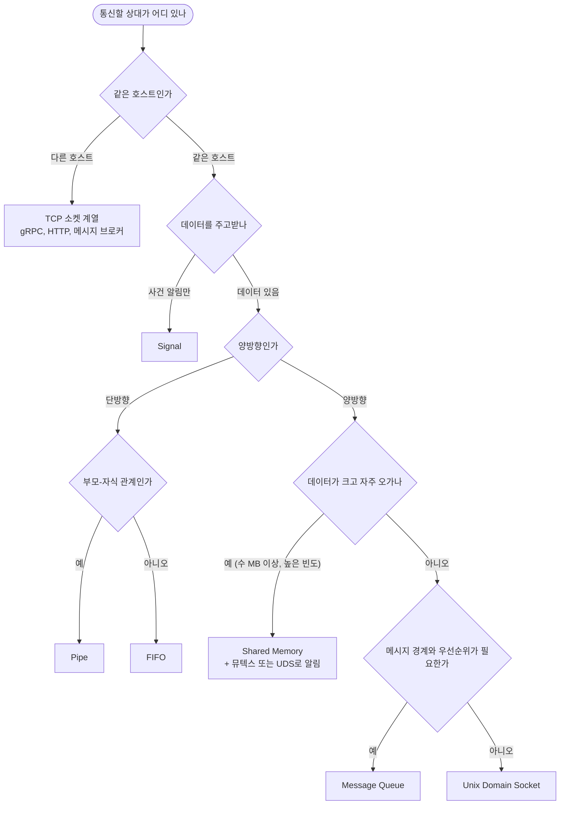
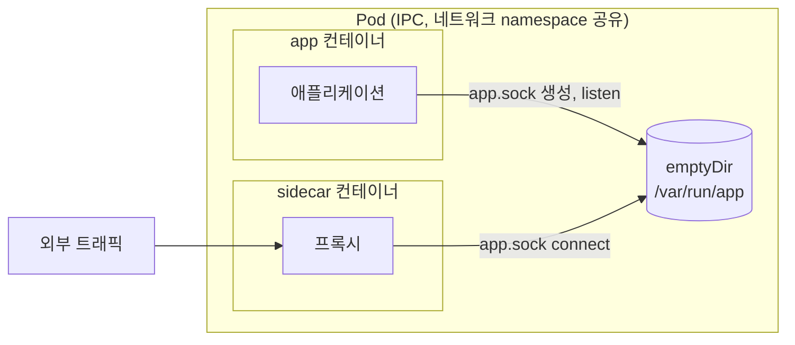

# 프로세스 간 통신 (IPC)

IPC(Inter-Process Communication)는 서로 다른 프로세스가 데이터를 주고받는 방법이다. 프로세스는 각자 가상 주소 공간을 따로 갖기 때문에 포인터를 넘겨도 상대 프로세스에서는 아무 의미가 없다. 데이터를 건네려면 커널이 만든 통로를 거치거나, 커널이 두 프로세스의 주소 공간에 같은 물리 페이지를 매핑해 줘야 한다.

리눅스에서 실무로 만나는 방식은 여섯 가지다. 같은 호스트 안에서만 동작한다는 점이 공통이고, 호스트를 넘는 통신은 마지막 절에서 다룬다.

| 방식 | 데이터 모양 | 방향 | 상대를 찾는 방법 | 데이터 경로 |
|------|------------|------|-----------------|------------|
| Pipe | 바이트 스트림 | 단방향 | `fork()`로 fd 상속 | 커널 버퍼 경유 |
| Named Pipe (FIFO) | 바이트 스트림 | 단방향 | 파일 시스템 경로 | 커널 버퍼 경유 |
| Unix Domain Socket | 스트림 또는 데이터그램 | 양방향 | 파일 시스템 경로 | 커널 버퍼 경유 |
| Message Queue | 메시지(경계 보존) | 양방향 | 이름 (`/name`) 또는 key | 커널 큐 경유 |
| Shared Memory | 메모리 그 자체 | 양방향 | 이름 또는 key | 공유 페이지 직접 접근 |
| Signal | 시그널 번호 하나 | 단방향 | PID | 데이터 없음 |

---

## 데이터가 지나가는 길

IPC 방식을 가르는 가장 큰 기준은 데이터가 커널 안팎으로 몇 번 복사되느냐다. Pipe, FIFO, Unix Domain Socket, Message Queue는 모두 커널이 가진 버퍼를 한 번 거친다. 송신 측 `write()`가 유저 버퍼를 커널 버퍼로 복사하고, 수신 측 `read()`가 커널 버퍼를 유저 버퍼로 다시 복사한다. 복사 2회다.



세 방식 모두 복사 횟수는 같고, 차이는 커널 버퍼의 성격에 있다. Pipe는 바이트가 흘러가는 링 버퍼라 메시지 경계가 없다. Unix Domain Socket은 `SOCK_DGRAM`이나 `SOCK_SEQPACKET`이면 경계가 보존된다. Message Queue는 항상 메시지 단위고 우선순위를 줄 수 있다.

Shared Memory는 구조가 다르다. 커널은 `mmap()` 시점에 한 번 개입해서 같은 물리 페이지를 두 프로세스의 가상 주소에 연결해 주고, 그 뒤로는 데이터 경로에 끼지 않는다.



A가 쓴 바이트를 B가 바로 읽는다. 시스템 콜도 복사도 없다. 대신 커널이 순서를 보장해 주지 않는다. B가 언제 읽어야 하는지 알려주는 장치가 없으므로 동기화는 전부 애플리케이션 몫이다.

복사 0회라는 말에는 조건이 붙는다. 보낼 데이터가 이미 다른 버퍼에 있다면 그걸 공유 메모리로 `memcpy()` 하는 순간 복사가 1회 생긴다. 처음부터 공유 메모리 위에서 데이터를 만들어야 진짜 0회다. 작은 메시지를 주고받는 용도라면 `memcpy()` 한 번과 세마포어 두 번이 Unix Domain Socket보다 이득이 없는 경우가 많다.

Signal은 데이터 경로가 없다. 커널이 대상 프로세스의 pending 시그널 비트를 세우고, 대상이 스케줄될 때 핸들러를 실행한다. 전달되는 정보는 시그널 번호가 전부다.

---

## Pipe

`pipe()`는 fd 두 개를 만든다. `fd[0]`은 읽기, `fd[1]`은 쓰기 끝이다. `fork()`가 fd 테이블을 복제하므로 부모-자식이 같은 파이프 양 끝을 갖게 되고, 각자 안 쓰는 쪽을 닫아서 단방향 통로로 쓴다. 쉘의 `ls | grep md`가 이 구조다.

```c
#include <stdio.h>
#include <unistd.h>
#include <string.h>

int main(void)
{
    int fd[2];
    char buf[128];

    if (pipe(fd) == -1) { perror("pipe"); return 1; }

    pid_t pid = fork();
    if (pid == 0) {
        close(fd[1]);                       /* 자식은 쓰기 끝을 닫는다 */
        ssize_t n = read(fd[0], buf, sizeof(buf) - 1);
        buf[n] = '\0';
        printf("child received: %s\n", buf);
        close(fd[0]);
    } else {
        close(fd[0]);                       /* 부모는 읽기 끝을 닫는다 */
        const char *msg = "hello from parent";
        write(fd[1], msg, strlen(msg));
        close(fd[1]);
    }
    return 0;
}
```

Python에서는 `os.pipe()`가 위 코드와 1:1로 대응한다. `multiprocessing.Pipe()`는 그 위에 pickle 직렬화를 얹은 것이라 `send()`로 객체를 그대로 넘길 수 있지만, 바이트 단위로 제어할 일이 있으면 `os.pipe()`를 쓴다.

닫는 순서가 코드의 절반이다. 쓰기 끝이 프로세스 어디에도 열려 있지 않아야 `read()`가 0(EOF)을 리턴한다. 부모가 `fd[1]`을 안 닫고 자식을 `wait()`하면, 자식은 EOF를 기다리며 영원히 `read()`에 머물고 부모는 자식 종료를 기다리는 교착이 생긴다. 쉘 스크립트에서 `exec 3>&-`를 빼먹었을 때도 같은 일이 난다.

### 버퍼가 가득 찼을 때와 읽는 쪽이 사라졌을 때

pipe 버퍼 기본 용량은 65,536바이트(16페이지)다. `fcntl(fd, F_GETPIPE_SZ)`로 확인하고 `F_SETPIPE_SZ`로 바꾼다. `/proc/sys/fs/pipe-max-size`는 현재 버퍼 크기가 아니라 권한 없는 프로세스가 올릴 수 있는 상한이고, 확인한 환경에서는 1,048,576이었다.

논블로킹으로 1KB씩 계속 쓰면 정확히 65,536바이트에서 `EAGAIN`이 나온다. 블로킹 모드에서는 이 시점에 `write()`가 잠든다. 읽는 쪽이 느리거나 멈춘 순간 쓰는 쪽도 같이 멈춘다는 뜻이고, 쓰는 쪽이 요청을 받는 스레드라면 장애로 번진다.



읽기 끝이 전부 닫힌 뒤의 `write()`는 SIGPIPE를 받는다. 기본 동작이 프로세스 종료라서 시그널 핸들러를 안 건 프로그램은 에러 메시지도 없이 죽는다. 종료 코드가 141(128+13)이면 이 경우다. 서버 프로세스는 `signal(SIGPIPE, SIG_IGN)`으로 무시하고 `write()`의 `EPIPE` 리턴으로 처리해야 한다. 소켓에 쓸 때도 똑같이 걸리므로(`send()`에 `MSG_NOSIGNAL`을 주는 방법도 있다) 이 처리는 IPC 밖에서도 필요하다.

쓰기 크기가 `PIPE_BUF`(리눅스에서 4,096바이트) 이하면 원자적이다. 여러 프로세스가 같은 파이프에 쓸 때 이 크기 이하의 write끼리는 섞이지 않는다. 그보다 크면 중간에 다른 프로세스의 데이터가 끼어들 수 있으므로, 쓰는 프로세스가 여럿이면 메시지를 4KB 이하로 자르거나 파이프를 나눠야 한다.

---

## Named Pipe (FIFO)

일반 pipe는 fd를 상속해야 해서 부모-자식 관계에서만 쓴다. FIFO는 `mkfifo()`로 파일 시스템에 이름을 만들고, 아무 프로세스나 그 경로를 `open()`해서 같은 파이프에 붙는다. 데이터는 디스크에 쓰이지 않고 커널 pipe 버퍼를 지나간다. 동작은 일반 pipe와 같고, 버퍼 용량, SIGPIPE, `PIPE_BUF` 규칙도 전부 그대로다.

```python
import os
import threading

FIFO_PATH = "/tmp/my_fifo"

def writer():
    with open(FIFO_PATH, "w") as f:    # reader가 열 때까지 여기서 블록된다
        f.write("data from writer")

if __name__ == "__main__":
    if os.path.exists(FIFO_PATH):
        os.unlink(FIFO_PATH)
    os.mkfifo(FIFO_PATH)

    t = threading.Thread(target=writer)
    t.start()

    with open(FIFO_PATH, "r") as f:
        print(f"reader got: {f.read()}")

    t.join()
    os.unlink(FIFO_PATH)
```

### open()이 상대를 기다린다

FIFO에서 처음 막히는 곳은 `read()`나 `write()`가 아니라 `open()`이다. 블로킹 모드로 한쪽만 열면 `open()` 자체가 상대가 열 때까지 리턴하지 않는다. `mkfifo`로 만든 파일에 `echo hello > /tmp/f`를 했는데 쉘이 멈춘 것처럼 보이면 이 경우다. 실제로 쓰기 쪽 `open()`이 1.5초가 지나도 리턴하지 않다가 읽기 쪽이 열자마자 풀리는 것을 확인했다.

| 여는 쪽 | 플래그 | 상대가 없을 때 |
|---------|--------|---------------|
| 읽기 | `O_RDONLY` | 쓰는 쪽이 열 때까지 블록 |
| 쓰기 | `O_WRONLY` | 읽는 쪽이 열 때까지 블록 |
| 읽기 | `O_RDONLY` + `O_NONBLOCK` | 바로 리턴. 이후 `read()`는 0 또는 `EAGAIN` |
| 쓰기 | `O_WRONLY` + `O_NONBLOCK` | `ENXIO`로 실패 (읽는 쪽이 있어야 성공) |
| 읽기+쓰기 | `O_RDWR` | 바로 리턴. 리눅스에서는 되지만 POSIX 규격은 동작을 정의하지 않는다 |

데몬이 FIFO로 명령을 받는 구조라면 `O_RDONLY | O_NONBLOCK`으로 열고 `poll()`로 기다리는 방식이 흔하다. 쓰는 쪽이 전부 닫으면 읽기 쪽은 EOF를 받는데, 이 상태에서 `poll()`이 계속 `POLLHUP`을 돌려줘 CPU를 태우는 경우가 있다. 그럴 때 읽기 쪽이 같은 FIFO를 `O_WRONLY`로 하나 더 열어 두면 쓰는 쪽이 항상 하나는 있는 상태가 되어 EOF가 오지 않는다.

비정상 종료한 뒤에는 FIFO 파일이 남는다. 시작할 때 `unlink()` 후 `mkfifo()`를 다시 호출하는 편이 안전하다. 반대로 이미 다른 프로세스가 쓰고 있는 FIFO를 지워 버릴 수 있으니, 경로를 프로세스마다 분리하거나 PID 파일로 중복 실행을 막아 둔다.

---

## Unix Domain Socket

TCP/UDP 소켓과 같은 API(`socket`, `bind`, `listen`, `accept`, `connect`)를 쓰지만 `AF_UNIX`는 네트워크 스택을 타지 않는다. IP 헤더, 체크섬, 라우팅, 혼잡 제어가 없고, 커널 안에서 송신 소켓의 데이터가 수신 소켓 큐로 넘어간다. 양방향이고 `SOCK_STREAM`, `SOCK_DGRAM`, `SOCK_SEQPACKET`을 지원한다.

nginx와 PHP-FPM, 애플리케이션과 PostgreSQL, 호스트와 Docker 데몬(`/var/run/docker.sock`)이 이 방식으로 붙는다. 같은 호스트에서 TCP `localhost`로 붙던 것을 UDS로 바꾸는 일이 흔한 이유는 두 가지다. 연결 비용이 줄고, 소켓 파일 권한으로 접근 제어가 된다.



```python
import os
import socket
import time
from multiprocessing import Process

SOCK_PATH = "/tmp/my_uds.sock"

def server():
    if os.path.exists(SOCK_PATH):
        os.unlink(SOCK_PATH)            # 남은 소켓 파일이 있으면 bind가 EADDRINUSE
    sock = socket.socket(socket.AF_UNIX, socket.SOCK_STREAM)
    sock.bind(SOCK_PATH)
    os.chmod(SOCK_PATH, 0o660)          # 접속할 수 있는 유저를 파일 권한으로 제한
    sock.listen(1)

    conn, _ = sock.accept()
    print(f"server received: {conn.recv(256).decode()}")
    conn.send(b"ack")
    conn.close()
    sock.close()
    os.unlink(SOCK_PATH)

def client():
    time.sleep(0.3)                     # 예제용. 실제로는 connect 재시도로 처리한다
    sock = socket.socket(socket.AF_UNIX, socket.SOCK_STREAM)
    sock.connect(SOCK_PATH)
    sock.send(b"hello from client")
    print(f"client received: {sock.recv(256).decode()}")
    sock.close()

if __name__ == "__main__":
    s, c = Process(target=server), Process(target=client)
    s.start(); c.start()
    s.join(); c.join()
```

C로 쓸 때는 `sockaddr_un.sun_path`가 108바이트(리눅스)라는 점을 신경 써야 한다. 경로가 길면 `strncpy`가 조용히 잘라서 엉뚱한 경로에 `bind()`하거나 `ENAMETOOLONG`이 난다. 컨테이너에서 마운트 경로가 깊어질 때 의외로 걸린다.

`bind()`가 만든 소켓 파일은 프로세스가 죽어도 남는다. 다음 기동 때 `EADDRINUSE`가 나므로 서버 시작 시 `unlink()` 하는 게 관례다. 리눅스에는 파일 없이 `\0`으로 시작하는 abstract namespace 소켓(`sun_path[0] == '\0'`)도 있다. 정리할 파일이 없고 파일 권한도 적용되지 않는다. 같은 네트워크 namespace를 공유하는 모든 프로세스가 접근할 수 있어서 권한 분리가 필요한 곳에는 못 쓴다.

UDS만 가능한 기능으로 fd 전달(`SCM_RIGHTS`)과 상대 프로세스 자격 확인(`SO_PEERCRED`)이 있다. nginx 같은 프로세스 매니저가 열린 소켓을 워커에 넘기거나, 데몬이 접속한 쪽의 uid를 검증하는 데 쓴다. TCP로는 못 한다.

---

## Shared Memory

두 프로세스가 같은 물리 페이지를 각자의 주소 공간에 매핑한다. 앞의 도식대로 매핑 이후에는 커널이 끼지 않는다. 만드는 방법은 세 가지다.

| API | 이름 | 공유 범위 | 비고 |
|-----|------|----------|------|
| `mmap`, `MAP_SHARED` + `MAP_ANONYMOUS` | 없음 | `fork()` 관계만 | 가장 간단하다 |
| `shm_open()` + `mmap()` (POSIX) | `/name` (`/dev/shm/name`) | 아무 프로세스 | 현재 권장되는 방식 |
| `shmget()` + `shmat()` (System V) | key | 아무 프로세스 | 오래된 API. `ipcs -m`으로 보인다 |

익명 `mmap`은 이름이 없어서 `fork()`로 물려받은 프로세스끼리만 공유한다. 서로 무관한 프로세스(예: 별도로 기동된 워커)가 붙으려면 `shm_open()`이 필요하다. Python 3.8의 `multiprocessing.shared_memory.SharedMemory`도 내부에서 `shm_open()`을 쓴다.

### 동기화 없이 쓰면 데이터가 깨진다

공유 메모리는 읽고 쓰는 순서를 커널이 조정해 주지 않는다. 두 프로세스가 같은 카운터를 `cnt++`로 올리면 그 한 줄이 load, add, store 세 단계로 쪼개져 실행되고, 사이에 다른 프로세스가 끼면 한쪽 갱신이 사라진다.



실제로 두 프로세스가 각각 100만 번씩 `cnt++` 하는 프로그램을 돌렸더니, 기대값 2,000,000에 대해 1,084,090과 1,039,267이 나왔다(4코어 머신). 매번 값이 달라서 테스트에서는 통과하고 부하가 올라갔을 때만 깨지는 식으로 나타난다. 같은 구조를 `PTHREAD_PROCESS_SHARED` 뮤텍스로 감싸면 2,000,000이 정확히 나온다.

```c
#include <stdio.h>
#include <unistd.h>
#include <pthread.h>
#include <sys/mman.h>
#include <sys/wait.h>

#define N 1000000

struct shared {
    pthread_mutex_t lock;
    long cnt;
};

int main(void)
{
    struct shared *s = mmap(NULL, sizeof(*s), PROT_READ | PROT_WRITE,
                            MAP_SHARED | MAP_ANONYMOUS, -1, 0);

    pthread_mutexattr_t attr;
    pthread_mutexattr_init(&attr);
    pthread_mutexattr_setpshared(&attr, PTHREAD_PROCESS_SHARED);
    pthread_mutex_init(&s->lock, &attr);
    s->cnt = 0;

    for (int i = 0; i < 2; i++) {
        if (fork() == 0) {
            for (int j = 0; j < N; j++) {
                pthread_mutex_lock(&s->lock);
                s->cnt++;
                pthread_mutex_unlock(&s->lock);
            }
            _exit(0);
        }
    }
    wait(NULL);
    wait(NULL);
    printf("expected=%d actual=%ld\n", 2 * N, s->cnt);   /* 2000000 */
    return 0;
}
```

뮤텍스 자체가 공유 메모리 안에 있어야 한다. 프로세스마다 자기 힙에 뮤텍스를 만들면 서로 다른 락이라 아무것도 막지 못한다. 컴파일은 `gcc -O1 race.c -lpthread`다. 락을 잡은 프로세스가 죽으면 뮤텍스가 영원히 잠긴 채로 남는 문제가 있어서, 장시간 도는 서비스는 `PTHREAD_MUTEX_ROBUST`를 설정하고 `EOWNERDEAD`를 처리해야 한다. 세마포어와 뮤텍스 내부 동작은 [동기화 프리미티브 심화](Synchronization.md), 경쟁 상태 일반은 [레이스 컨디션](레이스_컨디션.md)에 정리했다.

락 없이 쓰는 방법도 있다. 한 프로세스만 쓰고 다른 프로세스는 읽기만 하는 single-producer single-consumer 링 버퍼는 head, tail 인덱스를 atomic으로만 갱신하면 락이 필요 없다. 다만 메모리 순서(acquire/release)를 잘못 잡으면 가끔만 깨지는 버그가 되므로, 직접 짜기보다 검증된 구현을 가져다 쓰는 쪽이 낫다.

### 정리되지 않는 자원

System V 공유 메모리(`shmget`)는 `shmctl(IPC_RMID)`를 호출하지 않으면 프로세스가 전부 죽어도 커널에 남는다. `ipcs -m`에서 `nattch`가 0인 세그먼트가 쌓여 있으면 그 경우고, `ipcrm -m <shmid>`로 지운다. POSIX 방식은 `/dev/shm/` 아래에 파일로 남으므로 `shm_unlink()`가 짝이다. Python의 `SharedMemory`는 `close()`와 `unlink()`를 둘 다 불러야 하고, 비정상 종료 시에는 `resource_tracker`가 경고를 찍으며 정리하려 든다. 여러 프로세스가 같은 이름을 붙을 때 이 경고가 오히려 멀쩡한 세그먼트를 지우는 문제가 알려져 있다.

---

## Message Queue

메시지 단위로 주고받고, 경계가 보존되며, 우선순위가 있다. 읽는 쪽이 `read()`로 바이트를 잘라 파싱하는 대신 `mq_receive()` 한 번에 메시지 하나를 받는다. POSIX(`mq_open`)와 System V(`msgget`)가 있다. POSIX 쪽 API가 정리되어 있고 `/dev/mqueue`로 파일처럼 들여다볼 수 있다.

```c
#include <stdio.h>
#include <string.h>
#include <fcntl.h>
#include <mqueue.h>
#include <unistd.h>
#include <sys/wait.h>

#define QUEUE_NAME "/test_queue"
#define MSG_SIZE   256

int main(void)
{
    struct mq_attr attr = { .mq_flags = 0, .mq_maxmsg = 10,
                            .mq_msgsize = MSG_SIZE, .mq_curmsgs = 0 };

    mq_unlink(QUEUE_NAME);
    mqd_t mq = mq_open(QUEUE_NAME, O_CREAT | O_RDWR, 0600, &attr);
    if (mq == (mqd_t)-1) { perror("mq_open"); return 1; }

    if (fork() == 0) {
        char buf[MSG_SIZE + 1];             /* 수신 버퍼는 mq_msgsize 이상이어야 한다 */
        unsigned int prio;
        ssize_t n = mq_receive(mq, buf, sizeof(buf) - 1, &prio);
        if (n >= 0) {
            buf[n] = '\0';
            printf("received (prio=%u): %s\n", prio, buf);
        }
        mq_close(mq);
        fflush(stdout);                     /* _exit()은 stdio 버퍼를 비우지 않는다 */
        _exit(0);
    }

    const char *msg = "message queue data";
    mq_send(mq, msg, strlen(msg), 1);       /* 우선순위 1 */
    wait(NULL);
    mq_close(mq);
    mq_unlink(QUEUE_NAME);
    return 0;
}
```

`gcc -o mq_demo mq_demo.c -lrt`로 컴파일한다. 큐를 부모가 먼저 만들고 자식이 상속받게 해서, 예전 예제처럼 `sleep(1)`로 순서를 맞출 필요가 없다. Python 표준 라이브러리에는 POSIX mq 바인딩이 없고, `multiprocessing.Queue`는 이름과 달리 pipe와 스레드로 만든 별개 구현이다. 커널 큐가 필요하면 `posix_ipc`나 `sysv_ipc` 같은 서드파티를 쓴다.

세 가지가 자주 문제 된다.

**수신 버퍼가 작으면 `mq_receive()`가 `EMSGSIZE`로 실패한다.** 버퍼는 메시지 크기가 아니라 큐의 `mq_msgsize` 이상이어야 한다. 위 코드가 `MSG_SIZE + 1`로 잡는 이유다.

**큐 속성에 시스템 한도가 있다.** `/proc/sys/fs/mqueue/msgsize_max` 기본값이 8,192바이트, `msg_max` 기본값이 10이다(확인한 환경 기준). 넘는 값으로 `mq_open()`하면 일반 유저는 `EINVAL`을 받는다. 큰 페이로드는 공유 메모리에 두고 큐에는 오프셋만 보내는 구성이 일반적이다. 컨테이너에서는 큐가 IPC namespace 단위라 `--ipc` 설정에 따라 다른 컨테이너에서 안 보인다.

**큐가 가득 차면 `mq_send()`가 블록된다.** `O_NONBLOCK`이면 `EAGAIN`이고, `mq_timedsend()`로 시간 제한을 걸 수 있다. 이 동작은 pipe와 같아서 소비자가 멈추면 생산자도 멈춘다.

종료 후 `/dev/mqueue/`에 큐 파일이 남는 점은 공유 메모리와 같다. 호스트를 넘는 큐가 필요하면 OS 큐를 늘리지 말고 [메시지 큐 & 이벤트 기반 아키텍처](../../Backend/Messaging/Message_Queue.md)에서 다루는 브로커로 간다.

---

## Signal

시그널은 데이터가 아니라 사건을 알린다. 프로세스 입장에서는 실행 흐름 어느 지점에서든 핸들러로 끼어들 수 있는 비동기 이벤트다.

| 시그널 | 번호 (x86) | 기본 동작 | 용도 |
|--------|-----------|----------|------|
| `SIGHUP` | 1 | 종료 | 설정 리로드 관례 |
| `SIGINT` | 2 | 종료 | Ctrl+C |
| `SIGKILL` | 9 | 종료 (잡거나 막을 수 없음) | 강제 종료 |
| `SIGUSR1` | 10 | 종료 | 사용자 정의 |
| `SIGPIPE` | 13 | 종료 | 읽는 쪽 없는 pipe/소켓에 write |
| `SIGTERM` | 15 | 종료 | 정상 종료 요청 |
| `SIGCHLD` | 17 | 무시 | 자식 종료 알림 |
| `SIGCONT` | 18 | 재개 | 정지된 프로세스 재개 |
| `SIGSTOP` | 19 | 정지 (잡거나 막을 수 없음) | 일시 정지 |

```c
#include <stdio.h>
#include <signal.h>
#include <unistd.h>
#include <sys/wait.h>

static volatile sig_atomic_t got_signal = 0;

static void handler(int sig) { got_signal = 1; }

int main(void)
{
    pid_t pid = fork();

    if (pid == 0) {
        struct sigaction sa = { .sa_handler = handler };
        sigemptyset(&sa.sa_mask);
        sigaction(SIGUSR1, &sa, NULL);

        /* pause() 앞에서 시그널이 오면 영원히 잔다. 실제 코드는 sigsuspend()나 signalfd를 쓴다 */
        while (!got_signal)
            pause();
        printf("child got SIGUSR1\n");
    } else {
        sleep(1);
        kill(pid, SIGUSR1);
        wait(NULL);
    }
    return 0;
}
```

주석에 적은 것처럼 `while (!got_signal) pause();`에는 틈이 있다. 플래그를 확인한 직후, `pause()`에 들어가기 직전에 시그널이 도착하면 핸들러는 이미 끝났고 `pause()`는 다음 시그널을 하염없이 기다린다. 시그널을 블록해 둔 채 `sigsuspend()`로 원자적으로 푸는 것이 정석이다. 위 예제는 부모가 1초를 기다려서 우연히 안전할 뿐이다.

**핸들러 안에서는 async-signal-safe 함수만 호출할 수 있다.** `printf()`, `malloc()`, 뮤텍스 잠금은 안 된다. 메인 코드가 `malloc()` 내부 락을 쥔 채 시그널을 받고, 핸들러가 다시 `malloc()`을 부르면 같은 스레드가 자기 락을 기다리며 멈춘다. 핸들러에서는 `sig_atomic_t` 플래그를 세우거나 `write()`로 self-pipe에 1바이트를 쓰고, 처리는 메인 루프에서 한다. 리눅스에서는 `signalfd()`로 시그널을 fd로 받아 `epoll`에 올리는 방법도 있다.

**표준 시그널은 큐에 쌓이지 않는다.** 처리 전에 같은 시그널이 3번 오면 pending 비트가 하나라서 1번만 전달된다. `SIGCHLD`로 자식 종료를 세는 코드가 좀비를 남기는 원인이 이것이다. 핸들러에서 `waitpid(-1, NULL, WNOHANG)`를 리턴이 0 또는 -1이 될 때까지 반복해야 한다. 개수가 중요하면 `sigqueue()`와 실시간 시그널(`SIGRTMIN` ~ `SIGRTMAX`)을 쓴다.

**`signal()` 대신 `sigaction()`을 쓴다.** `signal()`은 구현마다 핸들러가 한 번 실행된 뒤 기본 동작으로 돌아가는지 여부가 다르다.

Python에서는 `signal.signal()`을 메인 스레드에서만 호출할 수 있고(다른 스레드는 `ValueError`), 핸들러는 C 핸들러가 플래그를 세운 뒤 인터프리터가 바이트코드 경계에서 실행한다. 그래서 C 확장이 오래 도는 중에는 `SIGTERM` 핸들러가 늦게 실행된다. 컨테이너에서 `docker stop` 후 10초(기본값)를 채우고 `SIGKILL`로 끝나는 서비스를 보면 PID 1이 `SIGTERM`을 못 받은 경우가 많다. PID 1은 핸들러를 등록하지 않은 시그널을 커널이 무시하기 때문이다.

---

## 어떤 방식을 고를까

선택 기준은 세 가지다. 통신 상대가 같은 호스트에 있는가, 방향이 단방향인가 양방향인가, 데이터가 얼마나 큰가.



도식에서 막히는 지점은 대개 마지막 두 갈래다. 확신이 없으면 Unix Domain Socket으로 시작한다. 양방향이고, `poll`/`epoll`에 그대로 올라가고, 나중에 TCP로 바꿔도 코드 구조가 거의 같다. Pipe와 FIFO는 쉘 파이프라인이나 로그 전달처럼 단방향 바이트 스트림이 자연스러울 때 쓴다.

| 항목 | Pipe / FIFO | Unix Domain Socket | Message Queue | Shared Memory | Signal |
|------|-------------|-------------------|---------------|---------------|--------|
| 방향 | 단방향 | 양방향 | 양방향 | 양방향 | 단방향 |
| 커널 복사 | 2회 | 2회 | 2회 | 0회 | 해당 없음 |
| 메시지 경계 | 없음 | DGRAM/SEQPACKET만 | 있음 | 직접 정의 | 해당 없음 |
| 동기화 | 커널이 블로킹으로 처리 | 커널이 처리 | 커널이 처리 | 직접 구현 | 해당 없음 |
| `epoll` 사용 | 가능 | 가능 | 가능 (POSIX mq는 fd) | 불가 (별도 알림 필요) | `signalfd`로 가능 |
| 연결 상태 감지 | EOF, SIGPIPE | EOF, `ECONNRESET` | 없음 (큐는 상대와 무관) | 없음 | 해당 없음 |
| 다중 클라이언트 | 쓰기 여럿은 `PIPE_BUF` 제약 | `accept`로 연결마다 분리 | 큐 하나에 여럿 | 직접 설계 | 해당 없음 |
| 정리 | 자동 (FIFO는 `unlink`) | 소켓 파일 `unlink` | `mq_unlink` | `shm_unlink`, `IPC_RMID` | 해당 없음 |

공유 메모리가 `epoll`에 안 올라간다는 점이 실무에서 자주 걸린다. 새 데이터가 들어왔다는 사실을 상대에게 알리려면 별도 수단이 필요해서, 데이터는 공유 메모리로 보내고 "N번 슬롯 준비됨"은 UDS나 eventfd로 알리는 구성이 흔하다. 이 구성은 대용량 영상 프레임이나 센서 데이터를 처리하는 파이프라인에서 쓴다.

---

## 컨테이너에서 달라지는 것

컨테이너는 IPC namespace가 따로 있어서, 같은 호스트의 컨테이너끼리도 `shmget()`, POSIX 공유 메모리, POSIX mq가 기본으로는 서로 보이지 않는다. 파일 시스템 기반 방식(FIFO, UDS)은 같은 경로를 볼 수 있는 볼륨이 있어야 동작한다.



### /dev/shm 기본 64MB

Docker는 컨테이너마다 `/dev/shm`에 tmpfs를 따로 마운트하고, 크기 기본값이 64MB다. `--shm-size`로 바꾼다. Kubernetes에는 이 옵션이 없어서 `emptyDir`를 메모리 매체로 만들어 `/dev/shm`에 마운트해 크기를 키운다.

```yaml
spec:
  containers:
    - name: worker
      volumeMounts:
        - name: dshm
          mountPath: /dev/shm
  volumes:
    - name: dshm
      emptyDir:
        medium: Memory
        sizeLimit: 2Gi
```

크기를 넘기면 에러가 `ENOSPC`로 깔끔하게 오지 않는 경우가 문제다. `ftruncate()`로 세그먼트 크기를 잡는 것은 tmpfs에서 성공하고 실제 페이지는 쓰는 시점에 할당되므로, 한도를 넘는 첫 접근에서 프로세스가 SIGBUS(Bus error)로 죽는다. 1MB tmpfs에 8MB 세그먼트를 `ftruncate()` + `mmap()` 하고 `memset()` 하면 `ftruncate`와 `mmap`은 성공하고 `memset` 도중 Bus error로 죽는 것을 확인했다. PyTorch `DataLoader`에서 `num_workers`를 올렸을 때 컨테이너에서만 "Bus error" 또는 "unable to write to file </torch_...>"가 뜨는 것이 이 경우다. 로그에 용량 부족이라는 말이 없어서 원인을 찾는 데 시간이 걸린다.

`medium: Memory`로 만든 `emptyDir`는 사용량이 컨테이너의 메모리 limit에 합산된다. `sizeLimit`을 limit보다 크게 잡아 두면 한도에 닿기 전에 OOM kill이 먼저 온다.

### sidecar와 UDS를 emptyDir로 공유

같은 Pod 안의 컨테이너는 네트워크 namespace를 공유해서 `localhost` TCP로도 붙을 수 있다. 그런데도 UDS를 쓰는 이유는 접근 제어와 포트 충돌 회피다. `emptyDir`에 소켓 파일을 두고 두 컨테이너가 같은 볼륨을 마운트하면 된다. Envoy와 앱, 로그 수집기와 앱, 인증 프록시와 앱 구성에서 쓴다.

주의할 점이 세 가지 있다.

앱 컨테이너만 재시작되면 `emptyDir`는 Pod 수명에 묶여 있어서 소켓 파일이 그대로 남는다. 새로 뜬 프로세스의 `bind()`가 `EADDRINUSE`로 실패해 CrashLoopBackOff에 빠진다. 서버 시작 시 `unlink()`를 먼저 하는 코드가 컨테이너에서는 필수다.

컨테이너마다 실행 uid가 다르면 소켓 파일 권한 때문에 `connect()`가 `EACCES`로 실패한다. `securityContext.fsGroup`을 맞추고 서버가 소켓에 `chmod 660`을 걸게 한다.

기동 순서는 보장되지 않는다. sidecar가 먼저 떠서 `connect()` 했는데 소켓 파일이 없으면 `ENOENT`가 나므로 재시도가 있어야 한다.

### IPC namespace 공유 옵션

Docker는 `--ipc=shareable`로 만든 컨테이너를 다른 컨테이너가 `--ipc=container:<name>`으로 참조하면 System V IPC와 POSIX 공유 메모리, mq를 함께 쓴다. `--ipc=host`는 호스트의 IPC를 그대로 노출해서 격리가 사라지므로 특별한 이유 없이는 쓰지 않는다. Kubernetes Pod 안의 컨테이너는 IPC namespace를 기본으로 공유한다. 다만 `/dev/shm` 마운트가 컨테이너 런타임마다 다르게 구성될 수 있어, `shm_open()`으로 Pod 내부 컨테이너끼리 붙을 계획이라면 위의 `emptyDir` 마운트를 양쪽에 명시해서 확인해야 한다.

---

## 호스트를 넘으면

OS IPC는 전부 한 커널 안에서만 성립한다. 서비스가 둘 이상의 호스트로 나뉘면 같은 역할을 네트워크 도구가 맡는다.

| 같은 호스트 | 호스트를 넘을 때 | 문서 |
|------------|-----------------|------|
| Unix Domain Socket | TCP 소켓 위의 RPC (gRPC) | [gRPC](../../Network/7%20Layer/Transport%20Layer/TCP/RPC/gRPC.md) |
| Message Queue | 메시지 브로커 (Kafka, RabbitMQ) | [메시지 큐 & 이벤트 기반 아키텍처](../../Backend/Messaging/Message_Queue.md) |
| Shared Memory | 공유 캐시 (Redis) | - |

대응이 정확하지는 않다. 커널 큐는 소비자가 죽어도 메시지가 큐에 남지만 소켓 연결은 끊기면 그만이고, 브로커는 디스크 영속성과 재전송이 붙는다. 반대로 네트워크를 건너는 순간 부분 실패(응답 유실, 타임아웃, 중복 전달)가 생긴다. 같은 호스트에서 `write()`가 리턴했는데 상대가 못 받는 상황은 상대가 죽었을 때뿐이지만, 네트워크에서는 연결이 멀쩡해 보여도 일어난다.

---

## 참고

- [Linux man-pages: pipe(7)](https://man7.org/linux/man-pages/man7/pipe.7.html)
- [Linux man-pages: unix(7)](https://man7.org/linux/man-pages/man7/unix.7.html)
- [Linux man-pages: mq_overview(7)](https://man7.org/linux/man-pages/man7/mq_overview.7.html)
- [Linux man-pages: shm_overview(7)](https://man7.org/linux/man-pages/man7/shm_overview.7.html)
- [Linux man-pages: signal-safety(7)](https://man7.org/linux/man-pages/man7/signal-safety.7.html)
- [Linux man-pages: svipc(7)](https://man7.org/linux/man-pages/man7/svipc.7.html)
