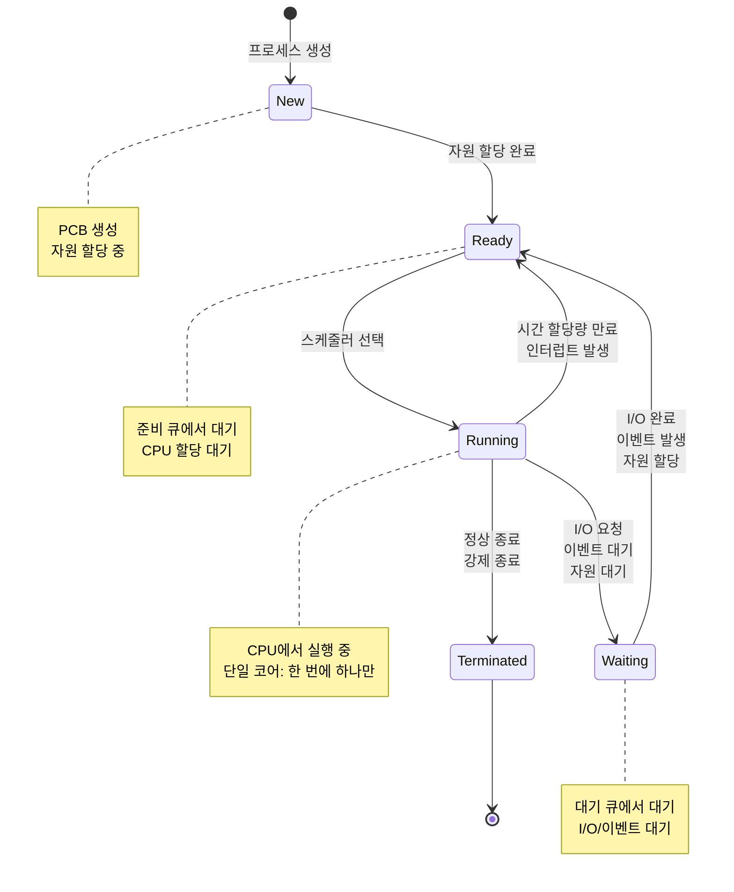
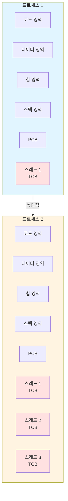

## 개요

운영체제에서 프로세스와 스레드는 프로그램 실행의 기본 개념이다. 프로그램, 프로세스, 스레드의 정의와 특징, 그리고 이들 간의 관계를 다룬다.

**실무 팁:**
프로세스는 독립적인 메모리 공간을 가진다. 스레드는 프로세스보다 가볍고 빠르며, 같은 프로세스 내의 스레드들은 메모리 공간을 공유한다.

    

---

## 프로그램 (Program)

### 프로그램의 정의

프로그램은 실행 가능한 명령어들의 집합으로, 디스크에 저장된 정적인(static) 파일입니다.

**프로그램의 특징:**
- 소스 코드가 컴파일되어 생성된 실행 파일(exe, bin 등)
- 실행되기 전까지는 단순히 디스크에 저장된 데이터에 불과
- 운영체제가 이해할 수 있는 형태의 기계어 명령어로 변환됨

**프로그램 생성 과정:**

프로그램은 컴파일러나 인터프리터에 의해 생성됩니다.

이 과정에서 소스 코드의 논리적 구조가 물리적 메모리 레이아웃으로 매핑되며, 실행 시 필요한 모든 정보가 포함됩니다.

### 프로그램의 구성 요소

#### 1. 코드 영역 (Text/Code Segment)
코드 영역은 실행할 명령어들이 저장된 영역입니다.

이 영역은 읽기 전용(read-only)으로 설정되어 있으며, 프로그램 실행 중 변경되지 않습니다.

여러 프로세스가 같은 프로그램을 실행할 경우, 코드 영역은 메모리에 한 번만 로드되고 모든 프로세스가 공유할 수 있습니다(코드 공유).

코드 영역의 특징:
- **불변성**: 실행 중 변경되지 않는 읽기 전용 영역
- **공유 가능성**: 같은 프로그램의 여러 인스턴스가 코드를 공유
- **최적화**: 컴파일러 최적화가 적용된 최종 기계어 코드
- **재배치 가능**: 동적 링킹을 위한 재배치 정보 포함

#### 2. 데이터 영역 (Data Segment)
데이터 영역은 전역 변수, 정적 변수, 상수 등이 저장된 영역입니다. 이 영역은 다시 두 부분으로 나뉩니다:

- **초기화된 데이터 영역**: 초기값이 있는 전역/정적 변수
- **초기화되지 않은 데이터 영역(BSS)**: 초기값이 없는 전역/정적 변수 (0으로 초기화)

데이터 영역의 특징:
- **프로세스별 독립성**: 각 프로세스가 자신만의 데이터 영역을 가짐
- **전역 접근성**: 프로그램 전체에서 접근 가능
- **생명주기**: 프로그램 실행 시작부터 종료까지 유지

#### 3. 리소스 영역
리소스 영역은 프로그램이 사용하는 이미지, 사운드, 문자열 테이블 등의 리소스가 포함된 영역입니다. 이들은 보통 실행 파일에 임베드되거나 별도의 리소스 파일로 제공됩니다.

### 프로그램의 특징

#### 정적성 (Static Nature)
프로그램 자체는 실행되지 않는 상태의 코드와 데이터입니다. 디스크에 저장된 파일 형태로 존재하며, 실행되기 전까지는 메모리에 로드되지 않습니다. 이는 프로그램이 "무엇을 할 것인가"를 정의하는 설계도와 같은 역할을 합니다.

#### 재사용성 (Reusability)
하나의 프로그램으로 여러 프로세스를 생성할 수 있습니다. 예를 들어, 웹 브라우저 프로그램 하나로 여러 개의 브라우저 창(각각 별도의 프로세스)을 열 수 있습니다. 이는 코드 영역의 공유를 통해 메모리를 효율적으로 사용할 수 있게 합니다.

#### 저장성 (Persistence)
프로그램은 디스크에 영구적으로 저장되어 반복 실행 가능합니다. 컴파일된 실행 파일은 시스템이 재부팅되어도 유지되며, 필요할 때마다 실행할 수 있습니다.

### 프로그램의 실행 과정

프로그램이 실행되기까지의 과정은 다음과 같습니다:

1. **컴파일/빌드**: 소스 코드를 기계어로 변환하여 실행 파일 생성
2. **로딩**: 운영체제가 실행 파일을 메모리에 로드
3. **초기화**: 프로그램의 초기 데이터 설정 및 환경 구성
4. **실행 시작**: 프로그램의 진입점(entry point)부터 명령어 실행

이 과정에서 프로그램은 프로세스로 변환되며, 운영체제는 프로세스 제어 블록(PCB)을 생성하여 프로세스를 관리합니다.

---

## 프로세스 (Process)

### 프로세스의 정의

프로세스는 실행 중인 프로그램의 인스턴스(instance)를 말합니다. 프로그램이 디스크에 저장된 정적 파일이라면, 프로세스는 그 프로그램이 메모리에 로드되어 실행되는 동적 실체입니다.

프로세스는 운영체제가 관리하는 작업 단위이며, 각 프로세스는 독립된 메모리 공간과 시스템 자원을 할당받습니다. 프로세스는 프로그램의 코드뿐만 아니라 실행 상태, 메모리 상태, 열린 파일, 네트워크 연결 등 모든 실행 컨텍스트를 포함합니다.

### 프로세스 생성 과정

프로그램이 실행되면 운영체제는 다음 작업을 수행합니다:

1. **프로그램 코드를 메모리에 로드**: 실행 파일의 코드 영역을 메모리의 적절한 위치에 로드합니다. 이때 가상 메모리 시스템을 통해 논리적 주소를 물리적 주소로 매핑합니다.

2. **필요한 시스템 자원 할당**: CPU 시간, 메모리 공간, I/O 장치, 파일 디스크립터 등의 시스템 자원을 할당합니다. 각 프로세스는 고유한 자원 집합을 가지며, 다른 프로세스의 자원에 직접 접근할 수 없습니다.

3. **프로세스 제어 블록(PCB) 생성**: 프로세스의 모든 상태 정보를 저장하는 자료구조인 PCB를 생성합니다. PCB는 프로세스 스케줄링, 상태 관리, 자원 추적 등에 사용됩니다.

4. **실행 상태로 전환**: 프로세스를 준비(Ready) 상태로 만들고, 스케줄러가 CPU를 할당하면 실행(Running) 상태가 됩니다.

### 프로세스의 생명주기

프로세스는 생성부터 종료까지 여러 상태를 거치며, 이를 프로세스 상태 전이(State Transition)라고 합니다:

- **생성(New)**: 프로세스가 생성되는 초기 상태. PCB가 생성되고 필요한 자원이 할당되지만 아직 실행 준비가 완료되지 않은 상태입니다.

- **준비(Ready)**: CPU를 할당받기 위해 대기하는 상태. 모든 필요한 자원이 할당되었고, CPU만 할당받으면 즉시 실행할 수 있는 상태입니다. 준비 큐(Ready Queue)에서 대기합니다.

- **실행(Running)**: CPU를 할당받아 명령을 실행하는 상태. 한 순간에 하나의 프로세스만 실행 상태일 수 있습니다(단일 코어 시스템의 경우). 시간 할당량(Time Quantum)이 만료되거나 I/O 요청이 발생하면 다른 상태로 전이됩니다.

- **대기(Waiting/Blocked)**: I/O 작업 완료, 이벤트 발생, 자원 할당 등을 기다리는 상태. CPU를 할당받아도 실행할 수 없는 상태로, 대기 큐(Waiting Queue)에서 대기합니다. 조건이 만족되면 준비 상태로 돌아갑니다.

- **종료(Terminated)**: 프로세스가 정상적으로 종료되거나 강제 종료된 상태. 모든 자원이 해제되고 PCB가 정리됩니다. 부모 프로세스가 종료 상태를 확인할 수 있습니다.

### 프로세스의 주요 특징

#### 1. 독립성 (Isolation)
- **메모리 독립성**: 각 프로세스는 독립된 메모리 공간을 가짐
- **보안성**: 다른 프로세스의 메모리 공간에 직접 접근 불가
- **안정성**: 한 프로세스의 오류가 다른 프로세스에 직접적인 영향을 주지 않음
- **통신 방식**: 프로세스 간 통신은 IPC(Inter-Process Communication)를 통해 이루어짐

#### 2. 자원 할당 (Resource Allocation)
- **시스템 자원**: 운영체제로부터 CPU 시간, 메모리, I/O 장치 등을 할당받음
- **고유 식별자**: 각 프로세스는 고유한 PID(Process ID)를 가짐
- **자원 관리**: 프로세스는 필요한 시스템 자원을 요청하고 해제할 수 있음
- **스케줄링**: 자원 할당은 운영체제의 스케줄러가 관리

#### 3. 상태 관리 (State Management)
프로세스는 다음 상태를 가집니다:

- **생성(New)**: 프로세스가 생성되는 상태
- **준비(Ready)**: CPU를 할당받기 위해 대기하는 상태
- **실행(Running)**: CPU를 할당받아 명령을 실행하는 상태
- **대기(Waiting)**: I/O 작업 등으로 인해 대기하는 상태
- **종료(Terminated)**: 프로세스가 종료되는 상태

#### 4. 프로세스 제어 블록(PCB)

프로세스 제어 블록(Process Control Block, PCB)은 운영체제가 프로세스를 관리하기 위해 유지하는 핵심 자료구조입니다. 각 프로세스마다 고유한 PCB가 있으며, 프로세스가 생성될 때 생성되고 종료될 때 삭제됩니다.

**PCB의 주요 구성 요소:**

1. **프로세스 식별자(PID)**: 운영체제가 각 프로세스에 부여하는 고유한 번호입니다. 프로세스 관리, 부모-자식 관계 추적, 시그널 전송 등에 사용됩니다.

2. **프로그램 카운터(PC)**: 다음에 실행할 명령어의 주소를 저장합니다. 컨텍스트 스위칭 시 이 값이 저장되고 복원되어 프로세스가 중단된 지점부터 계속 실행할 수 있습니다.

3. **레지스터 상태**: CPU 레지스터의 현재 값들을 저장합니다. 범용 레지스터, 스택 포인터, 상태 레지스터 등이 포함됩니다. 프로세스가 다시 실행될 때 이 값들이 복원됩니다.

4. **메모리 관리 정보**: 프로세스의 메모리 레이아웃 정보를 포함합니다. 코드, 데이터, 스택, 힙 영역의 주소 범위, 페이지 테이블 포인터, 세그먼트 테이블 등이 포함됩니다.

5. **스케줄링 정보**: 프로세스 스케줄링에 필요한 정보입니다. 프로세스 우선순위, 스케줄링 큐 포인터, CPU 사용 시간, 마지막 실행 시간 등이 포함됩니다.

6. **I/O 상태 정보**: 프로세스가 사용 중인 I/O 장치와 파일에 대한 정보입니다. 열린 파일 목록, I/O 요청 상태, 할당된 장치 목록 등이 포함됩니다.

7. **계정 정보**: 프로세스 실행에 대한 통계 정보입니다. CPU 사용 시간, 실제 실행 시간, 메모리 사용량 등이 포함됩니다.

PCB는 프로세스의 모든 상태를 캡슐화하여, 운영체제가 프로세스를 중단하고 나중에 정확히 같은 상태로 재개할 수 있게 합니다. 이를 통해 멀티태스킹과 시분할 시스템이 가능해집니다.

    

### 프로그램과 프로세스의 차이점

| 구분 | 프로그램 | 프로세스 |
|------|----------|----------|
| **성격** | 정적인 코드와 데이터의 집합 | 실행 중인 프로그램의 동적인 인스턴스 |
| **저장 위치** | 디스크에 저장 | 메모리에 상주 |
| **생성** | 컴파일 시 생성 | 실행 시 생성 |
| **개수** | 하나의 프로그램으로 여러 프로세스 생성 가능 | 프로그램의 실행 인스턴스 |
| **자원** | 자원 없음 | 실행에 필요한 모든 자원 포함 |

    

---

## 스레드 (Thread)

### 스레드의 등장 배경

#### 1. 프로세스 모델의 한계

전통적인 프로세스 모델은 현대 컴퓨팅 환경의 요구사항을 충족시키기 어려운 여러 한계를 가지고 있었다:

**실무 팁:**
프로세스 생성과 컨텍스트 스위칭에는 비용이 든다. 스레드는 프로세스보다 가볍고 빠르다.

**단일 실행 흐름의 제약**: 전통적인 프로세스 모델은 하나의 프로세스가 하나의 실행 흐름만 가질 수 있었습니다. 이는 웹 서버가 여러 요청을 동시에 처리하거나, GUI 애플리케이션이 사용자 입력을 처리하면서 동시에 백그라운드 작업을 수행하는 것과 같은 요구사항을 충족시키기 어려웠습니다.

**멀티태스킹 요구**: 현대 애플리케이션의 복잡성이 증가하면서 동시에 여러 작업을 처리해야 하는 필요성이 커졌습니다. 예를 들어, 웹 브라우저는 여러 탭을 동시에 로드하고, 문서 편집기는 자동 저장과 사용자 입력을 동시에 처리해야 합니다.

**오버헤드 문제**: 프로세스 생성과 컨텍스트 스위칭에는 상당한 비용이 듭니다. 프로세스를 생성하려면 메모리 공간 할당, PCB 생성, 페이지 테이블 설정 등 많은 작업이 필요하며, 컨텍스트 스위칭 시에는 모든 레지스터 상태를 저장하고 복원해야 합니다. 이는 수백 마이크로초에서 수 밀리초까지 걸릴 수 있습니다.

**통신 복잡성**: 프로세스 간 통신(IPC)은 복잡하고 비용이 많이 듭니다. 공유 메모리, 파이프, 소켓 등 다양한 메커니즘을 사용해야 하며, 데이터 복사나 동기화 오버헤드가 발생합니다. 같은 프로세스 내에서 작업을 분리하려면 프로세스를 나누어야 하는데, 이는 통신 비용을 증가시킵니다.

#### 2. 스레드의 필요성

이 한계를 극복하기 위해 스레드(Thread) 개념이 도입되었습니다:

**경량 실행 단위**: 스레드는 프로세스보다 훨씬 가벼운 실행 단위다. 스레드를 생성하는 데는 프로세스 생성보다 훨씬 적은 시간과 자원이 필요하다. 이는 빠른 작업 시작과 높은 동시성을 가능하게 한다.

**빠른 전환**: 스레드 간 컨텍스트 스위칭은 프로세스 간 컨텍스트 스위칭보다 훨씬 빠르다. 같은 프로세스 내의 스레드들은 메모리 공간을 공유하므로, 메모리 관리 정보를 변경할 필요가 없고 레지스터 상태만 저장하고 복원하면 된다.

**동시 처리**: 하나의 프로세스 내에서 여러 스레드를 사용하여 여러 작업을 동시에 처리할 수 있다. 이는 멀티코어 시스템에서 특히 효과적이며, CPU 활용도를 향상시킬 수 있다.

**효율성**: 스레드는 프로세스의 메모리 공간을 공유하므로, 메모리 사용량이 줄어들고 데이터 공유가 용이하다. 또한 프로세스 간 통신이 필요 없으므로 통신 오버헤드가 없다.

**실무 팁:**
스레드는 프로세스보다 가볍고 빠르다. 같은 프로세스 내의 스레드들은 메모리 공간을 공유하므로 동기화가 필요하다.

### 스레드의 개념

스레드는 프로세스 내의 실행 단위로, "경량 프로세스(Lightweight Process)"라고도 불립니다. 스레드는 프로세스의 일부이면서도 독립적인 실행 흐름을 가지며, 다음 특징을 가집니다:

**하나의 프로세스는 여러 개의 스레드를 가질 수 있음**: 멀티스레드 프로세스는 여러 개의 스레드를 동시에 실행할 수 있다. 각 스레드는 독립적인 실행 흐름을 가지며, 운영체제의 스케줄러에 의해 CPU 시간을 할당받는다.

**스레드는 프로세스의 코드, 데이터, 힙 영역을 공유**: 같은 프로세스 내의 모든 스레드는 같은 코드 영역, 데이터 영역, 힙 영역을 공유한다. 이는 스레드 간 데이터 공유를 쉽게 만들어주지만, 동시에 동기화 문제를 야기할 수 있다.

**각 스레드는 독립적인 스택 영역을 가짐**: 각 스레드는 자신만의 스택 영역을 가진다. 이는 스레드가 독립적인 함수 호출 체인과 지역 변수를 가질 수 있게 해준다. 스택에는 함수 호출 정보, 지역 변수, 매개변수 등이 저장된다.

**스레드 제어 블록(TCB)**: 각 스레드는 자신의 상태 정보를 저장하는 TCB(Thread Control Block)를 가진다. TCB에는 스레드 ID, 프로그램 카운터, 레지스터 상태, 스택 포인터 등이 포함된다.

**실무 팁:**
스레드는 프로세스의 메모리 공간을 공유한다. 공유 자원 접근 시 동기화가 필요하다.

### 스레드의 핵심 특징

#### 1. 공유 자원 (Shared Resources)
- **메모리 공유**: 같은 프로세스의 스레드들은 메모리 공간을 공유
- **통신 효율성**: 코드, 데이터, 힙 영역을 공유하여 통신이 용이
- **독립적 스택**: 스택 영역만 독립적으로 가짐
- **동기화 필요**: 공유 자원 접근 시 동기화가 필요

#### 2. 경량 프로세스 (Lightweight Process)
- **빠른 생성**: 스레드 생성과 스위칭이 프로세스보다 빠름
- **적은 자원**: 시스템 자원을 적게 사용
- **효율적 전환**: 컨텍스트 스위칭이 빠름
- **효율적 통신**: 스레드 간 통신이 효율적

#### 3. 동시성 (Concurrency)
- **병렬 실행**: 여러 스레드가 동시에 실행 가능
- **멀티코어 활용**: 멀티코어 시스템에서 병렬 처리 가능
- **성능 향상**: 응답성과 처리량이 향상
- **작업 분할**: 작업 분할이 용이

    

### 멀티스레딩의 장단점

#### 장점
1. **응답성 향상**: 사용자 인터페이스가 블로킹되지 않음
2. **자원 공유**: 프로세스 간 통신보다 효율적
3. **경제성**: 프로세스 생성보다 스레드 생성이 효율적
4. **병렬성**: 멀티코어 시스템에서 성능 향상
5. **자원 활용**: 시스템 자원을 효율적으로 사용

#### 단점
1. **동기화 문제**: 공유 자원 접근 시 주의 필요
2. **디버깅 어려움**: 실행 순서가 불확실함
3. **교착 상태**: 잘못된 동기화로 인한 교착 상태 발생 가능
4. **스레드 안전성**: 공유 자원 접근 시 동기화 필요
5. **복잡성**: 멀티스레드 프로그래밍의 복잡성 증가

### 스레드 구현 방식

스레드는 구현 방식에 따라 사용자 수준 스레드, 커널 수준 스레드, 혼합형 스레드로 나뉩니다. 각 방식은 장단점이 있으며, 운영체제와 프로그래밍 언어에 따라 다르게 구현됩니다.

#### 1. 사용자 수준 스레드 (User-Level Thread)

사용자 수준 스레드는 커널의 지원 없이 사용자 공간에서 라이브러리나 런타임 시스템에 의해 구현됩니다. 커널은 이 스레드들의 존재를 알지 못하며, 프로세스 단위로만 관리합니다.

**구현 방식**: 스레드 라이브러리가 스레드 생성, 스케줄링, 동기화를 모두 사용자 공간에서 처리합니다. 스레드 간 전환은 라이브러리 함수 호출로 이루어지며, 커널 모드로 전환할 필요가 없습니다.

**장점**:
- **빠른 스위칭**: 커널 모드 전환이 없어 매우 빠른 컨텍스트 스위칭이 가능합니다 (수 마이크로초).
- **플랫폼 독립성**: 커널 지원이 필요 없어 다양한 플랫폼에서 동일한 방식으로 구현 가능합니다.
- **유연한 스케줄링**: 애플리케이션에 맞는 커스텀 스케줄링 알고리즘을 구현할 수 있습니다.

**단점**:
- **커널이 스레드의 존재를 모름**: 커널은 프로세스 단위로만 스케줄링하므로, 한 스레드가 블로킹되면 전체 프로세스가 블로킹됩니다.
- **멀티프로세서 활용 불가**: 커널이 스레드를 인식하지 못하므로 여러 CPU 코어에 스레드를 분산시킬 수 없습니다.
- **시스템 호출 문제**: 한 스레드가 시스템 호출로 블로킹되면 다른 스레드도 실행할 수 없습니다.

**예시**: 초기 Java의 Green Thread, GNU Portable Threads

#### 2. 커널 수준 스레드 (Kernel-Level Thread)

커널 수준 스레드는 운영체제 커널이 직접 지원하고 관리하는 스레드입니다. 각 스레드는 커널에 의해 스케줄링되며, 커널이 스레드의 존재를 완전히 인식합니다.

**구현 방식**: 스레드 생성, 스케줄링, 동기화가 모두 커널에서 처리됩니다. 스레드 간 전환은 커널 모드에서 이루어지며, 시스템 호출이 필요합니다.

**장점**:
- **멀티프로세서 활용**: 커널이 각 스레드를 독립적으로 스케줄링하므로 여러 CPU 코어에 분산시킬 수 있습니다.
- **블로킹 독립성**: 한 스레드가 블로킹되어도 다른 스레드는 계속 실행될 수 있습니다.
- **시스템 호출 지원**: 커널이 스레드를 인식하므로 시스템 호출이 스레드 단위로 처리됩니다.

**단점**:
- **느린 스위칭**: 커널 모드 전환이 필요하여 컨텍스트 스위칭이 상대적으로 느립니다 (수십 마이크로초).
- **오버헤드**: 스레드 관리를 위해 커널 리소스가 필요합니다.
- **플랫폼 의존성**: 운영체제마다 구현 방식이 다릅니다.

**예시**: Windows의 스레드, Linux의 NPTL(Native POSIX Thread Library), macOS의 스레드

#### 3. 혼합형 스레드 (Hybrid Thread)

혼합형 스레드는 사용자 수준 스레드와 커널 수준 스레드를 결합한 방식입니다. 사용자 수준에서 여러 스레드를 관리하되, 이들을 커널 스레드에 매핑하여 실행합니다.

**구현 방식**: 사용자 공간에서 많은 수의 사용자 스레드를 생성하고 관리하지만, 실제 실행은 소수의 커널 스레드(경량 프로세스, LWP)에 의해 이루어집니다. 사용자 스레드와 커널 스레드 간의 매핑은 동적으로 변경될 수 있습니다.

**장점**:
- **유연한 스레드 관리**: 사용자 공간에서 많은 스레드를 효율적으로 관리할 수 있습니다.
- **멀티프로세서 활용**: 커널 스레드를 통해 멀티프로세서를 활용할 수 있습니다.
- **성능과 유연성의 균형**: 사용자 수준의 빠른 스위칭과 커널 수준의 병렬성을 모두 활용할 수 있습니다.

**단점**:
- **복잡한 구현**: 사용자 스레드와 커널 스레드 간의 매핑과 동기화가 복잡합니다.
- **오버헤드**: 두 레벨의 스케줄링으로 인한 추가 오버헤드가 발생할 수 있습니다.

**예시**: Solaris의 스레드, 일부 Linux 배포판의 M:N 스레드 모델

### 스레드 동기화

멀티스레드 환경에서 여러 스레드가 공유 자원에 동시에 접근할 때 발생하는 문제를 해결하기 위해 동기화 메커니즘이 필요합니다.

#### 1. 동기화의 필요성

**일관성 유지**: 여러 스레드가 같은 데이터를 읽고 쓰는 경우, 데이터의 일관성이 깨질 수 있습니다. 예를 들어, 한 스레드가 데이터를 수정하는 중에 다른 스레드가 읽으면 잘못된 값을 읽을 수 있습니다. 동기화를 통해 데이터의 일관성을 보장할 수 있습니다.

**경쟁 상태 방지**: Race Condition은 여러 스레드가 같은 자원에 동시에 접근할 때 실행 순서에 따라 결과가 달라지는 문제입니다. `count++` 같은 간단한 연산도 실제로는 읽기-수정-쓰기의 세 단계로 이루어지므로, 두 스레드가 동시에 실행하면 예상과 다른 결과가 나올 수 있습니다.

**교착 상태 방지**: Deadlock은 두 개 이상의 스레드가 서로가 가진 자원을 기다리며 무한 대기하는 상황입니다. 동기화 메커니즘을 잘못 사용하면 데드락이 발생할 수 있으므로, 락의 순서를 일관되게 유지하거나 타임아웃을 설정하는 등의 방지 방법이 필요합니다.

#### 2. 동기화 메커니즘

**뮤텍스(Mutex)**: "Mutual Exclusion"의 줄임말로, 상호 배제를 위한 기본 동기화 도구입니다. 한 번에 하나의 스레드만 뮤텍스를 획득할 수 있으며, 다른 스레드는 뮤텍스가 해제될 때까지 대기합니다. 임계 구역(Critical Section)을 보호하는 데 사용됩니다.

**세마포어(Semaphore)**: 정수 값을 가지는 카운터로, 여러 스레드가 동시에 접근할 수 있는 자원의 개수를 제한할 때 사용합니다. 카운터가 0보다 크면 접근을 허용하고, 0이면 대기시킵니다. 생산자-소비자 패턴이나 리소스 풀 관리에 유용합니다.

**모니터(Monitor)**: 고수준 동기화 구조로, 공유 데이터와 그 데이터에 접근하는 프로시저를 하나의 단위로 묶습니다. 모니터 내부에서는 한 번에 하나의 스레드만 실행할 수 있으며, 조건 변수와 함께 사용하여 복잡한 동기화 패턴을 구현할 수 있습니다.

**조건 변수(Condition Variable)**: 특정 조건이 만족될 때까지 스레드를 대기시키는 메커니즘입니다. 뮤텍스와 함께 사용되며, 스레드 간 신호 전달을 통해 조건 기반 대기를 구현합니다. 생산자-소비자 패턴이나 이벤트 기반 프로그래밍에 사용됩니다.

**읽기-쓰기 락(Read-Write Lock)**: 읽기 작업과 쓰기 작업을 구분하여 처리하는 락입니다. 여러 스레드가 동시에 읽기 작업을 수행할 수 있지만, 쓰기 작업은 단독으로만 수행할 수 있습니다. 읽기 작업이 많은 경우 성능을 크게 향상시킬 수 있습니다.

#### 3. 동기화 문제 해결 원칙

동기화 메커니즘은 다음 세 가지 원칙을 만족해야 합니다:

**상호 배제(Mutual Exclusion)**: 한 번에 하나의 스레드만 공유 자원에 접근할 수 있어야 합니다. 이는 데이터의 일관성을 보장하는 기본 원칙입니다.

**진행(Progress)**: 공유 자원을 사용하지 않는 스레드는 다른 스레드의 진행을 방해하지 않아야 합니다. 즉, 임계 구역 밖의 스레드는 다른 스레드가 임계 구역에 진입하는 것을 막지 않아야 합니다.

**제한된 대기(Bounded Waiting)**: 스레드가 무한정 대기하지 않도록 보장해야 합니다. 어떤 스레드도 임계 구역에 진입하려는 시도가 무한정 연기되어서는 안 됩니다. 공정한 스케줄링을 통해 모든 스레드가 기회를 얻을 수 있어야 합니다.

    

---

## 프로세스와 스레드의 관계

### 주요 관계
1. **프로세스는 자원의 집합체**: 프로세스는 메모리, 파일, 네트워크 연결 등의 자원을 관리
2. **스레드는 실행의 단위**: 스레드는 실제 작업을 수행하는 실행 흐름
3. **필수 관계**: 프로세스는 최소 하나의 스레드를 가져야 함
4. **계층 구조**: 스레드는 프로세스의 하위 실행 단위

### 메모리 구조 비교

| 구분 | 프로세스 | 스레드 |
|------|----------|--------|
| **코드 영역** | 독립적 | 공유 |
| **데이터 영역** | 독립적 | 공유 |
| **힙 영역** | 독립적 | 공유 |
| **스택 영역** | 독립적 | 독립적 |
| **PCB/TCB** | PCB | TCB |

---

## 현대 프로그래밍에서의 활용

### 1. 웹 서버
- **동시 요청 처리**: 여러 클라이언트의 요청을 동시에 처리
- **스레드 풀**: 미리 생성된 스레드 풀을 사용하여 성능 최적화
- **비동기 처리**: I/O 작업을 비동기로 처리하여 응답성 향상

### 2. GUI 애플리케이션
- **UI 응답성**: 사용자 인터페이스가 블로킹되지 않도록 백그라운드 작업 처리
- **이벤트 처리**: 사용자 입력과 백그라운드 작업의 분리
- **멀티태스킹**: 여러 작업을 동시에 수행

### 3. 데이터 처리
- **병렬 처리**: 대용량 데이터의 병렬 처리로 성능 향상
- **파이프라인**: 데이터 처리 파이프라인의 각 단계를 병렬로 처리
- **배치 처리**: 여러 작업을 동시에 처리하여 전체 처리 시간 단축

### 4. 게임 개발
- **물리 엔진**: 물리 계산을 별도 스레드에서 처리
- **AI 처리**: 게임 AI의 계산을 병렬로 처리
- **렌더링**: 그래픽 렌더링과 게임 로직의 분리

### 5. 데이터베이스
- **동시 트랜잭션**: 여러 트랜잭션을 동시에 처리
- **쿼리 최적화**: 복잡한 쿼리를 병렬로 처리
- **연결 풀**: 데이터베이스 연결을 효율적으로 관리

---

## 성능 최적화 고려사항

### 1. 스레드 수 최적화
- **CPU 코어 수**: CPU 코어 수에 맞는 스레드 수 설정
- **I/O 집약적 작업**: I/O 대기 시간을 고려한 스레드 수 조정
- **메모리 사용량**: 스레드당 메모리 사용량 고려

### 2. 동기화 오버헤드 최소화
- **락 경합 감소**: 불필요한 락 사용 최소화
- **원자적 연산**: 단순한 연산은 원자적 연산 사용
- **락프리 자료구조**: 가능한 경우 락프리 자료구조 사용

### 3. 캐시 친화적 설계
- **데이터 지역성**: 관련 데이터를 함께 배치
- **캐시 라인 고려**: 캐시 라인 크기를 고려한 데이터 배치
- **False Sharing 방지**: 서로 다른 스레드가 같은 캐시 라인을 수정하지 않도록 주의

### 4. 스레드 풀 관리
- **풀 크기 조정**: 작업 부하에 따른 동적 풀 크기 조정
- **작업 큐 관리**: 효율적인 작업 큐 구현
- **부하 분산**: 작업을 스레드에 균등하게 분산

---

## 참조 문헌

1. Abraham Silberschatz, Peter Baer Galvin, Greg Gagne. "Operating System Concepts" (10th Edition). John Wiley & Sons, 2018.

2. Andrew S. Tanenbaum, Herbert Bos. "Modern Operating Systems" (4th Edition). Pearson, 2014.

3. William Stallings. "Operating Systems: Internals and Design Principles" (9th Edition). Pearson, 2017.

4. Inpa Dev. "프로세스 ⚔️ 쓰레드 차이". https://inpa.tistory.com/entry/👩‍💻-프로세스-⚔️-쓰레드-차이

5. GeeksforGeeks. "Process vs Thread". https://www.geeksforgeeks.org/process-vs-thread/

6. TutorialsPoint. "Operating System - Processes". https://www.tutorialspoint.com/operating_system/os_processes.htm

7. IBM Developer. "Multithreading in Java". https://developer.ibm.com/technologies/java/tutorials/j-threads/

8. Microsoft Docs. "Processes and Threads". https://docs.microsoft.com/en-us/windows/win32/procthread/processes-and-threads
