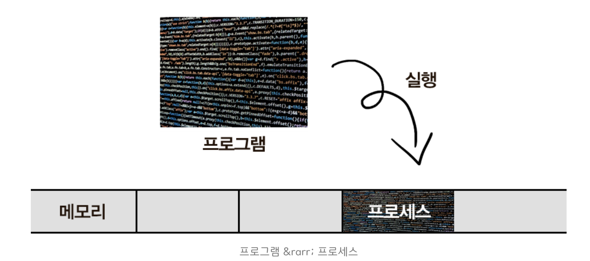

# 한눈에 이해하는 프로세스 & 스레드 개념

    

---

## 프로그램과 프로세스

### 프로그램 (Program)
- 프로그램은 실행 가능한 명령어들의 집합으로, 디스크에 저장된 정적인(static) 파일이다.
- 소스 코드가 컴파일되어 생성된 실행 파일(exe, bin 등)을 의미한다.
- 프로그램은 실행되기 전까지는 단순히 디스크에 저장된 데이터에 불과하다.
- 프로그램의 구성 요소:
  1. 코드 영역: 실행할 명령어들이 저장된 영역
  2. 데이터 영역: 전역 변수, 정적 변수가 저장된 영역
  3. 리소스 영역: 프로그램이 사용하는 이미지, 사운드 등의 리소스

### 프로세스 (Process)
- 프로세스는 실행 중인 프로그램의 인스턴스(instance)를 말한다.
- 프로그램이 실행되면 운영체제는 다음과 같은 작업을 수행한다:
  1. 프로그램 코드를 메모리에 로드
  2. 필요한 시스템 자원(CPU, 메모리, 파일 등)을 할당
  3. 프로세스 제어 블록(PCB) 생성
  4. 실행 상태로 전환

#### 프로세스의 특징
1. 독립성
   - 각 프로세스는 독립된 메모리 공간을 가진다
   - 다른 프로세스의 메모리 공간에 직접 접근할 수 없다
   - 프로세스 간 통신은 IPC(Inter-Process Communication)를 통해 이루어진다
   - 각 프로세스는 고유한 주소 공간을 가진다

2. 자원 할당
   - 운영체제로부터 CPU 시간, 메모리, I/O 장치 등을 할당받는다
   - 각 프로세스는 고유한 PID(Process ID)를 가진다
   - 프로세스는 필요한 시스템 자원을 요청하고 해제할 수 있다
   - 자원 할당은 운영체제의 스케줄러가 관리한다

3. 상태 관리
   - 프로세스는 다음과 같은 상태를 가진다:
     * 생성(New): 프로세스가 생성되는 상태
     * 준비(Ready): CPU를 할당받기 위해 대기하는 상태
     * 실행(Running): CPU를 할당받아 명령을 실행하는 상태
     * 대기(Waiting): I/O 작업 등으로 인해 대기하는 상태
     * 종료(Terminated): 프로세스가 종료되는 상태
   - 운영체제는 프로세스 스케줄러를 통해 프로세스 상태를 관리한다
   - 컨텍스트 스위칭(Context Switching)을 통해 프로세스 간 전환이 이루어진다

4. 프로세스 제어 블록(PCB)
   - 프로세스의 상태 정보를 저장하는 자료구조
   - PCB에 저장되는 정보:
     * 프로세스 식별자(PID)
     * 프로그램 카운터(PC)
     * 레지스터 상태
     * 메모리 관리 정보
     * 스케줄링 정보
     * I/O 상태 정보

    

#### 프로그램과 프로세스의 차이
- 프로그램은 정적인 코드와 데이터의 집합
- 프로세스는 실행 중인 프로그램의 동적인 인스턴스
- 하나의 프로그램이 여러 프로세스로 실행될 수 있다
- 프로세스는 실행에 필요한 모든 자원을 포함한다
- 프로그램은 디스크에 저장되지만, 프로세스는 메모리에 상주한다

    

---

### 스레드 (Thread)

#### 스레드의 등장 배경
1. 프로세스의 한계
   - 전통적인 프로세스 모델은 하나의 프로세스가 하나의 실행 흐름만 가질 수 있었다
   - 멀티태스킹이 필요해지면서 프로세스의 한계가 드러났다
   - 프로세스 생성과 컨텍스트 스위칭은 많은 오버헤드를 발생시킨다
   - 프로세스 간 통신은 복잡하고 비용이 많이 든다

2. 스레드의 필요성
   - 더 작은 실행 단위가 필요했다
   - 프로세스보다 가벼운 실행 단위로 빠른 컨텍스트 스위칭이 필요했다
   - 프로세스 내에서 여러 작업을 동시에 처리할 수 있어야 했다
   - 현대 애플리케이션의 복잡성 증가로 인한 필요성

#### 스레드의 개념
- 스레드는 프로세스 내의 실행 단위이다
- 하나의 프로세스는 여러 개의 스레드를 가질 수 있다
- 스레드는 프로세스의 코드, 데이터, 힙 영역을 공유한다
- 각 스레드는 독립적인 스택 영역을 가진다

#### 스레드의 특징
1. 공유 자원
   - 같은 프로세스의 스레드들은 메모리 공간을 공유한다
   - 코드, 데이터, 힙 영역을 공유하여 통신이 용이하다
   - 스택 영역만 독립적으로 가진다
   - 공유 자원 접근 시 동기화가 필요하다

2. 경량 프로세스
   - 스레드 생성과 스위칭이 프로세스보다 빠르다
   - 시스템 자원을 적게 사용한다
   - 컨텍스트 스위칭이 빠르다
   - 스레드 간 통신이 효율적이다

3. 동시성
   - 여러 스레드가 동시에 실행될 수 있다
   - 멀티코어 시스템에서 병렬 처리가 가능하다
   - 응답성과 처리량이 향상된다
   - 작업 분할이 용이하다

    

#### 멀티스레딩의 장단점
1. 장점
   - 응답성 향상: 사용자 인터페이스가 블로킹되지 않는다
   - 자원 공유: 프로세스 간 통신보다 효율적이다
   - 경제성: 프로세스 생성보다 스레드 생성이 효율적이다
   - 병렬성: 멀티코어 시스템에서 성능 향상
   - 자원 활용: 시스템 자원을 효율적으로 사용

2. 단점
   - 동기화 문제: 공유 자원 접근 시 주의 필요
   - 디버깅 어려움: 실행 순서가 불확실하다
   - 교착 상태: 잘못된 동기화로 인한 교착 상태 발생 가능
   - 스레드 안전성: 공유 자원 접근 시 동기화 필요
   - 복잡성: 멀티스레드 프로그래밍의 복잡성 증가

#### 스레드 구현 방식
1. 사용자 수준 스레드
   - 커널의 지원 없이 사용자 수준에서 구현
   - 빠른 스위칭이 가능
   - 커널이 스레드의 존재를 모름
   - 구현 예시: Java의 Green Thread

2. 커널 수준 스레드
   - 운영체제 커널이 직접 지원
   - 멀티프로세서에서 병렬 실행 가능
   - 스위칭이 상대적으로 느림
   - 구현 예시: Windows의 스레드

3. 혼합형 스레드
   - 사용자 수준과 커널 수준 스레드의 혼합
   - 유연한 스레드 관리 가능
   - 복잡한 구현이 필요
   - 구현 예시: Solaris의 스레드

#### 스레드 동기화
1. 동기화의 필요성
   - 공유 자원의 일관성 유지
   - 경쟁 상태(Race Condition) 방지
   - 교착 상태(Deadlock) 방지

2. 동기화 메커니즘
   - 뮤텍스(Mutex): 상호 배제를 위한 기본 동기화 도구
   - 세마포어(Semaphore): 리소스 접근 제어
   - 모니터(Monitor): 고수준 동기화 구조
   - 조건 변수(Condition Variable): 스레드 간 신호 전달

3. 동기화 문제 해결
   - 상호 배제(Mutual Exclusion)
   - 진행(Progress)
   - 제한된 대기(Bounded Waiting)

    

### 중요 개념 정리
1. 프로세스와 스레드의 관계
   - 프로세스는 자원의 집합체
   - 스레드는 실행의 단위
   - 프로세스는 최소 하나의 스레드를 가진다
   - 스레드는 프로세스의 하위 실행 단위

2. 멀티스레딩 프로그래밍
   - 동기화 메커니즘 필요 (뮤텍스, 세마포어 등)
   - 스레드 안전성 고려
   - 교착 상태 방지 필요
   - 스레드 풀(Thread Pool) 활용

3. 현대 프로그래밍에서의 활용
   - 웹 서버: 동시 다중 요청 처리
   - GUI 애플리케이션: 응답성 향상
   - 데이터 처리: 병렬 처리로 성능 향상
   - 게임 개발: 물리 엔진, AI 등 병렬 처리
   - 데이터베이스: 동시 트랜잭션 처리

4. 성능 최적화
   - 스레드 수 최적화
   - 동기화 오버헤드 최소화
   - 캐시 친화적인 코드 작성
   - 스레드 풀 크기 조정

---
**출처** 
- 아래의 출처의 기반에서, 작성되었습니다.

> 출처: https://inpa.tistory.com/entry/👩‍💻-프로세스-⚔️-쓰레드-차이 [Inpa Dev 👨‍💻:티스토리]