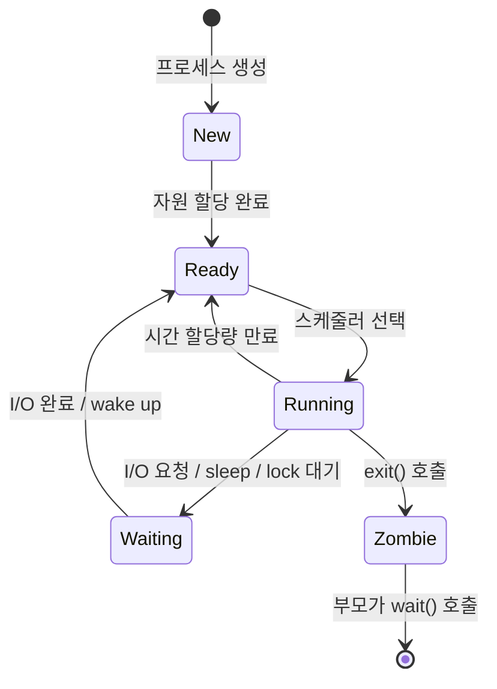

## 프로그램, 프로세스, 스레드 — 뭐가 다른가

서버 운영을 하다 보면 이 세 개념이 자주 섞인다. 간단히 정리하면 이렇다.

- **프로그램**: 디스크에 있는 실행 파일. `/usr/bin/nginx` 같은 바이너리 자체다. 아무것도 실행하지 않는 상태.
- **프로세스**: 프로그램이 메모리에 올라가서 실행 중인 상태. `ps aux`로 보이는 한 줄 한 줄이 프로세스다.
- **스레드**: 프로세스 안에서 실제로 코드를 실행하는 단위. 프로세스 하나에 스레드가 여러 개 있을 수 있다.

```bash
# nginx master process가 worker process를 fork한 상태
$ ps aux | grep nginx
root      1234  ... nginx: master process /usr/sbin/nginx
www-data  1235  ... nginx: worker process
www-data  1236  ... nginx: worker process

# Java 애플리케이션은 하나의 프로세스 안에 수십 개 스레드
$ ps -T -p 5678 | head -5
  PID  SPID TTY          TIME CMD
 5678  5678 ?        00:00:12 java
 5678  5679 ?        00:00:03 java    # GC 스레드
 5678  5680 ?        00:00:01 java    # HTTP worker 스레드
```

nginx는 멀티 프로세스 모델이고, Spring Boot(Tomcat)는 멀티 스레드 모델이다. 이 차이를 모르면 장애 대응에서 삽질한다.

<div align="center">
    
</div>

---

## 프로세스의 메모리 구조

프로세스가 생성되면 커널이 다음 메모리 영역을 할당한다.

```
High Address
┌──────────────────┐
│     Stack        │ ← 함수 호출, 지역변수 (위에서 아래로 자란다)
│        ↓         │
│                  │
│        ↑         │
│     Heap         │ ← malloc, new (아래에서 위로 자란다)
├──────────────────┤
│     BSS          │ ← 초기화 안 된 전역변수 (0으로 채워짐)
├──────────────────┤
│     Data         │ ← 초기화된 전역/정적 변수
├──────────────────┤
│     Text(Code)   │ ← 실행 코드 (read-only)
└──────────────────┘
Low Address
```

서버 운영에서 중요한 포인트:

- **Stack 크기는 제한이 있다.** Linux 기본값은 보통 8MB(`ulimit -s`로 확인). 재귀가 깊어지거나 큰 배열을 스택에 잡으면 SIGSEGV로 죽는다.
- **Heap은 `brk`/`mmap` 시스템 콜로 늘어난다.** JVM의 `-Xmx` 같은 설정이 이 영역 크기를 제한하는 것이다.
- **Text 영역은 read-only다.** 같은 바이너리를 여러 프로세스가 실행하면 이 영역은 물리 메모리에서 공유한다.

---

## PCB (Process Control Block)

커널이 프로세스를 관리하기 위해 내부에 유지하는 구조체다. Linux에서는 `task_struct`가 이 역할을 한다.

```c
// linux/sched.h (간략화)
struct task_struct {
    pid_t pid;                    // 프로세스 ID
    volatile long state;          // TASK_RUNNING, TASK_INTERRUPTIBLE 등
    struct mm_struct *mm;         // 메모리 매핑 정보 (페이지 테이블 등)
    struct files_struct *files;   // 열린 파일 디스크립터 테이블
    struct thread_info thread_info; // CPU 레지스터 상태
    int prio;                     // 스케줄링 우선순위
    // ...
};
```

컨텍스트 스위칭이 일어나면 현재 프로세스의 레지스터 상태를 `task_struct`에 저장하고, 다음 프로세스의 상태를 복원한다. 이 비용이 프로세스 간 전환이 비싼 이유다.

`/proc/[pid]/` 디렉토리에서 실행 중인 프로세스의 PCB 정보 대부분을 확인할 수 있다.

```bash
# 프로세스 상태 확인
$ cat /proc/1234/status
Name:   nginx
State:  S (sleeping)
Pid:    1234
PPid:   1
Threads: 1
VmRSS:  12340 kB    # 실제 물리 메모리 사용량

# 열린 파일 디스크립터 확인 — fd leak 디버깅할 때 자주 쓴다
$ ls -la /proc/1234/fd | wc -l
```

<div align="center">
    
</div>

---

## 프로세스 상태 전이


```mermaid
stateDiagram-v2
    [*] --> New: 프로세스 생성
    New --> Ready: 자원 할당 완료
    Ready --> Running: 스케줄러 선택
    Running --> Ready: 시간 할당량 만료
    Running --> Waiting: I/O 요청 / sleep / lock 대기
    Waiting --> Ready: I/O 완료 / wake up
    Running --> Zombie: exit() 호출
    Zombie --> [*]: 부모가 wait() 호출
```

실무에서 자주 마주치는 상태들:

- **D (Uninterruptible Sleep)**: `ps`에서 상태가 `D`인 프로세스. NFS 마운트가 먹통이거나 디스크 I/O가 막힌 경우다. kill로도 안 죽는다. 이 상태가 쌓이면 서버 전체가 느려진다.
- **Z (Zombie)**: 자식 프로세스가 종료됐는데 부모가 `wait()`을 안 호출한 경우. 리소스는 이미 해제됐지만 PID 테이블에 엔트리가 남아 있다. 좀비 수백 개가 쌓이면 PID 고갈이 올 수 있다.
- **T (Stopped)**: `SIGSTOP`이나 `Ctrl+Z`로 멈춘 상태. `fg`나 `SIGCONT`로 재개한다.

```bash
# 좀비 프로세스 찾기
$ ps aux | awk '$8 == "Z" { print }'

# D 상태 프로세스 찾기 — 디스크 I/O 문제 의심할 때
$ ps aux | awk '$8 ~ /D/ { print }'
```

---

## fork와 exec — Linux 프로세스 생성의 핵심

Linux에서 새 프로세스를 만드는 방법은 `fork()` + `exec()` 조합뿐이다. (정확히는 `clone()` 시스템 콜이 기반이지만 개념적으로 fork/exec로 이해하면 된다.)

### fork()

현재 프로세스를 **그대로 복제**한다. 부모와 자식은 fork 직후 동일한 코드, 데이터, 열린 파일 디스크립터를 가진다.

```c
#include <unistd.h>
#include <stdio.h>

int main() {
    int x = 10;
    pid_t pid = fork();

    if (pid == 0) {
        // 자식 프로세스
        x = 20;
        printf("child: x=%d, pid=%d\n", x, getpid());
    } else if (pid > 0) {
        // 부모 프로세스
        printf("parent: x=%d, child_pid=%d\n", x, pid);
        wait(NULL); // 자식 종료 대기 — 안 하면 좀비 생긴다
    } else {
        perror("fork failed");
        return 1;
    }
    return 0;
}
```

```
parent: x=10, child_pid=1235
child: x=20, pid=1235
```

자식이 `x = 20`으로 바꿔도 부모의 `x`는 10 그대로다. 메모리 공간이 분리되어 있기 때문이다. (정확히는 CoW 때문에 이 시점에 분리된다.)

### exec()

현재 프로세스의 메모리를 **새 프로그램으로 교체**한다. PID는 그대로 유지되고 코드, 데이터, 스택이 전부 새 프로그램의 것으로 바뀐다.

```c
#include <unistd.h>
#include <stdio.h>

int main() {
    pid_t pid = fork();

    if (pid == 0) {
        // 자식 프로세스에서 ls 실행
        execl("/bin/ls", "ls", "-la", "/tmp", NULL);
        // exec 성공하면 여기 도달하지 않는다
        perror("exec failed");
        _exit(1);
    } else {
        wait(NULL);
    }
    return 0;
}
```

셸이 명령어를 실행하는 과정이 정확히 이것이다:

```
bash (PID 1000)
  ├─ fork()  →  bash 복제본 (PID 1001)
  └─ wait()      └─ exec("/bin/ls") → ls (PID 1001) → exit
```

### fork + exec 분리의 의미

왜 한 번에 "새 프로세스로 새 프로그램 실행"을 안 하고 fork와 exec을 분리했을까?

fork와 exec 사이에 부모 프로세스의 환경을 수정할 수 있기 때문이다. 셸의 리다이렉션(`>`, `|`)이 이 원리로 동작한다.

```c
pid_t pid = fork();
if (pid == 0) {
    // fork와 exec 사이에서 파일 디스크립터 조작
    int fd = open("/tmp/output.log", O_WRONLY | O_CREAT, 0644);
    dup2(fd, STDOUT_FILENO);  // stdout을 파일로 리다이렉트
    close(fd);

    execl("/bin/ls", "ls", "-la", NULL);
    _exit(1);
}
```

파이프(`|`)도 같은 원리다. fork 후 exec 전에 pipe의 read/write end를 stdin/stdout에 연결한다.

---

## Copy-on-Write (CoW)

fork가 프로세스를 "복제"한다고 했는데, 메모리를 전부 복사하면 느릴 수밖에 없다. 실제로는 **Copy-on-Write** 방식으로 동작한다.

### 동작 원리

1. fork 직후, 부모와 자식은 **같은 물리 페이지**를 가리킨다. 페이지 테이블만 복사하고 실제 메모리는 복사하지 않는다.
2. 모든 공유 페이지를 **read-only**로 표시한다.
3. 부모든 자식이든 해당 페이지에 **쓰기를 시도하면** page fault가 발생한다.
4. 커널이 page fault를 받아서 그 페이지만 **그때 복사**한다. 쓰기를 시도한 프로세스에 새 물리 페이지를 할당하고 내용을 복사한 뒤 read-write로 설정한다.

```
fork 직후:
  부모 페이지 테이블 ──→ 물리 페이지 A (read-only) ←── 자식 페이지 테이블

자식이 쓰기 시도:
  부모 페이지 테이블 ──→ 물리 페이지 A (read-write)
  자식 페이지 테이블 ──→ 물리 페이지 A' (read-write, A의 복사본)
```

### CoW가 실무에서 문제되는 경우

**Redis의 BGSAVE가 대표적이다.** Redis는 스냅샷을 뜰 때 `fork()`를 쓴다. fork 직후에는 메모리를 거의 추가로 쓰지 않지만, 쓰기 요청이 계속 들어오면 CoW가 발생하면서 메모리 사용량이 급증한다.

```bash
# Redis 로그에서 이런 메시지를 보면 CoW로 인한 메모리 추가 사용량이다
# Background saving started by pid 1234
# RDB: 1234 MB of memory used by copy-on-write
```

대응 방법:
- Redis 서버의 물리 메모리를 실제 데이터 크기의 2배로 잡는다
- `vm.overcommit_memory = 1` 설정 (메모리 과커밋 허용)
- BGSAVE 중에 쓰기 부하가 집중되지 않게 스케줄링

**fork 후 바로 exec하는 경우** (셸 명령 실행 등)에는 CoW 덕분에 메모리 복사가 거의 일어나지 않는다. 어차피 exec이 메모리를 전부 교체하기 때문이다.

---

## 스레드 — 프로세스 안의 실행 단위

### 스레드가 공유하는 것과 독립적인 것

```
프로세스
┌─────────────────────────────────────┐
│  Code    Data    Heap    Files      │  ← 모든 스레드가 공유
│                                     │
│  ┌─────┐  ┌─────┐  ┌─────┐        │
│  │Stack│  │Stack│  │Stack│         │  ← 스레드별 독립
│  │  +  │  │  +  │  │  +  │         │
│  │ PC  │  │ PC  │  │ PC  │         │
│  │ Reg │  │ Reg │  │ Reg │         │
│  └──┬──┘  └──┬──┘  └──┬──┘        │
│   Thread1  Thread2  Thread3         │
└─────────────────────────────────────┘
```

| 공유 | 독립 |
|------|------|
| 코드 영역 | 스택 |
| 전역 변수 / 힙 | 프로그램 카운터 (PC) |
| 열린 파일 디스크립터 | CPU 레지스터 |
| 시그널 핸들러 | 스레드 로컬 변수 |
| 작업 디렉토리 | errno (스레드별) |

힙을 공유하기 때문에 스레드 간 데이터 전달이 빠르다. 반면 동기화를 제대로 안 하면 데이터가 깨진다.

<div align="center">
    
</div>

### Linux에서 스레드의 실체

Linux 커널은 프로세스와 스레드를 구분하지 않는다. 둘 다 `task_struct`로 관리한다. 스레드는 `clone()` 시스템 콜에 `CLONE_VM | CLONE_FILES | CLONE_FS | CLONE_SIGHAND` 플래그를 주어 생성한 것이다. 이 플래그들이 "메모리, 파일, 시그널 핸들러를 부모와 공유하라"는 의미다.

```bash
# 프로세스의 스레드 확인
$ ls /proc/5678/task/
5678  5679  5680  5681  # 각각이 스레드 (LWP)

# strace로 스레드 생성 추적
$ strace -f -e clone ./my_app
clone(child_stack=0x7f..., flags=CLONE_VM|CLONE_FS|CLONE_FILES|CLONE_SIGHAND|...)
```

그래서 `top`에서 `H`를 누르면 스레드 단위로 CPU 사용량을 볼 수 있다. GC 스레드가 CPU를 100% 잡아먹고 있는 상황을 잡을 때 유용하다.

### 멀티 프로세스 vs 멀티 스레드

서버 아키텍처를 설계할 때 자주 나오는 선택이다.

| | 멀티 프로세스 | 멀티 스레드 |
|---|---|---|
| 대표 예시 | nginx worker, PostgreSQL backend | Tomcat, Node.js worker_threads |
| 메모리 격리 | 프로세스별 독립 | 공유 (한 스레드 버그가 전체에 영향) |
| 생성 비용 | 높다 (CoW로 완화) | 낮다 |
| 컨텍스트 스위칭 | 비싸다 (TLB flush) | 상대적으로 싸다 |
| 통신 | IPC 필요 (pipe, socket, shm) | 메모리 공유로 바로 가능 |
| 안정성 | 한 프로세스 죽어도 다른 프로세스 무관 | 한 스레드가 SIGSEGV 받으면 프로세스 전체 사망 |

nginx가 멀티 프로세스 모델을 쓰는 이유는, worker 하나가 죽어도 master가 새로 fork하면 되기 때문이다. JVM은 멀티 스레드 모델인데, GC를 포함한 내부 동작이 스레드 기반으로 설계되어 있다.

---

## 스레드 동기화 — 왜 필요하고 뭘 쓰는가

여러 스레드가 같은 변수를 읽고 쓰면 문제가 생긴다.

```java
// 이 코드는 깨진다
private int count = 0;

// 스레드 A, B가 동시에 실행
public void increment() {
    count++;  // 읽기 → 더하기 → 쓰기 3단계. 원자적이지 않다.
}
```

`count++`는 하나의 연산처럼 보이지만 실제로는 `LOAD → ADD → STORE` 3개 명령어다. 두 스레드가 동시에 `LOAD`하면 하나의 증가분이 사라진다.

### 주요 동기화 도구

**Mutex (Mutual Exclusion)**: 한 번에 하나의 스레드만 임계 영역에 진입한다.

```c
pthread_mutex_t lock = PTHREAD_MUTEX_INITIALIZER;

void increment() {
    pthread_mutex_lock(&lock);
    count++;
    pthread_mutex_unlock(&lock);
}
```

**Semaphore**: 동시에 N개 스레드까지 접근 허용. DB 커넥션 풀처럼 제한된 리소스를 관리할 때 쓴다.

**Read-Write Lock**: 읽기는 여러 스레드가 동시에, 쓰기는 단독으로. 읽기가 많고 쓰기가 드문 설정값 캐시 같은 곳에 쓴다.

**Atomic 연산**: 락 없이 단일 변수의 원자적 조작. `count++` 정도는 `AtomicInteger`나 `__atomic_fetch_add`로 처리하는 게 락보다 빠르다.

### 데드락

두 스레드가 서로 상대가 가진 락을 기다리면 영원히 멈춘다.

```
Thread A: lock(mutex1) → lock(mutex2)  // mutex2를 기다림
Thread B: lock(mutex2) → lock(mutex1)  // mutex1을 기다림
```

방지 방법은 단순하다: **락 획득 순서를 항상 같게 유지한다.** 모든 코드에서 mutex1 → mutex2 순서로 잡으면 데드락이 발생하지 않는다.

서버가 갑자기 응답을 안 하면서 CPU 사용률이 0%에 가까우면 데드락을 의심해야 한다. JVM이면 `jstack`으로 스레드 덤프를 뜬다.

```bash
$ jstack <pid> | grep -A 5 "deadlock"
```

<div align="center">
    
</div>

---

## 실무에서 자주 겪는 상황들

### 스레드 수를 몇 개로 잡아야 하나

공식처럼 쓰이는 기준:

- **CPU 집약적 작업**: 코어 수와 같거나 +1 정도. 더 늘려봐야 컨텍스트 스위칭 비용만 늘어난다.
- **I/O 집약적 작업**: 코어 수보다 훨씬 많이 잡아도 된다. I/O 대기 중 다른 스레드가 CPU를 쓸 수 있기 때문이다. Tomcat 기본 스레드 수가 200인 이유가 이것이다.

```bash
# 코어 수 확인
$ nproc
8

# Tomcat이면 server.xml에서
# maxThreads="200"   ← I/O 바운드라 코어 수보다 훨씬 크다
```

### 프로세스 간 통신 (IPC)

멀티 프로세스 모델에서 프로세스끼리 데이터를 주고받아야 할 때 쓰는 방법들.

| 방법 | 사용 사례 | 특징 |
|------|----------|------|
| pipe | 셸의 `cmd1 \| cmd2` | 단방향, 부모-자식 간 |
| Unix domain socket | nginx ↔ PHP-FPM | 양방향, 같은 호스트 내 |
| shared memory | Redis 내부 | 가장 빠르지만 동기화 직접 구현해야 함 |
| mmap | 로그 파일 공유 | 파일 기반 공유 메모리 |
| signal | `kill -HUP` 으로 설정 리로드 | 데이터 전달 불가, 이벤트 알림용 |

### too many open files

`ulimit -n`으로 설정된 파일 디스크립터 제한에 걸리면 발생한다. 소켓도 파일 디스크립터이므로 동시 커넥션이 많은 서버에서 자주 본다.

```bash
# 현재 프로세스의 fd 사용량 확인
$ ls /proc/<pid>/fd | wc -l

# 제한 확인
$ cat /proc/<pid>/limits | grep "open files"
Max open files    1024    1048576    files

# 늘리기: /etc/security/limits.conf
# * soft nofile 65536
# * hard nofile 65536
```

### OOM Killer

Linux 커널이 메모리가 부족하면 프로세스를 강제로 죽인다. `dmesg`에서 확인한다.

```bash
$ dmesg | grep -i "oom"
[12345.678] Out of memory: Killed process 5678 (java), oom_adj 0, oom_score 800
```

메모리 누수가 있는 프로세스가 아니라 엉뚱한 프로세스가 죽는 경우가 있다. `oom_score_adj`를 설정해서 중요한 프로세스가 죽지 않게 보호할 수 있다.

```bash
# 이 프로세스는 OOM Killer 대상에서 제외
$ echo -1000 > /proc/<pid>/oom_score_adj
```

---

## 참조

- Abraham Silberschatz, "Operating System Concepts" (10th Edition), 2018
- Robert Love, "Linux Kernel Development" (3rd Edition), 2010
- Linux man pages: `fork(2)`, `exec(3)`, `clone(2)`, `mmap(2)`
- Redis 공식 문서: [Redis persistence - How it works](https://redis.io/docs/management/persistence/)
