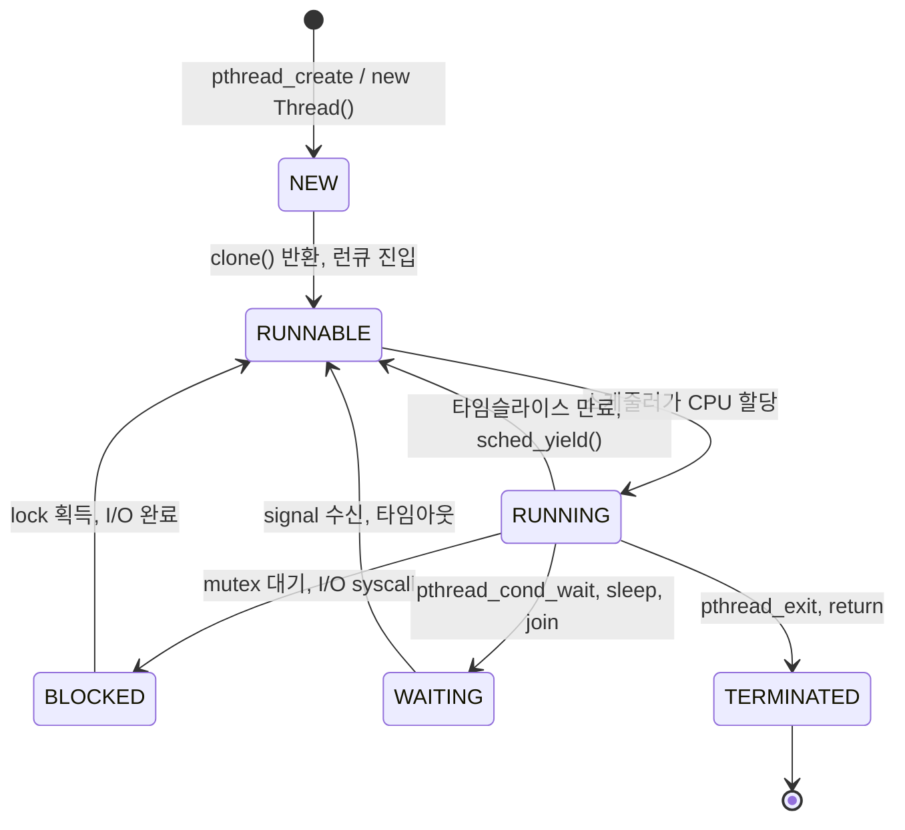

## 스레드란

프로세스 안에서 코드를 실행하는 단위다. 프로세스가 생성되면 기본으로 스레드 하나(메인 스레드)가 존재하고, 필요에 따라 추가 스레드를 만들어 작업을 분리한다.

스레드끼리는 같은 프로세스의 힙, 데이터, 코드 영역을 공유하고, 스택과 레지스터 상태만 각자 가진다. 공유/독립 자원의 상세 구조는 [쓰레드의 자원 구조](쓰레드의 자원 구조.md)에서 다룬다.

<div align="center">
    
</div>

---

## 스레드가 등장한 이유

초기 유닉스에는 스레드가 없었다. 동시성이 필요하면 `fork()`로 프로세스를 여러 개 띄웠다. 스레드라는 개념이 자리잡은 건 멀티프로세스 모델로는 풀기 어려운 문제가 있었기 때문이다.

### 멀티프로세스의 한계

`fork()`는 자식 프로세스에 부모의 주소 공간을 복사한다. CoW(Copy-on-Write)로 즉시 복사를 피해도, 페이지 테이블 자체는 복사되고 모든 페이지를 read-only로 표시해야 한다. 힙이 큰 프로세스(수 GB JVM 등)를 fork하면 이 비용이 크다.

더 큰 문제는 프로세스 간 통신이다. 부모와 자식은 주소 공간이 달라서 변수 하나 공유하려면 파이프, 공유 메모리, 메시지 큐 같은 IPC를 써야 한다. 코드 한 줄로 해결되던 일이 IPC 채널 설계, 직렬화, 동기화로 부풀어 오른다.

웹 서버 같은 워크로드를 떠올리면 명확하다. 요청 1만 개를 동시에 처리하려고 프로세스 1만 개를 띄울 수는 없다. 메모리도 모자라고 컨텍스트 스위칭 비용도 감당이 안 된다.

### 스레드가 풀어주는 부분

같은 주소 공간을 쓰는 실행 단위가 있으면 위 문제가 사라진다. 메모리 공유는 그냥 같은 변수를 가리키면 된다. 생성 비용도 페이지 테이블 복사가 없으니 훨씬 싸다. 컨텍스트 스위칭도 mm_struct가 같으면 TLB flush가 필요 없다.

### 대신 생기는 문제

공유 메모리에 여러 실행 흐름이 동시에 접근하면 race condition이 생긴다. mutex, semaphore, atomic 연산 같은 동기화 장치가 필요해진다. 또 스레드 하나가 SIGSEGV를 받으면 프로세스 전체가 죽는다. 프로세스 격리가 주는 안전성이 사라진다.

| 항목 | 멀티프로세스 | 멀티스레드 |
|---|---|---|
| 주소 공간 | 분리 (격리됨) | 공유 |
| 생성 비용 | 높음 (페이지 테이블 복사) | 낮음 |
| 통신 | IPC 필요 | 변수 공유로 충분 |
| 컨텍스트 스위칭 | TLB flush 필요 | 같은 프로세스 내면 불필요 |
| 한쪽 크래시 | 다른 프로세스 무사 | 프로세스 전체 종료 |
| 동기화 부담 | 적음 | 큼 |

---

## 스레드 생명주기

스레드는 생성된 시점부터 종료까지 몇 가지 상태를 오간다. 운영체제마다 명칭이 조금씩 다르지만 본질은 비슷하다. POSIX/Java 기준으로 정리하면 NEW, RUNNABLE, RUNNING, BLOCKED, WAITING, TERMINATED다.



각 전이가 실제로 어떤 호출/이벤트로 일어나는지 정리한다.

### NEW → RUNNABLE

`pthread_create()`가 내부적으로 `clone(CLONE_VM | CLONE_THREAD | ...)` 시스템 콜을 호출한다. 커널은 새 task_struct를 할당하고 런큐에 넣는다. 이 시점부터 스레드는 스케줄러에게 보이기 시작한다.

### RUNNABLE → RUNNING

스케줄러가 CPU에 할당하면 실제로 명령어가 실행된다. CFS(Completely Fair Scheduler)는 vruntime이 가장 작은 task를 고른다.

### RUNNING → RUNNABLE

타임슬라이스가 끝나거나 더 우선순위 높은 task가 들어오면 선점된다. `sched_yield()`로 자발적으로 양보할 수도 있다. 이 상태 전이는 같은 우선순위로 다시 런큐에 들어간다는 점이 BLOCKED/WAITING과 다르다.

### RUNNING → BLOCKED

`pthread_mutex_lock()`이 잠긴 락을 잡으려 할 때, `read()` 같은 블로킹 I/O가 데이터를 기다릴 때 들어간다. 내부적으로는 대부분 `futex_wait()` 시스템 콜을 거친다. 커널은 task를 wait queue에 매달아 두고 런큐에서 빼낸다. CPU를 점유하지 않는다.

```bash
# BLOCKED 스레드의 커널 스택 — futex_wait가 보인다
$ cat /proc/<pid>/task/<tid>/stack
[<0>] futex_wait_queue_me+0xb6/0x110
[<0>] futex_wait+0x179/0x270
[<0>] do_futex+0x142/0xb70
```

### RUNNING → WAITING

`pthread_cond_wait()`로 조건 변수를 기다리거나 `sleep()`으로 시간을 기다리거나 `pthread_join()`으로 다른 스레드를 기다릴 때다. 구현은 BLOCKED와 비슷하지만 깨우는 트리거가 다르다. cond_wait는 `pthread_cond_signal()` 호출로, sleep은 타이머 만료로 깨어난다.

### TERMINATED

`pthread_exit()`, `return`, 캔슬레이션, 프로세스 종료로 들어간다. detached 스레드면 자원이 즉시 회수되고, 그렇지 않으면 zombie 상태로 남아 누군가 `pthread_join()` 해주기를 기다린다.

### 실제 상태 확인

`ps`나 `top`으로 스레드 상태를 볼 수 있다. Linux의 상태 코드는 R(running/runnable), S(sleeping=interruptible wait), D(uninterruptible sleep, 보통 디스크 I/O), Z(zombie), T(stopped)다.

```bash
# 프로세스의 모든 스레드 상태 보기
$ ps -eLo pid,tid,stat,wchan,comm | grep my_app
12345 12345 Sl   futex_wait     my_app
12345 12346 Sl   poll_schedule  my_app   # epoll 대기 중
12345 12347 R    -              my_app   # CPU에서 실행 중
12345 12348 D    blk_mq_get_tag my_app   # 디스크 I/O 대기
```

`wchan`(wait channel) 컬럼이 어떤 함수에서 잠들었는지 보여준다. `futex_wait`면 락 또는 조건 변수, `poll_schedule_timeout`이면 epoll/select 같은 I/O 멀티플렉싱, `blk_mq_*`면 디스크 I/O 대기다.

```bash
# top에서 스레드 단위로 상태 보기
$ top -H -p 12345
   PID USER  PR NI VIRT  RES  SHR S  %CPU %MEM TIME+   COMMAND
 12347 app   20  0 1.2g  300m  10m R  98.0  3.7 0:45.22 worker-3
 12346 app   20  0 1.2g  300m  10m S   0.3  3.7 0:01.10 io-poller
```

12347 스레드가 R 상태로 CPU를 거의 다 쓰고 있다. 무한 루프에 빠졌거나 CPU-bound 작업이 진행 중이다.

---

## 사용자 스레드 vs 커널 스레드

스레드를 누가 관리하느냐로 두 종류로 나눌 수 있다.

### 커널 스레드

커널이 직접 관리한다. 커널이 task_struct를 가지고 있고 스케줄링도 커널 스케줄러가 한다. 시스템 콜로만 만들고 조작할 수 있다. Linux의 pthread는 모두 커널 스레드다.

장점은 진짜 병렬 실행이다. CPU가 여러 개면 스레드 여러 개가 동시에 다른 코어에서 돈다. 한 스레드가 블로킹 시스템 콜에 걸려도 다른 스레드는 영향을 안 받는다.

단점은 생성과 컨텍스트 스위칭에 시스템 콜이 필요해서 사용자 스레드보다 무겁다.

### 사용자 스레드

라이브러리/런타임이 관리한다. 커널은 이 스레드들의 존재를 모른다. 사용자 공간에서 스택만 바꿔서 실행 흐름을 전환한다. 시스템 콜이 필요 없으니 매우 빠르다.

대표적인 예가 Go의 goroutine, Python의 greenlet, 옛날 Java의 green thread다.

문제는 두 가지다. 첫째, 한 사용자 스레드가 블로킹 시스템 콜을 호출하면 그 스레드를 담고 있는 커널 스레드 전체가 멈춘다. 같은 커널 스레드 위의 다른 사용자 스레드들도 같이 묶인다. 둘째, 멀티 코어를 활용하려면 결국 커널 스레드가 여러 개 필요하다.

Go 런타임이 이 문제를 푸는 방식은 영리하다. 시스템 콜이 길어지면 새 커널 스레드를 띄워서 다른 goroutine들을 거기로 옮긴다. blocking syscall을 nonblocking으로 변환하는 작업도 런타임이 한다(netpoller).

---

## 스레드 매핑 모델

사용자 스레드와 커널 스레드를 어떻게 연결하느냐에 따라 모델이 갈린다.

### 1:1 (커널 레벨 스레딩)

사용자 스레드 하나가 커널 스레드 하나에 대응한다. 현대 Linux의 NPTL, Windows 스레드, macOS pthread가 모두 1:1이다.

장점은 단순하고 멀티 코어를 그대로 쓴다. 한 스레드가 블로킹돼도 다른 스레드는 무관하다.

단점은 스레드 생성/스위칭이 커널 시스템 콜을 거치므로 비교적 무겁다.

### M:1 (유저 레벨 스레딩)

사용자 스레드 M개가 커널 스레드 1개에 매핑된다. Solaris의 옛날 LWP 모델, 초창기 Java green thread가 이 방식이었다.

장점은 스레드 스위칭이 사용자 공간에서 끝나서 매우 빠르다.

단점은 두 가지다. 첫째, 한 스레드가 블로킹 syscall을 부르면 전체가 멈춘다. 둘째, 멀티 코어를 못 쓴다. 코어가 8개여도 1개만 돈다.

거의 사라진 모델이다.

### M:N (하이브리드)

사용자 스레드 M개가 커널 스레드 N개에 매핑된다(보통 N << M). 사용자 스레드를 가볍게 유지하면서도 멀티 코어를 활용할 수 있다. Solaris/FreeBSD가 한때 시도했고, 지금은 Go 런타임의 GMP 모델이 사실상 M:N이다.

이론적으로 이상적이지만 구현이 까다롭다. 블로킹 syscall이 들어왔을 때 다른 사용자 스레드를 다른 커널 스레드로 옮기는 로직, 시그널 전달, GC와의 협력 등이 복잡하다.

### Linux가 1:1을 택한 이유

Linux 2.4 시절 LinuxThreads는 M:N에 가까운 변형을 시도했다가 실패했고, 2.6에서 NPTL(Native POSIX Thread Library)이 1:1로 정리했다. 이유는 단순함과 성능이다.

- POSIX 시그널 의미 보존이 1:1에서 자연스럽다. M:N에선 시그널을 어느 사용자 스레드에 줄지 결정하기 어렵다.
- 커널 스케줄러가 이미 잘 만들어져 있고, 사용자 공간에서 또 스케줄러를 만들어 두 층으로 운영하는 것보다 단순하다.
- 멀티 코어가 보편화되면서 사용자 스레드 모델의 핵심 가치(저비용 스위칭)가 줄었다. 진짜 병렬 실행이 더 중요해졌다.
- 시스템 콜 진입 비용이 점점 줄어 1:1의 단점이 작아졌다.

| 모델 | 멀티 코어 활용 | 스위칭 비용 | 블로킹 syscall 영향 | 대표 구현 |
|---|---|---|---|---|
| 1:1 | 가능 | 높음 (syscall) | 해당 스레드만 | Linux NPTL, Windows |
| M:1 | 불가능 | 낮음 (사용자 공간) | 전체 멈춤 | 옛 Java green thread |
| M:N | 가능 | 중간 | 런타임이 회피 가능 | Go GMP, 옛 Solaris |

---

## TCB와 PCB

스레드를 표현하는 자료구조를 TCB(Thread Control Block)라 하고, 프로세스를 표현하는 자료구조를 PCB(Process Control Block)라 한다. 교과서적 정의지만 실제 운영체제마다 구현이 다르다.

### 교과서적 분리 모델

이론적으로 PCB와 TCB는 분리된다.

- PCB: PID, 메모리 맵, 파일 디스크립터 테이블, 시그널 핸들러, 자원 사용량
- TCB: TID, 스택 포인터, 레지스터 컨텍스트, 스레드 우선순위, 스레드 상태

한 PCB가 여러 TCB를 가진다. 스케줄러는 TCB 단위로 동작하고, 자원 회계는 PCB 단위로 한다.

### Linux의 통합 모델

Linux는 PCB와 TCB를 구분하지 않는다. 둘 다 `task_struct`라는 하나의 구조체로 표현한다. 프로세스든 스레드든 task_struct가 하나씩이다.

대신 어떤 자원을 공유하느냐로 구분한다. task_struct 안에 `mm_struct *mm`(메모리), `files_struct *files`(파일 디스크립터), `signal_struct *signal` 같은 포인터가 있는데, 같은 프로세스의 스레드들은 이 포인터들이 같은 구조체를 가리킨다. fork로 만들어진 프로세스들은 각자 다른 구조체를 가진다.

```
프로세스 P (Tgid=1000)
├─ task_struct (pid=1000) → mm_struct A, files_struct A
├─ task_struct (pid=1001) → mm_struct A, files_struct A   같은 거
└─ task_struct (pid=1002) → mm_struct A, files_struct A   같은 거

프로세스 Q (Tgid=2000, fork된 별도 프로세스)
└─ task_struct (pid=2000) → mm_struct B, files_struct B   다른 거
```

이 통합 모델 덕분에 스케줄러가 단순해진다. 스케줄러는 task_struct 하나만 보면 되고, 프로세스인지 스레드인지 신경 쓰지 않는다.

### TID와 PID

`getpid()`는 Tgid를 반환한다. 같은 프로세스 안의 모든 스레드가 같은 값을 받는다. `gettid()`는 task_struct의 진짜 pid를 반환한다. 스레드마다 다르다. `/proc/<tgid>/task/<tid>/`로 개별 스레드 정보에 접근할 수 있다.

---

## Linux에서 스레드의 실체 — task_struct

Linux 커널은 프로세스와 스레드를 구분하지 않는다. 둘 다 `task_struct` 구조체로 표현된다. 스레드를 만들 때 내부적으로 `clone()` 시스템 콜이 호출되는데, 이때 전달하는 플래그가 프로세스 생성과 다르다.

```c
// 프로세스 생성 (fork)
clone(SIGCHLD, ...);
// → 메모리, 파일 디스크립터, 시그널 핸들러 모두 복사

// 스레드 생성 (pthread_create 내부)
clone(CLONE_VM | CLONE_FS | CLONE_FILES | CLONE_SIGHAND | CLONE_THREAD, ...);
// → 메모리 공간(VM), 파일 시스템 정보, fd 테이블, 시그널 핸들러를 부모와 공유
```

`CLONE_VM`이 핵심이다. 이 플래그가 있으면 새 task_struct가 부모와 **같은 `mm_struct`**(메모리 디스크립터)를 가리킨다. 별도의 페이지 테이블을 만들지 않으니 생성 비용이 낮고, 컨텍스트 스위칭 시 TLB flush도 필요 없다.

```bash
# 프로세스 안의 스레드 목록 확인 — 각 디렉토리가 하나의 스레드(LWP)
$ ls /proc/<pid>/task/
5678  5679  5680  5681

# 스레드별 상태 확인
$ cat /proc/<pid>/task/5679/status | head -5
Name:   java
State:  S (sleeping)
Tgid:   5678        # Thread Group ID = 메인 프로세스 PID
Pid:    5679        # 이 스레드의 고유 TID
```

`Tgid`(Thread Group ID)가 같은 task_struct들이 하나의 프로세스에 속한 스레드들이다. `getpid()`가 반환하는 값이 Tgid이고, `gettid()`가 반환하는 값이 개별 스레드의 Pid다.

---

## 스레드 스케줄링 동작 원리

Linux 스케줄러는 스레드를 스케줄링 단위로 본다. 프로세스가 아니라 task_struct 하나하나를 후보로 다룬다.

### 런큐와 CFS

CPU마다 런큐(runqueue)가 있다. RUNNABLE 상태의 task_struct들이 들어 있다. 메인 스케줄러인 CFS는 런큐를 red-black tree로 관리하면서 vruntime이 가장 작은 task를 다음 실행 후보로 고른다.

vruntime은 "가상 실행 시간"이다. nice 값(우선순위)이 같으면 실제 실행 시간과 같지만, 우선순위가 높으면 실제보다 천천히 증가한다. 모두가 비슷한 vruntime을 갖도록 만드는 것이 CFS의 fairness 원칙이다.

```bash
# 스레드의 스케줄링 정책과 우선순위 확인
$ chrt -p <tid>
pid <tid>'s current scheduling policy: SCHED_OTHER
pid <tid>'s current scheduling priority: 0
```

`SCHED_OTHER`가 일반 task용 CFS 정책이다. 그 외에 `SCHED_FIFO`, `SCHED_RR`은 실시간 정책으로 우선순위가 더 높고, `SCHED_IDLE`, `SCHED_BATCH`는 우선순위가 낮다.

### nice 값 조정

```bash
# 스레드 우선순위 낮추기 (nice 값 +10)
$ renice -n 10 -p <tid>

# 새 프로세스를 nice 값 적용해서 시작
$ nice -n -5 ./my_app    # 우선순위 높임 (root 권한 필요)
```

nice 값은 -20 ~ 19다. 작을수록 우선순위가 높다. 일반 사용자는 양수 방향으로만 조정할 수 있다.

### CPU affinity

특정 스레드를 특정 CPU 코어에 묶을 수 있다. 캐시 친화성을 살리거나 NUMA 노드 경계를 넘지 않게 하려고 쓴다.

```bash
# 현재 affinity 확인
$ taskset -p <tid>
pid <tid>'s current affinity mask: ff      # 8개 코어 모두 가능

# 특정 코어에만 묶기
$ taskset -cp 0,1 <tid>
# 이제 코어 0번 또는 1번에서만 돈다
```

코드에서는 `pthread_setaffinity_np()`로 설정한다.

```c
cpu_set_t cpuset;
CPU_ZERO(&cpuset);
CPU_SET(0, &cpuset);   // 코어 0번
CPU_SET(1, &cpuset);   // 코어 1번
pthread_setaffinity_np(pthread_self(), sizeof(cpuset), &cpuset);
```

실시간성이 중요한 워크로드(저지연 트레이딩, 미디어 처리)에서 자주 쓴다. 일반 웹 서버에선 굳이 손댈 필요가 없는 경우가 대부분이다.

### 컨텍스트 스위칭 비용

같은 프로세스 내 스레드 간 스위칭은 mm_struct가 같아서 페이지 테이블/TLB가 그대로다. 다른 프로세스로 넘어가면 TLB flush가 발생한다.

```bash
# 컨텍스트 스위칭 횟수 확인
$ pidstat -w -p <pid> 1
   UID  PID   cswch/s  nvcswch/s  Command
  1000 5678   1234.56     45.67   my_app
```

`cswch/s`는 자발적 스위칭(I/O 대기 등으로 스스로 양보), `nvcswch/s`는 비자발적 스위칭(타임슬라이스 만료, 선점)이다. 비자발적 스위칭이 비정상적으로 높으면 CPU 경쟁이 심하다는 신호다.

---

## pthread로 스레드 생성하기

POSIX 스레드(pthread)는 Linux에서 스레드를 다루는 표준 API다. 내부적으로 위의 `clone()`을 호출한다.

### 기본 생성

```c
#include <pthread.h>
#include <stdio.h>
#include <unistd.h>

void *worker(void *arg) {
    int id = *(int *)arg;
    printf("thread %d: tid=%ld, pid=%d\n", id, (long)gettid(), getpid());
    sleep(1);
    return NULL;
}

int main() {
    pthread_t threads[3];
    int ids[3] = {0, 1, 2};

    for (int i = 0; i < 3; i++) {
        int ret = pthread_create(&threads[i], NULL, worker, &ids[i]);
        if (ret != 0) {
            perror("pthread_create");
            return 1;
        }
    }

    for (int i = 0; i < 3; i++) {
        pthread_join(threads[i], NULL);  // 스레드 종료 대기
    }

    return 0;
}
```

```bash
$ gcc -o thread_test thread_test.c -lpthread
$ ./thread_test
thread 0: tid=5679, pid=5678
thread 1: tid=5680, pid=5678
thread 2: tid=5681, pid=5678
```

세 스레드 모두 `pid`(= Tgid)는 같고, `tid`만 다르다. 같은 프로세스 안에서 실행되고 있다는 뜻이다.

### pthread_join을 빠뜨리면

`pthread_join`을 호출하지 않으면 메인 스레드가 먼저 종료되어 프로세스 전체가 죽는다. 아니면 스레드가 종료되어도 리소스가 회수되지 않는 문제가 생긴다.

join이 필요 없는 경우에는 `pthread_detach`로 분리하면 된다. 분리된 스레드는 종료 시 자동으로 리소스가 정리된다.

```c
pthread_t t;
pthread_create(&t, NULL, worker, NULL);
pthread_detach(t);  // join 불필요. 종료 시 자동 정리.
```

---

## 스레드 스택 크기

각 스레드는 독립적인 스택을 갖는다. 이 스택 크기가 문제가 되는 경우가 실무에서 꽤 있다.

### 기본 스택 크기 확인

```bash
# 프로세스의 기본 스택 크기 (단위: KB)
$ ulimit -s
8192    # 8MB — 대부분의 Linux 배포판 기본값
```

`ulimit -s`는 메인 스레드의 스택 크기다. pthread로 생성한 스레드의 기본 스택 크기는 glibc가 결정하는데, 보통 `ulimit -s` 값을 따라간다. 정확한 값은 `pthread_attr_getstacksize`로 확인할 수 있다.

```c
pthread_attr_t attr;
size_t stacksize;

pthread_attr_init(&attr);
pthread_attr_getstacksize(&attr, &stacksize);
printf("default stack size: %zu bytes (%zu MB)\n", stacksize, stacksize / (1024 * 1024));
// 출력: default stack size: 8388608 bytes (8 MB)
```

### 스택 크기가 문제되는 경우

**스레드를 수백~수천 개 만들 때**: 스레드 하나당 8MB면, 1000개만 만들어도 가상 메모리 8GB를 예약한다. 물리 메모리를 즉시 쓰진 않지만(demand paging), `vm.max_map_count` 제한에 걸리거나 주소 공간이 부족해질 수 있다.

```bash
# vm.max_map_count 기본값은 65530
# 스레드 하나가 mmap 여러 개를 쓰므로, 스레드 수천 개면 부족할 수 있다
$ cat /proc/sys/vm/max_map_count
65530

# 늘리기
$ sysctl -w vm.max_map_count=262144
```

**재귀가 깊은 코드**: 재귀 깊이가 깊거나 스택에 큰 배열을 잡으면 스택 오버플로우로 SIGSEGV가 발생한다.

### 스택 크기 조정

```c
pthread_attr_t attr;
pthread_attr_init(&attr);

// 스택 크기를 1MB로 줄이기
pthread_attr_setstacksize(&attr, 1 * 1024 * 1024);

pthread_t t;
pthread_create(&t, &attr, worker, NULL);

pthread_attr_destroy(&attr);
```

경험상 웹 서버처럼 스레드를 많이 만드는 경우 1MB나 512KB로 줄이는 경우가 많다. JVM도 `-Xss` 옵션으로 스레드 스택 크기를 지정한다.

```bash
# JVM 스레드 스택 크기 설정 (기본값 512KB ~ 1MB, 플랫폼마다 다름)
$ java -Xss512k -jar app.jar
```

Go의 goroutine은 스택 크기가 초기 8KB로 시작해서 필요할 때 자동으로 늘어난다. 이 때문에 수만 개의 goroutine을 가볍게 만들 수 있다. pthread 스레드와 근본적으로 다른 점이다.

---

## 스레드 생성 비용 — fork와의 차이

스레드가 프로세스보다 가볍다고 하는데, 구체적으로 뭐가 다른지 정리한다.

| | fork (프로세스) | pthread_create (스레드) |
|---|---|---|
| 페이지 테이블 | 복사한다 (CoW 설정 포함) | 복사 안 함. 같은 mm_struct 공유 |
| 파일 디스크립터 테이블 | 복사한다 | 같은 files_struct 공유 |
| 시그널 핸들러 | 복사한다 | 같은 sighand_struct 공유 |
| 스택 | 복사한다 (CoW) | 새로 mmap으로 할당 |
| TLB flush | 컨텍스트 스위칭 시 필요 | 같은 주소 공간이므로 불필요 |

fork는 CoW 덕분에 즉각적인 메모리 복사는 피하지만, 페이지 테이블 자체를 복사하고 모든 페이지를 read-only로 표시하는 비용이 든다. 페이지 수가 많은 프로세스(예: 수 GB 힙을 가진 JVM)를 fork하면 이 비용이 크다.

스레드는 이런 과정이 없다. `clone(CLONE_VM)`으로 같은 주소 공간을 가리키게만 하면 된다. 스택용 메모리만 새로 할당하면 끝이다.

---

## 실무 트러블슈팅

### 스레드 누수 진단

스레드가 생성만 되고 회수가 안 되면 시간이 지날수록 스레드 수가 늘어난다. 결국 OS의 thread 한도(`/proc/sys/kernel/threads-max`)나 ulimit -u(프로세스당)에 걸려 `pthread_create()`가 실패한다.

```bash
# 현재 스레드 수 확인
$ cat /proc/<pid>/status | grep Threads
Threads:    1247

# 시간에 따라 늘어나는지 모니터링
$ watch -n 1 'cat /proc/<pid>/status | grep Threads'

# 스레드 ID와 이름 매핑 — 어떤 종류의 스레드가 늘어나는지
$ ls /proc/<pid>/task/ | while read tid; do
    cat /proc/<pid>/task/$tid/comm
  done | sort | uniq -c | sort -rn
   500 http-worker
   200 db-pool
   ...
```

JVM 애플리케이션이라면 jstack이 가장 빠른 도구다.

```bash
# 모든 스레드 스택 덤프
$ jstack <pid> > thread_dump.txt

# 스레드 상태별 카운트
$ grep "java.lang.Thread.State" thread_dump.txt | sort | uniq -c
   245 java.lang.Thread.State: RUNNABLE
   1832 java.lang.Thread.State: WAITING (parking)    # 의심스러움
    12 java.lang.Thread.State: TIMED_WAITING (parking)
     3 java.lang.Thread.State: BLOCKED (on object monitor)
```

WAITING 상태가 비정상적으로 많으면 스레드 풀에서 회수되지 않은 스레드들이거나 ExecutorService를 shutdown 안 한 코드 어딘가가 있다는 뜻이다. 스레드 이름과 스택 트레이스를 보면 어디서 만든 풀인지 추적할 수 있다.

### 데드락 탐지

두 스레드가 서로의 락을 기다리며 영원히 멈추는 상황이다. 증상은 보통 "프로세스가 살아 있긴 한데 응답이 없다"이다.

```bash
# 1. 의심스러운 프로세스의 모든 스레드를 보고 BLOCKED/WAITING이 많은지 본다
$ ps -eLo pid,tid,stat,wchan,comm | grep my_app | grep -v ' R '

# 2. 스레드 스택을 본다 — futex_wait가 많이 잡히면 락 대기
$ for tid in $(ls /proc/<pid>/task/); do
    echo "=== TID $tid ==="
    cat /proc/<pid>/task/$tid/stack
  done
```

JVM은 jstack이 데드락을 자동으로 탐지해 준다.

```bash
$ jstack <pid>
...
Found one Java-level deadlock:
=============================
"Thread-1":
  waiting to lock monitor 0x00007f... (object 0x..., a java.lang.Object),
  which is held by "Thread-0"
"Thread-0":
  waiting to lock monitor 0x00007f... (object 0x..., a java.lang.Object),
  which is held by "Thread-1"
```

C/C++ 프로그램은 데드락 자동 탐지가 없다. valgrind의 `--tool=helgrind`나 `-fsanitize=thread`(TSan)로 빌드해서 탐지한다.

```bash
# TSan으로 컴파일
$ gcc -fsanitize=thread -g -o my_app my_app.c -lpthread
$ ./my_app
WARNING: ThreadSanitizer: lock-order-inversion (potential deadlock) ...
```

데드락 예방의 기본은 락 획득 순서를 전역적으로 통일하는 것이다. 락 A → 락 B 순으로만 잡고 절대 B → A로 잡지 않으면 데드락이 안 생긴다.

### 좀비 스레드 처리

joinable 상태로 만든 스레드(detach 안 한 스레드)가 종료되었는데 아무도 join을 안 하면 자원이 회수되지 않는다. task_struct는 남아 있고 메모리도 일부 잡혀 있다.

```bash
# 좀비 task 확인
$ ps -eLo pid,tid,stat,comm | grep ' Z '
12345 12399 Z   my_app <defunct>
```

해결 방법은 두 가지다.

**join 호출**: 스레드를 만든 쪽에서 반드시 `pthread_join()`으로 회수한다. 가장 안전한 방법이다.

**detach로 만들기**: 결과를 받을 필요가 없는 스레드는 처음부터 detach로 만든다. 종료 시 커널이 알아서 회수한다.

```c
pthread_attr_t attr;
pthread_attr_init(&attr);
pthread_attr_setdetachstate(&attr, PTHREAD_CREATE_DETACHED);
pthread_create(&t, &attr, worker, NULL);
// pthread_join 불필요
pthread_attr_destroy(&attr);
```

C++의 `std::thread`는 더 가혹하다. join도 detach도 안 한 채로 소멸자가 호출되면 `std::terminate()`가 호출되어 프로세스가 죽는다. 잊지 말고 둘 중 하나는 호출해야 한다.

### CPU 100% 스레드 잡기

특정 스레드가 무한 루프에 빠진 상황이다.

```bash
# 1. CPU를 가장 많이 쓰는 스레드 찾기
$ top -H -p <pid>
# %CPU 컬럼이 높은 TID 확인

# 2. 그 스레드의 스택 보기
$ cat /proc/<pid>/task/<tid>/stack       # 커널 스택
$ gdb -p <pid>
(gdb) thread find <tid>
(gdb) thread <gdb_thread_num>
(gdb) bt                                  # 사용자 스택

# 3. JVM이라면 jstack과 매핑
$ jstack <pid> | grep -A 30 "nid=0x$(printf '%x' <tid>)"
# nid가 hex 표현의 TID
```

같은 스택 트레이스가 반복해서 잡히면 그 코드 영역에 무한 루프 또는 busy-wait가 있다는 뜻이다.

### strace로 스레드 생성 추적

```bash
$ strace -f -e clone3,clone ./my_app 2>&1 | head
clone3({flags=CLONE_VM|CLONE_FS|CLONE_FILES|CLONE_SIGHAND|CLONE_THREAD|...},
       88) = 12345
```

`-f` 옵션이 있어야 자식 스레드의 시스템 콜도 추적한다.

---

## 주의할 점

**한 스레드의 크래시는 프로세스 전체를 죽인다.** 스레드 하나가 NULL 포인터 접근으로 SIGSEGV를 받으면 프로세스 전체가 종료된다. 프로세스 모델(nginx worker 방식)이 격리 면에서 유리한 이유다.

**`fork()`와 스레드를 섞으면 위험하다.** 멀티 스레드 프로그램에서 `fork()`를 호출하면, 자식 프로세스에는 fork를 호출한 스레드 하나만 존재한다. 다른 스레드가 잡고 있던 mutex는 영원히 잠긴 채로 남는다. 멀티 스레드 프로그램에서 외부 프로세스를 실행해야 하면 `posix_spawn()`이나 fork 직후 바로 exec하는 패턴을 써야 한다.

**`errno`는 스레드별로 독립이다.** glibc에서 `errno`는 매크로로 정의되어 있고, 실제로는 스레드 로컬 변수를 반환한다. 스레드 A의 시스템 콜 실패가 스레드 B의 errno를 오염시키지 않는다.

---

## 참조

- Robert Love, "Linux Kernel Development" (3rd Edition), 2010
- Linux man pages: `clone(2)`, `pthread_create(3)`, `pthread_attr_setstacksize(3)`, `sched(7)`
- POSIX Threads Programming Guide
- Ulrich Drepper, "ELF Handling For Thread-Local Storage", 2013
- The Linux Programming Interface — Michael Kerrisk
