# 쓰레드와 쓰레드풀

## 개요

쓰레드(Thread)와 쓰레드풀(Thread Pool)은 현대 프로그래밍에서 동시성과 병렬성을 구현하는 핵심 개념입니다. 이 문서에서는 쓰레드와 쓰레드풀의 차이점, 관계, 그리고 각각의 장단점을 자세히 살펴보겠습니다.

---

## 1. 쓰레드(Thread)란?

### 1.1 쓰레드의 기본 개념

> 💡 **핵심 정의**: 쓰레드는 프로세스 내에서 실행되는 **가장 작은 실행 단위**입니다.

#### 📚 쓰레드의 역사적 배경

쓰레드 개념은 컴퓨팅 환경의 변화에 따라 진화해왔습니다:

**1980년대 이전**: 단일 프로세스 모델이 주류였으며, 한 번에 하나의 작업만 처리할 수 있었고 멀티태스킹이 불가능했습니다.

**1980년대**: 멀티프로세싱이 등장하여 여러 프로세스를 동시에 실행할 수 있게 되었지만, 프로세스 생성 비용이 높고 프로세스 간 통신이 복잡했습니다.

**1990년대**: 쓰레드 개념이 도입되었고, 경량 실행 단위의 필요성이 인식되었습니다. POSIX Threads (pthread)가 표준화되면서 멀티스레딩 프로그래밍이 확산되었습니다.

**2000년대 이후**: 멀티코어 CPU가 보급되면서 병렬 처리의 중요성이 증가했고, 쓰레드풀 패턴이 표준화되었으며 고수준 동시성 프레임워크가 등장했습니다.

#### 🔬 쓰레드의 운영체제 관점

**커널 레벨 관점**: 쓰레드는 "경량 프로세스" (LWP)로 간주됩니다. Linux에서는 쓰레드가 프로세스와 유사하게 clone 시스템 콜로 생성되며, Windows에서는 별도의 객체로 관리됩니다. 각 쓰레드는 고유한 TID (Thread ID)를 가지며, 운영체제의 스케줄링 단위로 사용됩니다.

**사용자 레벨 관점**: 프로그래머가 라이브러리 함수를 통해 쓰레드를 직접 생성하고 관리합니다. 동기화 메커니즘을 제공하며, 추상화된 인터페이스를 통해 쓰레드를 제어할 수 있습니다.

**하이브리드 모델**: 사용자 쓰레드와 커널 쓰레드를 결합한 M:N 모델로, M개의 사용자 쓰레드를 N개의 커널 쓰레드에 매핑하여 유연한 스케줄링을 제공합니다.

**쓰레드의 구조**: 프로세스 내에서 여러 쓰레드가 실행될 수 있습니다. 모든 쓰레드는 프로세스의 코드 영역, 데이터 영역, 힙 영역을 공유합니다. 반면 각 쓰레드는 자신만의 독립적인 스택, 프로그램 카운터(PC), 레지스터 상태를 가집니다.

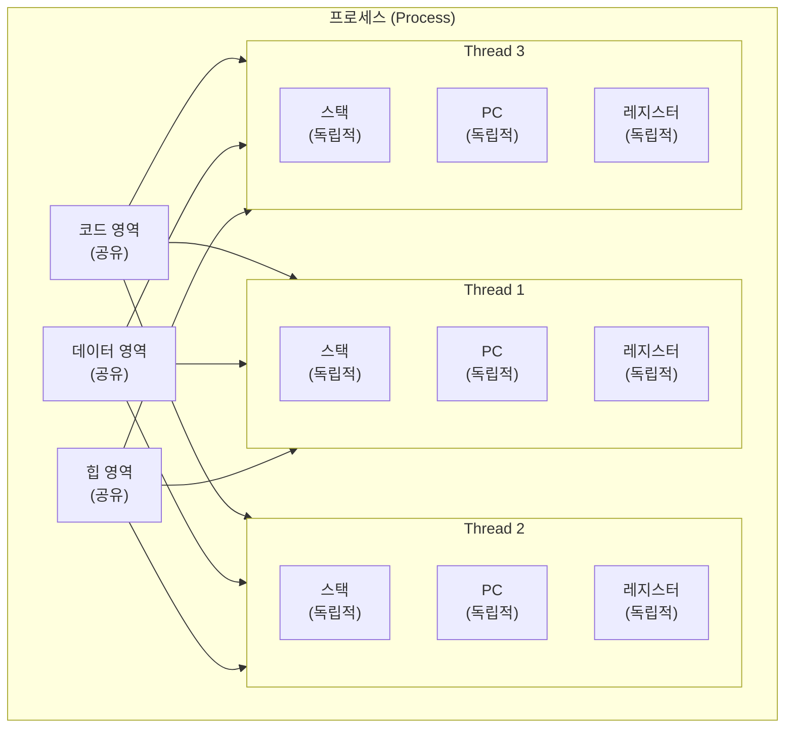

### 1.2 쓰레드의 메모리 모델

#### 🧠 메모리 가시성 (Memory Visibility)

메모리 가시성 문제는 한 쓰레드가 메모리를 변경했을 때 다른 쓰레드가 그 변경사항을 즉시 볼 수 없는 문제입니다. 

**문제 상황**: Thread 1이 `flag = true`로 설정했지만, Thread 2는 `while (!flag)` 루프에서 무한 대기할 수 있습니다.

**원인**: 
1. **CPU 캐시**: 각 CPU 코어가 자신만의 캐시를 가지고 있어, 메인 메모리의 변경사항이 즉시 반영되지 않을 수 있습니다.
2. **컴파일러 최적화**: 변수 읽기를 레지스터에 캐싱하거나, 루프 최적화로 메모리 재읽기를 생략할 수 있습니다.
3. **프로세서 재정렬**: 명령어 순서가 변경될 수 있습니다.

**해결 방법**: 
- **volatile 키워드**: 캐시를 무시하고 직접 메모리에 접근합니다.
- **synchronized 블록**: 메모리 배리어를 삽입하여 순서를 보장합니다.
- **Atomic 변수**: 하드웨어 레벨에서 동기화를 보장합니다.

#### 🔄 하드웨어 메모리 일관성

멀티코어 시스템에서 각 CPU 코어는 L1 캐시를 가지며, L2/L3 공유 캐시를 통해 메인 메모리와 통신합니다. 

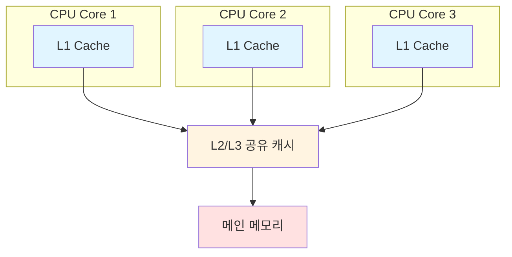

**캐시 일관성 프로토콜**: MESI 프로토콜(Modified, Exclusive, Shared, Invalid)을 통해 캐시 일관성을 유지합니다. 한 코어가 메모리를 쓰면 다른 코어의 캐시가 무효화됩니다.

**메모리 배리어**: Load Barrier(읽기 배리어), Store Barrier(쓰기 배리어), Full Barrier(전체 배리어)를 통해 메모리 접근 순서를 보장합니다.


### 1.3 쓰레드 스케줄링과 우선순위

#### 🎯 쓰레드 우선순위

각 쓰레드는 우선순위 값을 가지며, 높은 우선순위는 더 자주 실행될 가능성이 높습니다. 운영체제가 스케줄링 시 이를 고려합니다.

**Java 예시**: `Thread.MIN_PRIORITY = 1`, `Thread.NORM_PRIORITY = 5`, `Thread.MAX_PRIORITY = 10`

**주의사항**: 우선순위는 "힌트"일 뿐이며, 운영체제가 무시할 수 있습니다. 플랫폼별로 동작이 다를 수 있으므로 우선순위에만 의존하면 안 됩니다.

#### ⏰ 쓰레드 스케줄링 알고리즘

**1. 라운드 로빈 (Round Robin)**: 시간 할당량(Time Quantum) 기반으로 각 쓰레드에 동일한 시간을 할당합니다. 공정한 CPU 시간 분배와 예측 가능한 응답 시간을 제공합니다.

**2. 우선순위 기반 (Priority-Based)**: 높은 우선순위 쓰레드를 우선 실행합니다. 실시간 시스템에 적합하지만, 기아 현상과 우선순위 역전 문제가 발생할 수 있습니다.

**3. 다단계 큐 (Multilevel Queue)**: 여러 큐를 우선순위별로 관리하며, 상위 큐가 비어야 하위 큐가 실행됩니다. 대화형 작업과 배치 작업을 분리합니다.

**4. 다단계 피드백 큐 (MLFQ)**: 쓰레드가 큐 간 이동 가능하며, I/O 바운드 작업은 상위 큐로, CPU 바운드 작업은 하위 큐로 이동합니다. 적응형 스케줄링을 제공합니다.


### 1.4 쓰레드의 특징

**경량성 (Lightweight)**: 프로세스보다 생성/소멸이 빠르고(~0.1ms, 프로세스는 ~1ms), 메모리 사용량이 적으며, 컨텍스트 스위칭 비용이 낮습니다.

**공유성 (Shared Resources)**: 같은 프로세스 내 쓰레드들은 메모리 공간을 공유합니다. 코드, 데이터, 힙 영역을 공유하여 통신이 간단하고 빠릅니다.

**독립성 (Independent Execution)**: 각 쓰레드는 독립적인 실행 흐름을 가지며, 자신만의 스택, PC, 레지스터를 보유합니다. 병렬 실행이 가능합니다.

### 1.5 쓰레드의 내부 동작 원리

#### 🔄 컨텍스트 스위칭 (Context Switching)

컨텍스트 스위칭은 한 쓰레드에서 다른 쓰레드로 실행을 전환하는 과정입니다.

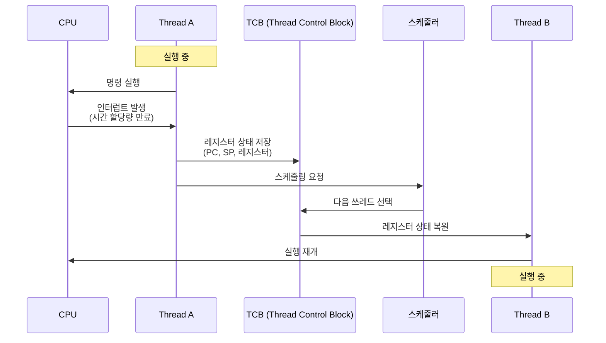

**과정**: 
1. 현재 쓰레드의 CPU 레지스터(PC, SP, 범용 레지스터), 스택 포인터, 실행 상태를 TCB에 저장합니다.
2. 스케줄러가 다음 실행할 쓰레드를 선택합니다.
3. 선택된 쓰레드의 TCB에서 레지스터 상태를 복원하고 실행을 재개합니다.

**비용**: 프로세스 간 컨텍스트 스위칭은 ~1-10 마이크로초, 쓰레드 간은 ~0.1-1 마이크로초로 약 10배 빠릅니다. 이는 메모리 공간을 공유하므로 메모리 관리 정보를 변경할 필요가 없기 때문입니다.

#### 🧠 쓰레드 제어 블록 (TCB: Thread Control Block)

TCB는 쓰레드의 모든 상태 정보를 저장하는 자료구조입니다. Thread ID, 상태(RUNNING/READY/WAITING), 우선순위, CPU 상태(PC, SP, 레지스터), 스택 정보, 스케줄링 정보, 동기화 정보 등을 포함합니다.

TCB의 역할: 쓰레드 상태 저장, 컨텍스트 스위칭 지원, 스케줄링 정보 관리, 동기화 정보 추적

#### ⚡ 쓰레드 상태 전이 (State Transition)

쓰레드는 다음과 같은 상태를 거칩니다:

- **NEW**: 쓰레드 객체가 생성되었지만 아직 시작되지 않은 상태
- **READY**: 실행 가능하며 CPU 할당을 대기하는 상태
- **RUNNING**: CPU를 할당받아 실행 중인 상태
- **WAITING**: I/O, 락, 조건 변수 등으로 대기 중인 상태
- **TERMINATED**: 실행이 완료되어 종료된 상태

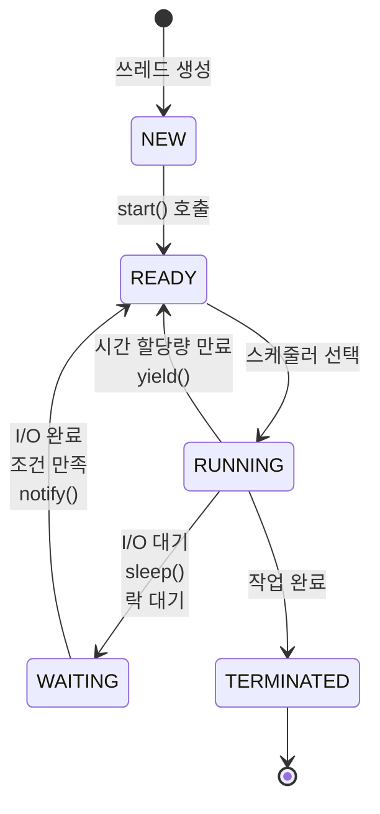


### 1.6 동시성(Concurrency) vs 병렬성(Parallelism)

**동시성 (Concurrency)**: 여러 작업을 "동시에 진행"하는 것처럼 보이게 하는 것입니다. 단일 코어에서 시간 분할로 빠르게 전환하여 동시에 실행되는 것처럼 보입니다. 목적은 응답성 향상입니다.

**병렬성 (Parallelism)**: 여러 작업을 "실제로 동시에" 실행하는 것입니다. 멀티코어에서 각 코어가 다른 작업을 동시에 처리합니다. 목적은 처리량 증가입니다.

**관계**: 병렬성은 동시성의 특수한 경우입니다. 동시성은 병렬성 없이도 가능하지만, 병렬성은 항상 동시성을 포함합니다.

```mermaid
gantt
    title 동시성 (Concurrency) - 단일 코어
    dateFormat X
    axisFormat %L ms
    
    section Task 1
    실행 :0, 10
    대기 :10, 10
    실행 :20, 10
    대기 :30, 10
    
    section Task 2
    대기 :0, 10
    실행 :10, 10
    대기 :20, 10
    실행 :30, 10
    
    section Task 3
    대기 :0, 20
    실행 :20, 10
    대기 :30, 10
```

```mermaid
gantt
    title 병렬성 (Parallelism) - 멀티코어
    dateFormat X
    axisFormat %L ms
    
    section CPU 1
    Task 1 실행 :0, 40
    
    section CPU 2
    Task 2 실행 :0, 40
    
    section CPU 3
    Task 3 실행 :0, 40
```

### 1.7 쓰레드 생성 방식

**방식 1: 요청 시 생성 (On-Demand Creation)**: 작업 요청 시 쓰레드를 생성합니다. 생성 시간은 ~0.1ms이며, 작업마다 메모리를 할당/해제하므로 오버헤드가 있습니다.

**방식 2: 쓰레드풀 사용 (Thread Pool)**: 미리 생성된 쓰레드 풀에서 쓰레드를 할당합니다. 할당 시간은 ~0.001ms로 약 100배 빠르며, 메모리를 미리 할당하여 재사용하므로 오버헤드가 최소화됩니다.


---

## 2. 쓰레드풀(Thread Pool)이란?

### 2.1 쓰레드풀의 기본 개념

> 💡 **핵심 정의**: 쓰레드풀은 **미리 생성된 쓰레드들의 집합**을 관리하는 패턴입니다.

#### 📚 쓰레드풀 패턴의 등장 배경

**문제 상황**: 
1. 쓰레드 생성 비용이 높습니다(시스템 호출, 메모리 할당, 초기화 작업으로 총 ~0.1ms 소요).
2. 대량 작업 처리 시 1000개 작업 = 1000개 쓰레드 생성으로 메모리 과다 사용 및 시스템 리소스 고갈이 발생합니다.
3. 짧은 작업의 경우 생성 시간이 실행 시간보다 길 수 있어 비효율적입니다.

**해결책**: 쓰레드풀 패턴으로 미리 쓰레드를 생성하고, 작업이 도착하면 즉시 할당하며, 작업 완료 후 재사용합니다. 생성 비용을 한 번만 지불합니다.

#### 🎯 쓰레드풀의 디자인 패턴 관점

쓰레드풀은 객체 풀 패턴(Object Pool Pattern)의 적용 사례입니다. 비용이 큰 객체(쓰레드)를 미리 생성하고, 필요 시 풀에서 빌려 사용한 후 반환하여 재사용합니다. 데이터베이스 연결 풀, 소켓 연결 풀, 메모리 버퍼 풀 등도 같은 패턴을 사용합니다.

### 2.2 쓰레드풀의 구성 요소

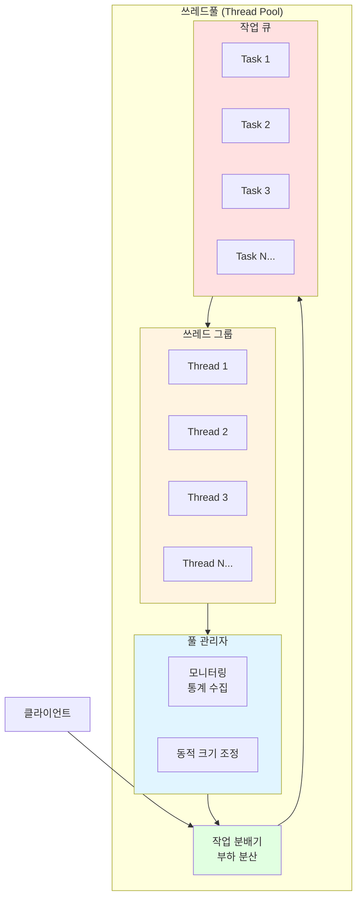

**1. 쓰레드 풀**: 미리 생성된 쓰레드들의 집합으로, 최소/최대 쓰레드 수를 설정할 수 있으며 쓰레드 생명주기를 관리합니다.

**2. 작업 큐**: 실행 대기 중인 작업들을 저장하는 큐로, FIFO 또는 우선순위 큐를 사용하며 큐 크기를 제한할 수 있습니다.

**3. 작업 분배기**: 작업을 쓰레드에 할당하는 역할로, 부하 분산 로직과 쓰레드 상태를 관리합니다.

**4. 풀 관리자**: 풀 크기를 동적으로 조정하고, 쓰레드를 생성/제거하며, 모니터링 및 통계를 수집합니다.

### 2.3 쓰레드풀의 내부 동작 원리

#### 🔍 작업 큐의 동작 방식

작업 큐는 BlockingQueue를 사용하여 구현됩니다. Producer(작업 제출자)는 `queue.offer(task)`로 작업을 추가하고, Consumer(작업 처리 쓰레드)는 `queue.take()`로 작업을 가져옵니다. 큐가 가득 찬 경우 거부 정책에 따라 처리합니다.

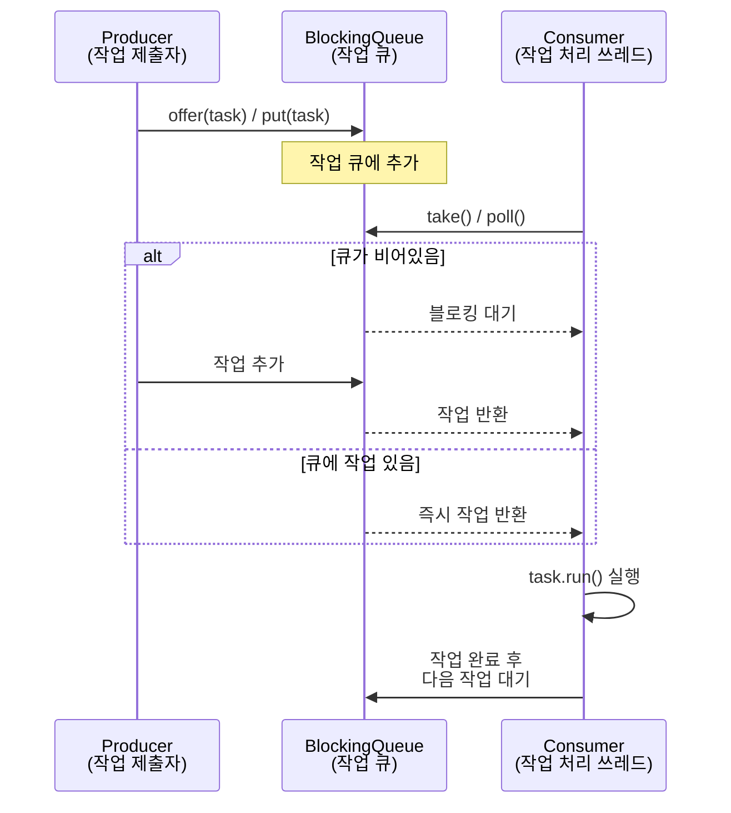

**큐 종류**: LinkedBlockingQueue(무제한), ArrayBlockingQueue(크기 제한), PriorityBlockingQueue(우선순위), SynchronousQueue(직접 전달)

#### 🔐 쓰레드풀의 동기화 메커니즘

**동기화가 필요한 영역**:
1. 작업 큐 접근: 여러 Producer와 Consumer가 동시에 접근하므로 BlockingQueue(스레드 안전)를 사용합니다.
2. 풀 크기 관리: 쓰레드 추가/제거 시 카운터 업데이트가 필요하므로 AtomicInteger, synchronized를 사용합니다.
3. 쓰레드 상태 관리: 쓰레드 상태 변경과 종료 플래그 확인에 volatile, synchronized를 사용합니다.

#### ⚙️ 쓰레드풀의 스케줄링 전략

**1. FIFO (First In First Out)**: 먼저 들어온 작업부터 처리하는 기본 방식으로, 공정하지만 긴 작업이 앞에 있으면 지연될 수 있습니다.

**2. 우선순위 기반**: 높은 우선순위 작업을 먼저 처리하지만, 구현이 복잡하고 낮은 우선순위 작업이 기아 상태에 빠질 수 있습니다.

**3. 작업 스티링 (Work Stealing)**: 각 쓰레드가 자신의 큐를 가지고, 자신의 큐가 비면 다른 큐에서 작업을 가져옵니다. ForkJoinPool에서 사용됩니다.

**4. 라운드 로빈**: 쓰레드에 순차적으로 할당하여 균등한 작업 분배를 제공합니다.

### 2.4 쓰레드풀의 성능 분석

#### 📊 성능 벤치마크

실제 테스트 환경(Intel i7-8700K, 6코어, 12쓰레드)에서 10,000개의 짧은 작업(각 1ms)을 처리한 결과:

- 일반 쓰레드: 2.5초, 450MB 메모리
- 쓰레드풀(10): 1.0초, 50MB 메모리 (약 2.5배 빠름, 메모리 9배 감소)
- 쓰레드풀(20): 0.6초, 80MB 메모리
- 쓰레드풀(50): 0.5초, 150MB 메모리

최적 풀 크기는 코어 수의 2-3배입니다.


#### ⚡ 쓰레드풀의 성능 최적화 기법

**1. 작업 큐 최적화**: Lock-Free 큐를 사용하여 CAS(Compare-And-Swap) 연산으로 락 경합을 최소화합니다. Work-Stealing 큐로 각 쓰레드가 자신의 큐를 가지면 부하 분산 효과가 있습니다.

**2. 쓰레드 로컬 스토리지 (TLS)**: 각 쓰레드가 독립적인 저장소를 가져 동기화 없이 접근 가능하며 캐시 친화적입니다.

**3. False Sharing 방지**: 같은 캐시 라인을 수정하지 않도록 패딩을 사용하거나 @Contended 어노테이션을 활용합니다.

**4. 적응형 풀 크기**: 부하에 따라 동적으로 조정하며, 큐 크기와 CPU 사용률을 모니터링하여 최적화합니다.

### 2.5 쓰레드풀의 동작 원리

**1. 초기화 단계**: 최소 쓰레드 수만큼 미리 생성하고, 작업 큐를 초기화하며, 쓰레드들이 작업 대기 상태로 진입합니다.

**2. 작업 처리 단계**: 작업 도착 → 큐에 추가 → 대기 중인 쓰레드가 작업 가져옴 → 작업 실행 → 완료 후 쓰레드가 풀로 복귀(재사용)

**3. 동적 조정 단계**: 큐에 작업이 많이 쌓이면 최대 크기까지 쓰레드 추가 생성, 작업이 줄어들면 유휴 쓰레드 제거(최소 크기 유지)

**4. 종료 단계**: 새로운 작업 수락 중지 → 진행 중인 작업 완료 대기 → 모든 쓰레드 종료 → 리소스 정리

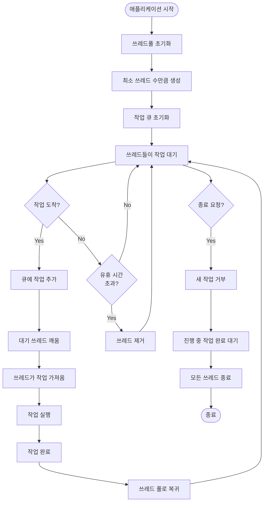


---

## 3. 쓰레드 동기화와 경쟁 조건

### 3.1 경쟁 조건 (Race Condition)

경쟁 조건은 여러 쓰레드가 공유 자원에 동시에 접근할 때, 실행 순서에 따라 결과가 달라지는 상황입니다.

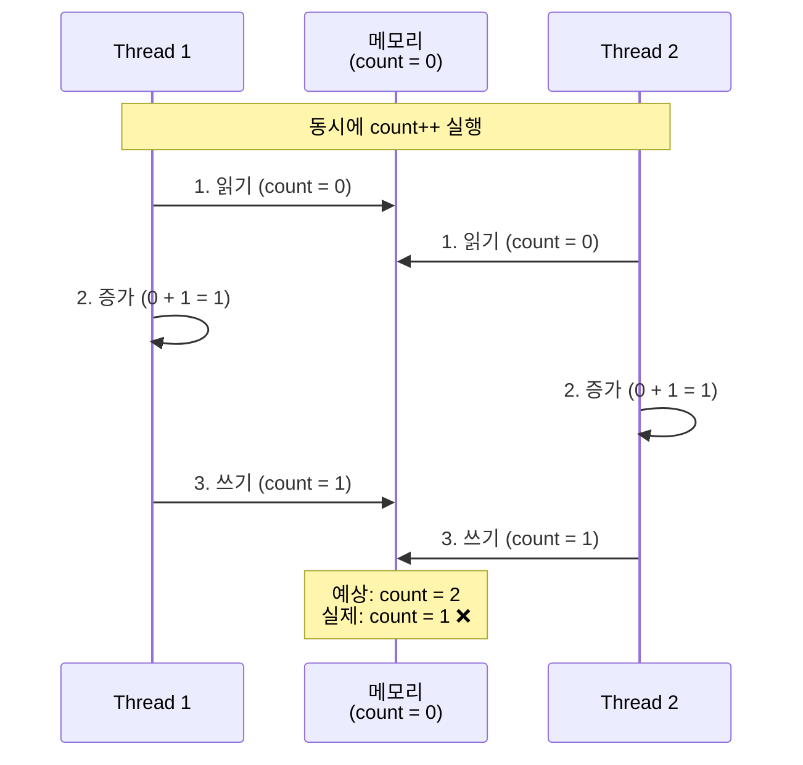

**예시**: 두 쓰레드가 동시에 `count++`를 실행하면, 둘 다 같은 값을 읽어와서 1씩 증가시킨 후 저장하므로 결과적으로 2번 증가시켰지만 1번만 증가한 것처럼 보입니다.

**원인**: 읽기-수정-쓰기(Read-Modify-Write) 연산이 원자적이지 않으며, CPU 캐시로 인한 메모리 가시성 문제, 컴파일러 최적화로 인한 명령어 재배치 등이 있습니다.

**해결 방법**: 뮤텍스, 세마포어, 원자적 연산, 동기화된 자료구조를 사용합니다.

### 3.2 동기화 메커니즘

**뮤텍스 (Mutex)**: 상호 배제를 위한 기본 동기화 도구로, 한 번에 하나의 쓰레드만 접근할 수 있습니다. Lock/Unlock 쌍으로 사용합니다.

**세마포어 (Semaphore)**: N개의 리소스 접근을 제어하는 카운터 기반 메커니즘으로, P(wait)/V(signal) 연산을 사용합니다.

**원자적 연산 (Atomic Operations)**: 하드웨어 레벨에서 원자적 보장을 제공하며, 락 없이도 동기화가 가능하고 성능이 우수합니다.

**조건 변수 (Condition Variable)**: 쓰레드 간 신호 전달을 통해 특정 조건이 만족될 때까지 대기시킵니다. wait()/notify()/notifyAll()을 사용합니다.

### 3.3 데드락 (Deadlock)

데드락은 두 개 이상의 쓰레드가 서로가 가진 자원을 기다리며 무한 대기하는 상황입니다.

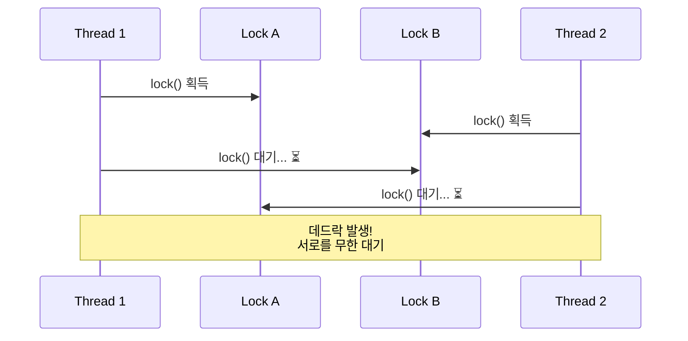

**데드락 발생 조건 (4가지 모두 필요)**:
1. 상호 배제: 자원이 한 번에 하나의 쓰레드만 사용 가능
2. 점유 대기: 쓰레드가 자원을 보유한 채 다른 자원을 대기
3. 비선점: 다른 쓰레드가 강제로 자원을 빼앗을 수 없음
4. 순환 대기: 쓰레드들이 순환적으로 서로를 기다림

**예방 방법**: 락 순서 통일, 타임아웃 설정, 락 계층 구조, 데드락 탐지


---

## 4. 쓰레드 vs 쓰레드풀: 핵심 차이점

### 4.1 생성 및 관리 방식

**일반 쓰레드**: 작업 요청 시 즉시 생성하며, 작업 시작 시 생성되고 작업 완료 시 소멸합니다. 수동으로 각 쓰레드를 개별 추적해야 합니다.

**쓰레드풀**: 애플리케이션 시작 시 미리 생성하며, 애플리케이션 종료 시까지 유지됩니다. 작업 완료 후 풀로 복귀하며, 풀 관리자에 의해 자동 관리됩니다.

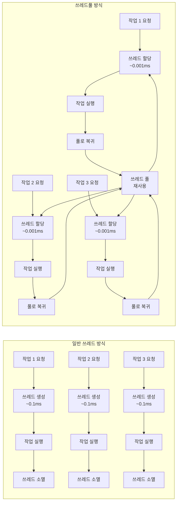

### 4.2 성능 비교

**작업 시작 지연 시간**: 일반 쓰레드는 ~0.15ms(생성 0.1ms + 초기화 0.05ms), 쓰레드풀은 ~0.001ms로 약 150배 빠릅니다.

**메모리 사용량**: 일반 쓰레드는 작업마다 메모리 할당/해제로 단편화 가능성이 있고 피크 사용량이 높습니다. 쓰레드풀은 미리 할당된 메모리를 재사용하여 단편화가 최소화되고 일정한 메모리 사용량을 유지합니다.

**오버헤드**: 일반 쓰레드는 매번 생성/소멸 오버헤드와 시스템 호출 비용, 컨텍스트 스위칭 증가가 있습니다. 쓰레드풀은 생성/소멸 오버헤드가 최소화되고 재사용으로 효율성이 향상되며 예측 가능한 성능을 제공합니다.

### 4.3 사용 시나리오 비교

**일반 쓰레드를 사용하는 경우**: 작업이 드물게 발생하거나 작업 간 간격이 길 때, 작업 시간이 매우 길 때, 쓰레드 수를 예측하기 어려울 때, 간단한 프로토타입에서 사용합니다. 예: 백그라운드 파일 다운로드, 주기적인 데이터 백업

**쓰레드풀을 사용하는 경우**: 작업이 빈번하게 발생하거나 짧은 작업이 많을 때, 동시 처리량이 중요할 때, 리소스 사용량을 제한하고 싶을 때, 프로덕션 환경에서 사용합니다. 예: 웹 서버 요청 처리, 데이터베이스 연결 풀, 이미지 처리 작업


---

## 5. 쓰레드풀의 고급 기능

### 5.1 작업 거부 정책 (Rejection Policy)

큐가 가득 차고 모든 쓰레드가 바쁠 때 새로운 작업을 어떻게 처리할지 결정하는 정책입니다.

**1. AbortPolicy (기본)**: RejectedExecutionException을 발생시켜 호출자에게 예외를 전달합니다. 빠른 실패(Fail Fast) 방식으로 중요한 작업에 적합합니다.

**2. CallerRunsPolicy**: 호출한 쓰레드에서 직접 실행하여 풀이 바쁠 때 호출자가 처리합니다. 풀에 부하를 주지 않으며 작업이 반드시 처리되어야 할 때 사용합니다.

**3. DiscardPolicy**: 작업을 조용히 버리며 예외 없이 무시합니다. 작업 손실이 허용되거나 최신 작업만 처리해도 될 때 사용합니다.

**4. DiscardOldestPolicy**: 가장 오래된 작업을 버리고 새 작업을 큐에 추가합니다. 최신 데이터가 더 중요하거나 오래된 작업이 의미가 없을 때 사용합니다.

**5. 커스텀 정책**: RejectedExecutionHandler를 구현하여 특정 비즈니스 로직을 적용할 수 있습니다. 로깅, 재시도, 대체 처리 등을 구현할 수 있습니다.

### 5.2 쓰레드풀 모니터링

**핵심 메트릭**:
1. 풀 크기: 현재 쓰레드 수, 최소/최대 쓰레드 수, 활성 쓰레드 수
2. 작업 큐 상태: 큐 크기, 큐 용량, 큐 사용률
3. 작업 처리 통계: 완료된 작업 수, 거부된 작업 수, 평균/최대/최소 처리 시간
4. 쓰레드 상태: 실행 중인 쓰레드, 대기 중인 쓰레드, 유휴 쓰레드

**모니터링 도구**: JMX(Java Management Extensions), Micrometer/Prometheus, 커스텀 로깅, 프로파일링 도구(VisualVM, JProfiler)

### 5.3 쓰레드풀의 종료 전략

**shutdown() - 정상 종료**: 새로운 작업 수락을 중지하고, 진행 중인 작업은 완료 대기를 하며, 큐에 대기 중인 작업도 처리합니다. 블로킹되지 않는 비동기 방식이며, `awaitTermination(timeout)`으로 종료 완료까지 대기할 수 있습니다.

**shutdownNow() - 강제 종료**: 즉시 모든 작업 중단을 시도하며, 진행 중인 작업에 interrupt()를 전송하고, 큐의 미처리 작업을 반환합니다. 빠른 종료가 필요할 때 사용하지만, 작업이 interrupt를 처리해야 하고 리소스 정리가 필요할 수 있습니다.

**종료 흐름**: shutdown() 호출 → 새로운 작업 거부 시작 → 진행 중인 작업 완료 대기 → 큐의 작업 처리 완료 → 모든 쓰레드 종료 → 리소스 정리


---

## 6. 쓰레드와 쓰레드풀의 관계

### 6.1 계층적 관계

쓰레드풀은 쓰레드들의 컨테이너 역할을 하며, 쓰레드는 쓰레드풀의 구성 요소입니다. 쓰레드풀은 쓰레드의 생명주기를 관리하고, 쓰레드는 실제 작업을 수행하는 실행 단위입니다.

애플리케이션 → 쓰레드풀(관리 및 제어 로직: 풀 크기 관리, 작업 큐 관리, 쓰레드 할당) → 쓰레드들(실제 실행 단위)

### 6.2 상호 보완적 관계

쓰레드풀 = 쓰레드(기본 구성 요소: 실행 단위, 작업 수행, 독립적 실행) + 관리 패턴(재사용 메커니즘, 작업 큐 관리, 풀 크기 제어, 부하 분산) = 통합 솔루션(효율적인 쓰레드 관리, 성능 최적화, 리소스 제어, 확장 가능한 구조)

쓰레드풀은 쓰레드를 더 효율적으로 사용하기 위한 디자인 패턴입니다.


---

## 7. 쓰레드풀의 장점과 단점

### 7.1 쓰레드풀의 장점

**1. 성능 향상**: 쓰레드 생성/소멸 오버헤드를 제거하고, 작업 시작 지연 시간을 최소화하며, 재사용으로 효율성이 향상되고 예측 가능한 성능을 제공합니다.

**2. 리소스 관리**: 최대 쓰레드 수를 제한하여 메모리 사용량을 예측 가능하게 하고, 시스템 리소스를 보호하며 메모리 단편화를 최소화합니다.

**3. 부하 제어**: 동시 실행 쓰레드 수를 제한하고, 작업 큐를 통한 부하 분산으로 시스템 과부하를 방지하며 안정적인 성능을 유지합니다.

**4. 관리 용이성**: 중앙 집중식 관리로 모니터링 및 통계 수집이 용이하고, 디버깅이 상대적으로 쉬우며 설정 및 튜닝이 간단합니다.

### 7.2 쓰레드풀의 단점

**1. 초기 설정 복잡성**: 최적 풀 크기 결정이 어렵고, 작업 특성에 따른 튜닝이 필요하며, 잘못된 설정 시 성능이 저하될 수 있습니다.

**2. 메모리 사용**: 미리 할당된 쓰레드로 인한 초기 메모리 사용과 유휴 쓰레드의 메모리 점유가 있습니다.

**3. 유연성 제한**: 풀 크기 제한으로 인한 확장성 제한, 긴 작업이 풀을 점유할 수 있으며, 작업 우선순위 관리가 복잡할 수 있습니다.

**4. 구현 복잡성**: 풀 관리 로직 구현이 필요하고, 작업 큐 관리가 복잡하며, 동기화 문제 가능성이 있습니다.


---

## 8. 실제 구현 예시

### 8.1 Java의 ExecutorService (쓰레드풀)

#### 📚 Java 쓰레드풀의 종류

**1. FixedThreadPool**: 고정 크기 쓰레드풀로 무제한 작업 큐를 사용하며 쓰레드 수가 변동하지 않습니다.

**2. CachedThreadPool**: 동적 크기 조정이 가능하며 60초 유휴 시 쓰레드를 제거하고 짧은 작업에 적합합니다.

**3. ScheduledThreadPool**: 지연 실행과 주기적 실행을 지원하며 타이머 기능을 제공합니다.

**4. ForkJoinPool**: Work-Stealing 알고리즘을 사용하며 재귀적 작업 분할과 병렬 스트림에서 사용됩니다.

**5. ThreadPoolExecutor (커스텀)**: 완전한 커스터마이징이 가능하며 모든 파라미터를 제어할 수 있습니다.

#### 💻 Java 코드 예시

```java
// 기본 쓰레드풀 사용
ExecutorService threadPool = Executors.newFixedThreadPool(10);

// 작업 제출
for (int i = 0; i < 100; i++) {
    final int taskId = i;
    threadPool.submit(() -> {
        // 작업 실행
        System.out.println("Task " + taskId + " 실행 중");
        // 작업 처리...
    });
}

// Future를 통한 결과 처리
Future<String> future = threadPool.submit(() -> {
    // 작업 수행
    return "결과";
});

try {
    String result = future.get(); // 블로킹 대기
    // 또는
    String result = future.get(5, TimeUnit.SECONDS); // 타임아웃
} catch (ExecutionException e) {
    // 예외 처리
}

// 쓰레드풀 종료
threadPool.shutdown();
try {
    if (!threadPool.awaitTermination(60, TimeUnit.SECONDS)) {
        threadPool.shutdownNow();
    }
} catch (InterruptedException e) {
    threadPool.shutdownNow();
}
```

### 8.2 Python의 ThreadPoolExecutor

#### 🐍 Python 쓰레드풀 특징

**GIL (Global Interpreter Lock) 영향**: Python은 GIL로 인해 진정한 병렬 실행이 제한적입니다. I/O 바운드 작업에는 효과적(GIL이 I/O 대기 중 해제됨)이지만, CPU 바운드 작업에는 비효율적이어서 멀티프로세싱을 권장합니다.

**ThreadPoolExecutor vs ProcessPoolExecutor**: ThreadPoolExecutor는 I/O 작업에 적합하고 메모리 공유가 가능하지만 GIL 제약이 있습니다. ProcessPoolExecutor는 CPU 집약적 작업에 적합하고 GIL 제약이 없지만 프로세스 간 통신이 필요합니다.

#### 💻 Python 코드 예시

```python
from concurrent.futures import ThreadPoolExecutor, as_completed
import time

# 기본 사용
with ThreadPoolExecutor(max_workers=10) as executor:
    # 작업 제출
    futures = []
    for i in range(100):
        future = executor.submit(process_task, i)
        futures.append(future)
    
    # 결과 수집 (완료 순서대로)
    for future in as_completed(futures):
        try:
            result = future.result(timeout=5)
            print(f"결과: {result}")
        except Exception as e:
            print(f"에러: {e}")

# 맵 함수 사용 (간단한 경우)
with ThreadPoolExecutor(max_workers=10) as executor:
    results = executor.map(process_task, range(100))
    for result in results:
        print(result)

# 콜백 함수 사용
def on_complete(future):
    try:
        result = future.result()
        print(f"완료: {result}")
    except Exception as e:
        print(f"실패: {e}")

with ThreadPoolExecutor(max_workers=10) as executor:
    future = executor.submit(process_task, 1)
    future.add_done_callback(on_complete)
```

### 8.3 일반 쓰레드 vs 쓰레드풀 비교

**일반 쓰레드 방식**: 작업마다 새 쓰레드를 생성하므로 100개 작업 = 100개 쓰레드 생성으로 메모리 과다 사용과 시스템 부하가 발생합니다.

**쓰레드풀 방식**: 최대 10개 쓰레드만 사용하여 메모리 효율적이고 시스템 안정성을 제공합니다. 풀에서 쓰레드를 재사용하므로 오버헤드가 최소화됩니다.

---

## 9. 쓰레드풀 크기 결정

### 9.1 풀 크기 결정 공식

**CPU 집약적 작업**: 풀 크기 = CPU 코어 수 + 1 (예: 8코어 CPU → 9개 쓰레드). 컨텍스트 스위칭을 최소화하고 CPU 활용도를 최대화합니다.

**I/O 집약적 작업**: 풀 크기 = CPU 코어 수 × (1 + 대기시간/처리시간) (예: 8코어, 대기 90ms, 처리 10ms → 8 × (1 + 90/10) = 80). I/O 대기 중 다른 작업을 처리하여 CPU 활용도를 향상시킵니다.

**혼합 작업**: CPU 작업과 I/O 작업 비율을 분석하고, 실험을 통한 최적값을 찾으며, 모니터링을 통한 동적 조정이 필요합니다.

### 9.2 동적 풀 크기 조정

**쓰레드 추가 조건**: 큐에 작업이 있고 활성 쓰레드가 최대 크기보다 작을 때, 활성 쓰레드가 코어 수보다 작으면 즉시 생성하고, 큐 크기가 임계값보다 크면 새 쓰레드를 생성합니다.

**쓰레드 제거 조건**: 유휴 시간이 keepAliveTime보다 길고 현재 쓰레드 수가 코어 수보다 클 때 쓰레드를 종료하고 풀 크기를 감소시킵니다.

**타이밍**: 쓰레드 추가는 작업 제출 시 즉시 체크하고, 쓰레드 제거는 주기적으로 스캔합니다(예: 1초마다).


---

## 10. 실제 사용 사례

### 10.1 웹 서버

웹 서버는 클라이언트 요청을 요청 큐에 추가하고, 쓰레드풀의 쓰레드가 각 요청을 처리하여 HTTP 응답을 반환합니다. 동시 요청을 처리하고 리소스를 제한(최대 동시 연결 수)하며, 빠른 응답 시간과 안정적인 성능을 제공합니다.

### 10.2 데이터베이스 연결 풀

애플리케이션은 연결 풀에서 데이터베이스 연결을 획득하여 사용한 후 반환합니다. 연결 생성 비용을 절감하고, 연결 수를 제한하여 DB 부하를 방지하며, 빠른 쿼리 실행과 리소스 효율성을 제공합니다.


---

## 11. 쓰레드풀 구현 세부사항

### 11.1 쓰레드풀의 내부 상태 관리

쓰레드풀은 다음 상태를 거칩니다:

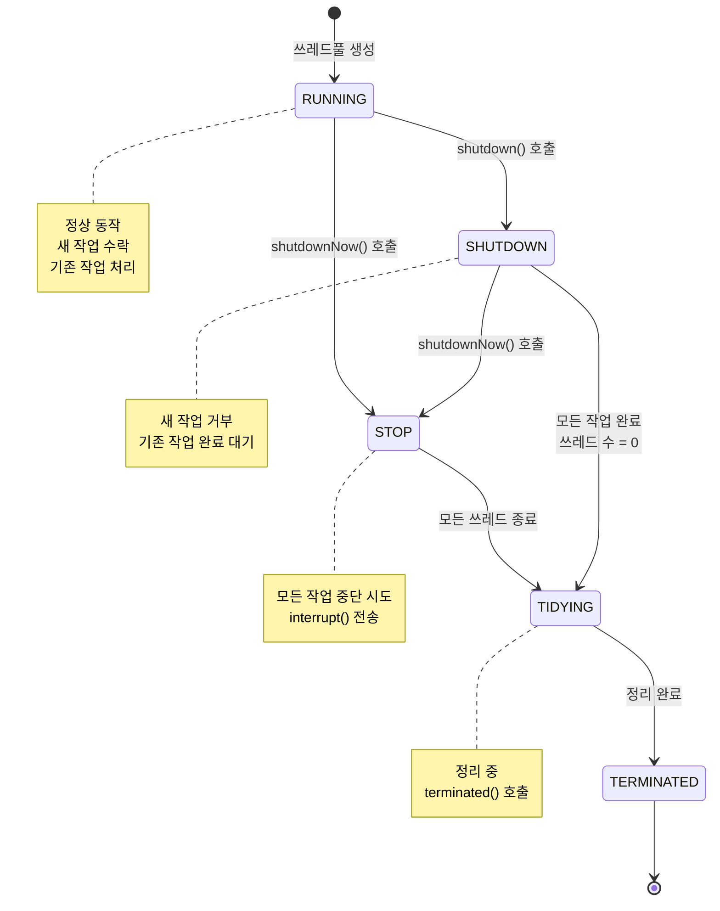

**상태 설명**:
- **RUNNING**: 정상 동작 중, 새 작업 수락 및 처리
- **SHUTDOWN**: shutdown() 호출 후, 새 작업 거부하지만 기존 작업은 완료 대기
- **STOP**: shutdownNow() 호출 후, 모든 작업 중단 시도
- **TIDYING**: 모든 쓰레드 종료 후 정리 중
- **TERMINATED**: 완전 종료

### 11.2 쓰레드풀의 작업 실행 흐름

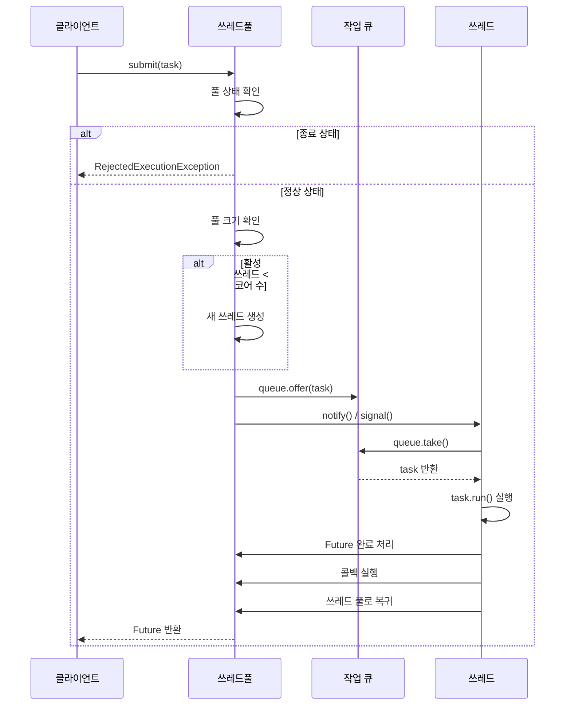

**단계별 설명**: submit(task) 호출 → 풀 상태 확인(종료 상태면 거부) → 풀 크기 확인(활성 쓰레드 < 코어 수면 새 쓰레드 생성) → 큐에 작업 추가 → 대기 쓰레드 깨움(notify/signal) → 쓰레드가 작업 가져옴(queue.take()) → 작업 실행(task.run()) → 완료 처리(Future 완료, 콜백 실행, 쓰레드 풀로 복귀)

### 11.3 쓰레드풀의 동적 크기 조정 알고리즘

**쓰레드 추가**: 큐에 작업이 있고 활성 쓰레드 < 최대 크기일 때, 활성 쓰레드 < 코어 수면 즉시 생성하고, 큐 크기 > 임계값이면 새 쓰레드를 생성합니다.

**쓰레드 제거**: 유휴 시간 > keepAliveTime이고 현재 쓰레드 수 > 코어 수일 때 쓰레드를 종료하고 풀 크기를 감소시킵니다. 쓰레드 추가는 작업 제출 시 즉시 체크하고, 쓰레드 제거는 주기적으로 스캔합니다.


---

## 12. 트러블슈팅 가이드

### 12.1 일반적인 문제와 해결책

**문제 1: 작업이 실행되지 않음**
- 증상: 작업이 큐에 쌓이지만 실행 안 됨, 쓰레드가 대기 상태로 멈춤
- 원인: notify() 호출 누락, 데드락 발생, 쓰레드가 예외로 종료
- 해결: 작업 제출 후 notify() 확인, 예외 처리 추가, 쓰레드 덤프 분석

**문제 2: 메모리 누수**
- 증상: 시간이 지날수록 메모리 증가, GC가 자주 발생
- 원인: 완료된 Future 객체 누적, 작업 객체가 참조 유지, 쓰레드 로컬 변수 누적
- 해결: Future 결과 즉시 처리, ThreadLocal 정리, 약한 참조(WeakReference) 사용

**문제 3: 성능 저하**
- 증상: 처리량 감소, 응답 시간 증가
- 원인: 풀 크기 부적절, 락 경합 과다, 컨텍스트 스위칭 과다
- 해결: 풀 크기 튜닝, Lock-Free 자료구조 사용, 프로파일링으로 병목 지점 찾기

### 12.2 디버깅 기법

**1. 로깅 전략**: 작업 제출/완료 로깅, 쓰레드 생성/종료 로깅, 큐 크기 주기적 로깅, 예외 상세 로깅

**2. 모니터링 도구**: JVisualVM(쓰레드 상태 시각화), JProfiler(성능 프로파일링), Thread Dump(쓰레드 상태 스냅샷), JMX(실시간 메트릭 수집)

**3. 테스트 전략**: 단위 테스트(각 메서드 개별 테스트), 통합 테스트(전체 플로우 테스트), 부하 테스트(대량 작업 처리 테스트), 동시성 테스트(경쟁 조건 검증)


---

## 13. 결론

### 13.1 핵심 정리

**쓰레드 (Thread)**: 기본 실행 단위로, 작업 요청 시 생성되고 작업 완료 시 소멸합니다. 간단하지만 비효율적입니다.

**쓰레드풀 (Thread Pool)**: 쓰레드들의 집합과 관리 패턴으로, 미리 생성된 쓰레드를 재사용합니다. 효율적이고 안정적이며 프로덕션 환경에 적합합니다.

**관계**: 쓰레드풀은 쓰레드를 관리하는 패턴이며, 쓰레드는 쓰레드풀의 구성 요소입니다. 쓰레드풀 = 쓰레드 + 재사용 + 관리입니다.

**선택 기준**: 빈번한 작업 → 쓰레드풀, 드문 작업 → 일반 쓰레드, 성능 중요 → 쓰레드풀, 간단한 프로토타입 → 일반 쓰레드

### 13.2 실무 권장사항

**1. 기본적으로 쓰레드풀 사용**: 대부분의 경우 쓰레드풀이 더 효율적입니다. Java는 ExecutorService, Python은 ThreadPoolExecutor, C#은 Task.Run/Parallel.For를 사용합니다.

**2. 풀 크기 신중히 결정**: CPU 코어 수를 고려하고, 작업 특성을 분석(CPU vs I/O)하며, 모니터링을 통한 튜닝이 필요합니다.

**3. 동기화 주의**: 공유 자원 접근 시 락을 사용하고, 데드락을 방지하며, 스레드 안전한 자료구조를 활용합니다.

**4. 모니터링 및 로깅**: 쓰레드 풀 상태를 모니터링하고, 작업 처리 시간을 측정하며, 큐 크기를 추적합니다.


---

## 14. 언어별 구현 차이

### 14.1 주요 언어의 쓰레드풀 비교

**Java**: ExecutorService 인터페이스와 ThreadPoolExecutor 구현체를 제공하며, Future/Promise 패턴과 CompletableFuture(비동기 체이닝)를 지원합니다. 풍부한 기능과 유연성을 제공합니다.

**Python**: concurrent.futures 모듈의 ThreadPoolExecutor/ProcessPoolExecutor를 제공하며, GIL 제약으로 I/O 작업에 적합합니다. 간단한 API를 제공합니다.

**C# / .NET**: Task Parallel Library (TPL)와 ThreadPool.QueueUserWorkItem을 제공하며, async/await 패턴과 Task 기반 비동기 프로그래밍을 지원합니다.

**C++**: std::thread + 큐 직접 구현 또는 std::async(간단한 경우), Boost.ThreadPool을 사용하며 더 많은 제어권을 제공합니다.

**Go**: Goroutine(경량 쓰레드)과 Channel 기반 통신, Worker Pool 패턴을 사용하며 매우 효율적인 동시성을 제공합니다.

### 14.2 최신 동향: 비동기 프로그래밍과 쓰레드풀

**전통적 방식**: Thread를 생성하여 동기 작업을 수행하지만, 쓰레드가 블로킹되어 효율성이 떨어집니다.

**비동기 방식**: async/await 패턴으로 논블로킹 작업을 수행하며, 쓰레드 풀을 효율적으로 사용하고 I/O 대기 중 쓰레드를 해제하여 더 많은 동시 처리가 가능합니다.

**비교**: 동기 방식은 1000개 쓰레드로 1000개 동시 처리, 비동기 방식은 10개 쓰레드로 10000개+ 동시 처리가 가능합니다.

**예시**: Node.js(이벤트 루프 + 쓰레드풀), Python asyncio(코루틴 + 쓰레드풀), Java CompletableFuture(비동기 체이닝), C# async/await(Task 기반 비동기)


---

## 참조

- Brian Goetz et al. "Java Concurrency in Practice". Addison-Wesley, 2006.
- Doug Lea. "Concurrent Programming in Java". Addison-Wesley, 1999.
- Oracle. "Java Platform, Standard Edition Documentation - ExecutorService". https://docs.oracle.com/javase/8/docs/api/java/util/concurrent/ExecutorService.html
- Python Software Foundation. "concurrent.futures — Launching parallel tasks". https://docs.python.org/3/library/concurrent.futures.html
- Microsoft. "Thread Pooling". https://docs.microsoft.com/en-us/dotnet/standard/threading/the-managed-thread-pool
- Linux Kernel Documentation - Threading
- POSIX Threads Programming Guide

