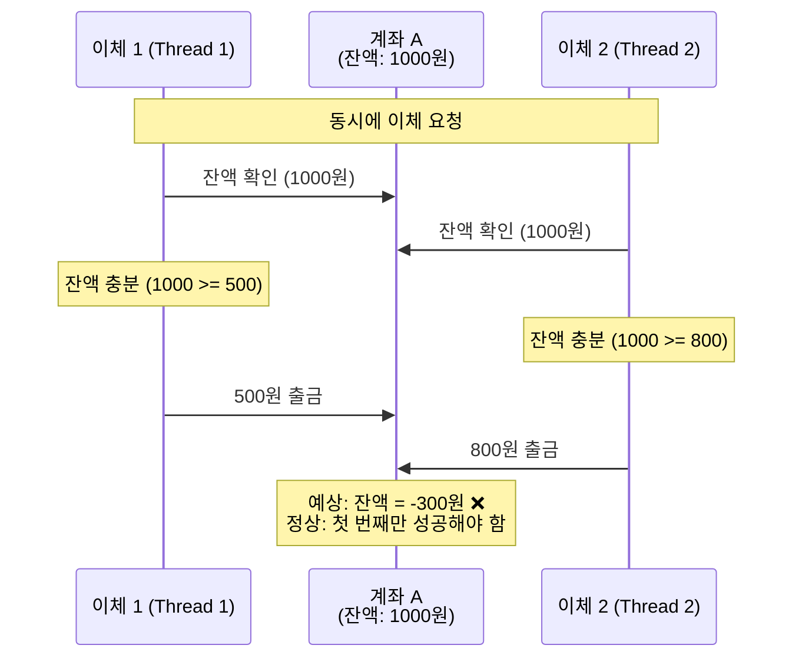
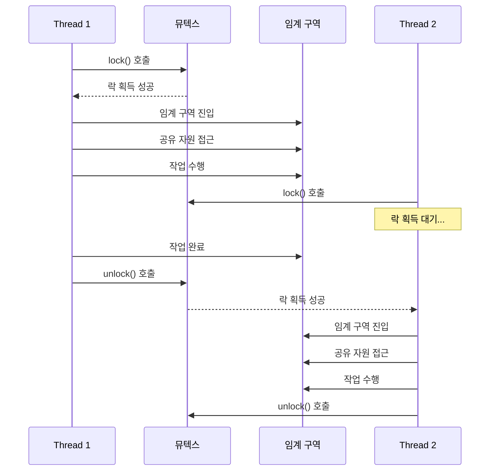
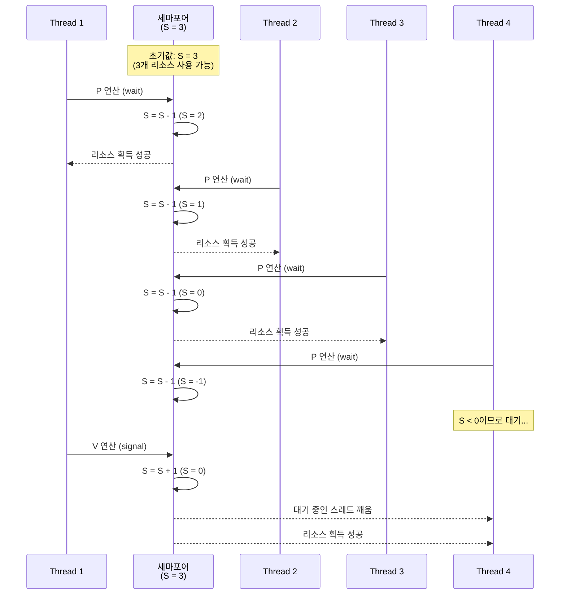
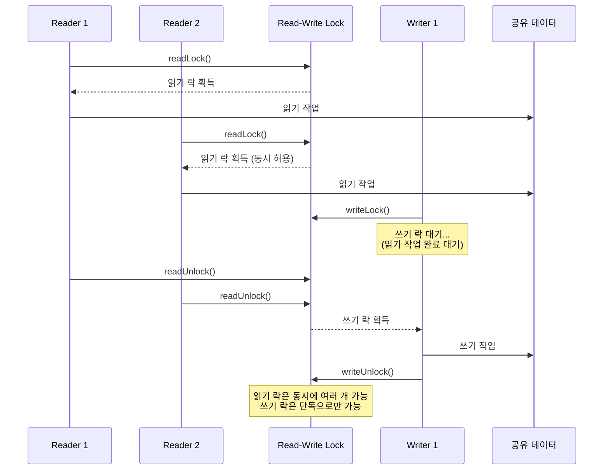
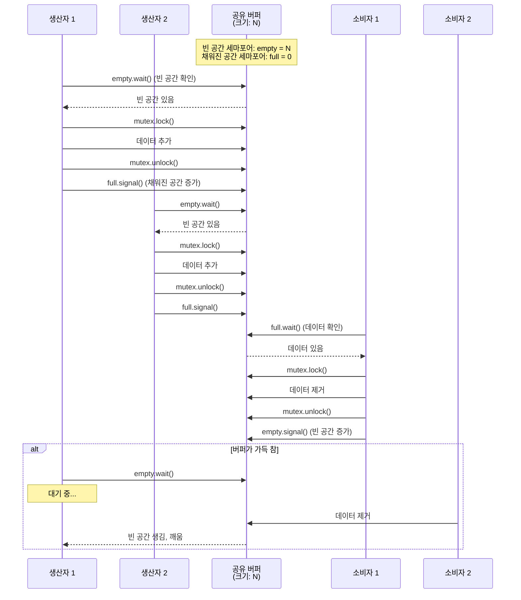

# 레이스 컨디션 (Race Condition) 완벽 가이드

## 배경

레이스 컨디션은 멀티스레드 프로그래밍에서 가장 까다로운 문제 중 하나입니다. 두 개 이상의 스레드가 같은 자원에 동시에 접근할 때, 그 실행 순서에 따라 결과가 달라지는 현상을 말합니다. 마치 두 사람이 동시에 같은 문을 열려고 할 때처럼, 누가 먼저 손잡이를 잡느냐에 따라 결과가 달라지는 것과 비슷합니다.

### 왜 레이스 컨디션이 발생하는가?

현대 컴퓨터 시스템은 성능 향상을 위해 여러 CPU 코어를 사용하고, 각 코어에서 동시에 여러 작업을 처리합니다. 이때 여러 스레드가 같은 메모리 공간이나 파일, 네트워크 연결 등의 자원을 공유하게 됩니다. 

문제는 컴퓨터가 한 번에 하나의 연산만 처리할 수 있다는 점입니다. `count++`처럼 간단해 보이는 연산도 실제로는 세 단계로 나뉩니다:
1. 메모리에서 값을 읽어오기
2. 값을 1 증가시키기  
3. 증가된 값을 메모리에 저장하기

만약 두 스레드가 동시에 `count++`를 실행한다면, 둘 다 같은 값을 읽어와서 1씩 증가시킨 후 저장하게 됩니다. 결과적으로 2번 증가시켰지만 실제로는 1번만 증가한 것처럼 보이게 됩니다.

### 핵심 개념들

**공유 자원(Shared Resource)**: 여러 스레드가 동시에 접근할 수 있는 메모리, 파일, 네트워크 연결 등의 자원입니다. 공유 자원은 읽기와 쓰기 작업이 모두 가능하며, 동시 접근 시 데이터 일관성 문제가 발생할 수 있습니다. 전역 변수, 정적 변수, 공유 객체, 파일 시스템, 네트워크 소켓 등이 공유 자원의 예입니다.

**임계 구역(Critical Section)**: 공유 자원에 접근하는 코드 부분으로, 한 번에 하나의 스레드만 실행할 수 있어야 합니다. 임계 구역은 데이터의 일관성을 보장하기 위해 보호되어야 하는 코드 영역입니다. 임계 구역에 진입하기 전에 락을 획득하고, 작업을 마친 후 락을 해제하는 방식으로 보호됩니다.

**원자성(Atomicity)**: 더 이상 나눌 수 없는 연산 단위를 의미합니다. 원자적 연산은 중간에 다른 스레드가 끼어들 수 없으며, "모두 실행되거나 전혀 실행되지 않거나" 둘 중 하나만 가능합니다. 원자성은 트랜잭션의 ACID 속성 중 하나이며, 데이터베이스뿐만 아니라 멀티스레드 프로그래밍에서도 중요한 개념입니다.

**상호 배제(Mutual Exclusion)**: 한 번에 하나의 스레드만 임계 구역에 진입할 수 있도록 보장하는 메커니즘입니다. 뮤텍스, 세마포어, 모니터 등의 동기화 메커니즘이 상호 배제를 구현합니다. 상호 배제는 레이스 컨디션을 방지하는 가장 기본적인 방법입니다.

**동기화(Synchronization)**: 여러 스레드의 실행 순서를 조정하여 데이터 일관성을 보장하는 과정입니다. 동기화는 상호 배제뿐만 아니라 스레드 간의 실행 순서 제어, 조건 기반 대기, 이벤트 신호 전달 등을 포함합니다. 적절한 동기화를 통해 멀티스레드 프로그램의 정확성과 안정성을 보장할 수 있습니다.

## 핵심

### 1. 레이스 컨디션이 발생하는 근본 원인

#### 메모리 접근의 비원자성

컴퓨터의 CPU는 한 번에 하나의 연산만 처리할 수 있습니다. 우리가 `count++`라고 간단하게 쓴 연산도 실제로는 세 단계로 나뉩니다:

1. **읽기(Read)**: 메모리에서 현재 값을 CPU 레지스터로 가져오기
2. **계산(Compute)**: 레지스터의 값을 1 증가시키기
3. **쓰기(Write)**: 증가된 값을 다시 메모리에 저장하기

이 세 단계 중 어느 시점에서든 다른 스레드가 끼어들 수 있습니다. 만약 두 스레드가 동시에 같은 변수를 증가시키려고 한다면:

- 스레드 A가 값을 읽어와서 1 증가시킨 후 저장하려는 순간
- 스레드 B도 같은 값을 읽어와서 1 증가시킨 후 저장
- 결과적으로 두 번 증가시켰지만 실제로는 한 번만 증가한 것처럼 보임

#### 타이밍 의존성

레이스 컨디션의 가장 까다로운 점은 **타이밍에 따라 결과가 달라진다**는 것입니다. 같은 코드를 여러 번 실행해도 때로는 정상적으로 작동하고, 때로는 문제가 발생할 수 있습니다. 이는 스레드 스케줄링, 시스템 부하, CPU 코어 수 등 다양한 요인에 의해 결정되기 때문입니다.

#### 공유 상태의 문제

여러 스레드가 같은 데이터를 공유할 때 발생하는 문제입니다. 특히 다음과 같은 상황에서 자주 발생합니다:

- **전역 변수**: 모든 스레드가 접근할 수 있는 변수
- **정적 변수**: 클래스나 함수의 정적 멤버 변수
- **공유 객체**: 여러 스레드가 참조하는 객체의 상태
- **파일 시스템**: 같은 파일에 대한 동시 접근
- **네트워크 연결**: 공유 소켓이나 연결 상태

### 2. 실제 상황에서의 레이스 컨디션

#### 은행 계좌 이체의 문제

은행 시스템에서 가장 흔한 레이스 컨디션 사례입니다. 계좌 A에 1000원이 있고, 동시에 두 건의 이체가 발생한다고 가정해보겠습니다:

- 이체 1: A → B로 500원 이체
- 이체 2: A → C로 800원 이체



정상적인 경우라면 첫 번째 이체만 성공하고 두 번째는 잔액 부족으로 실패해야 합니다. 하지만 레이스 컨디션이 발생하면:

1. 두 이체 요청이 동시에 계좌 A의 잔액을 확인 (둘 다 1000원으로 확인)
2. 둘 다 잔액이 충분하다고 판단
3. 각각 이체를 진행
4. 결과적으로 계좌 A는 -300원이 되어버림

이는 실제 금융 시스템에서는 절대 발생해서는 안 되는 심각한 문제입니다.

#### 싱글톤 패턴의 함정

싱글톤 패턴은 애플리케이션 전체에서 하나의 인스턴스만 존재하도록 보장하는 디자인 패턴입니다. 하지만 멀티스레드 환경에서는 다음과 같은 문제가 발생할 수 있습니다:

```mermaid
sequenceDiagram
    participant T1 as Thread A
    participant Check as 인스턴스 확인
    participant Create as 인스턴스 생성
    participant T2 as Thread B
    
    T1->>Check: instance == null?
    Check-->>T1: true (없음)
    
    T2->>Check: instance == null?
    Check-->>T2: true (없음)
    
    T1->>Create: new Singleton()
    T2->>Create: new Singleton()
    
    Create-->>T1: 인스턴스 1 생성
    Create-->>T2: 인스턴스 2 생성
    
    Note over T1,T2: 싱글톤 패턴 위반!<br/>두 개의 인스턴스 생성 ❌
```

1. 스레드 A가 인스턴스가 존재하는지 확인 (아직 없음)
2. 스레드 B도 동시에 인스턴스가 존재하는지 확인 (아직 없음)
3. 두 스레드 모두 인스턴스가 없다고 판단하고 새로 생성
4. 결과적으로 두 개의 인스턴스가 생성됨

이는 싱글톤 패턴의 기본 원칙을 위반하는 심각한 문제입니다.

#### 캐시 시스템의 데이터 불일치

웹 애플리케이션에서 자주 사용되는 캐시 시스템에서도 레이스 컨디션이 발생할 수 있습니다:

1. 사용자 A가 특정 데이터를 요청
2. 캐시에 데이터가 없어서 데이터베이스에서 조회 시작
3. 동시에 사용자 B도 같은 데이터를 요청
4. 사용자 A가 데이터베이스에서 데이터를 가져와서 캐시에 저장
5. 사용자 B도 동시에 같은 데이터를 데이터베이스에서 조회하여 캐시에 저장
6. 결과적으로 불필요한 중복 조회가 발생하고, 캐시 효율성이 떨어짐

#### 파일 시스템의 동시 접근

여러 프로세스가 같은 파일에 동시에 쓰기 작업을 수행할 때도 문제가 발생할 수 있습니다:

1. 프로세스 A가 로그 파일에 메시지 쓰기 시작
2. 프로세스 B도 동시에 같은 로그 파일에 메시지 쓰기 시작
3. 두 프로세스의 출력이 섞여서 읽을 수 없는 로그가 생성됨
4. 파일 포인터 위치가 예상과 다르게 설정되어 데이터 손실 발생

### 3. 레이스 컨디션 해결 방법

#### 뮤텍스(Mutex) - 상호 배제의 기본

뮤텍스는 "Mutual Exclusion"의 줄임말로, 상호 배제를 구현하는 가장 기본적인 동기화 메커니즘입니다. 마치 화장실 문에 걸리는 자물쇠와 같은 역할을 하며, 한 번에 하나의 스레드만 임계 구역에 진입할 수 있도록 보장합니다.

**뮤텍스의 작동 원리:**

뮤텍스는 두 가지 상태를 가집니다: 잠금(locked)과 해제(unlocked). 스레드가 임계 구역에 진입하기 전에 뮤텍스를 잠그고(lock), 작업을 완료한 후 해제합니다(unlock).



- **락 획득**: 스레드가 `lock()`을 호출하면 뮤텍스를 획득합니다. 만약 다른 스레드가 이미 뮤텍스를 잠갔다면, 호출한 스레드는 뮤텍스가 해제될 때까지 대기합니다.

- **임계 구역 실행**: 뮤텍스를 획득한 스레드만 임계 구역의 코드를 실행할 수 있습니다. 다른 스레드들은 대기 큐에서 기다립니다.

- **락 해제**: 작업을 완료한 스레드는 `unlock()`을 호출하여 뮤텍스를 해제합니다. 대기 중인 스레드 중 하나가 뮤텍스를 획득하고 실행을 계속합니다.

**뮤텍스의 구현 방식:**

뮤텍스는 하드웨어와 운영체제의 지원을 받아 구현됩니다. 일반적으로 다음과 같은 방법들이 사용됩니다:

- **테스트 앤 셋(Test-and-Set)**: 하드웨어가 제공하는 원자적 연산을 사용하여 락 상태를 확인하고 설정합니다.

- **스핀락(Spinlock)**: 락이 해제될 때까지 CPU를 계속 사용하며 대기합니다. 짧은 대기 시간에 적합하지만, CPU를 낭비할 수 있습니다.

- **블로킹 뮤텍스**: 락을 획득하지 못한 스레드를 대기 큐에 넣고, 다른 스레드에게 CPU를 양보합니다. 긴 대기 시간에 적합하며 CPU를 효율적으로 사용합니다.

**장점:**
- **구현이 간단하고 이해하기 쉬움**: 뮤텍스는 가장 직관적인 동기화 메커니즘으로, 개념이 명확하고 사용법이 간단합니다.
- **대부분의 프로그래밍 언어에서 지원**: 거의 모든 현대 프로그래밍 언어가 뮤텍스를 표준 라이브러리로 제공합니다.
- **명확한 동기화 보장**: 뮤텍스를 올바르게 사용하면 데이터 일관성을 확실하게 보장할 수 있습니다.

**단점:**
- **성능 오버헤드**: 락 획득과 해제에는 시스템 호출이나 하드웨어 연산이 필요하므로 오버헤드가 발생합니다. 특히 락 경합이 심한 경우 성능이 크게 저하될 수 있습니다.
- **데드락 발생 가능성**: 여러 뮤텍스를 사용할 때 락 순서가 일관되지 않으면 데드락이 발생할 수 있습니다.
- **락 경합**: 많은 스레드가 같은 뮤텍스를 기다릴 때 대기 시간이 길어지고 처리량이 감소합니다.

#### 세마포어(Semaphore) - 카운팅 기반 동기화

세마포어는 뮤텍스보다 더 유연한 동기화 메커니즘입니다. 정수 값을 가지는 카운터로, 여러 스레드가 동시에 접근할 수 있는 자원의 개수를 제한할 때 사용합니다. 세마포어는 1965년 에츠허르 데이크스트라(Edsger Dijkstra)에 의해 제안되었으며, 동시성 제어의 기본 도구로 널리 사용됩니다.

**세마포어의 작동 원리:**

세마포어는 정수 값 S를 가지며, 두 가지 원자적 연산을 제공합니다:



- **P 연산(wait, down)**: 세마포어 값을 1 감소시킵니다. 만약 값이 0보다 작아지면(즉, 0이 되면) 스레드는 대기합니다. 이는 리소스를 사용하려는 시도입니다.

- **V 연산(signal, up)**: 세마포어 값을 1 증가시킵니다. 대기 중인 스레드가 있으면 하나를 깨워서 실행시킵니다. 이는 리소스를 반환하는 것을 의미합니다.

**세마포어의 종류:**

- **이진 세마포어(Binary Semaphore)**: 값이 0 또는 1만 가질 수 있는 세마포어입니다. 뮤텍스와 유사하지만, 락을 획득하지 않은 스레드가 해제할 수 있다는 차이가 있습니다.

- **카운팅 세마포어(Counting Semaphore)**: 0 이상의 임의의 정수 값을 가질 수 있는 세마포어입니다. 여러 개의 동일한 리소스를 관리할 때 사용됩니다.

**세마포어의 특징:**
- **카운터 값을 통해 접근 가능한 스레드 수 제어**: 세마포어의 초기값은 동시에 접근할 수 있는 리소스의 개수를 나타냅니다.
- **0이면 대기, 0보다 크면 접근 허용**: P 연산 시 값이 0이면 스레드가 대기하고, 0보다 크면 값을 감소시키고 계속 진행합니다.
- **생산자-소비자 패턴에서 특히 유용**: 버퍼의 빈 공간과 채워진 공간을 각각 세마포어로 관리하여 생산자와 소비자를 동기화할 수 있습니다.

**사용 사례:**
- **데이터베이스 연결 풀 관리**: 최대 N개의 연결만 허용하는 경우, 초기값이 N인 세마포어를 사용합니다.
- **버퍼 크기 제한**: 버퍼에 최대 N개의 항목만 저장할 수 있는 경우, 빈 공간과 채워진 공간을 각각 세마포어로 관리합니다.
- **동시 접근자 수 제한**: 특정 리소스에 동시에 접근할 수 있는 스레드 수를 제한할 때 사용합니다.
- **리소스 할당**: 제한된 수의 리소스를 여러 스레드가 공유할 때 사용합니다.

#### 원자적 연산(Atomic Operations) - 하드웨어 수준 보장

원자적 연산은 CPU가 하드웨어 수준에서 보장하는 연산입니다. 중간에 다른 스레드가 끼어들 수 없는 연산으로, 가장 효율적인 동기화 방법 중 하나입니다. 원자적 연산은 락을 사용하지 않고도 데이터 일관성을 보장할 수 있어 성능 오버헤드가 매우 적습니다.

**원자적 연산의 하드웨어 지원:**

원자적 연산은 CPU의 특수 명령어를 통해 구현됩니다. 대부분의 현대 CPU는 다음과 같은 원자적 연산을 지원합니다:

- **Compare-and-Swap (CAS)**: 메모리 위치의 값이 예상 값과 같으면 새 값으로 교체합니다. 이는 락 없는 자료구조의 핵심 연산입니다.

- **Fetch-and-Add**: 메모리 위치의 값을 읽고 증가시킨 후, 읽은 값을 반환합니다. 이는 원자적으로 수행됩니다.

- **Test-and-Set**: 메모리 위치의 값을 읽고 1로 설정한 후, 읽은 값을 반환합니다.

- **Load-Link/Store-Conditional (LL/SC)**: 일부 아키텍처에서 제공하는 원자적 연산 쌍입니다.

**원자적 연산의 특징:**
- **하드웨어에서 직접 지원**: 운영체제나 라이브러리의 도움 없이 CPU가 직접 보장합니다.
- **락 없이도 동기화 보장**: 뮤텍스나 세마포어와 달리 락을 사용하지 않으므로 데드락이 발생하지 않습니다.
- **성능 오버헤드가 매우 적음**: 락 획득/해제 비용이 없고, 하드웨어 레벨에서 처리되므로 매우 빠릅니다.
- **제한된 연산만 지원**: 복잡한 연산은 원자적으로 수행할 수 없으며, 증가, 감소, 비교-교환 등 단순한 연산만 지원합니다.

**원자적 연산의 한계:**

원자적 연산은 단일 메모리 위치에 대한 연산만 보장합니다. 여러 메모리 위치에 대한 복합 연산은 원자적으로 수행할 수 없으므로, 이런 경우에는 뮤텍스나 다른 동기화 메커니즘이 필요합니다.

**적용 가능한 연산:**
- **단순한 카운터 증가/감소**: `atomic_increment()`, `atomic_decrement()` 등으로 카운터를 안전하게 증가/감소시킬 수 있습니다.
- **플래그 설정/해제**: 불리언 플래그를 원자적으로 설정하거나 해제할 수 있습니다.
- **포인터 교환**: 포인터 값을 원자적으로 교환할 수 있어 락 없는 자료구조 구현에 유용합니다.
- **기본적인 산술 연산**: 덧셈, 뺄셈 등 단순한 산술 연산을 원자적으로 수행할 수 있습니다.

**원자적 연산의 활용:**

원자적 연산은 락 없는 프로그래밍(Lock-free Programming)의 기초가 됩니다. 락 없는 자료구조는 락을 사용하지 않고 원자적 연산만으로 구현되므로, 데드락이 발생하지 않고 성능이 우수합니다. 하지만 구현이 복잡하고 이해하기 어려운 단점이 있습니다.

#### 조건 변수(Condition Variables) - 조건부 대기

조건 변수는 특정 조건이 만족될 때까지 스레드를 대기시키는 메커니즘입니다. 뮤텍스와 함께 사용되어 복잡한 동기화 패턴을 구현할 수 있습니다. 조건 변수는 스레드 간의 신호 전달을 통해 조건 기반 동기화를 가능하게 합니다.

**조건 변수의 작동 원리:**

조건 변수는 세 가지 주요 연산을 제공합니다:

- **wait(condition, mutex)**: 뮤텍스를 해제하고 조건 변수에 대기합니다. 다른 스레드가 signal을 보내면 깨어나서 뮤텍스를 다시 획득합니다. wait 연산은 반드시 뮤텍스를 잠근 상태에서 호출해야 합니다.

- **signal(condition)**: 대기 중인 스레드 중 하나를 깨웁니다. 여러 스레드가 대기 중이면 그 중 하나만 깨어납니다.

- **broadcast(condition)**: 대기 중인 모든 스레드를 깨웁니다. 여러 스레드가 같은 조건을 기다리고 있을 때 사용합니다.

**조건 변수 사용 패턴:**

조건 변수를 사용할 때는 반드시 뮤텍스와 함께 사용해야 하며, 다음과 같은 패턴을 따릅니다:

```python
# 대기하는 스레드
mutex.lock()
while not condition:
    condition_variable.wait(mutex)
# 조건이 만족되었으므로 작업 수행
mutex.unlock()

# 조건을 만족시키는 스레드
mutex.lock()
# 조건을 만족시키는 작업 수행
condition = True
condition_variable.signal()  # 또는 broadcast()
mutex.unlock()
```

**조건 변수의 특징:**

- **조건 확인 루프**: wait에서 깨어난 후에도 조건을 다시 확인해야 합니다. 이는 spurious wakeup(가짜 깨움)을 방지하기 위함입니다. 일부 시스템에서는 조건이 만족되지 않았는데도 스레드가 깨어날 수 있습니다.

- **뮤텍스와의 결합**: 조건 변수는 항상 뮤텍스와 함께 사용됩니다. 이는 조건 확인과 대기를 원자적으로 수행하기 위함입니다.

- **신호 손실 방지**: signal이 wait보다 먼저 호출되면 신호가 손실될 수 있습니다. 따라서 조건 확인을 while 루프로 감싸서 안전하게 처리해야 합니다.

**조건 변수의 활용:**
- **생산자-소비자 패턴**: 버퍼가 비어있거나 가득 찰 때 스레드를 대기시키고, 조건이 만족되면 깨웁니다.
- **이벤트 기반 프로그래밍**: 특정 이벤트가 발생할 때까지 스레드를 대기시킵니다.
- **상태 변화 대기**: 공유 데이터의 상태가 특정 조건을 만족할 때까지 대기합니다.
- **작업 큐 관리**: 작업 큐가 비어있을 때 작업자 스레드를 대기시키고, 작업이 추가되면 깨웁니다.

#### 읽기-쓰기 락(Read-Write Lock) - 성능 최적화

읽기-쓰기 락은 읽기 작업과 쓰기 작업을 구분하여 처리하는 락입니다. 여러 스레드가 동시에 읽기 작업을 수행할 수 있지만, 쓰기 작업은 단독으로만 수행할 수 있습니다. 이는 읽기 작업이 많은 애플리케이션에서 성능을 크게 향상시킬 수 있습니다.

**읽기-쓰기 락의 작동 원리:**

읽기-쓰기 락은 두 가지 모드를 제공합니다:



- **읽기 락(Read Lock)**: 여러 스레드가 동시에 읽기 락을 획득할 수 있습니다. 읽기 작업은 데이터를 변경하지 않으므로 동시에 여러 스레드가 읽어도 문제가 없습니다.

- **쓰기 락(Write Lock)**: 한 번에 하나의 스레드만 쓰기 락을 획득할 수 있습니다. 쓰기 작업은 데이터를 변경하므로 다른 모든 읽기/쓰기 작업과 상호 배제되어야 합니다.

**읽기-쓰기 락의 정책:**

읽기-쓰기 락은 읽기와 쓰기의 우선순위에 따라 두 가지 정책을 가질 수 있습니다:

- **읽기 우선(Read-preferring)**: 읽기 스레드가 계속 도착하면 쓰기 스레드가 기아 상태(Starvation)에 빠질 수 있습니다. 읽기 작업이 많은 경우 유리하지만, 쓰기 작업이 지연될 수 있습니다.

- **쓰기 우선(Write-preferring)**: 쓰기 스레드가 우선순위를 가져 쓰기 작업이 지연되지 않습니다. 하지만 읽기 작업이 지연될 수 있습니다.

**장점:**
- **읽기 작업이 많은 경우 성능 향상**: 여러 스레드가 동시에 읽을 수 있어 처리량이 크게 증가합니다. 데이터베이스, 캐시 시스템, 설정 파일 읽기 등에서 효과적입니다.
- **동시 읽기 허용으로 처리량 증가**: 읽기 작업만 수행하는 경우 뮤텍스보다 훨씬 높은 동시성을 제공합니다.
- **데이터 일관성 보장**: 쓰기 작업은 여전히 상호 배제되므로 데이터 일관성이 보장됩니다.

**단점:**
- **구현이 복잡함**: 읽기 카운터 관리, 읽기/쓰기 대기 큐 관리 등으로 인해 구현이 복잡합니다.
- **쓰기 작업 시 모든 읽기 작업이 대기**: 쓰기 락이 획득되면 새로운 읽기 락이 차단되므로, 쓰기 작업이 길면 읽기 성능이 저하될 수 있습니다.
- **오버헤드**: 읽기 카운터 관리와 큐 관리로 인한 오버헤드가 있습니다. 읽기 작업이 적은 경우 뮤텍스보다 느릴 수 있습니다.

**사용 사례:**
- **데이터베이스**: 대부분의 쿼리가 읽기 작업이므로 읽기-쓰기 락이 매우 효과적입니다.
- **캐시 시스템**: 캐시 읽기가 많고 업데이트가 적은 경우에 적합합니다.
- **설정 파일**: 설정 읽기가 많고 변경이 드문 경우에 사용됩니다.
- **공유 데이터 구조**: 읽기 작업이 쓰기 작업보다 훨씬 많은 공유 자료구조에 사용됩니다.

## 실제 적용 사례

### 1. 웹 서버의 요청 처리

현대 웹 서버는 수천 개의 동시 요청을 처리해야 합니다. 각 요청은 별도의 스레드에서 처리되며, 공유 자원에 대한 안전한 접근이 필수적입니다.

**주요 고려사항:**
- **요청 카운터**: 전체 요청 수를 정확히 추적
- **로그 시스템**: 여러 스레드의 로그가 섞이지 않도록 보장
- **세션 관리**: 사용자 세션 정보의 일관성 유지
- **연결 풀**: 데이터베이스 연결의 안전한 관리

**해결 방법:**
- 원자적 연산으로 요청 카운터 관리
- 뮤텍스를 사용한 로그 시스템 보호
- 스레드 안전한 세션 저장소 사용
- 연결 풀의 동기화된 접근 제어

### 2. 캐시 시스템의 동시성 제어

캐시 시스템은 성능 향상을 위해 필수적이지만, 동시성 문제가 자주 발생하는 영역입니다.

**발생 가능한 문제:**
- **캐시 미스 시 중복 조회**: 여러 스레드가 동시에 같은 데이터를 요청
- **캐시 무효화**: 데이터 업데이트 시 캐시 일관성 문제
- **메모리 누수**: 동시 접근으로 인한 참조 카운트 오류

**해결 전략:**
- **낙관적 락킹**: 버전 번호를 통한 동시 수정 감지
- **읽기-쓰기 락**: 읽기 작업의 동시성 허용
- **원자적 연산**: 참조 카운트의 안전한 관리

### 3. 데이터베이스 트랜잭션 관리

데이터베이스 시스템에서 트랜잭션의 ACID 속성을 보장하기 위해 다양한 동기화 메커니즘이 사용됩니다.

**트랜잭션 격리 수준:**
- **READ UNCOMMITTED**: 가장 낮은 격리 수준, 레이스 컨디션 가능성 높음
- **READ COMMITTED**: 커밋된 데이터만 읽기, 더티 리드 방지
- **REPEATABLE READ**: 트랜잭션 내에서 일관된 읽기 보장
- **SERIALIZABLE**: 가장 높은 격리 수준, 완전한 직렬화

**동시성 제어 기법:**
- **2단계 락킹**: 확장 단계와 축소 단계로 나누어 락 관리
- **타임스탬프 순서**: 타임스탬프를 통한 트랜잭션 순서 결정
- **낙관적 동시성 제어**: 충돌 감지 시 롤백 수행

### 4. 고급 동기화 패턴

#### 데드락(Deadlock) 방지 전략

데드락은 두 개 이상의 스레드가 서로가 가진 자원을 기다리며 무한 대기하는 상황입니다. 레이스 컨디션을 해결하려다가 오히려 더 심각한 문제를 만들 수 있습니다.

**데드락 발생 조건 (4가지 모두 만족해야 함):**
1. **상호 배제**: 자원이 한 번에 하나의 스레드만 사용 가능
2. **점유 대기**: 스레드가 자원을 점유한 채 다른 자원을 대기
3. **비선점**: 다른 스레드가 강제로 자원을 빼앗을 수 없음
4. **순환 대기**: 스레드들이 순환적으로 서로를 기다림

**데드락 방지 방법:**

**1. 계층적 락킹 (Hierarchical Locking)**
- 모든 락에 우선순위를 부여
- 항상 높은 우선순위 락부터 획득
- 순환 대기 조건을 원천 차단

**2. 타임아웃 기반 락킹**
- 락 획득에 시간 제한 설정
- 일정 시간 내에 획득하지 못하면 포기
- 대기 상태에서 벗어날 수 있는 기회 제공

**3. 락 순서 표준화**
- 모든 스레드가 동일한 순서로 락 획득
- 예측 가능한 락 순서로 데드락 방지

#### 생산자-소비자 패턴

생산자-소비자 패턴은 데이터를 생산하는 스레드와 소비하는 스레드 간의 동기화를 다루는 중요한 패턴입니다.



**핵심 요소:**
- **공유 버퍼**: 생산자와 소비자가 공유하는 데이터 저장소
- **버퍼 크기 제한**: 메모리 사용량 제어
- **동기화 조건**: 버퍼가 비어있거나 가득 찰 때의 처리

**동기화 요구사항:**
- 생산자는 버퍼가 가득 찰 때까지 대기
- 소비자는 버퍼가 비어있을 때까지 대기
- 버퍼 접근 시 상호 배제 보장

**실제 적용 사례:**
- **이벤트 처리 시스템**: 이벤트 생산자와 처리자 간의 버퍼링
- **로그 시스템**: 로그 작성자와 파일 저장자 간의 동기화
- **스트리밍 데이터**: 실시간 데이터 처리 파이프라인

#### 불변성(Immutability) 패턴

가장 간단하면서도 효과적인 동기화 방법은 데이터를 변경할 수 없게 만드는 것입니다.

**불변 객체의 특징:**
- 생성 후 상태 변경 불가
- 모든 필드가 final로 선언
- 스레드 간 공유해도 안전
- 별도의 동기화 메커니즘 불필요

**장점:**
- 레이스 컨디션 자체를 방지
- 코드 복잡성 감소
- 성능 오버헤드 없음
- 이해하기 쉬운 코드

**단점:**
- 모든 데이터에 적용하기 어려움
- 메모리 사용량 증가 가능성
- 복잡한 상태 관리에 부적합

## 실무 적용 가이드

### 성능 최적화 전략

#### 락 경합 최소화

동기화 메커니즘의 가장 큰 단점은 성능 오버헤드입니다. 락을 획득하고 해제하는 과정에서 발생하는 비용을 최소화하는 것이 중요합니다.

**락 세분화 (Lock Granularity)**
- **거친 락(Coarse-grained Lock)**: 큰 범위를 하나의 락으로 보호
  - 장점: 구현이 간단하고 데드락 위험 낮음
  - 단점: 동시성 감소로 성능 저하
- **세밀한 락(Fine-grained Lock)**: 작은 단위로 여러 락 사용
  - 장점: 높은 동시성으로 성능 향상
  - 단점: 구현 복잡성 증가, 데드락 위험 증가

**락 프리 프로그래밍**
- 원자적 연산을 활용한 락 없는 데이터 구조
- CAS(Compare-And-Swap) 연산 기반 알고리즘
- 메모리 순서 제어를 통한 최적화

#### 메모리 모델 이해

멀티스레드 환경에서 메모리 접근 순서는 예측하기 어려울 수 있습니다. CPU와 컴파일러의 최적화로 인해 코드 작성 순서와 실제 실행 순서가 다를 수 있습니다.

**메모리 순서 보장:**
- **순차적 일관성**: 가장 강한 보장, 모든 스레드가 동일한 순서로 메모리 연산 관찰
- **출력 일관성**: 같은 스레드의 쓰기 연산 순서 보장
- **입력 일관성**: 같은 스레드의 읽기 연산 순서 보장
- **릴리스-획득**: 특정 연산 쌍 간의 순서 보장

### 디버깅 및 모니터링

#### 레이스 컨디션 감지 도구

레이스 컨디션은 재현하기 어려운 문제입니다. 적절한 도구와 기법을 사용하여 문제를 조기에 발견하는 것이 중요합니다.

**정적 분석 도구:**
- **컴파일 타임 검사**: 잠재적 동시성 문제 사전 발견
- **코드 리뷰**: 경험 있는 개발자의 수동 검토
- **정적 분석기**: 자동화된 코드 분석 도구

**동적 분석 도구:**
- **스레드 샌이저**: 런타임 동시성 오류 감지
- **데드락 감지기**: 데드락 상황 모니터링
- **성능 프로파일러**: 락 경합 및 대기 시간 분석

#### 모니터링 지표

실제 운영 환경에서 동시성 관련 문제를 모니터링하기 위한 주요 지표들:

**성능 지표:**
- **락 대기 시간**: 락 획득을 위해 대기하는 시간
- **락 경합률**: 동시에 락을 요청하는 스레드 비율
- **처리량**: 단위 시간당 처리 가능한 작업 수
- **응답 시간**: 요청 처리에 소요되는 시간

**안정성 지표:**
- **데드락 발생 횟수**: 데드락으로 인한 시스템 정지
- **데이터 일관성 오류**: 동시성 문제로 인한 데이터 손상
- **예외 발생률**: 동시성 관련 예외 발생 빈도

## 핵심 요약

### 동기화 메커니즘 선택 가이드

| 메커니즘 | 적합한 상황 | 성능 특성 | 복잡도 |
|----------|-------------|-----------|--------|
| **뮤텍스** | 단순한 상호 배제가 필요한 경우 | 중간 | 낮음 |
| **세마포어** | 리소스 풀 관리, 생산자-소비자 패턴 | 중간 | 중간 |
| **원자적 연산** | 단순한 카운터, 플래그 관리 | 높음 | 낮음 |
| **조건 변수** | 복잡한 대기 조건이 있는 경우 | 중간 | 높음 |
| **읽기-쓰기 락** | 읽기 작업이 많은 경우 | 높음 | 중간 |

### 레이스 컨디션 방지 원칙

1. **최소 권한 원칙**: 필요한 최소한의 동기화만 사용
2. **원자성 보장**: 복합 연산을 원자적으로 처리
3. **불변성 활용**: 가능한 한 불변 객체 사용
4. **락 순서 표준화**: 데드락 방지를 위한 일관된 락 순서
5. **성능 모니터링**: 지속적인 성능 측정 및 최적화

### 실무에서의 고려사항

**설계 단계:**
- 동시성 요구사항을 명확히 정의
- 공유 자원을 최소화
- 적절한 동기화 메커니즘 선택

**구현 단계:**
- 단위 테스트로 동시성 검증
- 정적 분석 도구 활용
- 코드 리뷰를 통한 검증

**운영 단계:**
- 성능 모니터링 지표 설정
- 동시성 관련 오류 추적
- 정기적인 성능 튜닝

레이스 컨디션은 멀티스레드 프로그래밍의 핵심 과제입니다. 올바른 이해와 적절한 도구 사용을 통해 안전하고 효율적인 동시성 프로그램을 개발할 수 있습니다. 복잡한 동기화 메커니즘보다는 단순하고 명확한 해결책을 우선 고려하되, 성능과 안전성의 균형을 항상 염두에 두어야 합니다.

## 참조

- Tanenbaum, A. S., & Bos, H. (2014). *Modern Operating Systems* (4th ed.). Pearson.
- Herlihy, M., & Shavit, N. (2012). *The Art of Multiprocessor Programming* (2nd ed.). Morgan Kaufmann.
- Goetz, B., Peierls, T., Bloch, J., Bowbeer, J., Holmes, D., & Lea, D. (2006). *Java Concurrency in Practice*. Addison-Wesley Professional.
- Williams, A. (2019). *C++ Concurrency in Action* (2nd ed.). Manning Publications.
- Lamport, L. (1978). "Time, clocks, and the ordering of events in a distributed system." *Communications of the ACM*, 21(7), 558-565.
- Dijkstra, E. W. (1965). "Solution of a problem in concurrent programming control." *Communications of the ACM*, 8(9), 569.
- Hoare, C. A. R. (1974). "Monitors: an operating system structuring concept." *Communications of the ACM*, 17(10), 549-557.

