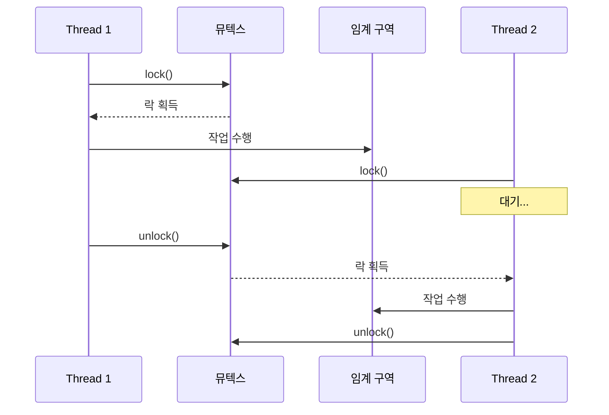

# 레이스 컨디션 (Race Condition)

## 배경

두 개 이상의 스레드가 같은 자원에 동시에 접근할 때, 실행 순서에 따라 결과가 달라지는 현상이다. 개발 환경에서는 잘 동작하다가 운영 환경에서 트래픽이 몰리면 터지는, 재현이 까다로운 버그의 대표적인 원인이다.

## 왜 발생하는가

`count++` 같은 단순한 연산도 CPU 레벨에서는 세 단계로 나뉜다:

1. 메모리에서 값을 레지스터로 읽기 (Read)
2. 레지스터에서 값 증가 (Compute)
3. 레지스터 값을 메모리에 쓰기 (Write)

이 세 단계 사이에 다른 스레드가 끼어들 수 있다. 두 스레드가 동시에 `count++`를 실행하면 둘 다 같은 값을 읽어서 1씩 증가시키고 저장한다. 두 번 증가시켰지만 결과는 1만 증가한다.

### 주요 개념

**공유 자원(Shared Resource)**: 여러 스레드가 동시에 접근 가능한 메모리, 파일, 네트워크 연결 등이다. 전역 변수, 정적 변수, 공유 객체가 대표적이다.

**임계 구역(Critical Section)**: 공유 자원에 접근하는 코드 영역이다. 한 번에 하나의 스레드만 실행해야 한다. 락을 획득하고 작업 후 해제하는 방식으로 보호한다.

**원자성(Atomicity)**: 더 이상 나눌 수 없는 연산 단위다. 중간에 다른 스레드가 끼어들 수 없으며, "전부 실행되거나 전혀 실행되지 않거나" 둘 중 하나다.

**상호 배제(Mutual Exclusion)**: 한 번에 하나의 스레드만 임계 구역에 진입하도록 보장하는 메커니즘이다. 뮤텍스, 세마포어, 모니터 등이 이를 구현한다.

## 코드로 보는 레이스 컨디션

### Java: 재현과 해결

레이스 컨디션이 실제로 발생하는 코드부터 보자.

```java
public class RaceConditionDemo {
    private static int counter = 0;

    public static void main(String[] args) throws InterruptedException {
        Runnable task = () -> {
            for (int i = 0; i < 100_000; i++) {
                counter++; // 비원자적 연산
            }
        };

        Thread t1 = new Thread(task);
        Thread t2 = new Thread(task);
        t1.start();
        t2.start();
        t1.join();
        t2.join();

        // 기대값: 200000, 실제값: 매번 다름 (150000~199999 사이)
        System.out.println("counter = " + counter);
    }
}
```

실행할 때마다 결과가 다르다. 이걸 해결하는 방법은 여러 가지다.

**synchronized 사용:**

```java
public class SynchronizedCounter {
    private int counter = 0;
    private final Object lock = new Object();

    public void increment() {
        synchronized (lock) {
            counter++;
        }
    }

    public int get() {
        synchronized (lock) {
            return counter;
        }
    }
}
```

synchronized 블록에 들어가면 다른 스레드는 같은 lock 객체에 대해 대기한다. 가장 직관적이지만 락 범위를 최소화하지 않으면 병목이 된다.

**ReentrantLock 사용:**

```java
import java.util.concurrent.locks.ReentrantLock;

public class LockCounter {
    private int counter = 0;
    private final ReentrantLock lock = new ReentrantLock();

    public void increment() {
        lock.lock();
        try {
            counter++;
        } finally {
            lock.unlock(); // finally에서 반드시 해제
        }
    }
}
```

synchronized와 달리 tryLock()으로 타임아웃을 걸 수 있고, fairness 옵션으로 기아 상태를 방지할 수 있다. 다만 unlock()을 빼먹으면 데드락이 걸리니 반드시 finally 블록에서 해제한다.

**AtomicInteger 사용:**

```java
import java.util.concurrent.atomic.AtomicInteger;

public class AtomicCounter {
    private final AtomicInteger counter = new AtomicInteger(0);

    public void increment() {
        counter.incrementAndGet(); // CAS 기반 원자적 연산
    }

    public int get() {
        return counter.get();
    }
}
```

단순 카운터라면 AtomicInteger가 가장 낫다. 내부적으로 CAS(Compare-And-Swap) 연산을 사용해서 락 없이 원자성을 보장한다. 경합이 심하지 않은 상황에서 synchronized보다 훨씬 빠르다. 경합이 심하면 LongAdder를 쓰는 게 낫다.

### Go: goroutine에서의 레이스 컨디션

```go
package main

import (
    "fmt"
    "sync"
)

func main() {
    counter := 0
    var wg sync.WaitGroup

    for i := 0; i < 2; i++ {
        wg.Add(1)
        go func() {
            defer wg.Done()
            for j := 0; j < 100000; j++ {
                counter++ // data race
            }
        }()
    }

    wg.Wait()
    fmt.Println("counter =", counter) // 매번 다른 값
}
```

`go run -race main.go`로 실행하면 race detector가 경고를 띄운다.

**sync.Mutex로 해결:**

```go
package main

import (
    "fmt"
    "sync"
)

func main() {
    counter := 0
    var mu sync.Mutex
    var wg sync.WaitGroup

    for i := 0; i < 2; i++ {
        wg.Add(1)
        go func() {
            defer wg.Done()
            for j := 0; j < 100000; j++ {
                mu.Lock()
                counter++
                mu.Unlock()
            }
        }()
    }

    wg.Wait()
    fmt.Println("counter =", counter) // 항상 200000
}
```

**channel로 해결:**

Go에서는 "메모리를 공유하지 말고, 통신으로 메모리를 공유하라"는 철학이 있다.

```go
package main

import "fmt"

func main() {
    counter := make(chan int, 1)
    counter <- 0

    done := make(chan bool, 2)

    increment := func() {
        for i := 0; i < 100000; i++ {
            val := <-counter
            counter <- val + 1
        }
        done <- true
    }

    go increment()
    go increment()

    <-done
    <-done
    fmt.Println("counter =", <-counter) // 항상 200000
}
```

channel을 사용하면 공유 상태 자체가 없어진다. 다만 이 패턴은 단순 카운터에는 오버킬이고, sync/atomic 패키지의 atomic.AddInt64가 더 적합하다.

## 웹 백엔드에서의 레이스 컨디션

운영 환경에서 실제로 장애를 일으키는 시나리오들이다.

### 재고 차감 동시 요청

상품 재고가 1개 남았는데 두 명이 동시에 주문한다.

```sql
-- 스레드 A
SELECT stock FROM products WHERE id = 1;  -- stock = 1
-- 스레드 B
SELECT stock FROM products WHERE id = 1;  -- stock = 1

-- 둘 다 재고가 있다고 판단
-- 스레드 A
UPDATE products SET stock = stock - 1 WHERE id = 1;  -- stock = 0
-- 스레드 B
UPDATE products SET stock = stock - 1 WHERE id = 1;  -- stock = -1 (초과 판매)
```

**SELECT FOR UPDATE로 해결:**

```sql
BEGIN;
SELECT stock FROM products WHERE id = 1 FOR UPDATE;  -- 행 락 획득
-- 다른 트랜잭션은 이 행에 대해 대기
UPDATE products SET stock = stock - 1 WHERE id = 1;
COMMIT;
```

FOR UPDATE는 해당 행에 배타 락을 건다. 다른 트랜잭션이 같은 행을 SELECT FOR UPDATE하면 첫 번째 트랜잭션이 커밋될 때까지 대기한다.

**WHERE 조건으로 원자적 차감:**

```sql
UPDATE products SET stock = stock - 1 WHERE id = 1 AND stock > 0;
-- affected rows가 0이면 재고 부족
```

단일 UPDATE 문은 DB 레벨에서 원자적이다. affected rows를 확인해서 재고 부족 여부를 판단하면 된다. SELECT 없이 바로 UPDATE하는 게 핵심이다.

### 쿠폰 중복 사용

사용자가 같은 쿠폰으로 동시에 두 번 결제 요청을 보낸다.

```java
// 문제가 있는 코드
public void useCoupon(Long couponId, Long userId) {
    Coupon coupon = couponRepository.findById(couponId);
    if (coupon.isUsed()) {
        throw new IllegalStateException("이미 사용된 쿠폰");
    }
    // 두 스레드가 동시에 여기까지 도달하면 둘 다 통과
    coupon.markAsUsed(userId);
    couponRepository.save(coupon);
}
```

**유니크 제약으로 해결:**

```sql
CREATE UNIQUE INDEX uk_coupon_usage ON coupon_usage(coupon_id);
```

```java
public void useCoupon(Long couponId, Long userId) {
    try {
        couponUsageRepository.save(new CouponUsage(couponId, userId));
        // INSERT 성공 = 첫 번째 사용
    } catch (DataIntegrityViolationException e) {
        throw new IllegalStateException("이미 사용된 쿠폰");
    }
}
```

DB 유니크 제약은 동시성 문제를 DB 레벨에서 원천 차단한다. 애플리케이션 레벨의 if 체크보다 훨씬 안전하다.

### API 멱등성 미처리

네트워크 지연으로 클라이언트가 결제 API를 두 번 호출한다. 멱등키(Idempotency Key) 없이 처리하면 이중 결제가 발생한다.

```java
public PaymentResult processPayment(String idempotencyKey, PaymentRequest request) {
    // 멱등키로 기존 결과 조회
    Optional<Payment> existing = paymentRepository.findByIdempotencyKey(idempotencyKey);
    if (existing.isPresent()) {
        return existing.get().toResult(); // 이전 결과 그대로 반환
    }

    // 멱등키에 유니크 인덱스가 걸려있어야 한다
    Payment payment = Payment.create(idempotencyKey, request);
    try {
        paymentRepository.save(payment);
    } catch (DataIntegrityViolationException e) {
        // 동시 요청으로 이미 생성된 경우
        return paymentRepository.findByIdempotencyKey(idempotencyKey)
                .orElseThrow()
                .toResult();
    }

    // 실제 결제 처리
    PaymentGatewayResult gatewayResult = paymentGateway.charge(request);
    payment.complete(gatewayResult);
    paymentRepository.save(payment);

    return payment.toResult();
}
```

멱등키 패턴의 핵심은 "먼저 기록하고 나중에 처리"다. 멱등키를 DB에 먼저 INSERT(유니크 제약)하고, 성공하면 실제 로직을 수행한다.

## 분산 환경의 레이스 컨디션

단일 서버에서는 synchronized나 뮤텍스로 해결되지만, 서버가 여러 대면 프로세스 간 동기화가 안 된다. 분산 락이 필요하다.

### Redis SETNX 기반 분산 락

가장 단순한 형태의 분산 락이다.

```java
public class SimpleRedisLock {
    private final StringRedisTemplate redis;
    private static final long LOCK_TIMEOUT_MS = 3000;

    public boolean tryLock(String key) {
        String lockKey = "lock:" + key;
        String value = UUID.randomUUID().toString();
        Boolean acquired = redis.opsForValue()
                .setIfAbsent(lockKey, value, Duration.ofMillis(LOCK_TIMEOUT_MS));
        return Boolean.TRUE.equals(acquired);
    }

    public void unlock(String key, String value) {
        String lockKey = "lock:" + key;
        // Lua 스크립트로 원자적 삭제 (본인이 건 락만 해제)
        String script = """
            if redis.call('get', KEYS[1]) == ARGV[1] then
                return redis.call('del', KEYS[1])
            else
                return 0
            end
            """;
        redis.execute(new DefaultRedisScript<>(script, Long.class),
                List.of(lockKey), value);
    }
}
```

주의할 점:
- TTL 없이 SETNX만 쓰면, 락을 건 서버가 죽었을 때 영원히 풀리지 않는다
- unlock할 때 GET + DEL을 따로 하면 안 된다. 다른 프로세스의 락을 지울 수 있다. Lua 스크립트로 원자적으로 처리한다
- 단일 Redis 노드 기반이라 Redis가 죽으면 락도 사라진다

### Redisson 분산 락

프로덕션 환경에서는 Redisson 같은 라이브러리를 쓰는 게 안전하다.

```java
@Service
public class StockService {
    private final RedissonClient redisson;
    private final ProductRepository productRepository;

    public void decreaseStock(Long productId, int quantity) {
        RLock lock = redisson.getLock("stock:" + productId);
        try {
            // 최대 5초 대기, 3초 후 자동 해제
            boolean acquired = lock.tryLock(5, 3, TimeUnit.SECONDS);
            if (!acquired) {
                throw new RuntimeException("락 획득 실패");
            }
            Product product = productRepository.findById(productId).orElseThrow();
            if (product.getStock() < quantity) {
                throw new IllegalStateException("재고 부족");
            }
            product.decreaseStock(quantity);
            productRepository.save(product);
        } catch (InterruptedException e) {
            Thread.currentThread().interrupt();
            throw new RuntimeException(e);
        } finally {
            if (lock.isHeldByCurrentThread()) {
                lock.unlock();
            }
        }
    }
}
```

Redisson은 워치독(watchdog)이 락 만료 시간을 자동 연장한다. 작업이 예상보다 오래 걸려도 락이 중간에 풀리지 않는다. 다만 Redis 클러스터 환경에서 마스터 장애 시 락이 유실될 수 있는데, 이 경우 RedLock 알고리즘(여러 Redis 노드에 동시에 락을 거는 방식)을 고려한다.

### ZooKeeper 분산 락

강한 일관성이 필요한 경우 ZooKeeper를 쓴다. Apache Curator 라이브러리가 레시피를 제공한다.

```java
CuratorFramework client = CuratorFrameworkFactory.newClient(
        "zk1:2181,zk2:2181,zk3:2181",
        new RetryNTimes(3, 1000));
client.start();

InterProcessMutex lock = new InterProcessMutex(client, "/locks/stock/" + productId);

try {
    if (lock.acquire(5, TimeUnit.SECONDS)) {
        try {
            // 임계 구역
            decreaseStock(productId, quantity);
        } finally {
            lock.release();
        }
    }
} catch (Exception e) {
    throw new RuntimeException(e);
}
```

ZooKeeper는 과반수 합의 기반이라 Redis보다 일관성이 강하다. 대신 성능은 Redis가 낫다. 선택 기준:
- 락이 잠깐 유실돼도 괜찮은 경우(캐시 갱신 등) → Redis
- 금융 거래처럼 절대 유실되면 안 되는 경우 → ZooKeeper

## 동기화 메커니즘

### 뮤텍스 (Mutex)

"Mutual Exclusion"의 줄임말이다. 잠금(locked)과 해제(unlocked) 두 가지 상태를 가진다.


```mermaid
sequenceDiagram
    participant T1 as Thread 1
    participant Mutex as 뮤텍스
    participant CS as 임계 구역
    participant T2 as Thread 2

    T1->>Mutex: lock()
    Mutex-->>T1: 락 획득
    T1->>CS: 작업 수행

    T2->>Mutex: lock()
    Note over T2: 대기...

    T1->>Mutex: unlock()
    Mutex-->>T2: 락 획득
    T2->>CS: 작업 수행
    T2->>Mutex: unlock()
```

구현 방식에 따라 스핀락(CPU를 소비하며 대기)과 블로킹 뮤텍스(대기 큐에 들어가서 CPU 양보)로 나뉜다. 짧은 임계 구역은 스핀락이, 긴 임계 구역은 블로킹이 유리하다.

뮤텍스의 단점은 여러 개를 사용할 때 락 순서가 일관되지 않으면 데드락이 걸린다는 것이다. 그리고 경합이 심하면 스레드들이 대기만 하면서 처리량이 급격히 떨어진다.

### 세마포어 (Semaphore)

뮤텍스와 달리 정수 카운터를 가진다. 동시에 접근 가능한 스레드 수를 제한할 때 쓴다. 1965년 다이크스트라가 제안했다.

P 연산(wait): 카운터를 1 감소. 0 이하면 대기.
V 연산(signal): 카운터를 1 증가. 대기 중인 스레드가 있으면 깨움.

카운터가 1이면 이진 세마포어(뮤텍스와 비슷), N이면 카운팅 세마포어다. DB 커넥션 풀(최대 N개 연결 허용)이나 생산자-소비자 패턴의 버퍼 관리에 쓰인다.

### 원자적 연산 (Atomic Operations)

CPU가 하드웨어 레벨에서 보장하는 연산이다. 락을 사용하지 않아 오버헤드가 매우 적다.

**Compare-and-Swap (CAS)**: 메모리 값이 예상 값과 같으면 새 값으로 교체한다. 다르면 실패를 반환한다. Java의 AtomicInteger, Go의 sync/atomic 패키지가 CAS 기반이다.

**Fetch-and-Add**: 값을 읽고 증가시키는 것을 한 번에 수행한다.

원자적 연산은 단일 변수에 대한 단순 연산(카운터, 플래그)에 적합하다. 여러 변수를 동시에 원자적으로 변경해야 하면 락을 써야 한다.

### 조건 변수 (Condition Variables)

특정 조건이 만족될 때까지 스레드를 대기시키는 메커니즘이다. 반드시 뮤텍스와 함께 사용한다.

```python
# 대기하는 스레드
mutex.lock()
while not condition:       # if가 아니라 while이다
    condition_variable.wait(mutex)
# 조건 만족 - 작업 수행
mutex.unlock()

# 조건을 만족시키는 스레드
mutex.lock()
condition = True
condition_variable.signal()
mutex.unlock()
```

`while`을 써야 하는 이유: spurious wakeup(가짜 깨움)이 발생할 수 있다. OS가 조건과 무관하게 스레드를 깨울 수 있어서, 깨어난 후 조건을 다시 확인해야 한다. `if`로 쓰면 가짜 깨움에 취약하다.

### 읽기-쓰기 락 (Read-Write Lock)

읽기 작업은 동시에 여러 스레드가 수행할 수 있고, 쓰기 작업만 배타적으로 수행한다. 읽기가 쓰기보다 훨씬 많은 경우(캐시, 설정 읽기)에 뮤텍스 대비 성능이 좋다.

주의할 점은 읽기 스레드가 계속 들어오면 쓰기 스레드가 굶어 죽을 수 있다(기아 상태). 대부분의 구현체는 이를 방지하기 위해 쓰기 우선 정책을 제공한다. Java의 ReentrantReadWriteLock, Go의 sync.RWMutex가 대표적이다.

## 디버깅과 레이스 컨디션 감지

레이스 컨디션은 타이밍에 의존하기 때문에 일반 디버거로는 잡기 어렵다. 전용 도구가 필요하다.

### Go Race Detector

Go는 빌드 플래그 하나로 race detector를 켤 수 있다.

```bash
$ go run -race main.go
==================
WARNING: DATA RACE
Goroutine 7 (running) at:
  main.main.func1()
      /home/user/main.go:14 +0x38

Previous write at:
  main.main.func1()
      /home/user/main.go:14 +0x38
  Goroutine 6 (finished) created at:
      main.main()
      /home/user/main.go:11 +0x88
==================
```

정확히 어떤 파일 몇 번째 줄에서 어떤 goroutine이 충돌했는지 알려준다. CI에서 `go test -race ./...`를 돌리면 개발 단계에서 race condition을 잡을 수 있다. 다만 실행 속도가 2~10배 느려지므로 프로덕션 빌드에는 넣지 않는다.

### ThreadSanitizer (TSan)

C/C++, Rust에서 사용하는 동적 분석 도구다. 컴파일 시 `-fsanitize=thread` 플래그를 추가한다.

```bash
$ gcc -fsanitize=thread -g -o race_demo race_demo.c
$ ./race_demo
==================
WARNING: ThreadSanitizer: data race (pid=12345)
  Write of size 4 at 0x000000601084 by thread T2:
    #0 increment /home/user/race_demo.c:8 (race_demo+0x4a0c8f)

  Previous write of size 4 at 0x000000601084 by thread T1:
    #0 increment /home/user/race_demo.c:8 (race_demo+0x4a0c8f)
==================
```

메모리 접근을 추적해서 동기화 없이 같은 메모리에 접근하는 스레드를 찾아낸다.

### jcstress (Java Concurrency Stress Tests)

Java에서 동시성 코드의 정확성을 검증하는 도구다. OpenJDK 프로젝트에서 만들었다.

```java
@JCStressTest
@Outcome(id = "1, 1", expect = Expect.ACCEPTABLE_INTERESTING, desc = "Race condition!")
@Outcome(id = "1, 2", expect = Expect.ACCEPTABLE, desc = "Thread 1 first")
@Outcome(id = "2, 1", expect = Expect.ACCEPTABLE, desc = "Thread 2 first")
@State
public class CounterTest {
    int counter = 0;

    @Actor
    public void actor1(II_Result r) {
        r.r1 = ++counter;
    }

    @Actor
    public void actor2(II_Result r) {
        r.r2 = ++counter;
    }
}
```

```bash
$ java -jar jcstress-samples.jar -t CounterTest
  RESULT      SAMPLES    FREQ       EXPECT
  1, 1        12,845     0.15%      Interesting  # race condition 발생!
  1, 2        4,321,567  49.89%     Acceptable
  2, 1        4,329,122  49.96%     Acceptable
```

수백만 번 반복 실행해서 발생 가능한 모든 실행 순서를 탐색한다. `1, 1`이 나왔다는 건 두 스레드가 같은 값을 읽었다는 뜻이고, 이게 바로 race condition이다.

### 실무에서의 감지 방법

정적 분석 도구로는 IntelliJ의 Thread Safety 검사, SpotBugs의 동시성 버그 탐지가 있다. 코드 리뷰 때 공유 변수에 동기화가 빠져있는지 확인하는 게 가장 기본이다.

운영 환경에서는 다음 지표를 모니터링한다:
- 락 대기 시간과 경합률이 급증하면 병목 지점이다
- 데이터 정합성 오류가 간헐적으로 발생하면 race condition을 의심한다
- 같은 요청에 대해 결과가 달라지는 경우도 마찬가지다

## 동기화 메커니즘 비교

| 메커니즘 | 적합한 상황 | 성능 | 복잡도 |
|----------|-------------|------|--------|
| 뮤텍스 | 단순한 상호 배제 | 중간 | 낮음 |
| 세마포어 | 리소스 풀, 생산자-소비자 | 중간 | 중간 |
| 원자적 연산 | 카운터, 플래그 | 높음 | 낮음 |
| 조건 변수 | 조건 기반 대기 | 중간 | 높음 |
| 읽기-쓰기 락 | 읽기 작업이 대부분인 경우 | 높음 | 중간 |
| 분산 락 (Redis) | 멀티 인스턴스 환경, 성능 중시 | 높음 | 중간 |
| 분산 락 (ZooKeeper) | 멀티 인스턴스 환경, 일관성 중시 | 낮음 | 높음 |

## 참조

- Tanenbaum, A. S., & Bos, H. (2014). *Modern Operating Systems* (4th ed.). Pearson.
- Herlihy, M., & Shavit, N. (2012). *The Art of Multiprocessor Programming* (2nd ed.). Morgan Kaufmann.
- Goetz, B., Peierls, T., Bloch, J., Bowbeer, J., Holmes, D., & Lea, D. (2006). *Java Concurrency in Practice*. Addison-Wesley Professional.
- Williams, A. (2019). *C++ Concurrency in Action* (2nd ed.). Manning Publications.
- Lamport, L. (1978). "Time, clocks, and the ordering of events in a distributed system." *Communications of the ACM*, 21(7), 558-565.
- Dijkstra, E. W. (1965). "Solution of a problem in concurrent programming control." *Communications of the ACM*, 8(9), 569.
