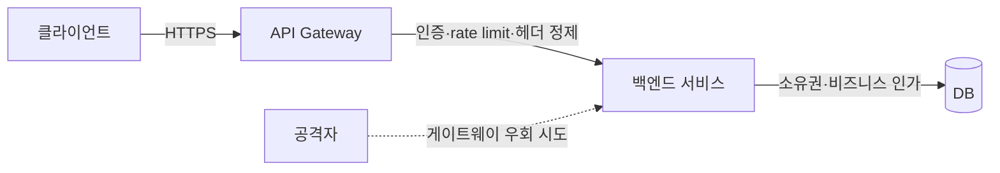
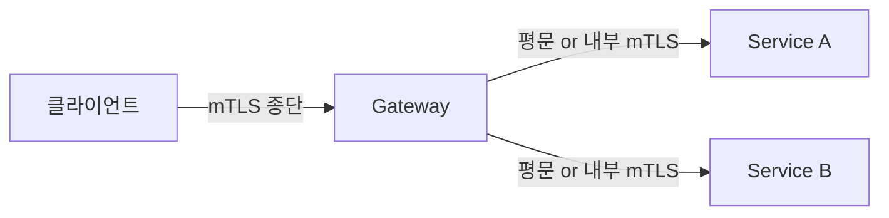
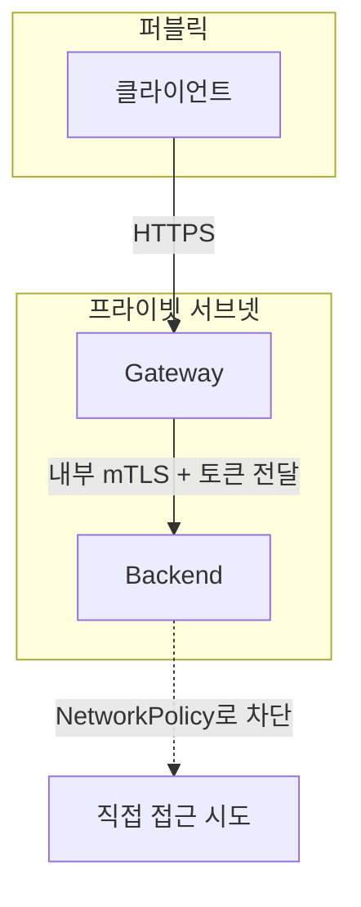

# API Gateway 계층 보안

API Gateway는 외부 트래픽이 백엔드로 들어오기 전에 거치는 단일 관문이다. 인증, 인가, rate limiting, TLS 종단, 로깅을 게이트웨이 한 곳에 모으면 백엔드 서비스마다 같은 코드를 중복으로 박을 필요가 없다. 문제는 이 "단일 관문"이라는 전제가 깨지는 순간 보안 모델 전체가 무너진다는 점이다. 게이트웨이를 우회해서 백엔드에 직접 붙을 수 있으면 게이트웨이에 박아둔 인증과 rate limit이 전부 의미가 없어진다.

AWS WAF나 ALB 같은 관리형 게이트웨이는 [WAF 문서](../AWS/Security/WAF.md)에서 다뤘다. 이 문서는 직접 운영하는 오픈소스 게이트웨이 — Kong, APISIX, Envoy — 를 기준으로, 실제로 붙이면서 겪는 문제 위주로 정리한다.

---

## 게이트웨이에 무엇을 맡기고 무엇을 백엔드에 남길지

처음 게이트웨이를 도입하면 "여기서 다 막으면 백엔드는 신경 안 써도 되겠지"라고 생각하는 경우가 많다. 이게 가장 위험한 발상이다. 게이트웨이는 1차 방어선이지 유일한 방어선이 아니다.

게이트웨이에 맡기기 좋은 것:

- TLS 종단과 인증서 관리
- 토큰 서명 검증 (JWT), 토큰 활성 여부 확인 (introspection)
- 전역 rate limiting, IP 기반 차단
- 요청/응답 헤더 정제
- 라우팅과 트래픽 분산

게이트웨이만 믿으면 안 되는 것:

- 리소스 소유권 검증 (이 유저가 이 주문을 볼 권한이 있는가)
- 비즈니스 로직 단위의 인가
- 사용자별·테넌트별 세밀한 rate limit
- 입력값 검증 ([API Input Validation](./API_Input_Validation.md) 참고)

게이트웨이는 "토큰이 유효한 누군가"까지만 보장한다. "이 토큰의 주인이 이 행동을 해도 되는가"는 백엔드가 판단해야 한다. 게이트웨이에서 JWT 서명만 확인하고 백엔드가 `X-User-Id` 헤더를 그대로 신뢰하면, 그 헤더를 위조할 수 있는 경로가 하나라도 있으면 끝이다. 이 부분은 아래 헤더 정제와 게이트웨이 우회에서 다시 다룬다.



점선이 바로 이 문서의 핵심 위협이다. 게이트웨이를 거치지 않고 백엔드에 직접 닿는 경로가 존재하면 위쪽 방어가 전부 무력화된다.

---

## 인증 플러그인: JWT 검증과 OAuth2 introspection

게이트웨이의 인증 플러그인은 크게 두 방식이다. 토큰 안에 서명이 들어있어 게이트웨이가 자체적으로 검증하는 JWT 방식, 그리고 토큰을 인증 서버에 물어봐서 활성 여부를 확인하는 introspection 방식.

### JWT 로컬 검증

JWT는 게이트웨이가 공개키(또는 대칭키)만 가지고 있으면 인증 서버에 매번 묻지 않고 서명을 검증한다. 지연이 거의 없고 인증 서버 부하도 없다. 대신 한번 발급된 토큰을 만료 전에 취소하기 어렵다.

Kong의 JWT 플러그인 설정 예시:

```yaml
plugins:
  - name: jwt
    config:
      claims_to_verify:
        - exp
      key_claim_name: iss
      maximum_expiration: 3600
      run_on_preflight: false
```

여기서 자주 빠뜨리는 게 `claims_to_verify`에 `exp`를 넣는 것이다. 안 넣으면 만료된 토큰도 서명만 맞으면 통과한다. Kong JWT 플러그인은 기본적으로 만료를 강제 검증하지 않으므로 명시해야 한다.

APISIX의 `jwt-auth` 플러그인도 비슷하다. 다만 APISIX는 consumer 단위로 키를 등록하는 구조라서, consumer를 먼저 만들고 그 consumer에 키를 붙인다.

```yaml
# consumer 등록
username: app_service
plugins:
  jwt-auth:
    key: app-key
    secret: ${SECRET}
    algorithm: HS256
    exp: 3600
```

알고리즘을 명시하는 게 중요하다. JWT에서 가장 유명한 취약점이 알고리즘 혼동(`alg` 헤더를 `none`으로 바꾸거나 RS256을 HS256으로 바꿔 공개키를 비밀키처럼 쓰는 공격)이다. 게이트웨이 설정에서 허용 알고리즘을 고정하지 않으면 토큰의 `alg` 헤더를 그대로 믿는 구현에 당할 수 있다. 자세한 내용은 [JWT 문서](./JWT.md)에 정리해뒀다.

Envoy는 `jwt_authn` 필터로 처리한다. JWKS 엔드포인트를 지정하면 게이트웨이가 키를 주기적으로 받아와 캐시한다.

```yaml
http_filters:
  - name: envoy.filters.http.jwt_authn
    typed_config:
      "@type": type.googleapis.com/envoy.extensions.filters.http.jwt_authn.v3.JwtAuthentication
      providers:
        auth_provider:
          issuer: https://auth.example.com
          audiences:
            - api.example.com
          remote_jwks:
            http_uri:
              uri: https://auth.example.com/.well-known/jwks.json
              cluster: auth_cluster
              timeout: 5s
            cache_duration:
              seconds: 600
      rules:
        - match:
            prefix: /
          requires:
            provider_name: auth_provider
```

`audiences`를 비워두면 다른 서비스용으로 발급된 토큰도 들어온다. 같은 인증 서버를 여러 서비스가 공유할 때 이걸 빠뜨리면, A 서비스 토큰으로 B 서비스에 접근되는 사고가 난다. `aud` 클레임 검증은 선택이 아니라 필수다.

JWKS 캐시 주기도 신경 써야 한다. 키를 롤오버했는데 게이트웨이 캐시가 오래된 키를 들고 있으면 새 토큰이 거부되고, 반대로 캐시 주기가 너무 길면 폐기한 키로 서명한 토큰이 계속 통과한다. `cache_duration`은 키 롤오버 주기와 맞춰서 잡는다.

### OAuth2 introspection

JWT의 취소 불가 문제를 해결하려면 introspection을 쓴다. 게이트웨이가 받은 토큰을 인증 서버의 introspection 엔드포인트(RFC 7662)에 보내 `active: true/false`를 확인한다. 토큰을 인증 서버에서 폐기하면 즉시 반영된다.

대가는 지연과 부하다. 매 요청마다 인증 서버를 왕복하면 인증 서버가 병목이 된다. 그래서 introspection 결과를 짧게 캐싱하는 게 일반적이다. 토큰 식별자 기준으로 몇 초에서 몇십 초 캐싱하면, 폐기 반영이 그만큼 늦어지는 대신 인증 서버 부하가 크게 준다. 캐시 TTL은 "토큰을 폐기하고 나서 몇 초까지 유효해도 괜찮은가"로 정한다.

Kong은 `oauth2-introspection` 플러그인(엔터프라이즈)이나 커스텀 플러그인으로 처리한다. APISIX는 `openid-connect` 플러그인에 introspection 모드가 있다.

```yaml
plugins:
  openid-connect:
    client_id: gateway
    client_secret: ${CLIENT_SECRET}
    discovery: https://auth.example.com/.well-known/openid-configuration
    bearer_only: true
    introspection_endpoint_auth_method: client_secret_post
    token_signing_alg_values_expected: RS256
```

`bearer_only: true`가 중요하다. 이게 없으면 토큰이 없을 때 게이트웨이가 로그인 리다이렉트를 시도한다. API 게이트웨이는 리다이렉트가 아니라 401을 돌려줘야 한다. 브라우저 세션용 게이트웨이와 API용 게이트웨이의 동작이 달라야 하는 지점이다.

실무에서는 둘을 섞는다. access token은 짧게 발급하고 JWT로 로컬 검증해서 지연을 줄이고, 토큰 수명을 짧게 가져가서 취소 불가 문제를 완화한다. 즉시 폐기가 꼭 필요한 고위험 엔드포인트만 introspection을 건다.

---

## 게이트웨이 rate limiting과 백엔드 rate limiting의 차이

rate limiting을 게이트웨이에 걸면 끝이라고 생각하기 쉬운데, 게이트웨이 레벨과 백엔드 레벨은 막는 대상이 다르다. 둘 다 필요하다.

게이트웨이 레벨은 "관문을 통과하는 전체 트래픽의 양"을 본다. IP당 초당 요청 수, API 키당 분당 요청 수처럼 거친 단위로 막는다. 목적은 백엔드가 트래픽에 깔리지 않게 하는 것, 그리고 단순 무차별 공격을 1차로 거르는 것이다.

백엔드 레벨은 "비즈니스 단위의 남용"을 본다. 사용자 한 명이 하루에 비밀번호 재설정을 몇 번 요청했는가, 특정 테넌트가 무료 플랜 한도를 넘겼는가, 쿠폰 발급 엔드포인트를 한 계정이 몇 번 때렸는가. 이건 게이트웨이가 알 수 없는 도메인 지식이다.

| 구분 | 게이트웨이 레벨 | 백엔드 레벨 |
|------|----------------|-------------|
| 기준 | IP, API 키, 라우트 | 사용자, 테넌트, 비즈니스 액션 |
| 목적 | 인프라 보호, 무차별 공격 차단 | 비즈니스 남용·악용 방지 |
| 상태 저장 | 게이트웨이 노드 간 공유(Redis 등) | 애플리케이션 DB·캐시 |
| 막는 시점 | 백엔드 닿기 전 | 비즈니스 로직 안 |

게이트웨이 레벨에서 놓치는 대표적인 경우가 분산 게이트웨이의 카운터 동기화다. 게이트웨이를 여러 노드로 띄우면 각 노드가 자기 메모리에 카운터를 들고 있어서, IP당 100 req/s로 설정해도 노드가 3개면 실질 300 req/s까지 통과한다. 이걸 막으려면 카운터를 Redis 같은 공유 저장소에 둬야 한다.

Kong의 `rate-limiting` 플러그인은 `policy`로 이걸 정한다.

```yaml
plugins:
  - name: rate-limiting
    config:
      minute: 100
      policy: redis
      redis:
        host: redis.internal
        port: 6379
      fault_tolerant: true
```

`policy: local`로 두면 노드별 카운팅이라 위에서 말한 문제가 생긴다. 정확한 제한이 필요하면 `redis`로 둔다. 대신 매 요청마다 Redis를 한 번 더 타니까 지연과 Redis 부하가 늘어난다. 정확성과 성능의 트레이드오프다.

`fault_tolerant`도 봐야 한다. `true`면 Redis가 죽었을 때 rate limit을 통과시킨다(가용성 우선). `false`면 Redis가 죽으면 요청을 막는다(보안 우선). 결제·인증 같은 민감한 엔드포인트는 후자가 맞을 때도 있다. Redis 장애가 곧 rate limit 전면 해제로 이어지면 그 틈에 공격이 들어온다.

APISIX는 `limit-count`, `limit-req`(leaky bucket), `limit-conn`을 나눠서 제공한다. 초당 폭주를 부드럽게 깎으려면 `limit-req`, 단위 시간당 총량을 막으려면 `limit-count`를 쓴다.

Envoy는 로컬 rate limit(`local_ratelimit` 필터)과 글로벌 rate limit(외부 rate limit 서비스 연동)을 나눈다. 글로벌은 별도 rate limit service를 띄워서 gRPC로 질의하는 구조라 운영 부담이 있지만, 클러스터 전체에서 정확한 카운팅이 된다.

rate limiting의 알고리즘(고정 윈도우·슬라이딩 윈도우·토큰 버킷)과 분산 카운팅 상세는 [Rate Limiting 문서](./Rate_Limiting.md)에 따로 정리해뒀다.

---

## mTLS 종단을 어디서 끊을 것인가

게이트웨이는 보통 외부 클라이언트와의 TLS를 종단한다. 클라이언트가 HTTPS로 붙으면 게이트웨이에서 복호화하고, 게이트웨이부터 백엔드까지는 내부망이니까 평문 HTTP로 보내는 구성이 흔하다. 이게 편하긴 한데 게이트웨이~백엔드 구간이 평문이라는 게 문제다.

여기에 클라이언트 인증서까지 요구하는 게 mTLS다. 서버만 인증서를 제시하는 일반 TLS와 달리, 클라이언트도 인증서를 내야 연결이 성립한다. 서버 간 통신, 파트너 API, IoT 디바이스처럼 "정해진 상대하고만 통신"하는 경우에 쓴다. mTLS 자체의 동작 원리는 [Mutual TLS 문서](./Mutual_TLS.md)에 있다.

게이트웨이에서 mTLS를 다룰 때 결정할 게 두 가지다. 외부 클라이언트 mTLS를 게이트웨이에서 종단할지, 그리고 게이트웨이~백엔드 구간도 mTLS로 묶을지.



외부 mTLS를 게이트웨이에서 종단하면, 게이트웨이가 클라이언트 인증서를 검증하고 그 정보를 헤더로 백엔드에 넘긴다. Envoy는 검증한 인증서의 정보를 `x-forwarded-client-cert`(XFCC) 헤더로 전달한다.

```yaml
# Envoy: 클라이언트 인증서 정보를 XFCC 헤더로 전달
forward_client_cert_details: SANITIZE_SET
set_current_client_cert_details:
  subject: true
  uri: true
```

`SANITIZE_SET`이 핵심이다. 클라이언트가 보낸 XFCC 헤더를 지우고(sanitize), 게이트웨이가 검증한 값으로 새로 채운다(set). 이걸 안 하면 클라이언트가 XFCC 헤더를 직접 위조해서 보낼 수 있다. 백엔드가 그 헤더로 "어떤 인증서로 들어왔는지" 판단한다면 위조된 신원을 그대로 믿게 된다. 헤더로 신원을 넘기는 모든 구조의 공통 함정이고, 다음 절의 주제와 직결된다.

게이트웨이~백엔드 구간 mTLS는 서비스 메시(Istio, Linkerd)로 처리하는 경우가 많다. 사이드카가 자동으로 mTLS를 걸어주니까 애플리케이션 코드는 그대로 두고 구간 암호화와 서비스 신원 검증을 얻는다. 게이트웨이 자체를 메시 안에 넣으면 외부 종단부터 백엔드까지 일관되게 관리된다.

내부망이니까 평문이어도 된다는 가정은 점점 안 통한다. 같은 클러스터·VPC 안이라도 한 노드가 뚫리면 평문 트래픽을 스니핑할 수 있다. 이게 [Zero Trust 아키텍처](./Zero_Trust_Architecture.md)에서 "내부망을 신뢰하지 않는다"고 말하는 부분이다.

---

## 헤더 정제: 내부 헤더 스푸핑 차단

게이트웨이가 인증을 끝내고 백엔드에 사용자 정보를 헤더로 넘기는 구조가 흔하다. `X-User-Id`, `X-User-Roles`, `X-Tenant-Id` 같은 헤더에 검증된 신원을 담아 백엔드로 보내고, 백엔드는 토큰 검증을 다시 안 하고 이 헤더를 신뢰한다.

이 구조의 전제는 "이 헤더는 게이트웨이만 설정할 수 있다"는 것이다. 그런데 클라이언트가 처음부터 `X-User-Id: admin`을 요청에 박아서 보내면 어떻게 될까. 게이트웨이가 이 헤더를 지우지 않고 통과시키면, 백엔드는 게이트웨이가 넣은 값과 클라이언트가 넣은 값을 구분하지 못한다.

그래서 게이트웨이는 신뢰 헤더를 받는 즉시 무조건 제거하고, 자기가 검증한 값으로 다시 설정해야 한다. 클라이언트가 보낸 `X-User-*` 계열은 게이트웨이 진입 시점에 전부 삭제하는 게 원칙이다.

Kong에서는 `request-transformer` 플러그인으로 들어오는 헤더를 제거한다.

```yaml
plugins:
  - name: request-transformer
    config:
      remove:
        headers:
          - X-User-Id
          - X-User-Roles
          - X-Tenant-Id
          - X-Forwarded-Client-Cert
```

그다음 인증 플러그인이나 별도 단계에서 검증된 값을 다시 채운다. 순서가 중요하다. 제거가 먼저, 설정이 나중이어야 한다.

Envoy는 라우트나 필터 단계에서 `request_headers_to_remove`로 처리한다.

```yaml
route:
  request_headers_to_remove:
    - x-user-id
    - x-user-roles
    - x-internal-secret
```

여기서 자주 놓치는 게 정제 대상 헤더 목록을 화이트리스트가 아니라 블랙리스트로 관리하는 것이다. "지울 헤더"를 나열하는 방식은 새 내부 헤더가 추가될 때마다 목록에 더해야 하고, 빠뜨리면 그게 그대로 구멍이 된다. 가능하면 내부 신뢰 헤더에 공통 접두사(`X-Internal-` 등)를 두고 그 접두사 전체를 제거하는 식으로 관리하는 게 누락 위험이 적다.

응답 헤더 정제도 봐야 한다. 백엔드가 실수로 내부 정보를 응답 헤더에 흘리는 경우가 있다. `Server: Tomcat/9.0.x`로 버전이 노출되거나, 디버그용 `X-Debug-*` 헤더가 운영에 그대로 나가거나, 내부 호스트명이 `X-Backend-Host`로 새어나가거나. 게이트웨이에서 응답 헤더를 정제해 이런 정보 노출을 막는다. 보안 응답 헤더(`Strict-Transport-Security`, `X-Content-Type-Options` 등)를 게이트웨이에서 일괄 주입하는 것도 같은 자리에서 한다. 이 헤더들의 의미는 [CORS and Security Headers](./CORS_and_Security_Headers.md)에 정리돼 있다.

---

## 게이트웨이 우회: 백엔드 직접 접근 차단

지금까지의 모든 방어가 한 가정 위에 서 있다. "모든 트래픽은 게이트웨이를 거친다." 이 가정이 깨지면 인증도, rate limit도, 헤더 정제도 전부 우회된다. 공격자가 게이트웨이를 건너뛰고 백엔드 서비스에 직접 붙으면, `X-User-Id: admin`을 직접 박아 보내도 막을 게 없다. 헤더 정제를 하는 주체가 게이트웨이인데 그 게이트웨이를 안 거쳤기 때문이다.

이게 게이트웨이 보안에서 가장 자주 빠뜨리는 부분이다. 게이트웨이 설정은 공들여 하면서, 정작 백엔드가 게이트웨이 외의 경로로도 닿는다는 걸 모른다. 백엔드 서비스가 `0.0.0.0:8080`으로 떠 있고 방화벽이 느슨하면, 같은 네트워크 안의 누구든 게이트웨이를 건너뛸 수 있다.

직접 접근을 막는 방법은 계층별로 여러 개를 겹친다.

### 네트워크 격리

가장 확실한 건 백엔드를 게이트웨이만 닿을 수 있는 네트워크에 두는 것이다. 백엔드를 프라이빗 서브넷에 넣고, 보안 그룹·네트워크 정책으로 게이트웨이에서 오는 트래픽만 허용한다. 백엔드는 공인 IP를 갖지 않는다.

쿠버네티스라면 백엔드 서비스를 `ClusterIP`로만 노출하고 `NodePort`나 `LoadBalancer`로 직접 뚫지 않는다. 그리고 NetworkPolicy로 게이트웨이 파드에서 오는 트래픽만 허용한다.

```yaml
apiVersion: networking.k8s.io/v1
kind: NetworkPolicy
metadata:
  name: backend-only-from-gateway
spec:
  podSelector:
    matchLabels:
      app: backend
  policyTypes:
    - Ingress
  ingress:
    - from:
        - podSelector:
            matchLabels:
              app: api-gateway
      ports:
        - protocol: TCP
          port: 8080
```

이 정책이 있으면 같은 클러스터의 다른 파드에서 백엔드로 직접 붙는 게 막힌다. 쿠버네티스 네트워크 격리는 [Kubernetes Security](./Kubernetes_Security.md)에 더 있다.

### 게이트웨이~백엔드 상호 인증

네트워크 격리만으로 부족하다고 보면(내부 침해를 가정하는 Zero Trust 관점), 게이트웨이와 백엔드 사이에 상호 인증을 건다. 위에서 다룬 내부 mTLS가 이 역할을 한다. 백엔드가 "게이트웨이 인증서로 들어온 연결"만 받으면, 게이트웨이 인증서가 없는 직접 접근은 TLS 핸드셰이크에서 거부된다.

가벼운 방법으로는 공유 비밀 헤더가 있다. 게이트웨이가 모든 백엔드 요청에 `X-Gateway-Secret: <비밀값>`을 붙이고, 백엔드는 이 헤더가 맞을 때만 처리한다. 단, 이 비밀값이 평문 구간에서 노출되거나 코드·설정에 하드코딩돼 유출되면 무력화된다. mTLS보다 약한 방어라서 mTLS를 못 쓰는 환경의 차선책 정도로 본다. 비밀값 관리는 [Secrets Management](./Secrets_Management.md) 참고.

### 백엔드의 독립 검증

네트워크와 mTLS로 막아도, 백엔드 스스로 최소한의 검증을 갖는 게 마지막 안전장치다. 백엔드가 헤더만 믿지 않고 토큰을 한 번 더 검증하거나, 적어도 게이트웨이 신원을 확인하는 것이다. 게이트웨이에서 토큰 검증을 했더라도 백엔드가 같은 토큰을 가볍게 재검증하면, 게이트웨이 우회로 들어온 위조 요청을 백엔드가 잡아낸다. 이중 검증의 비용보다 우회 사고의 비용이 크다.

이게 Zero Trust의 "모든 요청을 검증한다"가 실제 코드로 내려온 모습이다. 게이트웨이를 신뢰의 경계로 삼되, 그 경계가 뚫렸을 때를 대비해 백엔드도 자기 방어를 갖는다.



세 계층을 겹친다. 네트워크에서 한 번, 전송 계층 mTLS에서 한 번, 애플리케이션 검증에서 한 번. 하나가 뚫려도 다음이 받친다.

---

## 운영하면서 자주 겪는 문제

### 게이트웨이 설정 변경이 곧 장애

게이트웨이는 모든 트래픽의 단일 경로라서 설정 하나 잘못 바꾸면 전체 서비스가 죽는다. 인증 플러그인을 라우트에 잘못 붙이면 정상 트래픽이 전부 401을 맞는다. 설정 변경은 스테이징에서 먼저 검증하고, 가능하면 일부 라우트에만 먼저 적용해 본다. 선언적 설정(Kong의 decK, Envoy의 xDS)을 버전 관리해서 롤백 경로를 확보해 둔다.

### 헬스체크 엔드포인트의 인증 누락

로드밸런서 헬스체크나 쿠버네티스 프로브가 백엔드의 `/health`를 때리는데, 이 경로에 인증을 걸면 프로브가 실패해서 파드가 계속 재시작된다. 그래서 헬스체크 경로를 인증에서 빼는데, 이 경로가 민감한 정보(DB 연결 상태, 내부 의존성 목록)를 뱉으면 인증 없이 노출된다. 헬스체크는 인증에서 제외하되 응답 내용을 최소화한다.

### preflight 요청과 인증 충돌

브라우저가 CORS preflight로 보내는 `OPTIONS` 요청에는 인증 헤더가 안 붙는다. 게이트웨이가 모든 요청에 인증을 강제하면 preflight가 401을 맞고, 브라우저는 본 요청을 아예 안 보낸다. 위 Kong 예시의 `run_on_preflight: false`가 이걸 처리한다. `OPTIONS`는 인증을 건너뛰게 한다.

### 토큰 만료 시점의 시계 차이

JWT의 `exp` 검증은 게이트웨이 서버 시각 기준이다. 게이트웨이 노드들의 시계가 어긋나 있으면, 한 노드에서는 유효한 토큰이 다른 노드에서는 만료로 판정된다. 간헐적이고 노드별로 다르게 나타나서 디버깅이 까다롭다. NTP로 시계를 맞추고, 약간의 시계 오차 허용(clock skew, 보통 수십 초)을 설정에 둔다.

### 게이트웨이 로그에 토큰이 그대로 남는 경우

게이트웨이가 요청 헤더를 통째로 로깅하면 `Authorization: Bearer <토큰>`이 로그에 평문으로 쌓인다. 로그 접근 권한이 있는 사람이 토큰을 그대로 주워 쓸 수 있다. 로깅 설정에서 `Authorization`, `Cookie`, `X-Gateway-Secret` 같은 민감 헤더는 마스킹하거나 제외한다. 로깅 시 민감정보 처리는 [Security Logging and Auditing](./Security_Logging_and_Auditing.md)에 정리돼 있다.

---

## 정리

API Gateway 보안은 결국 "단일 관문" 전제를 어떻게 지키느냐의 문제다. 인증 플러그인으로 토큰을 검증하고, rate limit으로 트래픽을 거르고, mTLS로 구간을 암호화하고, 헤더를 정제해 신원 위조를 막는다. 하지만 이 모든 게 게이트웨이를 반드시 거친다는 전제 위에 있다. 백엔드에 직접 닿는 경로를 네트워크·전송·애플리케이션 세 계층으로 막아야 게이트웨이에 박아둔 방어가 실제로 의미를 갖는다.

게이트웨이는 1차 방어선이지 마지막 방어선이 아니다. 게이트웨이에서 인증된 신원을 백엔드가 무조건 신뢰하는 순간, 게이트웨이 우회 한 방에 전체가 무너진다. 백엔드도 자기 방어를 갖는 게 Zero Trust의 실무 적용이다.

## 관련 문서

- [Mutual TLS (mTLS)](./Mutual_TLS.md)
- [Rate Limiting](./Rate_Limiting.md)
- [JWT](./JWT.md)
- [OAuth](./OAuth.md)
- [API Security](./API_Security.md)
- [Zero Trust Architecture](./Zero_Trust_Architecture.md)
- [CORS and Security Headers](./CORS_and_Security_Headers.md)
- [Kubernetes Security](./Kubernetes_Security.md)
