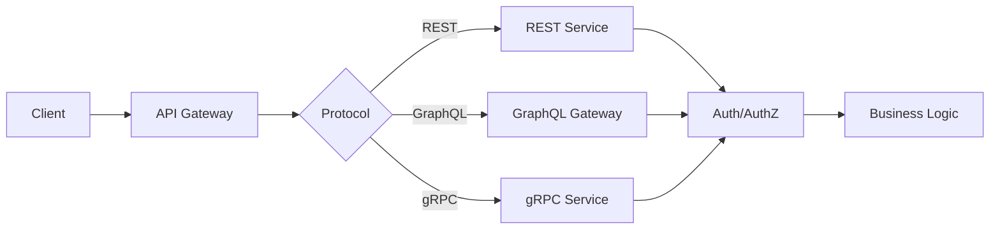
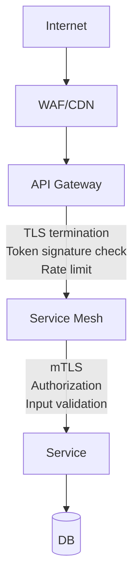

# API 보안

API 보안은 일반 웹 보안과 다르다. 웹은 사용자가 브라우저로 접근하니까 세션·쿠키·CSRF 같은 게 이슈인데, API는 클라이언트가 모바일 앱이든 SSR 서버든 외부 파트너든 다 다르다. 그래서 인증 방식도, 권한 검증 방식도, 방어 지점도 달라진다.

5년 동안 백엔드를 하면서 API 쪽에서 사고 났던 패턴은 거의 비슷하다. 인증은 잘 걸어놨는데 인가가 허술하거나, GraphQL에 introspection이 켜져 있거나, gRPC를 내부망이라는 이유로 평문으로 깔아놨거나, API Gateway에서 Rate Limit만 걸고 스키마 검증은 빠뜨렸거나. 이런 경우가 실무에서 압도적으로 많다.

---

## REST/GraphQL/gRPC 보안 모델 비교

세 프로토콜은 트래픽 형태가 달라서 방어 지점도 다르다.



REST는 URL 패턴이 명확해서 Gateway에서 경로 기반 통제가 쉽다. GraphQL은 엔드포인트가 `/graphql` 하나라서 쿼리 자체를 파싱해야 통제가 가능하다. gRPC는 HTTP/2 위에 바이너리 프로토콜이라 일반 WAF로는 페이로드를 못 본다.

**보안 책임 분담**

| 계층 | REST | GraphQL | gRPC |
|------|------|---------|------|
| TLS | 필수 | 필수 | 필수 (mTLS 권장) |
| 인증 | Bearer/API Key | Bearer/API Key | mTLS 인증서 + Token |
| 인가 | URL 패턴 + 핸들러 | Resolver별 | 메서드별 인터셉터 |
| 스키마 검증 | OpenAPI | GraphQL 스키마 | Protobuf |
| Rate Limit | Gateway | 쿼리 복잡도 기반 | Gateway + 인터셉터 |

---

## 인증 패턴

### REST에서 흔히 쓰는 방식

- **API Key**: 외부 파트너용. 키 자체가 자격이라 노출되면 끝이다.
- **Bearer Token (JWT)**: 사용자용. 짧은 TTL로 발급하고 Refresh Token으로 갱신한다.
- **OAuth 2.0**: 3rd-party 위임 인가. 토큰 발급 흐름이 표준화돼 있다.
- **mTLS**: B2B에서 클라이언트 인증서를 검증하는 방식. 키 유출 시에도 인증서 폐기로 막는다.

```java
@RestController
@RequestMapping("/api/v1")
public class OrderController {

    @GetMapping("/orders/{orderId}")
    public OrderResponse getOrder(
            @PathVariable String orderId,
            @AuthenticationPrincipal UserPrincipal user) {

        // 인증된 사용자만 도달. 그런데 이 사용자가 이 orderId에
        // 접근할 권한이 있는지는 별도 검증이다 (BOLA 방어 지점)
        return orderService.findByIdForUser(orderId, user.getUserId());
    }
}
```

`@AuthenticationPrincipal`만 받으면 인증이 끝났다고 착각하기 쉽다. 인증은 "누구냐"고, 인가는 "이 리소스에 접근 가능하냐"다. 둘은 다른 문제다.

### GraphQL 인증

GraphQL은 엔드포인트가 하나라서 인증은 보통 HTTP 레이어에서 한 번 끝낸다. 그런데 권한은 쿼리 안의 각 필드/리졸버 단위로 걸어야 한다.

```javascript
// Apollo Server 기준
const resolvers = {
  Query: {
    user: async (parent, { id }, context) => {
      if (!context.user) {
        throw new GraphQLError('Unauthorized', {
          extensions: { code: 'UNAUTHENTICATED' }
        });
      }
      // 본인 정보 또는 관리자만
      if (context.user.id !== id && !context.user.isAdmin) {
        throw new GraphQLError('Forbidden', {
          extensions: { code: 'FORBIDDEN' }
        });
      }
      return userService.findById(id);
    }
  }
};
```

### gRPC 인증

gRPC는 인터셉터에서 메타데이터의 토큰을 검사한다. Context에 사용자 정보를 주입해서 다음 단계로 넘긴다.

```go
func AuthInterceptor(ctx context.Context, req interface{},
    info *grpc.UnaryServerInfo, handler grpc.UnaryHandler) (interface{}, error) {

    md, ok := metadata.FromIncomingContext(ctx)
    if !ok {
        return nil, status.Error(codes.Unauthenticated, "missing metadata")
    }

    tokens := md.Get("authorization")
    if len(tokens) == 0 {
        return nil, status.Error(codes.Unauthenticated, "missing token")
    }

    user, err := verifyToken(tokens[0])
    if err != nil {
        return nil, status.Error(codes.Unauthenticated, "invalid token")
    }

    ctx = context.WithValue(ctx, userKey, user)
    return handler(ctx, req)
}
```

메서드별로 인증이 필요 없는 게 있으면 `info.FullMethod`로 분기한다. 헬스체크 같은 건 보통 인증 없이 두는데, 이때도 노출 범위는 내부망으로 제한한다.

---

## API 키 관리

API 키는 정적 자격증명이라 위험도가 가장 높다. 발급 시점부터 폐기까지 전 생명주기를 관리해야 한다.

### 키 저장은 해시로

DB에 평문으로 키를 저장하면 안 된다. 비밀번호처럼 해시해서 저장하고, 비교는 해시 결과로 한다.

```java
public class ApiKeyService {

    public String issueKey(String clientId) {
        // 32바이트 랜덤 + Base64URL 인코딩
        byte[] random = new byte[32];
        new SecureRandom().nextBytes(random);
        String rawKey = Base64.getUrlEncoder().withoutPadding().encodeToString(random);

        // prefix를 붙여서 식별 가능하게 한다 (Stripe 방식)
        String prefixedKey = "sk_live_" + rawKey;

        // 저장은 SHA-256 해시
        String hashedKey = DigestUtils.sha256Hex(prefixedKey);

        apiKeyRepository.save(new ApiKey(
            clientId,
            hashedKey,
            prefixedKey.substring(0, 12), // 앞 12자만 표시용 (sk_live_xxxx)
            LocalDateTime.now()
        ));

        // 평문은 발급 직후 한 번만 반환. 다시는 못 본다
        return prefixedKey;
    }

    public boolean verify(String rawKey) {
        String hashed = DigestUtils.sha256Hex(rawKey);
        return apiKeyRepository.existsByHashedKey(hashed);
    }
}
```

prefix를 붙이는 이유는 두 가지다. 첫째, GitHub 같은 곳에 실수로 커밋됐을 때 키 스캐너가 잡을 수 있다. 둘째, 운영 환경(`sk_live_`)과 테스트 환경(`sk_test_`) 구분이 명확하다.

### 키 로테이션

키 로테이션을 못 하면 유출됐을 때 대응이 안 된다. 두 개의 키를 동시에 활성화할 수 있는 구조로 만들어야 무중단 로테이션이 된다.

```java
// 클라이언트당 최대 2개 키를 둔다. 새 키 발급 → 클라이언트 전환 → 구 키 폐기
public List<ApiKey> getActiveKeys(String clientId) {
    return apiKeyRepository.findActiveByClientId(clientId)
        .stream()
        .filter(k -> k.getExpiresAt().isAfter(LocalDateTime.now()))
        .collect(Collectors.toList());
}
```

90일 주기로 강제 로테이션을 거는 곳도 있다. 정책에 맞춰 만료일을 강제하고 만료 7일 전부터 알림을 보낸다.

---

## BOLA (Broken Object Level Authorization)

OWASP API Top 10에서 1위로 올라온 취약점이다. 인증은 됐는데 객체 단위 인가가 빠진 경우를 말한다.

### 전형적인 버그

```java
@GetMapping("/api/v1/users/{userId}/orders")
public List<Order> getUserOrders(
        @PathVariable Long userId,
        @AuthenticationPrincipal UserPrincipal user) {
    // 인증된 사용자라면 누구든 userId만 바꿔서 남의 주문을 조회한다
    return orderRepository.findByUserId(userId);
}
```

요청자가 인증됐다고 해서 path의 `userId`가 본인이라는 보장이 없다. `userId=123`을 `userId=124`로 바꾸면 그대로 통과한다. 실제로 OWASP에서 가장 흔한 케이스다.

### 방어

```java
@GetMapping("/api/v1/users/{userId}/orders")
public List<Order> getUserOrders(
        @PathVariable Long userId,
        @AuthenticationPrincipal UserPrincipal user) {

    // 본인 또는 관리자만 허용
    if (!user.getId().equals(userId) && !user.hasRole("ADMIN")) {
        throw new AccessDeniedException("자신의 주문만 조회 가능");
    }
    return orderRepository.findByUserId(userId);
}
```

더 안전한 패턴은 URL에서 `userId`를 받지 않는 거다. 토큰의 subject에서 직접 꺼내 쓴다.

```java
@GetMapping("/api/v1/me/orders")
public List<Order> getMyOrders(@AuthenticationPrincipal UserPrincipal user) {
    return orderRepository.findByUserId(user.getId());
}
```

리소스가 다른 사용자에 속한 경우엔 조회 쿼리에 소유권 조건을 포함시킨다.

```java
// 나쁜 예: 객체를 먼저 찾고 권한을 검사
Order order = orderRepository.findById(orderId);
if (!order.getUserId().equals(user.getId())) {
    throw new AccessDeniedException();
}

// 좋은 예: 쿼리 자체에 소유권 조건을 포함
Order order = orderRepository.findByIdAndUserId(orderId, user.getId())
    .orElseThrow(() -> new ResourceNotFoundException());
```

후자가 안전한 이유는 두 가지다. 권한 검증 누락이 구조적으로 일어나지 않고, 존재 여부를 외부에 노출하지 않는다(404와 403 응답을 통일).

---

## BFLA (Broken Function Level Authorization)

기능 단위 인가가 깨진 케이스다. 일반 사용자가 관리자 전용 API에 접근하는 식이다.

```java
// 잘못된 패턴: URL이 /admin이어야만 막힌다고 착각
@RestController
public class UserController {

    @DeleteMapping("/api/v1/users/{id}")  // /admin이 안 붙음
    public void deleteUser(@PathVariable Long id) {
        // 권한 검증이 없다. 누구나 사용자를 삭제한다
        userService.delete(id);
    }
}
```

방어는 메서드 레벨 권한 검증을 강제하는 거다. Spring Security 기준으로 `@PreAuthorize`를 쓰거나 컨트롤러 진입 전 인터셉터에서 메서드별 권한 매핑을 검사한다.

```java
@DeleteMapping("/api/v1/users/{id}")
@PreAuthorize("hasRole('ADMIN')")
public void deleteUser(@PathVariable Long id) {
    userService.delete(id);
}
```

조직 단위 권한이라면 더 세분화한다.

```java
@PreAuthorize("hasPermission(#orgId, 'Organization', 'DELETE_MEMBER')")
public void removeMember(@PathVariable Long orgId, @PathVariable Long memberId) {
    // ...
}
```

운영하면서 본 사고 중에는, "관리자 메뉴에 안 보이니까 호출 못 한다"고 생각해서 API에 권한을 안 걸어둔 케이스가 많았다. 프론트에서 메뉴를 안 보여줘도 API는 직접 호출 가능하다.

---

## GraphQL 보안

GraphQL은 자유도가 높은 만큼 보안 표면도 넓다.

### Introspection 차단

운영 환경에서는 introspection을 끈다. 스키마가 그대로 노출되면 공격자가 모든 타입과 필드를 알아낸다.

```javascript
// Apollo Server
const server = new ApolloServer({
  typeDefs,
  resolvers,
  introspection: process.env.NODE_ENV !== 'production',
});
```

스키마 자체가 비밀은 아니지만, 노출 시 공격 경로 탐색이 쉬워진다. 내부 도구나 게이트웨이를 통한 접근만 허용한다.

### 쿼리 깊이 제한

GraphQL은 중첩 쿼리가 가능해서 깊이를 제한 안 하면 DoS가 난다.

```graphql
# 악의적 쿼리 예: 사용자→친구→친구→친구... N단계
query Malicious {
  user(id: "1") {
    friends {
      friends {
        friends {
          friends {
            name
          }
        }
      }
    }
  }
}
```

`graphql-depth-limit`로 깊이를 제한한다.

```javascript
const depthLimit = require('graphql-depth-limit');

const server = new ApolloServer({
  typeDefs,
  resolvers,
  validationRules: [depthLimit(7)],  // 최대 7단계
});
```

### 쿼리 복잡도 제한

깊이만으로는 부족하다. 한 단계에서 너무 많은 필드를 요청하는 것도 막아야 한다.

```javascript
const { createComplexityLimitRule } = require('graphql-validation-complexity');

const ComplexityLimitRule = createComplexityLimitRule(1000, {
  scalarCost: 1,
  objectCost: 10,
  listFactor: 20,
});

const server = new ApolloServer({
  typeDefs,
  resolvers,
  validationRules: [ComplexityLimitRule],
});
```

복잡도 점수는 필드별로 비용을 매기고 합산한다. List 타입은 multiplier를 크게 잡아서 페이지네이션을 강제한다.

### 배치 공격 방어

GraphQL은 한 요청에 여러 쿼리를 묶어 보낸다. 이걸 악용해서 로그인 시도를 한 번에 1000번 보내는 식의 공격이 가능하다.

```javascript
// Aliased query로 한 번에 시도
mutation BatchLoginAttempt {
  a1: login(email: "victim@example.com", password: "pass1") { token }
  a2: login(email: "victim@example.com", password: "pass2") { token }
  a3: login(email: "victim@example.com", password: "pass3") { token }
  // ... 1000개
}
```

Rate Limit을 요청 단위가 아니라 작업(operation) 단위로 걸어야 한다. `graphql-rate-limit` 같은 라이브러리로 리졸버 레벨에서 제한한다.

```javascript
const { createRateLimitDirective } = require('graphql-rate-limit');

const rateLimitDirective = createRateLimitDirective({ identifyContext: ctx => ctx.user.id });

const typeDefs = gql`
  type Mutation {
    login(email: String!, password: String!): AuthPayload
      @rateLimit(limit: 5, duration: 60)
  }
`;
```

---

## gRPC 보안

### TLS는 기본, mTLS가 표준

내부망이라고 평문 gRPC를 깔면 안 된다. 사이드카 프록시(Envoy, Linkerd)가 자동으로 mTLS를 거는 환경이 아닌 한, 애플리케이션 레벨에서 TLS를 강제한다.

```go
// 서버 측 mTLS 설정
cert, err := tls.LoadX509KeyPair("server.crt", "server.key")
if err != nil { log.Fatal(err) }

caCert, err := os.ReadFile("ca.crt")
if err != nil { log.Fatal(err) }
caPool := x509.NewCertPool()
caPool.AppendCertsFromPEM(caCert)

tlsConfig := &tls.Config{
    Certificates: []tls.Certificate{cert},
    ClientCAs:    caPool,
    ClientAuth:   tls.RequireAndVerifyClientCert,  // 클라이언트 인증서 검증
    MinVersion:   tls.VersionTLS13,
}

server := grpc.NewServer(grpc.Creds(credentials.NewTLS(tlsConfig)))
```

`tls.RequireAndVerifyClientCert`가 핵심이다. 클라이언트 인증서를 받고 CA로 검증한다. 인증서의 CN/SAN으로 어떤 서비스가 호출했는지 식별까지 가능하다.

### 인터셉터로 인가

```go
func AuthorizeInterceptor(allowedRoles map[string][]string) grpc.UnaryServerInterceptor {
    return func(ctx context.Context, req interface{},
        info *grpc.UnaryServerInfo, handler grpc.UnaryHandler) (interface{}, error) {

        user, ok := ctx.Value(userKey).(*User)
        if !ok {
            return nil, status.Error(codes.Unauthenticated, "no user in context")
        }

        roles, found := allowedRoles[info.FullMethod]
        if !found {
            // 허용 목록에 없는 메서드는 기본 거부
            return nil, status.Error(codes.PermissionDenied, "method not allowed")
        }

        if !hasAnyRole(user.Roles, roles) {
            return nil, status.Error(codes.PermissionDenied, "insufficient permission")
        }

        return handler(ctx, req)
    }
}
```

기본 거부(default deny)가 중요하다. 권한 매핑을 빠뜨려도 자동으로 막힌다. 화이트리스트 방식이 안전하다.

### 리플렉션 비활성화

gRPC 리플렉션은 디버깅 편의를 위해 서비스 스키마를 노출한다. 운영에선 끈다.

```go
if os.Getenv("ENV") == "dev" {
    reflection.Register(server)  // dev에서만
}
```

---

## API Gateway 레벨 방어

API Gateway는 모든 트래픽의 진입점이라 방어 효율이 가장 좋다.

### Gateway에서 거를 것들

- TLS 종단 (TLS 1.3 이상)
- 인증 토큰 1차 검증 (서명만)
- Rate Limit (IP, 사용자, 토큰별)
- IP 기반 차단 (WAF)
- Request Size 제한
- 비정상 패턴 차단 (User-Agent 누락, 의심 헤더)

### 서비스에서 해야 할 것들

- 인증 토큰 상세 검증 (만료, 권한, 발급자)
- 비즈니스 권한 검증 (BOLA/BFLA)
- 입력값 검증
- 트랜잭션 무결성

Gateway는 1차 필터링이지 최종 방어선이 아니다. 사용자가 Gateway를 우회해서 서비스에 직접 도달할 가능성을 항상 가정한다(쿠버네티스 클러스터 내부 침투, VPN 우회 등).



### Kong 기반 Rate Limit 설정 예시

```yaml
plugins:
  - name: rate-limiting
    config:
      minute: 60
      hour: 1000
      policy: redis
      redis_host: redis.internal
      fault_tolerant: true
      hide_client_headers: false
      identifier: credential  # 토큰별 제한
```

`identifier: credential`로 두면 토큰 단위로 제한된다. `consumer`나 `ip`도 있는데, 모바일 앱처럼 한 IP 뒤에 수만 명이 있는 경우엔 IP 기반은 위험하다.

---

## OpenAPI 기반 스키마 검증

OpenAPI 스펙으로 API를 정의했다면 그 스펙을 런타임 검증에도 써먹는다. 코드와 문서가 갈라지는 문제도 해결된다.

### 요청 검증

Spring Boot에서는 `springdoc-openapi-starter-webmvc-api`와 `swagger-request-validator-spring`을 조합한다.

```java
@Configuration
public class OpenApiValidationConfig {

    @Bean
    public OpenApiInteractionValidator validator() {
        return OpenApiInteractionValidator
            .createForSpecificationUrl("classpath:openapi.yaml")
            .withLevelResolver(LevelResolver.create()
                .withLevel("validation.response", ValidationReport.Level.IGNORE)
                .build())
            .build();
    }

    @Bean
    public ValidationInterceptor validationInterceptor(OpenApiInteractionValidator validator) {
        return new ValidationInterceptor(validator);
    }
}
```

이 패턴은 컨트롤러 진입 전에 요청 페이로드가 스펙에 맞는지 자동 검증한다. DTO에 어노테이션을 일일이 다는 것보다 일관성이 높다.

### 응답 검증 (개발/스테이징)

운영에서는 부담이라 끄지만, 스테이징까지는 응답도 검증한다. 스펙과 실제 응답이 어긋난 경우를 잡는다.

```java
.withLevel("validation.response", ValidationReport.Level.ERROR)
```

### 예시 스키마

```yaml
paths:
  /orders:
    post:
      requestBody:
        required: true
        content:
          application/json:
            schema:
              $ref: '#/components/schemas/CreateOrderRequest'
      responses:
        '201':
          description: 주문 생성 완료
          content:
            application/json:
              schema:
                $ref: '#/components/schemas/Order'

components:
  schemas:
    CreateOrderRequest:
      type: object
      required: [productId, quantity]
      properties:
        productId:
          type: string
          pattern: '^PRD-[0-9]{8}$'
        quantity:
          type: integer
          minimum: 1
          maximum: 9999
        deliveryNote:
          type: string
          maxLength: 200
      additionalProperties: false
```

`additionalProperties: false`가 보안상 중요하다. 스펙에 없는 필드를 거부한다. Mass Assignment 같은 공격을 막는다(클라이언트가 `isAdmin: true` 같은 필드를 끼워 넣어도 거부).

### Contract Testing

스펙을 정의했으면 Provider/Consumer 양쪽에서 계약 테스트를 돌린다. Pact나 Spring Cloud Contract로 한다.

```java
@PactProviderTest
@Provider("order-service")
@PactFolder("pacts")
class OrderServicePactTest {

    @TestTemplate
    @ExtendWith(PactVerificationInvocationContextProvider.class)
    void verifyPact(PactVerificationContext context) {
        context.verifyInteraction();
    }
}
```

스펙이 깨지는 변경을 막으니까 클라이언트가 망가지는 사고가 줄어든다.

---

## 운영에서 흔히 보는 사고 패턴

지금까지 본 사고를 정리하면 몇 가지가 반복된다.

**JWT 검증을 했지만 서명 알고리즘을 안 정한 경우**

`{"alg": "none"}` 헤더를 받아주는 라이브러리가 있다. 발급 시 알고리즘을 명시해도, 검증 시 알고리즘을 강제하지 않으면 우회된다. 라이브러리 설정에서 `RS256` 또는 `ES256`을 화이트리스트로 강제한다.

**Refresh Token을 너무 오래 살린 경우**

Refresh Token이 6개월짜리인데 무효화 메커니즘이 없으면, 한 번 탈취되면 6개월간 막을 방법이 없다. Refresh Token도 짧게(7~14일) 잡고, 사용 시 자동 회전(rotating refresh token)을 적용한다.

**CORS를 `*`로 열어둔 API**

`Access-Control-Allow-Origin: *`와 `Access-Control-Allow-Credentials: true`는 같이 못 쓴다. 그래도 종종 실수로 함께 설정된 걸 본다. 허용 출처는 명시적으로 화이트리스트로 관리한다.

**에러 응답에 내부 정보 노출**

스택 트레이스, DB 에러 메시지, 내부 IP가 그대로 노출되는 경우가 많다. 운영 환경에선 5xx 응답을 일반화하고, 상세 로그는 서버에만 남긴다.

```java
@RestControllerAdvice
public class GlobalExceptionHandler {

    private static final Logger log = LoggerFactory.getLogger(GlobalExceptionHandler.class);

    @ExceptionHandler(Exception.class)
    public ResponseEntity<ErrorResponse> handleGeneric(Exception e, HttpServletRequest req) {
        String traceId = MDC.get("traceId");
        log.error("[{}] Unhandled exception on {} {}", traceId, req.getMethod(), req.getRequestURI(), e);
        return ResponseEntity.status(500)
            .body(new ErrorResponse("INTERNAL_ERROR", "처리 중 오류가 발생했다", traceId));
    }
}
```

traceId만 클라이언트에 노출하고 상세는 서버 로그에만 남긴다. 문의가 들어오면 traceId로 조회한다.

**Rate Limit을 IP 기반으로만 건 경우**

모바일 캐리어 NAT 뒤에는 수십만 명이 같은 IP를 쓴다. IP 기반 Rate Limit만 걸면 정상 사용자가 차단된다. 인증 사용자는 사용자 ID 기반, 비인증은 IP 기반 + 디바이스 핑거프린트를 조합한다.

---

## 참고

API 보안은 한 군데서 막는 게 아니라 계층마다 막는다. Gateway에서 1차로 거르고, 서비스에서 2차로 검증하고, DB 쿼리에서 3차로 소유권을 확인한다. 어느 하나에 의존하면 한 군데 뚫리는 순간 다 노출된다.

스펙(OpenAPI, GraphQL SDL, Protobuf)을 코드 생성·런타임 검증·계약 테스트에 모두 활용해야 일관성이 유지된다. 코드와 스펙이 분리되면 어느 쪽도 신뢰할 수 없게 된다.
