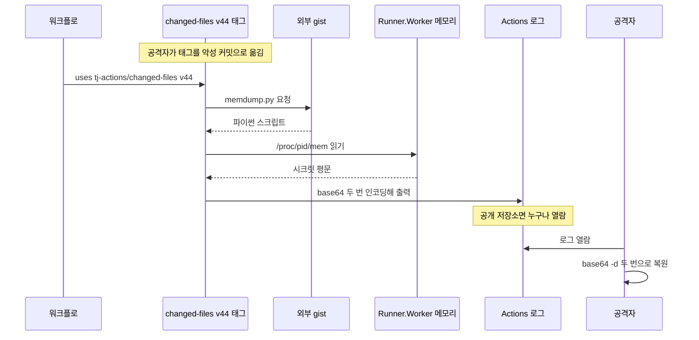
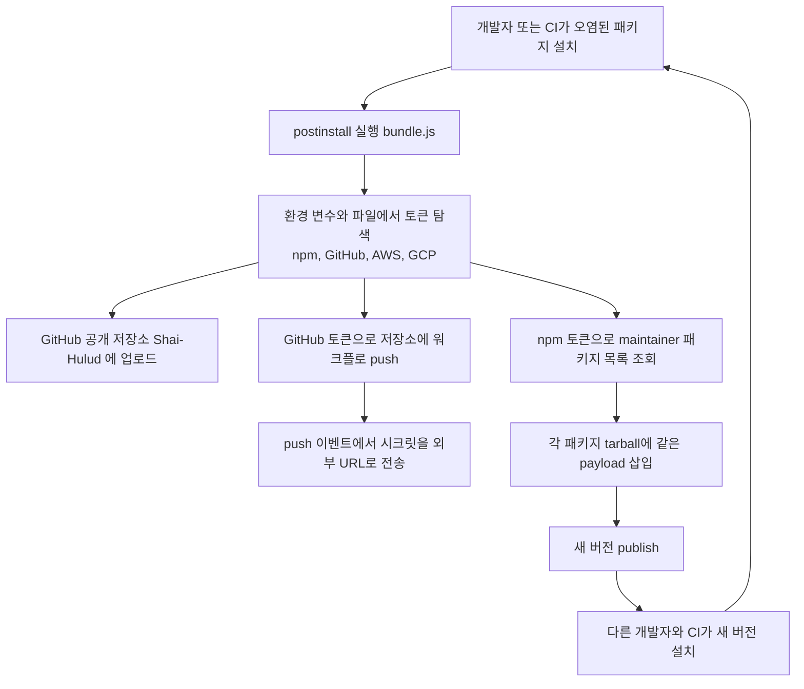
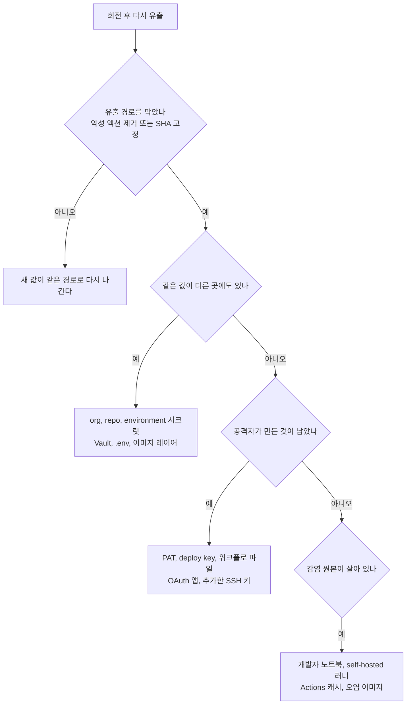

# CI/CD 파이프라인 공격

CI 러너는 서비스에서 가장 많은 권한이 한곳에 모이는 장비다. 클라우드 배포 키, 레지스트리 발행 토큰, 저장소 쓰기용 PAT가 환경 변수로 들어오고, 그 위에서 내가 쓰지도 않은 남의 코드(서드파티 액션, npm 패키지의 설치 스크립트)가 같은 권한으로 돈다. 운영 서버는 방화벽과 네트워크 분리로 막아 두면서 CI 러너에는 `secrets.*`를 통째로 넘겨 주는 구성이 흔하다.

2021년 Codecov부터 2025년 Shai-Hulud까지, 이 문서가 다루는 사고 네 건은 모두 파이프라인이나 빌드 환경에서 시작됐다. 사고별 연표와 당일 점검 항목은 [최근 보안사고 사례 2021~2025](Recent_Security_Incidents.md)에 있다. SBOM, 서명, 의존성 일반론은 [공급망 공격 방어](Supply_Chain_Security.md)에 있다. 이 문서는 두 문서가 비워 둔 부분, 즉 파이프라인 안의 시크릿이 어떻게 새고 액션 버전 고정이 왜 필요한지를 다룬다. 문서 안의 명령은 Linux 샌드박스에서 실행해 확인한 것이고, 실행하지 못한 부분은 그렇다고 적었다.

## 네 건의 사고, 같은 구조

| 사고 | 시점 | 뚫린 곳 | 빼간 것 | 퍼진 방식 |
|---|---|---|---|---|
| Codecov bash uploader | 2021-01-31 ~ 04-01 | 고객 CI가 매번 받아 실행하는 스크립트 | CI 환경 변수, git remote URL | 스크립트 한 파일 변조 |
| 3CX | 2023-03 | 3CX 자신의 빌드 환경 | 정상 서명된 앱에 악성 코드 | 정상 업데이트 경로 |
| tj-actions/changed-files | 2025-03 | 액션 태그 | 러너 메모리의 시크릿 | 태그를 악성 커밋으로 이동 |
| Shai-Hulud | 2025-09 | npm maintainer 토큰 | 개발자 PAT, 클라우드 키, npm 토큰 | 훔친 토큰으로 다른 패키지 재발행 |

Codecov, tj-actions는 "남이 관리하는 코드를 버전 이름으로 불러서 실행한다"는 점이 같다. 3CX와 Shai-Hulud는 "정상 경로로 배포된 산출물이 이미 오염돼 있다"는 점이 같다. 앞쪽은 참조 방식을 바꿔서 막을 수 있고, 뒤쪽은 설치 시점의 실행을 막고 발행 권한을 줄이는 쪽으로 대응해야 한다.

## Codecov bash uploader

Codecov는 커버리지를 올리는 bash 스크립트를 `curl`로 받아 바로 실행하는 방식을 문서와 예제에 두고 있었고, CI 설정에 그 한 줄이 들어간 프로젝트가 많았다. Codecov 보안 공지에 따르면 2021년 1월 31일부터 4월 1일까지 이 스크립트가 변조돼 있었다. 변조 내용은 `env` 출력과 `git remote -v` 결과를 외부 IP로 `curl` 전송하는 한 줄이었다. 원인은 Codecov의 Docker 이미지 생성 과정의 오류로 스크립트를 수정할 수 있는 자격증명이 노출된 것이다. [Codecov 보안 공지](https://about.codecov.io/security-update/)

발견 경위가 이 사고의 교훈이다. 4월 1일 한 고객이 Codecov가 공개한 `shasum`과 받은 스크립트의 해시가 다른 것을 보고 신고했다. 2개월을 넘게 아무도 몰랐고 해시를 대조한 고객 한 곳만 알아챘다. 같은 검증을 CI에서 자동으로 하면 된다.

```bash
sha256sum uploader.sh > uploader.sh.sha256   # 도입 시점에 한 번, 저장소에 커밋
sha256sum -c uploader.sh.sha256              # CI에서 매번
```

변조 전 파일로 검사하면 `uploader.sh: OK`, 끝에 `curl` 한 줄을 덧붙인 뒤 검사하면 다음 결과가 나온다.

```
uploader.sh: FAILED
sha256sum: WARNING: 1 computed checksum did NOT match
```

종료 코드가 1이라 파이프라인이 멈춘다. 해시 파일은 스크립트와 같은 서버가 아니라 저장소 안에 둬야 한다. 같은 서버에 두면 공격자가 둘 다 바꾼다.

## 3CX, 공급망 위에 공급망

3CX 데스크톱 앱은 정상 서명된 상태로 악성 코드가 배포됐다. Mandiant 조사에서 시작점은 3CX 직원이 개인 PC에 설치한 Trading Technologies의 X_TRADER 설치 프로그램이었다. 그 PC에서 얻은 자격증명으로 3CX 빌드 환경까지 들어간 것이다. [Mandiant 조사 결과 (3CX)](https://www.3cx.com/blog/news/mandiant-security-update2/)

고객 입장에서 서명 검증도 해시 검증도 통과하는 사고다. 막을 수 있는 쪽은 3CX였고, 거기서 쓸 수 있는 방어는 빌드 서버와 업무 PC의 분리, 빌드 환경에서 쓰는 자격증명의 수명 단축이다. 우리 서비스에 적용하면 "CI 러너에서 쓰는 키가 개발자 노트북에서도 같은 값으로 쓰이는가"를 먼저 본다. 같은 값이면 노트북 한 대의 침해가 곧 배포 권한 침해다.

## tj-actions/changed-files

### 무슨 일이 있었나

tj-actions/changed-files는 PR에서 바뀐 파일 목록을 뽑는 액션이다. 많은 저장소가 `uses: tj-actions/changed-files@v44`처럼 태그로 불러 썼다. CISA는 침해 시간을 2025년 3월 12일부터 15일로 적었고, GitHub 어드바이저리는 14일에서 15일로 적는다. 같은 경보에서 reviewdog/action-setup@v1 침해(3월 11일)도 함께 다뤘다. 수정 버전은 v46.0.1이다. [CISA 경보](https://www.cisa.gov/news-events/alerts/2025/03/18/supply-chain-compromise-third-party-github-action-cve-2025-30066), [GitHub 어드바이저리 GHSA-mrrh-fwg8-r2c3](https://github.com/advisories/GHSA-mrrh-fwg8-r2c3)

StepSecurity 분석에 따르면 공격자는 @tj-actions-bot 계정의 PAT를 손에 넣었고, 그 권한으로 기존 버전 태그를 악성 커밋 `0e58ed8671d6b60d0890c21b07f8835ace038e67`로 옮겼다. 저장소 코드도, 워크플로 파일도 바뀐 것이 없다. 사용자 쪽에서 보이는 변화는 같은 `@v44`가 가리키는 내용이 달라졌다는 것뿐이다. [StepSecurity 분석](https://www.stepsecurity.io/blog/harden-runner-detection-tj-actions-changed-files-action-is-compromised)

### 시크릿이 로그로 나가는 과정

악성 커밋은 base64로 감춘 셸 명령을 실행했다. 이 명령이 외부 gist에서 `memdump.py`를 받아 돌렸고, 스크립트는 `/proc`에서 `Runner.Worker` 프로세스를 찾아 `/proc/<pid>/maps`와 `/proc/<pid>/mem`으로 메모리를 읽고 시크릿 패턴을 모았다. 결과를 base64로 두 번 인코딩해 로그에 출력했다.



이 도식에서 봐야 할 지점은 공격자가 러너에 접속하지 않는다는 것이다. 공격자가 필요한 것은 공개 저장소 로그를 읽을 수 있는 브라우저뿐이고, 시크릿은 워크플로가 직접 로그에 내놓는다. 외부로 나가는 네트워크를 막는 egress 제한은 gist 다운로드는 막을 수 있어도 로그 출력은 막지 못한다. 로그는 정상 채널이기 때문이다.

GitHub의 시크릿 마스킹이 왜 못 막았는지도 짚어야 한다. 마스킹은 로그에서 시크릿 원문과 같은 문자열을 `***`로 바꾼다. 메모리에서 읽은 JSON 덩어리를 통째로 두 번 인코딩한 문자열에는 시크릿 원문이 그대로 들어 있지 않아서 마스킹에 걸리지 않는다. CISA가 "눈으로 알아보기 어렵다"고 한 이유다.

### 같은 job에 들어 있으면 같이 털린다

시크릿은 job이 시작될 때 러너 프로세스 메모리에 올라온다. 덤프 스크립트는 같은 사용자 권한으로 돌기 때문에 프로세스 메모리를 읽는 데 별도 권한 상승이 필요 없다. 그래서 "이 시크릿은 배포 스텝에만 `env:`로 넘긴다"는 방식으로는 부족하다. 시크릿을 쓰는 job과 서드파티 액션을 쓰는 job을 나눠서, 서드파티 액션이 도는 job의 메모리에는 시크릿이 올라오지 않게 해야 한다.

## 태그 참조와 SHA 고정

태그는 이동할 수 있는 이름이다. 아래 표에서 기준이 되는 것은 "참조 대상 저장소의 쓰기 권한을 얻은 공격자가 있을 때 무슨 일이 생기는가"다.

| 항목 | 태그 참조 `@v44` | SHA 고정 `@<40자 해시>` |
|---|---|---|
| 가리키는 대상 | 이동 가능한 포인터 | 불변 커밋 |
| 공격자가 태그를 옮기면 | 다음 실행부터 악성 코드가 돈다 | 영향 없음 |
| 코드 리뷰 가능 여부 | 어떤 코드가 돌았는지 시점별로 알 수 없다 | 워크플로 파일의 해시가 곧 실행 코드다 |
| 업데이트 | 자동으로 따라간다 | 직접 올려야 한다 (Dependabot이 처리) |
| 가독성 | 좋다 | 나쁘다. 주석으로 `# v4`를 남긴다 |
| 고정하지 못하는 것 | | 액션 내부에서 태그로 부르는 다른 액션 |

마지막 행은 놓치기 쉽다. composite 액션이 내부에서 `uses: other/action@v1`로 부르는 경우 내 워크플로에서 SHA로 고정한 것은 바깥 액션뿐이다. 안쪽은 내가 정할 수 없다.

로컬에서 태그가 이동하는 상황을 재현해 봤다. 저장소를 만들고 `v44` 태그를 붙인 뒤, 악성 커밋을 추가하고 같은 태그를 옮겼다.

```
tag v44 now  -> 65c158647e6ba0b2dcf9aec48e651d83cd2d90ec
good commit   -> 8659dc5df907696c0ab3952792fe353dde4636c9
clone @v44 -> 65c158647e6ba0b2dcf9aec48e651d83cd2d90ec
clone @SHA -> 8659dc5df907696c0ab3952792fe353dde4636c9
```

태그로 받은 쪽은 악성 커밋을 받고, SHA로 받은 쪽은 원래 커밋을 받는다. 워크플로 파일은 어느 쪽도 바뀌지 않았다.

### 일괄 고정 스크립트

손으로 해시를 찾아 붙이면 틀린다. `git ls-remote`로 태그를 해시로 풀어 주는 스크립트를 쓴다. 주석 태그(annotated tag)는 `^{}` 줄이 실제 커밋이라서 그 줄을 먼저 본다. `actions/checkout`의 `v4`는 가벼운 태그라 `^{}` 줄이 없고 커밋이 바로 나온다. 두 경우를 다 처리해야 한다.

```python
#!/usr/bin/env python3
"""워크플로의 uses: owner/repo@tag 를 커밋 SHA 로 바꾼다. 원래 태그는 주석으로 남긴다."""
import re, subprocess, sys, pathlib

USES = re.compile(r'^(\s*-?\s*uses:\s*)([\w.-]+/[\w./-]+)@([^\s#]+)(.*)$')
SHA = re.compile(r'^[0-9a-f]{40}$')
cache = {}

def resolve(repo, ref):
    key = (repo, ref)
    if key in cache:
        return cache[key]
    base = "/".join(repo.split("/")[:2])
    out = subprocess.run(
        ["git", "ls-remote", f"https://github.com/{base}",
         f"refs/tags/{ref}", f"refs/tags/{ref}^{{}}", f"refs/heads/{ref}"],
        capture_output=True, text=True, check=True).stdout.split("\n")
    refs = {l.split("\t")[1]: l.split("\t")[0] for l in out if l}
    sha = refs.get(f"refs/tags/{ref}^{{}}") or refs.get(f"refs/tags/{ref}") or refs.get(f"refs/heads/{ref}")
    if not sha:
        sys.exit(f"{repo}@{ref} 를 찾지 못했다")
    cache[key] = sha
    return sha

def main(paths):
    for p in paths:
        lines = pathlib.Path(p).read_text().split("\n")
        changed = False
        for i, line in enumerate(lines):
            m = USES.match(line)
            if not m or m.group(2).startswith("./") or SHA.match(m.group(3)):
                continue
            sha = resolve(m.group(2), m.group(3))
            lines[i] = f"{m.group(1)}{m.group(2)}@{sha} # {m.group(3)}"
            print(f"{p}:{i+1}  {m.group(2)}@{m.group(3)} -> {sha[:12]}")
            changed = True
        if changed:
            pathlib.Path(p).write_text("\n".join(lines))

main(sys.argv[1:])
```

이 저장소의 `quality-gate.yml` 복사본에 돌린 결과다.

```
wf/quality-gate.yml:18  actions/checkout@v4 -> 11d5960a3267
wf/quality-gate.yml:22  actions/setup-python@v5 -> a26af69be951
wf/quality-gate.yml:27  actions/cache@v4 -> 0057852bfaa8
```

diff는 `uses: actions/checkout@v4`가 `uses: actions/checkout@11d5960a326750d5838078e36cf38b85af677262 # v4`로 바뀐 것이 전부다. 두 번째 실행은 출력이 없다. 이미 40자 해시인 줄은 건너뛰기 때문이다.

고정이 풀리는 것을 막으려면 CI에서 태그 참조를 실패로 처리한다.

```bash
#!/usr/bin/env bash
# SHA 로 고정되지 않은 외부 액션을 찾는다. 로컬 액션(./)은 제외.
grep -rnE '^\s*-?\s*uses:\s*[^./ ][^@ ]*@' .github --include='*.yml' --include='*.yaml' \
  | grep -vE '@[0-9a-f]{40}(\s|$)' && exit 1
exit 0
```

이 저장소 루트에서 돌리면 `quality-gate.yml`과 `deploy-docs.yml`의 태그 참조 6줄이 나오고 종료 코드 1이다. 위 스크립트로 고정한 복사본에서는 출력 없이 종료 코드 0이다. 이 저장소 자체가 아직 태그 참조 상태라는 뜻이기도 하다.

SHA를 고정하면 보안 패치가 나와도 자동으로 따라가지 않는다. Dependabot의 `github-actions` 생태계를 켜 두면 SHA 옆 주석의 버전을 보고 갱신 PR을 올려 준다. 그 PR을 사람이 보고 합쳐야 고정의 의미가 유지된다.

## 권한을 줄이는 워크플로

SHA 고정은 "남이 바뀌는 것"을 막는다. 남이 바뀌지 않아도 처음부터 나쁜 액션을 쓸 수 있고, 내 워크플로가 가진 권한이 크면 피해가 커진다. 아래는 위 내용을 적용한 배포 워크플로다. 최상위에서 모든 권한을 닫고, job마다 필요한 것만 연다.

```yaml
name: deploy

on:
  push:
    branches: [main]

permissions: {}

concurrency:
  group: deploy
  cancel-in-progress: false

jobs:
  test:
    runs-on: ubuntu-24.04
    permissions:
      contents: read
    steps:
      - uses: actions/checkout@11d5960a326750d5838078e36cf38b85af677262 # v4
        with:
          persist-credentials: false
      - uses: actions/setup-node@49933ea5288caeca8642d1e84afbd3f7d6820020 # v4
        with:
          node-version: 20
      - run: corepack enable && pnpm install --frozen-lockfile --ignore-scripts
      - run: pnpm test

  deploy:
    needs: test
    runs-on: ubuntu-24.04
    environment: production
    permissions:
      contents: read
      id-token: write
    steps:
      - uses: actions/checkout@11d5960a326750d5838078e36cf38b85af677262 # v4
        with:
          persist-credentials: false
      - uses: aws-actions/configure-aws-credentials@7474bc4690e29a8392af63c5b98e7449536d5c3a # v4
        with:
          role-to-assume: arn:aws:iam::123456789012:role/gha-deploy
          aws-region: ap-northeast-2
      - run: aws sts get-caller-identity
```

이 파일은 actionlint 1.7.12로 검사했고 오류가 없었다. 실제 AWS 계정이 없어서 `AssumeRoleWithWebIdentity` 호출 자체는 돌려 보지 못했다.

몇 가지 선택의 이유를 적는다.

- `permissions: {}`를 최상위에 두면 job에서 명시하지 않은 권한은 전부 없다. 저장소 기본값이 쓰기 권한으로 열려 있는 경우가 있어서 파일에서 직접 닫아야 한다.
- `persist-credentials: false`가 없으면 `actions/checkout`이 `GITHUB_TOKEN`을 `.git/config`에 남기고, 이후 스텝에서 도는 모든 코드가 그 토큰을 읽을 수 있다.
- `test` job에는 시크릿이 없고 `deploy` job에는 서드파티 액션이 AWS 공식 액션 하나뿐이다. tj-actions 같은 액션이 필요하면 `test` 쪽에서만 쓴다. 메모리 덤프가 일어나도 나올 시크릿이 없다.
- `environment: production`은 승인 규칙을 붙일 수 있고 OIDC의 `sub` 클레임에도 환경 이름이 들어간다.

## OIDC로 장기 시크릿 없애기

`AWS_SECRET_ACCESS_KEY`를 GitHub 시크릿에 넣어 두면 그 값은 회전하기 전까지 유효하다. tj-actions에서 로그에 찍힌 키는 공격자가 이틀 뒤에 읽어도 그대로 쓸 수 있다. OIDC로 바꾸면 워크플로가 실행될 때마다 GitHub가 발급한 토큰을 AWS STS에 내고 임시 자격증명을 받는다. 저장된 장기 키가 없어서 유출될 값도 없다.

IAM 역할의 신뢰 정책이 핵심이다. 아래 정책 JSON은 `python3 -m json.tool`로 문법만 확인했다.

```json
{
  "Version": "2012-10-17",
  "Statement": [
    {
      "Effect": "Allow",
      "Principal": {
        "Federated": "arn:aws:iam::123456789012:oidc-provider/token.actions.githubusercontent.com"
      },
      "Action": "sts:AssumeRoleWithWebIdentity",
      "Condition": {
        "StringEquals": {
          "token.actions.githubusercontent.com:aud": "sts.amazonaws.com",
          "token.actions.githubusercontent.com:sub": "repo:my-org/my-repo:environment:production"
        }
      }
    }
  ]
}
```

`sub`를 `repo:my-org/*`처럼 와일드카드로 두는 설정이 흔한 실수다. 조직 안의 어느 저장소 워크플로든 이 역할을 맡을 수 있게 되고, 그중 하나만 오염돼도 배포 권한이 넘어간다. 저장소와 환경까지 지정한 값을 `StringEquals`로 쓴다.

OIDC에도 한계가 있다. 같은 job 안에서 악성 스텝이 `configure-aws-credentials` 뒤에 돌면 그 시점에 유효한 임시 자격증명을 가져갈 수 있다. 달라지는 점은 로그에 찍힌 값이 만료돼 이틀 뒤에는 쓸 수 없다는 것이다. 유효 시간이 수 시간으로 줄어드는 것이지 노출 자체가 없어지지는 않으므로, 앞 절의 job 분리와 함께 써야 한다.

## Shai-Hulud, 토큰이 번식 수단이 된 웜

Shai-Hulud는 npm에서 퍼진 자기 복제 웜이다. CISA는 2025년 9월 23일 경보에서 500개가 넘는 패키지가 오염됐다고 밝혔다. 오염된 패키지는 `postinstall` 훅으로 번들된 `bundle.js`를 실행한다. 이 스크립트는 환경 변수와 파일에서 npm, GitHub, AWS, GCP 토큰을 찾고, 훔친 GitHub 토큰으로 `Shai-Hulud`라는 공개 저장소에 올리거나 워크플로를 push해 외부 URL로 시크릿을 보낸다. 가장 결정적인 부분은 훔친 npm 토큰으로 그 maintainer의 다른 패키지에 같은 코드를 심어 새 버전으로 발행하는 점이다. [CISA 경보](https://www.cisa.gov/news-events/alerts/2025/09/23/widespread-supply-chain-compromise-impacting-npm-ecosystem)



도식에서 `H`에서 `A`로 돌아오는 화살표가 웜의 증식 고리다. 한 번 끊지 못하면 설치 한 번이 다음 패키지의 감염 원인이 된다. 끊는 지점은 세 군데다. `B`에서 설치 스크립트를 실행하지 않는 것, `H`에서 갓 발행된 버전을 설치하지 않는 것, `E`에서 토큰으로 할 수 있는 일을 줄이는 것이다.

### 설치 스크립트 차단

npm 10.8.2에서 `postinstall`이 `/tmp/t1/PWNED` 파일을 쓰는 가짜 패키지를 만들어 실험했다.

```bash
npm i ../evil-pkg/evil-pkg-1.0.0.tgz                  # 기본 설치
cat /tmp/t1/PWNED                                      # postinstall ran as root
npm i --ignore-scripts ../evil-pkg/evil-pkg-1.0.0.tgz  # 파일이 만들어지지 않는다
echo "ignore-scripts=true" > .npmrc                    # 프로젝트 전체에 적용
npm config get ignore-scripts                          # true
```

기본 설치에서는 스크립트가 root 권한으로 돌았다. `--ignore-scripts`나 `.npmrc` 설정을 쓰면 실행되지 않았다. CI에서는 `.npmrc`에 넣어 두고 네이티브 빌드가 꼭 필요한 패키지만 따로 `npm rebuild`로 처리하는 편이 안전하다.

이 설정의 한계는 분명하다. 설치 중에 실행을 막을 뿐, 패키지를 `require`하는 순간이나 `pnpm test`, 빌드 스크립트가 도는 순간의 코드 실행은 막지 못한다. 설치만 막고 안심하면 그 뒤 테스트 단계에서 돈다.

pnpm 12.8.1에서는 같은 패키지를 `pnpm add`하면 기본적으로 막힌다.

```
Error: ERR_PNPM_IGNORED_BUILDS
  ╰─▶ Ignored build scripts: evil-pkg@file:../t1/evil-pkg/evil-pkg-1.0.0.tgz
  help: Run "pnpm approve-builds" to pick which dependencies should be allowed
        to run scripts.
```

`/tmp/t1/PWNED`는 만들어지지 않았다. 이 실험은 pnpm 12.8.1에서만 확인했다. 쓰는 버전의 기본 동작은 직접 돌려서 확인해야 한다.

### 갓 발행된 버전을 설치하지 않기

`minimumReleaseAge`는 발행된 지 지정한 시간이 지나지 않은 버전을 설치 대상에서 뺀다. 오염 버전이 발행되고 탐지돼 레지스트리에서 내려가기까지 걸리는 시간만큼 기다리는 방식이다. pnpm에서는 `pnpm-workspace.yaml`에 분 단위로 쓴다. 실험에서 typescript의 최신 버전 7.0.2는 2026-07-08 발행이라 오늘(2026-10-01) 기준 85일 지난 상태였고, 그보다 오래된 6.0.3은 168일 지난 상태였다.

```bash
# 설정 없음
pnpm add typescript          # + typescript 7.0.2

# pnpm-workspace.yaml 에 minimumReleaseAge: 216000  (150일)
pnpm add typescript          # + typescript 6.0.3
```

150일 안에 발행된 7.0.2가 후보에서 빠지고 6.0.3이 선택됐다. 실무에서는 `4320`(3일)이나 `10080`(7일) 정도를 쓴다.

예외 목록에서 함정이 있다. 같은 설정에 `typescript`만 넣었더니 다음 오류가 났다.

```
Error: ERR_PNPM_NO_MATURE_MATCHING_VERSION
  ╰─▶ 20 versions do not meet the minimumReleaseAge constraint:
        @typescript/typescript-aix-ppc64@7.0.2 was published at 2026-07-...
        ...
```

`typescript`는 플랫폼별 하위 패키지(`@typescript/typescript-linux-x64` 등)를 의존성으로 끌고 오는데, 예외는 이름이 일치하는 패키지에만 적용되기 때문이다. 아래처럼 스코프까지 넣어야 7.0.2가 설치됐다.

```yaml
minimumReleaseAge: 216000
minimumReleaseAgeExclude:
  - typescript
  - "@typescript/*"
```

보안 패치를 급히 받아야 할 때 예외를 쓰게 되는데, 그때 이 오류를 처음 만나는 경우가 많다. 미리 한 번 돌려 봐야 한다.

npm 10.8.2에는 같은 기능이 없었다. `npm config get min-release-age`가 `undefined`로 나왔다. npm 사용자는 버전을 올려서 지원 여부를 확인하거나 pnpm 쪽 설정을 쓴다.

락파일 고정도 같은 효과를 낸다. `--frozen-lockfile`은 락파일에 없는 버전을 받지 않는다.

```bash
pnpm install --frozen-lockfile --ignore-scripts
# Lockfile is up to date, resolution step is skipped
```

`^1.2.3` 범위가 락파일 없이 풀리면 Shai-Hulud가 올린 새 패치 버전이 그대로 들어온다. CI에서는 `npm ci`나 `--frozen-lockfile`만 쓰고 `npm install`은 쓰지 않는다.

### 발행 토큰의 권한

웜이 번식하려면 토큰으로 `publish`할 수 있어야 한다. CISA 권고는 개발자 계정에 피싱 저항 MFA를 강제하고, 자격증명을 전부 교체하고, `webhook.site` 접속을 막는 것이었다. 장기 토큰을 개발자 노트북에 두지 않고 CI에서 OIDC 기반 발행(trusted publishing)으로만 발행하게 바꾸면 훔친 토큰으로 publish가 거절된다. 이 부분은 직접 실행해 보지 못했다. 방향만 적는다.

## 사고 당일 영향 여부 찾기

"우리에게 영향 있나요?"에 답하려면 세 가지를 순서대로 본다.

1. 문제의 액션이나 패키지를 쓰는가
2. 쓰는 워크플로가 위험 기간에 돌았는가
3. 그 실행 로그에 유출 흔적이 있는가

첫 번째는 저장소에서 `git grep`으로 찾는다. 이 저장소에서 돌린 결과는 아무 줄도 나오지 않고 종료 코드 1이다.

```bash
git grep -nE 'tj-actions/changed-files|reviewdog/action-setup' -- .github
```

npm 의존성은 락파일에서 버전을 본다. pnpm이면 `pnpm why`로 어떤 경로로 들어왔는지까지 나온다.

```
$ pnpm why typescript
typescript@6.0.3
└── a@1.0.0 (dependencies)
Found 1 version of typescript
```

두 번째는 REST API로 기간 내 실행을 목록화한다. 공개 저장소는 인증 없이 조회된다. 날짜 필터 형식은 `actions/checkout` 저장소의 최근 10일 구간으로 확인했고 52건이 나왔다.

```bash
curl -s "https://api.github.com/repos/OWNER/REPO/actions/runs?created=2025-03-12..2025-03-15&per_page=100" \
  | python3 -c "import json,sys; d=json.load(sys.stdin); print(d['total_count']); [print(r['id'], r['name'], r['created_at']) for r in d['workflow_runs']]"
```

같은 형식으로 `actions/checkout`의 2025년 3월 12~15일을 조회했을 때는 `total_count`가 0이었다. 오래된 실행 기록은 보존 기간이 지나면 사라질 수 있어서, 몇 달 뒤에 영향을 확인하려고 하면 "로그가 없다"가 답이 되는 경우가 있다. 사고 소식을 보면 해당 기간 로그를 먼저 내려받아 보관한다.

세 번째는 내려받은 로그에서 이중 base64 덩어리를 찾는 것이다. 로그 압축 파일 내려받기는 토큰이 필요해서 실제 저장소에서는 돌리지 못했다. 가짜 시크릿으로 만든 모의 로그로 스크립트를 검증했다. 모의 로그는 `{"secrets":{"AWS_SECRET_ACCESS_KEY":{"value":"...","isSecret":true},...}}` 형태의 JSON을 두 번 base64로 인코딩해 한 줄로 넣은 것이다.

```bash
#!/usr/bin/env bash
# 사용: scan_logs.sh <로그 디렉터리>
# 공백 없는 200자 이상 base64 덩어리를 두 번 디코딩해서 isSecret 이 나오면 유출로 본다.
for f in "$1"/*.log; do
  grep -oE '[A-Za-z0-9+/=]{200,}' "$f" | while read -r blob; do
    decoded=$(echo "$blob" | base64 -d 2>/dev/null | base64 -d 2>/dev/null)
    if echo "$decoded" | grep -q '"isSecret":true'; then
      echo "LEAK  $f"
      echo "$decoded" | grep -oE '"[A-Z][A-Z0-9_]+":\{"value"' | sed -E 's/^"([^"]+)".*/      \1/'
    fi
  done
done
```

`run_001.log`만 걸리고 변조되지 않은 `run_002.log`는 출력이 없다.

```
LEAK  /tmp/lg/run_001.log
      AWS_SECRET_ACCESS_KEY
      NPM_TOKEN
```

로그에서 값 자체가 아니라 변수 이름만 뽑도록 했다. 영향 보고서에 시크릿 값이 평문으로 복사되는 일을 막기 위해서다. 로그에서 흔적이 안 나왔다고 해서 안전한 것은 아니다. 공개 저장소에서 기간 내 실행이 있었다면 로그가 이미 읽혔다고 보고 회전한다. 로그를 지우더라도 이미 긁어 간 사람이 있으면 소용이 없다.

## 노출된 시크릿 일괄 회전

시크릿이 수십 개인 저장소를 손으로 하나씩 바꾸면 빠뜨린다. 워크플로가 참조하는 이름을 파일에서 뽑고, 새 값을 받아 둔 항목만 `gh secret set`으로 올리는 스크립트를 썼다. 새 값 발급은 각 제공자 콘솔이나 CLI에서 먼저 하고, 값을 `NEW_<이름>` 환경 변수로 넘기는 방식이다. 클라우드 키와 레지스트리 토큰이 먼저 처리되도록 정렬했다. 피해가 가장 빨리 커지는 것이기 때문이다.

```bash
#!/usr/bin/env bash
# 사용: NEW_<이름>=<새 값> ... ./rotate_secrets.sh owner/repo [--apply]
# --apply 없이는 무엇을 바꿀지만 출력한다.
set -euo pipefail
repo=${1:?owner/repo}; mode=${2:-dry}
first='^(AWS|GCP|GOOGLE|AZURE|NPM|PYPI|DOCKER)'

names=$(grep -rhoE 'secrets\.[A-Za-z0-9_]+' .github | sed 's/^secrets\.//' | grep -vx 'GITHUB_TOKEN' | sort -u)
ordered=$( (echo "$names" | grep -E "$first" || true; echo "$names" | grep -vE "$first" || true) | sed '/^$/d')

for n in $ordered; do
  var="NEW_$n"
  if [ -z "${!var:-}" ]; then echo "SKIP  $n  ($var 없음)"; continue; fi
  if [ "$mode" = "--apply" ]; then
    printf '%s' "${!var}" | gh secret set "$n" --repo "$repo" ${ENV_NAME:+--env "$ENV_NAME"}
    echo "SET   $n"
  else
    echo "DRY   $n"
  fi
done
```

`SLACK_WEBHOOK`, `NPM_TOKEN`, `AWS_SECRET_ACCESS_KEY`를 쓰는 샘플 워크플로로 실험했다. 새 값을 `AWS_SECRET_ACCESS_KEY`와 `NPM_TOKEN`에만 지정한 드라이런 출력이다.

```
DRY   AWS_SECRET_ACCESS_KEY
DRY   NPM_TOKEN
SKIP  SLACK_WEBHOOK  (NEW_SLACK_WEBHOOK 없음)
```

정렬 순서대로 AWS와 NPM이 앞에 나오고, `GITHUB_TOKEN`은 제외됐다. `--apply` 흐름은 샌드박스에 `gh`가 없어서 인자만 기록하는 스텁으로 대체해 확인했다. 스텁 기록에는 `secret set AWS_SECRET_ACCESS_KEY --repo my-org/my-repo --env production`처럼 환경 지정까지 정확히 남았다. 실제 GitHub API에 대한 호출은 실행하지 못했다.

스크립트는 시크릿을 파이프로 `gh secret set`에 넘기기 때문에 값이 프로세스 인자에 노출되지 않는다. `--body`로 넘기면 `ps`에 값이 보인다.

## 시크릿을 회전했는데 다시 털리는 경우

회전을 끝냈는데 며칠 뒤 같은 계정으로 이상 접근이 또 잡히는 경우가 있다. 원인은 대개 아래 네 갈래 중 하나다.



### 경로를 막기 전에 회전한 경우

가장 흔하다. 오염된 액션이 아직 워크플로에 남은 상태에서 키만 바꾸면 다음 실행에서 새 키가 같은 방식으로 로그에 찍힌다. 순서는 "경로 차단, 회전, 확인"이어야 한다. 경로 차단은 침해된 액션을 지우거나 안전한 SHA로 고정하는 것이다. 회전 직후 해당 워크플로를 한 번 돌려서 앞의 `scan_logs.sh`로 로그를 확인하면 새 값이 다시 나가는지 알 수 있다.

### 같은 값이 여러 곳에 있는 경우

GitHub 시크릿은 조직, 저장소, 환경 세 층에 같은 이름으로 존재할 수 있다. 저장소 시크릿만 바꾸고 환경 시크릿을 놔두면 `environment: production`을 쓰는 job은 옛 값을 쓴다(환경 시크릿이 우선한다). 앞의 스크립트에서 `ENV_NAME`을 따로 지정한 이유다. 시크릿이 복사돼 있을 만한 곳으로는 Vault나 Parameter Store, 개발자의 `.env`, 오래된 Docker 이미지 레이어, 다른 CI 시스템이 있다. 이름이 같더라도 위치가 다르면 별개의 항목이다.

### 공격자가 만든 것이 남은 경우

토큰을 바꿔도 공격자가 그 토큰으로 만들어 둔 것은 그대로 남는다. Shai-Hulud는 저장소에 `shai-hulud-workflow.yml` 워크플로를 push했다. 회전한 뒤에도 이 파일이 있으면 새 토큰이 다음 push 이벤트에서 외부로 나간다. 확인할 대상은 새로 발급된 PAT와 deploy key, 추가된 SSH 키, 승인된 OAuth 앱, 조직 멤버나 팀 변경, `.github/workflows` 아래 최근 추가된 파일이다. 조직 감사 로그에서 사고 기간의 `repo`, `org`, `workflows` 관련 이벤트를 훑어 보는 것이 가장 빠르다.

### 감염 원본이 살아 있는 경우

웜은 설치하는 쪽에서 다시 시작된다. 감염된 패키지가 `node_modules`에 있거나 CI 캐시에 복원되면 회전한 새 토큰을 또 읽어 간다. 개발자 노트북에 `node_modules`가 남아 있는 상태에서 회전만 하면 개발자가 `npm run dev`를 돌리는 순간 새 토큰을 가져간다. 순서는 `node_modules` 삭제, 캐시 무효화, 락파일을 안전한 버전으로 고정, 그다음 회전이다. self-hosted 러너는 작업 사이에 정리되지 않는 경우가 많아서 오염된 파일이 다음 job으로 이어질 수 있다. 사고 때는 러너를 재생성하는 편이 확실하다.

## 정리해 둘 점

액션은 SHA로 고정하고, 고정 상태를 CI에서 검사한다. 시크릿을 쓰는 job에는 서드파티 액션을 넣지 않는다. 클라우드 키는 OIDC로 바꾸고 `sub`는 저장소와 환경까지 지정한다. 설치는 `--ignore-scripts`와 `--frozen-lockfile`로 하고 `minimumReleaseAge`를 건다. 사고가 나면 경로 차단, 회전, 공격자가 만든 것 확인 순서로 움직인다. 이 순서를 바꾸면 회전이 헛수고가 된다.
