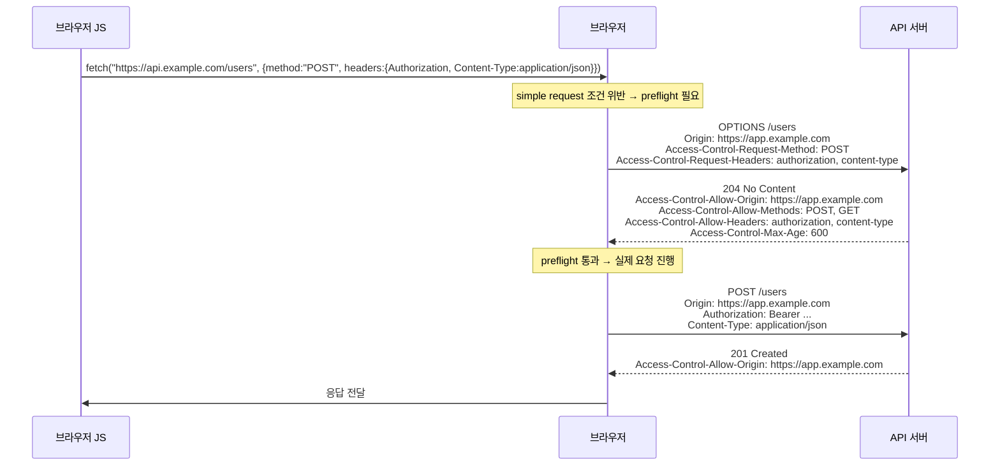
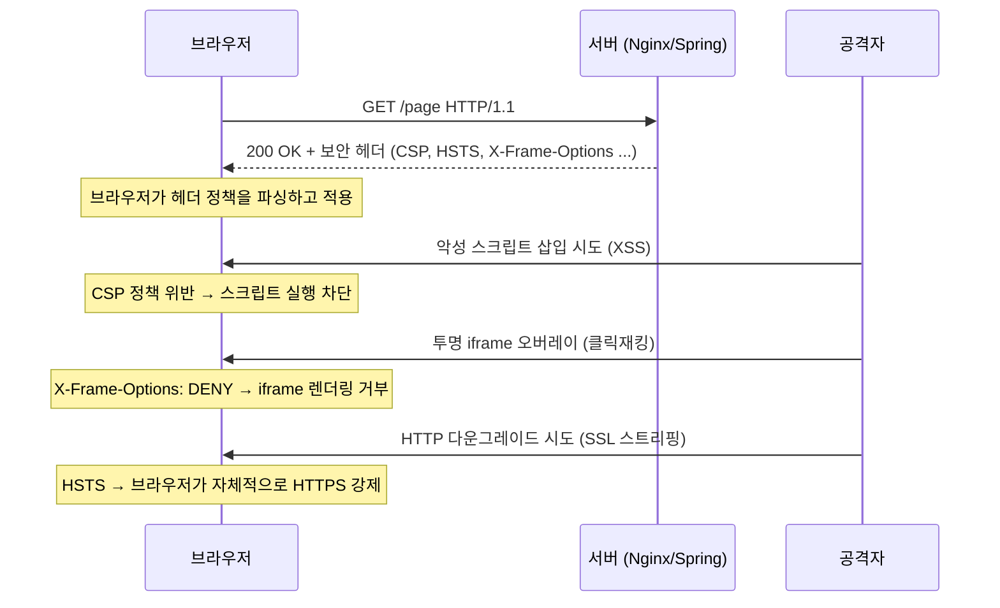
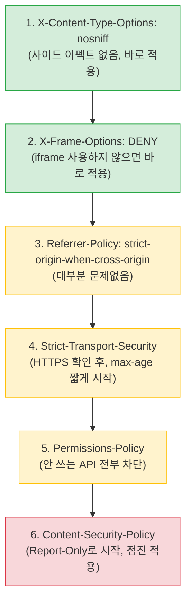
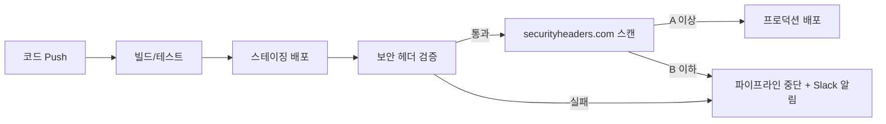

# CORS와 브라우저 보안 헤더

## 왜 이 두 가지를 같이 다루는가

CORS(Cross-Origin Resource Sharing)와 보안 헤더는 둘 다 브라우저가 응답을 어떻게 처리할지 제어하는 메커니즘이다. 서버가 응답에 헤더 몇 줄을 붙이면 브라우저가 그 정책에 따라 동작한다. CORS는 "다른 출처의 요청을 어디까지 허용할 것인가"를 다루고, 보안 헤더는 "브라우저에서 일어나는 공격(XSS, 클릭재킹 등)을 어떻게 차단할 것인가"를 다룬다. 운영 환경에서는 둘 다 같은 Nginx/Spring/Express 설정 파일에 들어가는 경우가 많아서 한 번에 정리하는 게 실무 흐름에 맞는다.

[securityheaders.com](https://securityheaders.com)에서 자기 도메인을 찍어보면 보안 헤더 상태를 등급으로 보여준다. CORS는 그냥 브라우저 DevTools 콘솔에서 빨간 에러로 바로 확인할 수 있다.

---

## 1부: CORS

### Same-Origin Policy가 먼저다

CORS를 이해하려면 먼저 SOP(Same-Origin Policy)가 뭔지 알아야 한다. 브라우저는 기본적으로 한 페이지에서 다른 출처의 리소스에 접근하는 걸 막는다. "출처(Origin)"는 `프로토콜 + 호스트 + 포트` 세 개가 모두 같아야 같은 출처로 본다.

| URL A | URL B | 동일 출처 여부 |
|-------|-------|----------------|
| `https://example.com/foo` | `https://example.com/bar` | 같음 |
| `https://example.com` | `http://example.com` | 다름 (프로토콜) |
| `https://example.com` | `https://api.example.com` | 다름 (호스트) |
| `https://example.com:443` | `https://example.com:8443` | 다름 (포트) |

CORS는 이 SOP를 "정해진 규칙 안에서" 우회할 수 있게 해주는 표준이다. 서버가 "이 출처에서 오는 요청은 허용한다"고 명시하면 브라우저가 응답을 자바스크립트에 넘겨준다. 명시가 없으면 응답이 와도 브라우저가 가로채서 자바스크립트가 못 읽게 막는다.

오해하기 쉬운 부분: **CORS는 서버 보호가 아니라 브라우저의 동작 제어다.** CORS를 안 걸어둔다고 서버가 안 털리는 게 아니다. 어차피 curl이나 Postman으로 직접 요청하면 다 통한다. CORS는 "브라우저에서 실행되는 자바스크립트가 다른 출처의 응답을 읽는 것"을 제한하는 메커니즘일 뿐이다. API 자체의 인증/인가는 별개로 해야 한다.

### Simple Request와 Preflight

CORS 요청은 두 종류로 나뉜다. 단순 요청(simple request)과 사전 요청이 필요한 요청(preflight request).

**Simple Request 조건** (다음을 모두 만족):
- HTTP 메서드가 `GET`, `HEAD`, `POST` 중 하나
- 수동으로 설정한 헤더가 `Accept`, `Accept-Language`, `Content-Language`, `Content-Type` 정도로 한정됨
- `Content-Type`이 `application/x-www-form-urlencoded`, `multipart/form-data`, `text/plain` 중 하나

위 조건을 하나라도 어기면 preflight가 발생한다. 실무에서 만나는 거의 모든 API 요청은 preflight 대상이다. `Content-Type: application/json`만 써도 바로 preflight가 붙고, `Authorization` 헤더를 넣어도 preflight가 붙는다.

### Preflight 동작 흐름



`OPTIONS` 메서드로 사전 요청을 보낸다. 이 요청은 실제 데이터를 주고받지 않고 "이런 요청을 보내도 되는지" 물어보는 용도다. 서버가 적절한 헤더로 응답하면 브라우저가 본 요청을 이어서 보낸다.

`Access-Control-Max-Age`는 preflight 결과를 캐시할 시간(초)이다. 600을 주면 10분 동안 같은 종류의 요청에 대해 preflight를 다시 보내지 않는다. 운영에서는 1시간(3600) 정도가 적당하다. 너무 길게 잡으면 정책을 바꿔도 클라이언트가 한참 동안 옛날 정책으로 동작한다. 크롬은 최대 2시간(7200), 파이어폭스는 24시간으로 자체 상한이 있다.

### Access-Control-Allow-Origin 매칭 규칙

이 헤더가 CORS의 핵심이다. 매칭 규칙은 단순한데 실수가 자주 나온다.

```
Access-Control-Allow-Origin: https://app.example.com
```

**매칭 방식: 정확한 문자열 비교.** 와일드카드가 안 통한다. `https://*.example.com`처럼 쓸 수 없다. 여러 출처를 허용하려면 서버에서 요청의 `Origin` 헤더를 보고 동적으로 응답해야 한다.

```javascript
// Express 예시 - 화이트리스트 기반 동적 Origin
const ALLOWED_ORIGINS = [
  'https://app.example.com',
  'https://admin.example.com',
  'https://staging.example.com',
];

app.use((req, res, next) => {
  const origin = req.headers.origin;
  if (origin && ALLOWED_ORIGINS.includes(origin)) {
    res.setHeader('Access-Control-Allow-Origin', origin);
    res.setHeader('Vary', 'Origin');
  }
  next();
});
```

`Vary: Origin`을 반드시 같이 보내야 한다. 그렇지 않으면 CDN이나 중간 캐시가 한 출처에 대한 응답을 다른 출처 요청에도 그대로 돌려주는 사고가 난다. 예를 들어 `https://attacker.com`이 먼저 요청해서 그 응답이 캐시되면, `https://app.example.com`에서 같은 URL을 요청해도 `Access-Control-Allow-Origin: https://attacker.com`이 돌아오는 식이다.

**`Access-Control-Allow-Origin: *`는 언제 쓰는가.** 인증 정보(쿠키, Authorization 헤더)가 필요 없는 완전 공개 API에만 쓴다. 공개 폰트, 공개 이미지 CDN, 인증 없는 통계 API 같은 경우다. `*`를 쓰면 다음 절에서 설명할 credentials 요청과 충돌한다.

### Credentials 모드별 차이

CORS 요청에서 쿠키나 `Authorization` 헤더 같은 인증 정보를 같이 보낼지 결정하는 게 credentials 모드다. fetch API에서는 `credentials` 옵션, XHR에서는 `withCredentials` 속성으로 제어한다.

| 값 | 동작 |
|----|------|
| `omit` | 인증 정보를 보내지 않음. 쿠키도 안 가고, 응답의 Set-Cookie도 무시 |
| `same-origin` | (fetch 기본값) 같은 출처 요청에만 인증 정보 포함, 크로스 오리진은 omit |
| `include` | 크로스 오리진 요청에도 쿠키/인증 정보 포함 |

```javascript
// 크로스 오리진 요청에 쿠키를 같이 보내고 싶을 때
fetch('https://api.example.com/me', {
  credentials: 'include',
});
```

**credentials를 쓰려면 서버 응답에 다음 조건을 모두 만족시켜야 한다:**

1. `Access-Control-Allow-Credentials: true` 응답 헤더 필요
2. `Access-Control-Allow-Origin`은 `*`가 아닌 명시적 출처여야 함
3. `Access-Control-Allow-Methods`, `Access-Control-Allow-Headers`도 `*` 사용 불가 (구체적으로 나열)
4. 클라이언트의 `credentials: 'include'` 설정

이 중 하나라도 빠지면 브라우저가 응답을 자바스크립트에 넘기지 않는다. 콘솔에 다음과 같은 에러가 뜬다:

```
Access to fetch at 'https://api.example.com/me' from origin 'https://app.example.com'
has been blocked by CORS policy: The value of the 'Access-Control-Allow-Origin'
header in the response must not be the wildcard '*' when the request's credentials
mode is 'include'.
```

서버 설정 예시:

```javascript
app.use((req, res, next) => {
  const origin = req.headers.origin;
  if (origin && ALLOWED_ORIGINS.includes(origin)) {
    res.setHeader('Access-Control-Allow-Origin', origin);
    res.setHeader('Access-Control-Allow-Credentials', 'true');
    res.setHeader('Vary', 'Origin');
  }
  next();
});
```

쿠키 자체에도 `SameSite` 속성이 영향을 준다. `SameSite=Strict`로 설정된 쿠키는 크로스 오리진 요청에서 절대 안 나간다. `SameSite=None; Secure` 조합이 되어야 크로스 오리진 요청에 쿠키가 실린다. 크롬이 2020년부터 `SameSite` 기본값을 `Lax`로 바꿨기 때문에 명시하지 않으면 크로스 오리진 POST에서도 쿠키가 빠진다.

### 자주 겪는 CORS 에러 트러블슈팅

**1. "No 'Access-Control-Allow-Origin' header is present"**

가장 흔하다. 서버가 CORS 헤더를 아예 안 내려주는 상황. 원인 후보:

- 서버에서 CORS 미들웨어를 안 깔았다.
- 미들웨어를 깔았는데 라우터보다 뒤에 등록했다 (Express에서 자주 발생).
- 에러 응답에서 헤더가 빠진다. 200 응답에는 붙는데 4xx/5xx 응답에서 빠지는 경우. 글로벌 에러 핸들러가 응답 헤더를 새로 쓰면서 CORS 헤더를 날린다.
- Nginx 앞단에서 헤더를 떨어뜨린다. `add_header`는 상속이 아니라 오버라이드라서 location 블록에 다른 `add_header`가 있으면 server 블록의 CORS 헤더가 사라진다.

**2. preflight가 200이 아닌 다른 코드(404, 405)로 응답**

`OPTIONS` 요청을 라우터가 처리하지 못하는 경우. Express에서 `app.post('/users', ...)`만 등록했는데 OPTIONS는 안 받는다. CORS 미들웨어를 라우터 등록 전에 두면 OPTIONS는 미들웨어 단에서 204로 응답하고 끝난다. Spring에서는 Spring Security 필터가 OPTIONS 요청을 인증 체크 전에 통과시키도록 설정해야 한다. 아니면 OPTIONS 요청에 401이 떨어진다.

**3. "Request header field X is not allowed by Access-Control-Allow-Headers"**

클라이언트가 보낸 커스텀 헤더(`X-Request-Id`, `X-Csrf-Token` 등)가 서버의 `Access-Control-Allow-Headers`에 없는 경우. 서버에 추가해야 한다. 와일드카드 `*`도 가능하지만 credentials 요청에서는 안 통한다.

```nginx
add_header Access-Control-Allow-Headers "Authorization, Content-Type, X-Request-Id, X-Csrf-Token" always;
```

**4. credentials 요청에 `Access-Control-Allow-Origin: *`가 붙음**

위에서 설명한 그 에러. 해결은 `Origin` 헤더를 화이트리스트와 비교해서 동적으로 돌려주는 것.

**5. 응답 본문에서 특정 헤더가 안 읽힘**

`Authorization`, `Content-Type` 같은 표준 헤더 외에 커스텀 응답 헤더(`X-Total-Count`, `X-Pagination` 등)는 자바스크립트에서 기본적으로 읽을 수 없다. `Access-Control-Expose-Headers`로 명시해야 한다.

```
Access-Control-Expose-Headers: X-Total-Count, X-Pagination
```

**6. 로컬 개발에서만 되고 배포에서 안 됨 (또는 그 반대)**

- 로컬은 `http://localhost:3000`이고 배포는 `https://app.example.com`인데 화이트리스트에 한쪽만 등록되어 있다.
- 로컬에서는 `Vite`나 `webpack-dev-server`의 `proxy` 설정으로 same-origin처럼 보이게 했는데, 배포에서는 진짜 다른 도메인으로 분리되어 있어서 처음으로 CORS가 발동된다.
- 배포 환경에서만 CDN/프록시가 끼어 있어서 헤더가 떨어진다.

**7. preflight는 통과하는데 본 요청에서 막힘**

preflight 응답에는 CORS 헤더가 잘 들어가는데 본 요청 응답에는 빠지는 경우. CORS 미들웨어가 OPTIONS는 처리하지만 다른 메서드 응답에는 헤더를 안 붙이는 설정 문제다. 미들웨어를 모든 라우트에 적용하도록 글로벌하게 등록한다.

### Express에서의 CORS 설정

`cors` 패키지를 쓰는 게 일반적이다.

```javascript
const cors = require('cors');

const ALLOWED_ORIGINS = [
  'https://app.example.com',
  'https://admin.example.com',
];

app.use(cors({
  origin: (origin, callback) => {
    // origin이 undefined인 경우는 same-origin 또는 Postman 같은 도구
    if (!origin || ALLOWED_ORIGINS.includes(origin)) {
      callback(null, true);
    } else {
      callback(new Error('Not allowed by CORS'));
    }
  },
  credentials: true,
  methods: ['GET', 'POST', 'PUT', 'DELETE', 'PATCH'],
  allowedHeaders: ['Content-Type', 'Authorization', 'X-Request-Id'],
  exposedHeaders: ['X-Total-Count'],
  maxAge: 3600,
}));
```

`origin`을 함수로 받으면 동적으로 결정할 수 있다. `null`이나 `undefined` origin을 어떻게 처리할지 정책을 정해둬야 한다. 모바일 앱에서 보내는 요청은 origin이 없을 수도 있다.

라우터 등록 순서가 중요하다. CORS 미들웨어는 모든 라우터보다 앞에 와야 한다.

```javascript
app.use(cors(corsOptions));    // 먼저
app.use(express.json());       // 그 다음
app.use('/api', apiRouter);    // 마지막
```

### Nginx에서의 CORS 설정

Nginx에서 직접 CORS를 처리하면 백엔드 코드를 수정하지 않고 정책을 바꿀 수 있다. 단, 매칭 로직을 if문으로 짜야 해서 가독성이 좋지 않다.

```nginx
map $http_origin $cors_origin {
    default "";
    "https://app.example.com" "$http_origin";
    "https://admin.example.com" "$http_origin";
    "~^https://.*\.example\.com$" "$http_origin";
}

server {
    listen 443 ssl http2;
    server_name api.example.com;

    location / {
        # preflight 처리
        if ($request_method = OPTIONS) {
            add_header Access-Control-Allow-Origin $cors_origin always;
            add_header Access-Control-Allow-Credentials true always;
            add_header Access-Control-Allow-Methods "GET, POST, PUT, DELETE, PATCH, OPTIONS" always;
            add_header Access-Control-Allow-Headers "Authorization, Content-Type, X-Request-Id" always;
            add_header Access-Control-Max-Age 3600 always;
            add_header Vary Origin always;
            add_header Content-Length 0;
            return 204;
        }

        # 본 요청에도 CORS 헤더 추가
        add_header Access-Control-Allow-Origin $cors_origin always;
        add_header Access-Control-Allow-Credentials true always;
        add_header Vary Origin always;

        proxy_pass http://backend;
    }
}
```

`map` 블록으로 화이트리스트를 정의하고, 매칭되는 origin만 그대로 돌려준다. 매칭되지 않으면 빈 문자열이 들어가서 헤더가 없는 것과 동일하게 동작한다(Nginx는 빈 값의 add_header를 출력하지 않는다).

`if` 안에서 `add_header`를 쓰는 건 Nginx에서 권장하지 않는 패턴이긴 한데, OPTIONS 처리는 예외적으로 이 방식이 가장 짧다. 운영에서 문제가 생기면 `nginx-extras`의 `more_set_headers`로 바꾸는 방법도 있다.

### Spring Boot에서의 CORS 설정

Spring Boot는 `@CrossOrigin` 어노테이션과 글로벌 설정 두 가지 방법이 있다. 운영에서는 글로벌 설정으로 통일하는 게 관리하기 쉽다.

```java
@Configuration
public class CorsConfig {

    @Bean
    public CorsConfigurationSource corsConfigurationSource() {
        CorsConfiguration config = new CorsConfiguration();
        config.setAllowedOrigins(List.of(
            "https://app.example.com",
            "https://admin.example.com"
        ));
        // 패턴 매칭이 필요하면 setAllowedOriginPatterns 사용
        // config.setAllowedOriginPatterns(List.of("https://*.example.com"));
        config.setAllowedMethods(List.of("GET", "POST", "PUT", "DELETE", "PATCH"));
        config.setAllowedHeaders(List.of("Authorization", "Content-Type", "X-Request-Id"));
        config.setExposedHeaders(List.of("X-Total-Count"));
        config.setAllowCredentials(true);
        config.setMaxAge(3600L);

        UrlBasedCorsConfigurationSource source = new UrlBasedCorsConfigurationSource();
        source.registerCorsConfiguration("/api/**", config);
        return source;
    }
}
```

Spring Security를 같이 쓰는 경우 CORS 필터가 Security 필터보다 먼저 실행되어야 한다. 그래야 OPTIONS 요청이 인증 체크에 걸리지 않는다.

```java
@Bean
public SecurityFilterChain filterChain(HttpSecurity http) throws Exception {
    http.cors(Customizer.withDefaults())  // CorsConfigurationSource Bean을 자동으로 사용
        .csrf(csrf -> csrf.disable())
        .authorizeHttpRequests(auth -> auth.anyRequest().authenticated());
    return http.build();
}
```

Spring 5.3 미만에서는 `setAllowedOrigins`에 `"*"`를 넣고 `setAllowCredentials(true)`를 같이 쓰면 동작했지만, 그 이후 버전에서는 명시적으로 거부된다. 패턴 매칭이 필요하면 `setAllowedOriginPatterns`를 써야 한다.

---

## 2부: 보안 헤더

서버가 응답할 때 붙이는 HTTP 헤더 몇 줄이 XSS, 클릭재킹, MIME 스니핑 같은 클라이언트 사이드 공격을 차단한다. 코드 한 줄 안 고치고 헤더만 추가해도 공격 표면이 줄어든다.



보안 헤더는 서버가 응답에 붙이고, 브라우저가 해석해서 적용하는 구조다. 서버 측에서 아무리 잘 설정해도 브라우저가 해당 헤더를 지원하지 않으면 의미가 없다. 다만 주요 보안 헤더는 모든 모던 브라우저에서 지원하므로 실질적으로 문제가 되는 경우는 드물다.

---

### Content-Security-Policy (CSP)

브라우저에게 "이 페이지에서 허용하는 리소스 출처는 여기뿐이다"라고 알려주는 헤더다. XSS 공격의 실질적인 방어선이 된다.

#### 기본 구조

```
Content-Security-Policy: default-src 'self'; script-src 'self' https://cdn.example.com; style-src 'self' 'unsafe-inline'; img-src *; connect-src 'self' https://api.example.com
```

각 디렉티브는 세미콜론(`;`)으로 구분한다. `default-src`는 명시하지 않은 리소스 타입의 폴백이다.

#### 자주 쓰는 디렉티브

| 디렉티브 | 역할 |
|-----------|------|
| `default-src` | 다른 디렉티브에서 명시하지 않은 모든 리소스의 기본 출처 |
| `script-src` | JavaScript 로드 허용 출처 |
| `style-src` | CSS 로드 허용 출처 |
| `img-src` | 이미지 로드 허용 출처 |
| `connect-src` | XHR, fetch, WebSocket 연결 허용 출처 |
| `frame-ancestors` | 이 페이지를 iframe으로 포함할 수 있는 출처 (X-Frame-Options 대체) |
| `form-action` | form 태그의 action 속성에 허용할 출처 |
| `base-uri` | `<base>` 태그에 허용할 출처 |

#### nonce 방식

인라인 스크립트를 허용해야 하는데 `'unsafe-inline'`은 쓰기 싫을 때 nonce를 쓴다. 서버가 매 요청마다 랜덤 nonce를 생성해서 헤더와 스크립트 태그 양쪽에 넣는다.

```
Content-Security-Policy: script-src 'nonce-abc123def456'
```

```html
<script nonce="abc123def456">
  // 이 스크립트는 실행된다
</script>
<script>
  // nonce가 없으므로 브라우저가 차단한다
</script>
```

Spring Boot에서 nonce를 요청마다 생성하는 예시:

```java
@Component
public class CspNonceFilter extends OncePerRequestFilter {

    @Override
    protected void doFilterInternal(HttpServletRequest request,
                                     HttpServletResponse response,
                                     FilterChain filterChain) throws ServletException, IOException {
        String nonce = Base64.getEncoder().encodeToString(
            SecureRandom.getInstanceStrong().generateSeed(16)
        );
        request.setAttribute("cspNonce", nonce);
        response.setHeader("Content-Security-Policy",
            "default-src 'self'; script-src 'self' 'nonce-" + nonce + "'; style-src 'self' 'nonce-" + nonce + "'");
        filterChain.doFilter(request, response);
    }
}
```

Thymeleaf 템플릿에서:

```html
<script th:attr="nonce=${cspNonce}">
  console.log("nonce가 자동으로 붙는다");
</script>
```

#### hash 방식

스크립트 내용이 고정되어 있으면 hash가 더 간단하다. 스크립트 내용의 SHA-256 해시를 CSP에 넣는다.

```bash
echo -n 'console.log("hello")' | openssl dgst -sha256 -binary | openssl base64
# 출력: sEaFBswe0TGjKJqu/dEKoE24HxLJdKUzqHLQfp0gWdc=
```

```
Content-Security-Policy: script-src 'sha256-sEaFBswe0TGjKJqu/dEKoE24HxLJdKUzqHLQfp0gWdc='
```

주의할 점: 스크립트 내용이 공백 하나라도 바뀌면 해시가 달라진다. 빌드 타임에 해시를 자동 생성하는 파이프라인을 만들어두지 않으면 운영에서 깨진다.

#### CSP 적용 시 실수하는 것들

**`'unsafe-inline'`과 nonce를 동시에 쓰는 경우** — CSP Level 2 이상 브라우저에서는 nonce가 있으면 `'unsafe-inline'`을 무시한다. 하지만 오래된 브라우저 호환을 위해 둘 다 넣는 경우가 있다. 의도한 거라면 상관없지만, nonce를 넣었으니 안전하다고 착각하면서 `'unsafe-eval'`까지 열어두는 실수를 하면 의미가 없어진다.

**report-uri로 위반 로그 수집** — 처음부터 `Content-Security-Policy`를 박으면 서비스가 깨질 수 있다. `Content-Security-Policy-Report-Only`로 먼저 배포해서 위반 로그를 모아야 한다.

```
Content-Security-Policy-Report-Only: default-src 'self'; report-uri /csp-report
```

```java
@PostMapping("/csp-report")
public ResponseEntity<Void> handleCspReport(@RequestBody String report) {
    log.warn("CSP violation: {}", report);
    return ResponseEntity.ok().build();
}
```

한 달 정도 Report-Only로 돌리면서 위반 로그를 확인한 뒤, 문제없는 것부터 점진적으로 적용하는 게 현실적이다.

---

### Strict-Transport-Security (HSTS)

브라우저에게 "이 도메인은 앞으로 HTTPS로만 접속해라"라고 알려준다. HTTP로 접속하면 브라우저가 서버에 요청을 보내기도 전에 자체적으로 HTTPS로 리다이렉트한다.

```
Strict-Transport-Security: max-age=31536000; includeSubDomains; preload
```

| 속성 | 의미 |
|------|------|
| `max-age` | 초 단위. 31536000은 1년. 이 기간 동안 HTTPS만 사용 |
| `includeSubDomains` | 서브도메인까지 적용 |
| `preload` | 브라우저의 HSTS preload list에 등록 요청 |

#### HSTS가 막는 공격

카페 와이파이 같은 공용 네트워크에서 공격자가 중간에 끼어들어 HTTP 응답을 조작하는 SSL 스트리핑 공격을 막는다. HSTS가 없으면 사용자가 `http://bank.com`으로 접속할 때 공격자가 HTTPS 리다이렉트를 가로채고 평문 HTTP로 통신하게 만들 수 있다.

#### 주의사항

- HTTPS 설정이 완전히 끝나기 전에 HSTS를 켜면 사이트 접속이 안 된다. 인증서 만료나 갱신 실패 시에도 접속 불가 상태가 `max-age` 동안 지속된다.
- 처음에는 `max-age=300` 같이 짧게 시작해서 문제가 없으면 점차 늘려야 한다.
- `preload`를 한번 등록하면 해제하는 데 몇 달이 걸린다. 확신이 없으면 넣지 않는다.

---

### X-Content-Type-Options

```
X-Content-Type-Options: nosniff
```

값은 `nosniff` 하나뿐이다. 브라우저가 MIME 타입을 추측(sniffing)하지 않도록 막는다.

#### 이걸 안 넣으면 생기는 일

공격자가 이미지 업로드 기능에 JavaScript가 포함된 파일을 `.jpg` 확장자로 올린다. 서버가 `Content-Type: image/jpeg`로 응답하지만, 브라우저가 내용을 보고 "이건 JavaScript인데?"라고 판단해서 스크립트로 실행해버린다. `nosniff`가 있으면 서버가 내려준 Content-Type을 그대로 따르므로 이런 공격이 차단된다.

설정 한 줄이니까 무조건 넣는다.

---

### X-Frame-Options

```
X-Frame-Options: DENY
```

이 페이지를 `<iframe>`, `<frame>`, `<object>` 안에 넣을 수 있는지 제어한다.

| 값 | 의미 |
|----|------|
| `DENY` | 어떤 사이트에서도 iframe으로 포함 불가 |
| `SAMEORIGIN` | 같은 출처에서만 iframe 허용 |

#### 클릭재킹 공격 차단

공격자가 자기 사이트에 투명 iframe으로 은행 사이트를 띄운다. 사용자는 공격자 사이트의 "경품 받기" 버튼을 누르지만, 실제로는 투명한 은행 사이트의 "송금" 버튼을 누르게 된다. `X-Frame-Options: DENY`가 있으면 브라우저가 iframe 렌더링 자체를 거부한다.

CSP의 `frame-ancestors` 디렉티브가 더 세밀한 제어가 가능하지만, 오래된 브라우저 호환을 위해 둘 다 넣는 경우가 많다.

---

### Referrer-Policy

```
Referrer-Policy: strict-origin-when-cross-origin
```

다른 사이트로 이동할 때 Referer 헤더에 어디까지 보낼지 정한다.

| 값 | 동작 |
|----|------|
| `no-referrer` | Referer 헤더를 아예 보내지 않는다 |
| `origin` | 출처(프로토콜 + 호스트 + 포트)만 보낸다. 경로는 제거 |
| `strict-origin-when-cross-origin` | 같은 출처에는 전체 URL, 다른 출처에는 origin만, HTTPS→HTTP는 안 보냄 |
| `same-origin` | 같은 출처에만 보냄 |

`strict-origin-when-cross-origin`이 대부분의 상황에서 적당하다. 내부 URL 경로에 토큰이나 세션 ID가 포함된 경우(이런 설계 자체가 문제지만 레거시에서 종종 보인다) Referer를 통해 외부로 유출될 수 있으므로 `no-referrer`나 `origin`을 쓴다.

---

### Permissions-Policy

```
Permissions-Policy: camera=(), microphone=(), geolocation=(), payment=()
```

브라우저 API(카메라, 마이크, 위치 정보 등)의 사용 권한을 제어한다. 빈 괄호 `()`는 모든 출처에서 차단한다는 의미다.

```
Permissions-Policy: camera=(self), microphone=(self "https://meeting.example.com"), geolocation=()
```

- `camera=(self)` — 같은 출처에서만 카메라 사용 가능
- `microphone=(self "https://meeting.example.com")` — 같은 출처와 지정된 도메인에서만 마이크 사용 가능
- `geolocation=()` — 위치 정보 완전 차단

써드파티 스크립트가 사용자 동의 없이 카메라나 마이크에 접근하는 걸 원천 차단할 수 있다. 서비스에서 쓰지 않는 브라우저 API는 전부 막아두는 게 맞다.

---

## 3부: 통합 설정 예제

### Nginx — CORS와 보안 헤더 함께

```nginx
map $http_origin $cors_origin {
    default "";
    "https://app.example.com" "$http_origin";
    "https://admin.example.com" "$http_origin";
}

server {
    listen 443 ssl http2;
    server_name api.example.com;

    # === 보안 헤더 (모든 응답에 적용) ===
    add_header Strict-Transport-Security "max-age=31536000; includeSubDomains" always;
    add_header Content-Security-Policy "default-src 'self'; script-src 'self'; style-src 'self'; img-src 'self' data:; connect-src 'self'; frame-ancestors 'none'; base-uri 'self'; form-action 'self'" always;
    add_header X-Content-Type-Options "nosniff" always;
    add_header X-Frame-Options "DENY" always;
    add_header Referrer-Policy "strict-origin-when-cross-origin" always;
    add_header Permissions-Policy "camera=(), microphone=(), geolocation=(), payment=()" always;

    location / {
        # === CORS preflight ===
        if ($request_method = OPTIONS) {
            add_header Access-Control-Allow-Origin $cors_origin always;
            add_header Access-Control-Allow-Credentials true always;
            add_header Access-Control-Allow-Methods "GET, POST, PUT, DELETE, PATCH, OPTIONS" always;
            add_header Access-Control-Allow-Headers "Authorization, Content-Type, X-Request-Id" always;
            add_header Access-Control-Max-Age 3600 always;
            add_header Vary Origin always;
            return 204;
        }

        # === 본 요청 CORS 헤더 ===
        add_header Access-Control-Allow-Origin $cors_origin always;
        add_header Access-Control-Allow-Credentials true always;
        add_header Vary Origin always;

        # 보안 헤더는 server 블록에서 상속받지 못하므로 다시 선언해야 한다
        # 이 location 블록에서 add_header를 하나라도 쓰면 server 블록의 add_header가 전부 사라진다
        add_header Strict-Transport-Security "max-age=31536000; includeSubDomains" always;
        add_header X-Content-Type-Options "nosniff" always;
        add_header X-Frame-Options "DENY" always;
        add_header Referrer-Policy "strict-origin-when-cross-origin" always;

        proxy_pass http://backend;
    }
}
```

**`always` 파라미터를 빠뜨리면 안 된다.** Nginx는 기본적으로 2xx, 3xx 응답에만 `add_header`를 적용한다. 4xx, 5xx 에러 페이지에서도 보안 헤더가 빠지지 않으려면 `always`가 필요하다.

**`add_header`는 상속이 아니라 오버라이드다.** 위 설정에서 location 블록에 보안 헤더를 다시 명시한 이유다. 모르고 location에 캐시 헤더만 추가했다가 보안 헤더와 CORS 헤더가 통째로 날아가는 사고가 자주 난다. 공통 헤더를 snippets 파일로 빼서 include하는 방식으로 해결한다.

```nginx
# /etc/nginx/snippets/security-headers.conf
add_header Strict-Transport-Security "max-age=31536000; includeSubDomains" always;
add_header Content-Security-Policy "default-src 'self'; ..." always;
add_header X-Content-Type-Options "nosniff" always;
add_header X-Frame-Options "DENY" always;
add_header Referrer-Policy "strict-origin-when-cross-origin" always;
add_header Permissions-Policy "camera=(), microphone=(), geolocation=()" always;
```

```nginx
server {
    include /etc/nginx/snippets/security-headers.conf;

    location /api/ {
        include /etc/nginx/snippets/security-headers.conf;
        # CORS 헤더 추가
        proxy_pass http://backend;
    }
}
```

### Express — CORS와 보안 헤더 함께

`helmet` 패키지가 보안 헤더를 한 번에 처리해준다. CORS는 별도 미들웨어.

```javascript
const express = require('express');
const helmet = require('helmet');
const cors = require('cors');

const app = express();

const ALLOWED_ORIGINS = [
  'https://app.example.com',
  'https://admin.example.com',
];

// 보안 헤더 (helmet이 기본값으로 거의 모든 헤더를 설정)
app.use(helmet({
  contentSecurityPolicy: {
    directives: {
      defaultSrc: ["'self'"],
      scriptSrc: ["'self'"],
      styleSrc: ["'self'"],
      imgSrc: ["'self'", 'data:'],
      connectSrc: ["'self'"],
      frameAncestors: ["'none'"],
      baseUri: ["'self'"],
      formAction: ["'self'"],
    },
  },
  hsts: {
    maxAge: 31536000,
    includeSubDomains: true,
  },
  referrerPolicy: { policy: 'strict-origin-when-cross-origin' },
}));

// CORS
app.use(cors({
  origin: (origin, callback) => {
    if (!origin || ALLOWED_ORIGINS.includes(origin)) {
      callback(null, true);
    } else {
      callback(new Error('Not allowed by CORS'));
    }
  },
  credentials: true,
  methods: ['GET', 'POST', 'PUT', 'DELETE', 'PATCH'],
  allowedHeaders: ['Content-Type', 'Authorization', 'X-Request-Id'],
  exposedHeaders: ['X-Total-Count'],
  maxAge: 3600,
}));

app.use(express.json());
app.use('/api', apiRouter);
```

helmet은 기본으로 `Permissions-Policy`는 안 넣는다. 필요하면 미들웨어로 추가:

```javascript
app.use((req, res, next) => {
  res.setHeader('Permissions-Policy', 'camera=(), microphone=(), geolocation=()');
  next();
});
```

### Spring Boot — CORS와 보안 헤더 함께

```java
@Configuration
@EnableWebSecurity
public class SecurityConfig {

    @Bean
    public SecurityFilterChain filterChain(HttpSecurity http) throws Exception {
        http
            .cors(Customizer.withDefaults())
            .csrf(csrf -> csrf.disable())
            .headers(headers -> headers
                .httpStrictTransportSecurity(hsts -> hsts
                    .maxAgeInSeconds(31536000)
                    .includeSubDomains(true)
                )
                .contentSecurityPolicy(csp -> csp
                    .policyDirectives("default-src 'self'; script-src 'self'; style-src 'self'; img-src 'self' data:; connect-src 'self'; frame-ancestors 'none'; base-uri 'self'; form-action 'self'")
                )
                .contentTypeOptions(Customizer.withDefaults())
                .frameOptions(frame -> frame.deny())
                .referrerPolicy(referrer -> referrer
                    .policy(ReferrerPolicyHeaderWriter.ReferrerPolicy.STRICT_ORIGIN_WHEN_CROSS_ORIGIN)
                )
                .permissionsPolicy(permissions -> permissions
                    .policy("camera=(), microphone=(), geolocation=(), payment=()")
                )
            )
            .authorizeHttpRequests(auth -> auth.anyRequest().authenticated());

        return http.build();
    }

    @Bean
    public CorsConfigurationSource corsConfigurationSource() {
        CorsConfiguration config = new CorsConfiguration();
        config.setAllowedOrigins(List.of(
            "https://app.example.com",
            "https://admin.example.com"
        ));
        config.setAllowedMethods(List.of("GET", "POST", "PUT", "DELETE", "PATCH"));
        config.setAllowedHeaders(List.of("Authorization", "Content-Type", "X-Request-Id"));
        config.setExposedHeaders(List.of("X-Total-Count"));
        config.setAllowCredentials(true);
        config.setMaxAge(3600L);

        UrlBasedCorsConfigurationSource source = new UrlBasedCorsConfigurationSource();
        source.registerCorsConfiguration("/api/**", config);
        return source;
    }
}
```

Spring Security 없이 필터로 직접 보안 헤더를 다는 경우:

```java
@Component
@Order(Ordered.HIGHEST_PRECEDENCE)
public class SecurityHeaderFilter extends OncePerRequestFilter {

    @Override
    protected void doFilterInternal(HttpServletRequest request,
                                     HttpServletResponse response,
                                     FilterChain filterChain) throws ServletException, IOException {
        response.setHeader("X-Content-Type-Options", "nosniff");
        response.setHeader("X-Frame-Options", "DENY");
        response.setHeader("Referrer-Policy", "strict-origin-when-cross-origin");
        response.setHeader("Permissions-Policy", "camera=(), microphone=(), geolocation=(), payment=()");
        response.setHeader("Content-Security-Policy",
            "default-src 'self'; script-src 'self'; style-src 'self'; img-src 'self' data:; connect-src 'self'; frame-ancestors 'none'");

        if (request.isSecure()) {
            response.setHeader("Strict-Transport-Security", "max-age=31536000; includeSubDomains");
        }

        filterChain.doFilter(request, response);
    }
}
```

HSTS는 HTTPS 요청일 때만 설정하는 게 맞다. HTTP 응답에 HSTS를 넣으면 공격자가 조작할 수 있으므로 브라우저가 무시한다.

---

## 4부: securityheaders.com 점수 개선

[securityheaders.com](https://securityheaders.com)에 도메인을 입력하면 A+부터 F까지 등급을 매겨준다. 점수를 올리는 순서:

### F → D: 기본 헤더 추가

`X-Content-Type-Options`, `X-Frame-Options` 두 개만 넣어도 F에서 벗어난다. 설정이 단순하고 사이드 이펙트가 거의 없으니 바로 적용해도 된다.

### D → B: HSTS, Referrer-Policy 추가

HSTS는 HTTPS 설정이 확실한 경우에만 넣는다. `max-age`를 짧게 시작해서 늘려간다. Referrer-Policy는 `strict-origin-when-cross-origin`으로 넣으면 대부분 문제없다.

### B → A: CSP 추가

CSP가 가장 까다롭다. 인라인 스크립트, 외부 CDN, 분석 도구(Google Analytics 등) 때문에 한 번에 적용하기 어렵다.

1. `Content-Security-Policy-Report-Only`로 배포
2. 위반 로그를 수집해서 허용이 필요한 출처 목록을 정리
3. 점진적으로 디렉티브 추가
4. 안정화되면 `Content-Security-Policy`로 전환

### A → A+: Permissions-Policy 추가

`Permissions-Policy`를 넣으면 A+가 나온다. 서비스에서 쓰지 않는 브라우저 API를 전부 `()`로 막으면 된다.

### 실무에서 자주 막히는 부분

**Google Analytics, GTM** — `script-src`에 `https://www.googletagmanager.com`을 허용해야 하고, GTM이 동적으로 스크립트를 삽입하기 때문에 `'unsafe-inline'`을 요구하는 경우가 있다. nonce 방식으로 우회할 수 있지만, GTM 컨테이너 내부의 커스텀 HTML 태그까지 nonce를 적용하려면 GTM의 Custom Template 기능을 써야 한다.

**CDN에서 받는 라이브러리** — `script-src`에 CDN 도메인을 추가해야 한다. 특정 경로까지 제한하고 싶으면 CSP Level 3의 `strict-dynamic`과 nonce를 조합한다.

**웹소켓** — `connect-src`에 `wss://` 스킴을 포함한 주소를 넣어야 한다. `ws://`는 평문이므로 프로덕션에서 쓰면 안 된다.

**서비스 워커** — `worker-src`를 별도로 설정해야 한다. `default-src`나 `script-src`를 폴백으로 사용하지만, 명시적으로 `worker-src 'self'`를 넣는 게 명확하다.

---

## 5부: 헤더별 공격 차단 요약

| 헤더 | 차단하는 공격 |
|------|---------------|
| Content-Security-Policy | XSS (인라인 스크립트 삽입, 외부 스크립트 로드) |
| Strict-Transport-Security | SSL 스트리핑, 중간자 공격(MITM)에서의 다운그레이드 |
| X-Content-Type-Options | MIME 스니핑을 이용한 스크립트 실행 |
| X-Frame-Options | 클릭재킹 (투명 iframe 오버레이) |
| Referrer-Policy | URL 경로에 포함된 민감 정보 유출 |
| Permissions-Policy | 써드파티 스크립트의 브라우저 API 무단 접근 |
| Access-Control-Allow-Origin | 다른 출처에서의 자바스크립트 응답 읽기 (CORS) |

### 보안 헤더 적용 우선순위

어떤 헤더부터 넣어야 할지 판단이 안 되면 아래 순서를 따른다. 위에서 아래로 갈수록 설정 난이도가 올라간다.



1~2번은 리스크가 거의 없으니 당장 넣는다. 3~5번은 서비스 상황에 따라 확인하고 넣는다. 6번(CSP)은 반드시 Report-Only 단계를 거쳐야 한다.

---

## 6부: 보안 헤더 자동 검증 파이프라인

보안 헤더와 CORS 설정은 사람이 수동으로 확인하면 반드시 빠지는 날이 온다. Nginx 설정을 건드리거나 location 블록을 추가하면서 헤더가 통째로 날아가는 건 흔한 사고다. 파이프라인에 자동 검증 단계를 넣어야 한다.

### 파이프라인 구성 흐름



보안 헤더 검증은 스테이징 배포 직후, 프로덕션 배포 직전에 들어간다. 프로덕션에서 확인하는 게 아니라 스테이징에서 걸러야 한다.

### 1단계: 헤더 존재 여부 검증 스크립트

CI/CD 파이프라인에서 배포 후 보안 헤더를 자동으로 체크하는 스크립트:

```bash
#!/bin/bash
# check-security-headers.sh
set -euo pipefail

URL="${1:?Usage: $0 <url>}"

REQUIRED_HEADERS=(
    "strict-transport-security"
    "content-security-policy"
    "x-content-type-options"
    "x-frame-options"
    "referrer-policy"
    "permissions-policy"
)

MISSING=0
HEADERS=$(curl -sI --max-time 10 "$URL")

for header in "${REQUIRED_HEADERS[@]}"; do
    if echo "$HEADERS" | grep -qi "$header"; then
        VALUE=$(echo "$HEADERS" | grep -i "$header" | cut -d: -f2- | xargs)
        echo "OK: $header: $VALUE"
    else
        echo "MISSING: $header"
        MISSING=$((MISSING + 1))
    fi
done

echo "---"
if [ $MISSING -gt 0 ]; then
    echo "FAIL: $MISSING header(s) missing"
    exit 1
fi

echo "PASS: All security headers present"
```

배포 파이프라인에 이 스크립트를 넣어두면 누군가 Nginx 설정을 수정하다가 보안 헤더를 날려먹어도 바로 잡힌다.

### 2단계: CORS preflight 검증 스크립트

CORS 설정도 자동으로 검증해야 한다. preflight 응답을 직접 시뮬레이션해서 기대한 헤더가 나오는지 확인한다.

```bash
#!/bin/bash
# check-cors-preflight.sh
set -euo pipefail

URL="${1:?Usage: $0 <url> <expected-origin>}"
ORIGIN="${2:?Usage: $0 <url> <expected-origin>}"

RESPONSE=$(curl -sI -X OPTIONS \
    -H "Origin: $ORIGIN" \
    -H "Access-Control-Request-Method: POST" \
    -H "Access-Control-Request-Headers: Authorization, Content-Type" \
    --max-time 10 "$URL")

ALLOW_ORIGIN=$(echo "$RESPONSE" | grep -i "access-control-allow-origin" | cut -d: -f2- | xargs)
ALLOW_CREDS=$(echo "$RESPONSE" | grep -i "access-control-allow-credentials" | cut -d: -f2- | xargs)
ALLOW_METHODS=$(echo "$RESPONSE" | grep -i "access-control-allow-methods" | cut -d: -f2- | xargs)

FAIL=0

if [ "$ALLOW_ORIGIN" != "$ORIGIN" ]; then
    echo "FAIL: Allow-Origin '$ALLOW_ORIGIN' != expected '$ORIGIN'"
    FAIL=1
fi

if [ "$ALLOW_CREDS" != "true" ]; then
    echo "FAIL: Allow-Credentials is '$ALLOW_CREDS', expected 'true'"
    FAIL=1
fi

if ! echo "$ALLOW_METHODS" | grep -q "POST"; then
    echo "FAIL: POST not in Allow-Methods: '$ALLOW_METHODS'"
    FAIL=1
fi

# 화이트리스트에 없는 origin은 거부되어야 한다
EVIL_RESPONSE=$(curl -sI -X OPTIONS \
    -H "Origin: https://evil.example.com" \
    -H "Access-Control-Request-Method: POST" \
    --max-time 10 "$URL")

EVIL_ALLOW=$(echo "$EVIL_RESPONSE" | grep -i "access-control-allow-origin" | cut -d: -f2- | xargs)
if [ -n "$EVIL_ALLOW" ]; then
    echo "FAIL: Untrusted origin was allowed: '$EVIL_ALLOW'"
    FAIL=1
fi

if [ $FAIL -ne 0 ]; then
    echo "CORS validation failed"
    exit 1
fi

echo "PASS: CORS preflight looks correct"
```

### 3단계: 헤더 값 검증

헤더가 있는 것만 확인하면 부족하다. `Content-Security-Policy: default-src *` 같이 의미 없는 값이 들어갈 수 있다. 헤더 값까지 검증하는 스크립트:

```bash
#!/bin/bash
# validate-header-values.sh
set -euo pipefail

URL="${1:?Usage: $0 <url>}"
HEADERS=$(curl -sI --max-time 10 "$URL")
FAIL=0

# CSP에 unsafe-inline이 단독으로 쓰이면 경고
CSP=$(echo "$HEADERS" | grep -i "content-security-policy" | cut -d: -f2-)
if echo "$CSP" | grep -q "unsafe-inline" && ! echo "$CSP" | grep -q "nonce-"; then
    echo "WARN: CSP has 'unsafe-inline' without nonce"
    FAIL=$((FAIL + 1))
fi

# CSP에 unsafe-eval이 있으면 경고
if echo "$CSP" | grep -q "unsafe-eval"; then
    echo "WARN: CSP has 'unsafe-eval' (XSS risk)"
    FAIL=$((FAIL + 1))
fi

# CSP default-src가 *이면 경고
if echo "$CSP" | grep -qE 'default-src[[:space:]]+\*'; then
    echo "WARN: CSP default-src is '*' (defeats CSP purpose)"
    FAIL=$((FAIL + 1))
fi

# HSTS max-age가 너무 짧으면 경고 (86400 = 1일 미만)
HSTS_MAX=$(echo "$HEADERS" | grep -i "strict-transport-security" | grep -oE 'max-age=[0-9]+' | cut -d= -f2)
if [ -n "$HSTS_MAX" ] && [ "$HSTS_MAX" -lt 86400 ]; then
    echo "WARN: HSTS max-age=$HSTS_MAX (1일 미만 — 프로덕션에서는 최소 1년 권장)"
    FAIL=$((FAIL + 1))
fi

if [ $FAIL -gt 0 ]; then
    echo "---"
    echo "WARN: $FAIL issue(s) found in header values"
    exit 1
fi

echo "PASS: Header values look reasonable"
```

### 4단계: securityheaders.com 스캔 자동화

securityheaders.com은 응답 헤더로 등급을 알려준다. 배포 후 자동으로 스캔 결과를 확인하고, 등급이 기준 이하면 파이프라인을 멈추는 방식으로 사용한다.

```bash
#!/bin/bash
# scan-securityheaders.sh
set -euo pipefail

URL="${1:?Usage: $0 <url>}"
MIN_GRADE="${2:-A}"

SCAN_URL="https://securityheaders.com/?q=${URL}&followRedirects=on"

RESPONSE=$(curl -sI "$SCAN_URL" --max-time 30)
GRADE=$(echo "$RESPONSE" | grep -i "x-grade" | cut -d: -f2 | xargs)

if [ -z "$GRADE" ]; then
    echo "ERROR: securityheaders.com에서 등급을 가져올 수 없음"
    exit 1
fi

echo "securityheaders.com grade: $GRADE (minimum: $MIN_GRADE)"

grade_to_num() {
    case "$1" in
        "A+") echo 7 ;; "A") echo 6 ;; "B") echo 5 ;;
        "C") echo 4 ;; "D") echo 3 ;; "E") echo 2 ;; "F") echo 1 ;;
        *) echo 0 ;;
    esac
}

ACTUAL=$(grade_to_num "$GRADE")
REQUIRED=$(grade_to_num "$MIN_GRADE")

if [ "$ACTUAL" -lt "$REQUIRED" ]; then
    echo "FAIL: Grade $GRADE is below minimum $MIN_GRADE"
    echo "Check details: $SCAN_URL"
    exit 1
fi

echo "PASS: Grade $GRADE meets minimum $MIN_GRADE"
```

### GitHub Actions 통합

위 스크립트들을 GitHub Actions에 통합한 구성:

```yaml
# .github/workflows/security-headers.yml
name: Security Header Check

on:
  workflow_call:
    inputs:
      target_url:
        required: true
        type: string
      cors_origin:
        required: true
        type: string
      min_grade:
        required: false
        type: string
        default: 'A'

jobs:
  check-headers:
    runs-on: ubuntu-latest
    steps:
      - uses: actions/checkout@v4

      - name: Wait for deployment
        run: |
          for i in $(seq 1 30); do
            STATUS=$(curl -sI -o /dev/null -w "%{http_code}" "${{ inputs.target_url }}")
            if [ "$STATUS" = "200" ]; then
              echo "Service is up"
              break
            fi
            echo "Waiting for deployment... ($i/30)"
            sleep 10
          done

      - name: Check security headers exist
        run: bash scripts/check-security-headers.sh "${{ inputs.target_url }}"

      - name: Validate header values
        run: bash scripts/validate-header-values.sh "${{ inputs.target_url }}"

      - name: Validate CORS preflight
        run: bash scripts/check-cors-preflight.sh "${{ inputs.target_url }}" "${{ inputs.cors_origin }}"

      - name: Scan with securityheaders.com
        run: bash scripts/scan-securityheaders.sh "${{ inputs.target_url }}" "${{ inputs.min_grade }}"

      - name: Notify on failure
        if: failure()
        run: |
          curl -X POST "${{ secrets.SLACK_WEBHOOK }}" \
            -H "Content-Type: application/json" \
            -d "{\"text\":\"Security header check failed for ${{ inputs.target_url }}\"}"
```

### 정기 모니터링

배포 시점 외에도 주기적으로 헤더 상태를 확인해야 한다. CDN 설정 변경이나 인프라 작업으로 보안 헤더가 빠지는 경우가 있다.

```yaml
# .github/workflows/scheduled-header-check.yml
name: Scheduled Security Header Check

on:
  schedule:
    - cron: '0 9 * * 1'  # 매주 월요일 오전 9시

jobs:
  check:
    runs-on: ubuntu-latest
    strategy:
      matrix:
        url:
          - https://www.example.com
          - https://api.example.com
          - https://admin.example.com
    steps:
      - uses: actions/checkout@v4
      - name: Check headers
        run: bash scripts/check-security-headers.sh "${{ matrix.url }}"
      - name: Scan grade
        run: bash scripts/scan-securityheaders.sh "${{ matrix.url }}" A
      - name: Alert on failure
        if: failure()
        run: |
          curl -X POST "${{ secrets.SLACK_WEBHOOK }}" \
            -H "Content-Type: application/json" \
            -d "{\"text\":\"Weekly security header check failed: ${{ matrix.url }}\"}"
```

배포 파이프라인의 검증과 주간 정기 스캔을 조합하면, 보안 헤더와 CORS 설정이 빠지는 상황을 두 단계로 잡을 수 있다.
