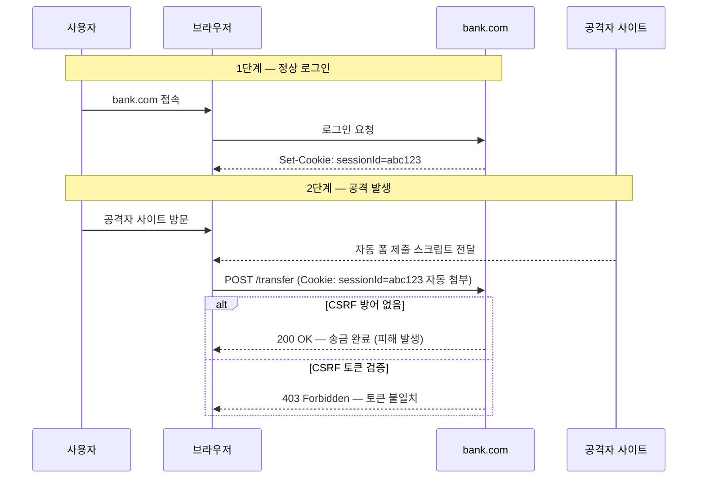
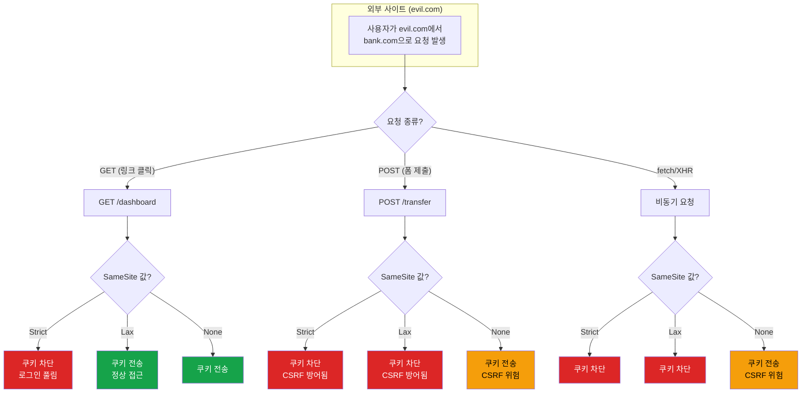
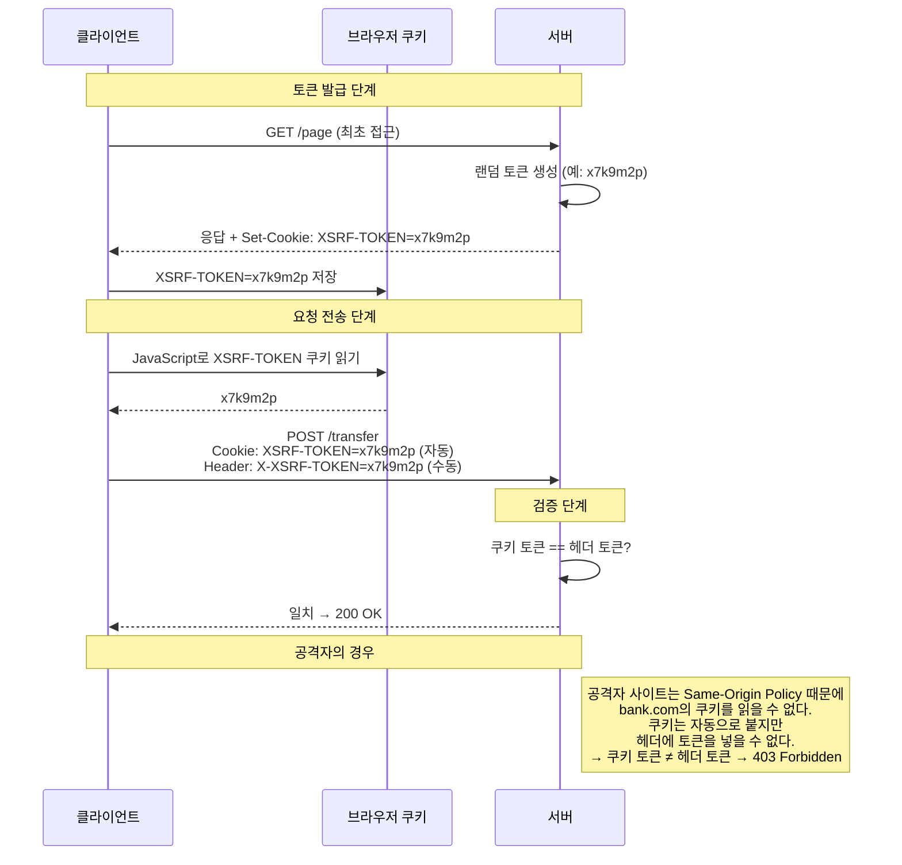

# CSRF (Cross-Site Request Forgery)

사용자가 로그인된 상태에서, 공격자가 만든 페이지를 열면 사용자 모르게 요청이 날아가는 공격이다. 브라우저가 쿠키를 자동으로 붙여 보내기 때문에 발생한다. XSS가 "사용자 브라우저에서 스크립트를 실행"하는 거라면, CSRF는 "사용자 권한으로 요청을 위조"하는 거다.

```
[사용자] → bank.com 로그인 → 세션 쿠키 저장됨
                ↓
[사용자] → 공격자 사이트 방문
                ↓
[공격자 사이트] → bank.com/transfer (POST) 요청을 사용자 브라우저가 보냄
                ↓
[bank.com] → 세션 쿠키가 같이 왔으니 정상 사용자로 인식 → 요청 처리
```

핵심은 브라우저의 쿠키 자동 첨부 동작이다. bank.com에 보내는 요청이면, 어느 사이트에서 보냈든 bank.com의 쿠키가 붙는다. 이 동작 자체가 CSRF의 원인이다.

### CSRF 공격 흐름과 방어 메커니즘



위 다이어그램에서 핵심은 브라우저가 요청 출처와 관계없이 bank.com의 쿠키를 자동으로 첨부한다는 점이다. CSRF 토큰이 있으면 서버가 "이 요청이 진짜 우리 사이트에서 온 건지" 검증할 수 있다.

---

## SameSite 쿠키 속성

브라우저 레벨에서 CSRF를 막는 가장 직접적인 방법이다. 쿠키에 `SameSite` 속성을 설정하면 크로스 사이트 요청에 쿠키를 붙일지 말지를 제어할 수 있다.

### Strict

다른 사이트에서 오는 모든 요청에 쿠키를 붙이지 않는다.

```
Set-Cookie: sessionId=abc123; SameSite=Strict; Secure; HttpOnly
```

이메일에 있는 `https://bank.com/dashboard` 링크를 클릭해도 세션 쿠키가 안 붙는다. 로그인이 풀린 것처럼 보인다. 사용자가 매번 다시 로그인해야 하니 UX가 나빠진다.

Strict가 적합한 경우:

- 은행, 증권 같은 금융 서비스
- 관리자 패널
- 외부 링크에서 바로 접근할 일이 거의 없는 서비스

### Lax

GET 요청처럼 "최상위 레벨 내비게이션"에는 쿠키를 붙이고, POST/PUT/DELETE 같은 상태 변경 요청에는 쿠키를 붙이지 않는다.

```
Set-Cookie: sessionId=abc123; SameSite=Lax; Secure; HttpOnly
```

이메일 링크를 클릭하면(GET) 쿠키가 붙어서 로그인 상태가 유지된다. 공격자 사이트에서 폼 제출(POST)을 시도하면 쿠키가 안 붙어서 CSRF가 차단된다.

대부분의 웹 서비스에 적합하다. Chrome 80부터 SameSite를 명시하지 않으면 Lax가 기본값이다.

주의할 점이 있다. GET 요청으로 상태를 변경하는 API가 있으면 Lax로도 CSRF에 취약하다. `GET /api/delete-account?confirm=true` 같은 설계를 하면 안 되는 이유가 여기에 있다.

### None

크로스 사이트 요청에도 쿠키를 붙인다. 반드시 `Secure` 플래그와 함께 써야 한다(HTTPS 필수).

```
Set-Cookie: sessionId=abc123; SameSite=None; Secure; HttpOnly
```

None을 쓰는 경우:

- iframe 안에서 동작하는 서드파티 위젯
- OAuth 콜백 처리
- 크로스 도메인 API 호출이 필요한 서비스

None을 설정하면 CSRF 방어를 SameSite에 기대할 수 없다. CSRF 토큰이나 다른 방어 수단이 반드시 필요하다.

### SameSite 속성별 동작 비교

| 시나리오 | Strict | Lax | None |
|----------|--------|-----|------|
| 외부 링크 클릭 (GET) | 쿠키 안 붙음 | 쿠키 붙음 | 쿠키 붙음 |
| 외부 사이트에서 폼 POST | 쿠키 안 붙음 | 쿠키 안 붙음 | 쿠키 붙음 |
| 외부 사이트에서 fetch/XHR | 쿠키 안 붙음 | 쿠키 안 붙음 | 쿠키 붙음 |
| iframe 내부 요청 | 쿠키 안 붙음 | 쿠키 안 붙음 | 쿠키 붙음 |
| 이미지/스크립트 로드 | 쿠키 안 붙음 | 쿠키 안 붙음 | 쿠키 붙음 |

아래 다이어그램은 같은 요청에 대해 SameSite 속성값에 따라 쿠키가 어떻게 동작하는지 보여준다.



Strict는 외부에서 오는 모든 요청에 쿠키를 차단하고, Lax는 GET 내비게이션만 허용한다. None은 모든 크로스 사이트 요청에 쿠키가 붙으므로 별도 CSRF 방어가 필수다.

---

## CSRF 토큰

SameSite만으로 CSRF 방어가 끝나지 않는다. 구형 브라우저 대응, SameSite=None이 필요한 서비스, GET으로 상태 변경하는 레거시 코드 등 예외가 있다.

CSRF 토큰은 서버가 폼을 렌더링할 때 랜덤 토큰을 생성해서 끼워넣고, 요청이 돌아올 때 토큰이 일치하는지 검증하는 방식이다. 공격자는 이 토큰 값을 알 수 없으므로 요청을 위조할 수 없다.

### Synchronizer Token 패턴

가장 전통적인 방식이다. 서버 세션에 토큰을 저장하고, 폼의 hidden 필드에 같은 토큰을 넣는다.

```html
<!-- 서버가 렌더링한 폼 -->
<form action="/transfer" method="POST">
    <input type="hidden" name="_csrf" value="a8f2e3d1-b4c5-6789-0abc-def123456789">
    <input type="text" name="to" />
    <input type="number" name="amount" />
    <button type="submit">송금</button>
</form>
```

서버는 요청이 오면 세션에 저장된 토큰과 폼에서 온 토큰을 비교한다. 불일치하면 403을 반환한다.

### Double Submit Cookie 패턴

세션을 사용하지 않는 stateless 아키텍처에서 쓰는 방식이다. 서버가 랜덤 토큰을 쿠키와 요청 헤더(또는 폼 파라미터) 두 곳에 넣는다.

```
1. 서버 → 클라이언트: Set-Cookie: XSRF-TOKEN=random-token-value
2. 클라이언트 → 서버: Cookie: XSRF-TOKEN=random-token-value
                       X-XSRF-TOKEN: random-token-value  (헤더에 동일 값)
```

서버는 쿠키의 토큰과 헤더의 토큰이 일치하는지 비교한다. 공격자 사이트에서는 쿠키를 읽을 수 없으므로(Same-Origin Policy) 헤더에 토큰을 넣을 수 없다.

아래 시퀀스 다이어그램은 Double Submit Cookie 패턴의 전체 흐름이다.



이 패턴의 약점은 서브도메인이다. `evil.sub.example.com`에서 `example.com`의 쿠키를 덮어쓸 수 있다. 서브도메인을 신뢰할 수 없는 환경에서는 Signed Double Submit(토큰에 서버 시크릿으로 HMAC 서명을 추가)을 써야 한다.

---

## Spring Security의 CSRF 처리

### CsrfTokenRepository

Spring Security는 CSRF 토큰의 생성, 저장, 검증을 `CsrfTokenRepository` 인터페이스로 추상화하고 있다.

**HttpSessionCsrfTokenRepository** — 기본값이다. 서버 세션에 토큰을 저장한다. SSR(서버 사이드 렌더링) 기반 애플리케이션에 적합하다.

```java
@Bean
public SecurityFilterChain filterChain(HttpSecurity http) throws Exception {
    http.csrf(csrf -> csrf
        .csrfTokenRepository(new HttpSessionCsrfTokenRepository())
    );
    return http.build();
}
```

Thymeleaf에서는 자동으로 `_csrf` 파라미터가 폼에 추가된다:

```html
<!-- Thymeleaf 폼 — Spring Security가 자동으로 CSRF 토큰 삽입 -->
<form th:action="@{/transfer}" method="post">
    <!-- _csrf hidden input이 자동 생성됨 -->
    <input type="text" name="to" />
    <button type="submit">송금</button>
</form>
```

**CookieCsrfTokenRepository** — SPA에서 사용한다. 토큰을 쿠키에 저장하고, 클라이언트가 요청 시 헤더로 돌려보내는 Double Submit Cookie 패턴이다.

```java
@Bean
public SecurityFilterChain filterChain(HttpSecurity http) throws Exception {
    http.csrf(csrf -> csrf
        .csrfTokenRepository(CookieCsrfTokenRepository.withHttpOnlyFalse())
        // withHttpOnlyFalse(): JavaScript에서 쿠키를 읽어야 하므로 HttpOnly를 끈다
    );
    return http.build();
}
```

`withHttpOnlyFalse()`가 붙는 이유를 모르면 삽질한다. JavaScript에서 `XSRF-TOKEN` 쿠키를 읽어서 `X-XSRF-TOKEN` 헤더에 넣어야 하는데, HttpOnly가 걸려 있으면 JavaScript에서 쿠키를 읽을 수 없다.

### Spring Security 6의 변화

Spring Security 6부터 CSRF 토큰이 지연 로딩(lazy)된다. 토큰이 실제로 필요한 시점에 생성된다. 이전 버전에서는 모든 요청에 토큰을 생성했다.

```java
// Spring Security 6에서 SPA와 함께 사용할 때
@Bean
public SecurityFilterChain filterChain(HttpSecurity http) throws Exception {
    http.csrf(csrf -> csrf
        .csrfTokenRepository(CookieCsrfTokenRepository.withHttpOnlyFalse())
        .csrfTokenRequestHandler(new CsrfTokenRequestAttributeHandler())
        // CsrfTokenRequestAttributeHandler: BREACH 공격 방어를 위한 토큰 인코딩 처리
    );
    return http.build();
}
```

`CsrfTokenRequestAttributeHandler`와 `XorCsrfTokenRequestAttributeHandler`가 있다. XOR 버전이 기본값이며, BREACH 공격 방어를 위해 매 요청마다 토큰을 XOR 인코딩한다. 쿠키의 원본 토큰과 헤더의 인코딩된 토큰이 겉보기에 다르지만, 서버에서 디코딩하면 일치한다.

### CSRF 비활성화가 필요한 경우

REST API만 제공하는 서버에서 인증을 JWT 같은 Bearer 토큰으로 하는 경우, 쿠키를 아예 쓰지 않으면 CSRF가 성립하지 않는다.

```java
@Bean
public SecurityFilterChain filterChain(HttpSecurity http) throws Exception {
    http.csrf(csrf -> csrf.disable());  // 쿠키 기반 인증을 안 쓰는 경우에만
    return http.build();
}
```

`csrf.disable()`을 하는 이유를 모른 채 "동작이 안 돼서" 끄는 경우가 많다. CSRF를 끄려면 쿠키 기반 인증을 안 쓴다는 전제가 필요하다. 세션 쿠키로 인증하면서 CSRF를 끄면 공격에 노출된다.

---

## SPA에서 CSRF 토큰 처리

SPA(React, Vue 등)에서 서버 사이드 렌더링 없이 CSRF 토큰을 처리하는 흐름이다.

### 토큰 획득과 전송

```javascript
// 1. 페이지 로드 시 서버에서 CSRF 쿠키를 받는다
// Spring Security가 CookieCsrfTokenRepository를 쓰면 XSRF-TOKEN 쿠키를 내려준다

// 2. 쿠키에서 토큰을 읽는다
function getCsrfToken() {
    const match = document.cookie.match(/XSRF-TOKEN=([^;]+)/);
    return match ? decodeURIComponent(match[1]) : null;
}

// 3. 상태 변경 요청에 헤더로 토큰을 보낸다
fetch('/api/transfer', {
    method: 'POST',
    headers: {
        'Content-Type': 'application/json',
        'X-XSRF-TOKEN': getCsrfToken()
    },
    credentials: 'include',  // 쿠키를 같이 보내야 한다
    body: JSON.stringify({ to: 'account123', amount: 50000 })
});
```

### Axios 연동

Axios는 XSRF-TOKEN 쿠키를 자동으로 읽어서 X-XSRF-TOKEN 헤더에 넣어주는 기능이 내장되어 있다.

```javascript
import axios from 'axios';

const api = axios.create({
    baseURL: '/api',
    withCredentials: true,  // 쿠키 전송 활성화
    xsrfCookieName: 'XSRF-TOKEN',   // 기본값
    xsrfHeaderName: 'X-XSRF-TOKEN'  // 기본값
});

// 이후 요청에 자동으로 CSRF 토큰 헤더가 추가된다
api.post('/transfer', { to: 'account123', amount: 50000 });
```

Spring Security의 `CookieCsrfTokenRepository`와 Axios의 기본 설정이 맞물려서 별도 설정 없이 동작한다. 쿠키 이름이나 헤더 이름을 커스텀한 경우에만 맞춰주면 된다.

### SPA에서 자주 겪는 문제

**토큰이 없다**: 최초 페이지 로드 시 GET 요청으로 CSRF 토큰을 받아와야 한다. Spring Security 6의 lazy 로딩 때문에 처음 GET 요청을 보내기 전까지 XSRF-TOKEN 쿠키가 생성되지 않는 경우가 있다.

```java
// 해결: 필터에서 토큰을 강제 로딩한다
@Bean
public SecurityFilterChain filterChain(HttpSecurity http) throws Exception {
    http.csrf(csrf -> csrf
        .csrfTokenRepository(CookieCsrfTokenRepository.withHttpOnlyFalse())
    )
    .addFilterAfter(new CsrfCookieFilter(), CsrfFilter.class);
    return http.build();
}

// CSRF 토큰을 강제로 로딩하는 필터
public class CsrfCookieFilter extends OncePerRequestFilter {
    @Override
    protected void doFilterInternal(HttpServletRequest request,
                                     HttpServletResponse response,
                                     FilterChain filterChain) throws ServletException, IOException {
        CsrfToken csrfToken = (CsrfToken) request.getAttribute("_csrf");
        csrfToken.getToken();  // 토큰 강제 생성
        filterChain.doFilter(request, response);
    }
}
```

**403 Forbidden**: CSRF 토큰 불일치로 요청이 거부되는 경우다. 원인 후보:

- 쿠키의 토큰과 헤더의 토큰이 다르다 (XOR 인코딩 관련 이슈)
- `withCredentials: true`를 빼먹어서 쿠키가 안 갔다
- CORS 설정에서 `X-XSRF-TOKEN` 헤더를 허용하지 않았다

---

## CORS와 CSRF의 관계

이 두 개념은 자주 혼동된다. CORS는 CSRF와 별개의 메커니즘이고, CORS 설정이 CSRF를 방어해주지 않는다.

### CORS가 CSRF를 막지 못하는 이유

CORS(Cross-Origin Resource Sharing)는 브라우저가 다른 출처의 응답을 JavaScript로 읽을 수 있는지 제어한다. 요청 자체를 차단하지 않는다.

```
공격자 사이트에서 bank.com으로 POST 요청:
1. 브라우저가 요청을 보낸다 (쿠키 포함)
2. 서버가 요청을 처리한다 ← 여기서 이미 피해 발생
3. 서버가 응답을 보낸다
4. CORS 정책에 의해 브라우저가 응답을 JavaScript로 읽지 못한다
```

3번에서 응답을 못 읽는 건 맞지만, 2번에서 이미 요청이 처리되었다. 송금 요청이 실행된 뒤 결과를 못 읽는 게 무슨 의미가 있겠는가.

단, **Preflight 요청**이 걸리는 경우는 다르다. `Content-Type: application/json` 같은 비표준 헤더를 쓰면 브라우저가 먼저 OPTIONS 요청을 보내고, 서버가 허용하지 않으면 본 요청을 보내지 않는다.

```
[Simple Request — Preflight 없음]
- Content-Type: application/x-www-form-urlencoded
- Content-Type: multipart/form-data
- Content-Type: text/plain
→ 요청이 바로 전송된다. CORS가 CSRF를 막지 못한다.

[Preflighted Request]
- Content-Type: application/json
- 커스텀 헤더 사용 (X-XSRF-TOKEN 등)
→ OPTIONS 요청이 먼저 가고, 서버가 허용해야 본 요청이 간다.
```

form 태그의 POST 요청은 `application/x-www-form-urlencoded`를 쓰므로 Simple Request다. Preflight가 안 걸린다. 공격자가 form을 만들어 자동 제출하면 CORS와 무관하게 요청이 간다.

### CORS를 CSRF 방어에 활용하는 방법

CORS 자체가 CSRF를 막아주진 않지만, CORS 설정과 CSRF 토큰을 같이 쓰면 방어가 강화된다.

```java
@Bean
public CorsConfigurationSource corsConfigurationSource() {
    CorsConfiguration config = new CorsConfiguration();
    config.setAllowedOrigins(List.of("https://frontend.example.com"));
    config.setAllowedMethods(List.of("GET", "POST", "PUT", "DELETE"));
    config.setAllowedHeaders(List.of("Content-Type", "X-XSRF-TOKEN"));
    // X-XSRF-TOKEN 헤더를 허용 목록에 넣어야 Preflight에서 차단되지 않는다
    config.setAllowCredentials(true);
    // credentials: true여야 쿠키가 전송된다

    UrlBasedCorsConfigurationSource source = new UrlBasedCorsConfigurationSource();
    source.registerCorsConfiguration("/api/**", config);
    return source;
}
```

`allowedOrigins`에 `*`를 쓰면서 `allowCredentials`를 `true`로 설정하면 브라우저가 거부한다. 특정 도메인을 명시해야 한다.

---

## 실무에서 자주 겪는 상황

### 로그인 폼에 CSRF 토큰이 필요한가

필요하다. 로그인 요청도 CSRF 공격 대상이 된다. 공격자가 피해자를 공격자의 계정으로 로그인시키는 "Login CSRF" 공격이 있다. 피해자가 공격자 계정으로 활동하면서 입력한 개인정보나 결제 정보가 공격자에게 노출된다.

Spring Security는 기본적으로 로그인 폼에도 CSRF 검증을 적용한다.

### 멀티탭 사용 시 토큰 충돌

브라우저 탭 여러 개를 열면 각 탭에서 서로 다른 CSRF 토큰이 생성될 수 있다. HttpSessionCsrfTokenRepository를 쓰면 마지막으로 생성된 토큰만 유효하고, 이전 탭의 토큰은 만료된다.

CookieCsrfTokenRepository를 쓰면 이 문제가 없다. 쿠키는 브라우저 전체에서 공유되므로 탭마다 같은 토큰을 사용한다.

### 파일 업로드와 CSRF

multipart/form-data 요청에서 CSRF 토큰을 전달하는 방법:

```html
<!-- 방법 1: hidden 필드 — 가장 간단하다 -->
<form action="/upload" method="post" enctype="multipart/form-data">
    <input type="hidden" name="_csrf" th:value="${_csrf.token}">
    <input type="file" name="file">
    <button type="submit">업로드</button>
</form>

<!-- 방법 2: URL 파라미터 -->
<form th:action="@{/upload?_csrf={token}(token=${_csrf.token})}"
      method="post" enctype="multipart/form-data">
    <input type="file" name="file">
    <button type="submit">업로드</button>
</form>
```

Spring Security에서 multipart 요청의 CSRF 처리 순서에 주의해야 한다. `MultipartFilter`가 `CsrfFilter`보다 먼저 등록되어야 요청 바디에서 `_csrf` 파라미터를 읽을 수 있다.

```java
// MultipartFilter를 CsrfFilter보다 먼저 등록
@Bean
public FilterRegistrationBean<MultipartFilter> multipartFilter() {
    FilterRegistrationBean<MultipartFilter> registration = new FilterRegistrationBean<>();
    registration.setFilter(new MultipartFilter());
    registration.setOrder(Ordered.HIGHEST_PRECEDENCE);
    return registration;
}
```

### CSRF와 API 설계

REST API에서 흔히 하는 실수는 GET 요청으로 상태를 변경하는 것이다.

```java
// 잘못된 설계 — GET으로 상태 변경
@GetMapping("/api/notifications/read-all")
public void markAllAsRead(Authentication auth) {
    notificationService.markAllAsRead(auth.getName());
}

// 올바른 설계 — POST/PUT으로 상태 변경
@PutMapping("/api/notifications/read-all")
public void markAllAsRead(Authentication auth) {
    notificationService.markAllAsRead(auth.getName());
}
```

Spring Security는 기본적으로 GET, HEAD, TRACE, OPTIONS 요청에 대해 CSRF 검증을 하지 않는다. GET으로 상태를 변경하면 CSRF 방어 자체가 적용되지 않는다.
