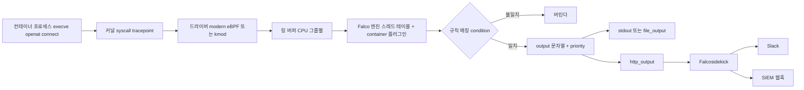
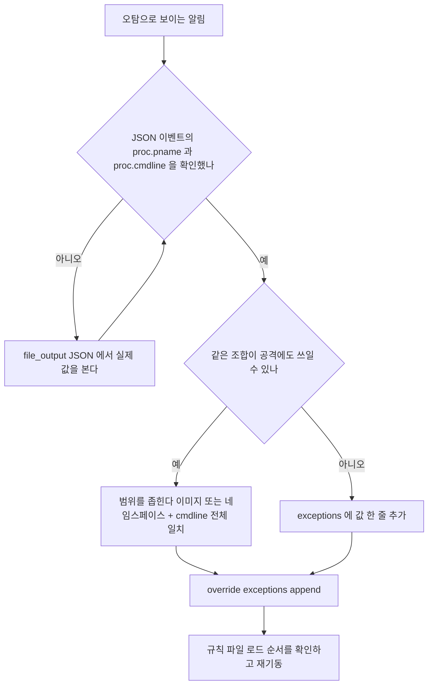
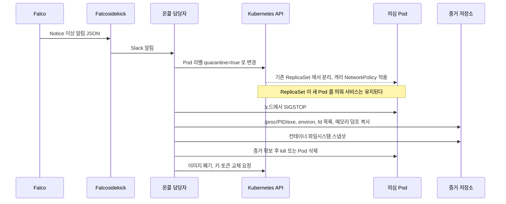

# 컨테이너 런타임 탐지와 Falco

[Docker 컨테이너 보안](Container_Security.md)은 이미지를 스캔하고 서명하는 빌드 시점을, [쿠버네티스 보안](Kubernetes_Security.md)은 Pod Security Standards와 NetworkPolicy로 배포 시점을 막는다. 둘 다 컨테이너가 뜨기 전이나 뜰 때 하는 일이다. 스캐너가 모르는 취약점으로 RCE가 터져서 컨테이너 안에서 셸이 열리면, 그다음부터는 아무도 보고 있지 않다. 이 문서는 그 구간, 실행 중인 컨테이너가 하는 syscall을 보고 이상한 행동을 잡는 일을 다룬다. 도구는 Falco로 잡았다.

## 실험 환경

설명에 나오는 출력은 전부 아래 환경에서 직접 돌린 결과다.

| 항목 | 값 |
|---|---|
| 호스트 | Ubuntu, 커널 5.15.0-52-generic, KVM 4 vCPU |
| Falco | 0.45.0 (정적 tarball, 드라이버 modern eBPF) |
| Falcosidekick | 2.35.0 |
| 컨테이너 런타임 | 없음 |

런타임이 없는 환경이라 컨테이너는 흉내를 냈다. cgroup v2에 `docker-<64자리 hex>.scope` 이름의 디렉터리를 만들고 셸 PID를 `cgroup.procs`에 넣었다. Falco의 container 플러그인은 cgroup 경로 이름으로 컨테이너 ID를 뽑기 때문에 `container.id != host` 조건은 실제 컨테이너와 똑같이 참이 된다. 대신 런타임 소켓이 없어서 `container.name`, `container.image.repository`는 `<NA>`로 나온다. 이미지 이름 기반 조건은 이 실험에서 검증하지 못했고, 해당 부분에는 그렇게 적어 두었다.

## syscall이 알림이 되기까지

Falco는 컨테이너 안에 들어가지 않는다. 호스트 커널의 syscall 지점에 드라이버를 붙이고, 컨테이너든 호스트 프로세스든 모든 프로세스의 `execve`, `openat`, `connect` 같은 호출을 노드 한 곳에서 본다. 그래서 DaemonSet으로 노드당 한 개만 띄우면 된다.

아래 흐름에서 봐야 할 곳은 드라이버와 Falco 엔진 사이의 링 버퍼다. 커널은 이벤트를 버퍼에 쓰고 Falco 사용자 공간 프로세스가 읽어 간다. Falco가 느려지면 커널은 기다려 주지 않고 이벤트를 버린다. 뒤에서 다룰 드롭 이벤트가 이 지점에서 생긴다.



### 드라이버 선택과 커널 제약

0.45.0의 `falco.yaml`에서 고를 수 있는 엔진은 `kmod`, `modern_ebpf`, `replay`, `nodriver` 네 가지다. 예전 클래식 eBPF 프로브는 설정에 더 이상 없다. 실무에서 고민할 선택지는 앞의 둘이다.

| | modern eBPF | 커널 모듈 |
|---|---|---|
| 빌드 | 바이너리에 내장(CO-RE). 노드에서 컴파일하지 않는다 | 노드 커널 헤더가 있어야 빌드하거나 미리 빌드된 모듈을 받는다 |
| 커널 요구 | BTF(`/sys/kernel/btf/vmlinux`)와 BPF 링 버퍼. 대략 5.8 이상 | 오래된 커널까지 폭넓게 맞는다 |
| 로드 방식 | 일반 BPF 프로그램 | `insmod`, 노드에 커널 모듈이 올라간다 |
| 문제 시 영향 | verifier가 거부하면 그 프로그램만 못 올라간다 | 모듈 버그는 커널 패닉으로 이어질 수 있다 |
| 관리형 노드 | 노드 이미지에 BTF가 있는지 먼저 확인한다 | 노드 이미지를 못 바꾸는 환경에서는 헤더 확보가 번거롭다 |

노드에 올리기 전에 확인할 것은 두 가지다.

```bash
uname -r
ls /sys/kernel/btf/vmlinux     # 없으면 modern eBPF는 못 쓴다
```

이 실험 노드는 5.15.0-52이고 BTF가 있어서 `engine.kind: modern_ebpf`로 바로 떴다. 그런데 처음 띄웠을 때 verifier 로그가 수백 줄 쏟아졌다.

```
libbpf: prog 'dump_task': BPF program load failed: Permission denied
libbpf: prog 'dump_task': failed to load: -13
libbpf: failed to load object 'bpf_probe'
libbpf: failed to load BPF skeleton 'bpf_probe': -13
```

놀라서 드라이버가 안 뜬 줄 알았는데 Falco는 계속 동작했다. 이 프로그램은 시작할 때 프로세스 테이블을 채우는 BPF iterator이고, 로드에 실패하면 `/proc`을 훑는 쪽으로 넘어간다. 실제로 이 상태에서 `/etc/shadow`를 읽는 프로세스와 `connect`를 모두 잡았다. 로그가 거슬리면 `engine.modern_ebpf.disable_iterators: true`로 처음부터 끈다. 시작 시점 프로세스 정보가 조금 느리게 채워질 뿐이다.

한 가지 더 걸리는 부분이 있다. 0.45부터 컨테이너 메타데이터는 코어가 아니라 `libcontainer.so` 플러그인이 채운다. 공식 Helm 차트는 이걸 알아서 켜지만 tarball이나 직접 만든 이미지로 띄우면 `load_plugins: [container]`를 넣어야 한다. 빼먹으면 `Plugin requirement not satisfied, must load one of: container (>= 0.4.0)` 에러로 시작 자체가 실패한다.

## 규칙의 구조

Falco 규칙은 YAML이고 요소가 다섯 가지다.

| 요소 | 역할 |
|---|---|
| `rule` | 이름, `condition`, `output`, `priority`를 묶은 단위 |
| `condition` | syscall 이벤트에 대한 불리언 식. 참이면 알림이 나간다 |
| `output` | 알림 문자열. `%proc.cmdline` 같은 필드를 치환한다 |
| `macro` | 자주 쓰는 condition 조각에 붙인 이름 |
| `list` | 값 목록. condition 안에서 `in (목록이름)`으로 쓴다 |

기본 규칙 파일의 매크로를 가져다 쓰면 짧아진다. `spawned_process`는 `execve`/`execveat`, `container`는 `container.id != host`, `shell_procs`는 `sh bash zsh` 같은 이름 목록이다. 직접 쓴 규칙은 이런 모양이었다.

```yaml
- list: allowed_outbound_ports
  items: [53, 443, 5432, 6379]

- macro: outbound_connect
  condition: >
    evt.type = connect and fd.typechar = 4
    and not fd.snet in ("127.0.0.0/8", "10.0.0.0/8")

- rule: Unexpected outbound connection
  desc: 컨테이너가 허용 포트 밖으로 연결을 연다
  condition: >
    outbound_connect and container
    and not fd.sport in (allowed_outbound_ports)
  output: >
    outbound %fd.sip:%fd.sport (proc=%proc.name cmdline=%proc.cmdline
    container=%container.id image=%container.image.repository)
  priority: WARNING
  tags: [network, mitre_exfiltration]
```

처음에는 `evt.type = connect and evt.dir = <`라고 썼다. 예전 문서와 블로그에서 흔히 보이는 모양이다. 0.45에서는 로딩 때 `LOAD_DEPRECATED_ITEM (Used deprecated item: field 'evt.dir')` 경고가 나온다. enter 이벤트가 없어져서 `evt.dir = <`는 항상 참이니 지우라는 내용이다. 오래된 규칙을 복사해 올 때 이런 경고가 쌓이면 진짜 문법 오류를 놓치기 쉽다.

### 기본 규칙이 실제로 잡는 것

0.45.0의 `falco_rules.yaml`에는 `maturity_stable` 규칙이 25개 들어 있다. 요구한 네 가지 행동이 그중 몇 개나 들어 있는지는 규칙 이름을 보면 바로 나온다.

| 행동 | 기본 규칙 | 비고 |
|---|---|---|
| 컨테이너 안 셸 | `Terminal shell in container` | tty가 붙고 부모가 런타임일 때만 |
| 민감 파일 읽기 | `Read sensitive file untrusted` | 대상이 `/etc/shadow`, `/etc/sudoers`, `/etc/pam.conf`, `/etc/pam.d`, `/etc/sudoers.d` 등 |
| `/etc` 쓰기 | 없음 | 직접 작성 |
| 예상 밖 아웃바운드 | 없음 | `Contact K8S API Server From Container` 같은 개별 규칙만 있다. 직접 작성 |

`/etc` 쓰기 규칙은 incubating 규칙 파일에 있는 것으로 알고 있지만 이번에는 받아 보지 않았다. 아웃바운드는 어느 규칙셋을 받든 환경마다 허용 목적지가 달라서 결국 직접 써야 한다.

`Terminal shell in container`의 조건은 `spawned_process and container and shell_procs and proc.tty != 0 and container_entrypoint`다. 이 조건을 뒤집어 보면 놓치는 것이 보인다. `kubectl exec -it`은 잡힌다. `kubectl exec pod -- sh -c '...'`처럼 tty 없이 실행한 셸은 안 잡히고, 컨테이너 안 프로세스가 자식으로 띄운 셸은 부모가 런타임이 아니라서 `container_entrypoint`를 통과하지 못한다. 실제로 부모가 `bash`인 상태에서 `/etc/shadow`를 읽고 `/etc/lab_test.conf`에 쓰는 실험을 했을 때 이 규칙은 조용했다. tty 없는 셸까지 보려면 아래처럼 tty 조건을 뺀 규칙을 따로 둔다.

```yaml
- rule: Shell in container
  desc: tty 와 상관없이 컨테이너 안에서 셸이 실행된다
  condition: spawned_process and container and shell_procs
  output: >
    shell exec (user=%user.name proc=%proc.name parent=%proc.pname
    cmdline=%proc.cmdline container=%container.id)
  priority: NOTICE
```

### 네 규칙을 실제로 울려 본 결과

위에서 만든 `/etc` 쓰기 규칙과 아웃바운드 규칙, 기본 규칙 두 개를 한꺼번에 켜고, 가짜 컨테이너 cgroup 안에서 `/etc/lab_test.conf`에 쓰기, `cat /etc/shadow`, `93.184.216.34:8080`으로 `connect`, pty를 붙인 셸 실행을 차례로 했다. `file_output`의 JSON을 요약한 결과다.

```
17:28:41.284 Error   Write below etc (lab)        container=2d9b6b12d6fe proc=bash   file=/etc/lab_test.conf
17:28:41.321 Warning Read sensitive file untrusted container=2d9b6b12d6fe proc=cat    file=/etc/shadow
17:28:41.355 Warning Unexpected outbound (lab)    container=2d9b6b12d6fe proc=python3 dst=93.184.216.34:8080
17:28:42.363 Notice  Terminal shell in container container=2d9b6b12d6fe proc=sh      cmdline=sh -c id
```

stdout 쪽 알림 한 줄은 이렇게 나온다.

```
Notice A shell was spawned in a container with an attached terminal | evt_type=execve user=root user_uid=0 user_loginuid=0 process=sh proc_exepath=/usr/bin/dash parent=runc command=sh -c id terminal=...
```

두 가지가 눈에 띄었다. JSON의 `time`은 UTC(17:28)이고 stdout 텍스트는 로컬 시간(02:28)이다. 같은 이벤트를 stdout 로그와 SIEM에서 맞춰 볼 때 9시간이 어긋나 보이는 이유가 이것이다. 그리고 부모가 `runc`인 셸을 만들려고 bash를 `runc`라는 이름으로 복사해서 썼다. 기본 규칙의 `container_entrypoint` 매크로가 부모 이름 목록(`runc`, `containerd-shim`, `crio`, `conmon` 등)과 문자열로만 비교하기 때문에 가능한 일이다. 이 점은 공격자 입장에서도 마찬가지다. 부모 이름을 목록 안의 것으로 위장하면 이 규칙은 통과한다. 이름 하나에 의존하는 규칙은 보조 신호로 두는 편이 안전하다.

## 오탐이 쏟아질 때

규칙을 켜고 나서 처음 며칠은 알림 대부분이 정상 동작이다. 출처는 크게 세 가지로 갈린다. 헬스체크 쪽은 위 실험에서 그대로 재현했고, 나머지 둘은 규칙 조건을 읽어서 울릴 자리를 짚은 것이다.

| 출처 | 어떤 규칙이 울리나 | 정리 방법 |
|---|---|---|
| 헬스체크 exec probe | `Shell in container` 계열. probe가 `sh -c`로 스크립트를 실행한다 | 부모 프로세스 + 명령줄 조합으로 예외 |
| 배포·운영 도구 | entrypoint 래퍼 스크립트, `kubectl cp`, 마이그레이션 잡이 시작될 때 쓰는 셸 | 이미지 또는 네임스페이스 기준 예외 |
| 로그 수집기·모니터링 에이전트 | 아웃바운드 규칙이 Kafka, Elasticsearch, Loki 포트 연결마다 울린다. 컴플라이언스 스캐너는 `/etc/shadow`를 읽는다 | 포트 list에 추가하거나 바이너리 이름으로 예외 |

규칙을 통째로 끄는 선택지도 있지만 그러면 그 행동은 영영 안 본다. 예외를 먼저 시도한다. 판단 순서는 이렇게 정했다.



### exceptions와 override

헬스체크 예외는 Falco 0.45의 `exceptions`와 `override`로 썼다. 원본 규칙은 건드리지 않고 나중에 로드되는 파일에서 덧붙인다. 규칙 쪽에는 예외 이름과 비교 필드만 선언해 두고,

```yaml
- rule: Shell in container (lab)
  condition: spawned_process and container and shell_procs
  exceptions:
    - name: probe_by_runtime
      fields: [proc.pname, proc.cmdline]
      comps: [=, startswith]
  # output, priority 생략
```

값은 별도 파일에서 추가한다.

```yaml
- rule: Shell in container (lab)
  exceptions:
    - name: probe_by_runtime
      values:
        - [runc, "sh -c /tmp/falco/health.sh"]
  override:
    exceptions: append
```

`rules_files`에서 이 파일이 원본 뒤에 나와야 한다. 앞에 놓으면 덧붙일 대상이 없다. 기본 규칙을 통째로 끄는 형태도 같은 방식이다.

```yaml
- rule: Terminal shell in container
  enabled: false
  override:
    enabled: replace
```

이 파일을 기본 규칙과 함께 로드한 뒤 같은 시나리오를 돌렸더니 `Terminal shell in container`는 사라졌고 직접 쓴 `Unexpected outbound connection`은 `outbound 93.184.216.34:8080 (proc=python3 ...)`로 그대로 울렸다. 헬스체크 쪽은 `sh -c /tmp/falco/health.sh`가 억제되고 같은 `runc` 부모의 `sh -c id`만 남았다.

처음에는 예외가 안 먹었다. 존재하지 않는 `/health.sh`를 실행하게 했더니 이벤트의 `proc.pname`이 `runc`가 아니라 `sh`로 찍혔고, 예외 값의 부모가 `runc`라서 매칭되지 않았다. 실행 파일을 실제로 만들고 나서야 부모가 `runc`로 나왔다. 예외 값을 쓰기 전에 실제 JSON 이벤트에서 `proc.pname`과 `proc.cmdline`을 그대로 복사해야 하는 이유다. 쿠버네티스 환경에서는 런타임에 따라 부모가 `runc`로 나올 수도 있고 `containerd-shim`으로 나올 수도 있어서, 추측한 값을 넣으면 같은 일이 생긴다.

override 파일만 따로 검증하려고 `falco -V rules/example.yaml`을 돌리면 `An 'override.<key>: replace' to a rule was requested but no rule by that name already exists`라는 에러가 난다. 파일 하나만 보고 판단하기 때문이다. 실제로 기본 규칙과 함께 띄워 보면 정상 로드된다.

이미지 이름 기준 예외(`container.image.repository`)는 문법이 위와 같지만 이 실험 환경에서는 값이 `<NA>`라 동작을 확인하지 못했다. 쿠버네티스 노드에서는 먼저 알림 하나를 받아서 해당 필드가 채워져 있는지 보고 쓴다.

## Falcosidekick으로 알림 보내기

Falco 자체는 stdout, 파일, syslog, HTTP까지만 낸다. Slack이나 SIEM 같은 곳으로 나누는 일은 Falcosidekick이 한다. Falco에서 `json_output: true`와 `http_output`을 켜서 Sidekick의 포트로 보내고, Sidekick이 출력별 최소 priority로 거른다.

```yaml
# falco.yaml
json_output: true
http_output:
  enabled: true
  url: "http://127.0.0.1:2801/"
```

```yaml
# falcosidekick config.yaml
listenport: 2801
slack:
  webhookurl: "http://127.0.0.1:9099/slack"
  minimumpriority: "warning"
webhook:
  address: "http://127.0.0.1:9099/siem"
  minimumpriority: "notice"
```

로컬 포트에 단순 HTTP 수신기를 띄워 Slack과 SIEM 역할을 대신하게 했다. 쿠버네티스에서는 Helm 차트에서 `falcosidekick.enabled=true`와 `falcosidekick.config.slack.webhookurl=...`을 주는 쪽이 간단하다. 위 네 가지 시나리오 결과는 이렇게 나뉘어 도착했다.

| 이벤트 | priority | Slack(warning 이상) | 웹훅(notice 이상) |
|---|---|---|---|
| Write below etc | Error | 도착 | 도착 |
| Read sensitive file untrusted | Warning | 도착 | 도착 |
| Unexpected outbound | Warning | 도착 | 도착 |
| Shell in container, Terminal shell in container | Notice | 도착하지 않음 | 도착 |

Slack에는 3건, 웹훅에는 5건이 갔다. Notice 수준의 셸 실행은 Slack을 건너뛰고 SIEM에만 쌓인다. 사람이 보는 채널은 높게, 나중에 검색할 저장소는 낮게 잡는 식으로 나눈다.

Slack 메시지 포맷을 따로 지정하지 않고 `OutputFields`를 넣었더니 `map[container.id:4de6242c9a26 container.image.repository:<nil> ...]`처럼 Go 맵이 그대로 찍혔다. 필요한 필드만 템플릿으로 골라 쓰는 편이 읽기 좋다.

## 대응 순서

탐지에서 끝나면 의미가 없다. 알림이 오면 컨테이너를 어떻게 다룰지 순서가 중요하다. 프로세스를 먼저 죽이거나 Pod를 지우면 메모리와 컨테이너 파일시스템에 있던 증거가 사라진다. Deployment가 새 Pod를 바로 띄워서 현장은 더 못 본다. 격리, 증거 보존, 종료 순서를 지킨다.



도식에서 짚을 곳은 `SIGSTOP`이 `kill`보다 앞이라는 점이다. 프로세스를 멈추면 네트워크 연결과 메모리는 그대로 남고 더 이상 동작하지 않는다.

노드에서 증거를 모으는 명령은 실제로 돌려 봤다. 실행 파일을 지운 프로세스 하나를 띄워 두고 `kill -STOP` 한 뒤 `/proc`에서 꺼냈다.

```bash
ls -l /proc/$P/exe          # /tmp/ev/miner (deleted)
kill -STOP $P               # State: T (stopped)
tr '\0' '\n' < /proc/$P/environ | grep SECRET   # SECRET_TOKEN=abc
cp /proc/$P/exe /tmp/ev/dump.bin
sha256sum /tmp/ev/dump.bin /bin/sleep           # 두 해시가 같다
```

디스크에서 파일이 지워져도 프로세스가 열고 있는 한 `/proc/PID/exe`로 원본이 복구되고 해시도 일치한다. 환경변수에 들어 있는 토큰까지 나오는 건 증거로는 좋지만, 이 값이 유출됐다는 뜻이기도 해서 즉시 교체해야 한다. 컨테이너 프로세스도 노드에서는 호스트 PID로 보이므로 노드 접근 권한만 있으면 같은 방식이 통한다.

이 흐름을 사람 손으로 하지 않으려면 Falco 쪽 대응 엔진인 Falco Talon을 붙이는 방법이 있다. 라벨 변경, NetworkPolicy 적용, Pod 종료 같은 동작을 규칙 이름에 묶는 도구로 알고 있다. 이번 실험에는 포함하지 않았다. 자동 대응은 오탐 하나가 서비스 Pod를 격리하거나 종료하는 사고로 이어지니, 예외 정리가 끝나 알림이 거의 정확해진 뒤에 붙인다. 사고 절차 전체는 [보안 사고 대응 절차](Incident_Response.md), 감사 로그와의 연결은 [보안 로깅과 감사](Security_Logging_and_Auditing.md)에서 다룬다.

## Falco, Tetragon, Tracee

셋 다 eBPF로 커널 이벤트를 보지만 판정을 어디서 하고 무엇을 할 수 있는지가 다르다. Tetragon과 Tracee는 이번에 직접 띄우지 못했다. 표의 해당 열은 각 프로젝트 문서에 적힌 동작을 기준으로 했다.

| | Falco | Tetragon | Tracee |
|---|---|---|---|
| 관리 주체 | CNCF 프로젝트 | Cilium(Isovalent) | Aqua Security |
| 정책 표현 | YAML 규칙(condition 식) | `TracingPolicy` CRD | 시그니처(Go, Rego) |
| 판정 위치 | 사용자 공간 엔진 | 커널 안 필터링과 사용자 공간 | 사용자 공간 시그니처 엔진 |
| 차단 | 하지 않음. 별도 대응 엔진 필요 | 정책 동작으로 프로세스 종료 등 가능 | 탐지 중심 |
| 쿠버네티스 인식 | 네임스페이스, Pod 라벨 필드 | CRD, 워크로드 기준 정책 | 컨테이너·Pod 메타 포함 |
| 알림 출력 | stdout, 파일, HTTP, Falcosidekick | JSON 이벤트 로그, gRPC | 이벤트 스트림, 웹훅 |
| 기본 규칙 | 규칙셋 풍부, 커뮤니티 관리 | 직접 정책 작성이 많다 | 기본 시그니처 제공 |

선택 기준은 이렇게 잡았다. 이미 만들어진 규칙과 알림 연동 생태계가 필요하고 탐지 후 사람이 판단하는 흐름이면 Falco가 편하다. 커널 안에서 바로 막아야 하는 요구, 예를 들어 특정 바이너리 실행을 즉시 종료시켜야 한다면 Tetragon의 차단 동작을 본다. 이벤트를 넓게 모아서 시그니처로 후처리하는 방식이 맞으면 Tracee가 후보다. 둘 이상을 같은 노드에 올리면 각자 syscall 지점에 프로그램을 붙이므로 부하가 더해진다. 겹치는 용도로는 하나만 고른다.

## DaemonSet 부하와 드롭 이벤트

Falco는 노드의 모든 syscall을 읽기 때문에 노드의 syscall 양이 곧 부하다. 컨테이너가 몇 개인지보다 초당 이벤트 수가 중요하다.

### 오버헤드 측정

`metrics` 블록을 켜서 5초마다 JSON 파일로 내보내게 했다.

```yaml
metrics:
  enabled: true
  interval: 5s
  output_rule: false
  output_file: /tmp/falco/metrics.json
```

워크로드는 파이썬으로 `/etc/hostname`을 `open`, `read`, `close`하는 루프 30만 회다. 3회씩 걸린 시간이다.

| 상태 | 소요 시간(초) | 이벤트 | 드롭 |
|---|---|---|---|
| Falco 없음 | 3.38, 4.21, 4.37 | | |
| Falco 실행 중(기본 8MB 버퍼) | 7.31, 8.11, 8.01 | 약 74,000/s | 0 |

메트릭에는 `falco.cpu_usage_perc` 21.8, `falco.evts_rate_sec` 74378.1, `scap.n_drops` 0이 찍혔다. 이 루프는 syscall만 연속으로 호출하는 최악의 형태라서 실제 서비스 Pod에 이 수치를 그대로 적용하면 안 된다. 다만 syscall 위주로 도는 워크로드(파일 많이 여는 배치, 소켓을 쉼 없이 여닫는 프록시)가 같은 노드에 있으면 그 Pod가 느려진다는 방향은 확인했다. 노드 풀마다 `evts_rate_sec`를 먼저 재 보고 이벤트가 많은 풀에 CPU 요청을 더 잡는 순서가 맞다.

### 드롭이 나는 조건

버퍼를 일부러 줄여서 드롭을 만들었다. `buf_size_preset`을 1(1MB)로, `cpus_for_each_buffer`를 4로 바꾸고 Falco를 `taskset -c 0`으로 CPU 하나에 묶은 다음, 같은 코어를 포함해 4개 코어에 부하 프로세스를 하나씩 올렸다.

```
evts_rate  cpu    n_drops     n_drops_perc   n_evts
22013.8    17.8   222893      56.7           393152
35271.3    28.3   627798      59.9           1069124
33752.6    36.6   1534899     64.5           2437753
43736.2    37.9   2708207     12.2           4805564
```

부하가 끝나기 전에는 이벤트의 절반 이상이 버려졌다. Falco 자체 알림은 `Falco internal: syscall event drop. 223032 system calls dropped in last second.`로 나왔고 필드에 `n_drops_buffer_open_exit`, `n_drops_buffer_close_exit`처럼 어떤 syscall 종류가 버려졌는지 들어 있다. 이번에는 `open`과 `close`만 버려졌다. `n_drops_buffer_execve_exit`가 0이 아니면 프로세스 실행 이벤트가 샌다는 뜻이라 이쪽이 더 위험하다.

이 알림의 priority는 `Debug`다. 앞에서 Slack을 `minimumpriority: warning`으로 걸어 두었다면 드롭 알림은 Slack에 오지 않는다. 드롭을 놓치지 않으려면 알림 채널에 기대지 말고 메트릭을 직접 본다. `webserver.prometheus_metrics_enabled`를 켜서 `scap.n_drops`와 `scap.n_drops_perc`를 Prometheus로 긁어 알람을 거는 방식이 안전하다. 드롭 처리 방식은 `syscall_event_drops.actions`(기본 `log`, `alert`)와 `threshold`로 조절한다.

드롭이 보이면 버퍼 크기(`buf_size_preset`)를 올리고, `cpus_for_each_buffer`를 줄여 버퍼를 CPU에 더 잘게 나누고, 규칙을 줄이고, 마지막으로 노드 풀을 분리하는 순서로 대응한다.

## 앞단과의 관계

규칙 파일은 기본 규칙, 환경별 사용자 규칙, override 순서로 로드하고 기본 규칙 파일은 건드리지 않는다. 새 규칙은 `priority`를 낮게 시작해 Sidekick의 SIEM 쪽에만 보내다가 며칠 뒤 올린다. `/etc/shadow` 접근 같은 기본 규칙은 컨테이너가 읽을 일이 거의 없어 오탐이 적고, 아웃바운드 규칙은 허용 포트 목록을 서비스별로 따로 관리해야 한다.

런타임 탐지는 취약점 스캔과 NetworkPolicy를 대신하지 않는다. 앞단에서 막지 못한 것이 실행됐을 때 보는 층이다. 컨테이너가 탈출했을 때 피해를 줄이는 쪽은 [Rootless 컨테이너와 User Namespace](Rootless_Containers_User_Namespaces.md)에서 이어진다.
