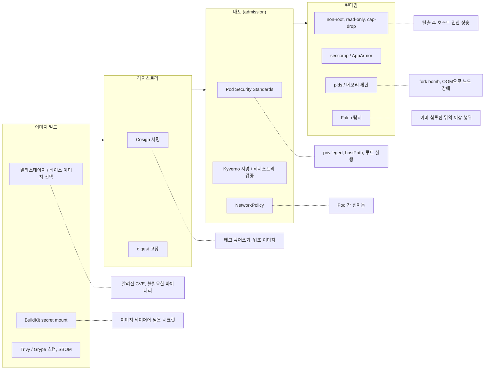
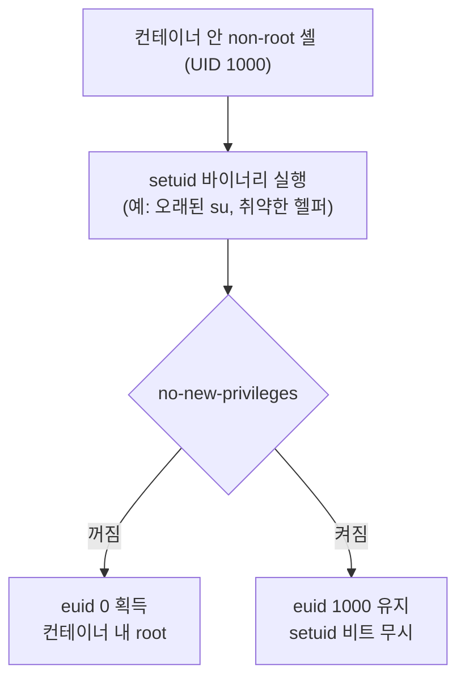
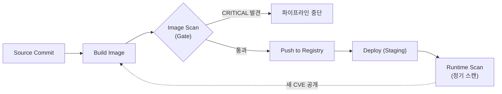
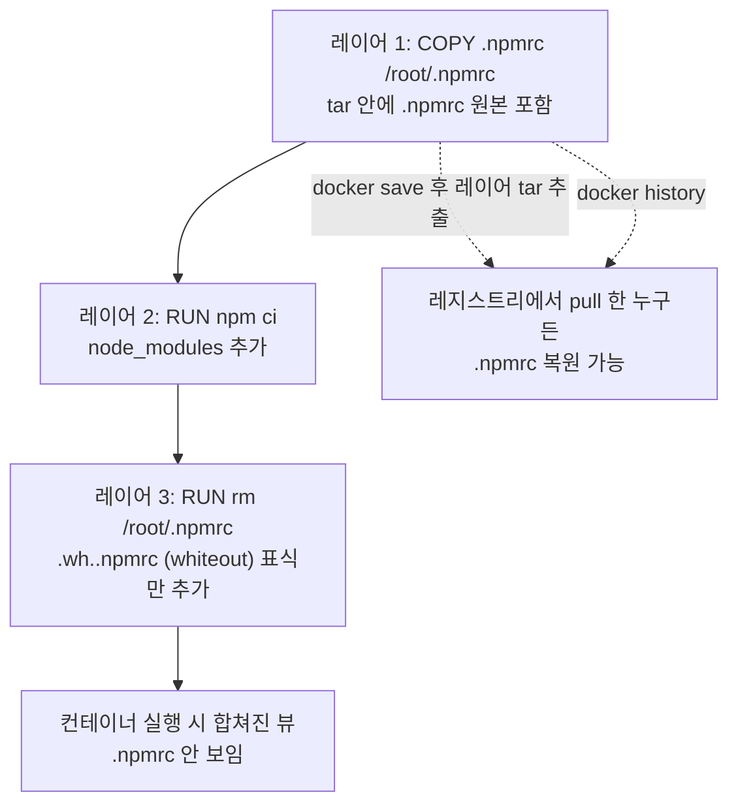
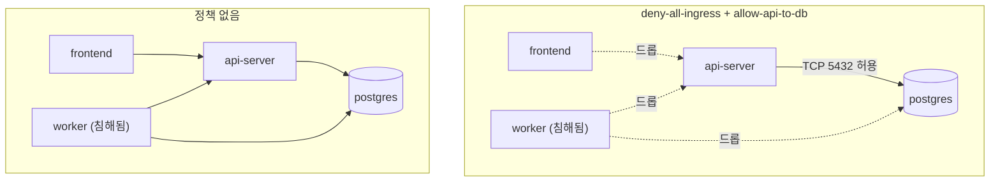
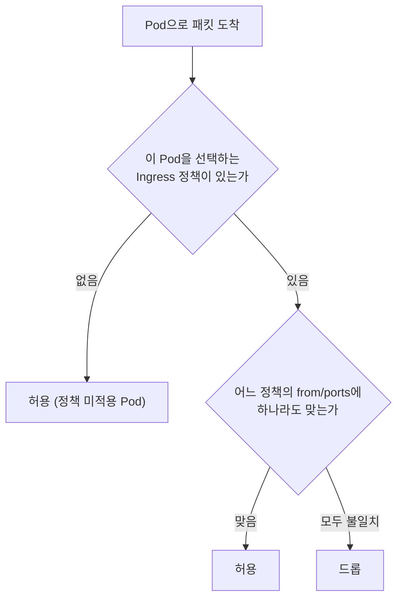

# Docker 컨테이너 보안

## 컨테이너는 VM이 아니다

컨테이너는 커널을 호스트와 공유한다. 격리 수준이 VM보다 낮기 때문에, 컨테이너 내부에서 권한 상승이 발생하면 호스트까지 영향을 줄 수 있다. 보안 설정 없이 `docker run`만 하면 사실상 호스트에 루트 쉘을 열어두는 것과 다를 바 없는 경우가 생긴다.

## 어느 단계가 어느 위협을 막는가

컨테이너 보안은 한 군데에서 끝나지 않는다. 이미지를 만들 때, 레지스트리에 올릴 때, 클러스터가 받아줄 때, 돌아가는 중에 각각 다른 위협을 다룬다. 아래 그림은 단계별로 이 문서의 어느 절이 어떤 위협을 막는지 묶은 것이다. 점선으로 연결된 오른쪽 상자가 그 방어책이 막는 위협이다.



앞 단계에서 걸러야 비용이 싸다. 스캔에서 걸린 CVE는 Dockerfile 한 줄로 고치지만, 런타임에서 Falco가 잡은 시점에는 이미 침투가 끝난 뒤다. 반대로 앞 단계를 다 통과해도 제로데이는 남기 때문에 런타임 제한(non-root, capability, seccomp)은 따로 걸어야 한다. 런타임 탐지는 [Container Runtime Security — Falco](Container_Runtime_Security_Falco.md)에서 다룬다.

---

## non-root 실행

컨테이너 내부 프로세스가 root로 돌아가면, 컨테이너 탈출(container escape) 취약점이 터졌을 때 호스트의 root 권한을 그대로 가져간다.

```dockerfile
FROM node:20-slim

# 유저 생성
RUN groupadd -r app && useradd -r -g app -d /home/app -s /sbin/nologin app

WORKDIR /home/app
COPY --chown=app:app . .

# 루트가 필요한 작업(패키지 설치 등)은 여기서 끝낸다
RUN npm ci --omit=dev

# 이후부터 app 유저로 전환
USER app

CMD ["node", "server.js"]
```

주의할 점:

- `USER` 지시자를 `RUN npm ci` 뒤에 넣어야 한다. npm 패키지 설치 시 root 권한이 필요한 경우가 있다.
- 바인드 마운트한 볼륨의 소유자가 root면 app 유저가 쓰기 실패한다. 호스트에서 미리 퍼미션을 맞춰야 한다.
- Alpine 베이스 이미지는 `addgroup`/`adduser` 명령어가 다르다.

```dockerfile
# Alpine의 경우
RUN addgroup -S app && adduser -S -G app app
```

런타임에서 강제하는 방법도 있다:

```bash
docker run --user 1000:1000 myimage
```

이미지 안에 해당 UID가 없어도 동작하지만, `/etc/passwd`에 매핑이 없어서 로그에 `I have no name!` 같은 경고가 뜬다. 기능상 문제는 없지만, 이미지 내에서 유저를 만들어두는 게 깔끔하다.

---

## read-only 파일시스템

컨테이너 내부에서 파일을 쓸 수 없게 만들면, 공격자가 악성 바이너리를 다운받거나 설정 파일을 변조하는 걸 막는다.

```bash
docker run --read-only \
  --tmpfs /tmp:rw,noexec,nosuid,size=64m \
  --tmpfs /var/run:rw,noexec,nosuid \
  myimage
```

- `--read-only`: 컨테이너의 루트 파일시스템을 읽기 전용으로 마운트
- `--tmpfs`: 로그나 PID 파일 등 쓰기가 필요한 경로만 tmpfs로 열어준다
- `noexec`: tmpfs에서 바이너리 실행 차단. 공격자가 `/tmp`에 뭔가 다운받아 실행하는 걸 막는다

실제로 적용하면 의외로 많은 앱이 깨진다. 로그를 파일로 쓰는 앱, `/var/cache`에 뭔가 저장하는 앱 등. 하나씩 tmpfs를 추가하면서 맞춰야 한다.

---

## seccomp과 AppArmor

### seccomp

Linux 커널의 시스템콜을 필터링한다. Docker는 기본 seccomp 프로파일을 적용하는데, `ptrace`, `mount` 같은 위험한 시스템콜 약 44개를 차단한다.

```bash
# 기본 프로파일 확인 (Docker 소스에 포함)
docker run --rm --security-opt seccomp=default myimage

# 커스텀 프로파일 적용
docker run --security-opt seccomp=my-profile.json myimage
```

커스텀 프로파일 예시 — `chmod` 시스템콜을 차단하는 경우:

```json
{
  "defaultAction": "SCMP_ACT_ALLOW",
  "syscalls": [
    {
      "names": ["chmod", "fchmod", "fchmodat"],
      "action": "SCMP_ACT_ERRNO",
      "errnoRet": 1
    }
  ]
}
```

`--security-opt seccomp=unconfined`로 seccomp을 끄는 경우가 있는데, 디버깅 용도 외에는 쓰면 안 된다. CI 환경에서 "seccomp 때문에 빌드 실패한다"고 끄는 걸 자주 보는데, 프로파일을 맞추는 게 맞다.

### AppArmor

파일 접근, 네트워크, 프로세스 실행 등을 제어하는 MAC(Mandatory Access Control) 시스템이다. Docker는 기본 AppArmor 프로파일(`docker-default`)을 자동 적용한다.

```bash
# 커스텀 프로파일 적용
docker run --security-opt apparmor=my-custom-profile myimage
```

seccomp이 시스템콜 레벨, AppArmor는 리소스 접근 레벨이다. 둘 다 쓰는 게 맞다.

---

## capability 최소화와 no-new-privileges

root가 아닌 유저로 돌려도 컨테이너에는 Docker 기본 capability 14개 안팎이 남아 있다. `NET_RAW`(raw 소켓, ARP 스푸핑에 쓰인다), `SETUID`/`SETGID`, `CHOWN`, `DAC_OVERRIDE`, `MKNOD` 같은 것들이다. 웹 애플리케이션이 이 중 쓰는 건 거의 없다. 전부 버리고 필요한 것만 되돌리는 쪽이 낫다.

```bash
docker run \
  --cap-drop=ALL \
  --cap-add=NET_BIND_SERVICE \
  --security-opt=no-new-privileges \
  myimage
```

`--cap-drop=ALL`만 걸어 보면 어떤 capability가 필요한지는 앱이 알려 준다. 부팅 중 `EPERM`(`Operation not permitted`)이 나는 시스템콜을 `strace -f`로 찾고, 해당 capability를 하나씩 `--cap-add`로 되돌린다. 처음부터 "혹시 모르니" 하고 `--cap-add=SYS_ADMIN`을 넣으면 의미가 없다. `SYS_ADMIN`은 `mount`, 네임스페이스 조작까지 열어서 거의 root와 같다.

Docker 20.10 이상에서는 컨테이너의 `net.ipv4.ip_unprivileged_port_start`가 기본 0이라 non-root가 80 포트를 바인딩할 수 있다(`docker run --rm alpine cat /proc/sys/net/ipv4/ip_unprivileged_port_start`로 확인). 이 경우 `NET_BIND_SERVICE`는 필요 없다. K8s에서는 이 값이 기본으로 풀려 있지 않다.

`setcap`으로 바이너리에 파일 capability를 박는 방식은 `--cap-drop=ALL`과 같이 쓰면 깨진다. Docker가 drop한 capability는 프로세스의 bounding set에서 빠지기 때문이다. 같은 조건을 `setpriv`로 재현해 보면 이렇다.

```bash
setcap 'cap_net_bind_service=+ep' ./myapp

# bounding set 을 전부 비움 (cap-drop=ALL 과 같은 상태)
setpriv --reuid=65534 --regid=65534 --clear-groups --bounding-set=-all ./myapp
# setpriv: failed to execute ./myapp: Operation not permitted

# net_bind_service 만 남김 (cap-add=NET_BIND_SERVICE 와 같은 상태)
setpriv --reuid=65534 --regid=65534 --clear-groups \
  --bounding-set=-all,+net_bind_service ./myapp
# 정상 실행
```

바이너리가 아예 실행되지 않으니 "포트 바인딩 실패"가 아니라 "컨테이너가 시작하자마자 죽는다"로 나타난다. `setcap` 방식을 쓸 거면 `--cap-add=NET_BIND_SERVICE`도 같이 줘야 한다. 아래 Linux Capabilities 절의 `setcap` 예시는 `drop: ALL`을 같이 건 환경에서는 add 없이 성립하지 않는다.

### no-new-privileges

`no-new-privileges`는 프로세스가 `execve`로 권한을 더 얻는 경로를 막는다. setuid 비트가 켜진 바이너리(`su`, `sudo`, `passwd`, 이미지에 남은 오래된 setuid 헬퍼)를 실행해도 euid가 올라가지 않는다. 컨테이너 안에서 non-root로 셸을 얻은 공격자가 setuid 바이너리의 취약점으로 root가 되는 경로가 닫힌다.



켜면 깨지는 것도 있다. 컨테이너 안에서 `sudo`로 패키지를 설치하거나 `ping`이 setuid 방식으로 설치된 베이스 이미지는 동작이 바뀐다. 운영 이미지에서는 어차피 쓰지 않는 방식이라 대부분 문제없다. K8s에서는 `securityContext.allowPrivilegeEscalation: false`가 같은 효과를 낸다. 아래 Restricted 레벨 스펙에도 들어 있다.

---

## 자원 제한 — fork bomb와 OOM

자원 제한이 없는 컨테이너는 노드 하나를 통째로 죽일 수 있다. 공격자가 아니어도 버그 하나로 같은 상황이 된다. 프로세스를 끝없이 만드는 fork bomb 계열(자식 프로세스를 정리하지 않는 워커, 무한 재시도 `exec`)은 PID 한계에 닿으면 같은 노드의 다른 컨테이너도 `fork`에 실패한다. 메모리 누수는 노드 OOM killer가 어떤 프로세스를 죽일지 고르게 만들어서 kubelet이나 DB 컨테이너가 대신 죽기도 한다.

| 위협 | 증상 | 막는 설정 (Docker) | K8s |
|---|---|---|---|
| fork bomb | 노드 전체에서 `fork: retry: Resource temporarily unavailable` | `--pids-limit=200` | kubelet `podPidsLimit` (노드 단위) |
| 메모리 누수 | 노드 OOM, 엉뚱한 프로세스가 죽음 | `--memory=512m --memory-swap=512m` | `resources.limits.memory` |
| CPU 독점 | 같은 노드 컨테이너 응답 지연 | `--cpus=1.5` | `resources.limits.cpu` |

```bash
docker run \
  --pids-limit=200 \
  --memory=512m --memory-swap=512m \
  --cpus=1.5 \
  myimage
```

`--memory-swap`을 `--memory`와 같은 값으로 주면 스왑을 쓰지 않는다. 안 주면 Docker는 메모리의 2배까지 스왑을 허용하는 쪽으로 동작해서, 한도를 넘은 컨테이너가 죽지 않고 스왑으로 느려지기만 하는 경우가 생긴다. 한도에 닿아 죽은 컨테이너는 종료 코드 137이고 아래 명령으로 원인이 OOM인지 확인한다.

```bash
docker inspect --format '{{.State.OOMKilled}} {{.State.ExitCode}}' <container>
# true 137
```

`--pids-limit`은 값을 너무 낮게 잡으면 정상 앱이 깨진다. JVM은 GC·JIT·커넥션 풀 스레드가 모두 PID를 쓰므로 Java 서비스를 `--pids-limit=50`으로 띄우면 `unable to create new native thread`가 난다. 먼저 `docker stats`의 PIDS 열로 평상시 값을 보고, 그 3~4배 정도로 시작한다. K8s는 PID 제한이 Pod 스펙이 아니라 kubelet 설정이라 클러스터 관리자 권한이 필요하다는 점도 다르다.

---

## 이미지 취약점 스캔

### CI/CD 파이프라인에서 스캔 위치

컨테이너 이미지 스캔은 파이프라인의 어느 단계에 넣느냐에 따라 역할이 달라진다.



위 그림에서 게이트는 Build와 Push 사이에 있고, 배포 이후 정기 스캔이 새로 공개된 CVE를 잡아 다시 빌드로 되돌린다.

핵심은 **Image Scan** 단계가 Registry Push 앞에 위치해야 한다는 점이다. 취약한 이미지가 레지스트리에 올라가면 다른 팀이 가져다 쓸 수 있다. 레지스트리에 올라간 뒤에 스캔하면 이미 늦다.

그리고 배포 후에도 정기 스캔을 돌려야 한다. 배포 시점에는 없던 CVE가 나중에 공개되는 경우가 많다. Trivy는 `trivy image --server` 모드로 cron job을 걸 수 있고, Snyk은 모니터링 기능이 내장돼 있다.

### Trivy

오픈소스, 로컬에서 바로 돌릴 수 있다.

```bash
# 이미지 스캔
trivy image myapp:latest

# HIGH, CRITICAL만 보기
trivy image --severity HIGH,CRITICAL myapp:latest

# 취약점 있으면 exit code 1 — CI에서 빌드 실패시키기 좋다
trivy image --exit-code 1 --severity CRITICAL myapp:latest

# 수정 가능한 취약점만 보기 (패치가 나온 것만)
trivy image --ignore-unfixed myapp:latest
```

실제 스캔 결과는 이런 형태로 나온다:

```
myapp:latest (debian 12.4)
==========================
Total: 15 (HIGH: 12, CRITICAL: 3)

┌───────────────────┬──────────────────┬──────────┬────────────────┬───────────────┬─────────────────────────────────────┐
│     Library       │  Vulnerability   │ Severity │ Installed Ver  │  Fixed Ver    │             Title                   │
├───────────────────┼──────────────────┼──────────┼────────────────┼───────────────┼─────────────────────────────────────┤
│ libssl3           │ CVE-2024-5535    │ CRITICAL │ 3.0.13-1       │ 3.0.14-1      │ openssl: SSL_select_next_proto      │
│                   │                  │          │                │               │ buffer overread                     │
├───────────────────┼──────────────────┼──────────┼────────────────┼───────────────┼─────────────────────────────────────┤
│ libexpat1         │ CVE-2024-45490   │ CRITICAL │ 2.5.0-1        │ 2.5.0-1+deb12 │ libexpat: negative len for          │
│                   │                  │          │                │ u1            │ XML_ParseBuffer                     │
├───────────────────┼──────────────────┼──────────┼────────────────┼───────────────┼─────────────────────────────────────┤
│ zlib1g            │ CVE-2023-45853   │ CRITICAL │ 1:1.2.13-1     │               │ minizip: integer overflow in        │
│                   │                  │          │                │               │ zipOpenNewFileInZip4_64             │
├───────────────────┼──────────────────┼──────────┼────────────────┼───────────────┼─────────────────────────────────────┤
│ curl              │ CVE-2024-2398    │ HIGH     │ 7.88.1-10      │ 7.88.1-10     │ curl: HTTP/2 push headers           │
│                   │                  │          │                │ +deb12u5      │ memory leak                         │
└───────────────────┴──────────────────┴──────────┴────────────────┴───────────────┴─────────────────────────────────────┘
```

여기서 봐야 할 것:

- **Fixed Ver** 컬럼이 비어있으면 아직 패치가 없다. `--ignore-unfixed` 옵션으로 이런 항목을 제외할 수 있다
- `libssl3`, `zlib1g` 같은 건 base 이미지에서 오는 취약점이다. base 이미지를 업데이트하거나 `-slim` 계열로 바꿔야 줄어든다
- 같은 라이브러리에 여러 CVE가 걸리는 경우가 많다. base 이미지 하나 바꾸면 여러 개가 한번에 해결된다

### Snyk

SaaS 기반, 무료 플랜에서 월 200회 스캔 가능.

```bash
# Docker 이미지 스캔
snyk container test myapp:latest

# Dockerfile도 같이 넘기면 수정 제안까지 해준다
snyk container test myapp:latest --file=Dockerfile
```

Snyk의 스캔 결과는 Trivy와 비슷하지만 base 이미지 변경 제안이 함께 나온다:

```
Testing myapp:latest...

✗ High severity vulnerability found in openssl/libssl3
  Description: Buffer Overread
  Introduced through: openssl/libssl3@3.0.13-1
  From: openssl/libssl3@3.0.13-1
  Fixed in: 3.0.14-1

✗ Critical severity vulnerability found in expat/libexpat1
  Description: Integer Overflow
  Introduced through: expat/libexpat1@2.5.0-1
  From: expat/libexpat1@2.5.0-1
  Fixed in: 2.5.0-1+deb12u1

Organization:      my-org
Package manager:   deb
Target file:       Dockerfile
Project name:      docker-image|myapp
Docker image:      myapp:latest
Base image:        node:20
Licenses:          enabled

Recommendations for base image upgrade:
  Minor upgrades
    Base Image     Vulnerabilities  Severity
    node:20-slim   45               3 critical, 12 high, 15 medium, 15 low
  Alternative image types
    Base Image              Vulnerabilities  Severity
    node:20-alpine          12               0 critical, 2 high, 5 medium, 5 low
```

`--file=Dockerfile`을 넘기면 위처럼 base 이미지별 취약점 수 비교가 나온다. `node:20`에서 `node:20-alpine`으로 바꾸는 것만으로 취약점이 크게 줄어드는 걸 바로 확인할 수 있다.

### Trivy와 Snyk 비교

둘 다 이미지의 OS 패키지와 언어 의존성을 CVE DB와 대조한다. 차이는 어디서 DB를 받고, 결과 뒤에 무엇이 붙느냐에 있다.

| 항목 | Trivy | Snyk |
|---|---|---|
| 형태 | 오픈소스 CLI, 로컬에서 바로 실행 | SaaS, 계정 인증(`snyk auth`) 필요 |
| 취약점 DB | 공개 DB를 로컬에 내려받아 캐시 | Snyk 서버에 질의 |
| 폐쇄망 | DB를 미리 받아 두면 가능 | 사실상 불가 |
| base 이미지 교체 제안 | 없음 | 있음 (`--file=Dockerfile` 필요) |
| 지속 모니터링 | 직접 cron으로 재스캔 | `snyk container monitor`로 내장 |
| 비용 | 무료 | 무료 플랜은 월 스캔 횟수 제한 |
| 같이 보는 것 | 설정 오류(misconfig), 하드코딩 시크릿, SBOM 출력 | IaC, 라이선스 |

CI 게이트로는 Trivy를 넣고, base 이미지를 어디로 옮길지 판단할 때만 Snyk 결과를 참고하는 조합이 흔하다. 한 도구만 믿고 CVE 0건을 기대하면 안 된다. 같은 이미지를 두 도구에 넣으면 건수가 다르게 나오는 경우가 많은데, 배포판별 보안 트래커와 DB 갱신 시점이 달라서다.

### SBOM — Syft로 목록을 뽑고 Grype로 대조

스캔은 "지금 이미지에 CVE가 있는가"를 이미지 단위로 매번 다시 계산한다. SBOM은 이미지에 무슨 패키지가 들어 있는지를 파일로 남겨 두는 방식이다. 새 CVE가 공개되면 이미지를 다시 빌드하거나 풀 필요 없이 SBOM만 새 DB와 대조하면 된다. Log4Shell 때 "우리 이미지 중 log4j 들어간 게 어디인가"에 답하지 못해 레지스트리 전체를 다시 돌린 팀이 많았다.

```bash
# 이미지에서 SBOM 생성 (SPDX JSON)
syft myapp:1.2.3 -o spdx-json=sbom.spdx.json

# SBOM을 취약점 DB와 대조 (이미지를 다시 풀지 않는다)
grype sbom:./sbom.spdx.json --fail-on high

# 이미지 직접 스캔도 된다
grype myapp:1.2.3
```

빌드 때 만든 SBOM은 이미지 digest와 같이 보관해야 의미가 있다. 이미지에 첨부하는 방법은 Cosign을 쓴다.

```bash
cosign attest --key cosign.key --type spdxjson \
  --predicate sbom.spdx.json ghcr.io/myorg/myapp@sha256:<digest>
```

주의할 점이 있다. Syft는 이미지 파일시스템에서 패키지 메타데이터(dpkg, apk, `package-lock.json`, JAR 등)를 읽는다. 멀티스테이지로 컴파일한 Go 바이너리는 빌드 정보가 바이너리에 박혀 있으면 읽히지만, 정적 링크된 C 라이브러리나 소스를 복사해 컴파일한 의존성은 목록에 안 나온다. SBOM에 없다고 이미지에 없는 건 아니다.

### CI에 통합하기 — GitHub Actions

이미지 빌드부터 스캔, 레지스트리 Push까지 전체 워크플로우:

```yaml
name: Build and Scan

on:
  push:
    branches: [main]
  pull_request:
    branches: [main]

jobs:
  build-and-scan:
    runs-on: ubuntu-latest
    steps:
      - uses: actions/checkout@v4

      - name: Build image
        run: docker build -t myapp:${{ github.sha }} .

      - name: Trivy scan (CRITICAL — 빌드 실패)
        uses: aquasecurity/trivy-action@0.28.0
        with:
          image-ref: myapp:${{ github.sha }}
          format: table
          exit-code: 1
          severity: CRITICAL
          ignore-unfixed: true

      - name: Trivy scan (HIGH — 리포트만)
        uses: aquasecurity/trivy-action@0.28.0
        if: always()
        with:
          image-ref: myapp:${{ github.sha }}
          format: sarif
          output: trivy-results.sarif
          severity: HIGH,CRITICAL

      - name: Upload scan results
        uses: github/codeql-action/upload-sarif@v3
        if: always()
        with:
          sarif_file: trivy-results.sarif

      - name: Push to registry
        if: github.ref == 'refs/heads/main'
        run: |
          echo "${{ secrets.REGISTRY_PASSWORD }}" | docker login ghcr.io -u ${{ github.actor }} --password-stdin
          docker tag myapp:${{ github.sha }} ghcr.io/${{ github.repository }}/myapp:${{ github.sha }}
          docker push ghcr.io/${{ github.repository }}/myapp:${{ github.sha }}
```

이 워크플로우의 포인트:

- CRITICAL 스캔에서 `exit-code: 1`을 걸어서 빌드를 멈춘다. CRITICAL이 있으면 레지스트리에 Push되지 않는다
- HIGH 스캔은 `if: always()`로 CRITICAL 스캔 실패 여부와 관계없이 실행한다. SARIF 포맷으로 결과를 GitHub Security 탭에 올린다
- Trivy action 버전을 `@master` 대신 `@0.28.0` 같이 고정한다. `@master`를 쓰면 action 자체가 변경됐을 때 파이프라인이 깨질 수 있다
- `ignore-unfixed: true`로 아직 패치가 없는 취약점은 빌드를 막지 않는다. 고칠 수 없는 걸로 빌드를 막으면 배포 자체가 불가능해진다

Snyk을 GitHub Actions에서 쓰는 경우:

```yaml
      - name: Snyk container scan
        uses: snyk/actions/docker@master
        env:
          SNYK_TOKEN: ${{ secrets.SNYK_TOKEN }}
        with:
          image: myapp:${{ github.sha }}
          args: --severity-threshold=high --file=Dockerfile
```

Snyk은 `SNYK_TOKEN`이 필요하다. GitHub Secrets에 등록해야 한다.

### CI에 통합하기 — GitLab CI

```yaml
stages:
  - build
  - scan
  - push
  - deploy

build:
  stage: build
  image: docker:24
  services:
    - docker:24-dind
  script:
    - docker build -t $CI_REGISTRY_IMAGE:$CI_COMMIT_SHA .
    - docker save $CI_REGISTRY_IMAGE:$CI_COMMIT_SHA > image.tar
  artifacts:
    paths:
      - image.tar
    expire_in: 1 hour

trivy-scan:
  stage: scan
  image:
    name: aquasec/trivy:latest
    entrypoint: [""]
  script:
    - trivy image --input image.tar
        --exit-code 1
        --severity CRITICAL
        --ignore-unfixed
        --format table
    - trivy image --input image.tar
        --severity HIGH,CRITICAL
        --format json
        --output trivy-report.json
  artifacts:
    paths:
      - trivy-report.json
    when: always
    expire_in: 1 week
  allow_failure: false

push:
  stage: push
  image: docker:24
  services:
    - docker:24-dind
  script:
    - docker load < image.tar
    - docker login -u $CI_REGISTRY_USER -p $CI_REGISTRY_PASSWORD $CI_REGISTRY
    - docker push $CI_REGISTRY_IMAGE:$CI_COMMIT_SHA
  only:
    - main
```

GitLab CI에서 주의할 점:

- `docker save`로 이미지를 tar로 뽑고, Trivy에서 `--input`으로 읽는다. DinD 서비스가 stage 간 공유되지 않기 때문에 이 방식을 써야 한다
- `allow_failure: false`가 기본값이지만 명시해두는 게 좋다. 누군가 `allow_failure: true`로 바꾸면 스캔이 무의미해진다
- `artifacts`의 `expire_in`을 걸어둬야 한다. 스캔 결과 파일이 쌓이면 GitLab 저장 공간을 잡아먹는다
- `trivy-report.json`을 GitLab의 Container Scanning 리포트 형식으로 내보내려면 `--format template --template "@/contrib/gitlab.tpl"`을 쓴다

### 실무에서 자주 하는 실수

- 스캔은 걸어놨는데 `exit-code`를 안 넣어서 취약점이 있어도 빌드가 통과된다
- base 이미지(`node:20`, `python:3.12`)에 있는 취약점은 내가 고칠 수 없다. `-slim`이나 `-alpine` 베이스로 바꾸면 대부분 줄어든다
- 스캔 결과가 너무 많으면 팀에서 무시하기 시작한다. CRITICAL만 빌드 실패시키고, HIGH는 주간 리뷰로 돌리는 게 현실적이다
- Trivy action을 `@master`로 고정하면 action 업데이트 시 워크플로우가 깨진다. 버전 태그를 쓴다
- PR에서만 스캔하고 main 브랜치 Push에서는 안 하는 경우가 있다. main에 머지된 후 base 이미지 업데이트 없이 배포되면 스캔을 건너뛴 셈이 된다

---

## 멀티스테이지 빌드

빌드 도구, 소스코드, 개발 의존성을 최종 이미지에서 제거한다. 이미지에 있는 바이너리가 적을수록 공격에 쓸 수 있는 도구가 줄어든다.

```dockerfile
# --- 빌드 스테이지 ---
FROM golang:1.22 AS builder

WORKDIR /src
COPY go.mod go.sum ./
RUN go mod download

COPY . .
RUN CGO_ENABLED=0 GOOS=linux go build -o /app/server .

# --- 런타임 스테이지 ---
FROM gcr.io/distroless/static-debian12

COPY --from=builder /app/server /server

USER nonroot:nonroot

ENTRYPOINT ["/server"]
```

distroless 이미지에는 셸이 없다. 공격자가 컨테이너에 들어와도 `sh`, `bash`, `curl`, `wget` 같은 도구를 쓸 수 없다.

단점도 있다:

- 디버깅이 어렵다. `docker exec -it container sh`가 안 된다
- 디버그용 이미지를 따로 만들거나, `gcr.io/distroless/static-debian12:debug` 태그를 쓰면 busybox 셸이 포함된다. 프로덕션에는 절대 쓰지 않는다

Node.js 앱의 경우:

```dockerfile
FROM node:20-slim AS builder
WORKDIR /app
COPY package*.json ./
RUN npm ci
COPY . .
RUN npm run build

FROM node:20-slim
WORKDIR /app
COPY --from=builder /app/dist ./dist
COPY --from=builder /app/node_modules ./node_modules
COPY --from=builder /app/package.json ./
USER node
CMD ["node", "dist/index.js"]
```

`devDependencies`에 있는 패키지(webpack, typescript, eslint 등)는 빌드 스테이지에만 존재하고 최종 이미지에는 들어가지 않는다. 다만 `node_modules` 전체를 복사하면 devDependencies도 딸려온다. 런타임 스테이지에서 `npm ci --omit=dev`를 다시 하거나, 빌드 스테이지에서 프로덕션 의존성만 따로 뽑아야 한다.

---

## 베이스 이미지 선택

베이스 이미지는 그 자체로 공격 표면이 된다. 깔린 패키지가 많을수록 CVE도 비례해서 늘어난다. 같은 Node.js 앱을 다른 베이스로 빌드해보면 차이가 명확하다.

| 베이스 이미지 | 크기 | 패키지 수 | 일반적인 CVE 수 | 셸 |
|---|---|---|---|---|
| `node:20` (Debian full) | ~1.1GB | 400+ | 200~400 | bash |
| `node:20-slim` | ~250MB | 100~ | 30~80 | bash |
| `node:20-alpine` | ~180MB | 50~ | 10~30 | sh (busybox) |
| `gcr.io/distroless/nodejs20-debian12` | ~150MB | 최소 | 5~15 | 없음 |
| `scratch` (정적 바이너리만) | 바이너리 크기 | 0 | 0 | 없음 |

실제로 `node:20`에서 `node:20-alpine`으로만 바꿔도 Trivy가 잡아내는 CVE의 80% 이상이 사라지는 경우가 많다.

### Alpine을 쓸 때 주의할 점

Alpine은 musl libc를 쓴다. glibc 기반 바이너리(prebuilt npm 패키지, Node.js native addon, `node-gyp` 컴파일된 모듈 등)는 그대로 동작하지 않는다. 자주 깨지는 패키지:

- `bcrypt` — `bcryptjs`로 교체하거나 빌드 도구 추가 설치 필요
- `sharp` — Alpine용 prebuilt가 따로 있다 (`@img/sharp-libvips-linuxmusl-x64`)
- Puppeteer/Playwright — Chromium 의존성 때문에 Alpine에서 매우 까다롭다. 차라리 `-slim` 쓰는 게 낫다
- DNS resolver 동작 차이 — Alpine은 `/etc/nsswitch.conf`를 안 쓴다. `getaddrinfo`가 다르게 동작해서 search domain 처리가 달라진다

실제로 겪는 첫 증상은 대개 이렇다. `node:20-slim`에서 `COPY --from=builder`로 네이티브 모듈이 포함된 `node_modules`를 가져와 `node:20-alpine` 런타임에 올리면, 빌드는 통과하고 컨테이너가 뜰 때 죽는다.

```
Error: Error loading shared library ld-linux-x86-64.so.2: No such file or directory
  (needed by /app/node_modules/<패키지>/build/Release/<모듈>.node)
```

`.node` 파일이 glibc용 로더(`ld-linux-x86-64.so.2`)를 찾는데 Alpine에는 그 경로가 없다. 빌드 스테이지와 런타임 스테이지의 libc가 다르면 생기는 문제라, 한쪽만 Alpine으로 바꾸지 말고 두 스테이지를 같은 계열(`node:20-alpine` / `node:20-alpine`, 또는 둘 다 `-slim`)로 맞춘다. `apk add gcompat`으로 glibc 호환 계층을 얹어 넘기는 방법도 있지만, 호환 계층 위에서 도는 바이너리는 재현이 어려운 문제를 만들 수 있어서 운영 이미지에는 권하지 않는다.

Python의 경우 `python:3.12-alpine`은 wheel이 없어서 native 패키지를 매번 컴파일한다. 빌드 시간이 5배 이상 느려지고 이미지 크기도 결국 비슷해진다. Python은 `python:3.12-slim`이 더 합리적이다.

### Distroless

Google이 관리한다. 셸, 패키지 매니저, 심지어 `ls`도 없다. 런타임 + 앱만 들어있다.

```dockerfile
# Java
FROM gcr.io/distroless/java21-debian12
COPY target/app.jar /app.jar
CMD ["app.jar"]

# Python
FROM gcr.io/distroless/python3-debian12
COPY app.py /
CMD ["/app.py"]

# 정적 바이너리(Go, Rust)
FROM gcr.io/distroless/static-debian12
COPY server /server
ENTRYPOINT ["/server"]
```

태그 컨벤션:
- `:latest` — 최소 런타임 (셸 없음)
- `:debug` — busybox 셸 포함, 개발/디버깅용
- `:nonroot` — UID 65532로 실행

### Scratch

진짜 빈 이미지다. Go나 Rust처럼 정적 바이너리로 컴파일되는 언어에서만 쓸 수 있다.

```dockerfile
FROM scratch
COPY --from=builder /app/server /server
COPY --from=builder /etc/ssl/certs/ca-certificates.crt /etc/ssl/certs/
USER 1000:1000
ENTRYPOINT ["/server"]
```

`ca-certificates`를 안 넣으면 HTTPS 요청이 인증서 검증 실패로 다 깨진다. 처음 scratch로 빌드하는 사람들이 자주 하는 실수다. 타임존이 필요하면 `/usr/share/zoneinfo`도 복사해야 한다.

---

## Secrets 관리

### 환경변수의 위험성

```bash
# 이렇게 하면 안 된다
docker run -e DB_PASSWORD=mysecret myapp
```

문제점:

- `docker inspect`로 환경변수가 그대로 노출된다
- `/proc/1/environ` 파일에서도 읽을 수 있다
- 로그에 환경변수를 덤프하는 라이브러리가 있다 (Spring Boot Actuator의 `/env` 엔드포인트 등)

### Docker Secrets (Swarm 모드)

```bash
# 시크릿 생성
echo "mysecretpassword" | docker secret create db_password -

# 서비스에서 사용
docker service create \
  --name myapp \
  --secret db_password \
  myapp:latest
```

컨테이너 안에서는 `/run/secrets/db_password` 파일로 접근한다:

```python
def get_secret(name):
    secret_path = f"/run/secrets/{name}"
    with open(secret_path, "r") as f:
        return f.read().strip()

db_password = get_secret("db_password")
```

### 빌드 시 시크릿

Dockerfile에서 private 레지스트리 접근 등이 필요할 때:

```dockerfile
# 절대 이렇게 하면 안 된다 — 이미지 레이어에 시크릿이 남는다
# COPY .npmrc /root/.npmrc
# RUN npm ci
# RUN rm /root/.npmrc   ← 레이어에 이미 기록됨, 삭제해도 소용없다

# BuildKit secret mount를 써야 한다
RUN --mount=type=secret,id=npmrc,target=/root/.npmrc npm ci
```

```bash
docker build --secret id=npmrc,src=.npmrc -t myapp .
```

`--mount=type=secret`은 해당 `RUN` 명령어 실행 중에만 마운트되고, 이미지 레이어에 기록되지 않는다.

`rm`으로 지워도 시크릿이 남는 이유는 이미지가 파일시스템 스냅샷이 아니라 레이어(변경분 tar)의 쌓임이기 때문이다. 아래 그림은 `COPY`로 넣고 `RUN rm`으로 지운 경우 각 레이어에 무엇이 들어가는지를 보여준다.



컨테이너 안에서는 `.npmrc`가 안 보이지만 레이어 1의 tar에는 원본이 그대로 있다. 레지스트리에 올라간 이미지를 `docker pull`한 사람은 누구나 꺼낼 수 있다.

```bash
docker save myapp:latest -o myapp.tar
mkdir x && tar -xf myapp.tar -C x
# 레이어 tar 중 .npmrc 가 들어 있는 것을 찾는다
for f in x/blobs/sha256/*; do tar -tf "$f" 2>/dev/null | grep -q 'root/.npmrc' && echo "$f"; done
```

`ARG`로 넘긴 값도 같다. `docker build --build-arg NPM_TOKEN=...`은 `docker history --no-trunc`에 `|1 NPM_TOKEN=...` 형태로 남는다. 시크릿은 `ARG`/`ENV`로 넘기지 않는다. 이미 유출된 이미지는 레이어를 다시 만들어도 소용없고, 토큰을 폐기하는 것이 먼저다.

---

## 이미지 서명 — Cosign

스캔이 "이 이미지에 알려진 취약점이 있는가"라면, 서명은 "이 이미지가 진짜 우리가 빌드한 게 맞는가"를 증명한다. 공급망 공격(누군가 레지스트리 자격증명을 탈취해서 악성 이미지를 같은 태그로 덮어쓰는 식)에 대비하는 게 목적이다.

```bash
# 키 페어 생성
cosign generate-key-pair

# 서명
cosign sign --key cosign.key ghcr.io/myorg/myapp:1.2.3

# 검증
cosign verify --key cosign.pub ghcr.io/myorg/myapp:1.2.3
```

키 관리가 부담스러우면 keyless 서명을 쓴다. Sigstore의 OIDC 기반 인증으로 GitHub Actions의 토큰을 사용해 서명한다:

```yaml
- name: Sign image
  env:
    COSIGN_EXPERIMENTAL: "1"
  run: cosign sign ghcr.io/${{ github.repository }}/myapp@${{ steps.build.outputs.digest }}
```

서명 키가 따로 없고, GitHub Actions의 OIDC 토큰으로 Sigstore Fulcio에 단기 인증서를 발급받아 서명한다. 키 유출 걱정이 없다.

K8s에서는 admission controller로 서명 검증을 강제한다. Kyverno로 설정하는 예:

```yaml
apiVersion: kyverno.io/v1
kind: ClusterPolicy
metadata:
  name: verify-image-signature
spec:
  validationFailureAction: Enforce
  rules:
    - name: check-signature
      match:
        any:
          - resources:
              kinds:
                - Pod
      verifyImages:
        - imageReferences:
            - "ghcr.io/myorg/*"
          attestors:
            - entries:
                - keys:
                    publicKeys: |
                      -----BEGIN PUBLIC KEY-----
                      MFkwEwYHKoZIzj0CAQYIKoZIzj0DAQcDQgAE...
                      -----END PUBLIC KEY-----
```

서명되지 않은 이미지나 다른 키로 서명된 이미지는 Pod 생성이 거부된다. 사이드카로 들어오는 third-party 이미지(Istio proxy, Datadog agent 등)는 그쪽 공개키로 별도 정책을 작성해야 한다.

---

## Kubernetes Pod Security Standards

Kubernetes 1.25부터 PodSecurityPolicy(PSP)가 제거되고, Pod Security Standards(PSS)로 대체됐다. 네임스페이스 레벨에서 레이블로 적용한다.

### 세 가지 레벨

| 레벨 | 설명 |
|------|------|
| Privileged | 제한 없음. 시스템 컴포넌트용 |
| Baseline | 알려진 위험한 설정 차단. hostNetwork, hostPID, privileged 컨테이너 등 |
| Restricted | 가장 엄격. non-root 필수, 볼륨 타입 제한, seccomp 프로파일 필수 |

```bash
# 네임스페이스에 restricted 적용
kubectl label namespace myapp \
  pod-security.kubernetes.io/enforce=restricted \
  pod-security.kubernetes.io/warn=restricted \
  pod-security.kubernetes.io/audit=restricted
```

- `enforce`: 위반 시 Pod 생성 거부
- `warn`: 위반 시 경고 메시지 표시, 생성은 허용
- `audit`: 감사 로그에 기록

처음 적용할 때는 `warn`으로 시작해서 어떤 Pod이 걸리는지 확인하고, 수정 후 `enforce`로 올리는 게 안전하다.

### Restricted 레벨을 만족하는 Pod 스펙

```yaml
apiVersion: v1
kind: Pod
metadata:
  name: myapp
  namespace: myapp
spec:
  securityContext:
    # Pod-level: 모든 컨테이너에 공통 적용
    runAsNonRoot: true
    runAsUser: 10001
    runAsGroup: 10001
    fsGroup: 10001
    fsGroupChangePolicy: OnRootMismatch
    seccompProfile:
      type: RuntimeDefault
  containers:
    - name: app
      image: myapp:1.2.3
      securityContext:
        # Container-level: Pod-level을 덮어쓴다
        allowPrivilegeEscalation: false
        readOnlyRootFilesystem: true
        runAsNonRoot: true
        capabilities:
          drop:
            - ALL
          add:
            - NET_BIND_SERVICE  # 1024 미만 포트 바인딩이 필요한 경우만
      volumeMounts:
        - name: tmp
          mountPath: /tmp
        - name: cache
          mountPath: /var/cache/myapp
  volumes:
    - name: tmp
      emptyDir:
        sizeLimit: 64Mi
    - name: cache
      emptyDir:
        sizeLimit: 256Mi
```

### Pod-level vs Container-level securityContext

같은 필드가 양쪽에 있을 때 Container-level이 우선한다. 다만 일부 필드는 한쪽에서만 설정 가능하다.

| 필드 | Pod | Container |
|---|---|---|
| `runAsUser`, `runAsGroup`, `runAsNonRoot` | O | O (덮어쓰기) |
| `fsGroup`, `fsGroupChangePolicy` | O | X |
| `supplementalGroups` | O | X |
| `seccompProfile` | O | O |
| `allowPrivilegeEscalation` | X | O |
| `readOnlyRootFilesystem` | X | O |
| `capabilities` | X | O |
| `privileged` | X | O |

`fsGroup`은 Pod 전체에 적용된다. 마운트된 볼륨의 그룹 소유자를 이 GID로 강제로 바꾼다. PVC를 마운트할 때 이걸 안 잡아주면 컨테이너 안의 non-root 유저가 볼륨에 못 쓰는 경우가 흔하다. `fsGroupChangePolicy: OnRootMismatch`를 안 걸면 큰 볼륨에서 마운트할 때마다 모든 파일 권한을 재귀적으로 바꾸느라 Pod 시작이 몇 분씩 걸리기도 한다.

### Linux Capabilities — 자주 쓰이는 것

`capabilities.drop: ALL`이 기본이고, 정말 필요한 것만 add로 돌려준다. 자주 필요한 capability:

| Capability | 언제 필요한가 |
|---|---|
| `NET_BIND_SERVICE` | 1024 미만 포트(80, 443 등) 바인딩 |
| `CHOWN` | 컨테이너 시작 시 파일 소유자 변경 (대부분 불필요) |
| `DAC_OVERRIDE` | 파일 권한 무시하고 읽기/쓰기 (가능하면 피한다) |
| `SETUID`, `SETGID` | nginx 같이 마스터/워커 분리되는 프로세스의 유저 전환 |
| `NET_ADMIN`, `SYS_ADMIN` | 네트워크/시스템 관리. 거의 root와 동급. 절대 그냥 주지 않는다 |

대안으로 `setcap`을 이미지 빌드 시 적용해서 capability 없이도 1024 미만 포트를 바인딩할 수 있다:

```dockerfile
RUN setcap 'cap_net_bind_service=+ep' /usr/local/bin/myapp
```

이렇게 하면 K8s에서 `NET_BIND_SERVICE`도 안 줘도 된다. 다만 컨테이너 안에서 실행 권한을 가진 다른 바이너리에 capability가 상속되지 않도록 주의해야 한다.

### PodSecurityPolicy(PSP)는 죽었다

K8s 1.21에서 deprecated, 1.25에서 완전 제거됐다. 아직 PSP 매니페스트를 들고 있는 클러스터가 있다면 PSS(Pod Security Standards)나 OPA Gatekeeper, Kyverno 같은 정책 엔진으로 마이그레이션해야 한다. PSP 시절엔 RBAC와 묶여있어서 디버깅이 지옥이었는데, PSS는 네임스페이스 레이블 하나로 끝나서 훨씬 단순하다.

복잡한 정책(특정 이미지 레지스트리만 허용, 라벨 강제 등)이 필요하면 Kyverno를 권한다:

```yaml
apiVersion: kyverno.io/v1
kind: ClusterPolicy
metadata:
  name: require-trusted-registry
spec:
  validationFailureAction: Enforce
  rules:
    - name: check-image-registry
      match:
        any:
          - resources:
              kinds:
                - Pod
      validate:
        message: "이미지는 ghcr.io/myorg/ 또는 내부 레지스트리에서만 가져올 수 있다"
        pattern:
          spec:
            containers:
              - image: "ghcr.io/myorg/* | registry.internal.com/*"
```

---

## NetworkPolicy

기본적으로 Kubernetes Pod은 클러스터 내 모든 Pod과 통신할 수 있다. 하나의 Pod이 뚫리면 횡이동(lateral movement)이 가능하다는 뜻이다.

아래 그림은 `myapp` 네임스페이스에 default deny를 걸기 전과 `allow-api-to-db` 하나를 붙인 뒤의 통신 가능 여부를 나란히 놓은 것이다. 실선은 통과, 점선은 드롭이다.



오른쪽에서 `frontend`에서 `api-server`로 가는 선도 끊겼다는 점을 봐야 한다. `podSelector: {}`로 건 default deny는 네임스페이스의 모든 Pod을 선택하므로 `api-server`의 인바운드도 같이 막힌다. `frontend`를 살리려면 `allow-frontend-to-api` 같은 정책을 하나 더 만들어야 한다. default deny를 먼저 적용하고 서비스가 죽은 뒤에야 이걸 알아채는 경우가 많다. 스테이징에서 먼저 걸고 허용 규칙을 쌓은 다음 운영에 올린다.

패킷 하나가 들어올 때 허용 여부를 가르는 흐름이다. 정책이 하나도 선택하지 않은 Pod은 열려 있고, 한 개라도 선택하면 그 방향은 허용 규칙에 맞는 것만 통과한다.



정책은 합집합이다. 정책 여러 개가 같은 Pod을 선택하면 각각이 허용하는 것을 모두 합친 만큼 열린다. 어떤 정책이 다른 정책의 허용을 취소하는 방식은 없다.

### 기본 차단 후 필요한 것만 허용

```yaml
# 모든 인바운드 트래픽 차단 (default deny)
apiVersion: networking.k8s.io/v1
kind: NetworkPolicy
metadata:
  name: deny-all-ingress
  namespace: myapp
spec:
  podSelector: {}
  policyTypes:
    - Ingress
```

```yaml
# 특정 Pod 간 통신만 허용
apiVersion: networking.k8s.io/v1
kind: NetworkPolicy
metadata:
  name: allow-api-to-db
  namespace: myapp
spec:
  podSelector:
    matchLabels:
      app: postgres
  policyTypes:
    - Ingress
  ingress:
    - from:
        - podSelector:
            matchLabels:
              app: api-server
      ports:
        - protocol: TCP
          port: 5432
```

이 설정은 `app: api-server` 레이블이 붙은 Pod만 postgres의 5432 포트로 접근할 수 있게 한다. 다른 Pod에서 postgres에 접근하면 패킷이 드롭된다.

주의사항:

- NetworkPolicy는 CNI 플러그인이 지원해야 동작한다. Calico, Cilium은 지원하지만, 기본 kubenet은 지원하지 않는다. EKS는 VPC CNI 기본 설정에서 NetworkPolicy를 지원하지 않았는데, 1.25부터 지원이 추가됐다
- 이그레스(outbound) 정책도 걸어야 한다. 공격자가 Pod 안에서 외부로 데이터를 빼내는 걸 막으려면 이그레스도 default deny 후 필요한 것만 열어야 한다
- DNS(UDP 53)를 이그레스에서 허용하지 않으면 서비스 디스커버리가 깨진다. 이그레스 정책 적용 시 kube-dns 접근은 반드시 열어둬야 한다

```yaml
# 이그레스 default deny + DNS 허용
apiVersion: networking.k8s.io/v1
kind: NetworkPolicy
metadata:
  name: restrict-egress
  namespace: myapp
spec:
  podSelector:
    matchLabels:
      app: api-server
  policyTypes:
    - Egress
  egress:
    # DNS 허용
    - to:
        - namespaceSelector: {}
          podSelector:
            matchLabels:
              k8s-app: kube-dns
      ports:
        - protocol: UDP
          port: 53
        - protocol: TCP
          port: 53
    # postgres만 허용
    - to:
        - podSelector:
            matchLabels:
              app: postgres
      ports:
        - protocol: TCP
          port: 5432
```

---

## 실무에서 자주 놓치는 것들

**Docker Socket 마운트**: CI에서 Docker-in-Docker를 위해 `/var/run/docker.sock`을 마운트하면 그 컨테이너가 호스트의 모든 컨테이너를 제어한다. 사실상 호스트 루트 권한이다. CI에서는 kaniko 같은 rootless 빌드 도구를 쓴다. 소켓을 이용한 탈출 과정은 [Container Escape](Container_Escape.md)에서 다룬다.

**latest 태그**: `image: myapp:latest`는 어떤 버전이 배포됐는지 추적이 안 된다. 취약점이 있는 이미지가 배포돼도 롤백할 수 없다. SHA digest를 쓰거나, 최소한 버전 태그를 써야 한다.

```yaml
# 이렇게
image: myapp@sha256:abc123...
# 또는 이렇게
image: myapp:1.2.3
```

**`--privileged` 플래그**: 모든 capability와 디바이스 접근을 주고 seccomp·AppArmor를 끈다. 격리가 사실상 없어진다. GPU처럼 꼭 필요한 경우가 아니면 쓰지 않고, 필요하면 `--device`와 필요한 capability만 개별로 준다. 탈출 경로는 [Container Escape](Container_Escape.md)를 본다.

**hostPath 볼륨**: `/`, `/etc`, `/var/run/docker.sock`, `/proc` 같은 경로를 hostPath로 마운트하면 컨테이너에서 호스트 파일시스템을 그대로 본다. 노드의 kubelet 인증서 같은 걸 읽으면 클러스터 전체 권한으로 이어진다. PSS Restricted 레벨에서는 hostPath 자체가 막힌다.

**커널 공유의 한계**: 커널 익스플로잇(예: dirty pipe, dirty cow)이 터지면 컨테이너 격리가 무력화된다. 침투 이후의 이상 행위를 잡는 쪽은 [Container Runtime Security — Falco](Container_Runtime_Security_Falco.md)가 맡는다. 멀티테넌시가 필요한 SaaS나 고객 코드를 실행하는 환경(Lambda, CI runner 같은)에서는 일반 컨테이너 격리만으로 부족하다. gVisor(Google), Kata Containers(VM 기반)가 대안이다. EKS는 노드 그룹별로 RuntimeClass를 다르게 줄 수 있다:

```yaml
apiVersion: node.k8s.io/v1
kind: RuntimeClass
metadata:
  name: gvisor
handler: runsc
---
apiVersion: v1
kind: Pod
metadata:
  name: untrusted-workload
spec:
  runtimeClassName: gvisor
  containers:
    - name: app
      image: customer-code:latest
```

성능은 일반 runc 대비 시스템콜 많은 워크로드에서 30~50% 느려진다. 트레이드오프를 감수할 만한 격리가 필요한 케이스에만 쓴다.

